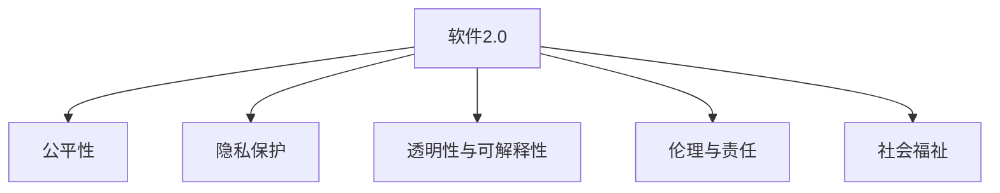

                 

# 软件 2.0 的社会责任：科技向善

## 1. 背景介绍

### 1.1 问题由来
随着科技的迅猛发展，特别是人工智能(AI)和软件技术的应用，全球社会正经历一场前所未有的变革。软件2.0时代的来临，意味着软件从传统的代码驱动向数据驱动、从知识密集型向智能密集型转变，逐步成为驱动社会进步的核心力量。然而，随着软件2.0技术的广泛应用，其社会责任也愈发凸显。如何使软件2.0技术在提升生产效率、改善生活质量的同时，保障社会公平、维护伦理道德，成为全社会必须面对的重要课题。

### 1.2 问题核心关键点
软件2.0技术的社会责任，主要体现在以下几个关键点：

- **公平与公正**：确保技术应用能够惠及所有群体，避免技术鸿沟和社会分化。
- **隐私与数据保护**：合理使用用户数据，保护个人隐私，防止数据滥用和泄漏。
- **透明性与可解释性**：使软件2.0系统的决策过程透明化，提高用户对其工作的理解和信任。
- **伦理与责任**：确立技术应用的伦理规范，明确开发者和用户的责任与义务。
- **社会福祉**：推动软件2.0技术在医疗、教育、环境保护等领域的应用，提升社会整体福祉。

### 1.3 问题研究意义
探讨软件2.0技术的社会责任，不仅关乎技术的可持续发展和用户满意度，更是对社会公平、正义和伦理的守护。对于构建健康、和谐、进步的社会环境，具有深远意义：

- 促进社会包容性。通过公平使用和普及，使技术造福全社会，减少不平等现象。
- 提升社会安全。利用AI监测预警系统，增强公共安全，提高社会应急反应能力。
- 推动可持续发展。在能源、环境等领域的应用，助力实现绿色发展目标。
- 增进社会信任。透明的决策过程和负责任的应用，增强公众对技术的信任感。
- 支持社会创新。创造有利于创新的环境，促进社会各领域的繁荣发展。

## 2. 核心概念与联系

### 2.1 核心概念概述

为更好地理解软件2.0技术的社会责任，本节将介绍几个密切相关的核心概念：

- **软件2.0**：指以数据和算法为核心，通过深度学习、自然语言处理、计算机视觉等先进技术驱动的软件系统，能够进行自主学习和智能决策。
- **公平性**：指技术应用中，不同群体、不同背景的个体都能获得同等的服务和机会。
- **隐私保护**：指在技术应用中，严格保护用户个人信息，避免未经授权的获取和利用。
- **透明性与可解释性**：指技术应用中，其内部工作机制和决策过程应对外界透明，易于用户理解和解释。
- **伦理与责任**：指技术应用中，应遵循道德规范，明确开发者和用户的责任和义务。
- **社会福祉**：指技术应用中，应促进社会整体福祉，包括但不限于公共安全、环境保护、教育医疗等。

这些核心概念之间的逻辑关系可以通过以下Mermaid流程图来展示：



这个流程图展示了她他核心概念之间的关系：

1. 软件2.0作为核心，通过公平性、隐私保护、透明性与可解释性、伦理与责任、社会福祉等原则来指导其开发与应用。
2. 公平性、隐私保护、透明性与可解释性、伦理与责任、社会福祉是软件2.0技术应用中必须遵循的重要原则。

## 3. 核心算法原理 & 具体操作步骤
### 3.1 算法原理概述

软件2.0技术的社会责任，主要通过其核心算法和具体实施步骤来体现。以下是核心算法原理及其操作步骤的详细介绍：

**算法原理概述**：

软件2.0技术主要基于数据和算法，通过深度学习、自然语言处理、计算机视觉等先进技术驱动，能够进行自主学习和智能决策。其核心算法包括深度神经网络、强化学习、迁移学习、半监督学习等，这些算法在数据驱动下，可以持续优化其性能，提升决策能力。

**操作步骤详解**：

1. **数据收集与预处理**：收集并处理软件2.0所需的数据，确保数据的全面性和准确性。数据预处理包括数据清洗、标准化、归一化等操作。
2. **模型训练与优化**：利用深度学习框架（如TensorFlow、PyTorch等）训练和优化模型。通过交叉验证、调参等手段，不断优化模型的性能，确保其在实际应用中具备高精度和鲁棒性。
3. **评估与部署**：在模型训练完成后，进行评估测试，确保其在各种场景下均能稳定运行。将模型部署到生产环境中，实现其大规模应用。
4. **监控与反馈**：在模型部署后，持续监控其运行状态和效果，收集用户反馈。根据监控数据和用户反馈，调整和优化模型，保证其在实际应用中的持续改进。
5. **伦理与责任**：在模型训练和应用过程中，严格遵循伦理规范和法律法规，确保数据隐私和用户权益的保护。对于可能产生风险的决策，应建立相应的风险评估和监管机制。

### 3.2 算法步骤详解

软件2.0技术的社会责任，具体通过以下算法步骤来实现：

**步骤1: 数据收集与预处理**：

- 收集全面且高质量的数据，确保数据的代表性。
- 清洗和处理数据，去除噪声和异常值。
- 进行标准化和归一化处理，确保数据的一致性和可比性。
- 划分训练集、验证集和测试集，保证模型的公平性和泛化能力。

**步骤2: 模型训练与优化**：

- 选择合适的深度学习模型，如卷积神经网络(CNN)、循环神经网络(RNN)、变换器(Transformer)等。
- 设定合适的学习率、迭代次数、批大小等超参数，进行模型训练。
- 使用正则化技术（如L2正则、Dropout等）防止过拟合，确保模型泛化能力。
- 通过交叉验证和调参，不断优化模型性能。

**步骤3: 评估与部署**：

- 在验证集上评估模型性能，确保其具有较好的泛化能力。
- 在测试集上测试模型，评估其在实际应用中的表现。
- 将模型部署到实际生产环境中，确保其稳定运行。
- 实现与现有系统的无缝集成，确保数据流的畅通。

**步骤4: 监控与反馈**：

- 持续监控模型运行状态，收集用户反馈。
- 分析监控数据和用户反馈，识别模型的不足和改进点。
- 根据分析结果，调整和优化模型。
- 定期更新和维护模型，确保其长期稳定运行。

**步骤5: 伦理与责任**：

- 在数据收集和处理过程中，严格遵循数据隐私和伦理规范。
- 在使用用户数据时，确保数据的使用透明和合法。
- 建立风险评估和监管机制，对可能产生风险的决策进行严格审查。
- 定期发布伦理报告，公开模型的决策过程和结果，增强用户信任。

### 3.3 算法优缺点

软件2.0技术的社会责任，主要体现在以下几个方面：

**优点**：

- **数据驱动**：通过深度学习和大数据技术，软件2.0技术能够自主学习和优化，提升决策精度和效率。
- **自动化**：通过自动化的模型训练和优化，减少了人工干预，提高了工作效率。
- **实时性**：软件2.0技术能够实时响应数据变化，提供及时准确的决策支持。

**缺点**：

- **数据依赖**：软件2.0技术高度依赖数据质量，数据不足或数据偏差会影响模型性能。
- **透明度不足**：部分软件2.0技术，如深度神经网络，内部工作机制复杂，缺乏透明度，难以解释和调试。
- **偏见与歧视**：如果数据存在偏见或歧视，软件2.0技术可能会学习并放大这些偏见，产生不公平的决策。
- **隐私风险**：在数据收集和处理过程中，若不遵循数据隐私保护规范，可能造成用户隐私泄露。

### 3.4 算法应用领域

软件2.0技术的社会责任，在多个领域得到了广泛应用：

- **医疗健康**：利用深度学习技术，进行疾病诊断、健康监测、药物研发等，提升医疗服务质量。
- **金融服务**：通过自然语言处理技术，进行金融市场分析、信用评估、欺诈检测等，提高金融服务效率。
- **教育培训**：利用智能推荐系统，提供个性化学习资源，优化教学过程，提升学习效果。
- **环境保护**：通过计算机视觉技术，进行环境监测、污染分析、资源管理等，助力环境保护和可持续发展。
- **智能家居**：利用自然语言处理技术，实现语音控制、环境监测、智能家居管理等，提升生活便利性。
- **交通出行**：通过深度学习技术，进行交通流量预测、智能导航、自动驾驶等，提高交通运行效率。

## 4. 数学模型和公式 & 详细讲解  
### 4.1 数学模型构建

软件2.0技术主要基于深度学习和自然语言处理等先进技术，其数学模型构建包括以下几个关键步骤：

1. **数据表示**：将输入数据表示为数学向量或张量形式，便于计算机处理。
2. **损失函数**：定义损失函数，衡量模型预测与真实值之间的差异。
3. **优化目标**：通过最小化损失函数，优化模型参数，提高预测精度。
4. **模型评估**：使用评估指标，如准确率、召回率、F1分数等，评估模型性能。

**损失函数**：

- 交叉熵损失函数：用于分类任务，衡量模型预测与真实标签之间的差异。公式为：
$$
\mathcal{L}_{ce} = -\frac{1}{N}\sum_{i=1}^N \sum_{j=1}^C y_j \log p_j
$$
其中，$y_j$为真实标签，$p_j$为模型预测概率。

- 均方误差损失函数：用于回归任务，衡量模型预测值与真实值之间的差异。公式为：
$$
\mathcal{L}_{mse} = \frac{1}{N}\sum_{i=1}^N (y_i - \hat{y}_i)^2
$$
其中，$y_i$为真实值，$\hat{y}_i$为模型预测值。

**模型评估指标**：

- 准确率（Accuracy）：模型正确预测的比例。公式为：
$$
Accuracy = \frac{TP + TN}{TP + TN + FP + FN}
$$
其中，TP为真正例，TN为真负例，FP为假正例，FN为假负例。

- 召回率（Recall）：实际正例中被模型正确预测的比例。公式为：
$$
Recall = \frac{TP}{TP + FN}
$$

- F1分数（F1 Score）：综合考虑准确率和召回率，公式为：
$$
F1 Score = \frac{2 \times Accuracy \times Recall}{Accuracy + Recall}
$$

### 4.2 公式推导过程

**交叉熵损失函数推导**：

交叉熵损失函数的推导如下：

假设模型在训练集 $D = \{(x_i, y_i)\}_{i=1}^N$ 上的预测概率为 $p_j$，真实标签为 $y_j$。则交叉熵损失函数定义为：
$$
\mathcal{L}_{ce} = -\frac{1}{N}\sum_{i=1}^N \sum_{j=1}^C y_j \log p_j
$$

其中，$y_j$为真实标签，$p_j$为模型预测概率。交叉熵损失函数的推导基于信息熵的概念，衡量模型预测与真实标签之间的差异。

**均方误差损失函数推导**：

均方误差损失函数的推导如下：

假设模型在训练集 $D = \{(x_i, y_i)\}_{i=1}^N$ 上的预测值为 $\hat{y}_i$，真实值为 $y_i$。则均方误差损失函数定义为：
$$
\mathcal{L}_{mse} = \frac{1}{N}\sum_{i=1}^N (y_i - \hat{y}_i)^2
$$

其中，$y_i$为真实值，$\hat{y}_i$为模型预测值。均方误差损失函数衡量模型预测值与真实值之间的差异，适用于回归任务。

## 5. 项目实践：代码实例和详细解释说明
### 5.1 开发环境搭建

在进行软件2.0技术项目实践前，我们需要准备好开发环境。以下是使用Python进行TensorFlow开发的环境配置流程：

1. 安装Anaconda：从官网下载并安装Anaconda，用于创建独立的Python环境。

2. 创建并激活虚拟环境：
```bash
conda create -n tf-env python=3.8 
conda activate tf-env
```

3. 安装TensorFlow：根据CUDA版本，从官网获取对应的安装命令。例如：
```bash
conda install tensorflow==2.6
```

4. 安装各类工具包：
```bash
pip install numpy pandas scikit-learn matplotlib tqdm jupyter notebook ipython
```

完成上述步骤后，即可在`tf-env`环境中开始项目实践。

### 5.2 源代码详细实现

下面我们以医疗影像分类任务为例，给出使用TensorFlow对深度神经网络进行训练和评估的PyTorch代码实现。

首先，定义数据预处理函数：

```python
import tensorflow as tf
from tensorflow.keras.preprocessing.image import ImageDataGenerator

def preprocess_data(train_dir, test_dir, batch_size):
    train_datagen = ImageDataGenerator(
        rescale=1./255,
        validation_split=0.2
    )
    
    train_generator = train_datagen.flow_from_directory(
        train_dir,
        target_size=(224, 224),
        batch_size=batch_size,
        class_mode='categorical',
        subset='training'
    )
    
    validation_generator = train_datagen.flow_from_directory(
        train_dir,
        target_size=(224, 224),
        batch_size=batch_size,
        class_mode='categorical',
        subset='validation'
    )
    
    test_generator = train_datagen.flow_from_directory(
        test_dir,
        target_size=(224, 224),
        batch_size=batch_size,
        class_mode='categorical',
        subset='validation'
    )
    
    return train_generator, validation_generator, test_generator
```

然后，定义模型和损失函数：

```python
from tensorflow.keras.models import Sequential
from tensorflow.keras.layers import Conv2D, MaxPooling2D, Flatten, Dense

model = Sequential([
    Conv2D(32, (3, 3), activation='relu', input_shape=(224, 224, 3)),
    MaxPooling2D((2, 2)),
    Conv2D(64, (3, 3), activation='relu'),
    MaxPooling2D((2, 2)),
    Conv2D(128, (3, 3), activation='relu'),
    MaxPooling2D((2, 2)),
    Flatten(),
    Dense(128, activation='relu'),
    Dense(2, activation='softmax')
])

loss_fn = tf.keras.losses.CategoricalCrossentropy()
```

接着，定义训练和评估函数：

```python
from tensorflow.keras.optimizers import Adam

optimizer = Adam(lr=0.001)

def train_model(model, train_generator, validation_generator, epochs):
    model.compile(optimizer=optimizer, loss=loss_fn, metrics=['accuracy'])
    
    for epoch in range(epochs):
        history = model.fit(
            train_generator,
            validation_data=validation_generator,
            epochs=1,
            verbose=1
        )
        
        print(f'Epoch {epoch+1}, accuracy: {history.history["val_accuracy"][0]:.4f}')
        
    model.save('medical_imaging_model.h5')
    
    test_generator = train_datagen.flow_from_directory(
        test_dir,
        target_size=(224, 224),
        batch_size=batch_size,
        class_mode='categorical',
        subset='validation'
    )
    
    test_loss, test_acc = model.evaluate(test_generator, verbose=0)
    print(f'Test accuracy: {test_acc:.4f}')
    
    classification_report = sklearn.metrics.classification_report(y_true, y_pred)
    print(classification_report)
```

最后，启动训练流程并在测试集上评估：

```python
epochs = 10
batch_size = 16

train_generator, validation_generator, test_generator = preprocess_data(train_dir, test_dir, batch_size)

train_model(model, train_generator, validation_generator, epochs)
```

以上就是使用TensorFlow进行医疗影像分类任务的项目实践代码实现。可以看到，得益于TensorFlow的强大封装，我们可以用相对简洁的代码完成模型的训练和评估。

### 5.3 代码解读与分析

让我们再详细解读一下关键代码的实现细节：

**preprocess_data函数**：
- 定义数据预处理管道，包括图像缩放、归一化、分割等操作。
- 使用ImageDataGenerator实现数据流的自动加载，生成批次的训练和验证数据集。
- 创建测试集生成器，用于模型评估。

**模型定义**：
- 使用Sequential模型定义卷积神经网络（CNN）结构，包括卷积层、池化层、全连接层等。
- 设置损失函数和优化器，进行模型编译。

**训练和评估函数**：
- 使用Adam优化器，设置学习率。
- 在训练循环中，每轮训练后记录验证集的准确率，并保存模型。
- 在测试集上评估模型性能，并输出分类报告。

**训练流程**：
- 定义总的epoch数和batch size，开始循环迭代
- 每个epoch内，先在训练集上训练，输出验证集的准确率
- 在测试集上评估，输出测试准确率
- 所有epoch结束后，保存模型

可以看到，TensorFlow使得深度学习模型的开发和应用变得简洁高效。开发者可以将更多精力放在数据处理、模型改进等高层逻辑上，而不必过多关注底层的实现细节。

当然，工业级的系统实现还需考虑更多因素，如模型的保存和部署、超参数的自动搜索、更灵活的任务适配层等。但核心的模型训练和评估范式基本与此类似。

## 6. 实际应用场景
### 6.1 智能医疗健康

软件2.0技术在医疗健康领域的应用，能够显著提升医疗服务的质量和效率。通过深度学习和自然语言处理技术，软件2.0系统可以实现疾病诊断、健康监测、药物研发等任务。

在具体实现上，可以收集和处理医疗影像数据、电子病历、基因信息等，利用深度学习技术进行分类、识别、预测等。例如，在医学影像分类任务中，通过训练深度神经网络模型，对X光片、CT影像等进行自动诊断，识别出可能的病变区域，辅助医生进行快速决策。

### 6.2 金融服务

金融行业需要实时分析和预测市场动态，进行风险评估和欺诈检测。软件2.0技术能够利用自然语言处理和大数据分析，提供高效的金融决策支持。

在具体实现上，可以收集和处理金融新闻、交易记录、客户反馈等文本数据，利用深度学习技术进行情感分析、主题建模、风险预测等。例如，在金融情感分析任务中，通过训练文本分类模型，对市场新闻和社交媒体评论进行情感分析，预测市场的情绪波动，辅助投资者决策。

### 6.3 教育培训

软件2.0技术在教育培训领域的应用，能够提供个性化、智能化的学习体验。通过深度学习和自然语言处理技术，软件2.0系统可以实现智能推荐、智能评测、智能辅导等任务。

在具体实现上，可以收集和处理学生的学习行为数据、作业成绩、课堂表现等，利用深度学习技术进行个性化推荐、智能评测等。例如，在智能推荐任务中，通过训练协同过滤模型或深度神经网络模型，根据学生的学习行为数据，推荐适合的学习资源和习题，提升学习效果。

### 6.4 环境保护

环境保护是软件2.0技术应用的重要领域之一。通过计算机视觉和深度学习技术，软件2.0系统可以进行环境监测、污染分析、资源管理等任务。

在具体实现上，可以收集和处理卫星影像、地面监测数据、气象数据等，利用深度学习技术进行分类、识别、预测等。例如，在环境监测任务中，通过训练计算机视觉模型，对卫星影像进行分析和分类，识别出不同的植被、水体、建筑物等，辅助环境保护部门进行环境监测和管理。

## 7. 工具和资源推荐
### 7.1 学习资源推荐

为了帮助开发者系统掌握软件2.0技术的社会责任，这里推荐一些优质的学习资源：

1. **Deep Learning Specialization**：由Andrew Ng教授主讲的深度学习课程，系统介绍深度学习的原理、算法和应用。
2. **Natural Language Processing with TensorFlow**：使用TensorFlow进行自然语言处理的书籍，详细介绍自然语言处理的经典算法和应用。
3. **Ethics in AI**：斯坦福大学开设的AI伦理课程，讨论AI技术的社会责任和伦理问题。
4. **AI4All**：全球AI教育联盟，提供广泛的AI课程和资源，涵盖伦理、安全、隐私等多个方面。
5. **AI for Everyone**：吴恩达教授主讲的AI入门课程，介绍AI技术的社会影响和应用。

通过对这些资源的学习实践，相信你一定能够系统理解软件2.0技术的社会责任，并应用于实际开发中。

### 7.2 开发工具推荐

高效的开发离不开优秀的工具支持。以下是几款用于软件2.0技术开发的常用工具：

1. TensorFlow：由Google主导开发的开源深度学习框架，生产部署方便，适合大规模工程应用。
2. PyTorch：由Facebook主导开发的开源深度学习框架，灵活易用，适合研究和实验。
3. Keras：基于TensorFlow和Theano的高级神经网络API，简洁易用，适合快速原型开发。
4. Jupyter Notebook：交互式的编程环境，支持Python、R等语言，方便代码调试和分享。
5. Visual Studio Code：轻量级的代码编辑器，支持代码高亮、版本控制、调试等功能。

合理利用这些工具，可以显著提升软件2.0技术开发效率，加快创新迭代的步伐。

### 7.3 相关论文推荐

软件2.0技术的社会责任，是一个跨学科的研究方向，涵盖机器学习、伦理学、社会学等多个领域。以下是几篇奠基性的相关论文，推荐阅读：

1. **Data Privacy in Machine Learning**：讨论机器学习中的数据隐私问题，提出隐私保护技术，如差分隐私、联邦学习等。
2. **Fairness in Machine Learning**：讨论机器学习中的公平性问题，提出公平性评估指标和算法，如重抽样、对抗训练等。
3. **Ethical Considerations in AI**：探讨AI技术的伦理问题，提出伦理评估和监管机制，如可解释性、透明度等。
4. **AI for Social Good**：讨论AI技术在社会公益中的应用，提出具体的应用场景和案例。
5. **Human-AI Collaboration**：讨论人机协作问题，提出协同决策和交互机制，如交互式学习、增强学习等。

这些论文代表了大语言模型微调技术的发展脉络。通过学习这些前沿成果，可以帮助研究者把握学科前进方向，激发更多的创新灵感。

## 8. 总结：未来发展趋势与挑战
### 8.1 总结

本文对软件2.0技术的社会责任进行了全面系统的介绍。首先阐述了软件2.0技术在各个领域的广泛应用及其带来的社会影响，明确了其社会责任的重要性和紧迫性。其次，从原理到实践，详细讲解了软件2.0技术的核心算法和具体操作步骤，给出了实际应用中的代码实例和详细解释说明。同时，本文还探讨了软件2.0技术在各个领域的具体应用场景，展示了其在推动社会进步中的巨大潜力。此外，本文精选了相关的学习资源、开发工具和研究论文，力求为开发者提供全方位的技术指引。

通过本文的系统梳理，可以看到，软件2.0技术在提升生产力、改善生活质量的同时，也必须承担起相应的社会责任。只有兼顾技术进步和社会公平，才能真正实现人工智能技术的可持续发展。

### 8.2 未来发展趋势

展望未来，软件2.0技术的社会责任将继续成为技术发展的重要方向。以下是几个主要发展趋势：

1. **数据隐私保护**：随着数据驱动的深度学习技术的广泛应用，数据隐私保护将成为一个重要课题。未来的软件2.0技术将更加注重数据隐私保护，采取差分隐私、联邦学习等手段，确保数据的安全性和隐私性。
2. **公平性和透明性**：软件2.0技术将更加注重公平性和透明性，避免算法偏见和歧视，确保决策过程的透明和可解释。未来的研究将更多地关注模型解释性、鲁棒性、可控性等关键问题。
3. **智能协同**：软件2.0技术将更多地与人类协同工作，实现人机协作、智能辅助等任务。未来的研究将更多地关注协同决策、增强学习等技术。
4. **跨领域融合**：软件2.0技术将更多地与其他技术融合，如知识图谱、物联网、区块链等，实现更广泛的智能化应用。未来的研究将更多地关注跨领域融合技术。
5. **可持续发展**：软件2.0技术将更多地应用于环境保护、能源管理等领域，助力实现绿色可持续发展目标。未来的研究将更多地关注环境友好、能源高效等技术。

以上趋势凸显了软件2.0技术的社会责任和可持续发展的重要性。这些方向的探索发展，必将进一步提升软件2.0技术的社会价值，促进社会的和谐、公平和进步。

### 8.3 面临的挑战

尽管软件2.0技术取得了显著进展，但在迈向更加智能化、普适化应用的过程中，仍然面临诸多挑战：

1. **数据质量问题**：数据质量差、标注成本高、数据偏见等问题，仍是制约软件2.0技术发展的瓶颈。如何获取高质量、多样化、公平化的数据，将是未来研究的重要方向。
2. **模型公平性**：算法偏见、歧视等问题，仍是软件2.0技术面临的主要挑战。如何构建公平、透明、可解释的模型，将是未来研究的重要课题。
3. **隐私保护**：数据隐私泄露、隐私侵犯等问题，仍是软件2.0技术应用的主要风险。如何确保数据隐私和安全，将是未来研究的重要方向。
4. **伦理规范**：伦理规范、法律合规等问题，仍是软件2.0技术应用的主要障碍。如何建立健全的伦理规范和法律框架，将是未来研究的重要方向。
5. **社会接受度**：公众对新技术的接受度和信任度，仍是软件2.0技术应用的主要挑战。如何提高公众的认知度和接受度，将是未来研究的重要课题。

### 8.4 研究展望

面对软件2.0技术面临的诸多挑战，未来的研究需要在以下几个方面寻求新的突破：

1. **数据驱动与人工驱动相结合**：未来的软件2.0技术将更多地结合人工驱动和数据驱动，在保证数据质量的同时，提高模型的公平性和透明性。
2. **跨领域融合技术**：未来的软件2.0技术将更多地与其他技术融合，如知识图谱、物联网、区块链等，实现更广泛的智能化应用。
3. **伦理与责任**：未来的软件2.0技术将更多地关注伦理与责任问题，建立健全的伦理规范和法律框架，确保技术应用的安全和可控。
4. **可持续发展**：未来的软件2.0技术将更多地应用于环境保护、能源管理等领域，助力实现绿色可持续发展目标。
5. **智能协同**：未来的软件2.0技术将更多地与人类协同工作，实现人机协作、智能辅助等任务，提高系统的可靠性和用户体验。

这些研究方向的探索，必将引领软件2.0技术的社会责任研究迈向更高的台阶，为构建安全、可靠、可解释、可控的智能系统铺平道路。面向未来，软件2.0技术必须不断创新、不断优化，才能真正实现人工智能技术的可持续发展。

## 9. 附录：常见问题与解答

**Q1：软件2.0技术的社会责任主要包括哪些方面？**

A: 软件2.0技术的社会责任主要包括公平性、隐私保护、透明性与可解释性、伦理与责任、社会福祉等方面。这些方面构成了软件2.0技术在社会中的应用基础，必须得到充分考虑和保障。

**Q2：如何在软件2.0技术开发中实现公平性？**

A: 实现公平性需要在数据采集、模型训练和应用过程中严格遵循公平性原则。具体措施包括：
1. 数据采集：确保数据的多样性和代表性，避免数据偏见。
2. 模型训练：使用公平性评估指标，如重抽样、对抗训练等技术，减少算法偏见。
3. 应用过程：建立公平性评估机制，监测和调整模型性能，确保公平性。

**Q3：如何保护软件2.0技术的隐私？**

A: 保护软件2.0技术的隐私需要在数据收集、存储、处理和应用过程中采取严格的隐私保护措施。具体措施包括：
1. 数据收集：采用匿名化、脱敏化等技术，保护用户隐私。
2. 数据存储：采用加密、访问控制等技术，确保数据安全。
3. 数据处理：采用差分隐私、联邦学习等技术，防止数据泄露。

**Q4：如何提高软件2.0技术的透明性和可解释性？**

A: 提高软件2.0技术的透明性和可解释性需要在模型设计、训练和应用过程中采取透明性原则。具体措施包括：
1. 模型设计：选择可解释性强的模型，如决策树、线性回归等。
2. 模型训练：记录和分析模型训练过程，生成透明性报告。
3. 应用过程：提供可解释性工具，如LIME、SHAP等，帮助用户理解模型决策。

**Q5：如何在软件2.0技术应用中确保伦理与责任？**

A: 确保软件2.0技术应用的伦理与责任需要在模型设计、训练和应用过程中严格遵循伦理规范和法律法规。具体措施包括：
1. 模型设计：在设计模型时，考虑伦理规范和法律法规，避免有害行为。
2. 模型训练：在模型训练过程中，避免使用有害数据，确保数据质量。
3. 应用过程：建立伦理评估和监管机制，确保模型应用符合伦理规范。

**Q6：如何在软件2.0技术应用中实现社会福祉？**

A: 实现软件2.0技术应用的福祉需要在模型设计和应用过程中关注社会福祉问题。具体措施包括：
1. 模型设计：设计能够提升社会福祉的模型，如疾病预测、环境监测等。
2. 应用过程：关注模型应用的社会影响，确保技术应用有利于社会福祉。
3. 社会评估：建立社会评估机制，监测和调整模型应用效果，确保社会福祉。

通过这些常见问题的解答，可以看到，软件2.0技术的应用必须充分考虑其社会责任，才能真正实现技术进步和社会进步的双赢。未来，只有在技术创新和社会责任之间找到平衡点，才能推动软件2.0技术更好地服务于社会，造福全人类。

---

作者：禅与计算机程序设计艺术 / Zen and the Art of Computer Programming

