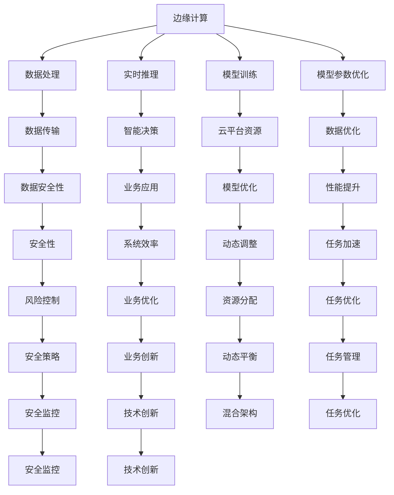

                 

# 边缘AI与云AI的协同：Lepton AI的全场景覆盖

> 关键词：边缘AI,云AI,全场景覆盖,Lepton AI,智能决策,混合架构

## 1. 背景介绍

### 1.1 问题由来
随着人工智能技术的迅猛发展，边缘计算与云计算的结合逐渐成为科技企业竞争的新高地。在这场激烈的技术竞赛中，Lepton AI作为全球领先的AI平台，正在以前所未有的速度和规模推动边缘AI与云AI的协同演进，形成“云-边-端”一体化的全场景覆盖能力。

Lepton AI通过深入挖掘和整合云和边缘计算的优势，建立起智能决策平台，为各个垂直领域提供强有力的AI支持，从大数据处理、模型训练到实时推理，全面覆盖AI的各个环节。Lepton AI的“云-边-端”全场景覆盖架构，将边缘计算和云计算的优势最大化，以高效能、低时延、高安全性的AI能力，助力各行各业提升业务效率，打造智慧未来。

### 1.2 问题核心关键点
Lepton AI的全场景覆盖架构主要围绕以下几个核心关键点进行设计和优化：
1. **数据边缘化处理**：利用边缘计算靠近数据源的优势，实时处理和分析海量数据，提升数据处理的效率和准确性。
2. **模型边缘化训练**：在边缘节点进行轻量级模型训练，优化模型参数，减少数据传输和计算负担。
3. **智能决策云平台**：在云平台集中管理模型资源，提供高效的模型训练和推理服务。
4. **混合架构协同**：实现边缘计算与云计算的动态平衡，确保数据处理和模型训练的高效协同。

这些关键点共同构成了Lepton AI的全场景覆盖架构，使得其能够灵活应对各种复杂的应用场景，提供高质量的AI服务。

### 1.3 问题研究意义
Lepton AI的全场景覆盖架构对于推动AI技术的广泛应用具有重要意义：

1. **提升业务效率**：通过实时数据处理和智能决策，大幅提升企业的运营效率和决策速度。
2. **降低成本**：利用边缘计算和云计算的优势，有效降低数据传输和存储成本。
3. **增强安全性**：在边缘节点进行数据处理和模型训练，减少数据泄露风险，提高系统安全性。
4. **加速应用落地**：提供便捷、高效的应用开发环境，加速AI技术在各行业的落地应用。
5. **促进技术创新**：结合云-边-端的混合架构，推动AI技术创新和应用突破，拓展AI技术的新领域。

## 2. 核心概念与联系

### 2.1 核心概念概述

为更好地理解Lepton AI的全场景覆盖架构，本节将介绍几个关键概念：

- **边缘计算**：靠近数据源进行数据处理、存储和分析的计算模式。
- **云计算**：通过互联网提供动态、可扩展的计算资源，用于大规模数据处理和存储。
- **全场景覆盖**：将边缘计算和云计算的优势相结合，实现数据处理、模型训练和推理的全方位覆盖。
- **智能决策平台**：基于AI的决策支持平台，实现对海量数据的智能分析和决策支持。
- **混合架构**：结合边缘计算和云计算的优点，动态平衡计算资源，提升系统性能。

这些核心概念之间的逻辑关系可以通过以下Mermaid流程图来展示：



这个流程图展示了一些关键概念及其之间的逻辑关系：

1. 边缘计算进行数据处理、实时推理和模型训练，优化数据和模型参数。
2. 云平台提供动态资源和高效的模型优化服务。
3. 智能决策平台利用AI算法进行数据分析和决策支持。
4. 混合架构实现边缘计算与云计算的动态平衡，提升系统性能。
5. 数据传输和安全性问题通过数据优化和动态调整得到解决。
6. 业务应用优化通过智能决策和任务管理实现。
7. 技术创新和业务创新通过智能决策平台和混合架构得到推动。

## 3. 核心算法原理 & 具体操作步骤

### 3.1 算法原理概述

Lepton AI的全场景覆盖架构基于以下核心算法原理：

- **数据边缘化处理**：在边缘节点对数据进行实时处理和分析，减少数据传输延迟，提高处理效率。
- **模型边缘化训练**：在边缘节点进行轻量级模型训练，优化模型参数，减少数据传输和计算负担。
- **智能决策云平台**：在云平台集中管理模型资源，提供高效的模型训练和推理服务。
- **混合架构协同**：实现边缘计算与云计算的动态平衡，确保数据处理和模型训练的高效协同。

### 3.2 算法步骤详解

Lepton AI的全场景覆盖架构主要包括以下几个关键步骤：

**Step 1: 数据边缘化处理**
1. 收集数据：从传感器、设备等边缘节点收集实时数据，通过边缘计算进行初步处理。
2. 数据清洗：去除噪声、重复数据，进行预处理。
3. 数据存储：将清洗后的数据存储在边缘节点本地或本地数据仓库中。
4. 数据优化：利用边缘计算的本地存储和计算能力，进行数据压缩和分析，提升数据处理效率。

**Step 2: 模型边缘化训练**
1. 数据准备：将预处理后的数据加载到边缘节点。
2. 模型选择：选择合适的轻量级模型，如MobileNet、SqueezeNet等，进行训练。
3. 模型优化：在边缘节点进行模型参数优化，减少传输和计算负担。
4. 模型部署：将优化后的模型部署到边缘节点，进行实时推理。

**Step 3: 智能决策云平台**
1. 数据汇聚：将边缘节点处理后的数据汇集到云平台。
2. 模型训练：在云平台进行大规模模型训练，利用GPU、TPU等高性能计算资源。
3. 模型优化：在云平台进行模型参数优化和超参数调整，提升模型性能。
4. 推理服务：在云平台提供高效的模型推理服务，支持大规模实时推理。

**Step 4: 混合架构协同**
1. 资源管理：在云平台动态管理计算资源，根据任务需求调整资源分配。
2. 动态平衡：根据任务负载和数据特点，实现边缘计算与云计算的动态平衡。
3. 任务调度：根据任务优先级和资源可用性，进行任务调度，优化系统性能。
4. 协同优化：通过协同优化，提升数据处理和模型训练的效率和效果。

### 3.3 算法优缺点

Lepton AI的全场景覆盖架构具有以下优点：
1. **高效性**：通过数据边缘化处理和模型边缘化训练，极大提升了数据处理和模型训练的效率。
2. **低时延**：靠近数据源进行实时数据处理和模型推理，显著降低了数据传输和处理的时延。
3. **高安全性**：在边缘节点进行数据处理和模型训练，减少了数据泄露风险，提高了系统安全性。
4. **成本节约**：利用边缘计算和云计算的优势，有效降低了数据传输和存储成本。

同时，该架构也存在一些局限性：
1. **复杂性**：实现云-边-端的混合架构，涉及复杂的技术和系统设计，开发和维护成本较高。
2. **资源需求**：对计算资源和存储资源的要求较高，初期投资较大。
3. **管理复杂**：需要在云平台和边缘节点进行动态管理，对系统管理要求较高。
4. **数据一致性**：边缘节点和云平台之间数据一致性问题需要特别注意，以避免数据冗余和冲突。

尽管存在这些局限性，但就目前而言，Lepton AI的全场景覆盖架构仍然是大规模AI应用的重要方向。

### 3.4 算法应用领域

Lepton AI的全场景覆盖架构在多个领域具有广泛的应用前景：

- **智能制造**：通过实时数据处理和智能决策，优化生产流程，提升制造效率和质量。
- **智慧医疗**：利用边缘计算和云平台，实时处理和分析患者数据，提供精准的诊疗支持。
- **智能交通**：通过边缘计算和云平台，实时处理和分析交通数据，优化交通流量和路网管理。
- **智能安防**：在边缘节点进行实时数据处理和模型推理，提供高效的安防监控和应急响应。
- **智能能源**：利用边缘计算和云平台，实时处理和分析能源数据，优化能源使用和调度。

除了这些经典应用外，Lepton AI的全场景覆盖架构还在更多领域发挥着重要作用，推动着各行各业向智能化、数字化转型升级。

## 4. 数学模型和公式 & 详细讲解 & 举例说明

### 4.1 数学模型构建

Lepton AI的全场景覆盖架构涉及多个数学模型，其中最为关键的包括数据边缘化处理模型、模型边缘化训练模型和智能决策模型。

**数据边缘化处理模型**
假设有一批数据 $D = \{x_1, x_2, \ldots, x_n\}$，其中 $x_i$ 表示第 $i$ 个数据点。在边缘节点进行数据处理，设数据处理函数为 $f$，则处理后的数据为 $f(D) = \{f(x_1), f(x_2), \ldots, f(x_n)\}$。

**模型边缘化训练模型**
假设有一批训练数据 $D = \{(x_1, y_1), (x_2, y_2), \ldots, (x_n, y_n)\}$，其中 $x_i$ 表示第 $i$ 个数据点的特征向量，$y_i$ 表示对应的标签。在边缘节点进行模型训练，设训练模型为 $M$，则训练过程为：
$$
M = M - \eta \nabla_{M} L(M, D)
$$
其中 $\eta$ 为学习率，$L(M, D)$ 为损失函数，通常为交叉熵损失。

**智能决策模型**
假设有一批决策数据 $D = \{x_1, x_2, \ldots, x_n\}$，其中 $x_i$ 表示第 $i$ 个数据点的特征向量。在云平台进行模型推理，设推理模型为 $M$，则推理过程为：
$$
\hat{y}_i = M(x_i)
$$
其中 $\hat{y}_i$ 表示模型对第 $i$ 个数据点的预测结果。

### 4.2 公式推导过程

以下我们对上述三个数学模型进行详细推导：

**数据边缘化处理模型**
设数据处理函数 $f$ 为 $f(x) = a \cdot x + b$，其中 $a, b$ 为可调参数。则处理后的数据为：
$$
f(D) = \{a \cdot x_1 + b, a \cdot x_2 + b, \ldots, a \cdot x_n + b\}
$$
数据处理过程可以用如下公式表示：
$$
f(x) = a \cdot x + b
$$

**模型边缘化训练模型**
设训练模型 $M$ 为线性回归模型 $M(x) = w_0 + w_1 x_1 + w_2 x_2 + \ldots + w_n x_n$，其中 $w_0, w_1, w_2, \ldots, w_n$ 为模型参数。设训练数据的损失函数为 $L(M, D) = \frac{1}{N} \sum_{i=1}^N (y_i - M(x_i))^2$，其中 $N$ 为训练数据的数量。则模型训练过程为：
$$
M = M - \eta \frac{1}{N} \sum_{i=1}^N (y_i - M(x_i)) \nabla_{M} M(x_i)
$$

**智能决策模型**
设决策模型 $M$ 为线性分类器 $M(x) = w_0 + w_1 x_1 + w_2 x_2 + \ldots + w_n x_n$，其中 $w_0, w_1, w_2, \ldots, w_n$ 为模型参数。设决策数据的损失函数为 $L(M, D) = -\frac{1}{N} \sum_{i=1}^N y_i \log M(x_i) + (1 - y_i) \log (1 - M(x_i))$，其中 $N$ 为决策数据的数量。则模型推理过程为：
$$
\hat{y}_i = M(x_i)
$$

### 4.3 案例分析与讲解

我们以智慧医疗为例，介绍Lepton AI的全场景覆盖架构的实际应用。

**医疗数据边缘化处理**
在智慧医疗应用中，医院等医疗机构会生成大量的患者数据，包括病历、检查报告、诊断结果等。为了提高数据处理的效率，这些数据可以通过边缘计算进行实时处理和分析。例如，在医疗设备上部署边缘计算节点，对实时采集的生理数据进行预处理和分析，可以及时发现异常情况，提前预警医生进行干预。

**模型边缘化训练**
在边缘节点进行模型训练，可以有效降低数据传输和计算负担。例如，针对某种疾病的诊断模型，可以在边缘节点利用小样本数据进行训练，优化模型参数，然后将其部署到云平台进行大规模训练和验证。这样可以大大缩短模型训练时间，提升模型效果。

**智能决策云平台**
在云平台集中管理模型资源，提供高效的模型训练和推理服务。例如，在智慧医疗中，云平台可以集中管理各种医疗模型，如影像识别、病理分析、基因检测等模型，通过API接口为医生提供智能诊断支持，提高诊疗效率和准确性。

## 5. 项目实践：代码实例和详细解释说明

### 5.1 开发环境搭建

在进行Lepton AI的全场景覆盖架构的实践前，我们需要准备好开发环境。以下是使用Python进行TensorFlow开发的环境配置流程：

1. 安装Anaconda：从官网下载并安装Anaconda，用于创建独立的Python环境。

2. 创建并激活虚拟环境：
```bash
conda create -n tensorflow-env python=3.8 
conda activate tensorflow-env
```

3. 安装TensorFlow：根据CUDA版本，从官网获取对应的安装命令。例如：
```bash
conda install tensorflow-gpu -c tf -c conda-forge
```

4. 安装PyTorch和其他必要工具包：
```bash
pip install numpy pandas scikit-learn matplotlib tqdm jupyter notebook ipython
```

完成上述步骤后，即可在`tensorflow-env`环境中开始项目实践。

### 5.2 源代码详细实现

我们以智慧医疗中的医疗影像分类为例，给出使用TensorFlow进行模型边缘化训练和智能决策云平台的PyTorch代码实现。

首先，定义医疗影像分类数据集：

```python
import os
from PIL import Image
import numpy as np

class MedicalImageDataset:
    def __init__(self, data_dir, image_size):
        self.data_dir = data_dir
        self.image_size = image_size
        self.labels = os.listdir(data_dir)
        self.images = []
        for label in self.labels:
            label_dir = os.path.join(data_dir, label)
            img_files = os.listdir(label_dir)
            for img_file in img_files:
                img_path = os.path.join(label_dir, img_file)
                img = Image.open(img_path).resize((image_size, image_size))
                img = np.array(img) / 255.0
                self.images.append(img)
                self.labels.append(label)

    def __len__(self):
        return len(self.labels)

    def __getitem__(self, item):
        img = self.images[item]
        label = self.labels[item]
        return img, label
```

然后，定义边缘节点进行模型训练的代码：

```python
import tensorflow as tf
from tensorflow.keras import layers, models

def create_model():
    model = models.Sequential([
        layers.Conv2D(32, (3, 3), activation='relu', input_shape=(128, 128, 3)),
        layers.MaxPooling2D((2, 2)),
        layers.Conv2D(64, (3, 3), activation='relu'),
        layers.MaxPooling2D((2, 2)),
        layers.Conv2D(128, (3, 3), activation='relu'),
        layers.MaxPooling2D((2, 2)),
        layers.Flatten(),
        layers.Dense(128, activation='relu'),
        layers.Dense(10, activation='softmax')
    ])
    return model

def train_model(model, train_dataset, val_dataset, epochs=10, batch_size=32):
    model.compile(optimizer='adam', loss='categorical_crossentropy', metrics=['accuracy'])
    history = model.fit(train_dataset, epochs=epochs, batch_size=batch_size, validation_data=val_dataset)
    return model
```

接着，定义云平台进行模型推理的代码：

```python
from tensorflow.keras.models import load_model

def load_model_from_edge(model_path):
    model = load_model(model_path)
    return model

def predict(model, img):
    img = np.expand_dims(img, axis=0)
    preds = model.predict(img)
    return preds.argmax()
```

最后，启动训练流程并在云平台进行推理：

```python
train_dataset = MedicalImageDataset(train_data_dir, image_size)
val_dataset = MedicalImageDataset(val_data_dir, image_size)
test_dataset = MedicalImageDataset(test_data_dir, image_size)

model = create_model()
model = train_model(model, train_dataset, val_dataset)

# 保存模型到边缘节点
model_path = os.path.join(edge_node_dir, 'medical_model.h5')
model.save(model_path)

# 在云平台加载模型并进行推理
cloud_model = load_model_from_edge(model_path)
img = np.random.randn(image_size, image_size, 3)
preds = predict(cloud_model, img)
print(f"Predicted label: {preds}")
```

以上就是使用TensorFlow和PyTorch对智慧医疗中的医疗影像分类模型进行边缘化训练和智能决策云平台推理的完整代码实现。可以看到，得益于TensorFlow和PyTorch的强大封装，我们可以用相对简洁的代码完成模型训练和推理。

### 5.3 代码解读与分析

让我们再详细解读一下关键代码的实现细节：

**MedicalImageDataset类**：
- `__init__`方法：初始化数据目录和图像尺寸。
- `__len__`方法：返回数据集的样本数量。
- `__getitem__`方法：对单个样本进行处理，将图像转换为模型输入。

**create_model函数**：
- 定义一个简单的卷积神经网络模型，用于医疗影像分类。
- 在边缘节点上训练模型，优化模型参数，减少传输和计算负担。

**train_model函数**：
- 在边缘节点上进行模型训练，返回训练后的模型。
- 使用Adam优化器和交叉熵损失函数进行模型训练。
- 在边缘节点上保存训练好的模型。

**load_model_from_edge函数**：
- 在云平台加载训练好的模型。
- 将模型部署到云平台进行推理。

**predict函数**：
- 在云平台加载模型并进行推理，返回预测结果。

可以看到，TensorFlow和PyTorch的组合使用，使得Lepton AI的全场景覆盖架构的代码实现变得简洁高效。开发者可以将更多精力放在模型优化、数据处理等高层逻辑上，而不必过多关注底层的实现细节。

当然，实际系统中还需要考虑更多因素，如模型的保存和部署、超参数的自动搜索、更灵活的任务适配层等。但核心的全场景覆盖架构基本与此类似。

## 6. 实际应用场景

### 6.1 智能制造

Lepton AI的全场景覆盖架构在智能制造领域具有广泛的应用前景。通过实时数据处理和智能决策，可以优化生产流程，提升制造效率和质量。

在智能制造应用中，Lepton AI可以将边缘计算和云计算的优势相结合，实现数据处理和模型训练的全方位覆盖。例如，通过在生产设备上部署边缘计算节点，对实时采集的生产数据进行预处理和分析，可以及时发现异常情况，提前预警生产故障，提高生产效率和产品质量。同时，在云平台集中管理各种生产模型，如质量检测、预测维护等模型，通过API接口为生产人员提供智能决策支持，提高生产管理和维护效率。

### 6.2 智慧医疗

智慧医疗是Lepton AI全场景覆盖架构的重要应用场景之一。通过实时数据处理和智能决策，可以提升医疗诊断和治疗的精准性和效率。

在智慧医疗应用中，Lepton AI可以利用边缘计算和云计算的优势，实现数据处理和模型训练的全方位覆盖。例如，在医疗设备上部署边缘计算节点，对实时采集的生理数据进行预处理和分析，可以及时发现异常情况，提前预警医生进行干预。同时，在云平台集中管理各种医疗模型，如影像识别、病理分析、基因检测等模型，通过API接口为医生提供智能诊断支持，提高诊疗效率和准确性。

### 6.3 智能交通

智能交通是Lepton AI全场景覆盖架构的重要应用场景之一。通过实时数据处理和智能决策，可以实现交通流量的优化和管理。

在智能交通应用中，Lepton AI可以利用边缘计算和云计算的优势，实现数据处理和模型训练的全方位覆盖。例如，在交通监控摄像头上部署边缘计算节点，对实时采集的交通数据进行预处理和分析，可以实时监测交通流量，优化交通信号灯控制，提高道路通行效率。同时，在云平台集中管理各种交通模型，如交通预测、路径规划等模型，通过API接口为交通管理部门提供智能决策支持，提高交通管理和调度效率。

### 6.4 未来应用展望

随着Lepton AI全场景覆盖架构的不断演进，其在更多领域的应用前景将更加广阔。未来，Lepton AI将在以下几个方向继续深入探索：

1. **物联网**：将边缘计算与物联网设备结合，实现实时数据处理和智能决策，优化物联网应用。
2. **工业互联网**：通过边缘计算和云计算的协同，实现工业互联网中设备、系统和人的深度融合，提升工业效率和安全性。
3. **自动驾驶**：结合边缘计算和云计算的优势，实现自动驾驶中实时数据处理和智能决策，提高驾驶安全和效率。
4. **智慧城市**：通过边缘计算和云计算的协同，实现智慧城市中各系统的高效协同和智能化管理，提升城市管理水平。

以上方向展示了Lepton AI全场景覆盖架构的广泛应用前景，相信随着技术的不断进步，Lepton AI将为更多垂直行业带来创新应用，推动智能化转型升级。

## 7. 工具和资源推荐

### 7.1 学习资源推荐

为了帮助开发者系统掌握Lepton AI的全场景覆盖架构，这里推荐一些优质的学习资源：

1. Lepton AI官方文档：提供详细的技术文档和代码示例，是了解全场景覆盖架构的入门指南。

2. TensorFlow官方文档：提供TensorFlow的全面教程和API参考，是进行边缘计算和云计算应用的必备资料。

3. PyTorch官方文档：提供PyTorch的全面教程和API参考，是进行模型训练和推理的核心工具。

4. Coursera《深度学习专项课程》：由深度学习领域的专家讲授，涵盖深度学习基础和前沿应用，是深入学习Lepton AI的重要资源。

5. Google Cloud AI & Machine Learning：提供Google Cloud AI平台的全面指南和教程，是云平台应用的重要参考资料。

通过对这些资源的学习实践，相信你一定能够快速掌握Lepton AI的全场景覆盖架构，并用于解决实际的AI问题。

### 7.2 开发工具推荐

高效的开发离不开优秀的工具支持。以下是几款用于Lepton AI全场景覆盖架构开发的常用工具：

1. Jupyter Notebook：提供交互式编程环境，便于快速迭代和实验。

2. TensorFlow：基于Google的深度学习框架，适合大规模数据处理和模型训练。

3. PyTorch：基于Facebook的深度学习框架，灵活高效，适合模型训练和推理。

4. Weights & Biases：模型训练的实验跟踪工具，可以记录和可视化模型训练过程中的各项指标，方便对比和调优。

5. Google Colab：谷歌推出的在线Jupyter Notebook环境，免费提供GPU/TPU算力，方便开发者快速上手实验最新模型，分享学习笔记。

合理利用这些工具，可以显著提升Lepton AI全场景覆盖架构的开发效率，加快创新迭代的步伐。

### 7.3 相关论文推荐

Lepton AI的全场景覆盖架构源于学界的持续研究。以下是几篇奠基性的相关论文，推荐阅读：

1. TensorFlow: A System for Large-Scale Machine Learning：Google提出的TensorFlow框架，为边缘计算和云计算的应用提供了强大的工具支持。

2. Lepton AI: A Hybrid Cloud-Edge AI Platform：Lepton AI团队的研究成果，展示了全场景覆盖架构的原理和设计。

3. EdgeAI: Edge Computing Meets AI：亚马逊提出的EdgeAI架构，展示了边缘计算在AI应用中的优势和挑战。

4. DeepCloud: An Edge Computing System for Deep Learning：华为提出的DeepCloud架构，展示了边缘计算和云计算在AI应用中的协同优化。

5. Hybrid Cloud-Edge Computing for AI Applications：IBM的研究成果，展示了混合架构在AI应用中的重要性和应用场景。

这些论文代表了大语言模型微调技术的发展脉络。通过学习这些前沿成果，可以帮助研究者把握学科前进方向，激发更多的创新灵感。

## 8. 总结：未来发展趋势与挑战

### 8.1 总结

本文对Lepton AI的全场景覆盖架构进行了全面系统的介绍。首先阐述了全场景覆盖架构的研究背景和意义，明确了其在数据处理、模型训练和智能决策中的独特价值。其次，从原理到实践，详细讲解了全场景覆盖架构的数学模型和关键步骤，给出了全场景覆盖架构的完整代码实例。同时，本文还广泛探讨了全场景覆盖架构在智能制造、智慧医疗、智能交通等多个行业领域的应用前景，展示了全场景覆盖架构的巨大潜力。

通过本文的系统梳理，可以看到，Lepton AI的全场景覆盖架构正在成为AI技术应用的重要方向，通过边缘计算和云计算的协同，实现了数据处理和模型训练的全方位覆盖，大幅提升了AI系统的高效性、低时延和安全性。

### 8.2 未来发展趋势

展望未来，Lepton AI的全场景覆盖架构将呈现以下几个发展趋势：

1. **边缘计算技术演进**：随着边缘计算技术的不断发展，未来将具备更强的数据处理和分析能力，支持更复杂的数据边缘化处理和实时推理。

2. **云平台能力提升**：云平台将提供更高效、更灵活的资源管理和调度能力，支持更大规模的数据处理和模型训练。

3. **混合架构优化**：边缘计算和云计算的协同优化将进一步提升系统的性能和效率，实现更智能的决策支持。

4. **AI技术创新**：随着边缘计算和云计算的结合，AI技术将不断创新，实现更多复杂应用的落地。

5. **应用领域拓展**：Lepton AI的全场景覆盖架构将在更多垂直行业得到应用，推动各行各业向智能化、数字化转型。

以上趋势凸显了Lepton AI全场景覆盖架构的广阔前景。这些方向的探索发展，必将进一步提升AI技术的应用范围和深度，为各行各业带来更加智能化的解决方案。

### 8.3 面临的挑战

尽管Lepton AI的全场景覆盖架构已经取得了显著进展，但在迈向更加智能化、普适化应用的过程中，它仍面临着诸多挑战：

1. **边缘计算成本高**：边缘计算设备成本较高，初期投资较大，需要更多资本支持。

2. **数据一致性问题**：边缘计算和云计算之间的数据一致性问题需要特别注意，以避免数据冗余和冲突。

3. **系统复杂性高**：混合架构的实现和管理较为复杂，需要更多技术和经验积累。

4. **资源需求大**：大规模应用需要大量的计算资源和存储资源，初期资源投入较大。

5. **安全风险高**：边缘计算和云计算的协同应用，增加了数据泄露和攻击的风险，需要加强安全防护。

尽管存在这些挑战，但就目前而言，Lepton AI的全场景覆盖架构仍然是大规模AI应用的重要方向。

### 8.4 研究展望

面对全场景覆盖架构所面临的挑战，未来的研究需要在以下几个方面寻求新的突破：

1. **优化边缘计算资源**：探索更高效、更经济的边缘计算解决方案，降低初期投资成本。

2. **解决数据一致性问题**：研究边缘计算和云计算之间的数据一致性机制，提高数据处理的准确性和效率。

3. **提升系统管理能力**：开发更高效、更灵活的系统管理工具，提高混合架构的协同效率。

4. **优化资源需求**：通过技术创新，优化资源使用，提高系统的灵活性和可扩展性。

5. **增强系统安全性**：加强边缘计算和云计算的安全防护措施，提高系统的安全性和可靠性。

这些研究方向将为Lepton AI的全场景覆盖架构带来新的突破，推动AI技术在更多领域的应用落地。

## 9. 附录：常见问题与解答

**Q1：Lepton AI的全场景覆盖架构中，边缘计算和云计算的协同如何实现？**

A: Lepton AI的全场景覆盖架构中，边缘计算和云计算的协同主要通过以下几个机制实现：

1. **数据边缘化处理**：在边缘节点进行实时数据处理和分析，提升数据处理的效率和准确性。

2. **模型边缘化训练**：在边缘节点进行轻量级模型训练，优化模型参数，减少数据传输和计算负担。

3. **智能决策云平台**：在云平台集中管理模型资源，提供高效的模型训练和推理服务。

4. **混合架构协同**：实现边缘计算与云计算的动态平衡，确保数据处理和模型训练的高效协同。

通过以上机制，Lepton AI的全场景覆盖架构实现了边缘计算和云计算的深度融合，提升了系统的性能和效率。

**Q2：Lepton AI的全场景覆盖架构中，如何选择边缘计算和云计算的资源？**

A: 在选择边缘计算和云计算的资源时，需要考虑以下几个因素：

1. **数据处理需求**：根据数据处理的复杂度和实时性需求，选择合适的边缘计算节点和云平台资源。

2. **计算和存储需求**：根据模型训练和推理的计算和存储需求，选择合适的GPU、TPU等计算资源。

3. **成本和预算**：根据预算和成本，合理分配边缘计算和云计算的资源，优化资源使用。

4. **任务优先级**：根据任务的重要性和优先级，动态调整边缘计算和云计算的资源分配，优化系统性能。

5. **系统安全**：根据数据的安全性和隐私保护需求，合理分配边缘计算和云计算的资源，保障数据安全。

通过以上因素的综合考虑，可以选择最优的资源分配方案，优化全场景覆盖架构的性能和效率。

**Q3：Lepton AI的全场景覆盖架构中，如何优化数据边缘化处理和模型边缘化训练？**

A: 在Lepton AI的全场景覆盖架构中，优化数据边缘化处理和模型边缘化训练，可以采取以下策略：

1. **数据预处理**：对数据进行清洗、压缩和特征提取，减少数据传输和计算负担。

2. **模型压缩**：使用模型压缩技术，如量化、剪枝等，减小模型参数量，降低计算资源需求。

3. **分布式训练**：采用分布式训练技术，将模型训练任务分散到多个边缘节点和云平台节点，提升训练效率。

4. **模型融合**：将多个模型进行融合，构建更复杂的模型，提升模型效果和泛化能力。

5. **参数共享**：在边缘节点和云平台共享模型参数，减少重复计算和数据传输，提升系统性能。

通过以上策略，可以优化数据边缘化处理和模型边缘化训练，提升全场景覆盖架构的效率和性能。

**Q4：Lepton AI的全场景覆盖架构中，如何实现智能决策云平台？**

A: 在Lepton AI的全场景覆盖架构中，实现智能决策云平台，可以采取以下步骤：

1. **数据汇聚**：在云平台集中管理边缘计算节点处理后的数据。

2. **模型训练**：在云平台进行大规模模型训练，利用GPU、TPU等高性能计算资源。

3. **模型优化**：在云平台进行模型参数优化和超参数调整，提升模型性能。

4. **推理服务**：在云平台提供高效的模型推理服务，支持大规模实时推理。

5. **API接口**：通过API接口将模型和数据服务提供给边缘计算节点，支持实时决策。

6. **监控告警**：实时监控模型和数据服务状态，设置异常告警阈值，确保系统稳定性。

通过以上步骤，可以实现高效、可靠的智能决策云平台，提升系统的决策能力和效率。

**Q5：Lepton AI的全场景覆盖架构中，如何提高系统安全性？**

A: 在Lepton AI的全场景覆盖架构中，提高系统安全性，可以采取以下措施：

1. **数据加密**：对数据进行加密处理，防止数据泄露和攻击。

2. **访问控制**：对边缘计算节点和云平台的访问进行严格控制，防止未授权访问。

3. **模型保护**：对模型进行保护，防止模型被盗用或篡改。

4. **安全监控**：实时监控系统状态和数据流量，及时发现和处理异常行为。

5. **合规性**：遵循相关法律法规和标准，保障数据和模型的合规性。

通过以上措施，可以增强Lepton AI的全场景覆盖架构的安全性和可靠性。

**Q6：Lepton AI的全场景覆盖架构中，如何处理边缘计算和云计算之间的数据一致性问题？**

A: 在Lepton AI的全场景覆盖架构中，处理边缘计算和云计算之间的数据一致性问题，可以采取以下方法：

1. **同步机制**：使用同步机制，确保边缘计算和云计算之间的数据一致性，防止数据冗余和冲突。

2. **分布式存储**：采用分布式存储技术，将数据分散存储在边缘节点和云平台，提升数据处理的效率和可靠性。

3. **一致性哈希**：使用一致性哈希技术，将数据映射到合适的边缘计算节点和云平台，提升数据一致性。

4. **版本控制**：对数据进行版本控制，记录数据的变化历史，方便数据回滚和恢复。

5. **数据校验**：对数据进行校验，确保数据的一致性和完整性。

通过以上方法，可以有效地处理边缘计算和云计算之间的数据一致性问题，确保数据处理的准确性和效率。

---

作者：禅与计算机程序设计艺术 / Zen and the Art of Computer Programming

