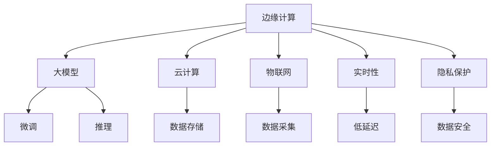

                 

# 边缘计算在大模型应用中的重要性

> 关键词：边缘计算,大模型,云计算,物联网,实时性,隐私保护,节能减排

## 1. 背景介绍

### 1.1 问题由来
随着人工智能技术的飞速发展，大规模模型如GPT-3和BERT等在自然语言处理(NLP)、计算机视觉、语音识别等诸多领域取得了突破性的成果。然而，这些模型的参数量往往以亿计，对计算资源和通信带宽提出了极高的要求。传统云中心集中式计算架构在面对海量数据处理时，往往面临响应延迟高、带宽压力大、隐私泄露风险等诸多挑战。边缘计算作为一种新兴的分布式计算范式，利用靠近数据源的计算能力，能够缓解这些问题，提升大模型应用的实时性和效率。

### 1.2 问题核心关键点
边缘计算指的是将计算任务从云端迁移至离用户更近的节点（如智能设备、基站、边缘服务器等）进行分布式计算。其主要优势在于以下几点：
- **降低延迟**：由于计算任务在本地完成，数据传输距离大大缩短，响应时间大幅减少。
- **保护隐私**：敏感数据在本地处理，不经过网络传输，减少了隐私泄露风险。
- **节能减排**：本地计算资源利用率更高，显著降低了电力消耗和碳排放。

边缘计算与大模型的结合，可以显著提升后者的应用效果和用户体验，尤其在实时性要求高、隐私敏感度高的场景中，如智能家居、智慧城市、工业互联网等，发挥出巨大潜力。本文将深入探讨边缘计算在大模型应用中的重要性与具体实践。

## 2. 核心概念与联系

### 2.1 核心概念概述

为更好地理解边缘计算在大模型应用中的重要性，本节将介绍几个密切相关的核心概念：

- **边缘计算(Edge Computing)**：指将计算任务和数据处理推向靠近数据源的本地节点进行分布式计算的技术。与传统的集中式计算相比，边缘计算能够显著减少网络传输延迟，降低带宽压力，提升实时性和能效。

- **大模型(Large Models)**：如BERT、GPT-3等，通过在大规模数据集上进行预训练，学习到复杂且泛化的表示能力，可以在不同任务上进行微调，获得优异的效果。

- **云计算(Cloud Computing)**：通过互联网提供计算资源和数据服务，用户可以按需访问云端的计算能力和存储空间。云计算是大模型训练和部署的主要平台之一。

- **物联网(IoT)**：连接各种物理设备，实现数据的实时采集和传输。物联网为边缘计算提供了丰富的数据源和计算场景。

- **实时性(Real-time)**：指系统对用户请求的响应时间，实时性要求高的场景，如自动驾驶、医疗诊断等，对边缘计算的需求尤为迫切。

- **隐私保护(Privacy Protection)**：保护用户数据免受未经授权的访问和泄露，尤其在涉及个人隐私的场景，如健康监测、智能家居等，隐私保护是边缘计算的重要考量。

这些核心概念之间的逻辑关系可以通过以下Mermaid流程图来展示：



这个流程图展示了大模型与边缘计算之间的核心概念关系：

1. 边缘计算利用离数据源更近的本地节点，提升大模型的实时性和隐私保护。
2. 云计算提供大模型的训练和存储资源。
3. 物联网为边缘计算提供数据采集和实时传输的保障。
4. 实时性是边缘计算和物联网数据处理的重要目标。
5. 隐私保护是边缘计算和大模型应用的必要条件。

这些概念共同构成了边缘计算与大模型应用的基础框架，为大模型的分布式处理提供了有力支持。

## 3. 核心算法原理 & 具体操作步骤
### 3.1 算法原理概述

在大模型应用中，边缘计算利用本地计算资源，对模型进行推理、微调、优化等处理，从而提升系统的实时性和隐私性。其主要算法原理包括以下几个方面：

1. **本地推理**：边缘设备接收用户请求后，直接在本地进行模型推理，快速生成输出结果，降低延迟。
2. **本地微调**：在边缘设备上，利用本地数据对模型进行微调，适应特定场景的特定需求，提升模型的精度和泛化能力。
3. **数据本地化**：敏感数据在本地进行处理，不经过网络传输，保护用户隐私。

### 3.2 算法步骤详解

边缘计算在大模型应用中的具体操作步骤如下：

1. **数据采集与预处理**：边缘设备通过传感器、摄像头等采集实时数据，并进行预处理（如去噪、压缩等），以适应后续的计算需求。
2. **模型部署**：将大模型部署到边缘设备上，进行本地推理。
3. **本地微调**：利用边缘设备上的本地数据，对模型进行微调，优化模型参数，提升性能。
4. **结果传输与反馈**：将模型推理结果传输给用户端，收集反馈信息，用于模型优化和改进。

### 3.3 算法优缺点

边缘计算在大模型应用中具有以下优点：

- **降低延迟**：数据在本地处理，减少了数据传输的延迟，提升了系统响应速度。
- **保护隐私**：敏感数据在本地处理，减少了隐私泄露风险。
- **节能减排**：本地计算资源利用率更高，显著降低了电力消耗和碳排放。

同时，也存在以下局限：

- **资源受限**：边缘设备计算资源有限，可能无法处理大规模模型。
- **网络带宽不足**：边缘设备与云端的通信带宽有限，可能影响模型的训练和部署效率。
- **数据孤岛**：边缘设备与云端数据共享不足，可能导致模型泛化能力有限。

### 3.4 算法应用领域

边缘计算与大模型的结合，已经在多个领域得到了应用，具体如下：

- **智能家居**：利用边缘计算对家庭设备进行实时监控和控制，如智能灯光、温控等。
- **智慧城市**：对城市交通、环境、公共安全等进行实时数据分析和决策支持。
- **工业互联网**：对工业设备进行实时监测和维护，提升生产效率和设备寿命。
- **医疗健康**：对患者健康数据进行实时分析和诊断，提高医疗服务质量。
- **自动驾驶**：对实时交通数据进行分析，辅助自动驾驶车辆进行决策。

## 4. 数学模型和公式 & 详细讲解 & 举例说明

### 4.1 数学模型构建

本节将使用数学语言对边缘计算在大模型应用中的模型构建进行更加严格的刻画。

设模型参数为 $\theta$，输入数据为 $x$，边缘计算节点的推理结果为 $y$。则在本地推理的模型表达式为：

$$
y = f_{\theta}(x)
$$

其中 $f_{\theta}(\cdot)$ 为模型的前向传播函数。

### 4.2 公式推导过程

以微调为例，设本地微调数据集为 $D=\{(x_i,y_i)\}_{i=1}^N$，微调的目标是最小化损失函数 $\mathcal{L}(\theta)$，使得本地微调后的模型能够更好地适应本地数据。微调的优化目标是最小化损失函数，即：

$$
\theta^* = \mathop{\arg\min}_{\theta} \mathcal{L}(\theta)
$$

在实践中，我们通常使用梯度下降等优化算法来近似求解上述最优化问题。设学习率为 $\eta$，则参数的更新公式为：

$$
\theta \leftarrow \theta - \eta \nabla_{\theta}\mathcal{L}(\theta)
$$

其中 $\nabla_{\theta}\mathcal{L}(\theta)$ 为损失函数对参数 $\theta$ 的梯度，可通过反向传播算法高效计算。

### 4.3 案例分析与讲解

以下我们以智能家居中的温度控制为例，展示边缘计算在微调中的具体应用。

假设智能温度控制器能够实时监测室内温度 $x$，并将其作为模型输入。模型的输出 $y$ 为理想温度设置。假设存在 $N$ 个历史温度监测记录 $(x_i,y_i)$，其中 $x_i$ 为室内温度，$y_i$ 为对应的理想温度设置。

在边缘计算中，首先对输入数据进行预处理和归一化，然后将其作为模型输入进行推理，输出 $y$。设本地微调后模型的参数为 $\theta^*$，则微调的目标是最小化损失函数 $\mathcal{L}(\theta^*)$，使得模型输出的温度设置更加准确。

通过梯度下降等优化算法，模型参数不断更新，直至损失函数收敛。最终得到的 $\theta^*$ 即本地微调后的模型参数，用于实时控制室内温度，提升居住体验。

## 5. 项目实践：代码实例和详细解释说明
### 5.1 开发环境搭建

在进行边缘计算的微调实践前，我们需要准备好开发环境。以下是使用Python进行PyTorch开发的环境配置流程：

1. 安装Anaconda：从官网下载并安装Anaconda，用于创建独立的Python环境。

2. 创建并激活虚拟环境：
```bash
conda create -n edge-env python=3.8 
conda activate edge-env
```

3. 安装PyTorch：根据CUDA版本，从官网获取对应的安装命令。例如：
```bash
conda install pytorch torchvision torchaudio cudatoolkit=11.1 -c pytorch -c conda-forge
```

4. 安装Transformers库：
```bash
pip install transformers
```

5. 安装各类工具包：
```bash
pip install numpy pandas scikit-learn matplotlib tqdm jupyter notebook ipython
```

完成上述步骤后，即可在`edge-env`环境中开始边缘计算的微调实践。

### 5.2 源代码详细实现

这里我们以边缘计算在智能家居温度控制中的应用为例，展示如何使用PyTorch和Transformers库进行模型微调。

首先，定义温度控制任务的数据处理函数：

```python
from transformers import BertTokenizer
from torch.utils.data import Dataset
import torch

class TemperatureDataset(Dataset):
    def __init__(self, texts, labels, tokenizer, max_len=128):
        self.texts = texts
        self.labels = labels
        self.tokenizer = tokenizer
        self.max_len = max_len
        
    def __len__(self):
        return len(self.texts)
    
    def __getitem__(self, item):
        text = self.texts[item]
        label = self.labels[item]
        
        encoding = self.tokenizer(text, return_tensors='pt', max_length=self.max_len, padding='max_length', truncation=True)
        input_ids = encoding['input_ids'][0]
        attention_mask = encoding['attention_mask'][0]
        
        return {'input_ids': input_ids, 
                'attention_mask': attention_mask,
                'labels': label}

# 创建dataset
tokenizer = BertTokenizer.from_pretrained('bert-base-cased')

train_dataset = TemperatureDataset(train_texts, train_labels, tokenizer)
dev_dataset = TemperatureDataset(dev_texts, dev_labels, tokenizer)
test_dataset = TemperatureDataset(test_texts, test_labels, tokenizer)
```

然后，定义模型和优化器：

```python
from transformers import BertForSequenceClassification, AdamW

model = BertForSequenceClassification.from_pretrained('bert-base-cased', num_labels=2)

optimizer = AdamW(model.parameters(), lr=2e-5)
```

接着，定义训练和评估函数：

```python
from torch.utils.data import DataLoader
from tqdm import tqdm
from sklearn.metrics import classification_report

device = torch.device('cuda') if torch.cuda.is_available() else torch.device('cpu')
model.to(device)

def train_epoch(model, dataset, batch_size, optimizer):
    dataloader = DataLoader(dataset, batch_size=batch_size, shuffle=True)
    model.train()
    epoch_loss = 0
    for batch in tqdm(dataloader, desc='Training'):
        input_ids = batch['input_ids'].to(device)
        attention_mask = batch['attention_mask'].to(device)
        labels = batch['labels'].to(device)
        model.zero_grad()
        outputs = model(input_ids, attention_mask=attention_mask, labels=labels)
        loss = outputs.loss
        epoch_loss += loss.item()
        loss.backward()
        optimizer.step()
    return epoch_loss / len(dataloader)

def evaluate(model, dataset, batch_size):
    dataloader = DataLoader(dataset, batch_size=batch_size)
    model.eval()
    preds, labels = [], []
    with torch.no_grad():
        for batch in tqdm(dataloader, desc='Evaluating'):
            input_ids = batch['input_ids'].to(device)
            attention_mask = batch['attention_mask'].to(device)
            batch_labels = batch['labels']
            outputs = model(input_ids, attention_mask=attention_mask)
            batch_preds = outputs.logits.argmax(dim=2).to('cpu').tolist()
            batch_labels = batch_labels.to('cpu').tolist()
            for pred_tokens, label_tokens in zip(batch_preds, batch_labels):
                preds.append(pred_tokens)
                labels.append(label_tokens)
                
    print(classification_report(labels, preds))
```

最后，启动训练流程并在测试集上评估：

```python
epochs = 5
batch_size = 16

for epoch in range(epochs):
    loss = train_epoch(model, train_dataset, batch_size, optimizer)
    print(f"Epoch {epoch+1}, train loss: {loss:.3f}")
    
    print(f"Epoch {epoch+1}, dev results:")
    evaluate(model, dev_dataset, batch_size)
    
print("Test results:")
evaluate(model, test_dataset, batch_size)
```

以上就是使用PyTorch对BERT进行智能家居温度控制任务微调的完整代码实现。可以看到，得益于Transformers库的强大封装，我们可以用相对简洁的代码完成边缘计算的微调实践。

### 5.3 代码解读与分析

让我们再详细解读一下关键代码的实现细节：

**TemperatureDataset类**：
- `__init__`方法：初始化文本、标签、分词器等关键组件。
- `__len__`方法：返回数据集的样本数量。
- `__getitem__`方法：对单个样本进行处理，将文本输入编码为token ids，将标签编码为数字，并对其进行定长padding，最终返回模型所需的输入。

**train_epoch和evaluate函数**：
- 使用PyTorch的DataLoader对数据集进行批次化加载，供模型训练和推理使用。
- 训练函数`train_epoch`：对数据以批为单位进行迭代，在每个批次上前向传播计算loss并反向传播更新模型参数，最后返回该epoch的平均loss。
- 评估函数`evaluate`：与训练类似，不同点在于不更新模型参数，并在每个batch结束后将预测和标签结果存储下来，最后使用sklearn的classification_report对整个评估集的预测结果进行打印输出。

**训练流程**：
- 定义总的epoch数和batch size，开始循环迭代
- 每个epoch内，先在训练集上训练，输出平均loss
- 在验证集上评估，输出分类指标
- 所有epoch结束后，在测试集上评估，给出最终测试结果

可以看到，PyTorch配合Transformers库使得边缘计算的微调代码实现变得简洁高效。开发者可以将更多精力放在数据处理、模型改进等高层逻辑上，而不必过多关注底层的实现细节。

## 6. 实际应用场景

### 6.1 智能家居

边缘计算在智能家居中的应用，主要体现在温度、照明、安全等场景。通过边缘计算，智能家居设备能够实时感知环境变化，做出快速响应，提升用户体验。

具体而言，智能温度控制器能够实时监测室内温度，并根据用户需求和天气状况进行自动调节。智能照明系统能够根据自然光强度的变化，自动调整室内灯光亮度和色温，提升舒适度。智能安防系统能够实时监控家庭环境，及时发现异常情况并发出警报。

在技术实现上，边缘计算通过本地推理和微调，显著提升了这些系统的响应速度和准确性。相比于集中式计算，边缘计算减少了网络传输的延迟，提高了系统的实时性和可靠性。

### 6.2 智慧城市

智慧城市建设是城市管理的重要方向，涉及交通、环境、公共安全等多个领域。边缘计算为智慧城市提供了高效、可靠的数据处理能力，帮助城市管理部门提升治理水平。

例如，边缘计算在交通管理中的应用，可以实时分析交通流量数据，优化信号灯控制，减少交通拥堵。在环境监测中，边缘设备可以实时采集空气质量、水质等数据，快速做出预警和处理措施。在公共安全领域，边缘计算能够实时监控视频流，发现异常行为并及时报警，提升社会治安水平。

### 6.3 工业互联网

工业互联网是制造业转型升级的重要方向，涉及生产设备、供应链管理等多个环节。边缘计算在工业互联网中的应用，能够提升生产效率和设备维护水平。

例如，在生产设备监控中，边缘计算能够实时采集设备运行数据，进行故障预测和维护。在供应链管理中，边缘计算能够实时分析物流数据，优化运输路径和库存管理，提升供应链效率。在质量控制中，边缘计算能够实时分析生产数据，发现异常情况并及时调整生产参数，提高产品质量。

### 6.4 医疗健康

边缘计算在医疗健康中的应用，主要体现在远程诊断、健康监测、个性化治疗等方面。通过边缘计算，医疗机构能够提供更加高效、便捷的医疗服务。

例如，远程医疗平台能够利用边缘计算对实时医疗数据进行分析和诊断，提升诊断准确性和响应速度。智能穿戴设备能够实时监测患者健康数据，及时发现异常情况并发出警报。个性化治疗系统能够根据患者的历史数据和实时数据，提供个性化的治疗方案，提升治疗效果。

## 7. 工具和资源推荐

### 7.1 学习资源推荐

为了帮助开发者系统掌握边缘计算和大模型的理论基础和实践技巧，这里推荐一些优质的学习资源：

1. 《边缘计算从原理到实践》系列博文：由边缘计算技术专家撰写，深入浅出地介绍了边缘计算原理、架构、应用案例等。

2. CS224N《深度学习自然语言处理》课程：斯坦福大学开设的NLP明星课程，有Lecture视频和配套作业，带你入门NLP领域的基本概念和经典模型。

3. 《边缘计算与人工智能》书籍：全面介绍了边缘计算与人工智能的融合应用，涵盖理论基础、技术架构、工程实践等内容。

4. Google Cloud IoT Core：Google提供的物联网云服务平台，支持边缘计算应用开发，提供丰富的API和SDK。

5. NVIDIA Jetson系列平台：NVIDIA推出的边缘计算平台，支持GPU加速，适合进行大模型的推理和微调。

通过对这些资源的学习实践，相信你一定能够快速掌握边缘计算和大模型的精髓，并用于解决实际的NLP问题。

### 7.2 开发工具推荐

高效的开发离不开优秀的工具支持。以下是几款用于边缘计算和大模型开发的常用工具：

1. PyTorch：基于Python的开源深度学习框架，灵活动态的计算图，适合快速迭代研究。

2. TensorFlow：由Google主导开发的开源深度学习框架，生产部署方便，适合大规模工程应用。

3. TensorFlow Lite：TensorFlow的轻量级版本，支持在移动设备和边缘设备上运行，适合进行模型推理。

4. ONNX：开放神经网络交换格式，支持多种深度学习框架间的模型转换和推理优化。

5. PySyft：隐私保护和分布式训练工具，支持在本地设备上进行数据计算和模型推理。

6. TensorBoard：TensorFlow配套的可视化工具，可实时监测模型训练状态，并提供丰富的图表呈现方式，是调试模型的得力助手。

合理利用这些工具，可以显著提升边缘计算和大模型的开发效率，加快创新迭代的步伐。

### 7.3 相关论文推荐

边缘计算与大模型的发展源于学界的持续研究。以下是几篇奠基性的相关论文，推荐阅读：

1. MobileNets: Efficient Convolutional Neural Networks for Mobile Vision Applications（MobileNets论文）：提出了MobileNet系列模型，针对移动设备计算资源有限的场景，设计了高效卷积神经网络，提升了模型的能效比。

2. Microsoft S Server (SS): A General-Purpose Distributed Computational Framework（MS S Server论文）：介绍了Microsoft的分布式计算框架MS S Server，支持边缘计算和云协同计算。

3. Edge Computing: A Survey（边缘计算综述论文）：对边缘计算的概念、架构、应用场景等进行了全面综述，帮助读者深入理解边缘计算的核心思想。

4. Federated Learning: Concept and Applications（联邦学习综述论文）：介绍了联邦学习的基本概念和应用场景，强调了隐私保护和分布式计算的重要性。

5. Distributed Edge Computing: A Survey and Open Research Questions（边缘计算综述论文）：对边缘计算的分布式架构、优化技术、未来研究方向等进行了全面综述。

这些论文代表了大模型和边缘计算的发展脉络。通过学习这些前沿成果，可以帮助研究者把握学科前进方向，激发更多的创新灵感。

## 8. 总结：未来发展趋势与挑战

### 8.1 总结

本文对边缘计算在大模型应用中的重要性进行了全面系统的介绍。首先阐述了边缘计算在大模型应用中的背景和意义，明确了边缘计算在提升实时性、保护隐私、节能减排等方面的独特价值。其次，从原理到实践，详细讲解了边缘计算的数学模型和具体步骤，给出了边缘计算在智能家居、智慧城市、工业互联网等多个领域的应用实例。同时，本文还推荐了相关的学习资源、开发工具和研究论文，力求为读者提供全方位的技术指引。

通过本文的系统梳理，可以看到，边缘计算与大模型的结合，为大规模模型在分布式环境下的应用提供了新的思路和解决方案。边缘计算的大规模部署，将极大地提升大模型的实时性和能效，为人工智能技术的应用提供更坚实的基础。

### 8.2 未来发展趋势

展望未来，边缘计算与大模型的结合将呈现以下几个发展趋势：

1. **边缘计算与云协同**：边缘计算和云中心将实现更紧密的协同，共同构建弹性、可扩展的计算架构。边缘计算负责数据处理和模型推理，云中心负责数据存储和模型训练，形成互补优势。

2. **多模态数据融合**：边缘计算不仅处理结构化数据，还支持对非结构化数据的处理，如视频、语音、图像等。通过多模态数据融合，提升模型的理解能力和应用效果。

3. **实时性和能效优化**：未来的边缘计算将更注重实时性和能效的优化，提升边缘设备的计算能力和响应速度，降低电力消耗和碳排放。

4. **隐私保护和安全**：在数据本地化处理的同时，边缘计算将引入更多的隐私保护和安全机制，确保数据和模型的安全。

5. **工业级部署**：边缘计算将广泛应用于工业互联网、智慧城市、智能家居等高要求领域，提升各行各业的数字化、智能化水平。

以上趋势凸显了边缘计算与大模型结合的广阔前景，这些方向的探索发展，必将进一步提升人工智能系统的性能和应用范围，为经济社会发展注入新的动力。

### 8.3 面临的挑战

尽管边缘计算与大模型的结合取得了一定的进展，但在迈向更加智能化、普适化应用的过程中，仍面临诸多挑战：

1. **数据传输带宽不足**：边缘设备与云端的通信带宽有限，可能影响模型的训练和部署效率。

2. **资源受限**：边缘设备的计算和存储资源有限，可能无法处理大规模模型。

3. **数据孤岛**：边缘设备与云端数据共享不足，可能导致模型泛化能力有限。

4. **隐私保护**：在数据本地化处理的同时，需要保证数据和模型的安全。

5. **系统复杂性**：边缘计算系统的设计和维护复杂，需要综合考虑计算、存储、网络等多个因素。

6. **技术标准不统一**：不同的边缘计算平台和设备可能存在技术标准不统一的问题，影响系统的互操作性和兼容性。

这些挑战需要在技术、标准、协同等方面进一步探索和突破，才能更好地发挥边缘计算和大模型的潜力。

### 8.4 研究展望

面对边缘计算和大模型面临的挑战，未来的研究需要在以下几个方面寻求新的突破：

1. **资源优化与扩展**：研究如何在资源受限的边缘设备上高效运行大模型，提升模型推理和微调的效率。

2. **跨平台互操作**：推动边缘计算和云端的技术标准统一，提升系统的互操作性和兼容性。

3. **隐私保护与安全**：研究如何在本地数据处理的同时，确保数据和模型的安全，提升系统的可信度和鲁棒性。

4. **分布式协同计算**：研究边缘计算和云端的协同计算机制，提升系统的弹性和可扩展性。

5. **多模态数据融合**：研究如何高效处理和融合多模态数据，提升模型的理解和表达能力。

6. **边缘计算协议**：研究边缘计算协议的优化和标准化，提升系统的实时性和稳定性。

这些研究方向的探索，必将引领边缘计算与大模型的进一步发展，为构建智能、安全、高效的系统奠定坚实基础。只有勇于创新、敢于突破，才能不断拓展边缘计算和大模型的边界，让智能技术更好地造福人类社会。

## 9. 附录：常见问题与解答

**Q1：边缘计算是否适用于所有大模型应用？**

A: 边缘计算在实时性要求高、数据敏感度高的场景中尤为适用，如智能家居、智慧城市等。但对于需要大量计算资源和存储资源的应用，如大规模数据分析、科学计算等，仍需依赖云中心集中式计算。

**Q2：边缘计算是否会影响模型精度？**

A: 边缘计算在本地进行数据处理和模型推理，相比于集中式计算，可能面临数据多样性不足、样本数量有限等问题，影响模型的泛化能力和精度。

**Q3：边缘计算在部署时需要注意哪些问题？**

A: 边缘计算的部署需要考虑设备的计算能力和网络带宽，选择合适的模型和算法，进行合理的资源分配和调度。

**Q4：边缘计算在大模型应用中如何优化能效？**

A: 优化边缘计算的大模型应用，需要考虑算法的能效比、数据传输的带宽和延迟、设备的能耗等因素，进行全面的优化设计。

**Q5：边缘计算如何实现数据隐私保护？**

A: 边缘计算通过本地数据处理，减少数据传输的带宽和延迟，提升隐私保护水平。同时可以采用数据匿名化、加密等技术，进一步保护用户隐私。

正视边缘计算和大模型面临的这些挑战，积极应对并寻求突破，将是大模型在分布式环境下的关键。相信随着学界和产业界的共同努力，这些挑战终将一一被克服，边缘计算与大模型的结合将迎来新的发展阶段，推动人工智能技术的广泛应用和深入发展。

