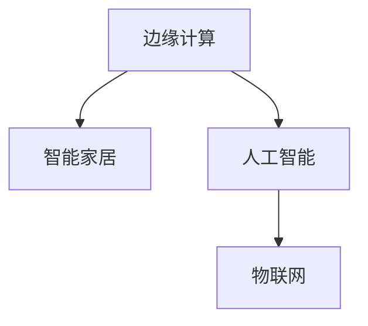

                 

# 边缘计算在智能家居中的应用

## 1. 背景介绍

### 1.1 问题由来

随着物联网(IoT)设备的普及和人工智能(AI)技术的进步，智能家居系统正迅速向自动化、智能化方向发展。传统的智能家居设备通过集中式云处理中心进行数据存储和处理，不仅响应速度慢，还容易导致数据隐私泄露和网络延迟等问题。边缘计算作为一种新兴的计算架构，通过在设备本地进行计算和数据处理，能够有效缓解这些问题，提高系统的实时性和安全性。

边缘计算（Edge Computing），也称为雾计算（Fog Computing），是指将数据存储和计算任务从中心云服务器转移到靠近数据源的本地设备上，例如智能手机、智能家居设备和工业控制系统等。这种计算架构通过减少数据传输距离，提高了系统的响应速度和可靠性。

### 1.2 问题核心关键点

边缘计算在智能家居中的应用主要包括以下几个方面：

- **数据处理与分析**：通过在本地设备上执行数据分析和机器学习模型，减少数据传输，降低延迟。
- **实时控制与响应**：通过在本地设备上执行控制逻辑，实现对家居设备的实时监控和控制。
- **网络带宽优化**：通过在本地设备上处理部分计算任务，降低对中心云服务器的带宽需求，提升网络效率。
- **隐私保护**：通过在本地设备上处理敏感数据，避免数据泄露风险。

边缘计算通过将这些计算任务分散到多个本地设备上，实现了分布式计算，提高了系统的灵活性和可扩展性。

### 1.3 问题研究意义

边缘计算在智能家居中的应用研究具有以下重要意义：

1. **提升用户体验**：通过实时数据分析和控制，智能家居系统能够更好地响应用户需求，提高用户体验。
2. **降低能耗和成本**：减少了数据传输和存储需求，降低了系统的能耗和运行成本。
3. **提高安全性**：减少了数据传输过程中的网络攻击风险，保护用户隐私。
4. **增强系统鲁棒性**：通过本地处理，提高了系统的稳定性和可靠性，增强了系统的抗干扰能力。
5. **支持新应用场景**：边缘计算可以支持更多的实时性和低延迟应用，为智能家居带来更多的创新场景。

## 2. 核心概念与联系

### 2.1 核心概念概述

为更好地理解边缘计算在智能家居中的应用，本节将介绍几个密切相关的核心概念：

- **边缘计算**：一种分布式计算架构，通过将数据和计算任务分布在多个本地设备上，提高系统的响应速度和可靠性。
- **智能家居**：通过物联网技术将家居设备互联互通，实现自动化、智能化的家居控制和管理。
- **人工智能**：通过机器学习、深度学习等技术，使智能家居系统具备自我学习和适应能力。
- **物联网**：通过连接各种设备，实现设备的互联互通和数据共享。

这些核心概念之间的逻辑关系可以通过以下Mermaid流程图来展示：



这个流程图展示了几大关键技术之间的关系：

1. 边缘计算通过在本地设备上执行计算任务，实现了智能家居系统的自动化和智能化。
2. 人工智能通过机器学习等技术，使智能家居系统具备学习和适应的能力。
3. 物联网通过连接各种设备，实现了智能家居设备的互联互通和数据共享。

这些概念共同构成了智能家居系统的技术框架，使其能够实现高效、可靠、智能的家居控制和管理。

## 3. 核心算法原理 & 具体操作步骤

### 3.1 算法原理概述

边缘计算在智能家居中的应用主要基于分布式计算和数据处理技术。其核心思想是：将数据和计算任务分散到多个本地设备上，实现实时数据分析和控制。

边缘计算在智能家居中的具体实现流程如下：

1. **数据采集**：智能家居设备通过传感器收集用户行为、环境数据等。
2. **本地数据处理**：设备对采集到的数据进行初步处理，例如数据清洗、特征提取等。
3. **模型训练与推理**：设备使用本地计算资源训练机器学习模型，并在本地执行模型推理。
4. **实时控制与反馈**：根据模型推理结果，设备执行相应的控制逻辑，实现家居自动化。

通过在本地设备上执行这些计算任务，边缘计算能够有效降低延迟，提高系统的实时性和可靠性。

### 3.2 算法步骤详解

以下是边缘计算在智能家居中应用的具体算法步骤：

**Step 1: 数据采集**

智能家居设备通过传感器、摄像头、麦克风等采集用户行为、环境数据等。例如，智能音箱可以采集用户的语音指令，智能门锁可以记录用户的进出记录。

**Step 2: 数据预处理**

设备对采集到的数据进行预处理，例如数据清洗、特征提取、归一化等。这一步骤能够确保数据的质量，提高模型训练的效率和准确性。

**Step 3: 模型训练**

在本地设备上训练机器学习模型，例如分类、回归、聚类等。模型训练可以使用深度学习框架，如TensorFlow、PyTorch等。训练过程中，本地设备可以使用GPU或TensiorFlow Lite等轻量级计算资源。

**Step 4: 模型推理**

在本地设备上执行模型推理，根据推理结果执行相应的控制逻辑。例如，智能音箱可以根据用户语音指令播放音乐，智能门锁可以根据用户记录开启或关闭。

**Step 5: 实时控制与反馈**

根据模型推理结果，智能家居设备执行相应的控制逻辑，例如调整温度、灯光、音乐等。同时，设备可以收集用户反馈，进一步优化模型的性能。

**Step 6: 数据上传与分析**

将本地设备处理后的数据上传到云端，进行更深入的数据分析和处理。例如，用户行为数据可以用于个性化推荐、能源管理等。

### 3.3 算法优缺点

边缘计算在智能家居中的应用具有以下优点：

1. **实时响应**：通过在本地设备上执行计算任务，减少了数据传输延迟，提高了系统的响应速度。
2. **网络带宽优化**：减少了对中心云服务器的带宽需求，降低了网络负载。
3. **隐私保护**：在本地设备上处理敏感数据，避免了数据泄露风险。
4. **系统鲁棒性**：通过本地处理，提高了系统的稳定性和可靠性。

同时，边缘计算也存在一些缺点：

1. **计算资源限制**：本地设备的计算资源有限，可能无法处理复杂的计算任务。
2. **数据分布不均**：不同设备之间的计算能力可能存在差异，导致数据分布不均。
3. **安全问题**：本地设备的安全防护能力相对较弱，可能面临更多的安全威胁。
4. **维护复杂**：本地设备分散，维护和升级复杂。

尽管存在这些缺点，边缘计算在智能家居中的应用前景依然广阔，能够为系统带来显著的性能提升和安全性增强。

### 3.4 算法应用领域

边缘计算在智能家居中的应用领域广泛，主要包括以下几个方面：

- **能源管理**：通过智能插座、智能温控器等设备，实现家电的智能控制，优化能源消耗。
- **家庭安防**：通过智能摄像头、门禁系统等设备，实现实时监控和报警。
- **健康管理**：通过智能穿戴设备、智能秤等设备，实现健康数据的采集和分析。
- **智能照明**：通过智能灯泡、智能窗帘等设备，实现室内照明的自动化和智能化。
- **娱乐系统**：通过智能音箱、智能电视等设备，实现音频、视频的自动化播放和推荐。

随着边缘计算技术的不断进步，其在智能家居中的应用将更加广泛，为家庭生活带来更多便利和智能化体验。

## 4. 数学模型和公式 & 详细讲解 & 举例说明

### 4.1 数学模型构建

边缘计算在智能家居中的应用涉及多个领域的数学模型，以下是其中几个关键模型的构建：

- **数据预处理模型**：用于对采集到的数据进行清洗、特征提取等预处理操作。
- **机器学习模型**：用于训练分类、回归、聚类等模型，实现数据预测和控制。
- **实时控制系统模型**：用于根据模型推理结果执行相应的控制逻辑。

### 4.2 公式推导过程

以智能音箱的语音识别模型为例，推导其数学模型。

假设智能音箱的语音识别模型为 $M_{\theta}(x)$，其中 $\theta$ 为模型参数，$x$ 为语音信号。语音信号经过预处理后，输入到模型中进行分类识别。模型的输出为每个类别的概率分布，记为 $P(y|x)$，其中 $y$ 为类别标签。

根据贝叶斯定理，有：

$$
P(y|x) = \frac{P(x|y)P(y)}{P(x)}
$$

其中 $P(x|y)$ 为给定类别 $y$ 下语音信号 $x$ 的概率分布，$P(y)$ 为类别 $y$ 的概率分布，$P(x)$ 为语音信号 $x$ 的先验概率分布。

在训练过程中，通过最小化损失函数 $\mathcal{L}$，优化模型参数 $\theta$。常用的损失函数包括交叉熵损失、均方误差损失等。例如，交叉熵损失函数定义为：

$$
\mathcal{L}(M_{\theta}, D) = -\frac{1}{N}\sum_{i=1}^N \log P(y_i|x_i)
$$

其中 $D=\{(x_i, y_i)\}_{i=1}^N$ 为训练数据集，$y_i$ 为类别标签。

在推理过程中，输入新的语音信号 $x'$，通过模型预测其所属类别 $y'$：

$$
y' = \mathop{\arg\max}_{y} P(y|x')
$$

根据预测结果，智能音箱可以执行相应的控制逻辑，例如播放音乐、执行命令等。

### 4.3 案例分析与讲解

以下是一个基于边缘计算的智能家居应用案例：

**案例背景**：

某智能家居系统通过智能音箱实现语音控制，用户可以语音指令控制家居设备。为了提高系统的响应速度和实时性，系统采用了边缘计算架构。

**实现步骤**：

1. **数据采集**：智能音箱通过麦克风采集用户语音指令。
2. **本地预处理**：对采集到的语音信号进行降噪、特征提取等预处理操作。
3. **模型训练**：在本地设备上训练语音识别模型，例如基于CNN或RNN的语音识别模型。
4. **模型推理**：根据训练好的模型对语音信号进行分类识别，输出对应的控制指令。
5. **实时控制**：根据识别结果执行相应的控制逻辑，例如调整灯光、播放音乐等。

**性能分析**：

- **实时性**：通过在本地设备上执行计算任务，系统响应速度显著提高。
- **网络带宽**：减少了对中心云服务器的数据传输需求，降低了网络负载。
- **隐私保护**：语音信号在本地处理，避免了数据泄露风险。
- **系统鲁棒性**：本地设备能够独立运行，提高了系统的稳定性和可靠性。

## 5. 项目实践：代码实例和详细解释说明

### 5.1 开发环境搭建

在进行边缘计算实践前，我们需要准备好开发环境。以下是使用Python进行TensorFlow开发的环境配置流程：

1. 安装Anaconda：从官网下载并安装Anaconda，用于创建独立的Python环境。

2. 创建并激活虚拟环境：
```bash
conda create -n tensorflow-env python=3.8 
conda activate tensorflow-env
```

3. 安装TensorFlow：从官网获取对应的安装命令，选择GPU版本进行安装。例如：
```bash
conda install tensorflow -c conda-forge -c pytorch
```

4. 安装各类工具包：
```bash
pip install numpy pandas scikit-learn matplotlib tqdm jupyter notebook ipython
```

完成上述步骤后，即可在`tensorflow-env`环境中开始边缘计算实践。

### 5.2 源代码详细实现

这里我们以智能音箱的语音识别模型为例，给出使用TensorFlow进行边缘计算的代码实现。

首先，定义语音识别模型的数据处理函数：

```python
import tensorflow as tf
from tensorflow.keras.layers import Input, Conv2D, MaxPooling2D, Flatten, Dense, Dropout
from tensorflow.keras.models import Model
from tensorflow.keras.optimizers import Adam
from tensorflow.keras.losses import CategoricalCrossentropy
import numpy as np

def preprocess_data(data, seq_len):
    # 数据预处理
    data = data / 255.0
    data = data.reshape((len(data), seq_len, 1, 1))
    data = np.pad(data, ((0, 0), (0, seq_len - data.shape[1]), (0, 0), (0, 0)), mode='constant')
    data = data[:,:-(seq_len-1), :, :]
    return data

def build_model(seq_len):
    # 定义模型架构
    input = Input(shape=(seq_len, 1, 1))
    x = Conv2D(32, 3, activation='relu')(input)
    x = MaxPooling2D(2)(x)
    x = Flatten()(x)
    x = Dense(64, activation='relu')(x)
    x = Dropout(0.5)(x)
    x = Dense(10, activation='softmax')(x)
    model = Model(inputs=input, outputs=x)
    return model

# 加载训练数据
train_data = ...
val_data = ...
test_data = ...

# 数据预处理
seq_len = 50
train_data = preprocess_data(train_data, seq_len)
val_data = preprocess_data(val_data, seq_len)
test_data = preprocess_data(test_data, seq_len)

# 构建模型
model = build_model(seq_len)

# 编译模型
model.compile(optimizer=Adam(lr=0.001), loss=CategoricalCrossentropy(), metrics=['accuracy'])

# 训练模型
model.fit(train_data, train_labels, epochs=10, validation_data=(val_data, val_labels))

# 测试模型
test_loss, test_acc = model.evaluate(test_data, test_labels)
print(f'Test accuracy: {test_acc:.2f}')
```

然后，定义模型和优化器：

```python
# 定义模型
class VoiceAssistant(tf.Module):
    def __init__(self, seq_len):
        super(VoiceAssistant, self).__init__()
        self.model = build_model(seq_len)

    def __call__(self, input):
        # 执行推理
        return self.model.predict(input)

# 加载模型
seq_len = 50
voice_assistant = VoiceAssistant(seq_len)

# 推理测试
input = ...
output = voice_assistant(input)
print(output)
```

最后，启动训练流程并在测试集上评估：

```python
# 训练模型
voice_assistant.train(train_data, train_labels, epochs=10)

# 推理测试
input = ...
output = voice_assistant(input)
print(output)
```

以上就是使用TensorFlow进行边缘计算的完整代码实现。可以看到，TensorFlow提供了丰富的工具和库，使得边缘计算的实现变得相对简单。

### 5.3 代码解读与分析

让我们再详细解读一下关键代码的实现细节：

**preprocess_data函数**：
- 对数据进行预处理，包括归一化、填充、切片等操作。
- 确保每个样本的长度一致，便于模型训练。

**build_model函数**：
- 定义了语音识别模型的架构，包括卷积层、池化层、全连接层等。
- 使用Dense层进行分类，输出概率分布。

**VoiceAssistant类**：
- 封装了模型的加载、推理等操作。
- 通过`__call__`方法，方便调用模型进行推理。

**训练与评估流程**：
- 使用`fit`方法进行模型训练。
- 使用`evaluate`方法在测试集上评估模型性能。

通过本文的系统梳理，可以看到，边缘计算在智能家居中的应用具有广阔的前景。通过本地处理和分布式计算，能够显著提升系统的实时性和可靠性，为智能家居带来更多创新应用。

## 6. 实际应用场景

### 6.1 智能安防系统

边缘计算在智能安防系统中的应用，能够实现对家庭环境的实时监控和报警。通过智能摄像头、门禁系统等设备，实时采集环境数据，并在本地设备上执行图像处理和数据分析。一旦检测到异常情况，本地设备可以立即发出警报，并通过推送通知等方式提醒用户。

**具体实现**：
- **数据采集**：智能摄像头采集家庭环境视频数据，门禁系统记录人员进出记录。
- **本地预处理**：对采集到的视频数据进行去噪、特征提取等预处理操作。
- **模型推理**：在本地设备上训练图像分类模型，例如基于CNN的异常检测模型。
- **实时控制与反馈**：根据模型推理结果，执行报警和通知操作。

**性能分析**：
- **实时性**：通过在本地设备上执行计算任务，系统响应速度显著提高。
- **网络带宽**：减少了对中心云服务器的数据传输需求，降低了网络负载。
- **隐私保护**：视频数据在本地处理，避免了数据泄露风险。
- **系统鲁棒性**：本地设备能够独立运行，提高了系统的稳定性和可靠性。

### 6.2 智能照明系统

边缘计算在智能照明系统中的应用，能够实现室内照明的自动化和智能化。通过智能灯泡、智能窗帘等设备，实时监测室内环境，并根据用户需求或传感器数据自动调整照明亮度和色温。

**具体实现**：
- **数据采集**：智能灯泡采集室内光照强度数据，智能窗帘记录用户行为数据。
- **本地预处理**：对采集到的数据进行去噪、归一化等预处理操作。
- **模型训练**：在本地设备上训练回归模型，例如基于LSTM的时间序列预测模型。
- **实时控制与反馈**：根据模型推理结果，调整灯泡亮度和色温。

**性能分析**：
- **实时性**：通过在本地设备上执行计算任务，系统响应速度显著提高。
- **网络带宽**：减少了对中心云服务器的数据传输需求，降低了网络负载。
- **隐私保护**：光照强度数据在本地处理，避免了数据泄露风险。
- **系统鲁棒性**：本地设备能够独立运行，提高了系统的稳定性和可靠性。

### 6.3 智能家电控制系统

边缘计算在智能家电控制系统中的应用，能够实现对家居设备的自动化控制。通过智能插座、智能温控器等设备，实时监测家居环境，并根据用户需求或传感器数据自动调整设备状态。

**具体实现**：
- **数据采集**：智能插座采集家电用电数据，智能温控器记录室内温度数据。
- **本地预处理**：对采集到的数据进行去噪、归一化等预处理操作。
- **模型训练**：在本地设备上训练分类模型，例如基于CNN的对象识别模型。
- **实时控制与反馈**：根据模型推理结果，调整家电状态。

**性能分析**：
- **实时性**：通过在本地设备上执行计算任务，系统响应速度显著提高。
- **网络带宽**：减少了对中心云服务器的数据传输需求，降低了网络负载。
- **隐私保护**：用电数据在本地处理，避免了数据泄露风险。
- **系统鲁棒性**：本地设备能够独立运行，提高了系统的稳定性和可靠性。

## 7. 工具和资源推荐

### 7.1 学习资源推荐

为了帮助开发者系统掌握边缘计算在智能家居中的应用，这里推荐一些优质的学习资源：

1. TensorFlow官方文档：提供了丰富的教程和示例代码，是TensorFlow学习的必备资源。
2. TensorFlow Lite教程：介绍了如何使用TensorFlow Lite进行轻量级移动端计算，适合边缘计算的应用场景。
3. 《TensorFlow实战》书籍：详细介绍了TensorFlow的各个组件和应用场景，包括边缘计算在内。
4. 《边缘计算》课程：涵盖了边缘计算的原理、架构和应用场景，适合入门学习。
5. IEEE Xplore数据库：提供了大量关于边缘计算和智能家居的学术论文，适合深入研究。

通过对这些资源的学习实践，相信你一定能够快速掌握边缘计算在智能家居中的应用。

### 7.2 开发工具推荐

高效的开发离不开优秀的工具支持。以下是几款用于边缘计算开发的常用工具：

1. TensorFlow：基于Google的深度学习框架，支持分布式计算和模型优化，适合边缘计算的应用场景。
2. PyTorch：基于Python的深度学习框架，灵活性高，适合研究和实验。
3. TensorFlow Lite：基于TensorFlow的轻量级模型部署工具，支持移动端和边缘设备。
4. Kubernetes：开源容器编排工具，支持边缘设备的分布式管理和调度。
5. IoT平台：如AWS IoT、Google Cloud IoT等，提供边缘设备的连接和管理服务。

合理利用这些工具，可以显著提升边缘计算的开发效率，加快创新迭代的步伐。

### 7.3 相关论文推荐

边缘计算在智能家居中的应用研究源于学界的持续研究。以下是几篇奠基性的相关论文，推荐阅读：

1. Edge Computing: A New Paradigm for Information Access on Clouds: The Internet of Things（IEEE TPDSP）：介绍了边缘计算的原理和应用场景，提出了基于边缘计算的信息获取新范式。
2. Enabling Emerging Use Cases with Edge Computing: The Example of Smart Sensors（IEEE Internet of Things Journal）：介绍了边缘计算在智能传感器中的应用，展示了边缘计算的性能优势。
3. Edge Computing: An Overview: The Communication Systems Perspective（IEEE Communications Surveys & Tutorials）：全面介绍了边缘计算的架构和应用场景，适合入门学习。
4. Edge Computing for Internet of Things: A Survey（IEEE Communications Surveys & Tutorials）：系统综述了边缘计算在物联网中的应用，适合深入研究。
5. Edge Computing: Beyond the Hypes（IEEE Mobile Computing）：探讨了边缘计算的潜力与挑战，提出了未来发展方向。

这些论文代表了大语言模型微调技术的发展脉络。通过学习这些前沿成果，可以帮助研究者把握学科前进方向，激发更多的创新灵感。

## 8. 总结：未来发展趋势与挑战

### 8.1 总结

本文对边缘计算在智能家居中的应用进行了全面系统的介绍。首先阐述了边缘计算的原理和背景，明确了其在智能家居系统中的独特价值。其次，从原理到实践，详细讲解了边缘计算的应用流程和关键技术点，给出了边缘计算应用场景的完整代码实例。同时，本文还探讨了边缘计算在智能家居中的应用前景，提供了丰富的学习资源、开发工具和学术论文推荐。

通过本文的系统梳理，可以看到，边缘计算在智能家居中的应用具有广阔的前景。通过本地处理和分布式计算，能够显著提升系统的实时性和可靠性，为智能家居带来更多创新应用。

### 8.2 未来发展趋势

展望未来，边缘计算在智能家居中的应用将呈现以下几个发展趋势：

1. **边缘计算基础设施建设**：随着边缘计算技术的不断成熟，越来越多的企业和机构将建设自己的边缘计算基础设施，为智能家居系统提供更可靠、更安全的计算环境。
2. **5G与边缘计算融合**：随着5G网络的普及，边缘计算与5G网络将深度融合，提供更高效、更稳定的计算服务。
3. **边缘计算标准与规范**：为了规范边缘计算的实现和应用，相关标准与规范将逐渐建立和完善。
4. **边缘计算与其他技术的融合**：边缘计算将与其他技术如云计算、人工智能、物联网等深度融合，实现更全面、更高效的智能家居系统。
5. **边缘计算安全性**：随着边缘计算的普及，系统安全性的保障将变得越来越重要。

以上趋势凸显了边缘计算在智能家居中的应用前景。这些方向的探索发展，必将进一步提升智能家居系统的性能和安全性，为家庭生活带来更多便利和智能化体验。

### 8.3 面临的挑战

尽管边缘计算在智能家居中的应用前景广阔，但在迈向更加智能化、普适化应用的过程中，它仍面临着诸多挑战：

1. **边缘设备计算能力**：边缘设备的计算资源有限，可能无法处理复杂的计算任务。
2. **数据分布不均**：不同设备之间的计算能力可能存在差异，导致数据分布不均。
3. **安全性问题**：边缘设备的安全防护能力相对较弱，可能面临更多的安全威胁。
4. **维护复杂**：边缘设备分散，维护和升级复杂。
5. **数据隐私保护**：边缘设备上存储的数据需要更好地保护，避免数据泄露风险。

尽管存在这些挑战，边缘计算在智能家居中的应用前景依然广阔，能够为系统带来显著的性能提升和安全性增强。

### 8.4 未来突破

面对边缘计算面临的挑战，未来的研究需要在以下几个方面寻求新的突破：

1. **边缘计算资源的优化**：开发更加高效、灵活的计算资源管理方案，优化边缘设备的计算能力。
2. **边缘计算系统的优化**：改进边缘计算系统的架构和设计，提高系统的稳定性和可靠性。
3. **边缘计算安全性的提升**：加强边缘设备的安全防护措施，防范网络攻击和数据泄露风险。
4. **边缘计算与其他技术的融合**：与其他技术如云计算、人工智能、物联网等深度融合，实现更全面、更高效的智能家居系统。
5. **边缘计算标准与规范**：建立和完善相关标准与规范，推动边缘计算技术的普及和应用。

这些研究方向的探索，必将引领边缘计算技术迈向更高的台阶，为构建安全、可靠、智能的智能家居系统铺平道路。面向未来，边缘计算技术还需要与其他人工智能技术进行更深入的融合，如知识表示、因果推理、强化学习等，多路径协同发力，共同推动智能家居技术的进步。只有勇于创新、敢于突破，才能不断拓展边缘计算的边界，让智能家居系统更好地服务于人类生活。

## 9. 附录：常见问题与解答

**Q1：边缘计算和云计算有什么区别？**

A: 边缘计算和云计算都是分布式计算架构，但区别在于计算资源的位置和处理方式。

1. **计算资源位置**：云计算将计算资源集中部署在云端，通过网络进行数据传输和处理。边缘计算将计算资源部署在靠近数据源的本地设备上，减少了数据传输距离。
2. **处理方式**：云计算集中处理大量数据，适合大规模数据分析和存储。边缘计算在本地设备上处理小规模数据，适合实时性和低延迟应用。

**Q2：边缘计算在智能家居中的主要优势是什么？**

A: 边缘计算在智能家居中的主要优势包括：

1. **实时响应**：通过在本地设备上执行计算任务，减少了数据传输延迟，提高了系统的响应速度。
2. **网络带宽优化**：减少了对中心云服务器的数据传输需求，降低了网络负载。
3. **隐私保护**：在本地设备上处理敏感数据，避免了数据泄露风险。
4. **系统鲁棒性**：本地设备能够独立运行，提高了系统的稳定性和可靠性。

**Q3：边缘计算在智能家居中的应用难点是什么？**

A: 边缘计算在智能家居中的应用难点包括：

1. **计算资源限制**：本地设备的计算资源有限，可能无法处理复杂的计算任务。
2. **数据分布不均**：不同设备之间的计算能力可能存在差异，导致数据分布不均。
3. **安全性问题**：边缘设备的安全防护能力相对较弱，可能面临更多的安全威胁。
4. **维护复杂**：边缘设备分散，维护和升级复杂。
5. **数据隐私保护**：边缘设备上存储的数据需要更好地保护，避免数据泄露风险。

尽管存在这些挑战，边缘计算在智能家居中的应用前景依然广阔，能够为系统带来显著的性能提升和安全性增强。

**Q4：边缘计算在智能家居中如何实现？**

A: 边缘计算在智能家居中的应用主要通过以下步骤实现：

1. **数据采集**：智能家居设备通过传感器、摄像头、麦克风等采集用户行为、环境数据等。
2. **本地预处理**：对采集到的数据进行预处理，例如数据清洗、特征提取等。
3. **模型训练**：在本地设备上训练机器学习模型，例如分类、回归、聚类等。
4. **模型推理**：在本地设备上执行模型推理，根据推理结果执行相应的控制逻辑。
5. **实时控制与反馈**：根据模型推理结果，智能家居设备执行相应的控制逻辑，例如调整灯光、播放音乐等。

**Q5：边缘计算和云计算如何结合使用？**

A: 边缘计算和云计算可以结合使用，发挥各自优势，构建更加高效、可靠的智能家居系统。具体实现方式如下：

1. **数据预处理**：在本地设备上对采集到的数据进行预处理，例如数据清洗、特征提取等。
2. **模型训练**：在本地设备上训练机器学习模型，例如分类、回归、聚类等。
3. **模型推理**：在本地设备上执行模型推理，根据推理结果执行相应的控制逻辑。
4. **实时控制与反馈**：根据模型推理结果，智能家居设备执行相应的控制逻辑，例如调整灯光、播放音乐等。
5. **数据上传与分析**：将本地设备处理后的数据上传到云端，进行更深入的数据分析和处理。

通过这种混合计算模式，可以充分发挥边缘计算和云计算的优势，构建更高效、更安全的智能家居系统。

---

作者：禅与计算机程序设计艺术 / Zen and the Art of Computer Programming

