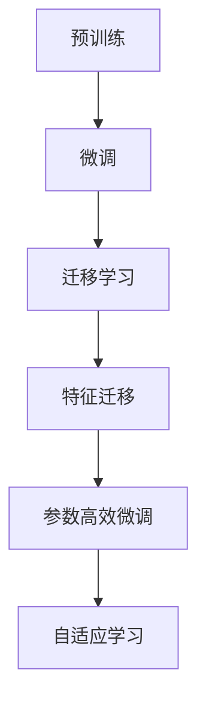

                 

# 迁移学习Transfer Learning原理与代码实例讲解

> 关键词：迁移学习,微调(Fine-tuning),预训练,下游任务,参数高效微调,自然语言处理(NLP)

## 1. 背景介绍

### 1.1 问题由来
迁移学习(Transfer Learning)是机器学习中一种重要的策略，其核心思想是利用已有知识，解决新问题。在深度学习领域，迁移学习常用于大规模预训练模型的迁移应用，通过微调加速新任务的训练，从而获得更优的模型性能。例如，Google的BERT模型就是在大规模语料上进行预训练，然后在特定的NLP任务上进行微调，取得了诸多SOTA的性能表现。

迁移学习不仅能够降低新任务的学习成本，还能在数据稀缺的场景下，通过已有知识弥补数据不足。例如，在大规模图像分类任务上预训练的模型，可以迁移到小规模的图像生成任务中，加速模型收敛，提升生成效果。

近年来，迁移学习已成为深度学习中不可或缺的一部分，极大地推动了人工智能技术的发展。

### 1.2 问题核心关键点
迁移学习主要包含以下几个关键点：
1. 预训练：在大规模数据集上进行无监督学习，学习到通用的特征表示。
2. 微调：在特定任务上，对预训练模型进行有监督学习，优化模型参数，使其适应新任务。
3. 特征迁移：利用预训练模型学到的特征，在新任务上进行迁移应用。
4. 参数高效微调：只调整预训练模型的少量参数，保留大部分不变，提高模型训练效率。
5. 自适应学习：在微调过程中，调整学习率、正则化等超参数，提高模型的适应性。

这些关键点共同构成了迁移学习的理论基础和技术框架。下面，我们逐一深入探讨这些核心概念。

## 2. 核心概念与联系

### 2.1 核心概念概述

为更好地理解迁移学习的原理，本节将介绍几个密切相关的核心概念：

- 预训练(Pre-training)：指在大规模数据集上，通过无监督学习任务训练通用特征表示。常见的预训练任务包括自回归语言模型、自编码器等。
- 微调(Fine-tuning)：指在预训练模型的基础上，使用特定任务的数据集进行有监督学习，调整模型参数以适应新任务。
- 迁移学习(Transfer Learning)：指将一个领域学习到的知识，迁移到另一个领域的学习方法。
- 参数高效微调(Parameter-Efficient Transfer Learning, PETL)：指在微调过程中，只调整预训练模型的少量参数，保留大部分不变，以提高微调效率和避免过拟合。
- 特征迁移(Feature Transfer)：指利用预训练模型学到的特征，在新任务上进行迁移应用，提升模型性能。

这些核心概念之间的逻辑关系可以通过以下Mermaid流程图来展示：



这个流程图展示了迁移学习的核心概念及其之间的关系：

1. 预训练在大规模数据集上学习通用特征。
2. 微调在特定任务上，利用这些特征进行有监督学习。
3. 迁移学习将预训练特征迁移到新任务上。
4. 参数高效微调在保留预训练特征的同时，只调整部分参数。
5. 自适应学习调整超参数，增强模型适应性。

这些概念共同构成了迁移学习的学习和应用框架，使得深度学习模型能够更灵活地应用于各类任务中。

## 3. 核心算法原理 & 具体操作步骤
### 3.1 算法原理概述

迁移学习的核心思想是利用已有知识，解决新问题。具体而言，迁移学习的过程包括以下几个步骤：

1. 在大规模数据集上，通过无监督学习任务预训练模型，学习到通用的特征表示。
2. 在特定任务上，收集少量标注数据，进行微调，优化模型参数，使其适应新任务。
3. 利用预训练模型学到的特征，在新任务上进行迁移应用，提升模型性能。

基于迁移学习的微调方法，具有以下优点：
1. 加速模型收敛。预训练模型已经学到了丰富的知识，微调可以大幅度减少任务学习所需的时间。
2. 提高模型泛化能力。通过迁移学习，模型可以更好地泛化到未见过的数据集上。
3. 减少标注样本需求。相比于从头训练，迁移学习可以在更少的数据上进行微调。
4. 降低计算资源消耗。微调通常只需要调整部分参数，计算成本较低。

### 3.2 算法步骤详解

基于迁移学习的微调一般包括以下几个关键步骤：

**Step 1: 准备预训练模型和数据集**
- 选择合适的预训练模型，如BERT、GPT等。
- 准备目标任务的标注数据集，划分为训练集、验证集和测试集。

**Step 2: 添加任务适配层**
- 根据任务类型，在预训练模型顶层设计合适的输出层和损失函数。
- 对于分类任务，通常在顶层添加线性分类器和交叉熵损失函数。
- 对于生成任务，通常使用语言模型的解码器输出概率分布，并以负对数似然为损失函数。

**Step 3: 设置微调超参数**
- 选择合适的优化算法及其参数，如 AdamW、SGD 等，设置学习率、批大小、迭代轮数等。
- 设置正则化技术及强度，包括权重衰减、Dropout、Early Stopping 等。
- 确定冻结预训练参数的策略，如仅微调顶层，或全部参数都参与微调。

**Step 4: 执行梯度训练**
- 将训练集数据分批次输入模型，前向传播计算损失函数。
- 反向传播计算参数梯度，根据设定的优化算法和学习率更新模型参数。
- 周期性在验证集上评估模型性能，根据性能指标决定是否触发 Early Stopping。
- 重复上述步骤直到满足预设的迭代轮数或 Early Stopping 条件。

**Step 5: 测试和部署**
- 在测试集上评估微调后模型，对比微调前后的精度提升。
- 使用微调后的模型对新样本进行推理预测，集成到实际的应用系统中。
- 持续收集新的数据，定期重新微调模型，以适应数据分布的变化。

以上是基于迁移学习的微调一般流程。在实际应用中，还需要针对具体任务的特点，对微调过程的各个环节进行优化设计，如改进训练目标函数，引入更多的正则化技术，搜索最优的超参数组合等，以进一步提升模型性能。

### 3.3 算法优缺点

基于迁移学习的微调方法具有以下优点：
1. 简单高效。只需准备少量标注数据，即可对预训练模型进行快速适配，获得较大的性能提升。
2. 通用适用。适用于各种NLP下游任务，包括分类、匹配、生成等，设计简单的任务适配层即可实现微调。
3. 参数高效。利用参数高效微调技术，在固定大部分预训练参数的情况下，仍可取得不错的提升。
4. 效果显著。在学术界和工业界的诸多任务上，基于微调的方法已经刷新了最先进的性能指标。

同时，该方法也存在一定的局限性：
1. 依赖标注数据。微调的效果很大程度上取决于标注数据的质量和数量，获取高质量标注数据的成本较高。
2. 迁移能力有限。当目标任务与预训练数据的分布差异较大时，微调的性能提升有限。
3. 负面效果传递。预训练模型的固有偏见、有害信息等，可能通过微调传递到下游任务，造成负面影响。
4. 可解释性不足。微调模型的决策过程通常缺乏可解释性，难以对其推理逻辑进行分析和调试。

尽管存在这些局限性，但就目前而言，基于迁移学习的微调方法仍是大语言模型应用的最主流范式。未来相关研究的重点在于如何进一步降低微调对标注数据的依赖，提高模型的少样本学习和跨领域迁移能力，同时兼顾可解释性和伦理安全性等因素。

### 3.4 算法应用领域

基于迁移学习的微调方法在NLP领域已经得到了广泛的应用，覆盖了几乎所有常见任务，例如：

- 文本分类：如情感分析、主题分类、意图识别等。通过微调使模型学习文本-标签映射。
- 命名实体识别：识别文本中的人名、地名、机构名等特定实体。通过微调使模型掌握实体边界和类型。
- 关系抽取：从文本中抽取实体之间的语义关系。通过微调使模型学习实体-关系三元组。
- 问答系统：对自然语言问题给出答案。将问题-答案对作为微调数据，训练模型学习匹配答案。
- 机器翻译：将源语言文本翻译成目标语言。通过微调使模型学习语言-语言映射。
- 文本摘要：将长文本压缩成简短摘要。将文章-摘要对作为微调数据，使模型学习抓取要点。
- 对话系统：使机器能够与人自然对话。将多轮对话历史作为上下文，微调模型进行回复生成。

除了上述这些经典任务外，迁移学习还被创新性地应用到更多场景中，如可控文本生成、常识推理、代码生成、数据增强等，为NLP技术带来了全新的突破。随着预训练模型和迁移学习方法的不断进步，相信NLP技术将在更广阔的应用领域大放异彩。

## 4. 数学模型和公式 & 详细讲解  
### 4.1 数学模型构建

本节将使用数学语言对基于迁移学习的微调过程进行更加严格的刻画。

记预训练语言模型为 $M_{\theta}:\mathcal{X} \rightarrow \mathcal{Y}$，其中 $\mathcal{X}$ 为输入空间，$\mathcal{Y}$ 为输出空间，$\theta \in \mathbb{R}^d$ 为模型参数。假设微调任务的训练集为 $D=\{(x_i,y_i)\}_{i=1}^N, x_i \in \mathcal{X}, y_i \in \mathcal{Y}$。

定义模型 $M_{\theta}$ 在输入 $x$ 上的损失函数为 $\ell(M_{\theta}(x),y)$，则在数据集 $D$ 上的经验风险为：

$$
\mathcal{L}(\theta) = \frac{1}{N} \sum_{i=1}^N \ell(M_{\theta}(x_i),y_i)
$$

微调的优化目标是最小化经验风险，即找到最优参数：

$$
\theta^* = \mathop{\arg\min}_{\theta} \mathcal{L}(\theta)
$$

在实践中，我们通常使用基于梯度的优化算法（如SGD、Adam等）来近似求解上述最优化问题。设 $\eta$ 为学习率，$\lambda$ 为正则化系数，则参数的更新公式为：

$$
\theta \leftarrow \theta - \eta \nabla_{\theta}\mathcal{L}(\theta) - \eta\lambda\theta
$$

其中 $\nabla_{\theta}\mathcal{L}(\theta)$ 为损失函数对参数 $\theta$ 的梯度，可通过反向传播算法高效计算。

### 4.2 公式推导过程

以下我们以二分类任务为例，推导交叉熵损失函数及其梯度的计算公式。

假设模型 $M_{\theta}$ 在输入 $x$ 上的输出为 $\hat{y}=M_{\theta}(x) \in [0,1]$，表示样本属于正类的概率。真实标签 $y \in \{0,1\}$。则二分类交叉熵损失函数定义为：

$$
\ell(M_{\theta}(x),y) = -[y\log \hat{y} + (1-y)\log (1-\hat{y})]
$$

将其代入经验风险公式，得：

$$
\mathcal{L}(\theta) = -\frac{1}{N}\sum_{i=1}^N [y_i\log M_{\theta}(x_i)+(1-y_i)\log(1-M_{\theta}(x_i))]
$$

根据链式法则，损失函数对参数 $\theta_k$ 的梯度为：

$$
\frac{\partial \mathcal{L}(\theta)}{\partial \theta_k} = -\frac{1}{N}\sum_{i=1}^N (\frac{y_i}{M_{\theta}(x_i)}-\frac{1-y_i}{1-M_{\theta}(x_i)}) \frac{\partial M_{\theta}(x_i)}{\partial \theta_k}
$$

其中 $\frac{\partial M_{\theta}(x_i)}{\partial \theta_k}$ 可进一步递归展开，利用自动微分技术完成计算。

在得到损失函数的梯度后，即可带入参数更新公式，完成模型的迭代优化。重复上述过程直至收敛，最终得到适应下游任务的最优模型参数 $\theta^*$。

## 5. 项目实践：代码实例和详细解释说明
### 5.1 开发环境搭建

在进行迁移学习实践前，我们需要准备好开发环境。以下是使用Python进行PyTorch开发的环境配置流程：

1. 安装Anaconda：从官网下载并安装Anaconda，用于创建独立的Python环境。

2. 创建并激活虚拟环境：
```bash
conda create -n pytorch-env python=3.8 
conda activate pytorch-env
```

3. 安装PyTorch：根据CUDA版本，从官网获取对应的安装命令。例如：
```bash
conda install pytorch torchvision torchaudio cudatoolkit=11.1 -c pytorch -c conda-forge
```

4. 安装Transformers库：
```bash
pip install transformers
```

5. 安装各类工具包：
```bash
pip install numpy pandas scikit-learn matplotlib tqdm jupyter notebook ipython
```

完成上述步骤后，即可在`pytorch-env`环境中开始迁移学习实践。

### 5.2 源代码详细实现

下面我们以文本分类任务为例，给出使用Transformers库对BERT模型进行迁移学习的PyTorch代码实现。

首先，定义文本分类任务的数据处理函数：

```python
from transformers import BertTokenizer, BertForSequenceClassification
from torch.utils.data import Dataset
import torch

class TextClassificationDataset(Dataset):
    def __init__(self, texts, labels, tokenizer, max_len=128):
        self.texts = texts
        self.labels = labels
        self.tokenizer = tokenizer
        self.max_len = max_len
        
    def __len__(self):
        return len(self.texts)
    
    def __getitem__(self, item):
        text = self.texts[item]
        label = self.labels[item]
        
        encoding = self.tokenizer(text, return_tensors='pt', max_length=self.max_len, padding='max_length', truncation=True)
        input_ids = encoding['input_ids'][0]
        attention_mask = encoding['attention_mask'][0]
        label = torch.tensor(label, dtype=torch.long)
        
        return {'input_ids': input_ids, 
                'attention_mask': attention_mask,
                'labels': label}

# 标签与id的映射
label2id = {'negative': 0, 'positive': 1}

# 创建dataset
tokenizer = BertTokenizer.from_pretrained('bert-base-cased')

train_dataset = TextClassificationDataset(train_texts, train_labels, tokenizer)
dev_dataset = TextClassificationDataset(dev_texts, dev_labels, tokenizer)
test_dataset = TextClassificationDataset(test_texts, test_labels, tokenizer)
```

然后，定义模型和优化器：

```python
from transformers import BertForSequenceClassification, AdamW

model = BertForSequenceClassification.from_pretrained('bert-base-cased', num_labels=len(label2id))

optimizer = AdamW(model.parameters(), lr=2e-5)
```

接着，定义训练和评估函数：

```python
from torch.utils.data import DataLoader
from tqdm import tqdm
from sklearn.metrics import classification_report

device = torch.device('cuda') if torch.cuda.is_available() else torch.device('cpu')
model.to(device)

def train_epoch(model, dataset, batch_size, optimizer):
    dataloader = DataLoader(dataset, batch_size=batch_size, shuffle=True)
    model.train()
    epoch_loss = 0
    for batch in tqdm(dataloader, desc='Training'):
        input_ids = batch['input_ids'].to(device)
        attention_mask = batch['attention_mask'].to(device)
        labels = batch['labels'].to(device)
        model.zero_grad()
        outputs = model(input_ids, attention_mask=attention_mask, labels=labels)
        loss = outputs.loss
        epoch_loss += loss.item()
        loss.backward()
        optimizer.step()
    return epoch_loss / len(dataloader)

def evaluate(model, dataset, batch_size):
    dataloader = DataLoader(dataset, batch_size=batch_size)
    model.eval()
    preds, labels = [], []
    with torch.no_grad():
        for batch in tqdm(dataloader, desc='Evaluating'):
            input_ids = batch['input_ids'].to(device)
            attention_mask = batch['attention_mask'].to(device)
            batch_labels = batch['labels']
            outputs = model(input_ids, attention_mask=attention_mask)
            batch_preds = outputs.logits.argmax(dim=1).to('cpu').tolist()
            batch_labels = batch_labels.to('cpu').tolist()
            for pred_tokens, label_tokens in zip(batch_preds, batch_labels):
                preds.append(pred_tokens)
                labels.append(label_tokens)
                
    print(classification_report(labels, preds))
```

最后，启动训练流程并在测试集上评估：

```python
epochs = 5
batch_size = 16

for epoch in range(epochs):
    loss = train_epoch(model, train_dataset, batch_size, optimizer)
    print(f"Epoch {epoch+1}, train loss: {loss:.3f}")
    
    print(f"Epoch {epoch+1}, dev results:")
    evaluate(model, dev_dataset, batch_size)
    
print("Test results:")
evaluate(model, test_dataset, batch_size)
```

以上就是使用PyTorch对BERT进行文本分类任务迁移学习的完整代码实现。可以看到，得益于Transformers库的强大封装，我们可以用相对简洁的代码完成BERT模型的加载和迁移学习。

### 5.3 代码解读与分析

让我们再详细解读一下关键代码的实现细节：

**TextClassificationDataset类**：
- `__init__`方法：初始化文本、标签、分词器等关键组件。
- `__len__`方法：返回数据集的样本数量。
- `__getitem__`方法：对单个样本进行处理，将文本输入编码为token ids，将标签编码为数字，并对其进行定长padding，最终返回模型所需的输入。

**label2id字典**：
- 定义了标签与数字id之间的映射关系，用于将预测结果解码回真实的标签。

**训练和评估函数**：
- 使用PyTorch的DataLoader对数据集进行批次化加载，供模型训练和推理使用。
- 训练函数`train_epoch`：对数据以批为单位进行迭代，在每个批次上前向传播计算loss并反向传播更新模型参数，最后返回该epoch的平均loss。
- 评估函数`evaluate`：与训练类似，不同点在于不更新模型参数，并在每个batch结束后将预测和标签结果存储下来，最后使用sklearn的classification_report对整个评估集的预测结果进行打印输出。

**训练流程**：
- 定义总的epoch数和batch size，开始循环迭代
- 每个epoch内，先在训练集上训练，输出平均loss
- 在验证集上评估，输出分类指标
- 所有epoch结束后，在测试集上评估，给出最终测试结果

可以看到，PyTorch配合Transformers库使得BERT迁移学习的代码实现变得简洁高效。开发者可以将更多精力放在数据处理、模型改进等高层逻辑上，而不必过多关注底层的实现细节。

当然，工业级的系统实现还需考虑更多因素，如模型的保存和部署、超参数的自动搜索、更灵活的任务适配层等。但核心的迁移学习范式基本与此类似。

## 6. 实际应用场景
### 6.1 智能客服系统

基于迁移学习的对话技术，可以广泛应用于智能客服系统的构建。传统客服往往需要配备大量人力，高峰期响应缓慢，且一致性和专业性难以保证。而使用迁移学习后的对话模型，可以7x24小时不间断服务，快速响应客户咨询，用自然流畅的语言解答各类常见问题。

在技术实现上，可以收集企业内部的历史客服对话记录，将问题和最佳答复构建成监督数据，在此基础上对预训练对话模型进行迁移学习。迁移学习后的对话模型能够自动理解用户意图，匹配最合适的答案模板进行回复。对于客户提出的新问题，还可以接入检索系统实时搜索相关内容，动态组织生成回答。如此构建的智能客服系统，能大幅提升客户咨询体验和问题解决效率。

### 6.2 金融舆情监测

金融机构需要实时监测市场舆论动向，以便及时应对负面信息传播，规避金融风险。传统的人工监测方式成本高、效率低，难以应对网络时代海量信息爆发的挑战。基于迁移学习的文本分类和情感分析技术，为金融舆情监测提供了新的解决方案。

具体而言，可以收集金融领域相关的新闻、报道、评论等文本数据，并对其进行主题标注和情感标注。在此基础上对预训练语言模型进行迁移学习，使其能够自动判断文本属于何种主题，情感倾向是正面、中性还是负面。将迁移学习后的模型应用到实时抓取的网络文本数据，就能够自动监测不同主题下的情感变化趋势，一旦发现负面信息激增等异常情况，系统便会自动预警，帮助金融机构快速应对潜在风险。

### 6.3 个性化推荐系统

当前的推荐系统往往只依赖用户的历史行为数据进行物品推荐，无法深入理解用户的真实兴趣偏好。基于迁移学习的个性化推荐系统可以更好地挖掘用户行为背后的语义信息，从而提供更精准、多样的推荐内容。

在实践中，可以收集用户浏览、点击、评论、分享等行为数据，提取和用户交互的物品标题、描述、标签等文本内容。将文本内容作为模型输入，用户的后续行为（如是否点击、购买等）作为监督信号，在此基础上迁移学习预训练语言模型。迁移学习后的模型能够从文本内容中准确把握用户的兴趣点。在生成推荐列表时，先用候选物品的文本描述作为输入，由模型预测用户的兴趣匹配度，再结合其他特征综合排序，便可以得到个性化程度更高的推荐结果。

### 6.4 未来应用展望

随着迁移学习技术的不断发展，基于迁移学习的模型将在更多领域得到应用，为传统行业带来变革性影响。

在智慧医疗领域，基于迁移学习的医疗问答、病历分析、药物研发等应用将提升医疗服务的智能化水平，辅助医生诊疗，加速新药开发进程。

在智能教育领域，迁移学习可应用于作业批改、学情分析、知识推荐等方面，因材施教，促进教育公平，提高教学质量。

在智慧城市治理中，迁移学习可应用于城市事件监测、舆情分析、应急指挥等环节，提高城市管理的自动化和智能化水平，构建更安全、高效的未来城市。

此外，在企业生产、社会治理、文娱传媒等众多领域，基于迁移学习的AI应用也将不断涌现，为经济社会发展注入新的动力。相信随着技术的日益成熟，迁移学习技术将成为AI落地应用的重要范式，推动AI技术向更广阔的领域加速渗透。

## 7. 工具和资源推荐
### 7.1 学习资源推荐

为了帮助开发者系统掌握迁移学习的理论基础和实践技巧，这里推荐一些优质的学习资源：

1. 《深度学习入门》系列博文：由大模型技术专家撰写，介绍了深度学习的基本概念和常用算法，包含迁移学习、微调等前沿话题。

2. CS231n《卷积神经网络》课程：斯坦福大学开设的经典计算机视觉课程，有Lecture视频和配套作业，带你入门计算机视觉领域的基本概念和经典模型。

3. 《Pattern Recognition and Machine Learning》书籍：Christopher M. Bishop所著，深入介绍了机器学习的基本原理和算法，涵盖了迁移学习的理论基础。

4. Coursera《机器学习》课程：由Andrew Ng主讲的机器学习入门课程，从基础算法到模型应用，全面讲解了机器学习的核心思想。

5. TensorFlow官方文档：TensorFlow的官方文档，提供了丰富的API和教程，是深度学习开发的重要参考资料。

6. Kaggle：机器学习竞赛平台，提供海量数据集和模型资源，是学习和应用迁移学习的重要实践场所。

通过对这些资源的学习实践，相信你一定能够快速掌握迁移学习的精髓，并用于解决实际的机器学习问题。
###  7.2 开发工具推荐

高效的开发离不开优秀的工具支持。以下是几款用于迁移学习开发的常用工具：

1. PyTorch：基于Python的开源深度学习框架，灵活动态的计算图，适合快速迭代研究。大部分预训练语言模型都有PyTorch版本的实现。

2. TensorFlow：由Google主导开发的开源深度学习框架，生产部署方便，适合大规模工程应用。同样有丰富的预训练语言模型资源。

3. Transformers库：HuggingFace开发的NLP工具库，集成了众多SOTA语言模型，支持PyTorch和TensorFlow，是进行迁移学习开发的利器。

4. Weights & Biases：模型训练的实验跟踪工具，可以记录和可视化模型训练过程中的各项指标，方便对比和调优。与主流深度学习框架无缝集成。

5. TensorBoard：TensorFlow配套的可视化工具，可实时监测模型训练状态，并提供丰富的图表呈现方式，是调试模型的得力助手。

6. Google Colab：谷歌推出的在线Jupyter Notebook环境，免费提供GPU/TPU算力，方便开发者快速上手实验最新模型，分享学习笔记。

合理利用这些工具，可以显著提升迁移学习任务的开发效率，加快创新迭代的步伐。

### 7.3 相关论文推荐

迁移学习的发展离不开学界的持续研究。以下是几篇奠基性的相关论文，推荐阅读：

1. Alex Krizhevsky, Ilya Sutskever, Geoffrey Hinton. ImageNet Classification with Deep Convolutional Neural Networks: a Large-Scale Microbenchmark. International Conference on Neural Information Processing Systems (NIPS), 2012.（深度卷积神经网络）

2. Andrew Ng, Michael I. Jordan. On the Shoulders of Giants: Learning Deep Architectures for AI. MIT Press, 2016.

3. Pedro Domingos. The Master Algorithm. The Quest for the Ultimate Learning Machine. Penguin Books, 2015.

4. Ian Goodfellow, Yoshua Bengio, Aaron Courville. Deep Learning. MIT Press, 2016.

5. Christopher M. Bishop. Pattern Recognition and Machine Learning. Springer, 2006.

6. NIPS 2011 Deep Multi-task Learning for Connected Speech Recognition: a Simple Approach. Gerome Dupont, Nando de Freitas, Yoshua Bengio.

这些论文代表了大模型迁移学习的发展脉络。通过学习这些前沿成果，可以帮助研究者把握学科前进方向，激发更多的创新灵感。

## 8. 总结：未来发展趋势与挑战

### 8.1 总结

本文对基于迁移学习的微调方法进行了全面系统的介绍。首先阐述了迁移学习的背景和意义，明确了迁移学习在加速模型收敛、提高泛化能力等方面的独特价值。其次，从原理到实践，详细讲解了迁移学习的数学原理和关键步骤，给出了迁移学习任务开发的完整代码实例。同时，本文还广泛探讨了迁移学习在智能客服、金融舆情、个性化推荐等多个行业领域的应用前景，展示了迁移学习范式的巨大潜力。此外，本文精选了迁移学习的各类学习资源，力求为读者提供全方位的技术指引。

通过本文的系统梳理，可以看到，基于迁移学习的微调方法正在成为深度学习领域的重要范式，极大地加速了模型的训练和应用进程。未来，伴随迁移学习技术的不断演进，深度学习模型将能够在更多领域发挥更大的作用，带来更丰富的应用场景和更强大的性能。

### 8.2 未来发展趋势

展望未来，迁移学习技术将呈现以下几个发展趋势：

1. 模型规模持续增大。随着算力成本的下降和数据规模的扩张，预训练模型和迁移学习模型的参数量还将持续增长。超大规模语言模型蕴含的丰富知识，有望支撑更加复杂多变的下游任务迁移学习。

2. 迁移方法日趋多样。除了传统的全参数迁移外，未来会涌现更多参数高效的迁移方法，如 Adapter、LoRA 等，在节省计算资源的同时也能保证迁移精度。

3. 持续学习成为常态。随着数据分布的不断变化，迁移学习模型也需要持续学习新知识以保持性能。如何在不遗忘原有知识的同时，高效吸收新样本信息，将成为重要的研究课题。

4. 标注样本需求降低。受启发于提示学习(Prompt-based Learning)的思路，未来的迁移学习方法将更好地利用大模型的语言理解能力，通过更加巧妙的任务描述，在更少的标注样本上也能实现理想的迁移效果。

5. 多模态迁移崛起。当前的迁移学习主要聚焦于纯文本数据，未来会进一步拓展到图像、视频、语音等多模态数据迁移学习。多模态信息的融合，将显著提升迁移学习模型的理解能力。

6. 模型通用性增强。经过海量数据的预训练和多领域任务的迁移学习，未来的深度学习模型将具备更强大的常识推理和跨领域迁移能力，逐步迈向通用人工智能(AGI)的目标。

以上趋势凸显了迁移学习技术的广阔前景。这些方向的探索发展，必将进一步提升深度学习模型的性能和应用范围，为人工智能技术的发展注入新的活力。

### 8.3 面临的挑战

尽管迁移学习技术已经取得了瞩目成就，但在迈向更加智能化、普适化应用的过程中，它仍面临着诸多挑战：

1. 标注成本瓶颈。尽管迁移学习可以降低任务学习所需的时间，但对于长尾应用场景，难以获得充足的高质量标注数据，成为制约迁移学习性能的瓶颈。如何进一步降低迁移学习对标注样本的依赖，将是一大难题。

2. 模型鲁棒性不足。当前迁移学习模型面对域外数据时，泛化性能往往大打折扣。对于测试样本的微小扰动，迁移学习模型的预测也容易发生波动。如何提高迁移学习模型的鲁棒性，避免灾难性遗忘，还需要更多理论和实践的积累。

3. 推理效率有待提高。虽然迁移学习模型能够显著提高训练速度，但在实际部署时往往面临推理速度慢、内存占用大等效率问题。如何优化迁移学习模型的计算图，减小内存占用，提升推理速度，将是重要的优化方向。

4. 可解释性亟需加强。迁移学习模型通常缺乏可解释性，难以解释其内部工作机制和决策逻辑。对于医疗、金融等高风险应用，算法的可解释性和可审计性尤为重要。如何赋予迁移学习模型更强的可解释性，将是亟待攻克的难题。

5. 安全性有待保障。预训练语言模型难免会学习到有偏见、有害的信息，通过迁移学习传递到下游任务，产生误导性、歧视性的输出，给实际应用带来安全隐患。如何从数据和算法层面消除模型偏见，避免恶意用途，确保输出的安全性，也将是重要的研究课题。

6. 知识整合能力不足。现有的迁移学习模型往往局限于任务内数据，难以灵活吸收和运用更广泛的先验知识。如何让迁移学习过程更好地与外部知识库、规则库等专家知识结合，形成更加全面、准确的信息整合能力，还有很大的想象空间。

正视迁移学习面临的这些挑战，积极应对并寻求突破，将是大模型迁移学习走向成熟的必由之路。相信随着学界和产业界的共同努力，这些挑战终将一一被克服，迁移学习技术必将在构建人机协同的智能时代中扮演越来越重要的角色。

### 8.4 未来突破

面对迁移学习所面临的种种挑战，未来的研究需要在以下几个方面寻求新的突破：

1. 探索无监督和半监督迁移方法。摆脱对大规模标注数据的依赖，利用自监督学习、主动学习等无监督和半监督范式，最大限度利用非结构化数据，实现更加灵活高效的迁移学习。

2. 研究参数高效和计算高效的迁移范式。开发更加参数高效的迁移方法，在固定大部分预训练参数的同时，只调整预训练模型的少量任务相关参数。同时优化迁移学习模型的计算图，减少前向传播和反向传播的资源消耗，实现更加轻量级、实时性的部署。

3. 融合因果和对比学习范式。通过引入因果推断和对比学习思想，增强迁移学习模型建立稳定因果关系的能力，学习更加普适、鲁棒的语言表征，从而提升模型泛化性和抗干扰能力。

4. 引入更多先验知识。将符号化的先验知识，如知识图谱、逻辑规则等，与神经网络模型进行巧妙融合，引导迁移学习过程学习更准确、合理的语言模型。同时加强不同模态数据的整合，实现视觉、语音等多模态信息与文本信息的协同建模。

5. 结合因果分析和博弈论工具。将因果分析方法引入迁移学习模型，识别出模型决策的关键特征，增强输出解释的因果性和逻辑性。借助博弈论工具刻画人机交互过程，主动探索并规避模型的脆弱点，提高系统稳定性。

6. 纳入伦理道德约束。在迁移学习目标中引入伦理导向的评估指标，过滤和惩罚有偏见、有害的输出倾向。同时加强人工干预和审核，建立模型行为的监管机制，确保输出符合人类价值观和伦理道德。

这些研究方向的探索，必将引领迁移学习技术迈向更高的台阶，为构建安全、可靠、可解释、可控的智能系统铺平道路。面向未来，迁移学习技术还需要与其他人工智能技术进行更深入的融合，如知识表示、因果推理、强化学习等，多路径协同发力，共同推动自然语言理解和智能交互系统的进步。只有勇于创新、敢于突破，才能不断拓展语言模型的边界，让智能技术更好地造福人类社会。

## 9. 附录：常见问题与解答

**Q1：迁移学习是否适用于所有机器学习任务？**

A: 迁移学习可以应用于各类机器学习任务，特别是数据量较少且结构相似的任务。例如，在图像分类、文本分类、语音识别等任务中，迁移学习可以大幅减少训练时间和标注成本。但对于一些特定领域的任务，如医学、法律等，仅仅依靠通用语料预训练的模型可能难以很好地适应。此时需要在特定领域语料上进一步预训练，再进行迁移学习，才能获得理想效果。

**Q2：迁移学习中如何选择预训练模型？**

A: 选择合适的预训练模型是迁移学习成功的关键。通常，预训练模型的选择取决于任务的性质和数据特征。例如，对于图像分类任务，可以选择ImageNet预训练的ResNet、VGG等模型。对于文本分类任务，可以选择在大规模语料上预训练的BERT、GPT等模型。在选择预训练模型时，还需要考虑其适用范围、模型大小、计算资源等因素，进行综合评估。

**Q3：迁移学习中如何处理域外数据？**

A: 域外数据是指与预训练模型训练数据分布不同的新数据。为了应对域外数据，可以采用以下方法：
1. 对抗训练：在训练过程中引入对抗样本，提高模型鲁棒性。
2. 数据增强：通过旋转、缩放、裁剪等方式扩充训练集，减少域外数据的负面影响。
3. 迁移学习：在预训练模型上微调部分层，适应新数据的分布。
4. 多任务学习：在迁移学习过程中同时学习多个相关任务，增强模型的泛化能力。

**Q4：迁移学习中如何处理数据不平衡问题？**

A: 数据不平衡是指训练集中各类别样本数量差异较大，可能导致模型对少数类别的预测性能较差。为解决这一问题，可以采用以下方法：
1. 过采样和欠采样：通过过采样少数类别样本或欠采样多数类别样本，平衡数据分布。
2. 重加权：在损失函数中对少数类别样本进行重加权，增加其权重。
3. 生成数据：使用GAN等生成模型，生成少数类别样本，丰富训练集。
4. 迁移学习：在预训练模型上微调部分层，增强模型对少数类别的泛化能力。

**Q5：迁移学习中如何选择迁移学习策略？**

A: 迁移学习策略的选择取决于具体任务和数据特点。通常，可以选择以下几种策略：
1. 特征迁移：仅迁移预训练模型的特征表示，保留模型参数不变。
2. 参数迁移：仅迁移预训练模型的一部分参数，固定其他参数。
3. 微调：全面迁移预训练模型参数，适用于数据量较大的任务。
4. 自适应迁移：在微调过程中调整学习率、正则化等超参数，提高模型适应性。

这些策略往往需要根据具体任务和数据特点进行灵活组合。只有在数据、模型、训练、推理等各环节进行全面优化，才能最大限度地发挥迁移学习的威力。

---

作者：禅与计算机程序设计艺术 / Zen and the Art of Computer Programming

