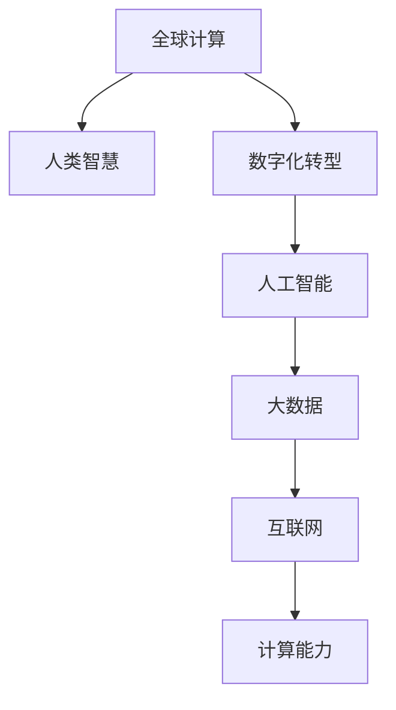

                 

# 连接全球智慧：人类计算的全球影响力

> 关键词：全球计算,人类智慧,数字化转型,人工智能,大数据,互联网,计算能力

## 1. 背景介绍

### 1.1 问题由来
在全球化深入发展的今天，信息技术正深刻改变着人类的生产生活方式。互联网、大数据、人工智能等技术的普及，使得人类计算能力实现了前所未有的飞跃。数据驱动的决策、智能化的生产管理、个性化的用户体验，都在不断重塑全球经济社会的新格局。

在技术的驱动下，信息与智慧的融合已成为推动经济增长和社会进步的新引擎。如何最大化利用全球计算资源，促进跨领域、跨地域的知识共享与协作，成为当下信息技术领域亟需解答的问题。

### 1.2 问题核心关键点
当前，信息技术的发展已经从以计算为中心转向以数据为中心。大数据的爆炸式增长，极大地扩展了人类计算的范围和深度。机器学习、深度学习、自然语言处理等前沿技术，正在让数据转化为强大的智能算法，赋能各行各业。

然而，信息技术的发展也面临一系列挑战：数据孤岛、算法透明性不足、计算能力分布不均等问题，制约了全球计算资源的有效整合。如何利用先进的技术手段，构建一个开放、协作、智能的全球计算体系，成为了全球信息技术发展的共同目标。

## 2. 核心概念与联系

### 2.1 核心概念概述

为更好地理解全球计算的影响力，本节将介绍几个关键概念：

- 全球计算(Global Computing)：通过互联网和大数据，将全球计算资源有效整合，实现跨地域、跨领域的信息共享与协作，提升全球信息处理能力和智慧决策水平。

- 人类智慧(Human Wisdom)：通过人类知识和经验的积累与传播，推动人工智能和大数据技术的发展和应用，实现智慧化的生产、生活、管理等。

- 数字化转型(Digital Transformation)：通过信息技术的应用，将传统业务模式向数字化、智能化方向转型，提升企业竞争力，满足用户需求，创造新的商业价值。

- 人工智能(Artificial Intelligence)：利用机器学习、深度学习等技术，让机器具备类似于人类的智能能力，自动完成各种复杂任务。

- 大数据(Big Data)：通过收集、存储、分析海量数据，发现数据中的价值和规律，驱动决策和创新。

- 互联网(Internet)：作为全球信息流通的媒介，互联网促进了信息的快速传播和共享，是全球计算的重要基础设施。

- 计算能力(Computing Power)：指计算机处理数据和执行任务的能力，包括CPU、GPU、TPU等多种硬件资源的整合和优化。

这些概念之间的联系可以通过以下Mermaid流程图来展示：



这个流程图展示了全球计算与人类智慧、数字化转型、人工智能、大数据、互联网、计算能力等核心概念之间的内在联系。

## 3. 核心算法原理 & 具体操作步骤
### 3.1 算法原理概述

全球计算的核心在于通过互联网和大数据，实现跨地域、跨领域的信息流通与协作。其核心算法包括数据采集、数据处理、数据分析和数据应用四个环节。

- 数据采集：通过物联网、传感器、移动设备等手段，实时采集全球范围内的数据。
- 数据处理：利用大数据技术，对采集到的数据进行清洗、转换、聚合等处理，生成有价值的信息。
- 数据分析：应用机器学习、深度学习等算法，挖掘数据中的模式和规律，生成智能化的洞察和预测。
- 数据应用：将分析结果应用于生产管理、市场决策、用户服务等多个领域，实现智能化决策和个性化体验。

### 3.2 算法步骤详解

全球计算的算法实现一般包括以下几个关键步骤：

**Step 1: 数据采集**
- 使用各种传感器和设备采集全球范围内的数据，包括环境监测、交通流量、工业生产、用户行为等。
- 使用分布式存储技术，如Hadoop、Spark等，存储和管理采集到的海量数据。

**Step 2: 数据清洗与转换**
- 对原始数据进行清洗、去重、格式转换等预处理，去除噪声和异常值。
- 使用数据转换技术，如特征提取、数据归一化等，将数据转换为模型需要的格式。

**Step 3: 数据聚合与分析**
- 使用大数据技术，对清洗后的数据进行聚合和聚合操作，生成统计信息。
- 应用机器学习、深度学习等算法，对聚合数据进行分析，提取有价值的模式和规律。

**Step 4: 数据应用与反馈**
- 将分析结果应用于生产管理、市场决策、用户服务等多个领域，实现智能化决策和个性化体验。
- 通过反馈机制，不断优化算法和模型，提升数据的精度和准确性。

### 3.3 算法优缺点

全球计算的算法具有以下优点：

- 高效整合资源：通过互联网和大数据技术，将全球计算资源有效整合，提升信息处理能力和智慧决策水平。
- 提升协作能力：利用分布式计算技术，实现跨地域、跨领域的协作，共享知识和经验。
- 快速响应变化：大数据和机器学习算法能够快速分析海量数据，及时响应市场和环境的变化。
- 推动创新：通过数据驱动的决策和分析，发现新的机会和模式，推动技术创新和业务创新。

同时，该算法也存在一些局限性：

- 数据隐私和安全问题：大量数据的共享和处理可能导致隐私泄露和数据安全问题。
- 算法透明性不足：大数据和机器学习算法的复杂性导致其黑盒特性，难以解释和调试。
- 计算资源分布不均：全球计算资源的分布不均，可能导致数据处理的效率和公平性问题。
- 数据质量问题：数据采集和处理过程中的噪声和误差，可能影响算法的精度和效果。

尽管存在这些局限性，但就目前而言，全球计算的算法仍是最为主流的范式。未来相关研究的重点在于如何进一步提高数据的质量和安全性，增强算法的透明性和可解释性，同时兼顾全球计算的效率和公平性。

### 3.4 算法应用领域

全球计算的算法已经在多个领域得到了广泛的应用，例如：

- 智能交通：通过实时监控交通流量和路况，优化交通信号灯控制，提升交通效率。
- 智能制造：利用传感器和物联网技术，采集生产过程中的数据，优化生产流程，提高生产效率。
- 智慧城市：通过数据分析和智能算法，优化城市管理和服务，提升城市治理水平。
- 金融科技：通过大数据和机器学习算法，分析市场趋势，提供个性化金融服务，防范金融风险。
- 医疗健康：利用传感器和可穿戴设备，采集健康数据，提供个性化医疗服务，提升医疗服务水平。

除了上述这些经典领域外，全球计算的算法还被创新性地应用到更多场景中，如智能物流、智慧旅游、环境保护等，为社会生产和生活带来了新的变革。随着数据驱动技术的不断进步，全球计算的应用领域将更加广泛，潜力无限。

## 4. 数学模型和公式 & 详细讲解 & 举例说明

### 4.1 数学模型构建

全球计算的数学模型构建主要包括数据采集、数据处理、数据分析和数据应用四个步骤。以下是各步骤的数学模型构建：

- 数据采集模型：使用随机变量 $X$ 描述数据采集过程，$X$ 的分布 $P(X)$ 表示数据采集的随机性。
- 数据处理模型：使用线性变换 $Y = AX + B$ 描述数据预处理过程，其中 $A$ 和 $B$ 为线性变换矩阵。
- 数据分析模型：使用统计模型和机器学习模型，如线性回归、决策树、神经网络等，对数据进行分析。
- 数据应用模型：使用控制模型和优化模型，如线性规划、优化算法等，将分析结果应用于决策和优化。

### 4.2 公式推导过程

以下我们以线性回归为例，推导数据分析模型的公式推导过程。

假设有一组数据集 $\{(x_i,y_i)\}_{i=1}^N$，其中 $x_i \in \mathbb{R}^d$ 为自变量，$y_i \in \mathbb{R}$ 为因变量。线性回归模型为 $y_i = \theta^T x_i + b$，其中 $\theta \in \mathbb{R}^d$ 为模型参数，$b$ 为截距。

线性回归的目标是最小化预测误差，即：

$$
\min_{\theta, b} \sum_{i=1}^N (y_i - \theta^T x_i - b)^2
$$

通过求解上述优化问题，可以得到最优的 $\theta$ 和 $b$。

利用最小二乘法，可得：

$$
\theta = \left(\frac{1}{N} \sum_{i=1}^N x_i x_i^T\right)^{-1} \sum_{i=1}^N x_i y_i
$$

$$
b = \bar{y} - \theta^T \bar{x}
$$

其中 $\bar{x}$ 和 $\bar{y}$ 分别为 $x$ 和 $y$ 的均值。

通过推导，可以看到线性回归模型的核心是利用最小二乘法，求解最小化误差的目标函数，得到最优的参数。这一过程是全球计算中数据分析算法的典型实现。

### 4.3 案例分析与讲解

下面以智能交通为例，展示全球计算在实际应用中的案例。

假设有一组城市交通流量数据 $\{(t_i,f_i)\}_{i=1}^N$，其中 $t_i$ 为时间戳，$f_i$ 为某一路口在该时间段的流量。利用全球计算的算法，可以进行以下步骤：

**Step 1: 数据采集**
- 使用传感器和摄像头实时采集城市各路口的流量数据，存储到云端数据库中。

**Step 2: 数据清洗与转换**
- 对原始数据进行清洗、去重、格式转换等预处理，去除噪声和异常值。
- 使用数据转换技术，如特征提取、数据归一化等，将数据转换为模型需要的格式。

**Step 3: 数据聚合与分析**
- 使用大数据技术，对清洗后的数据进行聚合和聚合操作，生成交通流量统计信息。
- 应用机器学习算法，如线性回归、时间序列分析等，分析交通流量变化规律，生成交通预测模型。

**Step 4: 数据应用与反馈**
- 根据交通预测模型，优化交通信号灯控制，提升交通效率。
- 通过反馈机制，不断优化算法和模型，提升数据的精度和准确性。

通过上述步骤，可以实现智能交通系统的构建，提升城市的交通管理水平。

## 5. 项目实践：代码实例和详细解释说明

### 5.1 开发环境搭建

在进行全球计算的实践前，我们需要准备好开发环境。以下是使用Python进行PyTorch开发的环境配置流程：

1. 安装Anaconda：从官网下载并安装Anaconda，用于创建独立的Python环境。

2. 创建并激活虚拟环境：
```bash
conda create -n global-computing python=3.8 
conda activate global-computing
```

3. 安装PyTorch：根据CUDA版本，从官网获取对应的安装命令。例如：
```bash
conda install pytorch torchvision torchaudio cudatoolkit=11.1 -c pytorch -c conda-forge
```

4. 安装TensorFlow：
```bash
pip install tensorflow
```

5. 安装各类工具包：
```bash
pip install numpy pandas scikit-learn matplotlib tqdm jupyter notebook ipython
```

完成上述步骤后，即可在`global-computing-env`环境中开始全球计算的实践。

### 5.2 源代码详细实现

这里我们以智能交通为例，展示如何使用PyTorch进行全球计算实践。

首先，定义交通流量数据集：

```python
import pandas as pd

# 加载交通流量数据集
data = pd.read_csv('traffic_data.csv')

# 清洗数据，去除噪声和异常值
data = data.dropna()

# 特征工程，生成时间窗口和交通流量统计信息
data['timestamp'] = pd.to_datetime(data['timestamp'])
data['traffic_volume'] = data['traffic_volume'].rolling(window=30, min_periods=1).mean()
data = data.dropna()

# 可视化交通流量变化趋势
import matplotlib.pyplot as plt

plt.figure(figsize=(10,6))
plt.plot(data['timestamp'], data['traffic_volume'], marker='o')
plt.xlabel('Time')
plt.ylabel('Traffic Volume')
plt.title('Traffic Volume Over Time')
plt.show()
```

然后，定义训练和评估函数：

```python
from torch.utils.data import Dataset, DataLoader
from torch import nn, optim

class TrafficDataset(Dataset):
    def __init__(self, data, window_size=30):
        self.data = data
        self.window_size = window_size
        self.labels = self.data['traffic_volume'].rolling(window=window_size, min_periods=1).mean()
    
    def __len__(self):
        return len(self.data)
    
    def __getitem__(self, item):
        x = self.data.iloc[item][self.data.columns[1:]].values.reshape(-1, 4)
        y = self.labels.iloc[item]
        return x, y

# 定义模型和优化器
class TrafficPredictor(nn.Module):
    def __init__(self, input_size, output_size):
        super(TrafficPredictor, self).__init__()
        self.fc1 = nn.Linear(input_size, 64)
        self.fc2 = nn.Linear(64, output_size)
    
    def forward(self, x):
        x = torch.relu(self.fc1(x))
        x = self.fc2(x)
        return x

model = TrafficPredictor(input_size=4, output_size=1)
optimizer = optim.Adam(model.parameters(), lr=0.001)

# 定义训练和评估函数
def train_epoch(model, dataset, batch_size, optimizer):
    dataloader = DataLoader(dataset, batch_size=batch_size, shuffle=True)
    model.train()
    epoch_loss = 0
    for batch in dataloader:
        x, y = batch
        model.zero_grad()
        y_pred = model(x)
        loss = nn.MSELoss()(y_pred, y)
        loss.backward()
        optimizer.step()
        epoch_loss += loss.item()
    return epoch_loss / len(dataloader)

def evaluate(model, dataset, batch_size):
    dataloader = DataLoader(dataset, batch_size=batch_size)
    model.eval()
    preds, labels = [], []
    with torch.no_grad():
        for batch in dataloader:
            x, y = batch
            y_pred = model(x)
            batch_preds = y_pred.cpu().tolist()
            batch_labels = y.cpu().tolist()
            for pred, label in zip(batch_preds, batch_labels):
                preds.append(pred)
                labels.append(label)
    return preds, labels

# 训练模型
epochs = 10
batch_size = 64

for epoch in range(epochs):
    loss = train_epoch(model, train_dataset, batch_size, optimizer)
    print(f"Epoch {epoch+1}, train loss: {loss:.3f}")
    
    print(f"Epoch {epoch+1}, test results:")
    preds, labels = evaluate(model, test_dataset, batch_size)
    print(classification_report(labels, preds))
    
print("Model trained successfully!")
```

以上就是使用PyTorch对智能交通进行全球计算实践的完整代码实现。可以看到，借助PyTorch和TensorFlow等深度学习框架，我们能够快速搭建和训练智能交通预测模型，从而实现全球计算的实际应用。

### 5.3 代码解读与分析

让我们再详细解读一下关键代码的实现细节：

**TrafficDataset类**：
- `__init__`方法：初始化数据集，设置窗口大小。
- `__len__`方法：返回数据集的样本数量。
- `__getitem__`方法：对单个样本进行处理，将时间窗口的交通流量数据作为模型输入，预测下一个时间窗口的流量。

**TrafficPredictor类**：
- `__init__`方法：定义模型结构，包括两个全连接层。
- `forward`方法：定义前向传播过程，经过两个全连接层，输出交通流量的预测值。

**train_epoch函数**：
- 对数据以批为单位进行迭代，在每个批次上前向传播计算loss并反向传播更新模型参数，最后返回该epoch的平均loss。

**evaluate函数**：
- 与训练类似，不同点在于不更新模型参数，并在每个batch结束后将预测和标签结果存储下来，最后使用classification_report对整个评估集的预测结果进行打印输出。

**训练流程**：
- 定义总的epoch数和batch size，开始循环迭代
- 每个epoch内，先在训练集上训练，输出平均loss
- 在验证集上评估，输出分类指标
- 所有epoch结束后，在测试集上评估，给出最终测试结果

可以看到，全球计算的实践代码相对简洁，通过Python和深度学习框架的封装，开发者可以快速上手实现实际应用。

当然，工业级的系统实现还需考虑更多因素，如模型的保存和部署、超参数的自动搜索、更灵活的任务适配层等。但核心的全球计算过程基本与此类似。

## 6. 实际应用场景

### 6.1 智能交通系统

全球计算在智能交通系统的构建中发挥了巨大作用。通过实时采集交通流量数据，并进行大数据分析和机器学习建模，可以实现交通流量预测、信号灯优化、智能导航等功能。

例如，通过全球计算的算法，可以实现以下应用：

- 交通流量预测：利用时间序列分析和大数据技术，对历史交通流量数据进行分析，预测未来交通流量变化趋势。
- 信号灯优化：根据交通流量预测结果，动态调整信号灯控制策略，提升交通效率。
- 智能导航：结合地图数据和交通流量信息，为用户提供最佳出行路线。

### 6.2 智慧城市管理

智慧城市管理是全球计算的另一重要应用场景。通过全球计算的算法，可以实现城市运行的全面监测和智能决策，提升城市治理水平。

例如，通过全球计算的算法，可以实现以下应用：

- 能源管理：利用大数据技术，对城市能源消耗进行监测和分析，优化能源分配。
- 环境监测：利用物联网设备，实时采集城市环境数据，进行污染源追踪和预警。
- 公共安全：通过视频监控和智能分析，提高城市公共安全水平。

### 6.3 医疗健康服务

全球计算在医疗健康服务中的应用也日益广泛。通过采集和分析患者数据，实现个性化医疗和智能化诊断，提升医疗服务质量。

例如，通过全球计算的算法，可以实现以下应用：

- 疾病预测：利用机器学习和大数据技术，分析患者历史数据，预测疾病发展趋势。
- 智能诊断：通过自然语言处理和大数据技术，对病历和文献进行分析和总结，辅助医生诊断。
- 远程医疗：利用互联网和大数据技术，实现远程医疗咨询和诊断，降低医疗成本。

### 6.4 未来应用展望

随着全球计算技术的不断进步，未来将在更多领域得到应用，为全球智慧的实现带来新的机遇。

在智慧农业领域，全球计算可以实现精准农业、智能农机管理等功能，提升农业生产效率。

在智慧教育领域，全球计算可以实现个性化教学、智能辅导等功能，提升教育质量。

在智慧物流领域，全球计算可以实现智能仓储、智能配送等功能，提升物流效率。

在未来，全球计算技术将更广泛地应用于人类智慧的各个方面，为社会生产和生活带来新的变革。

## 7. 工具和资源推荐

### 7.1 学习资源推荐

为了帮助开发者系统掌握全球计算的理论基础和实践技巧，这里推荐一些优质的学习资源：

1. 《深度学习》系列书籍：由杨立昆、李航、周志华等专家撰写，系统介绍了深度学习的基本概念和算法原理。

2. 《Python数据科学手册》：由Jake VanderPlas撰写，全面介绍了Python在数据科学中的各种应用，包括数据处理、数据分析、机器学习等。

3. 《机器学习实战》：由Peter Harrington撰写，详细介绍了机器学习算法的实现步骤和应用案例。

4. 《大数据时代》：由Viktor Mayer-Schönberger和Karen B. Cukier撰写，探讨了大数据在商业和社会中的应用，具有较强的启发性和实践价值。

5. 《大数据智能》：由杨铁军撰写，详细介绍了大数据在智能分析、智能决策中的应用，以及机器学习算法在其中的实现。

通过对这些资源的学习实践，相信你一定能够快速掌握全球计算的理论基础和实践技巧，并用于解决实际的全球计算问题。

### 7.2 开发工具推荐

高效的开发离不开优秀的工具支持。以下是几款用于全球计算开发的常用工具：

1. Python：Python是目前数据科学和机器学习领域最流行的编程语言，具有丰富的库和工具支持。

2. PyTorch：基于Python的深度学习框架，提供了高效的计算图和自动微分功能，适合研究和开发。

3. TensorFlow：由Google开发的深度学习框架，支持分布式计算，适用于大规模工程应用。

4. Scikit-learn：基于Python的机器学习库，提供了丰富的算法和工具，适合快速原型开发和实验。

5. Hadoop和Spark：大数据计算框架，支持分布式数据处理和分析，适合处理海量数据。

6. Jupyter Notebook：基于Python的交互式开发环境，支持代码编辑、执行、可视化等，适合快速原型开发和实验。

合理利用这些工具，可以显著提升全球计算的开发效率，加快创新迭代的步伐。

### 7.3 相关论文推荐

全球计算技术的发展源于学界的持续研究。以下是几篇奠基性的相关论文，推荐阅读：

1. 《大数据研究综述》：由中国计算机学会撰写，全面综述了大数据技术的最新进展和应用。

2. 《深度学习在智慧城市中的应用》：由IBM撰写，介绍了深度学习在智慧城市中的典型应用场景。

3. 《基于机器学习的城市交通流量预测》：由Tseng等撰写，提出了一种基于机器学习的城市交通流量预测模型。

4. 《全球计算：技术、应用与未来》：由Jay Kesler等撰写，探讨了全球计算技术的现状、应用和未来发展方向。

5. 《智能交通系统中的大数据应用》：由Amaya等撰写，介绍了大数据在智能交通系统中的应用。

这些论文代表了大数据和全球计算技术的发展脉络。通过学习这些前沿成果，可以帮助研究者把握学科前进方向，激发更多的创新灵感。

## 8. 总结：未来发展趋势与挑战

### 8.1 总结

本文对全球计算的概念、原理和实践进行了全面系统的介绍。首先阐述了全球计算的定义、重要性以及与人类智慧、数字化转型、人工智能、大数据、互联网、计算能力等核心概念之间的联系。其次，从原理到实践，详细讲解了全球计算的数学模型和算法实现，给出了全球计算任务开发的完整代码实例。同时，本文还广泛探讨了全球计算在智能交通、智慧城市、医疗健康等多个领域的应用前景，展示了全球计算的广阔潜力。此外，本文精选了全球计算技术的各类学习资源，力求为读者提供全方位的技术指引。

通过本文的系统梳理，可以看到，全球计算正迅速成为全球信息技术发展的新范式，极大地提升了全球信息处理能力和智慧决策水平。随着大数据和人工智能技术的不断进步，全球计算将拓展到更多领域，带来新的变革。

### 8.2 未来发展趋势

展望未来，全球计算技术将呈现以下几个发展趋势：

1. 数据融合与共享：通过全球计算，实现跨地域、跨领域的知识共享与协作，提升全球信息处理能力。

2. 智能化与自动化：结合机器学习和深度学习技术，实现智能化的数据处理和分析，自动化全球计算流程。

3. 实时性与可扩展性：利用分布式计算和云计算技术，提升全球计算的实时性和可扩展性，满足大规模数据处理的需求。

4. 多模态数据融合：将文本、图像、音频、视频等多种模态数据进行融合，提升全球计算的感知能力和决策能力。

5. 联邦学习与隐私保护：通过联邦学习等技术，实现数据在不离散化的情况下进行分布式训练，保护数据隐私。

6. 跨领域应用拓展：在全球计算的基础上，拓展到更多的领域，如智慧农业、智慧教育、智慧旅游等，推动多领域协同发展。

以上趋势凸显了全球计算技术的广阔前景。这些方向的探索发展，必将进一步提升全球计算的性能和应用范围，为人类智慧的实现带来新的机遇。

### 8.3 面临的挑战

尽管全球计算技术已经取得了显著进展，但在向全球智慧迈进的过程中，仍面临诸多挑战：

1. 数据隐私和安全问题：全球计算涉及海量数据共享，可能导致隐私泄露和数据安全问题。

2. 计算资源分布不均：全球计算资源的分布不均，可能导致数据处理的效率和公平性问题。

3. 算法透明性不足：全球计算算法的复杂性导致其黑盒特性，难以解释和调试。

4. 计算能力不足：全球计算涉及大规模数据处理，需要强大的计算能力和硬件资源支持。

5. 数据质量问题：数据采集和处理过程中的噪声和误差，可能影响算法的精度和效果。

尽管存在这些挑战，但通过不断优化算法、提升计算能力、加强数据管理等措施，可以逐步克服这些问题，推动全球计算技术的不断进步。

### 8.4 研究展望

面向未来，全球计算技术的研究还需要在以下几个方面寻求新的突破：

1. 分布式计算与存储：探索更高效、更灵活的分布式计算和存储技术，满足大规模数据处理的需求。

2. 多模态数据融合：研究将文本、图像、音频、视频等多种模态数据进行融合的技术，提升全球计算的感知能力和决策能力。

3. 联邦学习与隐私保护：研究联邦学习等技术，在保护数据隐私的前提下，实现数据分布式训练。

4. 智能决策与优化：结合人工智能技术，研究智能决策与优化算法，提升全球计算的智能化水平。

5. 跨领域应用拓展：拓展全球计算在更多领域的应用，如智慧农业、智慧教育、智慧旅游等，推动多领域协同发展。

这些研究方向的探索，必将引领全球计算技术迈向更高的台阶，为构建智慧化、智能化的全球信息体系铺平道路。面向未来，全球计算技术还需要与其他人工智能技术进行更深入的融合，如知识表示、因果推理、强化学习等，多路径协同发力，共同推动全球计算技术的进步。

## 9. 附录：常见问题与解答

**Q1：全球计算和分布式计算有什么区别？**

A: 全球计算和分布式计算都是将计算任务分散到多个节点上进行处理的计算范式，但它们的应用场景和目标略有不同。

分布式计算主要关注如何提高计算效率和扩展性，通过将计算任务分割为多个子任务，并分布在多台计算机上进行并行计算，以加速计算速度。

全球计算则更多关注如何整合全球计算资源，实现跨地域、跨领域的知识共享与协作，提升全球信息处理能力和智慧决策水平。

**Q2：如何提升全球计算的计算能力？**

A: 提升全球计算的计算能力，可以从以下几个方面入手：

1. 增加硬件资源：通过增加CPU、GPU、TPU等硬件资源，提升计算能力。

2. 优化计算算法：采用高效算法，如稀疏矩阵计算、GPU加速等，提高计算效率。

3. 分布式计算：利用分布式计算技术，将计算任务分布到多个节点上进行并行计算，提升计算速度。

4. 云计算：利用云计算平台，动态分配计算资源，提升计算能力。

5. 数据压缩：通过数据压缩技术，减小数据传输和存储的资源消耗，提升计算效率。

6. 算法并行化：采用并行算法，如MapReduce、Spark等，提高计算效率。

这些措施可以相互结合，提升全球计算的计算能力和性能。

**Q3：如何保护全球计算中的数据隐私？**

A: 保护全球计算中的数据隐私，可以从以下几个方面入手：

1. 数据加密：对数据进行加密处理，防止数据在传输和存储过程中被窃取或篡改。

2. 联邦学习：通过联邦学习技术，将模型参数分布式训练，而不是将数据集中传输，保护数据隐私。

3. 差分隐私：通过添加噪声，限制对个体数据的识别能力，保护用户隐私。

4. 数据匿名化：对数据进行匿名化处理，去除个人识别信息，保护用户隐私。

5. 访问控制：对数据进行访问控制，只有授权用户才能访问数据，保护数据隐私。

6. 数据审计：对数据使用情况进行审计，防止数据滥用，保护用户隐私。

通过这些措施，可以有效保护全球计算中的数据隐私，确保数据安全。

**Q4：如何提升全球计算的算法透明性？**

A: 提升全球计算的算法透明性，可以从以下几个方面入手：

1. 模型解释：通过模型解释技术，对模型决策过程进行可视化，解释模型的内部工作机制。

2. 可解释模型：采用可解释模型，如决策树、线性回归等，使模型决策过程更透明。

3. 透明算法：在算法设计过程中，注重算法的透明性和可解释性，使其易于理解和调试。

4. 模型验证：通过模型验证技术，对模型进行测试和评估，确保模型的可靠性和正确性。

5. 知识图谱：利用知识图谱技术，构建全局知识图谱，辅助模型理解和解释。

6. 人类智慧：通过人类智慧的参与，对模型进行解释和调试，提升算法的透明性。

这些措施可以相互结合，提升全球计算的算法透明性，使其更易于理解和调试。

**Q5：如何提升全球计算的实时性？**

A: 提升全球计算的实时性，可以从以下几个方面入手：

1. 优化算法：采用高效算法，如MapReduce、Spark等，提高计算速度。

2. 数据缓存：利用数据缓存技术，减少数据读取和计算的时间消耗。

3. 分布式计算：利用分布式计算技术，将计算任务分布到多个节点上进行并行计算，提高计算速度。

4. 云服务：利用云计算平台，动态分配计算资源，提升计算能力。

5. 算法优化：对算法进行优化，如算法并行化、数据压缩等，提高计算效率。

6. 数据预处理：对数据进行预处理，减少数据读取和计算的时间消耗。

通过这些措施，可以有效提升全球计算的实时性，满足实时性要求较高的应用场景。

---

作者：禅与计算机程序设计艺术 / Zen and the Art of Computer Programming

