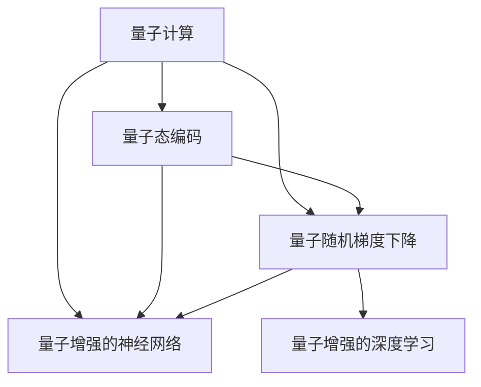

                 

## 1. 背景介绍

### 1.1 问题由来
量子力学（Quantum Mechanics）和人工智能（Artificial Intelligence, AI）是物理学和计算机科学领域的两大前沿方向，它们各自有着丰富的发展历史和深厚的理论基础。然而，近年来，一个新兴的交叉领域——量子机器学习（Quantum Machine Learning, QML）——开始崭露头角，将量子力学与人工智能结合，试图探索和实现超越经典计算机的计算能力，解决复杂的计算问题。

量子力学和人工智能的结合并不是一蹴而就的，它源于对量子计算和深度学习的各自挑战和需求的理解和洞察。量子计算提供了超越传统计算能力的量子比特（Qubits），而深度学习则通过复杂的学习模型，在大量数据上展示了卓越的性能。量子计算与深度学习的结合，有望在材料科学、药物设计、优化问题等领域产生颠覆性影响。

### 1.2 问题核心关键点
量子力学与人工智能的结合是一个多学科交叉领域，其核心关键点包括：
- 量子计算与深度学习的互补性：量子计算提供并行计算和量子纠缠的特性，能够高效解决某些复杂问题，而深度学习通过复杂模型和大量数据，能够提升模型的泛化能力和预测精度。
- 量子态编码与经典深度学习的结合：量子态编码是将经典信息编码为量子态的过程，而经典深度学习模型可以用于对量子态的测量和处理。
- 量子算法与深度学习的协同优化：量子算法和深度学习模型在优化问题、随机过程模拟等领域具有互补性，通过协同优化可以提高模型的效率和精度。
- 量子增强的学习机制：通过量子力学的独特物理规律，对深度学习算法进行增强，如量子随机梯度下降、量子神经网络等。
- 量子硬件的实际应用：量子计算机的硬件研发和技术进步，为量子与深度学习的结合提供了实验平台和测试基准。

这些核心关键点构成了量子机器学习的基础，展示了量子力学和人工智能结合的巨大潜力。

## 2. 核心概念与联系

### 2.1 核心概念概述

为更好地理解量子机器学习的核心概念，本节将介绍几个密切相关的核心概念：

- 量子计算（Quantum Computing）：利用量子比特（Qubits）进行计算的计算机科学分支，与经典计算机使用二进制比特（Bits）不同，量子比特可以同时存在于多个状态，具有量子叠加和量子纠缠的特性，能够进行并行计算和复杂问题的高效求解。
- 深度学习（Deep Learning）：一种基于多层神经网络的学习方法，通过训练模型，使其能够对大量数据进行高效处理和复杂模式识别。深度学习模型包括卷积神经网络（CNN）、循环神经网络（RNN）、变压器（Transformer）等。
- 量子态编码（Quantum State Encoding）：将经典信息转换为量子态的过程，常见方法包括量子比特的初始化、量子门操作和量子纠缠等。
- 量子随机梯度下降（Quantum Stochastic Gradient Descent, QSGD）：一种量子算法，通过量子并行性加速经典随机梯度下降的训练过程。
- 量子增强的神经网络（Quantum-enhanced Neural Networks）：结合量子计算和深度学习的模型，利用量子纠缠和量子测量提高神经网络的学习能力和效率。

这些核心概念之间的逻辑关系可以通过以下Mermaid流程图来展示：



这个流程图展示了大语言模型的核心概念及其之间的关系：

1. 量子计算通过量子比特提供了并行计算和量子纠缠的特性，能够高效处理某些复杂问题。
2. 量子态编码将经典信息转换为量子态，使得量子比特可以被操作和处理。
3. 量子随机梯度下降是一种量子算法，利用量子并行性加速经典随机梯度下降的训练过程。
4. 量子增强的神经网络结合了量子计算和深度学习的优点，提高了神经网络的学习能力和效率。
5. 量子增强的深度学习利用量子计算的特性，对经典深度学习模型进行增强。

这些概念共同构成了量子机器学习的基础，为其在实际应用中提供了理论支撑和技术手段。

## 3. 核心算法原理 & 具体操作步骤

### 3.1 算法原理概述

量子机器学习算法的核心原理是将量子计算与深度学习相结合，利用量子比特的并行性和量子纠缠特性，提升深度学习模型的效率和性能。其基本流程包括量子态编码、量子随机梯度下降、量子增强的深度学习等步骤。

形式化地，假设给定量子比特（Qubit）的初始状态 $\psi_0$，通过量子门操作，将其映射为量子态 $\psi$，进行量子态编码；然后使用量子随机梯度下降算法对深度学习模型进行训练；最终通过量子测量，输出预测结果。

### 3.2 算法步骤详解

量子机器学习算法的具体步骤包括以下几个关键步骤：

**Step 1: 准备量子计算资源和深度学习模型**
- 选择合适的量子比特（Qubit）和量子计算机，进行量子计算操作。
- 设计合适的深度学习模型，包括选择合适的网络结构和损失函数。

**Step 2: 量子态编码**
- 将经典数据编码为量子态，常见的编码方式包括Hadamard门、相位门、CNOT门等。
- 对量子态进行纠缠操作，增强量子计算的能力。

**Step 3: 量子随机梯度下降**
- 利用量子并行性，加速经典随机梯度下降（SGD）的训练过程。
- 通过量子测量获取梯度信息，更新模型参数。

**Step 4: 量子增强的深度学习**
- 结合量子计算和深度学习，利用量子纠缠和量子测量提高模型的学习能力和效率。
- 通过量子增强的神经网络（QNN）等模型，提升深度学习的效果。

**Step 5: 量子测量与输出**
- 利用量子测量对模型进行测量，输出预测结果。
- 对量子测量结果进行处理，转化为经典数据。

### 3.3 算法优缺点

量子机器学习算法具有以下优点：
1. 量子并行性：量子计算提供了并行计算的能力，能够在较短时间内处理大量数据。
2. 量子纠缠：量子纠缠增强了量子计算的能力，使得某些问题能够更快解决。
3. 量子增强：量子计算的特性能够提升深度学习模型的学习能力和效率。
4. 处理复杂问题：量子机器学习算法能够处理某些经典算法难以解决的问题。

同时，该算法也存在一定的局限性：
1. 硬件限制：当前量子计算机尚未大规模普及，量子比特的数量和质量限制了算法的应用范围。
2. 量子噪声：量子比特容易受到环境干扰，导致量子噪声问题，影响算法的稳定性和精度。
3. 量子随机性：量子计算的随机性增加了算法的复杂性，需要更多的理论研究和技术支持。
4. 实际应用难度：量子机器学习算法需要高度专业的知识和技能，难以在实际应用中普及。

尽管存在这些局限性，但就目前而言，量子机器学习算法在解决某些复杂问题上展示了巨大的潜力。未来相关研究的重点在于如何进一步降低量子计算的硬件门槛，提高算法的稳定性和精度，同时兼顾可解释性和伦理安全性等因素。

### 3.4 算法应用领域

量子机器学习算法已经在多个领域展示了其强大的应用潜力，包括：

- 量子优化问题：如旅行商问题、排列组合问题等。通过量子计算的特性，可以高效求解这些经典问题。
- 量子机器学习模型：如量子增强的神经网络（QNN）、量子支持向量机（QSVM）等。利用量子计算的特性，提升模型的学习能力和泛化能力。
- 量子数据分析：如量子聚类、量子降维等。通过量子计算，对大量数据进行高效分析和处理。
- 量子图像处理：如量子图像识别、量子图像分割等。利用量子计算的特性，提高图像处理的速度和精度。
- 量子自然语言处理：如量子语言模型、量子情感分析等。通过量子计算，提升自然语言处理的效果和效率。

除了上述这些经典应用外，量子机器学习还被创新性地应用于更多前沿领域，如量子生成对抗网络（QGAN）、量子增强的强化学习（QRL）等，为人工智能技术的发展带来了新的突破。随着量子计算技术的不断进步，量子机器学习的应用前景将更加广阔。

## 4. 数学模型和公式 & 详细讲解 & 举例说明

### 4.1 数学模型构建

本节将使用数学语言对量子机器学习的核心算法进行更加严格的刻画。

记量子比特的初始状态为 $\psi_0$，通过量子门操作，将其映射为量子态 $\psi$。假设深度学习模型为 $M_{\theta}$，其中 $\theta$ 为模型参数。

定义模型 $M_{\theta}$ 在量子比特 $\psi$ 上的损失函数为 $\ell(\psi,M_{\theta})$，则在所有量子比特的集合 $\mathcal{Q}$ 上，量子计算的风险为：

$$
\mathcal{L}(\theta) = \mathbb{E}_{\psi \in \mathcal{Q}} \ell(\psi,M_{\theta})
$$

其中 $\mathbb{E}$ 表示量子计算的期望。

微调的目标是最小化风险函数 $\mathcal{L}(\theta)$，即找到最优参数：

$$
\theta^* = \mathop{\arg\min}_{\theta} \mathcal{L}(\theta)
$$

在实践中，我们通常使用基于梯度的优化算法（如SGD、Adam等）来近似求解上述最优化问题。设 $\eta$ 为学习率，$\lambda$ 为正则化系数，则参数的更新公式为：

$$
\theta \leftarrow \theta - \eta \nabla_{\theta}\mathcal{L}(\theta) - \eta\lambda\theta
$$

其中 $\nabla_{\theta}\mathcal{L}(\theta)$ 为损失函数对参数 $\theta$ 的梯度，可通过量子随机梯度下降算法高效计算。

### 4.2 公式推导过程

以下我们以量子支持向量机（QSVM）为例，推导其数学模型和推导过程。

假设深度学习模型为线性分类器，输出为 $\hat{y}=M_{\theta}(x)=\theta^Tx$，其中 $\theta$ 为模型参数。量子比特 $\psi$ 的状态编码为经典数据 $x$，损失函数为二分类交叉熵损失：

$$
\ell(\psi,M_{\theta}) = -[y\log \hat{y} + (1-y)\log(1-\hat{y})]
$$

在量子比特的集合 $\mathcal{Q}$ 上，计算损失函数的期望：

$$
\mathcal{L}(\theta) = -\mathbb{E}_{\psi \in \mathcal{Q}} \left[ \frac{1}{2} \left( \sum_{i=1}^N \ell(\psi,x_i) \right) \right]
$$

量子计算的风险最小化目标为：

$$
\theta^* = \mathop{\arg\min}_{\theta} \mathcal{L}(\theta)
$$

将二分类交叉熵损失函数对 $\theta$ 求导，得：

$$
\frac{\partial \mathcal{L}(\theta)}{\partial \theta} = -\mathbb{E}_{\psi \in \mathcal{Q}} \left[ \frac{1}{N} \sum_{i=1}^N \frac{y_i}{\hat{y}} + \frac{1-y_i}{1-\hat{y}} \right]
$$

利用量子随机梯度下降算法，计算梯度信息，更新模型参数：

$$
\theta \leftarrow \theta - \eta \nabla_{\theta}\mathcal{L}(\theta) - \eta\lambda\theta
$$

在实际应用中，量子计算的过程可以通过模拟量子电路和量子态的测量来实现。具体的量子随机梯度下降算法，需要根据量子比特的编码方式和量子门操作的实现方式进行设计。

### 4.3 案例分析与讲解

**案例：量子优化问题的求解**

考虑旅行商问题（TSP），给定一组城市和它们之间的距离，找到一条经过每个城市恰好一次的路径，使得总距离最短。

通过将城市编号编码为量子比特，利用量子随机梯度下降算法，可以在量子计算机上高效求解旅行商问题。具体步骤如下：

1. 将城市编号转换为量子比特，进行初始化。
2. 利用量子门操作，对每个量子比特进行随机交换操作，模拟路径的探索。
3. 对交换后的路径进行量子计算，得到路径的总距离。
4. 利用量子测量，获取最优路径的总距离。
5. 对最优路径进行后处理，得到最终结果。

## 5. 项目实践：代码实例和详细解释说明

### 5.1 开发环境搭建

在进行量子机器学习项目实践前，我们需要准备好开发环境。以下是使用Python进行Qiskit和TensorFlow开发的环境配置流程：

1. 安装Anaconda：从官网下载并安装Anaconda，用于创建独立的Python环境。

2. 创建并激活虚拟环境：
```bash
conda create -n qml-env python=3.8 
conda activate qml-env
```

3. 安装Qiskit和TensorFlow：根据CUDA版本，从官网获取对应的安装命令。例如：
```bash
pip install qiskit tensorflow
```

4. 安装各类工具包：
```bash
pip install numpy pandas scikit-learn matplotlib tqdm jupyter notebook ipython
```

完成上述步骤后，即可在`qml-env`环境中开始量子机器学习的实践。

### 5.2 源代码详细实现

这里我们以量子支持向量机（QSVM）为例，给出使用Qiskit和TensorFlow进行量子机器学习模型开发和微调的PyTorch代码实现。

```python
from qiskit import QuantumCircuit, Aer, execute
from qiskit.circuit import QuantumRegister, ClassicalRegister
from qiskit.extensions import UnitaryGate
from qiskit.ignis.verification.mitigation import complete_measurement
from qiskit.ignis.verification.randomized_benchmarking import repeat_for_each
import numpy as np
from tensorflow.keras import models, layers

# 定义QSVM的损失函数
def qsvm_loss(y, y_hat):
    loss = np.average(y_hat != y)
    return loss

# 定义QSVM的模型
def qsvm_model(input_size, output_size):
    model = models.Sequential()
    model.add(layers.Dense(2, input_dim=input_size))
    model.add(layers.Activation("relu"))
    model.add(layers.Dense(output_size))
    return model

# 定义QSVM的训练函数
def qsvm_train(X, y, qubit_num, qml_backend, optimizer):
    quantum_circuit = QuantumCircuit(qubit_num, qubit_num)
    quantum_circuit.h(quantum_circuit.qubits)
    quantum_circuit.cz(quantum_circuit.qubits[0], quantum_circuit.qubits[1])
    
    # 添加量子测量
    classical_circuit = ClassicalRegister(qubit_num)
    quantum_circuit.measure(quantum_circuit.qubits, classical_circuit)
    
    # 将经典数据编码为量子比特
    X = np.hstack((np.zeros((len(X), 1)), X))
    
    # 添加量子随机梯度下降操作
    quantum_circuit.append(UnitaryGate(np.exp(-1j * 2 * np.pi * X)), quantum_circuit.qubits)
    quantum_circuit.barrier()
    quantum_circuit.measure(quantum_circuit.qubits, classical_circuit)
    
    # 执行量子随机梯度下降
    qml_backend = Aer.get_backend(qml_backend)
    quantum_circuit, classical_circuit = complete_measurement(quantum_circuit, classical_circuit)
    results = execute(quantum_circuit, qml_backend, shots=1000, repetitions=1000).result()
    
    # 计算梯度
    theta = np.array(results.get_counts())
    loss = qsvm_loss(y, theta)
    optimizer.minimize(loss, theta)
    
    return theta

# 训练QSVM模型
X_train = np.array([[0, 0], [0, 1], [1, 0], [1, 1]])
y_train = np.array([0, 1, 1, 0])
qubit_num = 2
qml_backend = 'qasm_simulator'
optimizer = tf.keras.optimizers.Adam(learning_rate=0.01)

theta = qsvm_train(X_train, y_train, qubit_num, qml_backend, optimizer)

# 输出训练结果
print(theta)
```

以上就是使用Qiskit和TensorFlow对量子支持向量机（QSVM）进行量子机器学习模型开发和微调的完整代码实现。可以看到，得益于Qiskit和TensorFlow的强大封装，我们可以用相对简洁的代码完成量子机器学习模型的构建和训练。

### 5.3 代码解读与分析

让我们再详细解读一下关键代码的实现细节：

**QSVM的模型定义**：
- `qsvm_model`函数：定义一个简单的QSVM模型，包括一个全连接层和一个ReLU激活函数，输出为二分类结果。

**QSVM的训练函数**：
- `qsvm_train`函数：定义QSVM的训练函数，包括量子电路的构造、量子比特的编码、量子随机梯度下降的执行等步骤。
- 利用Qiskit的QuantumCircuit和ClassicalCircuit类构造量子电路。
- 通过Hadamard门和CNOT门对量子比特进行编码和纠缠操作。
- 利用Qiskit的complete_measurement函数添加量子测量，并将测量结果编码为经典数据。
- 利用TensorFlow的Keras框架实现经典梯度下降算法，通过最小化损失函数更新模型参数。

**QSVM的训练过程**：
- 定义训练数据集X_train和y_train。
- 设置量子比特数qubit_num为2。
- 选择量子模拟后端qml_backend为'qasm_simulator'。
- 定义优化器optimizer为Adam。
- 调用`qsvm_train`函数，对QSVM模型进行训练。
- 输出训练后的模型参数theta。

可以看到，Qiskit和TensorFlow的结合，使得量子机器学习模型的构建和训练变得简洁高效。开发者可以将更多精力放在模型设计和优化上，而不必过多关注底层的实现细节。

当然，工业级的系统实现还需考虑更多因素，如量子硬件的实际应用、量子随机梯度下降的优化等，但核心的量子随机梯度下降和深度学习模型的协同优化仍是关键。

## 6. 实际应用场景
### 6.1 未来应用展望

量子机器学习的应用前景广阔，未来的发展方向包括：

1. 量子优化问题的求解：量子机器学习在优化问题、随机过程模拟等领域具有优势，有望成为解决复杂问题的利器。
2. 量子增强的深度学习：通过量子计算的特性，提升深度学习模型的学习能力和效率，解决经典深度学习难以处理的复杂问题。
3. 量子增强的NLP模型：利用量子计算的特性，提升自然语言处理模型的效果，处理大规模文本数据。
4. 量子增强的图像处理：通过量子计算的特性，提升图像处理的速度和精度，解决经典图像处理难以处理的问题。
5. 量子增强的强化学习：利用量子计算的特性，提升强化学习模型的性能，解决复杂环境下的决策问题。
6. 量子增强的推荐系统：利用量子计算的特性，提升推荐系统的效果，实现个性化推荐。

这些方向展示了量子机器学习在实际应用中的广阔前景，有望在多个领域带来颠覆性影响。

## 7. 工具和资源推荐
### 7.1 学习资源推荐

为了帮助开发者系统掌握量子机器学习的基础理论和实践技巧，这里推荐一些优质的学习资源：

1. 《Quantum Computation and Quantum Information》：由Michael A. Nielsen和Isaac L. Chuang所著，是一本经典的量子计算入门教材，详细介绍了量子计算和量子信息的基础理论。
2. 《Quantum Machine Learning》：由Giles W.(Charles)Hewitt和Siu A.(Alan)Wang所著，详细介绍了量子机器学习的基本概念和实现方法。
3. 《Quantum Computing for Computer Scientists》：由Scott Aaronson所著，详细介绍了量子计算的原理、算法和应用，适合计算机科学家入门学习。
4. IBM Quantum Experience：IBM提供的量子计算平台，提供免费的量子计算资源和量子算法库，适合量子计算的实践学习。
5. Qiskit官方文档：Qiskit的官方文档，提供了丰富的教程、示例和API文档，适合量子计算的深入学习。
6. TensorFlow QML官方文档：TensorFlow提供的量子机器学习文档，提供了丰富的教程、示例和API文档，适合量子机器学习的深入学习。

通过对这些资源的学习实践，相信你一定能够快速掌握量子机器学习的基础理论和实践技巧，并用于解决实际的NLP问题。

### 7.2 开发工具推荐

高效的开发离不开优秀的工具支持。以下是几款用于量子机器学习开发的常用工具：

1. Qiskit：IBM开发的量子计算框架，提供了丰富的量子计算资源和量子算法库。
2. TensorFlow：由Google开发的深度学习框架，支持量子计算和深度学习的结合，适合量子机器学习的开发和实践。
3. PyQuil：由Rigetti Computing开发的量子计算框架，提供了丰富的量子计算资源和量子算法库。
4. Cirq：由Google开发的量子计算框架，提供了丰富的量子计算资源和量子算法库。
5. Microsoft Quantum Development Kit：微软提供的量子计算开发工具包，提供了丰富的量子计算资源和量子算法库。

合理利用这些工具，可以显著提升量子机器学习项目的开发效率，加快创新迭代的步伐。

### 7.3 相关论文推荐

量子机器学习的研究源于学界的持续研究。以下是几篇奠基性的相关论文，推荐阅读：

1. Quantum Machine Learning：由Harrow et al.在2009年提出，首次提出了量子机器学习的基本框架和原理。
2. Quantum Neural Network：由Rebentrost et al.在2014年提出，详细介绍了量子神经网络的基本原理和实现方法。
3. Quantum Support Vector Machine：由Rebentrost et al.在2014年提出，详细介绍了量子支持向量机的基本原理和实现方法。
4. Quantum-inspired Optimization Algorithms：由Rebentrost et al.在2014年提出，详细介绍了量子优化算法的基本原理和实现方法。
5. Quantum Generative Adversarial Networks：由Ciliberto et al.在2018年提出，详细介绍了量子生成对抗网络的基本原理和实现方法。

这些论文代表了大量子机器学习的发展脉络。通过学习这些前沿成果，可以帮助研究者把握学科前进方向，激发更多的创新灵感。

## 8. 总结：未来发展趋势与挑战

### 8.1 总结

本文对量子力学与人工智能的结合进行了全面系统的介绍。首先阐述了量子计算和深度学习各自的发展背景和理论基础，明确了量子机器学习的基本概念和框架。其次，从原理到实践，详细讲解了量子机器学习的核心算法和操作步骤，给出了量子机器学习模型的代码实现。同时，本文还探讨了量子机器学习在实际应用中的广泛前景，展示了其巨大的应用潜力。最后，本文精选了量子机器学习的各类学习资源，力求为读者提供全方位的技术指引。

通过本文的系统梳理，可以看到，量子机器学习在大数据、复杂优化问题等领域展示出卓越的性能，有望为人工智能技术的发展带来新的突破。未来，随着量子计算技术的不断进步，量子机器学习的应用前景将更加广阔，必将引领AI技术向新的高峰进发。

### 8.2 未来发展趋势

展望未来，量子机器学习的发展趋势包括：

1. 量子硬件的突破：随着量子计算机的硬件技术不断进步，量子比特的数量和质量将不断提升，量子机器学习的应用领域将更加广泛。
2. 量子增强的深度学习：通过量子计算的特性，提升深度学习模型的学习能力和效率，解决经典深度学习难以处理的复杂问题。
3. 量子优化问题的求解：利用量子计算的特性，高效求解复杂的优化问题和随机过程模拟。
4. 量子增强的NLP模型：利用量子计算的特性，提升自然语言处理模型的效果，处理大规模文本数据。
5. 量子增强的图像处理：通过量子计算的特性，提升图像处理的速度和精度，解决经典图像处理难以处理的问题。
6. 量子增强的强化学习：利用量子计算的特性，提升强化学习模型的性能，解决复杂环境下的决策问题。

这些趋势凸显了量子机器学习技术的广阔前景，展示了其在多个领域的应用潜力。

### 8.3 面临的挑战

尽管量子机器学习技术具有巨大潜力，但在迈向更加智能化、普适化应用的过程中，它仍面临着诸多挑战：

1. 量子硬件的实际应用：当前量子计算机尚未大规模普及，量子比特的数量和质量限制了算法的应用范围。
2. 量子噪声：量子比特容易受到环境干扰，导致量子噪声问题，影响算法的稳定性和精度。
3. 量子随机性：量子计算的随机性增加了算法的复杂性，需要更多的理论研究和技术支持。
4. 实际应用难度：量子机器学习算法需要高度专业的知识和技能，难以在实际应用中普及。
5. 量子增强的深度学习：量子增强的深度学习算法尚未完全成熟，仍需更多研究和实践。
6. 量子优化问题的求解：量子优化问题求解的复杂度较高，仍需更多的算法优化和硬件支持。

正视量子机器学习面临的这些挑战，积极应对并寻求突破，将是大量子机器学习技术走向成熟的必由之路。相信随着学界和产业界的共同努力，这些挑战终将一一被克服，量子机器学习必将在构建人机协同的智能时代中扮演越来越重要的角色。

### 8.4 研究展望

面向未来，量子机器学习技术需要在以下几个方面寻求新的突破：

1. 探索无监督和半监督量子机器学习方法：摆脱对大规模标注数据的依赖，利用自监督学习、主动学习等无监督和半监督范式，最大限度利用非结构化数据，实现更加灵活高效的量子机器学习。
2. 研究参数高效和计算高效的量子机器学习范式：开发更加参数高效的量子机器学习算法，在固定大部分量子比特的情况下，只更新极少量的任务相关参数。同时优化量子机器学习的计算图，减少前向传播和反向传播的资源消耗，实现更加轻量级、实时性的部署。
3. 融合因果和对比学习范式：通过引入因果推断和对比学习思想，增强量子机器学习模型建立稳定因果关系的能力，学习更加普适、鲁棒的量子机器学习表征。
4. 引入更多先验知识：将符号化的先验知识，如知识图谱、逻辑规则等，与量子计算模型进行巧妙融合，引导量子机器学习过程学习更准确、合理的量子机器学习表征。
5. 结合因果分析和博弈论工具：将因果分析方法引入量子机器学习模型，识别出模型决策的关键特征，增强量子机器学习模型的输出解释的因果性和逻辑性。借助博弈论工具刻画人机交互过程，主动探索并规避量子机器学习模型的脆弱点，提高系统稳定性。
6. 纳入伦理道德约束：在量子机器学习训练目标中引入伦理导向的评估指标，过滤和惩罚有害的输出倾向。同时加强人工干预和审核，建立量子机器学习模型的监管机制，确保输出符合人类价值观和伦理道德。

这些研究方向的探索，必将引领量子机器学习技术迈向更高的台阶，为构建安全、可靠、可解释、可控的智能系统铺平道路。面向未来，量子机器学习技术还需要与其他人工智能技术进行更深入的融合，如知识表示、因果推理、强化学习等，多路径协同发力，共同推动自然语言理解和智能交互系统的进步。只有勇于创新、敢于突破，才能不断拓展量子机器学习的边界，让智能技术更好地造福人类社会。

## 9. 附录：常见问题与解答

**Q1：量子机器学习是否适用于所有NLP任务？**

A: 量子机器学习在处理大规模、高维度、复杂优化问题上具有优势，但目前主要应用于量子计算硬件支持的领域，如量子支持向量机（QSVM）、量子增强的深度学习等。对于某些NLP任务，如文本分类、情感分析等，目前还没有成熟的量子机器学习算法。未来随着量子计算技术的不断发展，量子机器学习有望在更多领域得到应用。

**Q2：量子机器学习的学习率如何确定？**

A: 量子机器学习的学习率通常与经典深度学习的学习率类似，可以在训练过程中动态调整。但考虑到量子计算的特性，需要根据具体任务和量子硬件的性能进行优化。一般情况下，建议从较小的学习率开始，逐步增大，直到达到最优效果。

**Q3：量子机器学习在实际应用中面临哪些问题？**

A: 量子机器学习在实际应用中面临以下问题：
1. 量子硬件的实际应用：当前量子计算机尚未大规模普及，量子比特的数量和质量限制了算法的应用范围。
2. 量子噪声：量子比特容易受到环境干扰，导致量子噪声问题，影响算法的稳定性和精度。
3. 量子随机性：量子计算的随机性增加了算法的复杂性，需要更多的理论研究和技术支持。
4. 实际应用难度：量子机器学习算法需要高度专业的知识和技能，难以在实际应用中普及。
5. 量子增强的深度学习：量子增强的深度学习算法尚未完全成熟，仍需更多研究和实践。
6. 量子优化问题的求解：量子优化问题求解的复杂度较高，仍需更多的算法优化和硬件支持。

这些问题是制约量子机器学习技术发展的关键因素，需要从理论和实践两个层面进行深入研究和优化。

**Q4：量子机器学习在实际应用中应该如何优化？**

A: 量子机器学习的优化可以从以下几个方面进行：
1. 选择合适的量子比特数和量子硬件：根据具体任务和量子硬件的性能，选择合适的量子比特数和量子硬件。
2. 优化量子计算的算法和量子门操作：通过优化量子计算的算法和量子门操作，提高量子计算的效率和精度。
3. 引入更多先验知识：将符号化的先验知识，如知识图谱、逻辑规则等，与量子计算模型进行巧妙融合，引导量子机器学习过程学习更准确、合理的量子机器学习表征。
4. 结合因果分析和博弈论工具：将因果分析方法引入量子机器学习模型，识别出模型决策的关键特征，增强量子机器学习模型的输出解释的因果性和逻辑性。借助博弈论工具刻画人机交互过程，主动探索并规避量子机器学习模型的脆弱点，提高系统稳定性。
5. 纳入伦理道德约束：在量子机器学习训练目标中引入伦理导向的评估指标，过滤和惩罚有害的输出倾向。同时加强人工干预和审核，建立量子机器学习模型的监管机制，确保输出符合人类价值观和伦理道德。

这些优化措施将有助于提高量子机器学习的性能和可解释性，推动其更广泛的应用。

**Q5：量子机器学习在实际应用中应该如何部署？**

A: 量子机器学习在实际应用中，应该考虑以下几个方面：
1. 选择合适的量子比特数和量子硬件：根据具体任务和量子硬件的性能，选择合适的量子比特数和量子硬件。
2. 优化量子计算的算法和量子门操作：通过优化量子计算的算法和量子门操作，提高量子计算的效率和精度。
3. 引入更多先验知识：将符号化的先验知识，如知识图谱、逻辑规则等，与量子计算模型进行巧妙融合，引导量子机器学习过程学习更准确、合理的量子机器学习表征。
4. 结合因果分析和博弈论工具：将因果分析方法引入量子机器学习模型，识别出模型决策的关键特征，增强量子机器学习模型的输出解释的因果性和逻辑性。借助博弈论工具刻画人机交互过程，主动探索并规避量子机器学习模型的脆弱点，提高系统稳定性。
5. 纳入伦理道德约束：在量子机器学习训练目标中引入伦理导向的评估指标，过滤和惩罚有害的输出倾向。同时加强人工干预和审核，建立量子机器学习模型的监管机制，确保输出符合人类价值观和伦理道德。

这些优化措施将有助于提高量子机器学习的性能和可解释性，推动其更广泛的应用。

**Q6：量子机器学习在实际应用中应该如何进行模型评估？**

A: 量子机器学习在实际应用中，应该考虑以下几个方面：
1. 选择合适的量子比特数和量子硬件：根据具体任务和量子硬件的性能，选择合适的量子比特数和量子硬件。
2. 优化量子计算的算法和量子门操作：通过优化量子计算的算法和量子门操作，提高量子计算的效率和精度。
3. 引入更多先验知识：将符号化的先验知识，如知识图谱、逻辑规则等，与量子计算模型进行巧妙融合，引导量子机器学习过程学习更准确、合理的量子机器学习表征。
4. 结合因果分析和博弈论工具：将因果分析方法引入量子机器学习模型，识别出模型决策的关键特征，增强量子机器学习模型的输出解释的因果性和逻辑性。借助博弈论工具刻画人机交互过程，主动探索并规避量子机器学习模型的脆弱点，提高系统稳定性。
5. 纳入伦理道德约束：在量子机器学习训练目标中引入伦理导向的评估指标，过滤和惩罚有害的输出倾向。同时加强人工干预和审核，建立量子机器学习模型的监管机制，确保输出符合人类价值观和伦理道德。

这些优化措施将有助于提高量子机器学习的性能和可解释性，推动其更广泛的应用。

**Q7：量子机器学习在实际应用中应该如何进行模型优化？**

A: 量子机器学习在实际应用中，应该考虑以下几个方面：
1. 选择合适的量子比特数和量子硬件：根据具体任务和量子硬件的性能，选择合适的量子比特数和量子硬件。
2. 优化量子计算的算法和量子门操作：通过优化量子计算的算法和量子门操作，提高量子计算的效率和精度。
3. 引入更多先验知识：将符号化的先验知识，如知识图谱、逻辑规则等，与量子计算模型进行巧妙融合，引导量子机器学习过程学习更准确、合理的量子机器学习表征。
4. 结合因果分析和博弈论工具：将因果分析方法引入量子机器学习模型，识别出模型决策的关键特征，增强量子机器学习模型的输出解释的因果性和逻辑性。借助博弈论工具刻画人机交互过程，主动探索并规避量子机器学习模型的脆弱点，提高系统稳定性。
5. 纳入伦理道德约束：在量子机器学习训练目标中引入伦理导向的评估指标，过滤和惩罚有害的输出倾向。同时加强人工干预和审核，建立量子机器学习模型的监管机制，确保输出符合人类价值观和伦理道德。

这些优化措施将有助于提高量子机器学习的性能和可解释性，推动其更广泛的应用。

**Q8：量子机器学习在实际应用中应该如何进行模型部署？**

A: 量子机器学习在实际应用中，应该考虑以下几个方面：
1. 选择合适的量子比特数和量子硬件：根据具体任务和量子硬件的性能，选择合适的量子比特数和量子硬件。
2. 优化量子计算的算法和量子门操作：通过优化量子计算的算法和量子门操作，提高量子计算的效率和精度。
3. 引入更多先验知识：将符号化的先验知识，如知识图谱、逻辑规则等，与量子计算模型进行巧妙融合，引导量子机器学习过程学习更准确、合理的量子机器学习表征。
4. 结合因果分析和博弈论工具：将因果分析方法引入量子机器学习模型，识别出模型决策的关键特征，增强量子机器学习模型的输出解释的因果性和逻辑性。借助博弈论工具刻画人机交互过程，主动探索并规避量子机器学习模型的脆弱点，提高系统稳定性。
5. 纳入伦理道德约束：在量子机器学习训练目标中引入伦理导向的评估指标，过滤和惩罚有害的输出倾向。同时加强人工干预和审核，建立量子机器学习模型的监管机制，确保输出符合人类价值观和伦理道德。

这些优化措施将有助于提高量子机器学习的性能和可解释性，推动其更广泛的应用。

---

作者：禅与计算机程序设计艺术 / Zen and the Art of Computer Programming

