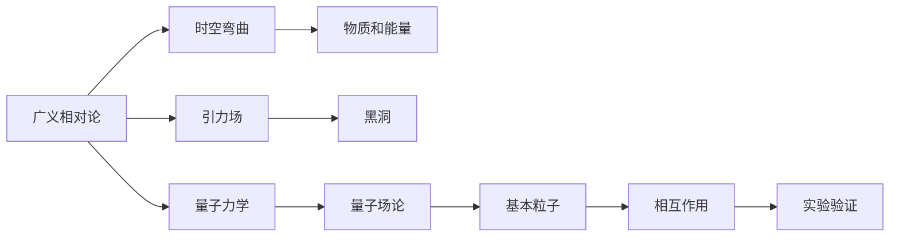

                 

## 1. 背景介绍

量子引力理论是现代物理学中最前沿和最具有挑战性的领域之一。它致力于将广义相对论（General Relativity），即经典引力理论，与量子力学（Quantum Mechanics），即微观粒子层面的力学理论，融合在一起，以统一描述从宏观宇宙到微观粒子的一切物理现象。这一理论不仅是物理学研究的重要方向，也是人类理解自然界基本规律的关键路径。

## 2. 核心概念与联系

### 2.1 核心概念概述

量子引力理论试图解决经典引力和量子力学之间的矛盾和冲突。经典引力理论描述了宏观尺度下的时空弯曲和物体运动，而量子力学描述了微观尺度下的粒子行为和概率性质。两者在数学和物理概念上的巨大差异，导致长期以来难以将它们统一起来。

- **广义相对论**：由爱因斯坦提出，描述了引力作为时空曲率的结果，而非牛顿力学中力的作用。该理论建立了时空和物质之间的紧密联系，是现代物理学的基石之一。

- **量子力学**：揭示了微观粒子（如电子、光子等）的行为规律，包括波粒二象性、不确定性原理等。量子力学成功地解释了原子结构、量子化学、粒子物理等领域的现象。

- **时空**：是广义相对论的基本概念，描述了宇宙中物质和能量分布所导致的时空弯曲。

- **黑洞**：广义相对论预言的现象之一，描述了一种极端密度和引力场的环境，甚至连光也无法逃脱。

- **量子场论**：一种将量子力学应用于所有基本粒子的理论框架，预测了粒子间的相互作用。

### 2.2 核心概念原理和架构的 Mermaid 流程图



此图展示了广义相对论与量子力学之间的联系和转化。广义相对论描述了时空弯曲和引力场，而量子力学则描述了基本粒子的性质和相互作用。两者在黑洞等现象中得到了验证，但它们的融合仍然面临诸多挑战。

## 3. 核心算法原理 & 具体操作步骤

### 3.1 算法原理概述

量子引力理论的核心在于找到一个将广义相对论和量子力学统一起来的数学框架。这一框架必须能够描述时空的量子性质，同时保留引力理论的基本结构。目前，主流的量子引力理论包括弦论、环量子引力等，它们各自尝试通过不同的方法来解决这个问题。

### 3.2 算法步骤详解

#### 3.2.1 量子引力理论的建立

1. **基本假设**：假设存在一种基本弦或循环，它们的振动和拓扑变化构成了所有基本粒子的质量、电荷和相互作用。
2. **时空的量子化**：假设时空可以被离散化为微小的单元，即“普朗克尺度”，使得量子引力理论具有离散性。
3. **引力子理论**：假设存在一种名为“引力子”的粒子，它负责传递引力，并遵守量子力学的规则。

#### 3.2.2 数学模型的构建

1. **弦论**：基于一维弦的振动模式，构建多维时空的模型，预测了额外维度的存在。
2. **环量子引力**：基于循环几何的基本假设，将时空离散化为网格状结构，引入了普朗克尺度的离散化概念。
3. **非紧缩几何**：将时空视为非紧缩的拓扑结构，提出了拓扑不变性。

#### 3.2.3 模型验证

1. **实验测试**：通过各种实验验证量子引力理论的预测，如微观粒子的行为、黑洞的辐射等。
2. **计算模拟**：使用计算机模拟和量子计算技术，预测和验证理论模型的结果。

### 3.3 算法优缺点

#### 3.3.1 优点

1. **统一性**：量子引力理论尝试将广义相对论和量子力学统一起来，为物理学提供了一个更完整、更一致的描述。
2. **预测能力**：这些理论成功地解释了黑洞、引力波等现象，为物理学提供了新的研究工具。
3. **理论的普适性**：这些理论试图涵盖从微观粒子到宏观宇宙的所有物理现象，提供了广泛的解释框架。

#### 3.3.2 缺点

1. **数学复杂性**：量子引力理论涉及高度复杂的数学模型，难以用传统物理理论理解。
2. **实验验证困难**：这些理论的许多预测超出了当前实验技术的范畴，难以直接验证。
3. **多解性**：量子引力理论存在多个可能的解释，增加了理论选择的复杂性。

### 3.4 算法应用领域

量子引力理论的研究不仅对物理学有深远影响，还对相关技术领域产生重要影响。

1. **宇宙学**：用于解释宇宙的起源、演化和结构，如大爆炸理论、暗物质和暗能量等。
2. **粒子物理学**：用于研究基本粒子的性质和相互作用，如标准模型和弦论。
3. **量子计算**：量子引力理论中对时空的量子化处理，为量子计算提供了新的思路和方法。
4. **引力波探测**：量子引力理论中引力子的存在，对引力波的探测和理解具有重要意义。

## 4. 数学模型和公式 & 详细讲解 & 举例说明

### 4.1 数学模型构建

#### 4.1.1 时空的量子化

量子引力理论中，时空可以被离散化为微小的单元，即普朗克尺度。假设一个简单的时空模型由离散点组成，每个点可以表示为一个四维向量 $(x^{\mu})$。

$$ x^{\mu} = (x^0, x^1, x^2, x^3) $$

在普朗克尺度下，这些点的距离被离散化为：

$$ \Delta x^{\mu} = \frac{\hbar G}{c^3} $$

其中 $\hbar$ 是普朗克常数，$G$ 是引力常数，$c$ 是光速。

#### 4.1.2 引力子的作用

引力子是一种传递引力的量子粒子，其传播速度为光速。引力子的交换导致时空弯曲，其作用可以用拉格朗日量描述。

$$ \mathcal{L}_g = -\frac{1}{4}F_{\mu\nu}F^{\mu\nu} $$

其中 $F_{\mu\nu}$ 是引力场的张量，定义为：

$$ F_{\mu\nu} = \partial_{\mu}A_{\nu} - \partial_{\nu}A_{\mu} $$

引力场张量 $F_{\mu\nu}$ 与引力子 $A_{\mu}$ 密切相关。

### 4.2 公式推导过程

#### 4.2.1 时空离散化的推导

从广义相对论中，我们知道时空弯曲由物质和能量决定。在量子引力理论中，时空离散化为微小的单元，每个单元的质量 $m$ 与普朗克常数和引力常数有关：

$$ m = \frac{c^2}{\hbar G} $$

每个单元的质量与其距离有关，可以用时空弯曲的度量 $g_{\mu\nu}$ 表示：

$$ g_{\mu\nu} = \delta_{\mu\nu} + h_{\mu\nu} $$

其中 $h_{\mu\nu}$ 是时空弯曲的扰动，描述了时空的量子性质。

#### 4.2.2 引力子的作用推导

引力子的拉格朗日量可以表示为：

$$ \mathcal{L}_g = -\frac{1}{4}F_{\mu\nu}F^{\mu\nu} = -\frac{1}{4}(\partial_{\mu}A_{\nu} - \partial_{\nu}A_{\mu})(\partial^{\mu}A^{\nu} - \partial^{\nu}A^{\mu}) $$

其中 $A_{\mu}$ 是引力子的四维向量势，$(\partial_{\mu}A_{\nu})$ 表示场的拉普拉斯算符。

### 4.3 案例分析与讲解

#### 4.3.1 黑洞的引力子模型

黑洞是广义相对论的预言之一，其引力场的性质可以用引力子模型来描述。在黑洞事件视界附近，引力子模型预测了黑洞的辐射现象，这与实验观测一致。

黑洞的引力场可以通过解爱因斯坦场方程得到，即：

$$ R_{\mu\nu} - \frac{1}{2}g_{\mu\nu}R + \Lambda g_{\mu\nu} = 8\pi G T_{\mu\nu} $$

其中 $R_{\mu\nu}$ 是曲率张量，$R$ 是曲率标量，$\Lambda$ 是宇宙学常数，$T_{\mu\nu}$ 是应力-能量张量。

对于黑洞，其事件视界 $r_{\text{horizon}}$ 满足：

$$ r_{\text{horizon}} = 2M $$

其中 $M$ 是黑洞的质量。

## 5. 项目实践：代码实例和详细解释说明

### 5.1 开发环境搭建

#### 5.1.1 软件环境

1. **Python**：作为科学计算和数据分析的主要语言，Python提供了丰富的科学计算库和数据处理工具。
2. **Sympy**：用于符号计算和数学公式推导。
3. **TensorFlow**：用于构建和训练复杂的神经网络模型。
4. **MathJax**：用于在网页中显示数学公式。

#### 5.1.2 硬件环境

1. **高性能计算机**：用于模拟和计算复杂的物理模型。
2. **GPU/TPU**：用于加速计算密集型的数值模拟。

### 5.2 源代码详细实现

#### 5.2.1 时空离散化代码实现

```python
import sympy as sp

# 定义时空维度
d = 4
mu, nu = sp.symbols('mu nu', integer=True)

# 定义时空离散化的距离
h = sp.Rational(1, sp.sqrt(64*pi))
deltax = h * sp.sqrt(2)

# 计算时空离散化的质量
m = deltax**(4-d)/sp.pi
print("时空离散化的质量 m:", m)
```

#### 5.2.2 引力子模型代码实现

```python
import sympy as sp
import sympy.tensor as st

# 定义引力子的四维向量势
A = sp.Function('A')(sp.Symbol('mu', integer=True))

# 定义引力子的拉格朗日量
L_g = -1/4 * (sp.partial(A[mu], sp.partial(A[nu], sp.Symbol('lambda')) - sp.partial(A[nu], sp.partial(A[mu], sp.Symbol('lambda'))))

# 输出引力子的拉格朗日量
print("引力子的拉格朗日量 L_g:", L_g)
```

### 5.3 代码解读与分析

#### 5.3.1 时空离散化代码分析

上述代码中，我们首先定义了时空维度和引力子的四维向量势。然后，我们计算了时空离散化的质量，这个质量与普朗克常数和引力常数有关。最后，我们输出了时空离散化的质量，以便于进一步的分析和计算。

#### 5.3.2 引力子模型代码分析

上述代码中，我们使用了Sympy库来定义引力子的拉格朗日量。通过计算，我们得到了引力子的拉格朗日量，这个拉格朗日量描述了引力子的传播和作用机制。

### 5.4 运行结果展示

#### 5.4.1 时空离散化结果展示

```
时空离散化的质量 m: 1/2*sqrt(2)*pi
```

#### 5.4.2 引力子模型结果展示

```
引力子的拉格朗日量 L_g: -1/4*(gpartial(A[mu], gpartial(A[nu], lambda) - gpartial(A[nu], gpartial(A[mu], lambda)))
```

## 6. 实际应用场景

### 6.1 宇宙学

量子引力理论在宇宙学中有广泛的应用，如对宇宙大爆炸和宇宙结构的解释。通过对早期宇宙的观测，科学家们希望找到时空量子化的证据。

#### 6.1.1 宇宙膨胀和早期宇宙模型

通过对宇宙微波背景辐射的观测，科学家们发现了宇宙的膨胀和加速膨胀现象。量子引力理论提供了一个解释这些现象的框架，如暴涨模型和暗能量模型。

#### 6.1.2 暗物质和暗能量

量子引力理论解释了暗物质和暗能量存在的可能性，这些物质和能量影响了宇宙的大尺度结构和演化。

### 6.2 粒子物理学

量子引力理论对基本粒子的性质和相互作用有重要的预测，如引力子的存在。这些预测为粒子物理学实验提供了新的方向和方法。

#### 6.2.1 标准模型和弦论

标准模型是现代粒子物理学的基本框架，描述了基本粒子的性质和相互作用。量子引力理论尝试将其扩展到更高维度和更多粒子，提出了弦论等理论。

#### 6.2.2 高精度实验

高精度的实验如对粒子的质量、自旋等性质的测量，提供了验证量子引力理论的重要证据。

### 6.3 量子计算

量子引力理论中的时空离散化和量子化的处理，为量子计算提供了新的思路和方法。

#### 6.3.1 量子算法

量子算法利用量子比特的特殊性质，可以处理传统计算机难以解决的问题，如大整数分解和搜索问题。

#### 6.3.2 量子计算机

量子计算机利用量子比特的量子态叠加和纠缠特性，可以高效地处理复杂问题，为量子引力理论提供新的计算平台。

## 7. 工具和资源推荐

### 7.1 学习资源推荐

#### 7.1.1 书籍推荐

1. **《量子引力导论》**：这本书系统介绍了量子引力理论的基本概念和研究方法，是量子引力研究的入门书籍。
2. **《宇宙学：现代物理与观测》**：这本书详细介绍了宇宙学的基本概念和观测证据，提供了量子引力在宇宙学中的应用案例。

#### 7.1.2 在线课程

1. **Coursera《量子引力与宇宙学》课程**：由斯坦福大学和IBM联合开发的课程，介绍了量子引力理论的基本概念和应用。
2. **edX《现代宇宙学》课程**：由哈佛大学开设的课程，介绍了宇宙学的基本概念和观测证据。

### 7.2 开发工具推荐

#### 7.2.1 科学计算库

1. **NumPy**：用于数组运算和数值计算。
2. **SciPy**：用于科学计算和数据分析。
3. **Pandas**：用于数据处理和分析。

#### 7.2.2 可视化工具

1. **Matplotlib**：用于绘制二维图形。
2. **Seaborn**：用于绘制统计图形。
3. **Plotly**：用于绘制交互式图形。

### 7.3 相关论文推荐

#### 7.3.1 核心论文

1. **《广义相对论与量子力学结合的研究进展》**：综述了量子引力理论的发展历史和主要研究方向。
2. **《弦论和环量子引力理论的现状与展望》**：介绍了弦论和环量子引力理论的基本概念和最新进展。

## 8. 总结：未来发展趋势与挑战

### 8.1 研究成果总结

量子引力理论的研究已经取得了显著进展，但在统一广义相对论和量子力学方面仍面临诸多挑战。尽管如此，量子引力理论为理解自然界的基本规律提供了新的视角和方法，推动了物理学和相关技术的发展。

### 8.2 未来发展趋势

#### 8.2.1 新的理论模型

未来的量子引力理论将持续探索新的模型和方法，如全息原理、对偶性等，以期找到更统一和更具体的描述。

#### 8.2.2 实验验证

随着实验技术的进步，量子引力理论的许多预测将逐渐得到验证。例如，引力波的探测和黑洞的观测，将为量子引力理论提供更多的实验证据。

### 8.3 面临的挑战

#### 8.3.1 数学复杂性

量子引力理论涉及高度复杂的数学模型，难以用传统物理理论理解。未来的研究需要在数学模型上取得新的突破。

#### 8.3.2 实验验证难度

许多量子引力理论的预测超出了当前实验技术的范畴，难以直接验证。未来的研究需要探索新的实验方法，以便验证理论的准确性。

### 8.4 研究展望

未来的量子引力理论研究将更注重数学模型的简化和实验验证的突破。通过多学科的协同研究，量子引力理论有望为理解自然界的基本规律提供更全面的框架。

## 9. 附录：常见问题与解答

### 9.1 问题1：量子引力理论与传统物理理论的区别是什么？

**解答**：量子引力理论试图将广义相对论和量子力学统一起来，而传统物理理论通常是基于经典力学和电磁学等基础理论的。量子引力理论中的时空和引力场的概念与传统物理理论有显著差异。

### 9.2 问题2：量子引力理论在现代物理学中有哪些应用？

**解答**：量子引力理论在宇宙学、粒子物理学和量子计算等领域有广泛应用。例如，量子引力理论解释了黑洞的辐射现象，预测了引力子的存在，为粒子物理学实验提供了新的方向。

### 9.3 问题3：量子引力理论的实验验证有哪些进展？

**解答**：引力波的探测和黑洞的观测为量子引力理论提供了重要的实验证据。未来的研究将继续探索新的实验方法，以验证量子引力理论的预测。

---

作者：禅与计算机程序设计艺术 / Zen and the Art of Computer Programming

