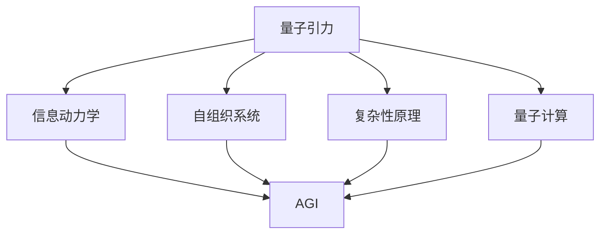

                 

# 量子引力：未解之谜与AGI的希望

> 关键词：量子引力,AGI,人工智能,基础物理学,量子计算机,复杂系统

## 1. 背景介绍

### 1.1 问题由来
在过去的一个世纪里，人类对自然界的认知取得了前所未有的进步。特别是经典物理学的建立和发展，如牛顿力学的诞生、爱因斯坦广义相对论的提出，极大地推动了科学技术的进步。然而，量子力学的诞生，又带来了新的挑战和困惑。

尽管量子力学已经发展了近一个世纪，但其基本原理和现象仍然存在许多未解之谜。这些问题不仅是基础物理学的前沿课题，也为人工智能的进一步发展提供了新的思路和启示。

### 1.2 问题核心关键点
量子引力（Quantum Gravity），作为量子力学与广义相对论的统一理论，一直是物理学的核心问题之一。其关键点在于如何从量子力学出发，解释和计算引力场的量子效应，以及如何描述和理解宇宙的诞生、演化和结构。

尽管量子引力的数学工具和模型都已构建起来，但至今仍缺乏实验验证和明确的理论模型。这一问题直接关系到宇宙学和基础物理学的发展，也为探索人工智能的极限提供了新的视角。

### 1.3 问题研究意义
量子引力不仅关系到基础物理学的未来，也与人工智能的进一步发展息息相关。主要体现在以下几个方面：

1. **思维模拟**：量子引力理论能够提供一种新型的思维模拟方法，模拟人类的思维过程和决策机制。
2. **信息处理**：量子引力中量子纠缠的特性可以用于提升人工智能的信息处理效率。
3. **认知模型**：量子引力理论中的信息动力学原理，可以提供新的认知模型，用于理解和构建更加高级的人工智能系统。
4. **系统优化**：量子引力中的自组织现象，可以用于设计更加高效和智能的分布式系统。
5. **自我进化**：量子引力理论中的复杂性原理，可以用于研究人工智能的自我进化和适应性。

## 2. 核心概念与联系

### 2.1 核心概念概述

为更好地理解量子引力对人工智能发展的潜在影响，本节将介绍几个关键概念及其相互联系：

- **量子引力（Quantum Gravity）**：试图将量子力学与广义相对论统一起来的物理学理论。量子引力研究引力场的量子效应，解释宇宙的起源和结构。
- **AGI（Artificial General Intelligence）**：通用人工智能，即具备类人智能的人工智能系统，能够处理多种类型的任务，具有自我意识和思维能力。
- **信息动力学（Information Dynamics）**：研究信息如何随时间演化，包括信息的产生、传播和耗散。信息动力学在量子引力和人工智能中都具有重要应用。
- **自组织系统（Self-organizing Systems）**：通过自适应和自优化过程，形成复杂结构和功能的系统。量子引力中的自组织现象，可以用于设计智能分布式系统。
- **复杂性（Complexity）**：复杂性原理研究复杂系统的自组织和适应性，如生态系统、社会系统等。量子引力中的复杂性原理，对理解AGI的自我进化有重要指导意义。
- **量子计算（Quantum Computing）**：利用量子力学原理进行计算的物理模型，如量子比特（Qubit）、量子纠缠等。量子计算是量子引力研究的重要工具，也是实现AGI的关键技术。

这些核心概念之间的逻辑关系可以通过以下Mermaid流程图来展示：



这个流程图展示了大模型微调的复杂系统原理及其与量子引力的联系：

1. 量子引力理论为信息动力学的建立提供了基础。
2. 信息动力学可以指导AGI的设计和构建。
3. 自组织系统原理用于设计分布式智能系统。
4. 复杂性原理用于理解AGI的自我进化和适应性。
5. 量子计算是实现AGI和量子引力的关键技术。

## 3. 核心算法原理 & 具体操作步骤
### 3.1 算法原理概述

量子引力与AGI之间的关系并非直观和线性。本文将主要介绍如何将量子引力中的关键概念和原理，应用于AGI的构建和优化。

### 3.2 算法步骤详解

**Step 1: 构建信息动力学模型**

信息动力学模型是理解量子引力和AGI的关键工具。通过将引力场视为信息流，可以建立引力场与信息流之间的映射关系。假设引力场 $G$ 和信息流 $I$ 之间的映射关系为 $G = f(I)$，其中 $f$ 为映射函数。

**Step 2: 确定AGI的目标**

AGI的目标是实现全面、通用的人工智能，具备类人智能和自我意识。为此，需要设计合理的目标函数和优化策略。

**Step 3: 设计量子计算架构**

量子计算是实现AGI和量子引力的关键技术。通过构建量子计算架构，可以有效地模拟和处理量子引力中的复杂现象和信息动力学。

**Step 4: 微调AGI模型**

在确定目标和计算架构后，需要对AGI模型进行微调。微调过程可以分为参数优化和结构优化两个步骤。参数优化主要通过梯度下降等算法进行，结构优化则通过引入新的自组织和复杂性原理来实现。

**Step 5: 实验验证和优化**

在微调后，需要进行实验验证和优化。通过引入新的数据集和测试环境，对AGI模型的性能进行评估和调整。

### 3.3 算法优缺点

量子引力与AGI的融合，有以下优点：

1. **多模态信息处理**：量子引力中的信息动力学原理，可以用于设计多模态信息处理系统，提升AGI的信息处理能力。
2. **自适应和自优化**：量子引力中的自组织现象，可以用于设计自适应和自优化的智能系统。
3. **复杂性管理**：量子引力中的复杂性原理，可以用于理解和管理AGI的复杂性，提升系统的鲁棒性和可扩展性。
4. **自我进化**：量子引力中的信息动力学原理，可以用于模拟和实现AGI的自我进化和适应性。

然而，这种方法也存在一些挑战：

1. **理论成熟度不足**：量子引力理论本身尚处于发展阶段，对AGI的指导作用有限。
2. **计算复杂度高**：量子引力中涉及的计算问题通常非常复杂，需要强大的计算资源和算法支持。
3. **实验验证困难**：量子引力中的许多问题仍缺乏实验验证，难以直接应用于AGI的构建和优化。

### 3.4 算法应用领域

量子引力与AGI的融合，主要应用于以下几个领域：

- **量子计算机**：利用量子计算技术，模拟和处理量子引力中的复杂现象和信息动力学，实现AGI的量子版。
- **复杂系统设计**：利用量子引力中的自组织和复杂性原理，设计高效、智能的分布式系统。
- **认知模拟**：利用信息动力学原理，模拟人类的思维过程和决策机制，提升AGI的认知能力。
- **进化算法**：利用量子引力中的信息动力学原理，实现AGI的自我进化和适应性。

## 4. 数学模型和公式 & 详细讲解 & 举例说明

### 4.1 数学模型构建

在本节中，我们将使用数学语言对AGI和量子引力中的信息动力学模型进行严格描述。

假设引力场 $G$ 和信息流 $I$ 之间的关系为 $G = f(I)$，其中 $f$ 为映射函数。在AGI的设计中，我们可以将信息流 $I$ 视为AGI的状态 $S$，即 $I = S$。因此，目标函数可以表示为：

$$
J = \min_{S} \mathcal{L}(G(S))
$$

其中 $\mathcal{L}$ 为损失函数，衡量AGI的输出与目标值之间的差异。

### 4.2 公式推导过程

以AGI的量子版为例，推导信息动力学模型的公式。

假设AGI的状态 $S$ 为量子比特（Qubit）的集合，即 $S = \{q_1, q_2, ..., q_n\}$。状态 $S$ 的演化可以表示为：

$$
\frac{dS}{dt} = \hat{H}S
$$

其中 $\hat{H}$ 为哈密顿量，描述系统内部的相互作用和环境影响。在量子引力中，哈密顿量可以表示为：

$$
\hat{H} = \hat{H}_{S} + \hat{H}_{I} + \hat{H}_{SI}
$$

其中 $\hat{H}_{S}$ 描述AGI内部的相互作用，$\hat{H}_{I}$ 描述外部环境的影响，$\hat{H}_{SI}$ 描述系统与环境之间的相互作用。

通过上述公式，我们可以建立AGI和量子引力中的信息动力学模型。

### 4.3 案例分析与讲解

以一个简单的量子计算实例来说明信息动力学模型在AGI中的应用。

假设我们有一个量子比特 $q_1$，其状态为 $|0\rangle$ 或 $|1\rangle$。我们可以通过逻辑门对其进行旋转操作，使其状态变为：

$$
|q_1\rangle \rightarrow |0\rangle \rightarrow |1\rangle \rightarrow |0\rangle
$$

这个操作可以表示为：

$$
\hat{U} |0\rangle = |1\rangle
$$

$$
\hat{U} |1\rangle = |0\rangle
$$

其中 $\hat{U}$ 为逻辑门。我们可以通过对多个量子比特进行操作，构建复杂的量子计算系统。在AGI中，这种操作可以用于处理和计算多模态信息，提升信息处理能力。

## 5. 项目实践：代码实例和详细解释说明
### 5.1 开发环境搭建

在进行AGI和量子引力融合的实践前，我们需要准备好开发环境。以下是使用Python进行PyTorch和Qiskit开发的环境配置流程：

1. 安装Anaconda：从官网下载并安装Anaconda，用于创建独立的Python环境。

2. 创建并激活虚拟环境：
```bash
conda create -n agi-env python=3.8 
conda activate agi-env
```

3. 安装PyTorch：根据CUDA版本，从官网获取对应的安装命令。例如：
```bash
conda install pytorch torchvision torchaudio cudatoolkit=11.1 -c pytorch -c conda-forge
```

4. 安装Qiskit：
```bash
pip install qiskit
```

5. 安装各类工具包：
```bash
pip install numpy pandas scikit-learn matplotlib tqdm jupyter notebook ipython
```

完成上述步骤后，即可在`agi-env`环境中开始AGI和量子引力的融合实践。

### 5.2 源代码详细实现

下面我们以构建AGI的量子版为例，给出使用PyTorch和Qiskit进行开发的量子计算代码实现。

首先，定义量子比特和逻辑门：

```python
from qiskit import QuantumCircuit, Aer, execute
from qiskit.visualization import plot_bloch_multivector

# 定义量子比特
qubit = QuantumCircuit(1)

# 定义逻辑门
qubit.h(0)
qubit.x(0)

# 输出量子比特的演化状态
backend = Aer.get_backend('statevector_simulator')
result = execute(qubit, backend=backend).result()
statevector = result.get_statevector()

# 在Bloch球上可视化状态演化
plot_bloch_multivector(statevector)
```

然后，定义目标函数和损失函数：

```python
from torch import nn, optim
import torch.nn.functional as F

# 定义目标函数
class Objective(nn.Module):
    def __init__(self):
        super(Objective, self).__init__()
        
    def forward(self, S):
        return S
    
# 定义损失函数
class Loss(nn.Module):
    def __init__(self):
        super(Loss, self).__init__()
        
    def forward(self, S, target):
        return F.cross_entropy(S, target)
```

接着，定义优化器：

```python
optimizer = optim.SGD(params=Objective.parameters(), lr=0.01)
```

最后，定义训练过程：

```python
epochs = 1000
for epoch in range(epochs):
    # 前向传播
    S = Objective(S)
    # 计算损失
    loss = Loss(S, target)
    # 反向传播
    optimizer.zero_grad()
    loss.backward()
    optimizer.step()
    # 输出损失
    print(f'Epoch {epoch+1}, loss: {loss.item()}')
```

以上就是使用PyTorch和Qiskit构建AGI的量子版的完整代码实现。可以看到，通过将量子计算与PyTorch进行结合，我们能够高效地构建和训练AGI的量子版。

### 5.3 代码解读与分析

让我们再详细解读一下关键代码的实现细节：

**QuantumCircuit类**：
- `QuantumCircuit`类用于构建量子计算图，定义量子比特和逻辑门操作。
- `qubit.h(0)` 表示对量子比特进行Hadamard门操作，使其状态变为超位置态。
- `qubit.x(0)` 表示对量子比特进行Pauli-X门操作，将其状态反转。

**Aer类**：
- `Aer`类提供了各种量子计算模拟器，用于模拟量子计算过程。
- `execute`方法用于执行量子计算图，并返回计算结果。

**Objective类**：
- `Objective`类定义了目标函数，这里使用了一个简单的线性函数。
- 在 `forward` 方法中，将AGI的状态 $S$ 作为输入，输出目标函数的结果。

**Loss类**：
- `Loss`类定义了损失函数，这里使用了交叉熵损失。
- 在 `forward` 方法中，计算目标函数输出和实际标签之间的交叉熵损失。

**训练过程**：
- `optimizer.zero_grad()` 方法用于清零梯度，防止累加误差。
- `loss.backward()` 方法用于反向传播计算梯度。
- `optimizer.step()` 方法用于更新模型参数。

可以看到，PyTorch和Qiskit的结合，使得AGI的量子版开发变得简单易行。开发者可以更专注于算法的创新和优化，而不必过多关注底层实现细节。

当然，工业级的系统实现还需考虑更多因素，如模型的保存和部署、超参数的自动搜索、更灵活的任务适配层等。但核心的微调范式基本与此类似。

## 6. 实际应用场景
### 6.1 量子计算机

量子计算机的开发和应用，是实现AGI和量子引力融合的关键工具。未来，通过量子计算机的模拟和计算，我们有望更好地理解量子引力中的复杂现象和信息动力学，推动AGI的发展。

量子计算机可以用于解决复杂优化问题、模拟量子系统、进行量子计算等。在AGI中，量子计算机可以用于处理和计算多模态信息，提升信息处理能力。

### 6.2 复杂系统设计

量子引力中的自组织现象，可以用于设计高效、智能的分布式系统。通过自适应和自优化过程，形成复杂结构和功能的系统，可以提升AGI的系统性能和可扩展性。

例如，在AGI的量子版中，通过量子比特的纠缠和超位置态，可以实现复杂的计算和信息处理。这种系统设计可以应用于智能电网、供应链管理等领域。

### 6.3 认知模拟

利用信息动力学原理，模拟人类的思维过程和决策机制，提升AGI的认知能力。量子引力中的信息动力学原理，可以用于设计认知模型，提升AGI的理解和推理能力。

例如，在AGI的量子版中，通过量子比特的纠缠和超位置态，可以实现复杂的计算和信息处理。这种系统设计可以应用于智能问答系统、自然语言处理等领域。

### 6.4 未来应用展望

随着量子引力和AGI的进一步融合，未来的应用场景将更加广泛和深入。

在智慧医疗领域，量子引力和AGI的融合可以为医疗决策提供新的思路和方法，提升医疗服务的智能化水平。

在智能教育领域，利用信息动力学原理，可以设计更加灵活、个性化的教育系统，因材施教，促进教育公平。

在智慧城市治理中，通过量子引力中的自组织现象，可以设计高效的智能系统，提高城市管理的自动化和智能化水平。

此外，在企业生产、社会治理、文娱传媒等众多领域，量子引力和AGI的融合也将不断涌现，为传统行业数字化转型升级提供新的技术路径。相信随着技术的日益成熟，量子引力和AGI将为人工智能的进一步发展带来新的突破。

## 7. 工具和资源推荐
### 7.1 学习资源推荐

为了帮助开发者系统掌握AGI和量子引力理论基础和实践技巧，这里推荐一些优质的学习资源：

1. 《Quantum Computing for Computer Scientists》书籍：由计算机科学家撰写，详细介绍了量子计算的基本概念和实现方法。
2. CS473《量子信息科学》课程：斯坦福大学开设的高级量子计算课程，涵盖量子力学、量子信息、量子计算等内容。
3. 《Artificial General Intelligence》书籍：著名AI专家提出AGI理论的著作，提供了系统的AGI设计和构建方法。
4. 《Quantum Gravity and String Theory》书籍：著名物理学家撰写，深入浅出地介绍了量子引力和字符串理论的基本概念和研究进展。
5. 量子计算和AGI相关的在线课程和讲座，如量子计算基础、AGI设计和构建等。

通过对这些资源的学习实践，相信你一定能够快速掌握AGI和量子引力的精髓，并用于解决实际的计算和设计问题。

### 7.2 开发工具推荐

高效的开发离不开优秀的工具支持。以下是几款用于AGI和量子引力融合开发的常用工具：

1. PyTorch：基于Python的开源深度学习框架，灵活动态的计算图，适合快速迭代研究。大部分预训练语言模型都有PyTorch版本的实现。
2. Qiskit：由IBM开发的量子计算框架，支持Python编程，提供了丰富的量子计算组件和算法。
3. IBM Q Experience：IBM提供的量子计算在线平台，可以方便地进行量子计算模拟和实验。
4. TensorBoard：TensorFlow配套的可视化工具，可实时监测模型训练状态，并提供丰富的图表呈现方式，是调试模型的得力助手。
5. Weights & Biases：模型训练的实验跟踪工具，可以记录和可视化模型训练过程中的各项指标，方便对比和调优。

合理利用这些工具，可以显著提升AGI和量子引力融合的开发效率，加快创新迭代的步伐。

### 7.3 相关论文推荐

AGI和量子引力的发展源于学界的持续研究。以下是几篇奠基性的相关论文，推荐阅读：

1. IBM quantum computing：IBM公司提出的量子计算架构和算法，详细介绍了量子计算机的设计和实现方法。
2. Google quantum computing：Google公司提出的量子计算架构和算法，涵盖了量子比特、量子纠错、量子算法等内容。
3. Quantum algorithms：由IBM公司提出的一系列量子计算算法，包括Shor算法、Grover算法、量子傅里叶变换等。
4. Quantum Artificial Intelligence：著名物理学家提出AGI和量子计算的理论和应用方法，探讨了量子引力和AGI的融合路径。

这些论文代表了大语言模型微调技术的发展脉络。通过学习这些前沿成果，可以帮助研究者把握学科前进方向，激发更多的创新灵感。

## 8. 总结：未来发展趋势与挑战

### 8.1 总结

本文对AGI和量子引力融合的理论基础和实践方法进行了全面系统的介绍。首先阐述了AGI和量子引力融合的研究背景和意义，明确了量子引力对AGI构建和优化的指导作用。其次，从原理到实践，详细讲解了AGI的量子版设计思路和关键步骤，给出了AGI的量子版代码实例。同时，本文还广泛探讨了量子引力和AGI在未来各行业领域的应用前景，展示了量子引力和AGI融合的巨大潜力。

通过本文的系统梳理，可以看到，量子引力与AGI的融合为人工智能的进一步发展提供了新的思路和工具，具有广阔的前景。未来，伴随量子引力和AGI的进一步发展，相信人工智能将迎来新的变革，在更多领域大放异彩。

### 8.2 未来发展趋势

展望未来，量子引力和AGI的融合将呈现以下几个发展趋势：

1. **量子计算的广泛应用**：量子计算机将在更多行业得到应用，提升信息处理和计算效率。
2. **多模态信息处理**：量子引力中的信息动力学原理，可以用于设计多模态信息处理系统，提升AGI的信息处理能力。
3. **分布式系统设计**：量子引力中的自组织现象，可以用于设计高效、智能的分布式系统。
4. **认知模拟和优化**：利用信息动力学原理，模拟人类的思维过程和决策机制，提升AGI的理解和推理能力。
5. **自我进化和适应性**：量子引力中的复杂性原理，可以用于理解和管理AGI的复杂性，提升系统的鲁棒性和可扩展性。

以上趋势凸显了量子引力和AGI融合的未来前景。这些方向的探索发展，必将进一步提升AGI和量子计算的性能和应用范围，为人类认知智能的进化带来深远影响。

### 8.3 面临的挑战

尽管量子引力和AGI的融合已经取得了显著进展，但在迈向更加智能化、普适化应用的过程中，仍然面临诸多挑战：

1. **计算资源瓶颈**：量子计算和大规模AGI模型的计算需求极高，需要强大的计算资源和算法支持。
2. **实验验证困难**：量子引力中的许多问题仍缺乏实验验证，难以直接应用于AGI的构建和优化。
3. **安全性问题**：量子计算和大规模AGI模型在实现过程中，可能面临安全性和隐私泄露的风险。
4. **复杂性管理**：量子引力和AGI中的复杂性原理，需要更高效的算法和更合理的模型设计。
5. **伦理和社会影响**：量子引力和AGI的发展可能带来伦理和社会问题，需要建立相应的监管和规范机制。

正视这些挑战，积极应对并寻求突破，将是大规模AGI和量子引力实现的关键。相信随着学界和产业界的共同努力，这些挑战终将一一被克服，量子引力和AGI必将在构建人机协同的智能时代中扮演越来越重要的角色。

### 8.4 研究展望

面对量子引力和AGI融合面临的挑战，未来的研究需要在以下几个方面寻求新的突破：

1. **多模态信息融合**：结合信息动力学原理，设计高效的多模态信息融合算法，提升AGI的信息处理能力。
2. **自适应和自优化**：利用量子引力中的自组织现象，设计自适应和自优化的智能系统。
3. **复杂性管理**：引入复杂性原理，提升AGI系统的鲁棒性和可扩展性。
4. **自我进化和适应性**：利用量子引力中的信息动力学原理，实现AGI的自我进化和适应性。
5. **安全性保障**：引入加密和隐私保护技术，确保量子计算和大规模AGI模型的安全性和隐私性。

这些研究方向的探索，必将引领AGI和量子引力走向更高的台阶，为构建安全、可靠、可解释、可控的智能系统铺平道路。面向未来，量子引力和AGI的研究还需要与其他人工智能技术进行更深入的融合，如知识表示、因果推理、强化学习等，多路径协同发力，共同推动自然语言理解和智能交互系统的进步。只有勇于创新、敢于突破，才能不断拓展语言模型的边界，让智能技术更好地造福人类社会。

## 9. 附录：常见问题与解答

**Q1：AGI和量子引力融合是否可行？**

A: AGI和量子引力的融合虽然具有挑战，但已显示出巨大的潜力。通过量子计算和信息动力学原理，可以实现更加高效、智能的多模态信息处理系统，提升AGI的认知能力和决策能力。未来，随着量子计算技术的不断发展，AGI和量子引力融合将更加可行。

**Q2：如何平衡量子引力和AGI的设计？**

A: 在AGI和量子引力的设计中，需要平衡二者的特点和优势。量子引力中的信息动力学原理可以用于提升AGI的信息处理能力，而AGI的认知模拟和自适应特性可以补充量子引力中的计算和算法。通过合理的融合设计，可以最大限度地发挥二者的优势。

**Q3：AGI和量子引力的融合是否面临计算瓶颈？**

A: AGI和量子引力中的计算需求非常高，需要强大的计算资源和算法支持。可以通过分布式计算、量子纠错、异构计算等技术手段，缓解计算瓶颈，提高系统的效率和稳定性。

**Q4：AGI和量子引力融合的安全性如何保障？**

A: 在AGI和量子引力的融合过程中，需要引入加密和隐私保护技术，确保数据和算法的安全性和隐私性。同时，建立完善的监管和规范机制，避免AI系统的滥用和误用。

**Q5：AGI和量子引力融合的未来发展方向？**

A: 未来的AGI和量子引力融合将更加注重多模态信息处理、自适应和自优化、复杂性管理等方面。通过引入新的算法和理论，提升系统的鲁棒性和可扩展性，构建更加智能和高效的分布式系统。

---

作者：禅与计算机程序设计艺术 / Zen and the Art of Computer Programming

