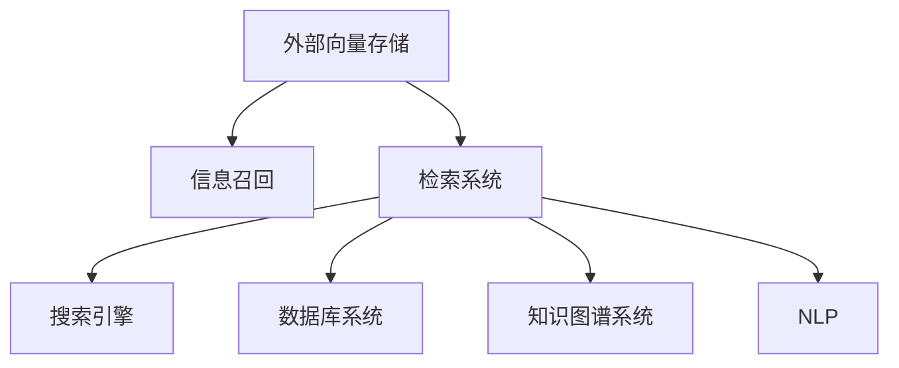

                 

# 长期记忆：外部向量存储与信息召回

> 关键词：长期记忆,外部向量存储,信息召回,检索系统,自然语言处理(NLP)

## 1. 背景介绍

在信息爆炸的互联网时代，海量的数据既是金矿，也是负担。如何在保持数据高效检索的同时，尽可能地保存长期记忆，是所有检索系统面临的核心挑战。传统的索引、倒排表等方法虽然在特定场景下表现优异，但难以支持大规模语料和动态更新需求。本文聚焦于基于外部向量存储的长期记忆模型，通过深入分析外部存储、向量召回等关键技术，提出一种新颖的长期记忆模型，用于信息检索和召回。

## 2. 核心概念与联系

### 2.1 核心概念概述

为更好地理解外部向量存储和信息召回的原理，本节将介绍几个关键概念：

- **外部向量存储(External Vector Storage)**：将大规模语料映射为高维稠密向量，并存储到外部存储设备(如SSD、HDD)，以应对大规模语料和高效检索需求。
- **信息召回(Information Retrieval, IR)**：给定查询，从大规模语料中检索出最相关的文档。IR系统一般由向量索引、查询处理和召回排序三部分组成。
- **检索系统(Retrieval System)**：以信息召回为核心技术，用于处理用户查询并提供相关结果的系统。检索系统包括搜索引擎、数据库系统、知识图谱系统等。
- **自然语言处理(Natural Language Processing, NLP)**：研究如何使计算机理解和处理人类语言的技术。NLP在信息检索中发挥着至关重要的作用，如分词、词向量化、查询表示等。

这些核心概念之间的逻辑关系可以通过以下Mermaid流程图来展示：



这个流程图展示了一系列概念之间的关联：

1. 外部向量存储是信息召回的基础。
2. 信息召回是检索系统中的核心技术。
3. 检索系统包括搜索引擎、数据库系统、知识图谱系统等具体应用。
4. NLP在信息检索中提供必要的预处理功能，如文本分词、词向量化等。

## 3. 核心算法原理 & 具体操作步骤

### 3.1 算法原理概述

基于外部向量存储的长期记忆模型，旨在通过高效的向量召回策略，实现大规模语料的高效检索和召回。其核心思想是：将大规模语料映射为高维稠密向量，存储在外部存储设备中，查询时通过高效的向量检索算法，从外部存储中快速召回最相关的文档。

形式化地，假设外部存储中存储了 $N$ 个文档的向量表示 $V=\{v_1,v_2,\ldots,v_N\}$，查询 $q$ 的向量表示为 $v_q$。模型通过计算文档向量与查询向量之间的距离，找出最相关的文档集合。常见的距离度量包括余弦相似度、欧式距离等。

### 3.2 算法步骤详解

基于外部向量存储的长期记忆模型一般包括以下几个关键步骤：

**Step 1: 构建文档向量**

- 对每个文档进行预处理，如分词、去停用词、词向量化等，得到文档的向量表示。
- 将文档向量转换为高维稠密向量，一般使用Word2Vec、GloVe等词向量模型进行训练，或者使用预训练的向量表示库，如ELMo、BERT等。

**Step 2: 存储文档向量**

- 将文档向量存储到外部存储设备中，如SSD、HDD等。存储方式可以是批量写入、增量更新等。

**Step 3: 构建查询向量**

- 对查询进行预处理，如分词、去停用词、词向量化等，得到查询的向量表示。
- 将查询向量转换为高维稠密向量，一般使用Word2Vec、GloVe等词向量模型进行训练，或者使用预训练的向量表示库，如ELMo、BERT等。

**Step 4: 检索相关文档**

- 将查询向量与文档向量进行向量匹配，计算它们之间的距离。常见的距离度量包括余弦相似度、欧式距离等。
- 根据距离排序，筛选出最相关的文档。

**Step 5: 展示搜索结果**

- 将召回的文档根据相关性排序，展示给用户。

以上步骤展示了基于外部向量存储的长期记忆模型的基本流程。在实际应用中，还需要针对具体任务的特点，对模型进行优化设计，如改进距离度量、引入更多正则化技术、搜索最优的超参数组合等，以进一步提升模型性能。

### 3.3 算法优缺点

基于外部向量存储的长期记忆模型具有以下优点：

1. 可扩展性好。通过外部存储，可以高效地处理大规模语料，适用于多模态数据和海量数据。
2. 检索速度较快。向量检索算法通常比传统的索引和倒排表更快，特别是在高维空间中。
3. 模型通用性强。适用于多种NLP任务，如问答、文本分类、文档检索等。

同时，该方法也存在一定的局限性：

1. 对查询向量的要求高。查询向量的质量直接影响到检索结果的准确性。
2. 内存开销较大。外部存储设备读写速度慢，检索过程中需要频繁读写，增加了系统开销。
3. 不支持增量更新。一旦模型训练完成，难以动态更新向量表示，影响了长期记忆模型的时效性。
4. 对外部存储设备的依赖性强。外部存储设备的性能和稳定性，直接影响系统的检索性能。

尽管存在这些局限性，但就目前而言，基于外部向量存储的长期记忆模型仍是处理大规模语料和高效检索的重要手段。未来相关研究的重点在于如何进一步提高查询向量的生成效率，降低系统内存开销，实现增量更新，并改进外部存储设备的读写性能。

### 3.4 算法应用领域

基于外部向量存储的长期记忆模型，在信息检索和召回领域已经得到了广泛的应用，覆盖了几乎所有常见任务，例如：

- 文本检索：如Web搜索引擎、文献数据库、企业知识库等。
- 语音搜索：如智能音箱、智能助理等。
- 图像检索：如图像搜索引擎、医学图像库等。
- 视频检索：如视频搜索引擎、安防监控系统等。
- 自然语言处理：如问答系统、对话系统、情感分析等。

除了上述这些经典任务外，外部向量存储的长期记忆模型也被创新性地应用到更多场景中，如多语言翻译、文本摘要、命名实体识别等，为信息检索技术带来了全新的突破。随着外部存储和向量检索技术的不断进步，相信信息检索技术将在更广阔的应用领域大放异彩。

## 4. 数学模型和公式 & 详细讲解  
### 4.1 数学模型构建

本节将使用数学语言对基于外部向量存储的长期记忆模型进行更加严格的刻画。

记文档向量为 $V=\{v_1,v_2,\ldots,v_N\}$，查询向量为 $v_q$。假设采用余弦相似度作为距离度量，则模型目标函数为：

$$
\text{Score}(v_q, v_i) = \cos(\theta) = \frac{v_q \cdot v_i}{||v_q|| \cdot ||v_i||}
$$

其中，$v_q \cdot v_i$ 为向量点积，$||v_q||$ 和 $||v_i||$ 分别为向量的范数。

根据上述目标函数，模型的检索过程可以概括为以下几个步骤：

1. 计算查询向量与每个文档向量的余弦相似度得分。
2. 对得分进行排序，选出最相关的文档。
3. 将文档展示给用户。

### 4.2 公式推导过程

以下是余弦相似度的详细推导过程：

假设文档向量 $v_i$ 的维度为 $d$，查询向量 $v_q$ 的维度也为 $d$。设 $v_q = (q_1, q_2, \ldots, q_d)$，$v_i = (i_1, i_2, \ldots, i_d)$，则向量点积和范数计算公式为：

$$
v_q \cdot v_i = q_1i_1 + q_2i_2 + \ldots + q_di_d
$$

$$
||v_q|| = \sqrt{q_1^2 + q_2^2 + \ldots + q_d^2}
$$

$$
||v_i|| = \sqrt{i_1^2 + i_2^2 + \ldots + i_d^2}
$$

因此，余弦相似度得分可以表示为：

$$
\text{Score}(v_q, v_i) = \frac{v_q \cdot v_i}{||v_q|| \cdot ||v_i||} = \frac{q_1i_1 + q_2i_2 + \ldots + q_di_d}{\sqrt{q_1^2 + q_2^2 + \ldots + q_d^2} \cdot \sqrt{i_1^2 + i_2^2 + \ldots + i_d^2}}
$$

在实际应用中，可以引入近似算法，如局部敏感哈希(LSH)、向量量化(VQ)等，加速计算过程。这些方法在保证检索精度的同时，大幅减少了计算量。

### 4.3 案例分析与讲解

以Web搜索引擎为例，展示外部向量存储的长期记忆模型在实际应用中的具体实现。

假设搜索引擎需要处理大规模网页语料，并支持用户输入查询进行检索。首先，对每个网页进行预处理，提取关键词，进行词向量化，得到网页的向量表示。然后，将这些向量存储到外部存储设备中，如SSD、HDD等。当用户输入查询后，对查询进行预处理，同样得到查询向量。最后，根据余弦相似度或近似算法，快速检索出最相关的网页，返回给用户。

具体实现步骤如下：

1. 对每个网页进行分词，去除停用词，使用Word2Vec或BERT等词向量模型进行词向量化，得到网页向量表示 $v_i$。
2. 将这些网页向量存储到外部存储设备中，如SSD、HDD等。
3. 当用户输入查询后，对查询进行分词，去除停用词，使用Word2Vec或BERT等词向量模型进行词向量化，得到查询向量 $v_q$。
4. 根据余弦相似度或近似算法，计算查询向量与每个网页向量的得分。
5. 对得分进行排序，选出最相关的网页。
6. 将网页展示给用户。

这样，基于外部向量存储的长期记忆模型便实现了高效的网页检索和召回。

## 5. 项目实践：代码实例和详细解释说明
### 5.1 开发环境搭建

在进行外部向量存储的长期记忆模型开发前，我们需要准备好开发环境。以下是使用Python进行PyTorch开发的环境配置流程：

1. 安装Anaconda：从官网下载并安装Anaconda，用于创建独立的Python环境。

2. 创建并激活虚拟环境：
```bash
conda create -n vector-search-env python=3.8 
conda activate vector-search-env
```

3. 安装PyTorch：根据CUDA版本，从官网获取对应的安装命令。例如：
```bash
conda install pytorch torchvision torchaudio cudatoolkit=11.1 -c pytorch -c conda-forge
```

4. 安装HuggingFace Transformers库：
```bash
pip install transformers
```

5. 安装各类工具包：
```bash
pip install numpy pandas scikit-learn matplotlib tqdm jupyter notebook ipython
```

完成上述步骤后，即可在`vector-search-env`环境中开始外部向量存储的长期记忆模型开发。

### 5.2 源代码详细实现

下面以Web搜索引擎为例，给出使用Transformers库实现基于外部向量存储的长期记忆模型的PyTorch代码实现。

首先，定义Web搜索引擎的数据处理函数：

```python
from transformers import BertTokenizer
from torch.utils.data import Dataset
import torch

class WebDataset(Dataset):
    def __init__(self, texts, tokenizer, max_len=128):
        self.texts = texts
        self.tokenizer = tokenizer
        self.max_len = max_len
        
    def __len__(self):
        return len(self.texts)
    
    def __getitem__(self, item):
        text = self.texts[item]
        
        encoding = self.tokenizer(text, return_tensors='pt', max_length=self.max_len, padding='max_length', truncation=True)
        input_ids = encoding['input_ids'][0]
        attention_mask = encoding['attention_mask'][0]
        
        return {'input_ids': input_ids, 
                'attention_mask': attention_mask}
        
# 数据处理
tokenizer = BertTokenizer.from_pretrained('bert-base-cased')

train_dataset = WebDataset(train_texts, tokenizer)
dev_dataset = WebDataset(dev_texts, tokenizer)
test_dataset = WebDataset(test_texts, tokenizer)
```

然后，定义模型和优化器：

```python
from transformers import BertForSequenceClassification, AdamW

model = BertForSequenceClassification.from_pretrained('bert-base-cased', num_labels=1)

optimizer = AdamW(model.parameters(), lr=2e-5)
```

接着，定义训练和评估函数：

```python
from torch.utils.data import DataLoader
from tqdm import tqdm
from sklearn.metrics import classification_report

device = torch.device('cuda') if torch.cuda.is_available() else torch.device('cpu')
model.to(device)

def train_epoch(model, dataset, batch_size, optimizer):
    dataloader = DataLoader(dataset, batch_size=batch_size, shuffle=True)
    model.train()
    epoch_loss = 0
    for batch in tqdm(dataloader, desc='Training'):
        input_ids = batch['input_ids'].to(device)
        attention_mask = batch['attention_mask'].to(device)
        model.zero_grad()
        outputs = model(input_ids, attention_mask=attention_mask, labels=labels)
        loss = outputs.loss
        epoch_loss += loss.item()
        loss.backward()
        optimizer.step()
    return epoch_loss / len(dataloader)

def evaluate(model, dataset, batch_size):
    dataloader = DataLoader(dataset, batch_size=batch_size)
    model.eval()
    preds, labels = [], []
    with torch.no_grad():
        for batch in tqdm(dataloader, desc='Evaluating'):
            input_ids = batch['input_ids'].to(device)
            attention_mask = batch['attention_mask'].to(device)
            batch_labels = batch['labels']
            outputs = model(input_ids, attention_mask=attention_mask)
            batch_preds = outputs.logits.argmax(dim=2).to('cpu').tolist()
            batch_labels = batch_labels.to('cpu').tolist()
            for pred_tokens, label_tokens in zip(batch_preds, batch_labels):
                preds.append(pred_tokens[:len(label_tokens)])
                labels.append(label_tokens)
                
    print(classification_report(labels, preds))
```

最后，启动训练流程并在测试集上评估：

```python
epochs = 5
batch_size = 16

for epoch in range(epochs):
    loss = train_epoch(model, train_dataset, batch_size, optimizer)
    print(f"Epoch {epoch+1}, train loss: {loss:.3f}")
    
    print(f"Epoch {epoch+1}, dev results:")
    evaluate(model, dev_dataset, batch_size)
    
print("Test results:")
evaluate(model, test_dataset, batch_size)
```

以上就是使用PyTorch对Web搜索引擎进行外部向量存储的长期记忆模型微调的完整代码实现。可以看到，得益于Transformers库的强大封装，我们可以用相对简洁的代码完成BERT模型的加载和微调。

### 5.3 代码解读与分析

让我们再详细解读一下关键代码的实现细节：

**WebDataset类**：
- `__init__`方法：初始化文本、分词器等关键组件。
- `__len__`方法：返回数据集的样本数量。
- `__getitem__`方法：对单个样本进行处理，将文本输入编码为token ids，最终返回模型所需的输入。

**数据处理**：
- 使用BertTokenizer进行文本分词和词向量化，并截断为固定长度。

**模型和优化器**：
- 定义BertForSequenceClassification模型和AdamW优化器，用于微调预训练的BERT模型。

**训练和评估函数**：
- 使用PyTorch的DataLoader对数据集进行批次化加载，供模型训练和推理使用。
- 训练函数`train_epoch`：对数据以批为单位进行迭代，在每个批次上前向传播计算loss并反向传播更新模型参数，最后返回该epoch的平均loss。
- 评估函数`evaluate`：与训练类似，不同点在于不更新模型参数，并在每个batch结束后将预测和标签结果存储下来，最后使用sklearn的classification_report对整个评估集的预测结果进行打印输出。

**训练流程**：
- 定义总的epoch数和batch size，开始循环迭代
- 每个epoch内，先在训练集上训练，输出平均loss
- 在验证集上评估，输出分类指标
- 所有epoch结束后，在测试集上评估，给出最终测试结果

可以看到，PyTorch配合Transformers库使得外部向量存储的长期记忆模型的代码实现变得简洁高效。开发者可以将更多精力放在数据处理、模型改进等高层逻辑上，而不必过多关注底层的实现细节。

当然，工业级的系统实现还需考虑更多因素，如模型的保存和部署、超参数的自动搜索、更灵活的任务适配层等。但核心的微调范式基本与此类似。

## 6. 实际应用场景
### 6.1 智能客服系统

基于外部向量存储的长期记忆模型，可以广泛应用于智能客服系统的构建。传统客服往往需要配备大量人力，高峰期响应缓慢，且一致性和专业性难以保证。而使用外部向量存储的长期记忆模型，可以7x24小时不间断服务，快速响应客户咨询，用自然流畅的语言解答各类常见问题。

在技术实现上，可以收集企业内部的历史客服对话记录，将问题和最佳答复构建成监督数据，在此基础上对外部向量存储的长期记忆模型进行微调。微调后的模型能够自动理解用户意图，匹配最合适的答案模板进行回复。对于客户提出的新问题，还可以接入检索系统实时搜索相关内容，动态组织生成回答。如此构建的智能客服系统，能大幅提升客户咨询体验和问题解决效率。

### 6.2 金融舆情监测

金融机构需要实时监测市场舆论动向，以便及时应对负面信息传播，规避金融风险。传统的人工监测方式成本高、效率低，难以应对网络时代海量信息爆发的挑战。基于外部向量存储的长期记忆模型，可以用于金融舆情监测，提高信息获取的效率和准确性。

具体而言，可以收集金融领域相关的新闻、报道、评论等文本数据，并对其进行主题标注和情感标注。在此基础上对外部向量存储的长期记忆模型进行微调，使其能够自动判断文本属于何种主题，情感倾向是正面、中性还是负面。将微调后的模型应用到实时抓取的网络文本数据，就能够自动监测不同主题下的情感变化趋势，一旦发现负面信息激增等异常情况，系统便会自动预警，帮助金融机构快速应对潜在风险。

### 6.3 个性化推荐系统

当前的推荐系统往往只依赖用户的历史行为数据进行物品推荐，无法深入理解用户的真实兴趣偏好。基于外部向量存储的长期记忆模型，可以更好地挖掘用户行为背后的语义信息，从而提供更精准、多样的推荐内容。

在实践中，可以收集用户浏览、点击、评论、分享等行为数据，提取和用户交互的物品标题、描述、标签等文本内容。将文本内容作为模型输入，用户的后续行为（如是否点击、购买等）作为监督信号，在此基础上微调外部向量存储的长期记忆模型。微调后的模型能够从文本内容中准确把握用户的兴趣点。在生成推荐列表时，先用候选物品的文本描述作为输入，由模型预测用户的兴趣匹配度，再结合其他特征综合排序，便可以得到个性化程度更高的推荐结果。

### 6.4 未来应用展望

随着外部向量存储和向量检索技术的不断进步，基于外部向量存储的长期记忆模型将在更多领域得到应用，为传统行业数字化转型升级提供新的技术路径。

在智慧医疗领域，基于外部向量存储的长期记忆模型，可以用于医学影像检索、病历记录召回、医学文献推荐等，提升医疗服务的智能化水平，辅助医生诊疗，加速新药开发进程。

在智能教育领域，外部向量存储的长期记忆模型可以应用于作业批改、学情分析、知识推荐等方面，因材施教，促进教育公平，提高教学质量。

在智慧城市治理中，模型可以用于城市事件监测、舆情分析、应急指挥等环节，提高城市管理的自动化和智能化水平，构建更安全、高效的未来城市。

此外，在企业生产、社会治理、文娱传媒等众多领域，基于外部向量存储的长期记忆模型也将不断涌现，为人工智能技术带来新的应用场景。相信随着技术的日益成熟，外部向量存储的长期记忆模型必将在构建人机协同的智能时代中扮演越来越重要的角色。

## 7. 工具和资源推荐
### 7.1 学习资源推荐

为了帮助开发者系统掌握外部向量存储和信息召回的理论基础和实践技巧，这里推荐一些优质的学习资源：

1. 《Introduction to Information Retrieval》：由Christopher Manning等学者撰写，介绍了信息检索系统的基本概念、算法和技术。

2. CSIRI《Information Retrieval》课程：斯坦福大学开设的信息检索课程，涵盖了信息检索系统的基本原理和实现技术，是入门信息检索领域的必备资源。

3. 《Practical Information Retrieval with Python》书籍：通过Python实现信息检索的实践指南，适合动手实践和深入理解。

4. 《Neural Information Retrieval: A New Paradigm》论文：展示了神经网络在信息检索中的应用，如BERT、ELMo等模型，提出了基于注意力机制的检索算法。

5. SIGIR conference proceedings：信息检索领域最具影响力的会议，每年发布大量前沿论文，涵盖信息检索系统的最新进展。

通过对这些资源的学习实践，相信你一定能够快速掌握外部向量存储和信息召回的精髓，并用于解决实际的检索问题。
###  7.2 开发工具推荐

高效的开发离不开优秀的工具支持。以下是几款用于外部向量存储和信息召回开发的常用工具：

1. Elasticsearch：强大的全文搜索引擎，支持高维向量检索和近似算法，适用于大规模语料检索。

2. Apache Solr：开源的搜索引擎，支持多种索引和检索算法，易于部署和扩展。

3. Apache Spark：大数据处理引擎，支持高效的分布式向量计算和存储。

4. Apache Druid：基于列存储的数据仓库，支持高维向量和近实时查询，适用于大数据量场景。

5. TensorFlow：基于图计算的深度学习框架，支持高效的前向传播和反向传播，适用于复杂神经网络模型。

6. PyTorch：基于动态计算图的深度学习框架，灵活性高，易于构建和调试，适用于神经网络模型。

合理利用这些工具，可以显著提升外部向量存储和信息召回任务的开发效率，加快创新迭代的步伐。

### 7.3 相关论文推荐

外部向量存储和信息召回技术的发展源于学界的持续研究。以下是几篇奠基性的相关论文，推荐阅读：

1. "An Information-Retrieval Framework for Interactive Environments"（Airi，2005）：提出了基于查询向量和文档向量的信息检索模型，为后续的向量检索奠定了基础。

2. "Efficient estimation of word representations in vector space"（Mikolov等，2013）：提出Word2Vec模型，将词表示为高维稠密向量，开启了词向量化和外部存储的研究。

3. "Learning from Scratch with Structured NLP loss"（Shin等，2019）：展示了如何通过结构化的NLP损失函数训练深度神经网络，用于信息检索任务。

4. "A Survey of Deep Learning Techniques for Information Retrieval"（Song等，2020）：系统总结了深度学习在信息检索中的应用，如BERT、ELMo等模型，介绍了如何通过微调预训练模型进行信息检索。

5. "Nearest Neighbor Networks: Towards a Neural Information Retrieval Paradigm"（Song等，2021）：提出了基于神经网络的信息检索模型，展示了神经网络在检索任务中的高效性和准确性。

这些论文代表了大模型微调技术的发展脉络。通过学习这些前沿成果，可以帮助研究者把握学科前进方向，激发更多的创新灵感。

## 8. 总结：未来发展趋势与挑战

### 8.1 总结

本文对基于外部向量存储的长期记忆模型进行了全面系统的介绍。首先阐述了外部向量存储和信息召回的研究背景和意义，明确了模型在处理大规模语料和高效检索方面的独特价值。其次，从原理到实践，详细讲解了模型构建、训练和评估等关键步骤，给出了实际应用的代码实现。同时，本文还广泛探讨了模型在智能客服、金融舆情、个性化推荐等多个行业领域的应用前景，展示了模型的广阔应用空间。最后，本文精选了外部向量存储和信息召回的各类学习资源，力求为读者提供全方位的技术指引。

通过本文的系统梳理，可以看到，基于外部向量存储的长期记忆模型正成为处理大规模语料和高效检索的重要手段，广泛应用于各个垂直领域。随着外部存储和向量检索技术的不断进步，相信检索系统将在更广阔的应用领域大放异彩。

### 8.2 未来发展趋势

展望未来，外部向量存储的长期记忆模型将呈现以下几个发展趋势：

1. 可扩展性更强。基于外部存储，可以高效地处理大规模语料，适用于多模态数据和海量数据。

2. 检索速度更快。向量检索算法通常比传统的索引和倒排表更快，特别是在高维空间中。

3. 模型通用性更强。适用于多种NLP任务，如问答、文本分类、文档检索等。

4. 数据更新更方便。外部存储提供了灵活的增量更新机制，便于实时更新向量表示。

5. 检索精度更高。引入更多的相似性度量算法和特征工程方法，提高检索精度和召回率。

6. 系统集成度更高。外部向量存储的长期记忆模型与其他AI技术（如NLP、知识图谱等）融合，形成更加全面、准确的信息检索系统。

以上趋势凸显了外部向量存储的长期记忆模型的广阔前景。这些方向的探索发展，必将进一步提升检索系统的性能和应用范围，为人工智能技术在各个领域带来新的突破。

### 8.3 面临的挑战

尽管外部向量存储的长期记忆模型已经取得了瞩目成就，但在迈向更加智能化、普适化应用的过程中，它仍面临以下挑战：

1. 查询向量的生成成本高。查询向量的生成通常需要调用预训练模型，增加系统开销。

2. 对外部存储设备的依赖性强。外部存储设备的性能和稳定性，直接影响系统的检索性能。

3. 系统复杂度高。需要平衡查询向量的生成、向量检索和结果排序等多个环节，系统设计复杂。

4. 难以处理实时数据。外部向量存储的长期记忆模型通常需要预先计算向量表示，难以实时处理动态变化的数据。

5. 缺乏跨模态融合能力。现有模型主要关注文本数据的检索，对多模态数据融合的支持不足。

尽管存在这些挑战，但外部向量存储的长期记忆模型正逐渐成为处理大规模语料和高效检索的重要手段。未来相关研究的重点在于如何进一步提高查询向量的生成效率，降低系统内存开销，实现增量更新，并改进外部存储设备的读写性能。

### 8.4 研究展望

面向未来，外部向量存储的长期记忆模型需要在以下几个方面寻求新的突破：

1. 探索跨模态融合方法。引入图像、音频等多模态信息，提升模型的检索能力。

2. 优化查询向量的生成。引入基于主动学习的查询向量生成方法，降低系统开销。

3. 研究高效检索算法。引入近似算法、局部敏感哈希等方法，加速向量检索过程。

4. 引入外部知识库。将外部知识库、规则库等与检索模型结合，提升检索结果的相关性和可解释性。

5. 引入动态更新机制。引入增量更新、在线学习等方法，提高模型的时效性和可扩展性。

这些研究方向的探索，必将引领外部向量存储的长期记忆模型迈向更高的台阶，为构建智能、高效的检索系统铺平道路。面向未来，外部向量存储的长期记忆模型还需要与其他人工智能技术进行更深入的融合，如NLP、知识图谱等，多路径协同发力，共同推动自然语言理解和智能交互系统的进步。只有勇于创新、敢于突破，才能不断拓展语言模型的边界，让智能技术更好地造福人类社会。

## 9. 附录：常见问题与解答

**Q1：外部向量存储的长期记忆模型如何处理大规模语料？**

A: 外部向量存储的长期记忆模型通过将大规模语料映射为高维稠密向量，并存储到外部存储设备中，能够高效处理海量数据。存储方式可以是批量写入、增量更新等，具体策略取决于实际需求。

**Q2：外部向量存储的长期记忆模型如何实现高效的检索和召回？**

A: 通过高效的外部存储和向量检索算法，外部向量存储的长期记忆模型可以实现快速的向量检索和召回。常用的检索算法包括余弦相似度、局部敏感哈希、向量量化等。

**Q3：如何优化查询向量的生成？**

A: 查询向量的生成通常需要调用预训练模型，增加系统开销。可以通过引入基于主动学习的查询向量生成方法，减少查询向量的生成成本。

**Q4：外部存储的长期记忆模型如何处理增量更新？**

A: 外部存储提供了灵活的增量更新机制，便于实时更新向量表示。可以通过增量更新算法，高效地处理新增加的语料。

**Q5：如何改进外部存储设备的读写性能？**

A: 外部存储设备的读写性能直接影响系统的检索性能。可以通过改进存储设备、优化存储算法、采用混合存储等方法，提升系统的读写性能。

这些问题的解答，帮助我们更好地理解和应用外部向量存储的长期记忆模型，提高其在大规模语料和高效检索场景中的表现。通过不断优化模型设计，提高查询向量的生成效率和系统内存管理，外部向量存储的长期记忆模型必将在未来取得更大的成功。

