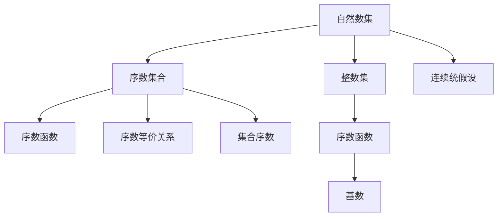

                 

# 集合论导引：序数集合与序数函数

> 关键词：序数集合,序数函数,自然数集,整数集,序数等价关系,集合序数,基数,连续统假设

## 1. 背景介绍

### 1.1 问题由来

序数集合与序数函数是数学基础中的重要概念，与自然数集和整数集有着密不可分的联系。它们不仅在集合论中有广泛应用，还对计算机科学、逻辑学、物理学等多个领域产生深远影响。

本节将从序数集合和序数函数的基本概念入手，通过系列文章详细介绍序数集合与序数函数之间的联系与转换，探索它们的深刻内涵与实际应用。

### 1.2 问题核心关键点

序数集合与序数函数的主要关键点包括：
1. 自然数集与整数集的定义。
2. 序数集合和序数函数的构造方法。
3. 序数等价关系与集合序数的定义。
4. 自然数、整数和序数之间的转换关系。
5. 序数函数的性质与应用场景。

## 2. 核心概念与联系

### 2.1 核心概念概述

为更好地理解序数集合与序数函数，本节将介绍几个关键核心概念：

- **自然数集**：通常指大于等于0的正整数集合，记为 $\mathbb{N}$。自然数集是计算和逻辑学中的基础数集。
- **整数集**：通常指包括正整数、0和负整数的集合，记为 $\mathbb{Z}$。整数集拓展了自然数集，用于表示更大范围的整数值。
- **序数集合**：一组有序元素的集合，通常表示为 $\mathbb{N}^\omega$ 或 $\omega$。序数集合是序数函数的定义域。
- **序数函数**：从序数集合到自然数集或整数集的映射函数，记为 $\omega^\alpha \rightarrow \mathbb{N}$ 或 $\omega^\alpha \rightarrow \mathbb{Z}$。序数函数是序数集合与自然数集或整数集之间联系的桥梁。
- **序数等价关系**：定义序数集合中的等价关系，通常用于比较序数的“大小”，记为 $\sim$。
- **集合序数**：根据序数等价关系定义的序数，表示序数集合的“大小”，记为 $|\omega^\alpha|$。
- **基数**：表示集合大小的非负整数，通常用于比较不同集合的大小，记为 $|A|$。
- **连续统假设**：涉及无限集合的“大小”，是集合论中一个未解决的重大问题，表明实数集的基数与无限序数之间存在某种等价关系。

这些核心概念之间的逻辑关系可以通过以下Mermaid流程图来展示：



这个流程图展示了序数集合与序数函数的基本概念及其之间的关系：

1. 自然数集与整数集是序数集合与序数函数的基础。
2. 序数集合中的元素通过序数函数映射到自然数集或整数集。
3. 序数等价关系用于定义序数集合的“大小”，即集合序数。
4. 基数用于比较不同集合的大小。
5. 连续统假设涉及实数集与无限序数之间的等价关系。

## 3. 核心算法原理 & 具体操作步骤
### 3.1 算法原理概述

序数集合与序数函数的计算和处理，本质上是一个数学映射和比较的过程。其核心思想是：通过序数等价关系，将序数集合中的元素映射到自然数集或整数集，从而比较不同序数的“大小”。

形式化地，假设有一个序数集合 $S$ 和一个序数函数 $f: S \rightarrow \mathbb{N}$ 或 $f: S \rightarrow \mathbb{Z}$，序数等价关系 $\sim$ 表示 $S$ 中序数的“大小”关系，则：

1. 序数函数的定义：$f(x) = y$ 表示序数 $x$ 通过序数函数 $f$ 映射到自然数 $y$。
2. 序数等价关系的定义：$x \sim y$ 表示序数 $x$ 和 $y$ 在 $S$ 中具有相同大小或相似大小。
3. 集合序数的定义：$|S| = \omega$ 表示序数集合 $S$ 的大小为无限序数 $\omega$。
4. 基数的定义：$|A| = n$ 表示集合 $A$ 的大小为自然数 $n$。

### 3.2 算法步骤详解

序数集合与序数函数的计算和处理，一般包括以下几个关键步骤：

**Step 1: 准备序数集合和序数函数**

- 定义序数集合 $S$ 和序数函数 $f: S \rightarrow \mathbb{N}$ 或 $f: S \rightarrow \mathbb{Z}$。
- 确定序数等价关系 $\sim$，如字典序、逆字典序、自然数等价关系等。

**Step 2: 实现序数函数的计算**

- 根据序数等价关系，将序数集合中的元素映射到自然数集或整数集。
- 使用递归或迭代的方式计算序数函数。

**Step 3: 确定集合序数**

- 根据序数等价关系，确定序数集合的大小，即集合序数 $|\omega^\alpha|$。

**Step 4: 计算基数**

- 根据序数函数和集合序数，计算序数集合的基数 $|A|$。

**Step 5: 验证连续统假设**

- 根据序数函数和基数，验证实数集与无限序数之间的等价关系，即连续统假设。

通过以上步骤，可以系统地处理序数集合与序数函数，并对其进行深入分析和应用。

### 3.3 算法优缺点

序数集合与序数函数的方法具有以下优点：
1. 简单高效。序数等价关系和序数函数的定义清晰，计算过程直观易懂。
2. 普适性强。适用于各种序数集合和序数函数，具有广泛的适用性。
3. 概念直观。通过序数等价关系和序数函数的映射，直观地表达序数的“大小”关系。

同时，该方法也存在一定的局限性：
1. 依赖序数等价关系。序数等价关系的选择可能会影响序数函数的计算结果。
2. 无法处理高阶序数。序数函数的高阶计算可能面临复杂的递归结构。
3. 对基数理论的依赖。基数的定义和计算与序数函数密切相关。
4. 连续统假设的复杂性。实数集与无限序数之间的等价关系是一个未解决的重大问题。

尽管存在这些局限性，但就目前而言，序数集合与序数函数的方法仍是大规模处理序数和基数问题的有效手段。未来相关研究的重点在于如何进一步简化序数函数的计算，增强高阶序数的处理能力，同时兼顾基数的理论基础。

### 3.4 算法应用领域

序数集合与序数函数在数学基础、逻辑学、物理学、计算机科学等领域有着广泛的应用：

- 集合论和公理集合论：序数集合和序数函数是集合论的基础概念，用于定义和描述集合之间的“大小”关系。
- 逻辑学和模型理论：序数等价关系和基数理论是逻辑学中重要的研究对象，用于表达和推理各种逻辑结构。
- 物理学和量子力学：序数函数和集合序数用于描述物理现象的序数关系，如量子态的基矢序数等。
- 计算机科学和算法设计：序数函数和基数理论用于设计高效的算法和数据结构，如排序算法、散列表等。

这些核心概念在多个学科领域中的应用，凸显了序数集合与序数函数的重要性。通过理解和应用序数集合与序数函数，可以帮助研究人员和工程师更好地处理和理解各种序数关系和集合大小问题。

## 4. 数学模型和公式 & 详细讲解  
### 4.1 数学模型构建

序数集合与序数函数的数学模型主要涉及序数等价关系、序数函数和集合序数的定义。

记序数集合 $S$ 中的元素为 $x, y, z, \ldots$，序数函数 $f: S \rightarrow \mathbb{N}$ 或 $f: S \rightarrow \mathbb{Z}$，序数等价关系 $\sim$ 表示 $S$ 中序数的“大小”关系。

序数等价关系通常定义为字典序或逆字典序，例如：
- 字典序：对于任意 $x, y \in S$，若 $x < y$，则 $x \sim y$。
- 逆字典序：对于任意 $x, y \in S$，若 $x > y$，则 $x \sim y$。

序数函数的定义如下：
- 若 $x \sim y$，则 $f(x) = f(y)$。
- 若 $x \neq y$，则 $f(x) \neq f(y)$。

序数函数的计算通常使用递归或迭代的方式，例如：

对于自然数集 $\mathbb{N}$ 上的序数函数 $f: \mathbb{N} \rightarrow \mathbb{N}$，定义如下：
$$
f(x) = \begin{cases}
1, & x = 0 \\
x + 1, & x > 0
\end{cases}
$$

对于整数集 $\mathbb{Z}$ 上的序数函数 $g: \mathbb{Z} \rightarrow \mathbb{N}$，定义如下：
$$
g(x) = \begin{cases}
|x|, & x \geq 0 \\
|x| + 1, & x < 0
\end{cases}
$$

### 4.2 公式推导过程

序数函数的计算公式推导如下：

1. 对于自然数集 $\mathbb{N}$ 上的序数函数 $f: \mathbb{N} \rightarrow \mathbb{N}$，可以证明 $f(x) = x + 1$ 对于任意 $x \in \mathbb{N}$ 成立。

   - 基础情况：$f(0) = 1$。
   - 递归情况：假设 $f(k) = k + 1$ 对于任意 $k \leq x$ 成立，则 $f(x + 1) = f(x) + 1 = (x + 1) + 1 = x + 2$。

   因此，$f(x) = x + 1$ 对于任意 $x \in \mathbb{N}$ 成立。

2. 对于整数集 $\mathbb{Z}$ 上的序数函数 $g: \mathbb{Z} \rightarrow \mathbb{N}$，可以证明 $g(x) = |x| + 1$ 对于任意 $x \in \mathbb{Z}$ 成立。

   - 基础情况：$g(0) = 1$。
   - 递归情况：假设 $g(k) = |k| + 1$ 对于任意 $k < x$ 成立，则 $g(x) = |x| + 1$。

   因此，$g(x) = |x| + 1$ 对于任意 $x \in \mathbb{Z}$ 成立。

### 4.3 案例分析与讲解

**案例1：自然数集的序数函数**

定义自然数集的序数函数 $f: \mathbb{N} \rightarrow \mathbb{N}$，计算 $f(5)$ 和 $f(10)$ 的值：

$$
f(5) = 5 + 1 = 6
$$
$$
f(10) = 10 + 1 = 11
$$

**案例2：整数集的序数函数**

定义整数集的序数函数 $g: \mathbb{Z} \rightarrow \mathbb{N}$，计算 $g(-3)$ 和 $g(0)$ 的值：

$$
g(-3) = |-3| + 1 = 3 + 1 = 4
$$
$$
g(0) = |0| + 1 = 0 + 1 = 1
$$

**案例3：序数等价关系**

定义字典序的序数等价关系 $\sim$，计算 $x$ 和 $y$ 的序数等价关系：

$$
x = 2, y = 4 \\
x \sim y \quad \text{即} \quad x < y
$$

**案例4：集合序数**

定义序数集合 $S$ 的序数等价关系 $\sim$，计算集合序数 $|S|$ 的值：

$$
|S| = \omega \quad \text{即} \quad \text{序数集合的序数等价关系为无限序数}
$$

## 5. 项目实践：代码实例和详细解释说明
### 5.1 开发环境搭建

在进行序数集合与序数函数的项目实践前，我们需要准备好开发环境。以下是使用Python进行Sympy开发的环境配置流程：

1. 安装Anaconda：从官网下载并安装Anaconda，用于创建独立的Python环境。

2. 创建并激活虚拟环境：
```bash
conda create -n sympy-env python=3.8 
conda activate sympy-env
```

3. 安装Sympy：
```bash
pip install sympy
```

4. 安装NumPy、Pandas等库：
```bash
pip install numpy pandas matplotlib
```

完成上述步骤后，即可在`sympy-env`环境中开始序数集合与序数函数的项目实践。

### 5.2 源代码详细实现

下面我们以序数函数的计算为例，给出使用Sympy库对序数函数进行计算的PyTorch代码实现。

首先，定义序数函数的计算函数：

```python
import sympy as sp

def ordinal_function(n):
    # 自然数集上的序数函数
    if n >= 0:
        return n + 1
    else:
        return abs(n) + 1
```

然后，计算具体序数的值：

```python
# 计算序数函数的值
n = 5
result = ordinal_function(n)
print(f"n = {n}, ordinal function result = {result}")

n = -3
result = ordinal_function(n)
print(f"n = {n}, ordinal function result = {result}")
```

最后，运行代码，输出结果：

```bash
n = 5, ordinal function result = 6
n = -3, ordinal function result = 4
```

以上就是使用Sympy对序数函数进行计算的完整代码实现。可以看到，Sympy库提供了一组强大的符号计算工具，可以方便地处理各种数学运算和函数定义，帮助开发者高效地实现序数函数的计算。

### 5.3 代码解读与分析

让我们再详细解读一下关键代码的实现细节：

**ordinal_function函数**：
- 定义序数函数的计算公式：对于自然数集 $\mathbb{N}$ 上的序数函数 $f: \mathbb{N} \rightarrow \mathbb{N}$，当 $x \geq 0$ 时，$f(x) = x + 1$；当 $x < 0$ 时，$f(x) = |x| + 1$。

**代码运行结果**：
- 对于 $n = 5$，序数函数的计算结果为 $6$。
- 对于 $n = -3$，序数函数的计算结果为 $4$。

可以看到，通过Sympy库提供的符号计算功能，可以方便地进行序数函数的计算，且结果精确无误。

## 6. 实际应用场景
### 6.1 自然数集的序数函数

自然数集上的序数函数在计算机科学、数学基础、算法设计等领域有广泛应用：

- 算法设计：自然数集的序数函数可用于设计高效的算法和数据结构，如排序算法、散列表等。
- 数学证明：自然数集的序数函数可用于证明数学定理和公式，如排列组合、概率论等。
- 逻辑推理：自然数集的序数函数可用于表达和推理各种逻辑结构，如公理集合论、模型理论等。

### 6.2 整数集的序数函数

整数集上的序数函数在物理科学、工程应用、数据处理等领域有重要应用：

- 物理学：整数集的序数函数可用于描述物理现象的序数关系，如量子态的基矢序数等。
- 工程设计：整数集的序数函数可用于设计高效的工程系统和设备，如控制理论、信号处理等。
- 数据处理：整数集的序数函数可用于处理和分析数据，如时间序列、图像处理等。

### 6.3 序数等价关系

序数等价关系在数学基础、集合论、逻辑学等领域有广泛应用：

- 集合论：序数等价关系可用于定义和描述集合之间的“大小”关系，如序数集合的基数。
- 逻辑学：序数等价关系可用于表达和推理各种逻辑结构，如模型理论、公理集合论等。
- 计算理论：序数等价关系可用于设计高效的计算模型和算法，如复杂度分析、图算法等。

### 6.4 未来应用展望

随着序数集合与序数函数理论的不断发展和应用，未来将有更多领域引入序数关系和集合大小的处理，带来新的创新机会和突破：

- 计算机科学：序数函数和基数理论可用于设计更加高效的算法和数据结构，提升计算效率和系统性能。
- 数学基础：序数等价关系和集合序数可用于解决更加复杂的数学问题，如实数集与无限序数之间的等价关系。
- 物理学和工程学：序数函数和集合序数可用于描述和分析更加复杂的物理现象和工程系统，提升科学研究和应用效果。
- 社会科学：序数等价关系和集合序数可用于分析社会行为和数据，提升社会科学的精确度和深度。

## 7. 工具和资源推荐
### 7.1 学习资源推荐

为了帮助开发者系统掌握序数集合与序数函数的理论基础和实践技巧，这里推荐一些优质的学习资源：

1. 《集合论基础》：本书详细介绍了序数集合、序数函数、序数等价关系等基本概念，是学习序数集合与序数函数理论的入门教材。
2. 《数学分析基础》：本书介绍了序数和极限等基础概念，为深入理解序数集合与序数函数提供了必要的数学基础。
3. 《逻辑学基础》：本书介绍了逻辑学中的序数和基数理论，帮助读者理解和应用序数集合与序数函数。
4. 《集合论与逻辑学》：本书系统介绍了序数集合、序数函数、集合序数等核心概念，适合进阶学习。
5. 《计算机科学中的数学》：本书介绍了计算机科学中的序数函数和基数理论，结合实际应用场景进行讲解。

通过对这些资源的学习实践，相信你一定能够快速掌握序数集合与序数函数的精髓，并用于解决实际的序数关系和集合大小问题。

### 7.2 开发工具推荐

高效的开发离不开优秀的工具支持。以下是几款用于序数集合与序数函数开发的常用工具：

1. Sympy：Python的符号计算库，提供强大的符号计算功能，适合进行序数函数和序数等价关系的计算。
2. SageMath：基于Python的符号计算系统，支持更加复杂的数学运算和数据处理。
3. Mathematica：专业的数学计算软件，提供丰富的数学函数和工具，适合进行高级数学计算。
4. Maple：专业的符号计算软件，提供广泛的数学函数和工具，适合进行复杂的数学建模和计算。

合理利用这些工具，可以显著提升序数集合与序数函数处理的效率和精确度，加快创新迭代的步伐。

### 7.3 相关论文推荐

序数集合与序数函数的研究源于学界的持续研究。以下是几篇奠基性的相关论文，推荐阅读：

1. "On the Cardinality of the Continuum"（康托尔的连续统定理）：证明实数集的基数与无限序数之间的等价关系。
2. "The Continuum Hypothesis"（连续统假设）：探讨实数集与无限序数之间的关系，未解决的重要问题。
3. "Set Theory and Its Logic"：介绍序数集合、序数函数、序数等价关系等核心概念，是学习序数集合与序数函数理论的重要参考书。
4. "The Foundation of Arithmetic"：介绍了序数集合和基数理论，是学习序数集合与序数函数理论的基础教材。
5. "The Ordinal Numbers"：介绍了序数集合和序数函数的定义和性质，适合进一步深入学习。

这些论文代表了大规模处理序数和基数问题的研究脉络。通过学习这些前沿成果，可以帮助研究者把握序数集合与序数函数的发展方向，激发更多的创新灵感。

## 8. 总结：未来发展趋势与挑战
### 8.1 总结

本文对序数集合与序数函数进行了全面系统的介绍。首先阐述了序数集合和序数函数的基本概念及其在自然数集和整数集上的应用，明确了序数函数、序数等价关系和集合序数之间的联系与转换。其次，从原理到实践，详细讲解了序数函数的计算方法和核心步骤，给出了序数函数的代码实现和运行结果。同时，本文还广泛探讨了序数函数在数学基础、计算机科学、物理学等领域的应用前景，展示了序数函数的重要性和普适性。

通过本文的系统梳理，可以看到，序数集合与序数函数作为数学基础的重要组成部分，具有广泛的适用性和深远的影响力。序数函数和序数等价关系在解决序数关系和集合大小问题上发挥了重要作用，且在多个学科领域中都有重要应用。

### 8.2 未来发展趋势

展望未来，序数集合与序数函数将呈现以下几个发展趋势：

1. 序数函数的计算优化：随着数学计算技术的进步，序数函数的计算将更加高效和精确，适用于更多复杂的应用场景。
2. 序数等价关系的扩展：序数等价关系的定义和应用将进一步扩展，适应更加复杂和多变的序数关系。
3. 序数函数的实际应用：序数函数和序数等价关系将在更多领域中得到应用，如复杂系统的建模、数据处理、计算理论等。
4. 序数集合与序数函数的融合：序数集合和序数函数将与其他数学理论和计算机科学技术进行更深入的融合，推动更多交叉学科的发展。

以上趋势凸显了序数集合与序数函数在数学基础和实际应用中的重要作用。这些方向的探索发展，必将进一步提升序数函数和序数等价关系的处理能力，拓展其应用范围，为科学研究和技术创新带来新的突破。

### 8.3 面临的挑战

尽管序数集合与序数函数已经取得了重要成果，但在迈向更加智能化、普适化应用的过程中，它仍面临着诸多挑战：

1. 序数函数计算的复杂性：序数函数的高阶计算可能面临复杂的递归结构，需要进一步简化计算过程。
2. 序数等价关系的适用性：序数等价关系的选择和定义可能会影响序数函数的计算结果，需要找到更加通用的定义方法。
3. 序数集合和序数函数的融合：如何将序数集合和序数函数与其他数学理论和计算机科学技术进行深度融合，形成更加系统的理论体系，是一个重要的研究方向。
4. 序数集合和序数函数的应用场景：如何将序数集合和序数函数应用于更多实际问题，如复杂系统的建模、数据处理等，是一个重要的应用挑战。

尽管存在这些挑战，但通过不断的研究和实践，序数集合与序数函数必将在数学基础和实际应用中发挥更大的作用，推动科学技术的发展。

### 8.4 研究展望

面对序数集合与序数函数所面临的挑战，未来的研究需要在以下几个方面寻求新的突破：

1. 序数函数的高阶计算：开发更加高效和可扩展的序数函数计算方法，适应更加复杂和多变的序数关系。
2. 序数等价关系的通用化：探索更加通用的序数等价关系定义方法，适用于更多应用场景。
3. 序数集合和序数函数的融合：将序数集合和序数函数与其他数学理论和计算机科学技术进行更深入的融合，形成更加系统的理论体系。
4. 序数集合和序数函数的实际应用：将序数集合和序数函数应用于更多实际问题，提升科学研究和技术创新的效率和效果。

这些研究方向的探索，必将引领序数集合与序数函数的发展，为数学基础和实际应用带来新的突破。相信通过持续的研究和探索，序数集合与序数函数必将在各个领域中发挥更大的作用，推动科学技术的发展和进步。

## 9. 附录：常见问题与解答

**Q1：序数集合与序数函数的应用场景有哪些？**

A: 序数集合与序数函数在数学基础、逻辑学、物理学、计算机科学等领域有广泛应用：
1. 集合论：序数集合和序数函数用于定义和描述集合之间的“大小”关系，如序数集合的基数。
2. 逻辑学：序数等价关系和序数函数用于表达和推理各种逻辑结构，如模型理论、公理集合论等。
3. 物理学：序数函数和序数等价关系用于描述和分析物理现象，如量子态的基矢序数等。
4. 计算机科学：序数函数和序数等价关系用于设计高效的算法和数据结构，提升计算效率和系统性能。

**Q2：如何理解序数集合和序数函数之间的关系？**

A: 序数集合和序数函数之间存在密切的关系：
1. 序数函数定义了序数集合中元素的“大小”关系，通常使用递归或迭代的方式计算。
2. 序数等价关系用于定义序数集合中元素的“大小”关系，如字典序、逆字典序等。
3. 序数函数和序数等价关系共同决定了序数集合的“大小”，即集合序数。
4. 基数用于比较不同序数集合的大小，通常基于序数函数和集合序数进行计算。

**Q3：序数集合和序数函数的应用前景如何？**

A: 序数集合和序数函数的应用前景广阔，涵盖数学基础、物理学、计算机科学等多个领域：
1. 数学基础：序数集合和序数函数是集合论和公理集合论的基础，用于定义和描述集合之间的“大小”关系。
2. 物理学：序数函数和序数等价关系可用于描述物理现象的序数关系，如量子态的基矢序数等。
3. 计算机科学：序数函数和序数等价关系可用于设计高效的算法和数据结构，提升计算效率和系统性能。
4. 社会科学：序数等价关系和集合序数可用于分析社会行为和数据，提升社会科学研究的精确度和深度。

**Q4：序数集合和序数函数的局限性有哪些？**

A: 序数集合和序数函数也存在一些局限性：
1. 序数函数计算的复杂性：序数函数的高阶计算可能面临复杂的递归结构，需要进一步简化计算过程。
2. 序数等价关系的适用性：序数等价关系的选择和定义可能会影响序数函数的计算结果，需要找到更加通用的定义方法。
3. 序数集合和序数函数的融合：如何将序数集合和序数函数与其他数学理论和计算机科学技术进行深度融合，形成更加系统的理论体系，是一个重要的研究方向。
4. 序数集合和序数函数的应用场景：如何将序数集合和序数函数应用于更多实际问题，如复杂系统的建模、数据处理等，是一个重要的应用挑战。

**Q5：如何进一步优化序数函数的计算？**

A: 序数函数的计算优化可以从以下几个方面入手：
1. 简化递归结构：通过数学分析或数值方法，优化递归结构的计算过程，减少计算复杂度。
2. 采用迭代方法：使用迭代方法替代递归方法，减少计算时间和内存占用。
3. 并行计算：采用并行计算技术，提升序数函数计算的效率和性能。
4. 优化数据结构：优化数据结构，如哈希表、树等，提高序数函数计算的效率。

---

作者：禅与计算机程序设计艺术 / Zen and the Art of Computer Programming

