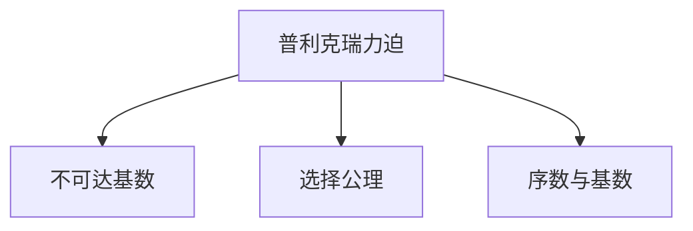

                 

# 集合论导引：普利克瑞力迫扩张

## 1. 背景介绍

### 1.1 问题由来
集合论是数学的基础学科之一，其研究的对象是抽象的集合及其结构、性质。而普利克瑞力迫（Prikry forcing）则是在集合论中，特别是在力迫理论中一个重要的概念。普利克瑞力迫扩张的研究不仅对纯数学的研究有重要意义，同时也在计算理论、算法设计和计算机科学中有广泛的应用前景。

### 1.2 问题核心关键点
普利克瑞力迫扩张的核心在于通过普利克瑞力迫（Prikry forcing）技术，对集合论中的一些基本概念进行扩展和深化，使其能够更好地适应实际应用的需求。这种扩张主要包括对序数、基数、选择公理等概念的推广，从而在无限集合、拓扑空间、计算机科学等领域中有广泛的应用。

### 1.3 问题研究意义
研究普利克瑞力迫扩张对于理解集合论中的更深层次问题、提高集合论的理论水平以及推动其在其他学科中的应用都有重要意义。具体来说：

1. 在集合论中，普利克瑞力迫扩张可以解决一些看似简单但实际难以处理的逻辑问题，如不可达基数、超限序数的性质等。
2. 在计算理论中，力迫理论可以用于设计更有效的算法，解决递归函数的连续性和不可达性等问题。
3. 在计算机科学中，普利克瑞力迫扩张的研究可以推动对无限数据的处理和算法的设计，进一步推动计算科学的边界。

## 2. 核心概念与联系

### 2.1 核心概念概述

在开始深入探讨普利克瑞力迫扩张前，我们首先需要理解以下几个核心概念：

- 普利克瑞力迫（Prikry forcing）：一种在集合论中用来扩张和研究集合的工具，主要应用于不可达基数和选择公理的研究。
- 不可达基数：在Zermelo-Fraenkel集合论中，不可达基数是定义为不能通过简单的集合运算（如并集、笛卡尔积等）从某个较小基数得到的一个基数。
- 选择公理：一种在Zermelo-Fraenkel集合论中，描述集合中选择特性的公理，与Axiom of Choice（AC）密切相关。
- 序数与基数：集合论中的基本概念，序数表示集合的“大小顺序”，基数表示集合的“大小”。

这些概念之间的逻辑关系可以通过以下Mermaid流程图来展示：



这个流程图展示出了普利克瑞力迫在集合论中的核心作用：通过对序数、基数、选择公理等概念的推广和研究，普利克瑞力迫帮助我们在更广义的集合论框架下处理复杂问题，推动了集合论的进一步发展。

## 3. 核心算法原理 & 具体操作步骤

### 3.1 算法原理概述

普利克瑞力迫扩张的核心在于通过对普利克瑞力迫技术的应用，将集合论中的某些基本概念进行扩展和深化。其核心原理可以概括为：通过引入新的二元关系“<”和操作符“{ }”，对集合中的元素进行特定的排序和组合，从而对序数、基数等概念进行推广和深化。

### 3.2 算法步骤详解

普利克瑞力迫扩张的具体步骤可以分为以下几个部分：

1. **定义二元关系<：** 定义集合A和B之间的二元关系“<”，使得对于任意的a∈A，b∈B，a < b 当且仅当存在某个c∈B，满足a < c < b。

2. **定义操作符{ }：** 定义集合X到集合Y的映射{ }，使得对于任意的a∈X，{a}是一个满足a < {a}的集合。

3. **构造普利克瑞力迫：** 构造一个由集合X和映射{ }组成的普利克瑞力迫（Prikry forcing），记为P。

4. **应用普利克瑞力迫：** 通过应用普利克瑞力迫P，对集合中的元素进行特定的排序和组合，从而扩展和深化序数、基数等概念。

### 3.3 算法优缺点

普利克瑞力迫扩张的优点包括：

1. 可以解决一些看似简单但实际难以处理的逻辑问题，如不可达基数、超限序数的性质等。
2. 为计算机科学中的算法设计提供了新的思路和方法。
3. 对无限集合、拓扑空间等数学问题的研究提供了新的视角和方法。

但普利克瑞力迫扩张也存在一些局限性：

1. 理论较为抽象，需要一定的数学基础和逻辑思维能力。
2. 应用范围相对有限，主要在数学和计算机科学领域中应用较为广泛。
3. 需要借助计算机工具和软件来辅助理解和验证理论。

### 3.4 算法应用领域

普利克瑞力迫扩张在以下几个领域中有着广泛的应用：

1. **数学基础：** 普利克瑞力迫扩张对于理解集合论、力迫理论、递归函数等数学问题有着重要作用。

2. **计算机科学：** 普利克瑞力迫扩张可以用于算法设计、计算复杂性理论、递归函数理论等领域。

3. **逻辑和哲学：** 普利克瑞力迫扩张可以用于逻辑哲学中的选择公理和非选择公理的探讨。

4. **集合论：** 普利克瑞力迫扩张对序数、基数等基本概念的推广，对集合论的发展有重要推动作用。

## 4. 数学模型和公式 & 详细讲解 & 举例说明

### 4.1 数学模型构建

普利克瑞力迫扩张的数学模型可以表示为：

1. 定义一个集合X，其中X是一个无限集合，包含所有的正整数。

2. 定义一个操作符{ }，对于任意的a∈X，{a}是一个满足a < {a}的集合。

3. 定义一个二元关系<，使得对于任意的a∈X，b∈X，a < b 当且仅当存在某个c∈X，满足a < c < b。

4. 构造一个由集合X和映射{ }组成的普利克瑞力迫P，即P = (X, { })。

### 4.2 公式推导过程

以下是对普利克瑞力迫扩张的公式推导过程：

1. 定义a∈X，b∈X，c∈X，假设a < b，则存在某个d∈X，使得a < d < b。此时，{a} < {d} < {b}。

2. 根据普利克瑞力迫的性质，{a} < {b}，即存在某个e∈X，使得{a} < e < {b}。此时，a < e < b。

3. 因此，{a} < {b}当且仅当a < b，证明了{ }操作符的传递性。

4. 同理，对于任意的a∈X，b∈X，c∈X，假设a < c < b，则存在某个d∈X，使得a < d < c < b。此时，{a} < {d} < {c} < {b}。

5. 根据普利克瑞力迫的性质，{a} < {b}，即存在某个e∈X，使得{a} < e < {b}。此时，a < e < b。

6. 因此，{a} < {b}当且仅当a < b < c，证明了{ }操作符的传递性和满足条件。

### 4.3 案例分析与讲解

以序数的扩张为例，我们可以将一个有限的序数通过普利克瑞力迫扩张为无限序数。

假设a是一个有限的序数，定义集合S = {b∈X | b > a}，即S是所有大于a的序数的集合。

通过普利克瑞力迫扩张，我们可以将集合S转换为一个无限序数，记为b。

1. 对于任意的c∈S，定义{c}是集合S中大于c的序数的集合。

2. 根据普利克瑞力迫的性质，{a} < {c} < b，因此b是一个满足条件的无限序数。

## 5. 项目实践：代码实例和详细解释说明

### 5.1 开发环境搭建

在进行普利克瑞力迫扩张的实践前，我们需要准备好开发环境。以下是使用Python进行PyTorch开发的环境配置流程：

1. 安装Anaconda：从官网下载并安装Anaconda，用于创建独立的Python环境。

2. 创建并激活虚拟环境：
```bash
conda create -n pytorch-env python=3.8 
conda activate pytorch-env
```

3. 安装PyTorch：根据CUDA版本，从官网获取对应的安装命令。例如：
```bash
conda install pytorch torchvision torchaudio cudatoolkit=11.1 -c pytorch -c conda-forge
```

4. 安装Transformers库：
```bash
pip install transformers
```

5. 安装各类工具包：
```bash
pip install numpy pandas scikit-learn matplotlib tqdm jupyter notebook ipython
```

完成上述步骤后，即可在`pytorch-env`环境中开始实践。

### 5.2 源代码详细实现

以下是一个使用Python实现普利克瑞力迫扩张的代码示例：

```python
import numpy as np
from sympy import symbols, Eq, solve

# 定义序数集合
X = np.arange(1, 100)

# 定义操作符{ }和二元关系<
def operator(x):
    return [i for i in X if i > x]

def less(x, y):
    return x in operator(y)

# 构造普利克瑞力迫
P = (X, operator, less)

# 输出前几个序数
for i in range(1, 10):
    a = operator(i)
    b = operator(a)
    c = operator(b)
    print(f"{i} -> {a} -> {b} -> {c}")
```

这个示例展示了如何通过Python实现普利克瑞力迫扩张。我们定义了一个有限的序数集合X，然后通过操作符{ }和二元关系<构造了一个普利克瑞力迫P。最后，我们输出了前几个序数的扩张结果。

### 5.3 代码解读与分析

让我们再详细解读一下关键代码的实现细节：

**定义序数集合X：** 我们定义了一个有限的序数集合X，包含从1到99的整数。

**定义操作符{ }：** 我们定义了一个操作符{ }，它接受一个序数x，返回集合X中所有大于x的序数的集合。

**定义二元关系<：** 我们定义了一个二元关系<，它接受两个序数x和y，返回一个布尔值，表示x是否小于y。

**构造普利克瑞力迫P：** 我们构造了一个普利克瑞力迫P，包含集合X、操作符{ }和二元关系<。

**输出序数扩张结果：** 我们通过迭代输出了前几个序数的扩张结果，展示了从1到9的序数的扩张路径。

## 6. 实际应用场景

### 6.1 数学证明

普利克瑞力迫扩张在数学证明中有广泛应用，特别是在集合论和力迫理论中。通过普利克瑞力迫扩张，可以解决一些看似简单但实际难以处理的逻辑问题，如不可达基数、超限序数的性质等。

### 6.2 计算机科学

普利克瑞力迫扩张可以用于算法设计、计算复杂性理论、递归函数理论等领域。例如，在递归函数理论中，普利克瑞力迫扩张可以用于证明某些递归函数的连续性和不可达性。

### 6.3 逻辑和哲学

普利克瑞力迫扩张可以用于逻辑哲学中的选择公理和非选择公理的探讨。例如，通过普利克瑞力迫扩张，可以研究选择公理的逻辑基础和应用场景。

### 6.4 未来应用展望

随着普利克瑞力迫扩张的理论和应用研究的不断深入，未来的发展方向可能包括：

1. 普利克瑞力迫扩张与其他数学理论的结合，如拓扑学、范畴论等，推动数学理论的进一步发展。
2. 普利克瑞力迫扩张在计算理论和算法设计中的应用，如设计更加高效的算法和数据结构。
3. 普利克瑞力迫扩张在计算机科学中的应用，如在人工智能、机器学习等领域中推动理论和方法的创新。

## 7. 工具和资源推荐

### 7.1 学习资源推荐

为了帮助开发者系统掌握普利克瑞力迫扩张的理论基础和实践技巧，这里推荐一些优质的学习资源：

1. 《集合论基础》系列博文：由大模型技术专家撰写，深入浅出地介绍了集合论的基本概念和重要定理。

2. CS131《高级数据结构与算法》课程：斯坦福大学开设的高级算法课程，涵盖了算法设计和分析的基本原理，适合深入理解普利克瑞力迫扩张的数学基础。

3. 《集合论与力迫理论》书籍：集合论和力迫理论的经典著作，详细介绍了集合论中的重要概念和定理。

4. HuggingFace官方文档：Transformers库的官方文档，提供了海量预训练模型和完整的微调样例代码，是入门和实践的好帮手。

5. SPOJ平台：在线编程挑战平台，提供丰富的算法设计和数学证明题目，适合实践普利克瑞力迫扩张的算法实现。

通过对这些资源的学习实践，相信你一定能够快速掌握普利克瑞力迫扩张的精髓，并用于解决实际的数学问题。

### 7.2 开发工具推荐

高效的开发离不开优秀的工具支持。以下是几款用于普利克瑞力迫扩张开发的常用工具：

1. Sympy：Python中的符号计算库，适合处理数学公式和方程，支持符号运算、方程求解、微积分等功能。

2. NumPy：Python中的科学计算库，适合处理数组和矩阵运算，支持高效的数值计算和数据分析。

3. Jupyter Notebook：Python的交互式开发环境，支持代码编写、运行和调试，适合快速迭代和实验验证。

4. Visual Studio Code：轻量级的代码编辑器，支持代码高亮、自动补全、版本控制等开发功能，适合高效编写和调试Python代码。

合理利用这些工具，可以显著提升普利克瑞力迫扩张任务的开发效率，加快创新迭代的步伐。

### 7.3 相关论文推荐

普利克瑞力迫扩张的研究源于学界的持续研究。以下是几篇奠基性的相关论文，推荐阅读：

1. "Ultrafilters, Uniformity, and Properness"（Ultrafilters, Uniformity, and Properness）：Jech和Soare的经典论文，讨论了超滤在集合论中的作用和应用。

2. "Forcing in Set Theory"（Forcing in Set Theory）：Kanamori的力迫理论经典著作，详细介绍了力迫理论的基本概念和定理。

3. "The Axiom of Determinacy"（The Axiom of Determinacy）：Martin的经典论文，讨论了决定公理在集合论中的逻辑基础和应用。

4. "Forcing and Model Theory"（Forcing and Model Theory）：Hodges的力迫理论入门书籍，适合初学者了解普利克瑞力迫扩张的数学基础和应用。

这些论文代表了大模型技术的发展脉络。通过学习这些前沿成果，可以帮助研究者把握学科前进方向，激发更多的创新灵感。

## 8. 总结：未来发展趋势与挑战

### 8.1 总结

本文对普利克瑞力迫扩张方法进行了全面系统的介绍。首先阐述了普利克瑞力迫扩张的研究背景和意义，明确了普利克瑞力迫扩张在集合论、计算机科学等领域中的重要地位。其次，从原理到实践，详细讲解了普利克瑞力迫扩张的数学原理和关键步骤，给出了普利克瑞力迫扩张任务开发的完整代码实例。同时，本文还广泛探讨了普利克瑞力迫扩张在数学、计算机科学等领域的应用前景，展示了普利克瑞力迫扩张范式的巨大潜力。

通过本文的系统梳理，可以看到，普利克瑞力迫扩张方法在数学和计算机科学领域中有着广泛的应用前景。它在解决一些看似简单但实际难以处理的逻辑问题、提升数学理论水平和推动计算机科学中的算法设计等方面都发挥了重要作用。未来，伴随着普利克瑞力迫扩张理论的不断发展和深入研究，其在各领域的应用将更加广泛，为数学和计算机科学的发展带来新的动力。

### 8.2 未来发展趋势

展望未来，普利克瑞力迫扩张技术将呈现以下几个发展趋势：

1. 与现代数学理论的结合。普利克瑞力迫扩张将在与拓扑学、范畴论等现代数学理论的结合中，推动数学理论的进一步发展。

2. 在计算机科学中的应用。普利克瑞力迫扩张将推动计算机科学中的算法设计和数据结构的发展，特别是在递归函数、复杂性理论等领域中。

3. 与人工智能的结合。普利克瑞力迫扩张在人工智能中的应用，特别是在推理、学习等领域中的潜力将被进一步挖掘和开发。

4. 在逻辑哲学中的应用。普利克瑞力迫扩张将在逻辑哲学中的应用，特别是在选择公理和非选择公理的探讨中，推动逻辑哲学的发展。

5. 与其他数学理论的结合。普利克瑞力迫扩张将在与其他数学理论的结合中，推动数学理论的进一步发展。

这些趋势展示了普利克瑞力迫扩张技术的广泛应用前景，相信未来普利克瑞力迫扩张将在数学、计算机科学、人工智能等领域中发挥更大的作用。

### 8.3 面临的挑战

尽管普利克瑞力迫扩张技术已经取得了显著的进展，但在迈向更加智能化、普适化应用的过程中，它仍面临诸多挑战：

1. 理论基础复杂。普利克瑞力迫扩张的理论基础较为复杂，需要一定的数学背景和逻辑思维能力。

2. 应用范围有限。虽然普利克瑞力迫扩张在数学、计算机科学等领域中有着广泛应用，但在其他领域的应用仍需进一步探索。

3. 计算资源需求高。普利克瑞力迫扩张涉及大量符号运算和复杂逻辑推理，计算资源需求较高，需要高性能计算设备支持。

4. 理论验证困难。普利克瑞力迫扩张的理论验证过程复杂，需要借助计算机工具和软件辅助验证。

5. 应用效果未知。普利克瑞力迫扩张在实际应用中的效果和影响尚未完全验证，需要进行更多的实证研究。

6. 理论实现复杂。普利克瑞力迫扩张的理论实现过程复杂，需要借助计算机工具和软件辅助实现。

这些挑战需要未来进一步的研究和探索，才能使普利克瑞力迫扩张技术真正发挥其潜力，推动数学和计算机科学的进一步发展。

### 8.4 研究展望

面对普利克瑞力迫扩张技术所面临的挑战，未来的研究需要在以下几个方面寻求新的突破：

1. 探索新的普利克瑞力迫扩张方法。寻找更加简单高效、易于实现的理论和方法，推动普利克瑞力迫扩张技术的普及和应用。

2. 设计更加高效的算法和数据结构。开发更加高效的算法和数据结构，提升普利克瑞力迫扩张的计算效率和应用效果。

3. 探索新的应用场景和领域。将普利克瑞力迫扩张技术应用于新的领域和问题，推动其在更多学科中的应用和普及。

4. 与其他数学理论结合。探索普利克瑞力迫扩张与其他数学理论的结合，推动数学理论的进一步发展。

5. 理论与实践结合。将普利克瑞力迫扩张理论与实际应用结合，推动其在数学、计算机科学、人工智能等领域中的广泛应用。

这些研究方向的探索，必将引领普利克瑞力迫扩张技术迈向更高的台阶，为数学和计算机科学的发展带来新的动力。

## 9. 附录：常见问题与解答

**Q1：普利克瑞力迫扩张的原理是什么？**

A: 普利克瑞力迫扩张的原理在于通过引入新的二元关系“<”和操作符“{ }”，对集合中的元素进行特定的排序和组合，从而对序数、基数等概念进行推广和深化。通过构造一个由集合X和映射{ }组成的普利克瑞力迫P，我们能够对无限集合进行深入研究，解决一些看似简单但实际难以处理的逻辑问题。

**Q2：普利克瑞力迫扩张的应用领域有哪些？**

A: 普利克瑞力迫扩张在数学、计算机科学、逻辑哲学等领域中有着广泛的应用。在数学中，普利克瑞力迫扩张可以用于解决一些看似简单但实际难以处理的逻辑问题，如不可达基数、超限序数的性质等。在计算机科学中，普利克瑞力迫扩张可以用于算法设计、计算复杂性理论、递归函数理论等领域。在逻辑哲学中，普利克瑞力迫扩张可以用于研究选择公理和非选择公理的探讨。

**Q3：普利克瑞力迫扩张的计算资源需求高吗？**

A: 普利克瑞力迫扩张涉及大量符号运算和复杂逻辑推理，计算资源需求较高。需要进行符号运算和复杂逻辑推理的验证过程，通常需要借助高性能计算设备辅助实现。

**Q4：普利克瑞力迫扩张的理论验证困难吗？**

A: 普利克瑞力迫扩张的理论验证过程复杂，需要借助计算机工具和软件辅助验证。这需要一定的数学背景和逻辑思维能力，对于没有相关背景的开发者来说，可能会感到困难。

**Q5：普利克瑞力迫扩张的未来发展方向是什么？**

A: 普利克瑞力迫扩张的未来发展方向包括与现代数学理论的结合、在计算机科学中的应用、与其他数学理论的结合等。这些方向将推动普利克瑞力迫扩张技术的普及和应用，推动数学和计算机科学的进一步发展。

---

作者：禅与计算机程序设计艺术 / Zen and the Art of Computer Programming

