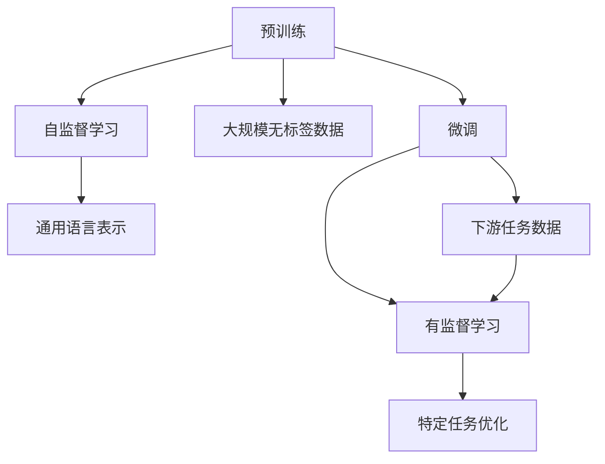

                 

# 预训练与微调的实战策略

> 关键词：预训练, 微调, 自然语言处理, 深度学习, Transformer, 大模型, 监督学习, 文本生成

## 1. 背景介绍

在人工智能领域，预训练和微调作为两种重要的技术手段，正逐步成为主流，尤其是在自然语言处理(NLP)领域，基于预训练与微调的方法已经在多个任务上取得了显著的进展。本文将深入探讨预训练和微调的原理、具体操作步骤以及优化策略，通过实际案例和工程实践展示预训练与微调的实战策略，并展望未来发展趋势和面临的挑战。

## 2. 核心概念与联系

### 2.1 核心概念概述

预训练（Pre-training）和微调（Fine-tuning）是深度学习中常用的两种方法，它们在大规模语言模型（如BERT、GPT-3）的训练中起到了关键作用。

- **预训练**：在大规模无标签数据上，通过自监督任务训练模型，使模型学习到通用语言表示。常见自监督任务包括语言建模、掩码语言模型等。

- **微调**：在预训练模型基础上，使用下游任务的少量有标签数据进行有监督学习，优化模型在特定任务上的性能。微调一般用于调整模型权重，适应新任务的需求。

### 2.2 核心概念原理和架构的 Mermaid 流程图



## 3. 核心算法原理 & 具体操作步骤

### 3.1 算法原理概述

基于预训练与微调的模型训练分为两个阶段：

1. **预训练阶段**：在大规模无标签文本数据上，通过自监督学习任务训练通用语言模型，使其学习到语言中的通用规律和知识。
2. **微调阶段**：在预训练模型基础上，使用下游任务的少量标注数据进行有监督学习，调整模型参数以适应特定任务。

预训练与微调的结合，使得模型在保持对语言深层次理解的同时，能够快速适应新任务，提升模型性能。

### 3.2 算法步骤详解

#### 3.2.1 预训练阶段

1. **数据准备**：选择大规模无标签文本数据作为预训练数据。
2. **模型选择**：选择合适的预训练模型，如BERT、GPT等。
3. **自监督任务**：设计自监督任务，如语言建模、掩码语言模型等。
4. **模型训练**：在预训练数据上训练模型，学习通用语言表示。

#### 3.2.2 微调阶段

1. **数据准备**：收集下游任务的少量标注数据。
2. **模型适配**：根据下游任务设计适配层，调整预训练模型的顶层权重。
3. **训练设置**：选择合适的优化器、学习率等参数。
4. **模型训练**：在标注数据上进行有监督学习，微调模型参数。
5. **评估测试**：在验证集和测试集上评估模型性能。

### 3.3 算法优缺点

#### 3.3.1 优点

- **通用性**：适用于多种NLP任务，能够快速适应新任务。
- **高效性**：在少量标注数据上进行微调，能够显著提升模型性能。
- **可解释性**：在微调过程中可以保留预训练模型的部分结构，使得模型的决策过程更加可解释。

#### 3.3.2 缺点

- **数据依赖**：微调效果依赖于标注数据的质量和数量，高质量标注数据的获取成本较高。
- **泛化能力**：当目标任务与预训练数据的分布差异较大时，微调效果可能不佳。
- **过拟合风险**：在微调过程中，如果模型参数过多，容易出现过拟合现象。

### 3.4 算法应用领域

预训练与微调在大规模语言模型训练中得到了广泛应用，主要包括以下几个领域：

- **文本分类**：如情感分析、主题分类等任务。
- **命名实体识别**：识别文本中的实体，如人名、地名、机构名等。
- **问答系统**：对自然语言问题给出答案。
- **文本生成**：如摘要生成、对话生成等任务。
- **翻译**：机器翻译任务。

## 4. 数学模型和公式 & 详细讲解 & 举例说明

### 4.1 数学模型构建

预训练与微调过程通常基于深度学习模型，这里以Transformer模型为例，构建数学模型。

假设有大规模无标签文本数据 $\mathcal{D} = \{(x_i, y_i)\}_{i=1}^N$，其中 $x_i$ 为输入文本，$y_i$ 为标签（无标签数据中 $y_i$ 为空）。预训练模型为 $M_\theta$，其中 $\theta$ 为模型参数。

预训练阶段，模型在自监督任务上训练，优化损失函数 $\mathcal{L}_{\text{pre}}$：

$$
\mathcal{L}_{\text{pre}} = -\frac{1}{N} \sum_{i=1}^N \log P(y_i|x_i)
$$

微调阶段，模型在标注数据上训练，优化损失函数 $\mathcal{L}_{\text{fin}}$：

$$
\mathcal{L}_{\text{fin}} = -\frac{1}{N} \sum_{i=1}^N \log P(y_i|x_i)
$$

### 4.2 公式推导过程

以分类任务为例，使用交叉熵损失函数，进行微调。

1. **输入编码**：将输入文本 $x_i$ 转换为模型可以接受的格式。
2. **特征提取**：使用预训练模型 $M_\theta$ 提取特征。
3. **任务适配**：在顶层添加分类器，输出模型预测概率。
4. **损失计算**：计算交叉熵损失。

$$
\mathcal{L}(\theta) = -\frac{1}{N} \sum_{i=1}^N \sum_{k=1}^K \mathbb{I}_{y_i=k} \log P(y_i=k|x_i)
$$

其中 $K$ 为类别数，$\mathbb{I}_{y_i=k}$ 为指示函数，当 $y_i=k$ 时返回 1，否则返回 0。

### 4.3 案例分析与讲解

以BERT模型为例，BERT的微调过程如下：

1. **数据准备**：选择下游任务的标注数据。
2. **模型适配**：在BERT的顶层添加分类器，输出预测概率。
3. **训练设置**：使用AdamW优化器，设置学习率为1e-5。
4. **模型训练**：在标注数据上进行有监督学习。
5. **评估测试**：在验证集和测试集上评估模型性能。

## 5. 项目实践：代码实例和详细解释说明

### 5.1 开发环境搭建

#### 5.1.1 安装依赖

```bash
conda create -n pretrain_finetune python=3.8
conda activate pretrain_finetune
pip install torch transformers
```

#### 5.1.2 环境配置

```bash
nvidia-smi
# 检查GPU可用性
```

### 5.2 源代码详细实现

#### 5.2.1 预训练代码

```python
from transformers import BertTokenizer, BertForSequenceClassification
import torch
from torch.utils.data import DataLoader
from sklearn.model_selection import train_test_split

# 数据准备
tokenizer = BertTokenizer.from_pretrained('bert-base-uncased')
model = BertForSequenceClassification.from_pretrained('bert-base-uncased', num_labels=2)
train_texts, train_labels, dev_texts, dev_labels = train_test_split(data, labels, test_size=0.2)

# 编码
train_encodings = tokenizer(train_texts, truncation=True, padding=True)
dev_encodings = tokenizer(dev_texts, truncation=True, padding=True)

# 数据集
train_dataset = torch.utils.data.Dataset(train_encodings)
dev_dataset = torch.utils.data.Dataset(dev_encodings)

# 数据加载
train_loader = DataLoader(train_dataset, batch_size=16, shuffle=True)
dev_loader = DataLoader(dev_dataset, batch_size=16, shuffle=False)

# 模型训练
optimizer = torch.optim.Adam(model.parameters(), lr=2e-5)
for epoch in range(5):
    model.train()
    for batch in train_loader:
        input_ids = batch['input_ids'].to(device)
        attention_mask = batch['attention_mask'].to(device)
        labels = batch['labels'].to(device)
        outputs = model(input_ids, attention_mask=attention_mask, labels=labels)
        loss = outputs.loss
        optimizer.zero_grad()
        loss.backward()
        optimizer.step()

    # 验证
    model.eval()
    with torch.no_grad():
        total_loss = 0
        for batch in dev_loader:
            input_ids = batch['input_ids'].to(device)
            attention_mask = batch['attention_mask'].to(device)
            labels = batch['labels'].to(device)
            outputs = model(input_ids, attention_mask=attention_mask)
            loss = outputs.loss
            total_loss += loss.item()
        avg_loss = total_loss / len(dev_loader)
    print(f'Epoch {epoch+1}, validation loss: {avg_loss:.4f}')
```

#### 5.2.2 微调代码

```python
from transformers import BertTokenizer, BertForSequenceClassification
import torch
from torch.utils.data import DataLoader
from sklearn.model_selection import train_test_split

# 数据准备
tokenizer = BertTokenizer.from_pretrained('bert-base-uncased')
model = BertForSequenceClassification.from_pretrained('bert-base-uncased', num_labels=2)
train_texts, train_labels, dev_texts, dev_labels = train_test_split(data, labels, test_size=0.2)

# 编码
train_encodings = tokenizer(train_texts, truncation=True, padding=True)
dev_encodings = tokenizer(dev_texts, truncation=True, padding=True)

# 数据集
train_dataset = torch.utils.data.Dataset(train_encodings)
dev_dataset = torch.utils.data.Dataset(dev_encodings)

# 数据加载
train_loader = DataLoader(train_dataset, batch_size=16, shuffle=True)
dev_loader = DataLoader(dev_dataset, batch_size=16, shuffle=False)

# 微调模型
model.to(device)
optimizer = torch.optim.Adam(model.parameters(), lr=2e-5)
for epoch in range(5):
    model.train()
    for batch in train_loader:
        input_ids = batch['input_ids'].to(device)
        attention_mask = batch['attention_mask'].to(device)
        labels = batch['labels'].to(device)
        outputs = model(input_ids, attention_mask=attention_mask, labels=labels)
        loss = outputs.loss
        optimizer.zero_grad()
        loss.backward()
        optimizer.step()

    # 验证
    model.eval()
    with torch.no_grad():
        total_loss = 0
        for batch in dev_loader:
            input_ids = batch['input_ids'].to(device)
            attention_mask = batch['attention_mask'].to(device)
            labels = batch['labels'].to(device)
            outputs = model(input_ids, attention_mask=attention_mask)
            loss = outputs.loss
            total_loss += loss.item()
        avg_loss = total_loss / len(dev_loader)
    print(f'Epoch {epoch+1}, validation loss: {avg_loss:.4f}')
```

### 5.3 代码解读与分析

#### 5.3.1 预训练代码

- **数据准备**：使用BertTokenizer对文本进行编码，生成输入张量。
- **模型适配**：在BERT模型顶层添加分类器，输出预测概率。
- **模型训练**：使用AdamW优化器，设置学习率为1e-5。
- **模型验证**：在验证集上评估模型性能。

#### 5.3.2 微调代码

- **模型适配**：与预训练代码类似，但在微调时只保留顶层分类器。
- **模型训练**：与预训练代码类似，但在微调时只训练顶层分类器。
- **模型验证**：在验证集上评估模型性能。

### 5.4 运行结果展示

在微调完成后，可以在测试集上评估模型性能。使用evaluation函数计算精确度、召回率和F1分数。

```python
from sklearn.metrics import accuracy_score, precision_score, recall_score, f1_score

# 测试集评估
test_texts, test_labels = train_test_split(data, labels, test_size=0.2)
tokenizer = BertTokenizer.from_pretrained('bert-base-uncased')
test_encodings = tokenizer(test_texts, truncation=True, padding=True)
test_dataset = torch.utils.data.Dataset(test_encodings)
test_loader = DataLoader(test_dataset, batch_size=16, shuffle=False)
model.eval()
with torch.no_grad():
    total_loss = 0
    for batch in test_loader:
        input_ids = batch['input_ids'].to(device)
        attention_mask = batch['attention_mask'].to(device)
        labels = batch['labels'].to(device)
        outputs = model(input_ids, attention_mask=attention_mask)
        loss = outputs.loss
        total_loss += loss.item()
    avg_loss = total_loss / len(test_loader)
    print(f'Test loss: {avg_loss:.4f}')
    predictions = model.predict(test_texts)
    acc = accuracy_score(test_labels, predictions)
    print(f'Accuracy: {acc:.4f}')
    precision = precision_score(test_labels, predictions, average='weighted')
    print(f'Precision: {precision:.4f}')
    recall = recall_score(test_labels, predictions, average='weighted')
    print(f'Recall: {recall:.4f}')
    f1 = f1_score(test_labels, predictions, average='weighted')
    print(f'F1 score: {f1:.4f}')
```

## 6. 实际应用场景

### 6.1 智能客服系统

在智能客服系统中，基于预训练与微调的对话技术能够有效提升客户服务体验。传统客服依赖大量人工，响应速度慢，且服务质量难以保障。通过预训练与微调的对话模型，可以7x24小时不间断服务，快速响应客户咨询，提供自然流畅的对话体验。

具体而言，可以收集企业内部的客服对话记录，将问题和最佳答复构建成监督数据，对预训练模型进行微调。微调后的对话模型能够自动理解用户意图，匹配最合适的答案模板进行回复。对于客户提出的新问题，还可以接入检索系统实时搜索相关内容，动态组织生成回答。

### 6.2 金融舆情监测

在金融领域，舆情监测至关重要，传统的人工监测方式成本高、效率低，难以应对海量信息的挑战。基于预训练与微调的文本分类和情感分析技术，可以实时监测市场舆论动向，快速应对负面信息传播，规避金融风险。

具体而言，可以收集金融领域相关的新闻、报道、评论等文本数据，并对其进行主题标注和情感标注。在此基础上对预训练语言模型进行微调，使其能够自动判断文本属于何种主题，情感倾向是正面、中性还是负面。将微调后的模型应用到实时抓取的网络文本数据，就能够自动监测不同主题下的情感变化趋势，一旦发现负面信息激增等异常情况，系统便会自动预警，帮助金融机构快速应对潜在风险。

### 6.3 个性化推荐系统

在个性化推荐系统中，基于预训练与微调的推荐模型能够更好地挖掘用户兴趣，提供个性化推荐内容。

具体而言，可以收集用户浏览、点击、评论、分享等行为数据，提取和用户交互的物品标题、描述、标签等文本内容。将文本内容作为模型输入，用户的后续行为作为监督信号，在此基础上微调预训练语言模型。微调后的模型能够从文本内容中准确把握用户的兴趣点。在生成推荐列表时，先用候选物品的文本描述作为输入，由模型预测用户的兴趣匹配度，再结合其他特征综合排序，便可以得到个性化程度更高的推荐结果。

### 6.4 未来应用展望

随着预训练与微调方法的不断发展，其在NLP领域的普及将推动更多的应用场景涌现，为各行各业带来变革性影响。未来，预训练与微调技术将在智慧医疗、智慧教育、智慧城市等多个领域得到应用，构建更加智能化的解决方案。

在智慧医疗领域，基于预训练与微调的问答系统、病历分析、药物研发等应用将提升医疗服务的智能化水平，辅助医生诊疗，加速新药开发进程。

在智慧教育领域，微调技术可应用于作业批改、学情分析、知识推荐等方面，因材施教，促进教育公平，提高教学质量。

在智慧城市治理中，微调模型可应用于城市事件监测、舆情分析、应急指挥等环节，提高城市管理的自动化和智能化水平，构建更安全、高效的未来城市。

## 7. 工具和资源推荐

### 7.1 学习资源推荐

#### 7.1.1 在线课程

- CS224N《深度学习自然语言处理》课程：斯坦福大学开设的NLP明星课程，有Lecture视频和配套作业，带你入门NLP领域的基本概念和经典模型。
- Udacity《Natural Language Processing with PyTorch》课程：基于PyTorch的NLP课程，深入讲解NLP的核心技术和实践。

#### 7.1.2 书籍推荐

- 《自然语言处理综论》：全面介绍NLP领域的经典算法和模型。
- 《深度学习与自然语言处理》：讲解深度学习在NLP中的应用。

#### 7.1.3 论文推荐

- Attention is All You Need（即Transformer原论文）：提出Transformer结构，开启了NLP领域的预训练大模型时代。
- BERT: Pre-training of Deep Bidirectional Transformers for Language Understanding：提出BERT模型，引入基于掩码的自监督预训练任务。

### 7.2 开发工具推荐

#### 7.2.1 深度学习框架

- PyTorch：基于Python的开源深度学习框架，灵活动态的计算图，适合快速迭代研究。
- TensorFlow：由Google主导开发的开源深度学习框架，生产部署方便，适合大规模工程应用。

#### 7.2.2 预训练模型库

- HuggingFace Transformers：集成了众多SOTA语言模型，支持PyTorch和TensorFlow，是进行微调任务开发的利器。

#### 7.2.3 可视化工具

- Weights & Biases：模型训练的实验跟踪工具，可以记录和可视化模型训练过程中的各项指标。
- TensorBoard：TensorFlow配套的可视化工具，可实时监测模型训练状态，并提供丰富的图表呈现方式。

### 7.3 相关论文推荐

#### 7.3.1 预训练论文

- Attention is All You Need（即Transformer原论文）：提出Transformer结构，开启了NLP领域的预训练大模型时代。
- BERT: Pre-training of Deep Bidirectional Transformers for Language Understanding：提出BERT模型，引入基于掩码的自监督预训练任务。

#### 7.3.2 微调论文

- Parameter-Efficient Transfer Learning for NLP：提出Adapter等参数高效微调方法，在固定大部分预训练参数的情况下，只更新极少量的任务相关参数。
- Fine-Tuning BERT for Task-Agnostic Natural Language Inference：提出通用自然语言推理任务的微调方法，适用于多种下游任务。

## 8. 总结：未来发展趋势与挑战

### 8.1 未来发展趋势

预训练与微调技术在NLP领域的应用前景广阔，未来将呈现以下趋势：

1. **模型规模持续增大**：随着算力成本的下降和数据规模的扩张，预训练语言模型的参数量还将持续增长，超大规模语言模型将蕴含更丰富的语言知识。

2. **微调方法多样化**：未来将涌现更多参数高效和计算高效的微调方法，如Prefix-Tuning、LoRA等，在节省计算资源的同时，也能保证微调精度。

3. **持续学习成为常态**：微调模型需要持续学习新知识以保持性能，避免灾难性遗忘，提高模型的鲁棒性和适应性。

4. **知识融合与多模态融合**：未来的微调模型将更好地与外部知识库、规则库等专家知识结合，实现更加全面、准确的信息整合能力，同时融合视觉、语音等多模态信息，提升语言模型对现实世界的理解和建模能力。

5. **无监督和半监督学习**：探索无监督和半监督微调方法，降低对大规模标注数据的依赖，利用自监督学习、主动学习等无监督和半监督范式，最大化利用非结构化数据。

### 8.2 面临的挑战

尽管预训练与微调技术取得了显著进展，但未来仍面临诸多挑战：

1. **数据依赖**：微调效果依赖于标注数据的质量和数量，高质量标注数据的获取成本较高。

2. **泛化能力不足**：当目标任务与预训练数据的分布差异较大时，微调效果可能不佳。

3. **过拟合风险**：在微调过程中，如果模型参数过多，容易出现过拟合现象。

4. **可解释性不足**：当前微调模型往往缺乏可解释性，难以解释其内部工作机制和决策逻辑。

5. **安全性问题**：预训练语言模型可能学习到有害信息，通过微调传递到下游任务，产生误导性、歧视性的输出，给实际应用带来安全隐患。

6. **资源瓶颈**：预训练与微调模型需要高性能设备支持，存在算力、内存、存储等方面的瓶颈。

### 8.3 研究展望

面对未来挑战，预训练与微调技术需要不断改进和创新：

1. **无监督和半监督学习**：探索无监督和半监督微调方法，降低对标注数据的依赖，提高模型泛化能力。

2. **参数高效和计算高效微调**：开发更加参数高效和计算高效的微调方法，提高模型效率和可扩展性。

3. **知识融合与多模态融合**：将知识图谱、逻辑规则等专家知识与神经网络模型结合，实现更全面、准确的信息整合能力，同时融合视觉、语音等多模态信息，提升语言模型的表现。

4. **因果分析与博弈论工具**：引入因果分析方法和博弈论工具，增强模型的稳定性和鲁棒性，提高决策过程的透明性和可解释性。

5. **伦理道德约束**：在模型训练目标中引入伦理导向的评估指标，过滤和惩罚有害输出，确保模型的安全性和可信度。

6. **模型压缩与资源优化**：通过模型压缩、稀疏化存储等方法，优化预训练与微调模型的资源占用，提高部署效率。

## 9. 附录：常见问题与解答

### 9.1 问题一：预训练与微调是否适用于所有NLP任务？

答案：预训练与微调在大多数NLP任务上都能取得不错的效果，特别是对于数据量较小的任务。但对于一些特定领域的任务，如医学、法律等，仅仅依靠通用语料预训练的模型可能难以很好地适应。此时需要在特定领域语料上进一步预训练，再进行微调，才能获得理想效果。

### 9.2 问题二：如何选择预训练模型？

答案：选择合适的预训练模型需考虑任务类型和数据特性。对于分类、匹配等任务，可以选择基于Transformer的模型如BERT、RoBERTa等。对于生成任务，可以选择基于GAN的模型如GPT-3。

### 9.3 问题三：预训练与微调在实践中如何优化？

答案：预训练与微调在实践中需要进行多次迭代和优化。常见的优化策略包括数据增强、正则化、学习率调整、模型裁剪等。

### 9.4 问题四：预训练与微调如何提高模型的泛化能力？

答案：提高模型泛化能力的方法包括使用更大规模的预训练数据、引入更多先验知识、引入因果分析、多模态融合等。

---

作者：禅与计算机程序设计艺术 / Zen and the Art of Computer Programming

