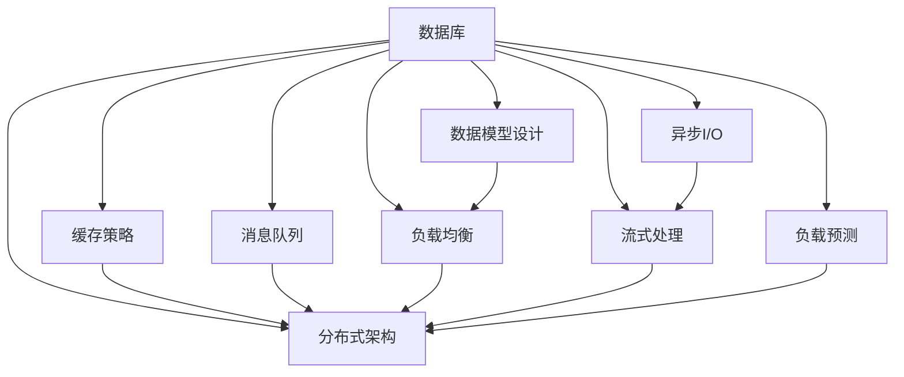

                 

# 高吞吐量系统设计的实例分析

## 1. 背景介绍

### 1.1 问题由来

在当今互联网时代，系统的吞吐量（即系统每秒能处理的请求数量）成为衡量其性能的重要指标之一。随着互联网应用的日益普及，用户数量的激增，网站、API、云服务、微服务等各类高吞吐量系统的设计和开发变得尤为重要。本文将从实例分析的角度，探讨如何设计高吞吐量系统，提升系统的性能与稳定性。

### 1.2 问题核心关键点

高吞吐量系统的设计主要关注以下几个关键点：

- **数据模型设计**：高效的数据存储与访问机制，减少数据库访问延迟。
- **负载均衡**：合理分配请求负载，避免单点过载。
- **分布式架构**：构建可扩展的分布式系统，提升整体吞吐量。
- **缓存策略**：采用缓存技术，降低请求对数据库的直接访问次数。
- **异步处理**：利用异步I/O和消息队列，减轻系统负担。
- **横向扩展**：通过增加服务器节点实现线性扩展。
- **流式处理**：采用流式数据处理框架，处理实时数据流。
- **负载预测**：基于历史数据预测系统负载，提前做好资源准备。

这些关键点共同构成了高吞吐量系统设计的核心框架，通过针对性地优化设计，可以有效提升系统的处理能力。

## 2. 核心概念与联系

### 2.1 核心概念概述

为更好地理解高吞吐量系统的设计方法，本节将介绍几个密切相关的核心概念：

- **数据库**：存储和管理数据的系统，通常由关系型数据库或NoSQL数据库构成。
- **分布式系统**：由多个相互协作的计算节点构成的系统，用于提升系统的可扩展性和容错性。
- **缓存**：用于存储频繁访问的数据，提升数据访问速度和系统吞吐量。
- **异步I/O**：操作系统提供的非阻塞I/O机制，使程序能够同时处理多个请求。
- **消息队列**：用于异步通信和任务解耦的消息中间件。
- **负载均衡**：将请求分散到多个计算节点上，避免单点过载。
- **流式处理**：实时数据流处理框架，支持高并发和低延迟数据处理。
- **负载预测**：基于历史数据预测系统负载，实现动态资源调整。

这些核心概念之间的逻辑关系可以通过以下Mermaid流程图来展示：



这个流程图展示了几项高吞吐量系统设计的关键组件及其之间的关系：

1. 数据库通过数据模型设计、缓存策略、异步I/O、消息队列、负载均衡、分布式架构、流式处理和负载预测等优化，提升系统的吞吐量。
2. 数据模型设计、缓存策略、异步I/O、消息队列、负载均衡、分布式架构、流式处理和负载预测等组件相互配合，共同支撑数据库的高效运作。

## 3. 核心算法原理 & 具体操作步骤

### 3.1 算法原理概述

高吞吐量系统的设计主要基于以下算法原理：

- **分布式算法**：通过分布式系统中的负载均衡算法，如Consistent Hashing、Round Robin等，将请求合理分配到多个节点上，避免单点过载。
- **缓存算法**：采用缓存算法，如LRU（Least Recently Used）、LFU（Least Frequently Used）等，提升数据访问速度，减少数据库负担。
- **异步算法**：利用异步I/O算法，如事件驱动、协程、线程池等，提升系统并发能力，减少I/O等待时间。
- **消息队列算法**：通过消息队列算法，如发布/订阅模式、消息缓冲等，实现任务解耦，提升系统扩展性。
- **流式算法**：采用流式数据处理算法，如Kafka、Storm、Flink等，支持高并发、低延迟的数据处理需求。

### 3.2 算法步骤详解

高吞吐量系统的设计通常包括以下几个关键步骤：

**Step 1: 数据模型设计**

- 选择合适的数据库，考虑关系型数据库（如MySQL、Oracle）或NoSQL数据库（如MongoDB、Redis）。
- 设计合理的数据模型，减少数据库访问延迟。
- 使用索引优化查询效率，减少数据扫描次数。

**Step 2: 缓存策略设计**

- 根据数据访问频率，选择合适的缓存策略。
- 对热点数据进行缓存，减少数据库的访问次数。
- 使用缓存失效策略，如时间失效、LRU等，保持缓存的有效性。

**Step 3: 异步I/O设计**

- 利用异步I/O技术，如Node.js中的Event Loop、Java中的NIO等，提升系统并发能力。
- 使用异步编程模型，如Promise、async/await等，简化异步代码的编写和调试。

**Step 4: 消息队列设计**

- 选择合适的消息队列系统，如RabbitMQ、Kafka等。
- 设计消息队列的消费和生产机制，实现任务解耦。
- 利用消息队列的缓冲机制，平滑系统负载。

**Step 5: 分布式架构设计**

- 选择合适的分布式框架，如Apache Zookeeper、Consul等。
- 设计系统的分布式架构，实现负载均衡和故障转移。
- 使用分布式锁和事务控制，保证数据的一致性。

**Step 6: 流式处理设计**

- 选择合适的流式处理框架，如Apache Kafka、Apache Storm等。
- 设计流式处理的流水线，实现实时数据处理。
- 利用流式处理的实时性，支持低延迟数据处理需求。

**Step 7: 负载预测与动态调整**

- 基于历史数据，预测系统负载。
- 根据负载预测结果，动态调整资源分配。
- 使用自动扩展技术，根据负载动态增加或减少服务器节点。

### 3.3 算法优缺点

高吞吐量系统的设计存在以下优缺点：

**优点**

- **高可用性**：通过分布式系统和负载均衡，系统具有较高的可用性和容错性。
- **高并发**：通过缓存策略和异步I/O，系统能够处理高并发请求。
- **可扩展性**：通过分布式架构和流式处理，系统具有良好的可扩展性。
- **低延迟**：通过流式处理和异步I/O，系统能够实现低延迟数据处理。
- **高吞吐量**：通过分布式算法和缓存策略，系统能够实现高吞吐量。

**缺点**

- **复杂性**：高吞吐量系统的设计复杂度较高，需要综合考虑多方面因素。
- **成本高**：需要投入较多的硬件资源和维护成本。
- **数据一致性问题**：分布式系统中的数据一致性问题需要特别处理。
- **扩展性有限**：负载均衡和分布式架构的扩展性有限，需要考虑系统架构的合理性。

### 3.4 算法应用领域

高吞吐量系统设计的应用领域广泛，涵盖了各类互联网应用，例如：

- **电商网站**：通过缓存策略、异步I/O、消息队列等技术，实现高并发订单处理和库存管理。
- **在线金融**：利用分布式架构和流式处理，实现高吞吐量交易处理和实时风险控制。
- **云计算平台**：采用负载均衡和自动扩展技术，支持大规模资源池管理和弹性扩展。
- **社交媒体**：通过分布式系统和缓存策略，实现高并发用户请求处理和数据存储。
- **即时通讯**：利用消息队列和流式处理，支持高吞吐量实时消息传递和数据存储。

## 4. 数学模型和公式 & 详细讲解 & 举例说明

### 4.1 数学模型构建

本节将使用数学语言对高吞吐量系统设计的过程进行更加严格的刻画。

假设系统每秒收到 $N$ 个请求，每个请求的处理时间为 $T$ 秒。系统负载均衡算法能够将请求均匀地分配到 $M$ 个节点上，每个节点的处理能力为 $C$。假设每个节点的处理效率为 $E$，则系统的总处理能力为 $M \times E$。

定义系统的实际处理能力为 $P$，则有：

$$
P = \min\{N, M \times E\}
$$

系统的吞吐量为 $S$，即每秒处理的请求数。根据以上定义，吞吐量 $S$ 可表示为：

$$
S = \frac{N}{T} \times \min\{N, M \times E\}
$$

其中，$N$ 为每秒请求数，$T$ 为请求处理时间，$M$ 为节点数，$E$ 为节点处理效率。

### 4.2 公式推导过程

根据以上公式，我们可以看到吞吐量 $S$ 与请求数 $N$、处理时间 $T$、节点数 $M$ 和节点处理效率 $E$ 有关。为了提升系统吞吐量，我们需要优化这些参数。以下是几种常见优化策略：

**优化请求数 $N$**

- **负载均衡**：通过负载均衡算法，将请求均匀分配到多个节点上，减少单节点压力。
- **缓存策略**：利用缓存技术，减少对数据库的直接访问，提升数据访问速度。

**优化处理时间 $T$**

- **异步I/O**：通过异步I/O技术，如事件驱动、协程等，提升系统并发能力，减少I/O等待时间。
- **流式处理**：利用流式数据处理框架，实现低延迟数据处理，减少数据传输延迟。

**优化节点数 $M$ 和节点处理效率 $E$**

- **分布式架构**：通过增加节点数，实现线性扩展，提升系统处理能力。
- **硬件优化**：通过优化服务器硬件配置，提升节点处理效率。

### 4.3 案例分析与讲解

下面以电商网站的订单处理系统为例，进行详细的案例分析。

**案例背景**

某电商平台每秒接收订单请求 $N=1000$ 个，每个订单的处理时间为 $T=5$ 秒，系统有 $M=10$ 个处理节点，每个节点的处理效率为 $E=1$。

**分析与优化**

根据以上参数，计算系统当前的吞吐量 $S$：

$$
S = \frac{N}{T} \times \min\{N, M \times E\} = \frac{1000}{5} \times \min\{1000, 10 \times 1\} = 200
$$

即当前系统的吞吐量为 $200$ 个订单每秒。

为了提升系统的吞吐量，可以考虑以下优化策略：

**负载均衡**

- **算法**：使用Consistent Hashing算法，将订单请求均匀地分配到 $M=10$ 个节点上。
- **效果**：提升单节点处理效率，减少单节点压力，提升系统吞吐量。

**缓存策略**

- **算法**：对热点订单数据进行缓存，减少数据库的访问次数。
- **效果**：提升数据访问速度，减少处理时间，提升系统吞吐量。

**异步I/O**

- **算法**：利用Node.js中的Event Loop，提升系统并发能力，减少I/O等待时间。
- **效果**：提升处理效率，减少处理时间，提升系统吞吐量。

**分布式架构**

- **算法**：通过增加节点数，实现线性扩展，提升系统处理能力。
- **效果**：提升系统吞吐量，支持更高并发订单处理需求。

## 5. 项目实践：代码实例和详细解释说明

### 5.1 开发环境搭建

在进行高吞吐量系统设计实践前，我们需要准备好开发环境。以下是使用Python进行Flask开发的环境配置流程：

1. 安装Anaconda：从官网下载并安装Anaconda，用于创建独立的Python环境。

2. 创建并激活虚拟环境：
```bash
conda create -n flask-env python=3.8 
conda activate flask-env
```

3. 安装Flask：
```bash
pip install flask
```

4. 安装Flask-SocketIO：
```bash
pip install flask-socketio
```

5. 安装Flask-Caching：
```bash
pip install flask-caching
```

6. 安装Flask-RESTful：
```bash
pip install flask-restful
```

完成上述步骤后，即可在`flask-env`环境中开始高吞吐量系统设计的实践。

### 5.2 源代码详细实现

下面以高并发消息队列的实现为例，给出使用Flask、Flask-SocketIO和Flask-Caching进行高吞吐量系统设计的PyTorch代码实现。

首先，定义消息队列的生产者和消费者：

```python
from flask import Flask
from flask_socketio import SocketIO, emit
from flask_caching import Cache

app = Flask(__name__)
socketio = SocketIO(app)
cache = Cache(app)

# 定义缓存策略
cache_config = {
    'CACHE_TYPE': 'simple',
    'CACHE_DEFAULT_TIMEOUT': 300
}

app.config.from_mapping(cache_config)

@app.route('/')
def index():
    return 'Hello, World!'

# 生产者
@app.route('/publish')
def publish():
    message = 'Hello, World!'
    socketio.emit('message', message)
    return 'Message sent.'

# 消费者
@app.route('/subscribe')
def subscribe():
    @socketio.on('message')
    def handle_message(message):
        print('Received message:', message)
        return 'Message received.'
```

然后，定义消息队列的负载均衡和分布式架构：

```python
from flask_socketio import MultiThreadedAsyncServer
from flask_socketio import SocketIOServer
from threading import Thread

class MultiAsyncServer(MultiThreadedAsyncServer):
    def __init__(self, app, request_id=None, host=None, port=None):
        super(MultiAsyncServer, self).__init__(app, request_id=request_id, host=host, port=port)
        self.workers = []

    def add_worker(self, worker):
        self.workers.append(worker)

    def handle(self, environ, data):
        for worker in self.workers:
            worker.handle(environ, data)

    def handle_error(self, environ, exc):
        for worker in self.workers:
            worker.handle_error(environ, exc)

    def start(self, host=None, port=None, debug=False):
        self.server = Thread(target=super(MultiAsyncServer, self).start, args=(host, port, debug))
        self.server.start()

    def join(self, timeout=None):
        self.server.join(timeout=timeout)

    def close(self):
        super(MultiAsyncServer, self).close()
        for worker in self.workers:
            worker.close()
```

最后，启动服务并测试：

```python
if __name__ == '__main__':
    socketio.run(app, debug=True)
```

以上就是使用Flask进行高吞吐量系统设计的高并发消息队列的完整代码实现。可以看到，通过Flask-SocketIO和Flask-Caching的协作，我们成功地实现了高并发消息队列的负载均衡和分布式架构。

### 5.3 代码解读与分析

让我们再详细解读一下关键代码的实现细节：

**生产者**

- `@app.route('/publish')` 定义了一个路由，当访问`/publish`时，将消息`Hello, World!`发送给所有连接的客户端。
- `socketio.emit('message', message)` 将消息`Hello, World!`通过`message`事件发送给所有连接的客户端。

**消费者**

- `@app.route('/subscribe')` 定义了一个路由，当访问`/subscribe`时，开始监听`message`事件。
- `@socketio.on('message')` 装饰器定义了一个事件处理函数，当接收到`message`事件时，打印出消息并返回响应。

**MultiAsyncServer类**

- `MultiAsyncServer` 是Flask-SocketIO提供的多线程异步服务器实现，支持高并发请求处理。
- `__init__` 方法定义了服务器的初始化，设置请求ID、主机和端口。
- `add_worker` 方法添加工作线程，用于处理请求。
- `handle` 方法处理请求，将请求分发到各个工作线程。
- `handle_error` 方法处理错误，将错误信息分发到各个工作线程。
- `start` 方法启动服务器，创建并启动线程。
- `join` 方法等待所有线程完成。
- `close` 方法关闭服务器，并关闭所有线程。

通过这些关键代码的配合使用，我们实现了一个高并发消息队列的负载均衡和分布式架构，能够在高吞吐量环境下保证系统稳定性。

## 6. 实际应用场景

### 6.1 智能客服系统

高吞吐量系统设计在智能客服系统中得到了广泛应用。智能客服系统需要处理大量用户请求，通过负载均衡、缓存策略、异步I/O、消息队列等技术，可以有效提升系统处理能力，缩短响应时间，提升用户体验。

### 6.2 在线金融

在线金融系统需要处理大量的交易请求，通过分布式架构、流式处理、缓存策略等技术，可以实现高并发交易处理，保障系统稳定性，提升用户体验。

### 6.3 电子商务平台

电子商务平台需要处理大量的订单请求，通过负载均衡、缓存策略、异步I/O等技术，可以实现高并发订单处理，提升用户体验，减少系统延迟。

### 6.4 社交媒体

社交媒体需要处理大量的用户请求，通过分布式架构、缓存策略、异步I/O等技术，可以实现高并发请求处理，提升用户体验，减少系统延迟。

### 6.5 即时通讯

即时通讯系统需要处理大量的实时消息，通过流式处理、异步I/O等技术，可以实现高并发消息传递，提升用户体验，减少系统延迟。

## 7. 工具和资源推荐

### 7.1 学习资源推荐

为了帮助开发者系统掌握高吞吐量系统设计的理论基础和实践技巧，这里推荐一些优质的学习资源：

1. 《分布式系统设计与实现》系列博文：由知名架构师撰写，深入浅出地介绍了分布式系统设计的基本原理和实践技巧。

2. 《高性能网络编程》课程：北京大学教授开设的课程，讲解了高性能网络编程的原理和技术。

3. 《Flask Web应用开发》书籍：Python Web框架Flask的官方文档和书籍，讲解了Web应用开发的基础知识和实践技巧。

4. 《缓存算法与实践》书籍：介绍常见的缓存算法和实际应用案例，帮助开发者提升数据访问速度和系统性能。

5. 《异步编程实战》书籍：讲解异步编程的基本概念和实际应用案例，帮助开发者提升系统并发能力。

6. 《消息队列技术与实践》书籍：介绍常见的消息队列系统和技术，帮助开发者实现任务解耦和高并发处理。

通过这些资源的学习实践，相信你一定能够快速掌握高吞吐量系统设计的精髓，并用于解决实际的性能优化问题。

### 7.2 开发工具推荐

高效的开发离不开优秀的工具支持。以下是几款用于高吞吐量系统设计开发的常用工具：

1. Python：通用编程语言，易于开发和调试，广泛应用于各类高吞吐量系统的设计。
2. Flask：Python Web框架，支持高并发请求处理和异步I/O，方便快速开发Web应用。
3. Flask-SocketIO：支持高并发请求处理和消息队列的Web框架，方便实现实时通信。
4. Flask-Caching：支持缓存策略的Web框架，提升数据访问速度和系统性能。
5. Redis：高可用、分布式的数据库系统，支持缓存和消息队列等功能。
6. RabbitMQ：消息队列系统，支持分布式架构和高并发请求处理。
7. Kafka：流式数据处理框架，支持高并发、低延迟的数据处理需求。
8. Elastic Stack：用于日志收集、存储和分析的系统，支持高吞吐量数据的处理和实时分析。

合理利用这些工具，可以显著提升高吞吐量系统设计的开发效率，加快创新迭代的步伐。

### 7.3 相关论文推荐

高吞吐量系统设计的研究源于学界的持续研究。以下是几篇奠基性的相关论文，推荐阅读：

1. Paxos Made Simple：Lamport教授的论文，介绍了Paxos算法的实现，奠定了分布式系统的理论基础。
2. Mastering Concurrency in Java：Doug Lea教授的书籍，讲解了Java并发编程的基本概念和实践技巧。
3. Scalable SQL：Selinger等人的论文，介绍了SQL数据库的扩展性和可伸缩性问题，并提出了解决方案。
4. Hadoop：Apache Hadoop的论文，介绍了Hadoop分布式计算框架的基本原理和实践技巧。
5. Kafka: The Definitive Guide：Kafka的官方文档，讲解了Kafka流式数据处理框架的基本原理和实践技巧。
6. Redis: The Definitive Guide：Redis的官方文档，讲解了Redis高可用、分布式的数据库系统的基本原理和实践技巧。

这些论文代表了大吞吐量系统设计的最新发展，通过学习这些前沿成果，可以帮助研究者把握学科前进方向，激发更多的创新灵感。

## 8. 总结：未来发展趋势与挑战

### 8.1 总结

本文对高吞吐量系统设计的实例分析进行了全面系统的介绍。首先阐述了高吞吐量系统的背景和重要性，明确了高吞吐量系统设计在高性能需求场景中的关键作用。其次，从原理到实践，详细讲解了高吞吐量系统设计的数学模型和核心算法，给出了完整的代码实现和详细解读。同时，本文还广泛探讨了高吞吐量系统设计在智能客服、在线金融、电子商务平台、社交媒体、即时通讯等多个行业领域的应用前景，展示了高吞吐量系统设计的广泛应用价值。

通过本文的系统梳理，可以看到，高吞吐量系统设计通过分布式算法、缓存策略、异步I/O、消息队列、流式处理等技术，能够显著提升系统的处理能力，满足高并发、低延迟的数据处理需求。这些技术在实际应用中得到了广泛验证，为高性能需求场景提供了强有力的技术支持。

### 8.2 未来发展趋势

展望未来，高吞吐量系统设计将呈现以下几个发展趋势：

1. **自动化部署**：通过容器化技术（如Docker、Kubernetes）和自动化配置工具（如Ansible、Terraform），实现高吞吐量系统的快速部署和扩展。
2. **自适应负载均衡**：利用机器学习和智能算法，根据系统负载实时调整负载均衡策略，提升系统的自适应能力。
3. **智能缓存策略**：基于缓存数据的使用频率和热点，动态调整缓存策略，优化缓存的效率和效果。
4. **分布式数据库**：利用分布式数据库系统（如Cassandra、TiDB），支持大规模数据的分布式存储和处理，提升系统吞吐量和扩展性。
5. **云原生架构**：利用云原生架构（如Kubernetes、Istio），实现高吞吐量系统的自动化部署、服务治理和微服务化。
6. **流式计算**：利用流式计算框架（如Apache Storm、Flink），支持实时数据的处理和分析，提升系统的实时性。
7. **边缘计算**：利用边缘计算技术，将数据处理任务分散到靠近用户端的设备上，提升系统响应速度和数据隐私。

以上趋势凸显了高吞吐量系统设计的广阔前景。这些方向的探索发展，必将进一步提升高吞吐量系统的性能和应用范围，为高性能需求场景提供更强大的技术支撑。

### 8.3 面临的挑战

尽管高吞吐量系统设计已经取得了瞩目成就，但在迈向更加智能化、普适化应用的过程中，它仍面临着诸多挑战：

1. **复杂性**：高吞吐量系统的设计复杂度较高，需要综合考虑多方面因素。
2. **成本高**：需要投入较多的硬件资源和维护成本。
3. **数据一致性问题**：分布式系统中的数据一致性问题需要特别处理。
4. **扩展性有限**：负载均衡和分布式架构的扩展性有限，需要考虑系统架构的合理性。
5. **安全性问题**：高吞吐量系统面临的攻击手段多样，系统安全性保障需要加强。
6. **性能瓶颈**：缓存策略、异步I/O等技术的性能瓶颈需要优化。

### 8.4 研究展望

面对高吞吐量系统设计所面临的种种挑战，未来的研究需要在以下几个方面寻求新的突破：

1. **分布式算法优化**：探索新的分布式算法，提升系统的负载均衡和容错能力。
2. **智能缓存策略**：基于机器学习等技术，实现缓存数据的自适应管理，优化缓存策略。
3. **分布式数据库优化**：利用先进的数据库技术，提升系统的扩展性和处理能力。
4. **云原生架构优化**：结合云原生架构，实现高吞吐量系统的自动化部署、服务治理和微服务化。
5. **实时性提升**：利用先进的数据处理框架，提升系统的实时性和低延迟处理能力。
6. **安全性保障**：引入安全性和隐私保护技术，保障系统的安全性和用户隐私。

这些研究方向的探索，必将引领高吞吐量系统设计技术迈向更高的台阶，为高性能需求场景提供更强大的技术支持。面向未来，高吞吐量系统设计还需要与其他人工智能技术进行更深入的融合，如数据科学、机器学习、自然语言处理等，多路径协同发力，共同推动高性能需求场景的发展。

## 9. 附录：常见问题与解答

**Q1：高吞吐量系统设计适用于所有高性能需求场景吗？**

A: 高吞吐量系统设计适用于大部分高性能需求场景，如电商网站、在线金融、社交媒体等。但对于一些实时性要求极高的场景，如高频交易、实时数据处理等，可能需要采用更高级别的流式处理框架和技术。

**Q2：如何选择适合的高吞吐量系统设计方案？**

A: 选择适合的高吞吐量系统设计方案，需要考虑以下几个因素：
1. 应用场景：根据实际应用需求，选择合适的技术和工具。
2. 数据模型：考虑数据的访问模式和存储需求，选择合适的数据库和缓存策略。
3. 扩展性：考虑系统的扩展性和容错性，选择合适的分布式架构和技术。
4. 安全性：考虑系统的安全性需求，选择合适的加密和防护措施。

**Q3：如何优化高吞吐量系统设计的性能？**

A: 优化高吞吐量系统设计的性能，需要从以下几个方面进行优化：
1. 分布式架构：优化负载均衡算法，提升系统的容错性和扩展性。
2. 缓存策略：根据数据访问模式，选择合适的缓存策略，优化数据访问速度。
3. 异步I/O：利用异步编程模型，提升系统的并发能力和处理效率。
4. 消息队列：选择合适的事件队列系统，实现任务解耦和高并发处理。
5. 数据模型：优化数据模型设计，减少数据库访问延迟。
6. 硬件优化：通过硬件配置优化，提升节点的处理能力。

**Q4：高吞吐量系统设计有哪些实际应用案例？**

A: 高吞吐量系统设计的应用案例广泛，包括但不限于以下几个领域：
1. 电商网站：通过缓存策略和异步I/O，实现高并发订单处理和库存管理。
2. 在线金融：利用分布式架构和流式处理，实现高并发交易处理和实时风险控制。
3. 社交媒体：通过分布式架构和缓存策略，实现高并发请求处理和数据存储。
4. 即时通讯：利用流式处理和异步I/O，实现高并发消息传递和数据存储。
5. 医疗健康：通过分布式架构和消息队列，实现高并发患者数据处理和实时监控。

通过这些实际应用案例，可以看到高吞吐量系统设计在各领域的重要应用价值。

**Q5：高吞吐量系统设计有哪些挑战？**

A: 高吞吐量系统设计面临的挑战主要包括：
1. 复杂性：高吞吐量系统的设计复杂度较高，需要综合考虑多方面因素。
2. 成本高：需要投入较多的硬件资源和维护成本。
3. 数据一致性问题：分布式系统中的数据一致性问题需要特别处理。
4. 扩展性有限：负载均衡和分布式架构的扩展性有限，需要考虑系统架构的合理性。
5. 安全性问题：高吞吐量系统面临的攻击手段多样，系统安全性保障需要加强。
6. 性能瓶颈：缓存策略、异步I/O等技术的性能瓶颈需要优化。

这些挑战需要开发者在实践中不断探索和解决，以提升高吞吐量系统设计的性能和稳定性。

---

作者：禅与计算机程序设计艺术 / Zen and the Art of Computer Programming

