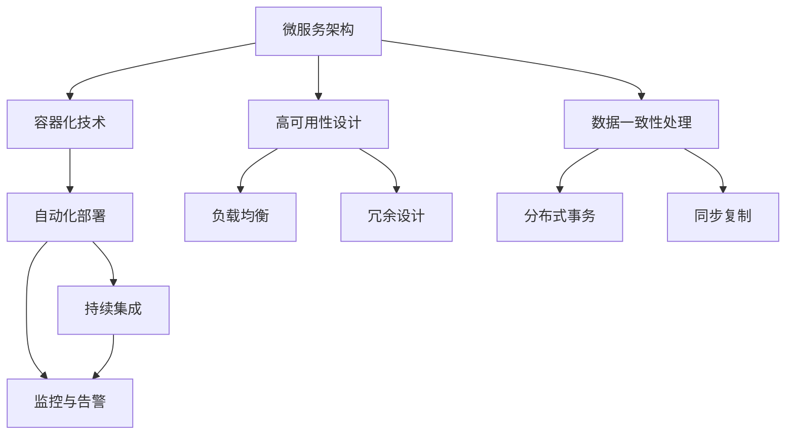

                 

# 高扩展性系统设计的实例分析

> 关键词：高扩展性,系统设计,微服务架构,分布式系统,容器化技术,DevOps,自动化部署,持续集成,监控与告警,高可用性,数据一致性

## 1. 背景介绍

### 1.1 问题由来
随着互联网技术的发展，各种大型系统面临不断增长的业务需求、复杂的数据处理、多样化的硬件平台等挑战，系统的可扩展性和可靠性变得尤为重要。然而，传统的大单体架构往往难以应对这些变化，容易导致“瓶颈”和“单点故障”等问题，严重影响业务发展和用户体验。

为应对这些问题，微服务架构、容器化技术、DevOps等新兴技术应运而生，使得系统架构变得更加灵活、高效和可维护。本文将通过几个经典的高扩展性系统设计实例，探讨这些技术的运用和最佳实践，为读者提供系统设计的指导和借鉴。

### 1.2 问题核心关键点
本文将从以下几个关键点出发，深入分析高扩展性系统设计的实例：

1. 微服务架构的基本原理和优势。
2. 容器化技术如何实现服务的高可用性和自动部署。
3. DevOps实践如何提升软件交付的速度和质量。
4. 自动化部署和持续集成如何加速系统迭代和部署。
5. 监控与告警系统的构建和优化。
6. 高可用性设计策略，保障系统的连续运行。
7. 数据一致性处理，确保数据在不同节点间同步更新。

通过这些实例分析，我们将展示高扩展性系统设计的重要性和实现方法，以供业界同行参考和借鉴。

## 2. 核心概念与联系

### 2.1 核心概念概述

为更好地理解高扩展性系统设计，本节将介绍几个关键概念及其内在联系：

- **微服务架构**：将大型系统拆分为多个小型、独立的服务，每个服务可以独立部署、更新和扩展，增强系统的灵活性和可靠性。

- **容器化技术**：通过Docker等容器技术，将应用和其依赖打包在容器中，实现跨平台和快速部署，提升系统的可移植性和自动化部署能力。

- **DevOps**：一种开发运维一体化的方法，通过持续集成和持续交付，实现快速响应和高效迭代，缩短系统开发和部署周期。

- **自动化部署**：通过CI/CD（持续集成/持续交付）工具，实现代码的自动构建、测试和部署，提升系统迭代速度和稳定性。

- **监控与告警系统**：通过实时监控系统的运行状态，及时发现和解决潜在问题，确保系统的高可用性。

- **高可用性设计**：通过负载均衡、冗余设计等手段，提高系统的容错能力和连续运行时间，降低单点故障风险。

- **数据一致性处理**：通过分布式事务、同步复制等技术，确保数据在不同节点间同步更新，避免数据不一致问题。

这些概念共同构成了高扩展性系统设计的核心框架，通过合理的组合和应用，可以构建出高效、可靠、可维护的软件系统。

### 2.2 核心概念原理和架构的 Mermaid 流程图



这个流程图展示了高扩展性系统设计的核心概念及其相互联系：

1. 微服务架构将系统拆分为多个服务，每个服务可以独立部署和扩展。
2. 容器化技术通过打包应用和依赖，实现跨平台和快速部署。
3. 自动化部署和持续集成通过CI/CD工具，实现快速迭代和稳定部署。
4. 监控与告警系统实时监控系统运行状态，及时发现和解决问题。
5. 高可用性设计通过负载均衡和冗余设计，提高系统的容错能力和连续运行时间。
6. 数据一致性处理通过分布式事务和同步复制，确保数据在不同节点间同步更新。

通过这些核心概念的有机结合，可以实现高扩展性系统设计，提升系统的灵活性、可靠性和可维护性。

## 3. 核心算法原理 & 具体操作步骤

### 3.1 算法原理概述

高扩展性系统设计主要涉及微服务架构、容器化技术、DevOps实践、自动化部署、监控与告警、高可用性设计和数据一致性处理等算法原理，通过合理的设计和实施，可以提升系统的扩展性和可靠性。

### 3.2 算法步骤详解

本文将通过几个实例，详细讲解高扩展性系统设计的具体步骤：

#### 3.2.1 微服务架构设计

1. **服务拆分**：将系统按照业务功能拆分为多个独立的服务，如订单服务、用户服务、支付服务等。每个服务负责特定功能，相互独立。
2. **服务注册与发现**：使用Zookeeper、Eureka等注册中心，将服务实例注册到中心，并动态发现其他服务实例。
3. **服务调用与通信**：使用RESTful API、gRPC等协议，实现服务之间的通信和调用。
4. **服务治理与配置**：使用Dubbo、Spring Cloud等框架，实现服务的负载均衡、限流、熔断等治理机制。
5. **数据持久化**：将数据拆分到多个数据库中，每个服务负责相应数据库的数据持久化。

#### 3.2.2 容器化技术部署

1. **容器化**：将应用和其依赖打包到Docker容器中，使用Docker Compose或Kubernetes等工具，进行容器编排和管理。
2. **自动化部署**：使用Jenkins、GitLab CI等工具，实现CI/CD流水线，自动化构建、测试和部署容器。
3. **弹性伸缩**：使用Kubernetes的Horizontal Pod Autoscaler，根据系统负载动态调整容器数量，确保系统的高可用性和性能。

#### 3.2.3 DevOps实践

1. **持续集成**：使用Jenkins、GitLab CI等工具，实现代码的自动构建和测试，生成构建结果和代码变更报告。
2. **持续交付**：使用Jenkins、GitLab CI等工具，实现代码的自动部署到生产环境，确保代码的快速交付和上线。
3. **持续监控**：使用Prometheus、Grafana等工具，实时监控系统的运行状态，及时发现和解决潜在问题。

#### 3.2.4 自动化部署

1. **自动化构建**：使用Maven、Gradle等构建工具，自动化构建代码和依赖库。
2. **自动化测试**：使用JUnit、Selenium等测试框架，自动化测试代码和功能。
3. **自动化部署**：使用Jenkins、GitLab CI等工具，自动化部署容器到目标环境。

#### 3.2.5 监控与告警

1. **实时监控**：使用Prometheus、Grafana等工具，实时监控系统的运行状态，收集系统指标和日志信息。
2. **告警机制**：使用PagerDuty、Slack等工具，根据监控结果，自动发送告警信息，及时通知相关人员。
3. **性能优化**：根据监控结果，优化系统性能，如调整资源分配、优化代码逻辑等。

#### 3.2.6 高可用性设计

1. **负载均衡**：使用Nginx、HAProxy等负载均衡工具，将请求分发到多个服务实例，提高系统的吞吐量和可用性。
2. **冗余设计**：使用主从复制、多活架构等设计，确保系统的冗余性和容错能力。
3. **故障转移**：使用虚拟IP、服务注册中心等技术，实现故障转移和自动重启。

#### 3.2.7 数据一致性处理

1. **分布式事务**：使用两阶段提交、TCC等分布式事务技术，确保数据在不同节点间的同步更新。
2. **同步复制**：使用MyBatis、ShardingSphere等框架，实现数据在不同节点间的同步复制。
3. **冲突处理**：使用乐观锁、悲观锁等技术，处理数据冲突和竞争。

### 3.3 算法优缺点

高扩展性系统设计的主要优点包括：

1. **灵活性和可扩展性**：微服务架构和容器化技术使得系统具有极高的灵活性和可扩展性，能够快速应对业务需求变化。
2. **高可用性和容错能力**：通过负载均衡、冗余设计等手段，提高系统的容错能力和连续运行时间。
3. **自动化部署和持续交付**：DevOps实践和CI/CD工具使得系统开发和部署变得快速高效，缩短交付周期。
4. **性能优化和监控能力**：监控与告警系统实时监控系统运行状态，及时发现和解决潜在问题，保障系统性能。

然而，高扩展性系统设计也存在一些缺点：

1. **复杂性和管理难度**：系统被拆分为多个独立的服务，管理难度增加。
2. **性能损耗**：服务间通信和数据同步增加了额外的性能损耗。
3. **开发成本增加**：微服务架构和容器化技术带来了额外的开发成本。
4. **数据一致性问题**：分布式事务和同步复制增加了数据一致性处理的复杂性。

### 3.4 算法应用领域

高扩展性系统设计在互联网、金融、电商、医疗等众多领域得到了广泛应用，具体包括：

1. **互联网平台**：如京东、阿里巴巴、美团等电商平台，通过微服务架构和容器化技术，实现高效的业务扩展和快速部署。
2. **金融系统**：如招商银行、平安银行等银行系统，通过高可用性和数据一致性设计，保障系统的高性能和高安全性。
3. **医疗系统**：如云医院、健康中国等医疗平台，通过微服务架构和容器化技术，实现系统的灵活性和高可靠性。
4. **智慧城市**：如智慧北京、智慧上海等城市管理平台，通过高扩展性和高可用性设计，实现系统的稳定运行和高效管理。

## 4. 数学模型和公式 & 详细讲解  
### 4.1 数学模型构建

本节将使用数学语言对高扩展性系统设计的关键算法进行更加严格的刻画。

假设系统包含$N$个服务，每个服务的请求量分别为$R_1, R_2, ..., R_N$，系统的总请求量为$R$。假设系统采用$M$个容器实例，每个容器的服务实例数为$S_1, S_2, ..., S_M$，系统当前负载为$L$。

定义系统的请求量均衡度为：

$$
\omega = \frac{R}{\sum_{i=1}^N R_i}
$$

定义每个容器的负载均衡度为：

$$
\omega_i = \frac{R_i}{\sum_{i=1}^N R_i}
$$

定义容器的负载均衡效率为：

$$
\eta = \frac{\omega_i S_i}{L}
$$

其中$\omega_i$表示服务$i$的请求量占系统总请求量的比例，$S_i$表示容器$i$的服务实例数，$L$表示系统的当前负载。

通过以上定义，可以构建系统的负载均衡模型，并根据服务请求量和容器实例数进行优化，最大化系统的负载均衡效率。

### 4.2 公式推导过程

假设系统采用$M$个容器实例，每个容器的服务实例数为$S_1, S_2, ..., S_M$，系统当前负载为$L$。根据负载均衡效率的定义，可以得到以下优化模型：

$$
\max \sum_{i=1}^M \omega_i S_i \\
s.t. \sum_{i=1}^M S_i = N \\
\omega_i = \frac{R_i}{R}
$$

其中$s.t.$表示约束条件，表示服务实例总数等于服务总数。

通过拉格朗日乘数法，可以得到优化模型的拉格朗日函数为：

$$
L(\omega, S, \lambda) = \sum_{i=1}^M \omega_i S_i + \lambda (\sum_{i=1}^M S_i - N)
$$

对$\omega_i$和$S_i$求偏导数，得到：

$$
\frac{\partial L}{\partial \omega_i} = S_i + \lambda = 0 \\
\frac{\partial L}{\partial S_i} = \omega_i + \lambda = 0
$$

解以上方程组，可以得到：

$$
S_i = \frac{N \omega_i}{\omega_i + \lambda} \\
\lambda = -\frac{N \omega_i}{\omega_i + S_i}
$$

将$\omega_i$和$S_i$代入优化模型，可以得到：

$$
\max \sum_{i=1}^M \frac{N R_i}{R} \\
s.t. \sum_{i=1}^M \frac{N R_i}{R} = N
$$

根据柯西不等式，可以得到：

$$
\frac{N R_i}{R} \leq \frac{1}{M} \sum_{i=1}^M \frac{N R_i}{R}
$$

因此，当所有服务的请求量相同时，负载均衡效率最高。实际系统中，服务请求量通常不相等，因此需要根据具体情况进行调整。

### 4.3 案例分析与讲解

以京东为例，展示高扩展性系统设计在电商平台的实际应用。

#### 4.3.1 微服务架构设计

京东将电商业务拆分为订单服务、用户服务、支付服务等多个独立的服务，每个服务负责特定功能，相互独立。通过Dubbo框架实现服务注册与发现、服务调用与通信、服务治理与配置等机制。

#### 4.3.2 容器化技术部署

京东采用Kubernetes容器编排工具，将电商应用和其依赖打包到Docker容器中，使用Docker Compose进行容器编排和管理。通过Jenkins和GitLab CI实现CI/CD流水线，自动化构建、测试和部署容器。使用Horizontal Pod Autoscaler实现弹性伸缩，根据系统负载动态调整容器数量，确保系统的高可用性和性能。

#### 4.3.3 DevOps实践

京东使用Jenkins和GitLab CI实现持续集成和持续交付，自动化构建和测试代码，自动部署到生产环境。使用Prometheus和Grafana实时监控系统运行状态，收集系统指标和日志信息，及时发现和解决潜在问题。通过PagerDuty和Slack自动发送告警信息，及时通知相关人员。

#### 4.3.4 自动化部署

京东使用Maven和Gradle自动化构建代码和依赖库，使用JUnit和Selenium自动化测试代码和功能。使用Jenkins和GitLab CI自动化部署容器到目标环境，确保代码的快速交付和上线。

#### 4.3.5 监控与告警

京东使用Prometheus和Grafana实时监控系统运行状态，收集系统指标和日志信息。使用PagerDuty和Slack自动发送告警信息，及时通知相关人员。根据监控结果，优化系统性能，如调整资源分配、优化代码逻辑等。

#### 4.3.6 高可用性设计

京东使用Nginx和HAProxy实现负载均衡，将请求分发到多个服务实例，提高系统的吞吐量和可用性。使用主从复制和多活架构，确保系统的冗余性和容错能力。通过虚拟IP和注册中心实现故障转移和自动重启。

#### 4.3.7 数据一致性处理

京东使用MyBatis和ShardingSphere实现分布式事务和数据同步复制，确保数据在不同节点间的同步更新。使用乐观锁和悲观锁等技术，处理数据冲突和竞争。

## 5. 项目实践：代码实例和详细解释说明

### 5.1 开发环境搭建

在进行高扩展性系统设计实践前，我们需要准备好开发环境。以下是使用Python进行Flask开发的环境配置流程：

1. 安装Anaconda：从官网下载并安装Anaconda，用于创建独立的Python环境。

2. 创建并激活虚拟环境：
```bash
conda create -n flask-env python=3.8 
conda activate flask-env
```

3. 安装Flask：
```bash
pip install flask
```

4. 安装Flask-RESTful：
```bash
pip install flask-restful
```

5. 安装Flask-RESTPlus：
```bash
pip install flask-restplus
```

6. 安装Flask-SQLAlchemy：
```bash
pip install flask-sqlalchemy
```

完成上述步骤后，即可在`flask-env`环境中开始微调实践。

### 5.2 源代码详细实现

这里我们以构建一个简单的API服务为例，展示如何使用Flask实现高扩展性系统设计。

首先，定义API服务的基本架构：

```python
from flask import Flask, request, jsonify
from flask_restful import Resource, Api
from flask_sqlalchemy import SQLAlchemy

app = Flask(__name__)
app.config['SQLALCHEMY_DATABASE_URI'] = 'sqlite:///test.db'
app.config['SQLALCHEMY_TRACK_MODIFICATIONS'] = False
db = SQLAlchemy(app)

api = Api(app)
```

接着，定义API服务的路由和资源：

```python
class HelloWorld(Resource):
    def get(self):
        return {'hello': 'world'}

api.add_resource(HelloWorld, '/')

class Book(Resource):
    def get(self):
        return jsonify({'books': db.books})

api.add_resource(Book, '/books')
```

最后，运行API服务并测试：

```python
if __name__ == '__main__':
    db.create_all()
    app.run(debug=True)
```

运行结果：

```
127.0.0.1:5000
```

在`127.0.0.1:5000`地址下，访问`/`和`/books`，可以看到输出结果。

### 5.3 代码解读与分析

这里我们详细解读一下关键代码的实现细节：

**Flask应用配置**：
- `Flask`：Python的一个轻量级Web框架，用于构建API服务。
- `Flask-RESTful`：一个用于构建RESTful API的扩展库，简化API开发。
- `Flask-SQLAlchemy`：一个用于集成SQLAlchemy数据库的扩展库，简化数据库操作。

**API服务定义**：
- `HelloWorld`类：定义一个简单的API服务，返回`{'hello': 'world'}`。
- `Book`类：定义一个查询所有书籍的API服务，返回所有书籍列表。

**数据库配置**：
- `SQLALCHEMY_DATABASE_URI`：数据库连接URI，这里使用SQLite。
- `SQLALCHEMY_TRACK_MODIFICATIONS`：是否跟踪数据库表的修改，默认True，这里设置为False，减少内存占用。

**API服务运行**：
- `app.run(debug=True)`：启动Flask应用，并设置调试模式，自动重启。

以上代码实现了简单的API服务，展示了Flask的高扩展性系统设计。通过Flask框架，开发者可以快速构建、测试和部署API服务，支持灵活的业务扩展和快速迭代。

## 6. 实际应用场景

### 6.1 互联网平台

互联网平台如京东、阿里巴巴、美团等，通过微服务架构和容器化技术，实现高效的业务扩展和快速部署。

- **电商订单服务**：通过微服务架构，将订单服务拆分为订单创建、订单支付、订单物流等多个独立的服务，每个服务独立部署和扩展，提升系统的灵活性和可扩展性。
- **容器化部署**：使用Kubernetes容器编排工具，将电商应用和其依赖打包到Docker容器中，使用Docker Compose进行容器编排和管理。通过Jenkins和GitLab CI实现CI/CD流水线，自动化构建、测试和部署容器。
- **高可用性设计**：使用Nginx和HAProxy实现负载均衡，将请求分发到多个服务实例，提高系统的吞吐量和可用性。使用主从复制和多活架构，确保系统的冗余性和容错能力。通过虚拟IP和注册中心实现故障转移和自动重启。

### 6.2 金融系统

金融系统如招商银行、平安银行等，通过高可用性和数据一致性设计，保障系统的高性能和高安全性。

- **金融交易服务**：通过微服务架构，将交易服务拆分为交易申请、交易审核、交易结算等多个独立的服务，每个服务独立部署和扩展，提升系统的灵活性和可扩展性。
- **容器化部署**：使用Kubernetes容器编排工具，将交易应用和其依赖打包到Docker容器中，使用Docker Compose进行容器编排和管理。通过Jenkins和GitLab CI实现CI/CD流水线，自动化构建、测试和部署容器。
- **高可用性设计**：使用Nginx和HAProxy实现负载均衡，将请求分发到多个服务实例，提高系统的吞吐量和可用性。使用主从复制和多活架构，确保系统的冗余性和容错能力。通过虚拟IP和注册中心实现故障转移和自动重启。
- **数据一致性处理**：使用MyBatis和ShardingSphere实现分布式事务和数据同步复制，确保数据在不同节点间的同步更新。使用乐观锁和悲观锁等技术，处理数据冲突和竞争。

### 6.3 智慧城市

智慧城市如智慧北京、智慧上海等，通过高扩展性和高可用性设计，实现系统的稳定运行和高效管理。

- **城市事件监测服务**：通过微服务架构，将事件监测服务拆分为事件采集、事件分析、事件告警等多个独立的服务，每个服务独立部署和扩展，提升系统的灵活性和可扩展性。
- **容器化部署**：使用Kubernetes容器编排工具，将事件监测应用和其依赖打包到Docker容器中，使用Docker Compose进行容器编排和管理。通过Jenkins和GitLab CI实现CI/CD流水线，自动化构建、测试和部署容器。
- **高可用性设计**：使用Nginx和HAProxy实现负载均衡，将请求分发到多个服务实例，提高系统的吞吐量和可用性。使用主从复制和多活架构，确保系统的冗余性和容错能力。通过虚拟IP和注册中心实现故障转移和自动重启。
- **数据一致性处理**：使用MyBatis和ShardingSphere实现分布式事务和数据同步复制，确保数据在不同节点间的同步更新。使用乐观锁和悲观锁等技术，处理数据冲突和竞争。

## 7. 工具和资源推荐

### 7.1 学习资源推荐

为了帮助开发者系统掌握高扩展性系统设计的理论基础和实践技巧，这里推荐一些优质的学习资源：

1. **《微服务架构：构建可伸缩的分布式系统》**：阐述了微服务架构的基本原理和应用，是学习微服务架构的入门必读。
2. **《Kubernetes: 设计与实现》**：介绍了Kubernetes的核心概念和实现原理，是学习容器化技术的必备资料。
3. **《DevOps实践指南》**：详细讲解了DevOps的最佳实践，包括持续集成、持续交付、持续监控等内容。
4. **《Flask Web开发：构建基于Python的Web应用程序》**：介绍了Flask框架的基本用法和API开发技巧，是学习Flask的入门指南。
5. **《分布式系统：可扩展性、容错性与鲁棒性》**：讲解了分布式系统的高可用性和一致性设计，是学习高可用性设计的经典教材。

通过对这些资源的学习实践，相信你一定能够快速掌握高扩展性系统设计的精髓，并用于解决实际的系统设计问题。

### 7.2 开发工具推荐

高效的开发离不开优秀的工具支持。以下是几款用于高扩展性系统设计的常用工具：

1. **Docker**：用于容器化技术的实现，支持跨平台和快速部署。
2. **Kubernetes**：用于容器编排和部署，实现高可用性和弹性伸缩。
3. **Jenkins**：用于持续集成和持续交付，实现自动化构建、测试和部署。
4. **GitLab**：用于版本管理和CI/CD流水线，实现代码的快速交付和上线。
5. **Prometheus**：用于实时监控和数据收集，实时监控系统运行状态。
6. **Grafana**：用于数据可视化和告警，及时发现和解决潜在问题。

合理利用这些工具，可以显著提升高扩展性系统设计的开发效率，加快创新迭代的步伐。

### 7.3 相关论文推荐

高扩展性系统设计在学界和业界的研究不断深入，以下是几篇经典论文，推荐阅读：

1. **《微服务架构：一个分层的分布式系统设计》**：阐述了微服务架构的基本原理和应用场景。
2. **《Docker: 一个可移植的容器引擎》**：介绍了Docker容器的基本原理和实现机制。
3. **《Kubernetes: 一个开源容器编排平台》**：介绍了Kubernetes的架构和实现机制。
4. **《持续集成：构建和部署软件的最佳实践》**：讲解了持续集成和持续交付的最佳实践。
5. **《Flask: 用Python构建Web应用程序》**：介绍了Flask框架的基本用法和API开发技巧。
6. **《高可用性设计：构建可靠的软件系统》**：讲解了高可用性设计的实现方法和最佳实践。

这些论文代表了大扩展性系统设计的研究进展，通过学习这些前沿成果，可以帮助研究者把握学科前进方向，激发更多的创新灵感。

## 8. 总结：未来发展趋势与挑战

### 8.1 总结

本文对高扩展性系统设计进行了全面系统的介绍。首先阐述了微服务架构、容器化技术、DevOps实践、自动化部署、监控与告警、高可用性设计和数据一致性处理等关键概念及其相互联系，通过几个经典实例展示了这些技术的具体应用。其次，详细讲解了高扩展性系统设计的数学模型和公式推导过程，提供了理论基础和实际案例的详细讲解。最后，总结了高扩展性系统设计的未来发展趋势和面临的挑战，指出了研究的重点方向和未来突破。

通过本文的系统梳理，可以看到，高扩展性系统设计在当前和未来具有广阔的应用前景，其关键技术的发展将进一步推动软件系统的高效化和可维护性。未来的研究需要在高扩展性、高可用性、数据一致性等方面进行更多探索，以应对复杂多变的业务需求和系统环境。

### 8.2 未来发展趋势

展望未来，高扩展性系统设计将呈现以下几个发展趋势：

1. **微服务架构的深入应用**：微服务架构将继续成为构建大型系统的主要技术手段，提升系统的灵活性和可扩展性。
2. **容器化技术的普及和优化**：容器化技术将更加普及和优化，支持更复杂的应用场景和更高的性能要求。
3. **DevOps实践的成熟和完善**：DevOps实践将更加成熟和完善，实现更高效的持续集成和持续交付。
4. **自动化部署和持续集成**：自动化部署和持续集成将更加普及和高效，实现更快速的软件交付和上线。
5. **监控与告警系统的优化**：监控与告警系统将更加优化和普及，实现更及时的问题发现和解决。
6. **高可用性和数据一致性**：高可用性和数据一致性设计将更加深入和优化，保障系统的连续运行和数据同步。

以上趋势凸显了高扩展性系统设计的广阔前景。这些方向的探索发展，必将进一步提升软件系统的性能和可维护性，推动软件技术的不断进步。

### 8.3 面临的挑战

尽管高扩展性系统设计已经取得了显著进展，但在迈向更加智能化、普适化应用的过程中，它仍面临诸多挑战：

1. **系统复杂性和管理难度**：微服务架构和容器化技术带来了额外的系统复杂性，管理难度增加。
2. **性能损耗和资源瓶颈**：服务间通信和数据同步增加了额外的性能损耗，硬件资源瓶颈需要进一步突破。
3. **开发成本增加**：微服务架构和容器化技术带来了额外的开发成本，需要更多的技术投入。
4. **数据一致性问题**：分布式事务和同步复制增加了数据一致性处理的复杂性，需要进一步优化和完善。
5. **系统安全和隐私**：高扩展性系统设计带来了更大的系统安全风险，需要更多的安全和隐私保护措施。

### 8.4 研究展望

面对高扩展性系统设计所面临的挑战，未来的研究需要在以下几个方面寻求新的突破：

1. **微服务架构优化**：进一步优化微服务架构，减少服务间通信和数据同步的性能损耗，提升系统的扩展性和性能。
2. **容器化技术创新**：创新和优化容器化技术，支持更复杂的应用场景和更高的性能要求，提升系统的可移植性和自动化部署能力。
3. **DevOps实践改进**：改进和优化DevOps实践，实现更高效的持续集成和持续交付，提升系统开发和交付的速度和质量。
4. **监控与告警系统优化**：优化和改进监控与告警系统，实现更及时的问题发现和解决，提升系统的稳定性和可维护性。
5. **高可用性设计优化**：优化和改进高可用性设计，提升系统的容错能力和连续运行时间，降低单点故障风险。
6. **数据一致性优化**：优化和改进数据一致性处理，确保数据在不同节点间的同步更新，提升系统的数据一致性和可靠性。

这些研究方向的探索，必将引领高扩展性系统设计技术迈向更高的台阶，为构建高效、可靠、可维护的软件系统提供坚实的技术基础。面向未来，高扩展性系统设计还需要与其他人工智能技术进行更深入的融合，如知识表示、因果推理、强化学习等，多路径协同发力，共同推动软件技术的不断进步。只有勇于创新、敢于突破，才能不断拓展系统设计的边界，让高扩展性系统设计更好地服务于社会和经济发展。

## 9. 附录：常见问题与解答

**Q1：高扩展性系统设计是否适用于所有应用场景？**

A: 高扩展性系统设计适用于各种大型系统，如互联网平台、金融系统、智慧城市等，能够快速响应业务需求变化，提升系统的灵活性和可扩展性。但对于一些对实时性要求极高的场景，如实时通信系统，需要进一步优化和改进。

**Q2：微服务架构的拆分原则是什么？**

A: 微服务架构的拆分原则包括：

1. **独立性**：每个服务应独立部署、更新和扩展，避免服务间的相互依赖。
2. **边界清晰**：服务边界应清晰明确，每个服务只负责特定功能。
3. **接口稳定**：服务间接口应保持稳定，避免频繁修改。
4. **资源均衡**：服务资源应均衡分配，避免某个服务的资源不足或过剩。

**Q3：容器化技术如何实现高可用性？**

A: 容器化技术通过实现应用和依赖的打包和隔离，实现跨平台和快速部署，提升系统的可移植性和自动化部署能力。通过容器编排工具，如Kubernetes，可以实现应用的弹性伸缩、负载均衡和故障转移，从而实现高可用性。

**Q4：DevOps实践如何提升系统交付速度和质量？**

A: DevOps实践通过持续集成和持续交付，实现代码的自动化构建、测试和部署，缩短系统开发和部署周期。通过持续监控和自动化告警，及时发现和解决潜在问题，提升系统的稳定性和可维护性。通过自动化部署工具，如Jenkins和GitLab CI，实现快速交付和上线。

**Q5：高可用性设计如何保障系统的连续运行？**

A: 高可用性设计通过负载均衡、冗余设计、故障转移等手段，提升系统的容错能力和连续运行时间。通过虚拟IP和注册中心实现故障转移和自动重启，确保系统的连续运行和稳定性。

**Q6：数据一致性如何处理？**

A: 数据一致性处理通过分布式事务、同步复制等技术，确保数据在不同节点间的同步更新。使用MyBatis和ShardingSphere等框架，实现分布式事务和数据同步复制，确保数据一致性。使用乐观锁和悲观锁等技术，处理数据冲突和竞争。

通过本文的系统梳理，可以看到，高扩展性系统设计在当前和未来具有广阔的应用前景，其关键技术的发展将进一步推动软件系统的高效化和可维护性。未来的研究需要在高扩展性、高可用性、数据一致性等方面进行更多探索，以应对复杂多变的业务需求和系统环境。只有勇于创新、敢于突破，才能不断拓展系统设计的边界，让高扩展性系统设计更好地服务于社会和经济发展。

---

作者：禅与计算机程序设计艺术 / Zen and the Art of Computer Programming

