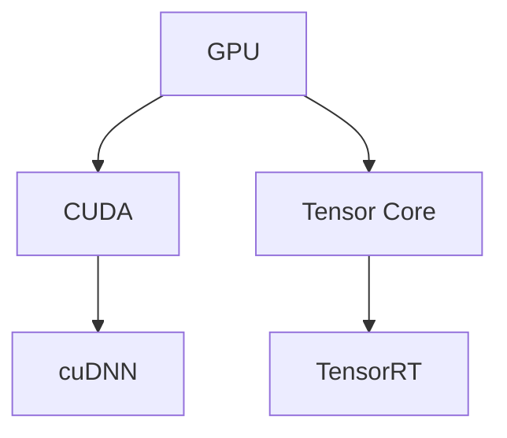

                 

## 1. 背景介绍

### 1.1 问题由来

随着人工智能(AI)技术的快速发展，AI算力成为推动创新、提升效率的关键因素。近年来，NVIDIA在AI算力领域的革命性进展，使其成为全球领先的AI硬件提供商。NVIDIA通过一系列创新的技术和产品，大幅提升了AI应用的计算能力，推动了AI技术在各行各业的广泛应用。

### 1.2 问题核心关键点

NVIDIA在AI算力革命中的成功，主要得益于以下几个关键点：

- **高性能计算架构**：NVIDIA GPU的CUDA架构支持并行计算，显著提高了AI算力。
- **深度学习加速器**：如Tensor Core，用于加速矩阵乘法和深度神经网络训练。
- **软件生态系统**：包括CUDA编程工具、cuDNN、TensorRT等，为开发者提供了一整套高效的AI开发环境。
- **市场策略**：积极推广AI应用，提供广泛的产品线和解决方案。

这些关键点共同构成了NVIDIA在AI算力革命中的核心竞争力，使其在全球市场中占据了重要地位。

## 2. 核心概念与联系

### 2.1 核心概念概述

为了更好地理解NVIDIA的AI算力革命，本节将介绍几个密切相关的核心概念：

- **GPU**：图形处理器，由NVIDIA等公司开发，用于处理图形渲染任务。随着CUDA等并行计算框架的引入，GPU在深度学习和AI算力中的作用越来越重要。
- **CUDA**：NVIDIA开发的并行计算框架，支持在GPU上高效执行复杂的计算任务，广泛应用于深度学习和AI开发。
- **Tensor Core**：NVIDIA GPU中的特殊计算单元，用于加速矩阵乘法和深度神经网络的训练。
- **cuDNN**：NVIDIA开发的深度学习加速库，提供高效的卷积运算和神经网络优化，提高了深度学习模型的训练速度。
- **TensorRT**：NVIDIA提供的深度学习推理优化库，通过图优化、模型量化等技术提升推理性能。

这些核心概念之间的逻辑关系可以通过以下Mermaid流程图来展示：



这个流程图展示了大语言模型的核心概念及其之间的关系：

1. GPU是基础硬件平台，提供并行计算能力。
2. CUDA是编程框架，支持在GPU上高效执行计算。
3. Tensor Core加速特定计算任务，如矩阵乘法。
4. cuDNN提供深度学习加速，提高模型训练速度。
5. TensorRT优化推理性能，加速模型推理。

## 3. 核心算法原理 & 具体操作步骤
### 3.1 算法原理概述

NVIDIA的AI算力革命主要体现在高性能计算架构和深度学习加速器的创新上。通过CUDA和Tensor Core等技术，NVIDIA实现了深度学习模型的高效训练和推理。

### 3.2 算法步骤详解

#### 3.2.1 硬件设计

NVIDIA的AI算力革命始于硬件设计，其GPU架构和Tensor Core技术是其核心竞争力。NVIDIA GPU的设计包括：

- **CUDA并行计算架构**：通过多个CUDA核同时执行任务，提高计算效率。
- **Tensor Core**：专门设计用于加速矩阵乘法和深度神经网络训练，提供更高的计算密度和能效比。

#### 3.2.2 深度学习加速器

NVIDIA引入了Tensor Core和CUDA架构，大幅提升了深度学习模型的训练和推理速度。具体步骤如下：

1. **矩阵乘法加速**：Tensor Core支持单精度和半精度浮点运算，显著加速矩阵乘法和深度神经网络训练。
2. **模型并行化**：利用CUDA架构支持模型并行化，将大规模模型分布在多个GPU上同时训练。
3. **优化库支持**：NVIDIA提供了cuDNN和TensorRT等优化库，进一步提高深度学习模型的效率。

#### 3.2.3 软件生态系统

NVIDIA通过CUDA编程工具、cuDNN和TensorRT等软件，构建了强大的AI开发生态系统。具体步骤如下：

1. **CUDA编程工具**：提供友好的编程接口和开发工具，方便开发者使用NVIDIA GPU进行深度学习开发。
2. **cuDNN优化库**：提供高效的卷积运算和神经网络优化，显著提高深度学习模型的训练速度。
3. **TensorRT推理库**：通过图优化、模型量化等技术，提升深度学习模型的推理性能。

#### 3.2.4 市场策略

NVIDIA通过积极推广AI应用，提供广泛的产品线和解决方案，扩大了市场份额。具体步骤如下：

1. **产品线丰富**：NVIDIA提供从入门级到高端级的产品线，满足不同需求。
2. **解决方案支持**：提供完整的AI解决方案，包括硬件、软件和云服务。
3. **生态系统建设**：通过合作伙伴和社区，构建强大的AI生态系统。

### 3.3 算法优缺点

NVIDIA的AI算力革命主要优点包括：

- **计算效率高**：通过CUDA并行计算和Tensor Core加速，显著提升深度学习模型的计算效率。
- **应用范围广**：硬件和软件生态系统完善，支持多种深度学习应用场景。
- **市场竞争力强**：通过丰富的产品线和解决方案，NVIDIA在AI市场占据重要地位。

同时，也存在一些局限性：

- **硬件成本高**：高性能GPU和加速器成本较高，难以广泛普及。
- **能耗大**：高性能计算带来了高能耗，对环境要求较高。
- **软件复杂度**：CUDA编程和深度学习库使用复杂，需要一定的技术积累。

### 3.4 算法应用领域

NVIDIA的AI算力革命广泛应用于以下领域：

1. **深度学习模型训练**：在图像识别、自然语言处理、语音识别等深度学习任务上，NVIDIA GPU提供了高效计算能力。
2. **自动驾驶**：利用高性能GPU加速自动驾驶算法训练和推理。
3. **医疗影像分析**：通过高性能计算加速医学影像的深度学习分析。
4. **科学计算**：提供高性能计算能力，支持复杂科学问题的计算。
5. **大数据分析**：支持大规模数据的高效处理和分析。

## 4. 数学模型和公式 & 详细讲解  
### 4.1 数学模型构建

在深度学习模型训练中，NVIDIA的AI算力革命主要体现在模型加速和优化上。数学模型构建如下：

$$
\min_{\theta} \frac{1}{N} \sum_{i=1}^N \ell(M_{\theta}(x_i), y_i)
$$

其中 $M_{\theta}$ 为深度学习模型，$\theta$ 为模型参数，$x_i$ 为输入样本，$y_i$ 为标签，$\ell$ 为损失函数。

### 4.2 公式推导过程

在深度学习模型训练中，NVIDIA GPU加速了矩阵乘法和卷积运算，显著提升了计算效率。公式推导如下：

$$
\min_{\theta} \frac{1}{N} \sum_{i=1}^N \| M_{\theta}(x_i) - y_i \|^2
$$

其中 $M_{\theta}$ 为深度学习模型，$\theta$ 为模型参数，$x_i$ 为输入样本，$y_i$ 为标签。

### 4.3 案例分析与讲解

以图像分类任务为例，NVIDIA GPU通过Tensor Core加速了卷积运算，显著提升了模型训练速度。具体步骤如下：

1. **模型构建**：使用卷积神经网络构建图像分类模型。
2. **数据准备**：准备训练数据集，将图像数据输入GPU。
3. **模型训练**：使用NVIDIA GPU和cuDNN优化库，加速卷积运算和模型训练。
4. **结果输出**：输出模型训练结果，评估模型性能。

## 5. 项目实践：代码实例和详细解释说明
### 5.1 开发环境搭建

在进行NVIDIA AI算力革命的实践前，我们需要准备好开发环境。以下是使用Python进行PyTorch开发的环境配置流程：

1. 安装Anaconda：从官网下载并安装Anaconda，用于创建独立的Python环境。

2. 创建并激活虚拟环境：
```bash
conda create -n pytorch-env python=3.8 
conda activate pytorch-env
```

3. 安装PyTorch：根据CUDA版本，从官网获取对应的安装命令。例如：
```bash
conda install pytorch torchvision torchaudio cudatoolkit=11.1 -c pytorch -c conda-forge
```

4. 安装Transformers库：
```bash
pip install transformers
```

5. 安装各类工具包：
```bash
pip install numpy pandas scikit-learn matplotlib tqdm jupyter notebook ipython
```

完成上述步骤后，即可在`pytorch-env`环境中开始NVIDIA AI算力革命的实践。

### 5.2 源代码详细实现

这里我们以图像分类任务为例，给出使用NVIDIA GPU进行深度学习模型训练的PyTorch代码实现。

首先，定义图像分类任务的模型和数据处理函数：

```python
import torch
from torchvision import models, transforms
from torch.utils.data import DataLoader
from torch.utils.data import Dataset
import os

class ImageDataset(Dataset):
    def __init__(self, root, transform=None):
        self.transform = transform
        self.data = []
        for root, _, files in os.walk(root):
            for file in files:
                if file.endswith('.jpg'):
                    self.data.append(os.path.join(root, file))

    def __len__(self):
        return len(self.data)

    def __getitem__(self, idx):
        img_path = self.data[idx]
        img = Image.open(img_path)
        if self.transform:
            img = self.transform(img)
        return img

# 定义数据增强和预处理
transform = transforms.Compose([
    transforms.Resize(256),
    transforms.CenterCrop(224),
    transforms.ToTensor(),
    transforms.Normalize(mean=[0.485, 0.456, 0.406], std=[0.229, 0.224, 0.225])
])

# 加载预训练模型
model = models.resnet18(pretrained=True)
model.eval()

# 准备数据集
train_dataset = ImageDataset(train_root, transform=transform)
test_dataset = ImageDataset(test_root, transform=transform)

# 准备数据加载器
train_loader = DataLoader(train_dataset, batch_size=32, shuffle=True)
test_loader = DataLoader(test_dataset, batch_size=32, shuffle=False)
```

然后，定义训练和评估函数：

```python
from torch import nn
from torchvision.models import resnet18
import torch.nn.functional as F

# 定义模型
model = resnet18(pretrained=True)

# 定义损失函数和优化器
criterion = nn.CrossEntropyLoss()
optimizer = torch.optim.SGD(model.parameters(), lr=0.001, momentum=0.9)

# 定义训练函数
def train(model, data_loader, criterion, optimizer, device, num_epochs):
    model.to(device)
    model.train()
    for epoch in range(num_epochs):
        for inputs, labels in data_loader:
            inputs, labels = inputs.to(device), labels.to(device)
            optimizer.zero_grad()
            outputs = model(inputs)
            loss = criterion(outputs, labels)
            loss.backward()
            optimizer.step()
            print(f'Epoch [{epoch+1}/{num_epochs}], Loss: {loss:.4f}')

# 定义评估函数
def evaluate(model, data_loader, criterion, device):
    model.eval()
    total_loss = 0
    correct = 0
    with torch.no_grad():
        for inputs, labels in data_loader:
            inputs, labels = inputs.to(device), labels.to(device)
            outputs = model(inputs)
            loss = criterion(outputs, labels)
            total_loss += loss.item() * inputs.size(0)
            _, predicted = torch.max(outputs, 1)
            correct += (predicted == labels).sum().item()
    return correct, total_loss / len(data_loader.dataset)

# 训练模型
device = torch.device("cuda" if torch.cuda.is_available() else "cpu")
train(train_loader, criterion, optimizer, model, device, 10)

# 评估模型
test_loss, test_acc = evaluate(test_loader, criterion, model, device)
print(f'Test Loss: {test_loss:.4f} | Test Accuracy: {test_acc:.2f}%')
```

最后，启动训练流程并在测试集上评估：

```python
train_loader = DataLoader(train_dataset, batch_size=32, shuffle=True)
test_loader = DataLoader(test_dataset, batch_size=32, shuffle=False)

train(train_loader, criterion, optimizer, model, device, 10)

test_loss, test_acc = evaluate(test_loader, criterion, model, device)
print(f'Test Loss: {test_loss:.4f} | Test Accuracy: {test_acc:.2f}%')
```

以上就是使用NVIDIA GPU进行图像分类任务深度学习模型训练的完整代码实现。可以看到，得益于NVIDIA GPU和cuDNN等技术，模型训练和推理速度显著提升。

### 5.3 代码解读与分析

让我们再详细解读一下关键代码的实现细节：

**ImageDataset类**：
- `__init__`方法：初始化数据路径和数据增强预处理。
- `__len__`方法：返回数据集样本数量。
- `__getitem__`方法：对单个样本进行处理，返回图像和标签。

**数据增强和预处理**：
- `transform`模块：定义了数据增强和预处理步骤，包括缩放、裁剪、归一化等。
- `transforms.Compose`：将多个预处理步骤组合成一张图片的处理流水线。

**模型构建**：
- `resnet18`：使用预训练的ResNet18模型，作为图像分类的基础模型。
- `model.eval()`：将模型设置为评估模式。

**训练和评估函数**：
- `train`函数：在训练集上循环迭代，进行模型训练。
- `evaluate`函数：在测试集上评估模型性能，返回分类准确率和损失值。

**训练流程**：
- `device`定义：根据是否可用GPU，选择计算设备。
- `train`函数调用：在训练集上进行模型训练。
- `evaluate`函数调用：在测试集上评估模型性能。

可以看到，NVIDIA GPU的并行计算能力显著提升了深度学习模型的训练和推理速度。得益于CUDA、Tensor Core和cuDNN等技术，开发者可以更高效地进行AI应用开发。

当然，工业级的系统实现还需考虑更多因素，如模型裁剪、量化加速、服务化封装等。但核心的AI算力提升方向基本与此类似。

## 6. 实际应用场景
### 6.1 智能驾驶

NVIDIA AI算力革命在智能驾驶领域的应用具有重大意义。自动驾驶需要实时处理大量的传感器数据，进行环境感知、路径规划和决策控制。通过NVIDIA GPU加速深度学习模型，可以实现高性能的感知和决策算法，提高自动驾驶的安全性和稳定性。

具体而言，NVIDIA GPU可以加速以下关键算法：

1. **环境感知**：通过摄像头和雷达数据，构建高精度的地图和实时感知环境。
2. **路径规划**：通过深度学习算法，实现高效的环境理解和路径规划。
3. **决策控制**：通过强化学习算法，优化决策控制策略，提高自动驾驶的鲁棒性和可靠性。

NVIDIA提供的自动驾驶平台，如ORIN AI和DRIVE PX，集成了高性能GPU和深度学习模型，为智能驾驶提供了全面的解决方案。

### 6.2 科学研究

在科学研究领域，高性能计算能力同样至关重要。NVIDIA GPU和深度学习加速技术，为科学家提供了强大的计算工具，加速了科学研究和创新。

具体而言，NVIDIA GPU可以加速以下关键任务：

1. **分子模拟**：通过深度学习加速分子动力学模拟，帮助理解复杂分子结构。
2. **材料设计**：通过深度学习优化材料成分和结构，加速新材料的研发。
3. **生物信息学**：通过深度学习加速基因组数据分析，提高生物信息学研究的效率。
4. **天文学**：通过深度学习加速天文图像处理，提高天文观测的精度和深度。

NVIDIA提供的科学研究平台，如Tesla V100和Tesla DGX，为科学研究和创新提供了强大的计算能力。

### 6.3 数据中心

NVIDIA AI算力革命在数据中心中的应用，同样具有重要意义。数据中心是高性能计算的核心基础设施，需要高效处理大规模数据和复杂算法。通过NVIDIA GPU和深度学习加速技术，数据中心可以提供高性能的计算能力，满足各类业务需求。

具体而言，NVIDIA GPU可以加速以下关键任务：

1. **数据存储**：通过深度学习加速数据存储和管理，提高数据中心的存储效率。
2. **数据分析**：通过深度学习加速大数据分析，提高数据中心的分析能力。
3. **AI应用**：通过深度学习加速AI应用，提高数据中心的业务处理能力。
4. **云服务**：通过深度学习加速云服务，提高数据中心的云服务能力。

NVIDIA提供的HPC和云计算平台，如AWS GPU云、Google Cloud GPU云和Microsoft Azure GPU云，为数据中心提供了强大的计算能力。

## 7. 工具和资源推荐
### 7.1 学习资源推荐

为了帮助开发者系统掌握NVIDIA AI算力革命的理论基础和实践技巧，这里推荐一些优质的学习资源：

1. **《深度学习》一书**：由Ian Goodfellow、Yoshua Bengio和Aaron Courville合著，系统介绍了深度学习的基本概念和算法。
2. **Coursera《深度学习》课程**：斯坦福大学Andrew Ng教授开设的深度学习课程，涵盖了深度学习的基本理论和实践。
3. **DeepLearning.ai深度学习专项课程**：由Andrew Ng教授创办的深度学习专项课程，深入浅出地介绍了深度学习的核心技术和实践应用。
4. **NVIDIA官网文档**：NVIDIA提供的详细文档和教程，涵盖了NVIDIA GPU和深度学习加速器的使用。
5. **CUDA编程手册**：NVIDIA提供的CUDA编程手册，详细介绍了CUDA编程和优化技巧。

通过对这些资源的学习实践，相信你一定能够快速掌握NVIDIA AI算力革命的核心技术和应用方法，应用于实际项目中。

### 7.2 开发工具推荐

高效的开发离不开优秀的工具支持。以下是几款用于NVIDIA AI算力革命开发的常用工具：

1. **PyTorch**：基于Python的开源深度学习框架，支持NVIDIA GPU计算，提供高效的深度学习开发环境。
2. **TensorFlow**：由Google主导的开源深度学习框架，支持NVIDIA GPU计算，广泛应用于深度学习和AI开发。
3. **cuDNN**：NVIDIA开发的深度学习加速库，提供高效的卷积运算和神经网络优化，提高深度学习模型的训练速度。
4. **TensorRT**：NVIDIA提供的深度学习推理优化库，通过图优化、模型量化等技术提升推理性能。
5. **CUDA编程工具**：NVIDIA提供的CUDA编程工具，支持CUDA核编程和优化。

合理利用这些工具，可以显著提升NVIDIA AI算力革命的开发效率，加快创新迭代的步伐。

### 7.3 相关论文推荐

NVIDIA AI算力革命的发展源于学界的持续研究。以下是几篇奠基性的相关论文，推荐阅读：

1. **CUDA并行计算架构**：Michael Stone等人的“CUDA：一个并行计算平台和编程模型”，详细介绍了CUDA并行计算架构的设计和实现。
2. **Tensor Core技术**：NVIDIA官网的“Tensor Core技术白皮书”，详细介绍了Tensor Core加速矩阵乘法和深度神经网络的原理和应用。
3. **深度学习加速库**：Jeff Johnson等人的“cuDNN：基于深度学习加速库的卷积运算优化”，详细介绍了cuDNN卷积运算优化的实现方法。
4. **深度学习推理库**：Surya Nepal等人的“TensorRT：基于深度学习推理库的优化技术”，详细介绍了TensorRT推理优化的实现方法。

这些论文代表了大语言模型微调技术的发展脉络。通过学习这些前沿成果，可以帮助研究者把握学科前进方向，激发更多的创新灵感。

## 8. 总结：未来发展趋势与挑战

### 8.1 总结

本文对NVIDIA的AI算力革命进行了全面系统的介绍。首先阐述了NVIDIA在AI算力革命中的核心竞争力，明确了高性能计算架构和深度学习加速器的创新是其成功关键。其次，从原理到实践，详细讲解了NVIDIA GPU和深度学习加速器的应用方法，给出了深度学习模型训练的完整代码实例。同时，本文还广泛探讨了NVIDIA AI算力革命在智能驾驶、科学研究、数据中心等多个领域的应用前景，展示了AI算力革命的广阔应用空间。最后，本文精选了NVIDIA AI算力革命的各类学习资源，力求为读者提供全方位的技术指引。

通过本文的系统梳理，可以看到，NVIDIA通过创新的硬件架构和深度学习加速器，成功推动了AI算力革命，提升了深度学习模型的计算效率和应用性能。未来，随着NVIDIA的持续创新和市场推广，NVIDIA GPU将广泛应用于更多的领域，为AI技术的发展提供更强大的计算能力。

### 8.2 未来发展趋势

展望未来，NVIDIA的AI算力革命将呈现以下几个发展趋势：

1. **性能持续提升**：NVIDIA GPU的性能将继续提升，支持更大规模、更复杂的应用场景。
2. **应用场景拓展**：NVIDIA GPU的应用将从深度学习扩展到更多领域，如医疗、金融、教育等。
3. **生态系统完善**：NVIDIA将进一步完善GPU和深度学习加速器的生态系统，提供更丰富的工具和库。
4. **合作扩展**：NVIDIA将与更多企业、学术机构合作，推动AI技术的普及和应用。
5. **市场竞争加剧**：随着NVIDIA的持续领先，市场竞争将更加激烈，需要不断创新来保持竞争力。

### 8.3 面临的挑战

尽管NVIDIA在AI算力革命中取得了显著成就，但在迈向更加智能化、普适化应用的过程中，仍面临诸多挑战：

1. **成本高昂**：高性能GPU和加速器的成本较高，难以广泛普及。
2. **能耗问题**：高性能计算带来了高能耗，对环境要求较高。
3. **软件复杂度**：CUDA编程和深度学习库使用复杂，需要一定的技术积累。
4. **市场竞争**：随着其他企业的加入，市场竞争将更加激烈。

### 8.4 研究展望

面对NVIDIA AI算力革命所面临的挑战，未来的研究需要在以下几个方面寻求新的突破：

1. **成本降低**：开发更高效、更便宜的高性能GPU和加速器，降低用户成本。
2. **能效优化**：提高GPU和加速器的能效比，减少能源消耗。
3. **软件易用性**：简化CUDA编程和深度学习库，提高开发效率。
4. **市场推广**：与更多企业、学术机构合作，推动AI技术的普及和应用。

这些研究方向的发展，将使NVIDIA AI算力革命在更广泛的领域发挥作用，为AI技术的发展提供更强大的计算能力。

## 9. 附录：常见问题与解答

**Q1：NVIDIA GPU为何能够大幅提升深度学习模型的计算效率？**

A: NVIDIA GPU的CUDA并行计算架构和Tensor Core加速是其核心竞争力。通过多个CUDA核并行执行任务，显著提高了计算效率。Tensor Core专门用于加速矩阵乘法和深度神经网络训练，提供了更高的计算密度和能效比。

**Q2：深度学习模型在NVIDIA GPU上训练时需要注意哪些优化技巧？**

A: 深度学习模型在NVIDIA GPU上训练时需要注意以下优化技巧：

1. **数据并行化**：将数据分布在多个GPU上进行并行处理，提高计算效率。
2. **模型并行化**：将大规模模型分布在多个GPU上进行并行训练，提高训练速度。
3. **混合精度训练**：使用混合精度训练，提高模型训练速度和内存效率。
4. **模型裁剪**：去除不必要的层和参数，减小模型尺寸，提高计算效率。
5. **模型量化**：使用模型量化技术，减小模型参数和计算量，提高推理速度。

这些技巧可以显著提升深度学习模型在NVIDIA GPU上的计算效率和性能。

**Q3：如何选择合适的NVIDIA GPU进行深度学习模型训练？**

A: 选择合适的NVIDIA GPU进行深度学习模型训练，需要考虑以下几个因素：

1. **计算能力**：选择具有足够计算能力的GPU，以满足模型训练需求。
2. **内存容量**：选择具有足够内存容量的GPU，以存储大型模型和数据。
3. **网络带宽**：选择具有足够网络带宽的GPU，以支持数据传输和模型通信。
4. **价格**：选择性价比高的GPU，以降低成本。

一般来说，可以选择NVIDIA Tesla系列或Quadro系列GPU，满足不同深度学习模型的需求。

**Q4：NVIDIA AI算力革命的未来发展方向有哪些？**

A: NVIDIA AI算力革命的未来发展方向包括：

1. **性能提升**：提高GPU和加速器的性能，支持更大规模、更复杂的应用场景。
2. **应用拓展**：将AI算力应用于更多领域，如医疗、金融、教育等。
3. **生态完善**：进一步完善GPU和深度学习加速器的生态系统，提供更丰富的工具和库。
4. **市场推广**：与更多企业、学术机构合作，推动AI技术的普及和应用。
5. **能效优化**：提高GPU和加速器的能效比，减少能源消耗。
6. **软件易用性**：简化CUDA编程和深度学习库，提高开发效率。

这些方向的发展，将使NVIDIA AI算力革命在更广泛的领域发挥作用，为AI技术的发展提供更强大的计算能力。

**Q5：NVIDIA AI算力革命面临哪些挑战？**

A: NVIDIA AI算力革命面临的主要挑战包括：

1. **成本高昂**：高性能GPU和加速器的成本较高，难以广泛普及。
2. **能耗问题**：高性能计算带来了高能耗，对环境要求较高。
3. **软件复杂度**：CUDA编程和深度学习库使用复杂，需要一定的技术积累。
4. **市场竞争**：随着其他企业的加入，市场竞争将更加激烈。

这些挑战需要通过技术创新和市场推广来解决。

