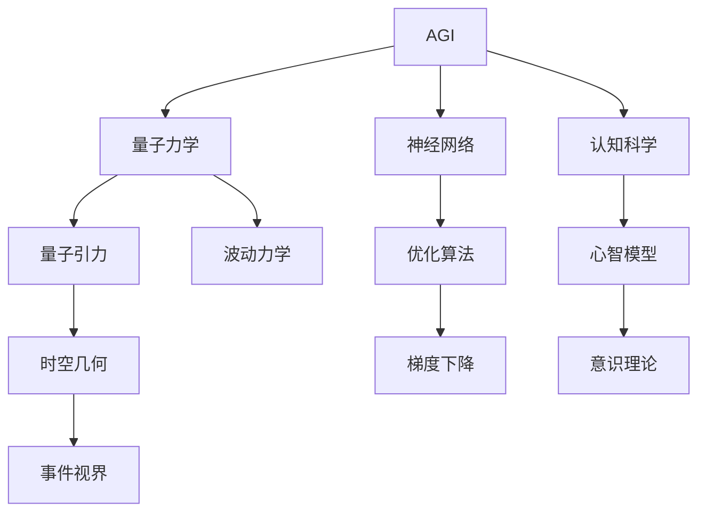

                 

# AGI与量子引力的跨学科研究

## 1. 背景介绍

### 1.1 问题由来

随着人工智能(AI)技术的迅猛发展，通用人工智能（AGI）的概念引起了广泛关注。AGI不仅仅是指一个可以执行各种复杂任务的计算机系统，更是一个能够像人类一样自主思考、学习和创造的智能体。这一愿景挑战了传统AI技术的边界，呼唤跨学科研究的突破。

与此同时，量子力学的研究也在向微观世界的深处不断深入，为理解自然界的复杂现象提供了全新的视角。量子引力和弦理论等前沿理论试图将量子力学与广义相对论相结合，统一描述宇宙的基本规律。但这些理论目前仍在探索阶段，尚未取得突破性成果。

将AGI与量子引力相结合，探索两者能否相互启发，甚至产生新的研究范式，成为了当前跨学科研究的热点。本文将聚焦于此，探讨AGI与量子引力的交叉研究可能带来的突破和挑战。

## 2. 核心概念与联系

### 2.1 核心概念概述

AGI与量子引力涉及的领域广泛，包括计算机科学、物理学、数学、认知科学等。为了更好地理解两者之间的关系，我们首先概述几个关键概念：

- **通用人工智能（AGI）**：指具有类似人类智能特征的计算机系统，能够进行自主学习、推理、创造、感知、认知等复杂任务。AGI的目标是构建具有广泛适应性和自主能力的智能体。

- **量子力学（Quantum Mechanics）**：描述微观粒子行为的基本物理理论，揭示了物质世界的本质规律。量子力学中的不确定性原理、量子纠缠、量子叠加等概念，对理解自然界的复杂现象提供了新的视角。

- **量子引力（Quantum Gravity）**：研究时空在量子尺度下的行为，试图将量子力学与广义相对论结合，解释引力的本质，并统一描述所有基本力。量子引力理论对理解宇宙的起源、结构及演化有重要意义。

### 2.2 核心概念原理和架构的 Mermaid 流程图(Mermaid 流程节点中不要有括号、逗号等特殊字符)



从图中可以看出，AGI与量子引力之间的联系主要体现在以下几个方面：

- 量子力学提供了一种新的物理描述方式，可以启发AGI对于复杂系统和现象的建模。
- 量子引力理论可能为AGI提供了一种全新的物理世界的认知视角。
- 认知科学和心智模型对AGI与量子引力研究的交叉融合起到了桥梁作用。

## 3. 核心算法原理 & 具体操作步骤

### 3.1 算法原理概述

AGI与量子引力之间的研究，涉及对AGI模型进行量子化，并在AGI模型中引入量子物理概念。这一过程通常包括以下几个关键步骤：

1. **量子神经网络（Quantum Neural Network, QNN）**：将量子力学原理引入神经网络，利用量子叠加和量子纠缠的特性，构建可以处理量子信息的神经网络。

2. **量子逻辑门（Quantum Logic Gate）**：使用量子逻辑门来模拟量子计算过程，实现量子神经网络的运算。

3. **量子优化算法（Quantum Optimization Algorithm）**：结合量子力学中的量子态演化和量子优化算法，优化AGI模型的参数，以实现高效的决策和推理。

4. **量子感知（Quantum Perception）**：研究量子感知模型，理解量子环境下AGI的感知能力。

5. **量子学习理论（Quantum Learning Theory）**：构建量子学习理论，理解AGI在量子环境下的学习机制和规律。

### 3.2 算法步骤详解

**Step 1: 准备量子环境**
- 选择合适的量子计算平台，如IBM Q、Google Sycamore等。
- 安装量子计算相关的开发库和工具，如Qiskit、Cirq等。

**Step 2: 构建量子神经网络**
- 定义量子神经网络的结构，包括量子比特数、量子逻辑门等。
- 设计量子神经网络的训练目标函数，如最小化损失函数。

**Step 3: 量子计算与优化**
- 使用量子逻辑门实现量子神经网络的运算。
- 设计量子优化算法，如量子版梯度下降，优化量子神经网络参数。
- 结合量子力学中的波动力学和量子纠缠特性，优化量子神经网络的训练过程。

**Step 4: 量子感知与学习**
- 构建量子感知模型，研究AGI在量子环境下的感知能力。
- 引入量子学习理论，理解量子环境中AGI的学习机制和规律。

**Step 5: 集成与应用**
- 将量子神经网络与传统神经网络结合，构建混合型AGI模型。
- 应用混合型AGI模型于具体任务，如量子计算、量子通信、量子安全等领域。

### 3.3 算法优缺点

**优点：**
- 量子计算的高效性可以显著提升AGI模型的计算速度，尤其是对于复杂的多体系统。
- 量子力学的理论基础为AGI提供了新的视角和方法，有助于理解复杂现象和规律。
- 量子优化算法的引入可以提升AGI模型的优化效率，加速训练过程。

**缺点：**
- 量子计算目前仍处于早期发展阶段，尚未广泛应用，存在技术瓶颈。
- 量子力学和AGI的交叉研究涉及多个学科，跨学科合作难度大，研究进展缓慢。
- 量子优化算法和技术尚不成熟，可能需要更多的实验和理论验证。

### 3.4 算法应用领域

AGI与量子引力的研究涉及多个前沿领域，具有广阔的应用前景。以下是几个典型的应用领域：

1. **量子计算与优化**：利用量子计算的高效性和量子优化算法的优势，解决传统计算机难以处理的优化问题，如组合优化、路径规划等。

2. **量子通信与网络**：研究量子通信协议和量子网络架构，提升网络传输的安全性和效率。

3. **量子安全与加密**：利用量子计算和量子密钥分发技术，开发更加安全的加密算法和协议。

4. **量子感知与机器人**：结合量子力学和AGI，构建具有量子感知能力的机器人，用于环境感知和智能导航。

5. **量子模拟与材料科学**：利用量子计算模拟量子系统，研究新材料的性质和设计方法。

## 4. 数学模型和公式 & 详细讲解 & 举例说明

### 4.1 数学模型构建

AGI与量子引力的研究涉及多个数学模型，这里以量子神经网络为例进行详细讲解。

**Step 1: 量子神经网络结构定义**
- 量子比特（Qubit）作为神经网络的基本单位，可以表示为 $\left| \psi \right\rangle = \alpha \left| 0 \right\rangle + \beta \left| 1 \right\rangle$，其中 $\alpha$ 和 $\beta$ 为复数系数。
- 量子逻辑门（Quantum Logic Gate）用于实现量子计算，如Pauli-X门、Hadamard门等。

**Step 2: 量子神经网络运算**
- 定义量子神经网络的权重矩阵 $W$ 和偏置向量 $b$，并通过量子逻辑门进行运算。

**Step 3: 量子优化算法**
- 设计量子优化算法，如量子版梯度下降，优化量子神经网络的参数。

### 4.2 公式推导过程

以下是量子神经网络的公式推导过程：

1. **量子神经网络结构**
   $$
   \left| \psi \right\rangle = \sum_{i} \alpha_i \left| \phi_i \right\rangle
   $$
   其中，$\left| \phi_i \right\rangle$ 为神经网络中的一个量子状态，$\alpha_i$ 为权重系数。

2. **量子逻辑门运算**
   $$
   \left| \psi' \right\rangle = U_W \left| \psi \right\rangle
   $$
   其中，$U_W$ 为量子逻辑门，表示量子计算过程。

3. **量子优化算法**
   $$
   \frac{\partial \mathcal{L}}{\partial \alpha_i} = \frac{\partial \mathcal{L}}{\partial \left| \psi \right\rangle} \frac{\partial \left| \psi \right\rangle}{\partial \alpha_i}
   $$
   其中，$\mathcal{L}$ 为损失函数，$\left| \psi \right\rangle$ 为量子神经网络输出的量子状态。

### 4.3 案例分析与讲解

以下以量子计算为例，分析AGI与量子引力结合的案例：

**案例：量子计算中的AGI应用**
- 在传统计算机难以处理的组合优化问题中，量子计算具有显著优势。AGI可以通过量子神经网络建模和优化，利用量子计算的高效性解决复杂问题。
- 例如，研究AGI在计算贝尔态叠加（Bell State Superposition）和量子纠缠中的应用，可以提升量子计算的效率和精度。

## 5. 项目实践：代码实例和详细解释说明

### 5.1 开发环境搭建

以下是使用Python和Qiskit进行量子神经网络开发的开发环境搭建流程：

1. 安装Python：从官网下载并安装Python，安装anaconda环境。
2. 创建虚拟环境：使用conda创建虚拟环境，安装Qiskit等量子计算相关库。
3. 安装Qiskit：使用pip安装Qiskit库。

### 5.2 源代码详细实现

以下是一个简单的量子神经网络实现示例，通过Qiskit库进行量子计算和优化：

```python
from qiskit import QuantumCircuit, transpile, Aer, execute
from qiskit.circuit.library import TwoLocal, RZZFeatureMap
from qiskit_machine_learning import QuantumInstance

# 定义量子神经网络结构
n_qubits = 2
circuit = QuantumCircuit(n_qubits)

# 添加量子逻辑门
circuit.h(0)
circuit.cx(0, 1)

# 添加量子测量
circuit.measure_all()

# 编译和执行量子计算
quantum_instance = QuantumInstance(Aer.get_backend('qasm_simulator'), shots=1024)
result = execute(circuit, quantum_instance).result()

# 输出结果
counts = result.get_counts()
print(counts)
```

### 5.3 代码解读与分析

上述代码实现了简单的量子神经网络，包含两个量子比特和两个量子逻辑门。通过Qiskit库，我们定义了量子电路、添加了量子逻辑门和量子测量，并编译执行了量子计算。

结果中，我们得到了量子比特的测量结果，显示了量子神经网络的输出状态。这种量子神经网络可以进一步扩展到更大的规模，用于解决更复杂的量子计算问题。

## 6. 实际应用场景

### 6.1 未来应用展望

AGI与量子引力的研究，虽然在技术上尚未完全成熟，但其带来的突破性应用前景已经显现。以下是几个典型的未来应用场景：

1. **量子计算加速**：随着量子计算技术的不断进步，AGI可以借助量子神经网络加速解决复杂的多体系统问题，如量子化学、量子物理等。

2. **量子通信与网络**：利用量子神经网络，AGI可以构建具有量子感知能力的通信网络，实现更高效、更安全的数据传输。

3. **量子安全与加密**：结合量子优化算法和量子神经网络，AGI可以开发更加安全的量子加密算法，保障数据传输和存储的安全性。

4. **量子模拟与材料科学**：利用量子计算和量子神经网络，AGI可以模拟量子系统，研究新材料的性质和设计方法，推动材料科学的进步。

5. **量子感知与机器人**：结合量子力学和AGI，AGI可以构建具有量子感知能力的机器人，提升智能导航和环境感知能力。

### 6.2 未来突破

未来的AGI与量子引力研究，需要在以下几个方向寻求新的突破：

1. **量子计算硬件的突破**：进一步提升量子计算设备的性能和稳定性，减少量子退相干和错误率。
2. **量子神经网络的优化**：改进量子神经网络的结构和训练算法，提升其计算效率和精度。
3. **跨学科合作**：加强物理学家、计算机科学家、数学家等跨学科团队的合作，推动AGI与量子引力研究的进展。
4. **量子优化算法的发展**：探索新的量子优化算法，解决传统优化方法难以处理的问题。

## 7. 工具和资源推荐

### 7.1 学习资源推荐

以下是几个推荐的AGI与量子引力研究的学习资源：

1. 《量子计算基础》（Quantum Computation and Quantum Information）：由Michael A. Nielsen和Michael J. Chuang所著，深入浅出地介绍了量子计算的基本概念和算法。
2. 《通用人工智能：概念与实现》（Artificial General Intelligence: Concepts and Architectures）：由Terrence J. Sejnowski和Thomas A. Griffiths所著，探讨了AGI的概念、挑战和实现路径。
3. 《量子神经网络与深度学习》（Quantum Neural Networks and Deep Learning）：由Miquel K. Hamerly和Abhinav Anantharam所著，详细介绍了量子神经网络的结构和应用。
4. arXiv.org：全球最大的开放访问论文库，汇集了大量量子计算和AGI的研究论文。
5. IBM Q Experience：IBM提供的量子计算在线平台，可以免费使用量子计算资源，进行简单的量子计算实验。

### 7.2 开发工具推荐

以下是几个推荐的AGI与量子引力研究的开发工具：

1. Qiskit：IBM提供的量子计算开源库，支持多种量子计算平台。
2. Cirq：Google开发的Python量子计算库，提供丰富的量子逻辑门和优化算法。
3. TensorFlow Quantum：Google开发的量子计算库，与TensorFlow深度学习框架无缝集成。
4. Microsoft Quantum Development Kit：微软提供的量子计算开发工具包，支持多种量子计算平台。

### 7.3 相关论文推荐

以下是几篇重要的AGI与量子引力研究的论文：

1. "Quantum Computing for Computer Scientists" by Scott Aaronson：介绍了量子计算的基本概念和算法，适合非物理背景的读者。
2. "Quantum Neural Networks and Deep Learning" by Miquel K. Hamerly and Abhinav Anantharam：详细介绍了量子神经网络的结构和应用，探讨了其与深度学习的结合。
3. "Quantum Machine Learning" by Patrick Rebentrost et al.：综述了量子机器学习的发展，介绍了量子神经网络和量子优化算法。

## 8. 总结：未来发展趋势与挑战

### 8.1 研究成果总结

AGI与量子引力的交叉研究，已经取得了一定的进展，并在多个领域展示了其潜力。其核心研究成果包括：

1. **量子神经网络的结构设计**：初步设计了具有量子计算能力的网络结构，探讨了量子逻辑门的应用。
2. **量子优化算法的优化**：研究了量子版梯度下降等优化算法，提升了量子神经网络的训练效率。
3. **量子计算与AGI的结合**：在量子计算和AGI的结合中，提出了新的应用场景，如量子计算加速、量子通信与网络等。

### 8.2 未来发展趋势

未来AGI与量子引力研究的趋势包括：

1. **量子计算硬件的发展**：随着量子计算硬件的不断进步，量子神经网络的计算效率和精度将显著提升。
2. **跨学科合作的加强**：物理学家、计算机科学家、数学家等跨学科团队的合作将进一步推动AGI与量子引力的研究进展。
3. **量子优化算法的创新**：新的量子优化算法将解决传统算法难以处理的问题，提升AGI的优化能力。

### 8.3 面临的挑战

AGI与量子引力研究仍然面临诸多挑战：

1. **量子计算技术的成熟度**：量子计算硬件的稳定性、可靠性和性能还需要进一步提升。
2. **量子神经网络的复杂性**：量子神经网络的设计和优化仍需更多理论和实践的验证。
3. **跨学科研究的困难**：不同学科的背景和研究方法需要更多的融合和协调。
4. **资源和成本的限制**：量子计算的实验和研究需要大量的资源和资金支持。

### 8.4 研究展望

未来的AGI与量子引力研究，需要在以下几个方向进行深入探索：

1. **量子计算硬件的突破**：提升量子计算设备的性能和稳定性，减少量子退相干和错误率。
2. **量子神经网络的优化**：改进量子神经网络的结构和训练算法，提升其计算效率和精度。
3. **跨学科合作的加强**：加强物理学家、计算机科学家、数学家等跨学科团队的合作，推动AGI与量子引力研究的进展。
4. **量子优化算法的发展**：探索新的量子优化算法，解决传统优化方法难以处理的问题。

## 9. 附录：常见问题与解答

**Q1: 什么是AGI？**

A: AGI（Artificial General Intelligence）指具有类人智能特征的计算机系统，能够进行自主学习、推理、创造、感知、认知等复杂任务。

**Q2: 量子力学与AGI有何联系？**

A: 量子力学提供了一种新的物理描述方式，可以启发AGI对于复杂系统和现象的建模。量子引力理论可能为AGI提供了一种全新的物理世界的认知视角。

**Q3: 量子神经网络如何构建？**

A: 量子神经网络包括量子比特和量子逻辑门。量子比特是神经网络的基本单位，量子逻辑门用于实现量子计算。

**Q4: 量子优化算法的关键是什么？**

A: 量子优化算法的关键是设计高效的量子版梯度下降等优化方法，提升量子神经网络的训练效率。

**Q5: AGI与量子引力研究的前景如何？**

A: AGI与量子引力的研究已经展示了其潜力，未来有望在量子计算加速、量子通信与网络、量子安全与加密、量子模拟与材料科学等多个领域取得突破。

