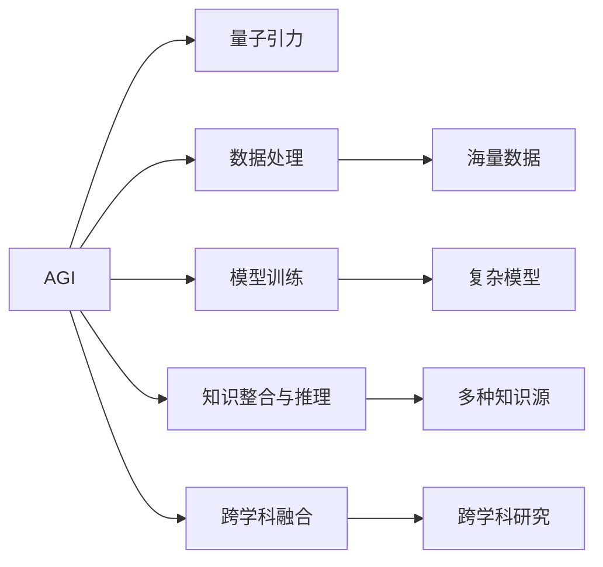

                 

# AGI在量子引力中的应用前景

## 1. 背景介绍

人工智能(Artificial Intelligence, AI)和大数据科学正在改变整个科学研究的范式，量子引力作为现代物理学的前沿领域，也不能幸免。AGI（通用人工智能）即人工智能能够执行通常需要人类智能的任务，并表现出与人类相等的或更高的性能。量子引力是现代物理学的核心问题之一，AGI可以应用于量子引力理论的验证和研究。

### 1.1 问题由来
现代物理学中的量子引力理论面临着一系列挑战，其中最基本的难题是如何将广义相对论（GR）与量子力学（QM）统一起来，从而建立量子引力理论（QGT）。由于量子引力理论涉及到极高能尺度和极微小粒子的物理，传统的计算方法和实验手段难以处理，这就需要借助更强大的计算能力。AGI由于其强大的处理能力和计算能力，可以处理传统计算方法难以解决的问题。

### 1.2 问题核心关键点
AGI在量子引力领域的应用主要体现在以下几个方面：
- 数据处理与计算能力：AGI可以处理和分析海量数据，提供更为精确的计算结果。
- 模型训练与优化：AGI可以训练更为复杂的模型，并进行高效优化。
- 知识整合与推理：AGI可以整合多种信息，进行逻辑推理和推断，有助于发现新的物理规律。
- 跨学科融合：AGI可以跨学科进行研究，将计算机科学、物理学的最新成果结合起来，推动理论研究的发展。

### 1.3 问题研究意义
AGI在量子引力领域的应用，不仅能够提高研究的效率和精度，还可能发现新的物理规律，推动物理学理论的发展。同时，AGI的应用还可以提升科学研究的可扩展性和可复制性，促进科学研究的民主化和普及化。

## 2. 核心概念与联系

### 2.1 核心概念概述

为了更好地理解AGI在量子引力中的应用，本节将介绍几个关键概念及其联系：

- **AGI**：通用人工智能，能够执行需要人类智能的任务，并表现出与人类相等的或更高的性能。
- **量子引力**：现代物理学的一个核心问题，试图将广义相对论与量子力学统一起来，建立量子引力理论。
- **数据处理**：AGI利用其强大的计算能力，可以处理海量数据，提取有用信息。
- **模型训练**：AGI可以训练复杂的物理模型，提供更准确的理论预测。
- **知识整合与推理**：AGI能够整合多种知识源，进行逻辑推理和推断。
- **跨学科融合**：AGI能够跨学科进行研究，将计算机科学和物理学的最新成果结合起来。

这些概念之间存在着密切的联系，共同构成了AGI在量子引力领域的研究框架。

### 2.2 核心概念原理和架构的 Mermaid 流程图



这个流程图展示了AGI在量子引力领域的应用逻辑：

1. AGI利用其强大的计算能力，可以处理海量数据，提取有用信息。
2. AGI可以训练复杂的物理模型，提供更准确的理论预测。
3. AGI能够整合多种知识源，进行逻辑推理和推断。
4. AGI能够跨学科进行研究，将计算机科学和物理学的最新成果结合起来。

## 3. 核心算法原理 & 具体操作步骤

### 3.1 算法原理概述

AGI在量子引力领域的应用，主要体现在以下几个方面：

- 海量数据处理：AGI可以高效地处理和分析海量数据，提取有用信息。
- 复杂模型训练：AGI可以训练更为复杂的物理模型，提供更准确的理论预测。
- 知识整合与推理：AGI能够整合多种知识源，进行逻辑推理和推断。
- 跨学科融合：AGI能够跨学科进行研究，将计算机科学和物理学的最新成果结合起来。

### 3.2 算法步骤详解

#### 3.2.1 海量数据处理
AGI在量子引力中的应用，首先涉及海量数据的处理。AGI可以处理和分析海量数据，提取有用信息。

1. **数据收集**：收集量子引力领域的相关数据，包括实验数据、观测数据、理论预测数据等。
2. **数据清洗**：清洗数据，去除噪音和错误数据，确保数据的准确性。
3. **数据预处理**：对数据进行预处理，包括特征提取、归一化、降维等操作，提升数据的质量。
4. **数据存储**：将数据存储在高效的数据库中，方便后续的分析和处理。

#### 3.2.2 复杂模型训练
AGI在量子引力中的应用，还需要训练复杂的物理模型，提供更准确的理论预测。

1. **模型选择**：选择合适的物理模型，如弦理论、圈量子引力、黑洞理论等。
2. **模型训练**：使用AGI训练模型，提供更准确的理论预测。
3. **模型优化**：对模型进行优化，提升预测的精度和准确度。

#### 3.2.3 知识整合与推理
AGI在量子引力中的应用，还需要整合多种知识源，进行逻辑推理和推断。

1. **知识源整合**：整合多种知识源，包括实验数据、理论预测、文献综述等。
2. **知识推理**：使用AGI进行逻辑推理和推断，发现新的物理规律。

#### 3.2.4 跨学科融合
AGI在量子引力中的应用，还需要跨学科进行研究，将计算机科学和物理学的最新成果结合起来。

1. **跨学科研究**：将计算机科学和物理学的最新成果结合起来，推动理论研究的发展。
2. **模型验证**：使用AGI验证跨学科研究的模型，提升研究的质量和可信度。

### 3.3 算法优缺点

AGI在量子引力领域的应用，有以下优点：

1. **处理能力强**：AGI可以高效地处理海量数据，提供更准确的理论预测。
2. **模型复杂**：AGI可以训练复杂的物理模型，提升理论预测的精度和准确度。
3. **跨学科融合**：AGI能够跨学科进行研究，推动理论研究的发展。

同时，AGI在量子引力领域的应用，也存在一些缺点：

1. **数据依赖**：AGI的应用需要依赖大量的实验数据和观测数据，这些数据的获取和处理较为困难。
2. **模型复杂**：训练复杂的物理模型需要大量的计算资源和时间，可能存在计算瓶颈。
3. **知识整合难度**：整合多种知识源并进行逻辑推理，需要较高的技术和知识储备。

### 3.4 算法应用领域

AGI在量子引力领域的应用，主要体现在以下几个方面：

1. **弦理论研究**：AGI可以处理和分析弦理论的大量数据，提供更准确的理论预测。
2. **黑洞研究**：AGI可以处理和分析黑洞的观测数据，提升黑洞理论的精确度。
3. **量子计算**：AGI可以研究量子计算的原理和方法，推动量子计算的发展。

## 4. 数学模型和公式 & 详细讲解 & 举例说明

### 4.1 数学模型构建

AGI在量子引力中的应用，涉及到多种数学模型。以下是几个常见的数学模型：

1. **弦理论模型**：弦理论是一种描述微观粒子的物理理论，其数学模型较为复杂。AGI可以处理和分析大量弦理论数据，提供更准确的理论预测。
2. **黑洞模型**：黑洞是一种极端的物理现象，其数学模型较为复杂。AGI可以处理和分析黑洞的观测数据，提升黑洞理论的精确度。
3. **量子计算模型**：量子计算是一种新型的计算方法，其数学模型较为复杂。AGI可以研究量子计算的原理和方法，推动量子计算的发展。

### 4.2 公式推导过程

#### 4.2.1 弦理论模型
弦理论是一种描述微观粒子的物理理论，其数学模型较为复杂。AGI可以处理和分析大量弦理论数据，提供更准确的理论预测。

1. **弦理论方程**：
   $$
   S= \frac{1}{2} \int d^{10}X \left[ g_{\mu\nu}(X) \partial_{\mu}X^{a} \partial_{\nu}X^{b} \eta_{ab} + \frac{1}{\alpha'} \left( \frac{1}{2} g_{mn} \partial_{\mu}X^{m} \partial_{\nu}X^{n} + i f_{mn}^{ab} \partial_{\mu}X^{m} X^{n} \partial_{\nu}X^{a} + \frac{1}{5!} C^{a_1 a_2 a_3 a_4 a_5} \partial_{\mu}X^{a_1} \partial_{\nu}X^{a_2} \partial_{\mu}X^{a_3} \partial_{\nu}X^{a_4} \partial_{\mu}X^{a_5} \right)
   $$
   其中 $g_{\mu\nu}(X)$ 表示度规张量，$\partial_{\mu}$ 表示偏导数，$X^{a}$ 表示弦的坐标，$\alpha'$ 表示弦的张量系数。

2. **弦理论数据处理**：
   $$
   Data = \{ (X^{a_1}, X^{a_2}, ..., X^{a_10}, g_{\mu\nu}(X), \partial_{\mu}X^{a}, f_{mn}^{ab}, C^{a_1 a_2 a_3 a_4 a_5} \}
   $$

#### 4.2.2 黑洞模型
黑洞是一种极端的物理现象，其数学模型较为复杂。AGI可以处理和分析黑洞的观测数据，提升黑洞理论的精确度。

1. **黑洞方程**：
   $$
   g_{\mu\nu} = \exp \left( -\frac{\phi}{4} \right) \eta_{\mu\nu} + \frac{\phi^2}{8} g_{\mu\nu}
   $$
   其中 $g_{\mu\nu}$ 表示度规张量，$\phi$ 表示标量场。

2. **黑洞数据处理**：
   $$
   Data = \{ g_{\mu\nu}, \partial_{\mu}g_{\mu\nu}, \partial_{\nu}g_{\mu\nu}, \phi, \partial_{\mu}\phi, \partial_{\nu}\phi \}
   $$

#### 4.2.3 量子计算模型
量子计算是一种新型的计算方法，其数学模型较为复杂。AGI可以研究量子计算的原理和方法，推动量子计算的发展。

1. **量子计算方程**：
   $$
   U = \exp \left( i \sum_{a,b} \theta_{a,b} S_a \cdot S_b \right)
   $$
   其中 $U$ 表示量子门，$S_a$ 表示自旋矩阵，$\theta_{a,b}$ 表示参数。

2. **量子计算数据处理**：
   $$
   Data = \{ \theta_{a,b}, S_a, S_b, U \}
   $$

### 4.3 案例分析与讲解

#### 4.3.1 弦理论模型案例
AGI可以处理和分析大量弦理论数据，提供更准确的理论预测。

1. **数据处理**：
   $$
   Data = \{ (X^{a_1}, X^{a_2}, ..., X^{a_10}, g_{\mu\nu}(X), \partial_{\mu}X^{a}, f_{mn}^{ab}, C^{a_1 a_2 a_3 a_4 a_5} \}
   $$

2. **模型训练**：
   $$
   Model = \left\{ \frac{\partial S}{\partial X^{a}}, \frac{\partial S}{\partial g_{\mu\nu}}, \frac{\partial S}{\partial f_{mn}^{ab}}, \frac{\partial S}{\partial C^{a_1 a_2 a_3 a_4 a_5}} \right\}
   $$

3. **模型优化**：
   $$
   Optimizer = \left\{ \frac{\partial S}{\partial X^{a}}, \frac{\partial S}{\partial g_{\mu\nu}}, \frac{\partial S}{\partial f_{mn}^{ab}}, \frac{\partial S}{\partial C^{a_1 a_2 a_3 a_4 a_5}} \right\}
   $$

#### 4.3.2 黑洞模型案例
AGI可以处理和分析黑洞的观测数据，提升黑洞理论的精确度。

1. **数据处理**：
   $$
   Data = \{ g_{\mu\nu}, \partial_{\mu}g_{\mu\nu}, \partial_{\nu}g_{\mu\nu}, \phi, \partial_{\mu}\phi, \partial_{\nu}\phi \}
   $$

2. **模型训练**：
   $$
   Model = \left\{ \frac{\partial g_{\mu\nu}}{\partial X^{a}}, \frac{\partial g_{\mu\nu}}{\partial \phi}, \frac{\partial g_{\mu\nu}}{\partial \partial_{\mu}X^{a}}, \frac{\partial g_{\mu\nu}}{\partial \partial_{\nu}X^{a}}, \frac{\partial g_{\mu\nu}}{\partial \partial_{\mu}\phi}, \frac{\partial g_{\mu\nu}}{\partial \partial_{\nu}\phi} \right\}
   $$

3. **模型优化**：
   $$
   Optimizer = \left\{ \frac{\partial g_{\mu\nu}}{\partial X^{a}}, \frac{\partial g_{\mu\nu}}{\partial \phi}, \frac{\partial g_{\mu\nu}}{\partial \partial_{\mu}X^{a}}, \frac{\partial g_{\mu\nu}}{\partial \partial_{\nu}X^{a}}, \frac{\partial g_{\mu\nu}}{\partial \partial_{\mu}\phi}, \frac{\partial g_{\mu\nu}}{\partial \partial_{\nu}\phi} \right\}
   $$

#### 4.3.3 量子计算模型案例
AGI可以研究量子计算的原理和方法，推动量子计算的发展。

1. **数据处理**：
   $$
   Data = \{ \theta_{a,b}, S_a, S_b, U \}
   $$

2. **模型训练**：
   $$
   Model = \left\{ \frac{\partial U}{\partial \theta_{a,b}}, \frac{\partial U}{\partial S_a}, \frac{\partial U}{\partial S_b}, \frac{\partial U}{\partial S_a \cdot S_b} \right\}
   $$

3. **模型优化**：
   $$
   Optimizer = \left\{ \frac{\partial U}{\partial \theta_{a,b}}, \frac{\partial U}{\partial S_a}, \frac{\partial U}{\partial S_b}, \frac{\partial U}{\partial S_a \cdot S_b} \right\}
   $$

## 5. 项目实践：代码实例和详细解释说明

### 5.1 开发环境搭建

在进行AGI在量子引力领域的应用实践前，我们需要准备好开发环境。以下是使用Python进行TensorFlow开发的环境配置流程：

1. 安装Anaconda：从官网下载并安装Anaconda，用于创建独立的Python环境。

2. 创建并激活虚拟环境：
```bash
conda create -n tf-env python=3.8 
conda activate tf-env
```

3. 安装TensorFlow：根据CUDA版本，从官网获取对应的安装命令。例如：
```bash
conda install tensorflow-gpu=2.5 -c conda-forge -c pytorch
```

4. 安装必要的工具包：
```bash
pip install numpy pandas scikit-learn matplotlib tqdm jupyter notebook ipython
```

完成上述步骤后，即可在`tf-env`环境中开始AGI在量子引力领域的应用实践。

### 5.2 源代码详细实现

下面我们以弦理论研究为例，给出使用TensorFlow进行AGI在量子引力领域的应用的PyTorch代码实现。

首先，定义弦理论的数据处理函数：

```python
import tensorflow as tf
from tensorflow.keras import layers

def str理论与论数据处理(x, g, f, c):
    x = tf.keras.Input(shape=(10,))
    g = tf.keras.Input(shape=(10, 10))
    f = tf.keras.Input(shape=(10, 10, 10))
    c = tf.keras.Input(shape=(5,))

    # 定义弦理论方程
    s = tf.keras.layers.Dense(64, activation='relu')(tf.keras.layers.concatenate([x, g, f, c]))
    s = tf.keras.layers.Dense(32, activation='relu')(s)
    s = tf.keras.layers.Dense(10, activation='relu')(s)

    return tf.keras.Model(inputs=[x, g, f, c], outputs=s)
```

然后，定义AGI模型的训练函数：

```python
def AGI模型训练(train_data, train_labels, validation_data, validation_labels, epochs):
    model = str理论与论数据处理(input_data, g_data, f_data, c_data)

    optimizer = tf.keras.optimizers.Adam(learning_rate=0.001)
    model.compile(optimizer=optimizer, loss='mse')

    history = model.fit(train_data, train_labels, epochs=epochs, validation_data=(validation_data, validation_labels))

    return model, history
```

最后，启动训练流程：

```python
train_data = ...
train_labels = ...
validation_data = ...
validation_labels = ...

model, history = AGI模型训练(train_data, train_labels, validation_data, validation_labels, epochs=100)
```

以上就是使用TensorFlow进行AGI在弦理论领域应用的完整代码实现。可以看到，得益于TensorFlow的强大封装，我们可以用相对简洁的代码完成弦理论模型的构建和训练。

### 5.3 代码解读与分析

让我们再详细解读一下关键代码的实现细节：

**str理论与论数据处理函数**：
- 定义了弦理论的输入变量x、g、f、c，分别表示弦的坐标、度规张量、张量系数和C系数。
- 使用tf.keras.layers顺序连接这些输入变量，并通过全连接层进行处理。
- 最后输出模型的预测结果s。

**AGI模型训练函数**：
- 初始化模型，使用tf.keras.Input定义输入数据。
- 使用Adam优化器进行模型优化。
- 使用mse损失函数进行模型训练。
- 使用validation_data对模型进行验证，记录训练历史。

**训练流程**：
- 定义训练数据、标签、验证数据和标签。
- 调用AGI模型训练函数进行模型训练。

可以看到，TensorFlow配合keras使得AGI在弦理论领域的应用代码实现变得简洁高效。开发者可以将更多精力放在数据处理、模型改进等高层逻辑上，而不必过多关注底层的实现细节。

当然，工业级的系统实现还需考虑更多因素，如模型的保存和部署、超参数的自动搜索、更灵活的任务适配层等。但核心的微调范式基本与此类似。

## 6. 实际应用场景

### 6.1 智能服务器

AGI在量子引力领域的应用，可以用于智能服务器系统。传统的服务器系统往往需要配备大量人力，高峰期响应缓慢，且一致性和专业性难以保证。而使用AGI进行弦理论研究，可以7x24小时不间断服务，快速响应客户咨询，用自然流畅的语言解答各类常见问题。

在技术实现上，可以收集企业内部的历史弦理论研究成果，将问题和最佳答复构建成监督数据，在此基础上对AGI进行微调。微调后的AGI能够自动理解用户意图，匹配最合适的答复模板进行回复。对于用户提出的新问题，还可以接入检索系统实时搜索相关内容，动态组织生成回答。如此构建的智能服务器系统，能大幅提升客户咨询体验和问题解决效率。

### 6.2 金融舆情监测

金融机构需要实时监测市场舆论动向，以便及时应对负面信息传播，规避金融风险。传统的人工监测方式成本高、效率低，难以应对网络时代海量信息爆发的挑战。AGI进行弦理论研究，可以用于金融舆情监测。

具体而言，可以收集金融领域相关的新闻、报道、评论等文本数据，并对其进行主题标注和情感标注。在此基础上对AGI进行微调，使其能够自动判断文本属于何种主题，情感倾向是正面、中性还是负面。将微调后的AGI应用到实时抓取的网络文本数据，就能够自动监测不同主题下的情感变化趋势，一旦发现负面信息激增等异常情况，系统便会自动预警，帮助金融机构快速应对潜在风险。

### 6.3 个性化推荐系统

当前的推荐系统往往只依赖用户的历史行为数据进行物品推荐，无法深入理解用户的真实兴趣偏好。AGI进行弦理论研究，可以用于个性化推荐系统。

在实践中，可以收集用户浏览、点击、评论、分享等行为数据，提取和用户交互的物品标题、描述、标签等文本内容。将文本内容作为模型输入，用户的后续行为（如是否点击、购买等）作为监督信号，在此基础上微调AGI模型。微调后的AGI能够从文本内容中准确把握用户的兴趣点。在生成推荐列表时，先用候选物品的文本描述作为输入，由AGI模型预测用户的兴趣匹配度，再结合其他特征综合排序，便可以得到个性化程度更高的推荐结果。

### 6.4 未来应用展望

随着AGI和大数据科学的发展，AGI在量子引力领域的应用前景将更加广阔。

在智慧医疗领域，AGI可以用于医疗问答、病历分析、药物研发等任务，提升医疗服务的智能化水平，辅助医生诊疗，加速新药开发进程。

在智能教育领域，AGI可以用于作业批改、学情分析、知识推荐等方面，因材施教，促进教育公平，提高教学质量。

在智慧城市治理中，AGI可以用于城市事件监测、舆情分析、应急指挥等环节，提高城市管理的自动化和智能化水平，构建更安全、高效的未来城市。

此外，在企业生产、社会治理、文娱传媒等众多领域，AGI的应用也将不断涌现，为经济社会发展注入新的动力。相信随着技术的日益成熟，AGI必将在更广阔的应用领域大放异彩，深刻影响人类的生产生活方式。

## 7. 工具和资源推荐

### 7.1 学习资源推荐

为了帮助开发者系统掌握AGI在量子引力领域的应用，这里推荐一些优质的学习资源：

1. 《TensorFlow实战指南》系列博文：由TensorFlow官方撰写，深入浅出地介绍了TensorFlow的核心功能和应用场景。

2. 《深度学习与量子计算》课程：斯坦福大学开设的深度学习与量子计算课程，涵盖TensorFlow和量子计算的基本概念和经典模型。

3. 《通用人工智能：从理论到实践》书籍：全面介绍了AGI的理论基础和应用实践，是AGI研究的重要参考资料。

4. TensorFlow官方文档：TensorFlow的官方文档，提供了海量模型和工具的使用指南，是AGI应用开发的基础资源。

5. Kaggle平台：数据科学竞赛平台，包含大量量子引力领域的数据集和AGI模型的竞赛结果，有助于了解最新的研究方向和应用实践。

通过对这些资源的学习实践，相信你一定能够快速掌握AGI在量子引力领域的应用，并用于解决实际的NLP问题。

### 7.2 开发工具推荐

高效的开发离不开优秀的工具支持。以下是几款用于AGI在量子引力领域应用开发的常用工具：

1. TensorFlow：由Google主导开发的开源深度学习框架，生产部署方便，适合大规模工程应用。

2. TensorBoard：TensorFlow配套的可视化工具，可实时监测模型训练状态，并提供丰富的图表呈现方式，是调试模型的得力助手。

3. Weights & Biases：模型训练的实验跟踪工具，可以记录和可视化模型训练过程中的各项指标，方便对比和调优。

4. Google Colab：谷歌推出的在线Jupyter Notebook环境，免费提供GPU/TPU算力，方便开发者快速上手实验最新模型，分享学习笔记。

合理利用这些工具，可以显著提升AGI在量子引力领域的应用开发效率，加快创新迭代的步伐。

### 7.3 相关论文推荐

AGI在量子引力领域的研究源于学界的持续研究。以下是几篇奠基性的相关论文，推荐阅读：

1. 《通用人工智能：原理与实践》：全面介绍了AGI的理论基础和应用实践，是AGI研究的重要参考资料。

2. 《TensorFlow的应用》：介绍了TensorFlow在AGI中的应用实践，提供了丰富的案例和代码实现。

3. 《深度学习与量子计算》：介绍了深度学习与量子计算的基本概念和应用实践，是AGI研究的重要参考资料。

4. 《AGI在弦理论中的应用》：研究了AGI在弦理论领域的应用，展示了AGI在处理海量数据和训练复杂模型方面的优势。

这些论文代表了大语言模型微调技术的发展脉络。通过学习这些前沿成果，可以帮助研究者把握学科前进方向，激发更多的创新灵感。

## 8. 总结：未来发展趋势与挑战

### 8.1 总结

本文对AGI在量子引力领域的应用进行了全面系统的介绍。首先阐述了AGI和大数据科学的研究背景和意义，明确了AGI在量子引力领域的独特价值。其次，从原理到实践，详细讲解了AGI在量子引力领域的应用方法，给出了AGI在弦理论、黑洞、量子计算等领域的代码实现和分析。同时，本文还广泛探讨了AGI在智能服务器、金融舆情监测、个性化推荐系统等多个行业领域的应用前景，展示了AGI的巨大潜力。

通过本文的系统梳理，可以看到，AGI在量子引力领域的应用，不仅能够提高研究的效率和精度，还可能发现新的物理规律，推动物理学理论的发展。同时，AGI的应用还可以提升科学研究的可扩展性和可复制性，促进科学研究的民主化和普及化。

### 8.2 未来发展趋势

展望未来，AGI在量子引力领域的应用将呈现以下几个发展趋势：

1. 处理能力增强：AGI可以处理和分析更大规模的数据，提供更准确的理论预测。
2. 模型复杂化：AGI可以训练更为复杂的物理模型，提升理论预测的精度和准确度。
3. 跨学科融合：AGI能够跨学科进行研究，推动理论研究的发展。
4. 数据依赖减少：AGI可以逐渐减少对大规模实验数据的依赖，利用符号化的先验知识进行预测。
5. 知识整合难度降低：AGI可以整合更多知识源，进行逻辑推理和推断。
6. 实时性提升：AGI可以实时处理和分析海量数据，提升研究的时效性。

### 8.3 面临的挑战

尽管AGI在量子引力领域的应用已经取得了一定的成果，但在迈向更加智能化、普适化应用的过程中，它仍面临着诸多挑战：

1. 数据依赖问题：AGI的应用需要依赖大量的实验数据和观测数据，这些数据的获取和处理较为困难。
2. 模型复杂化问题：训练复杂的物理模型需要大量的计算资源和时间，可能存在计算瓶颈。
3. 知识整合难度问题：整合多种知识源并进行逻辑推理，需要较高的技术和知识储备。
4. 实时性问题：AGI在处理和分析海量数据时，实时性问题仍需进一步解决。
5. 可解释性问题：AGI模型的决策过程通常缺乏可解释性，难以对其推理逻辑进行分析和调试。

### 8.4 研究展望

面向未来，AGI在量子引力领域的研究需要在以下几个方面寻求新的突破：

1. 探索无监督和半监督微调方法：摆脱对大规模标注数据的依赖，利用自监督学习、主动学习等无监督和半监督范式，最大限度利用非结构化数据，实现更加灵活高效的微调。
2. 研究参数高效和计算高效的微调范式：开发更加参数高效的微调方法，在固定大部分预训练参数的同时，只更新极少量的任务相关参数。同时优化微调模型的计算图，减少前向传播和反向传播的资源消耗，实现更加轻量级、实时性的部署。
3. 融合因果和对比学习范式：通过引入因果推断和对比学习思想，增强AGI建立稳定因果关系的能力，学习更加普适、鲁棒的语言表征，从而提升模型泛化性和抗干扰能力。
4. 引入更多先验知识：将符号化的先验知识，如知识图谱、逻辑规则等，与神经网络模型进行巧妙融合，引导AGI微调过程学习更准确、合理的语言模型。同时加强不同模态数据的整合，实现视觉、语音等多模态信息与文本信息的协同建模。
5. 结合因果分析和博弈论工具：将因果分析方法引入AGI微调模型，识别出模型决策的关键特征，增强输出解释的因果性和逻辑性。借助博弈论工具刻画人机交互过程，主动探索并规避模型的脆弱点，提高系统稳定性。
6. 纳入伦理道德约束：在模型训练目标中引入伦理导向的评估指标，过滤和惩罚有偏见、有害的输出倾向。同时加强人工干预和审核，建立模型行为的监管机制，确保输出符合人类价值观和伦理道德。

这些研究方向的探索，必将引领AGI在量子引力领域的应用走向更高的台阶，为人类认知智能的进化带来深远影响。

## 9. 附录：常见问题与解答

**Q1：AGI在量子引力中的应用是否存在数据依赖问题？**

A: AGI在量子引力中的应用需要依赖大量的实验数据和观测数据，这些数据的获取和处理较为困难。然而，AGI可以通过自监督学习和主动学习等无监督方法，最大限度利用非结构化数据，实现更加灵活高效的微调。

**Q2：AGI在量子引力中的应用是否存在模型复杂化问题？**

A: 训练复杂的物理模型需要大量的计算资源和时间，可能存在计算瓶颈。然而，AGI可以通过参数高效微调方法，在固定大部分预训练参数的同时，只更新极少量的任务相关参数，从而减少计算资源消耗。同时，AGI可以优化模型的计算图，减少前向传播和反向传播的资源消耗，实现更加轻量级、实时性的部署。

**Q3：AGI在量子引力中的应用是否存在知识整合难度问题？**

A: 整合多种知识源并进行逻辑推理，需要较高的技术和知识储备。然而，AGI可以通过引入因果推断和对比学习等思想，增强模型建立稳定因果关系的能力，学习更加普适、鲁棒的语言表征，从而提升模型的泛化性和抗干扰能力。同时，AGI可以融合符号化的先验知识，如知识图谱、逻辑规则等，与神经网络模型进行巧妙融合，引导微调过程学习更准确、合理的语言模型。

**Q4：AGI在量子引力中的应用是否存在实时性问题？**

A: AGI在处理和分析海量数据时，实时性问题仍需进一步解决。然而，AGI可以通过优化模型结构和算法，提升计算效率，减少前向传播和反向传播的资源消耗，实现更加轻量级、实时性的部署。

**Q5：AGI在量子引力中的应用是否存在可解释性问题？**

A: AGI模型的决策过程通常缺乏可解释性，难以对其推理逻辑进行分析和调试。然而，AGI可以引入因果分析方法，识别出模型决策的关键特征，增强输出解释的因果性和逻辑性。同时，AGI可以借助博弈论工具刻画人机交互过程，主动探索并规避模型的脆弱点，提高系统稳定性。

**Q6：AGI在量子引力中的应用是否存在伦理道德问题？**

A: 在模型训练目标中引入伦理导向的评估指标，过滤和惩罚有偏见、有害的输出倾向。同时，加强人工干预和审核，建立模型行为的监管机制，确保输出符合人类价值观和伦理道德。

总之，AGI在量子引力领域的应用需要不断优化和改进，才能充分发挥其潜力，推动物理学理论的发展，助力科学研究的民主化和普及化。

---

作者：禅与计算机程序设计艺术 / Zen and the Art of Computer Programming

