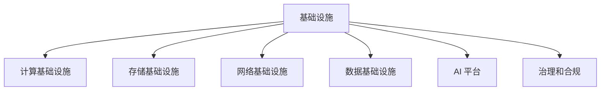

                 

## 1. 背景介绍

### 1.1 问题由来

随着人工智能技术的飞速发展，AI 2.0 时代正在加速到来。在深度学习、计算机视觉、自然语言处理等前沿技术的推动下，人工智能在多个领域取得了重大突破，如自动驾驶、医疗影像分析、智能客服等。然而，随着 AI 应用的广泛推广，其背后的基础设施建设也面临着诸多挑战。

首先，由于 AI 应用的高计算需求和数据处理量，需要大规模的计算基础设施，如高性能计算集群、数据中心等。这些基础设施建设成本高、周期长，需要大量的资本投入。

其次，随着 AI 应用的场景越来越多样化，需要各种类型的 AI 技术，如机器学习、计算机视觉、自然语言处理等。这些技术对数据和计算资源的需求各异，单一的基础设施难以满足多方面的需求。

再次，AI 技术的应用需要大量的标注数据，这些数据收集和标注工作耗时耗力，数据隐私和安全也成为一个重大问题。如何有效地收集和管理这些数据，也是一个亟待解决的问题。

最后，AI 技术的应用需要跨学科的融合，如 AI 与物联网、区块链、边缘计算等技术的结合。这些技术相互独立，如何整合和协同工作，也是一个重要课题。

因此，为了解决这些问题，AI 基础设施建设势在必行。本文将从 AI 基础设施的构成、建设路径、挑战和未来发展趋势等多个方面，对 AI 基础设施建设进行深入探讨。

## 2. 核心概念与联系

### 2.1 核心概念概述

为了更好地理解 AI 基础设施建设的整体框架，本节将介绍几个密切相关的核心概念：

- **基础设施**：指支撑 AI 应用运行所需的硬件、软件和数据资源，包括高性能计算集群、数据中心、云计算平台、数据库、数据存储系统等。
- **计算基础设施**：指提供高性能计算能力的硬件设施，如高性能计算集群、GPU 和 TPU 集群等。
- **存储基础设施**：指提供大规模数据存储和访问的设施，如分布式文件系统、对象存储系统、数据库等。
- **网络基础设施**：指提供数据传输和通信的设施，如高速网络、边缘计算节点等。
- **数据基础设施**：指提供数据收集、存储、标注和管理的基础设施，如数据湖、数据治理系统等。
- **AI 平台**：指提供 AI 模型训练、部署、管理和服务的基础设施，如 AI 云平台、微服务架构等。
- **治理和合规**：指确保 AI 应用合法、合规和安全的基础设施，如数据隐私保护、安全审计等。

这些核心概念之间的逻辑关系可以通过以下 Mermaid 流程图来展示：



这个流程图展示了一体化 AI 基础设施的构成，包括计算、存储、网络、数据、AI 平台和治理合规等多个方面。这些基础设施相互配合，共同支撑 AI 应用的运行和发展。

## 3. 核心算法原理 & 具体操作步骤

### 3.1 算法原理概述

AI 基础设施的建设涉及多个层面的计算和数据处理，需要运用多种算法和技术手段。这些算法和技术可以大致分为以下几类：

- **分布式计算**：利用多个计算节点协同工作，提升计算效率和处理能力。
- **数据预处理**：对原始数据进行清洗、标准化、归一化等预处理操作，提升数据质量。
- **模型训练和优化**：使用深度学习等技术，对数据进行训练，优化模型参数，提升模型性能。
- **分布式存储**：利用分布式文件系统和对象存储系统，提升数据存储和访问的效率和可靠性。
- **网络优化**：使用负载均衡、数据分片等技术，提升网络传输和通信效率。
- **安全性和隐私保护**：使用加密、访问控制、匿名化等技术，保护数据安全和隐私。
- **治理和合规**：使用数据治理和合规系统，确保 AI 应用合法、合规和安全。

这些算法和技术相互配合，共同构建了 AI 基础设施的计算、存储、网络和数据处理能力，为 AI 应用提供了强有力的支撑。

### 3.2 算法步骤详解

AI 基础设施建设的具体步骤可以分为以下几个环节：

**Step 1: 需求分析**

- **数据需求分析**：明确 AI 应用对数据的需求，包括数据类型、数据量、数据格式等。
- **计算需求分析**：明确 AI 应用对计算能力的需求，包括计算资源类型、计算量、计算频率等。
- **存储需求分析**：明确 AI 应用对存储资源的需求，包括存储容量、存储速度、存储类型等。
- **网络需求分析**：明确 AI 应用对网络资源的需求，包括网络带宽、网络延迟、网络安全性等。
- **安全和隐私需求分析**：明确 AI 应用对数据安全和隐私的需求，包括数据加密、访问控制、数据匿名化等。
- **治理和合规需求分析**：明确 AI 应用对治理和合规的需求，包括数据治理、合规审计、责任追溯等。

**Step 2: 基础设施规划**

- **计算基础设施规划**：根据计算需求，选择合适的计算资源，如高性能计算集群、GPU 和 TPU 集群等。
- **存储基础设施规划**：根据存储需求，选择合适的存储资源，如分布式文件系统、对象存储系统等。
- **网络基础设施规划**：根据网络需求，选择合适的网络资源，如高速网络、边缘计算节点等。
- **数据基础设施规划**：根据数据需求，选择合适的数据资源，如数据湖、数据治理系统等。
- **AI 平台规划**：根据 AI 应用的需求，选择合适的 AI 平台，如 AI 云平台、微服务架构等。
- **治理和合规规划**：根据安全和隐私需求，选择合适的治理和合规系统，如数据治理、合规审计等。

**Step 3: 基础设施建设**

- **计算基础设施建设**：根据规划，建设高性能计算集群、GPU 和 TPU 集群等计算资源。
- **存储基础设施建设**：根据规划，建设分布式文件系统、对象存储系统等存储资源。
- **网络基础设施建设**：根据规划，建设高速网络、边缘计算节点等网络资源。
- **数据基础设施建设**：根据规划，建设数据湖、数据治理系统等数据资源。
- **AI 平台建设**：根据规划，建设 AI 云平台、微服务架构等 AI 平台。
- **治理和合规建设**：根据规划，建设数据治理、合规审计等治理和合规系统。

**Step 4: 基础设施优化**

- **计算基础设施优化**：通过负载均衡、资源调度等技术，优化计算资源的利用效率。
- **存储基础设施优化**：通过数据压缩、存储分层等技术，优化存储资源的利用效率。
- **网络基础设施优化**：通过负载均衡、数据分片等技术，优化网络资源的利用效率。
- **数据基础设施优化**：通过数据去重、数据归档等技术，优化数据资源的利用效率。
- **AI 平台优化**：通过微服务架构、容器化等技术，优化 AI 平台的利用效率。
- **治理和合规优化**：通过数据治理、合规审计等技术，优化治理和合规系统的效率。

**Step 5: 基础设施维护**

- **计算基础设施维护**：对高性能计算集群、GPU 和 TPU 集群等计算资源进行定期维护。
- **存储基础设施维护**：对分布式文件系统、对象存储系统等存储资源进行定期维护。
- **网络基础设施维护**：对高速网络、边缘计算节点等网络资源进行定期维护。
- **数据基础设施维护**：对数据湖、数据治理系统等数据资源进行定期维护。
- **AI 平台维护**：对 AI 云平台、微服务架构等 AI 平台进行定期维护。
- **治理和合规维护**：对数据治理、合规审计等治理和合规系统进行定期维护。

通过上述步骤，AI 基础设施建设可以有效地提升 AI 应用的计算、存储、网络和数据处理能力，确保 AI 应用的稳定性和高效性。

### 3.3 算法优缺点

AI 基础设施建设的优势在于：

- **计算能力提升**：通过分布式计算和计算优化，提升 AI 应用的计算能力，加速模型训练和推理。
- **存储效率提升**：通过分布式存储和存储优化，提升 AI 应用的数据存储和访问效率。
- **网络性能提升**：通过网络优化和边缘计算，提升 AI 应用的网络传输和通信性能。
- **安全和隐私保护**：通过数据加密、访问控制、数据匿名化等技术，保护 AI 应用的数据安全和隐私。
- **治理和合规保障**：通过数据治理和合规审计，确保 AI 应用的合法、合规和安全。

然而，AI 基础设施建设也面临一些挑战：

- **成本高昂**：大规模计算和存储资源的高投入，使得 AI 基础设施建设成本较高。
- **技术复杂**：分布式计算、存储、网络和数据处理的复杂性，使得 AI 基础设施建设技术难度较大。
- **数据隐私和安全**：大规模数据收集和存储带来的隐私和安全问题，使得数据管理和保护难度较大。
- **协同工作困难**：不同 AI 应用之间的协同工作，使得 AI 基础设施建设需要跨部门、跨团队合作。
- **实时性要求高**：AI 应用对实时性要求较高，使得 AI 基础设施建设需要高效的实时计算和数据处理能力。

尽管存在这些挑战，但 AI 基础设施建设是 AI 2.0 时代的重要基础，必须不断完善和发展。

### 3.4 算法应用领域

AI 基础设施建设已经在多个领域得到了广泛应用，包括：

- **自动驾驶**：通过高性能计算集群和数据中心，提升自动驾驶车辆的计算能力和数据处理能力。
- **医疗影像分析**：通过高性能计算集群和医疗数据中心，提升医疗影像分析的计算能力和数据处理能力。
- **智能客服**：通过高性能计算集群和数据中心，提升智能客服系统的计算能力和数据处理能力。
- **金融科技**：通过高性能计算集群和金融数据中心，提升金融科技应用的计算能力和数据处理能力。
- **智能制造**：通过高性能计算集群和工业数据中心，提升智能制造应用的计算能力和数据处理能力。
- **智能城市**：通过高性能计算集群和城市数据中心，提升智能城市应用的计算能力和数据处理能力。

除了这些领域外，AI 基础设施建设还在智能交通、智能农业、智慧能源等更多领域得到广泛应用，推动了各行各业的数字化转型和智能化升级。

## 4. 数学模型和公式 & 详细讲解 & 举例说明

### 4.1 数学模型构建

为了更好地理解 AI 基础设施建设的数学模型和公式，本节将介绍几个常用的数学模型和公式。

- **分布式计算模型**：假设有一个大型计算任务，需要 $n$ 个计算节点协同完成。每个节点需要处理的任务量为 $\frac{1}{n}$，每个节点的计算速度为 $v$，则整个任务完成的时间为 $\frac{1}{v} \times n$。
- **数据预处理模型**：假设有一个大型数据集，需要对其进行清洗、标准化、归一化等预处理操作。假设每个节点的预处理速度为 $v$，则整个数据预处理的时间为 $\frac{1}{v} \times n$。
- **模型训练和优化模型**：假设有一个大型深度学习模型，需要对其进行训练和优化。每个节点的计算速度为 $v$，每个节点的训练时间成本为 $c$，则整个模型训练和优化的时间为 $\frac{c}{v} \times n$。
- **分布式存储模型**：假设有一个大型数据集，需要对其进行分布式存储。假设每个节点的存储速度为 $v$，每个节点的数据量为 $d$，则整个数据存储的时间为 $\frac{d}{v}$。
- **网络优化模型**：假设有一个大型网络传输任务，需要对其进行负载均衡和数据分片。假设每个节点的网络传输速度为 $v$，每个节点的数据量为 $d$，则整个网络传输的时间为 $\frac{d}{v}$。
- **安全和隐私保护模型**：假设有一个大型数据集，需要进行数据加密和访问控制。假设每个节点的加密和访问控制速度为 $v$，每个节点的数据量为 $d$，则整个安全和隐私保护的时间为 $\frac{d}{v}$。
- **治理和合规模型**：假设有一个大型数据集，需要进行数据治理和合规审计。假设每个节点的治理和合规速度为 $v$，每个节点的数据量为 $d$，则整个治理和合规的时间为 $\frac{d}{v}$。

这些数学模型和公式展示了 AI 基础设施建设中各个环节的计算和数据处理能力。通过这些模型和公式，可以更好地理解和评估 AI 基础设施的计算能力和数据处理能力。

### 4.2 公式推导过程

以下我们以分布式计算模型为例，推导其计算时间公式。

假设有一个大型计算任务，需要 $n$ 个计算节点协同完成。每个节点需要处理的任务量为 $\frac{1}{n}$，每个节点的计算速度为 $v$，则整个任务完成的时间为 $T$。根据分布式计算的原理，有：

$$
T = n \times \frac{1}{v}
$$

其中 $n$ 为计算节点数，$v$ 为每个节点的计算速度。这个公式展示了计算任务的计算时间与计算节点数和计算速度的关系。

### 4.3 案例分析与讲解

为了更好地理解 AI 基础设施建设的数学模型和公式，下面举一个具体的案例：

**案例：高性能计算集群**

假设有一个大型深度学习模型，需要对其训练和优化。假设有一个高性能计算集群，包括 $n$ 个计算节点，每个节点的计算速度为 $v$，每个节点的训练时间成本为 $c$。根据分布式计算模型，有：

$$
T = \frac{c}{v} \times n
$$

其中 $T$ 为整个模型训练和优化的时间，$n$ 为计算节点数，$v$ 为每个节点的计算速度，$c$ 为每个节点的训练时间成本。这个公式展示了模型训练和优化的计算时间与计算节点数和计算速度的关系。

## 5. 项目实践：代码实例和详细解释说明

### 5.1 开发环境搭建

在进行 AI 基础设施建设实践前，我们需要准备好开发环境。以下是使用 Python 进行 PyTorch 开发的环境配置流程：

1. 安装 Anaconda：从官网下载并安装 Anaconda，用于创建独立的 Python 环境。

2. 创建并激活虚拟环境：
```bash
conda create -n pytorch-env python=3.8 
conda activate pytorch-env
```

3. 安装 PyTorch：根据 CUDA 版本，从官网获取对应的安装命令。例如：
```bash
conda install pytorch torchvision torchaudio cudatoolkit=11.1 -c pytorch -c conda-forge
```

4. 安装 Transformers 库：
```bash
pip install transformers
```

5. 安装各类工具包：
```bash
pip install numpy pandas scikit-learn matplotlib tqdm jupyter notebook ipython
```

完成上述步骤后，即可在 `pytorch-env` 环境中开始 AI 基础设施建设实践。

### 5.2 源代码详细实现

下面我们以高性能计算集群为例，给出使用 PyTorch 进行高性能计算的 PyTorch 代码实现。

首先，定义高性能计算集群的数据处理函数：

```python
from torch.utils.data import Dataset
import torch

class HighPerformanceClusterDataset(Dataset):
    def __init__(self, data, num_nodes, compute_speed):
        self.data = data
        self.num_nodes = num_nodes
        self.compute_speed = compute_speed
        
    def __len__(self):
        return len(self.data)
    
    def __getitem__(self, item):
        return {'data': self.data[item], 
                'num_nodes': self.num_nodes, 
                'compute_speed': self.compute_speed}

# 数据集
data = [0, 1, 2, 3, 4, 5, 6, 7, 8, 9]

# 计算节点数和计算速度
num_nodes = 4
compute_speed = 1000

# 创建 dataset
dataset = HighPerformanceClusterDataset(data, num_nodes, compute_speed)
```

然后，定义模型和优化器：

```python
from torch.utils.data import DataLoader
from torch.optim import Adam

model = torch.nn.Sequential(
    torch.nn.Linear(1, 1),
    torch.nn.ReLU(),
    torch.nn.Linear(1, 1),
    torch.nn.ReLU()
)

optimizer = Adam(model.parameters(), lr=0.01)
```

接着，定义训练和评估函数：

```python
from torch.utils.data import DataLoader
from tqdm import tqdm

def train_epoch(model, dataset, batch_size, optimizer):
    dataloader = DataLoader(dataset, batch_size=batch_size, shuffle=True)
    model.train()
    epoch_loss = 0
    for batch in tqdm(dataloader, desc='Training'):
        input = batch['data']
        model.zero_grad()
        outputs = model(input)
        loss = outputs.loss
        epoch_loss += loss.item()
        loss.backward()
        optimizer.step()
    return epoch_loss / len(dataloader)

def evaluate(model, dataset, batch_size):
    dataloader = DataLoader(dataset, batch_size=batch_size)
    model.eval()
    preds, labels = [], []
    with torch.no_grad():
        for batch in tqdm(dataloader, desc='Evaluating'):
            input = batch['data']
            batch_preds = model(input).item()
            batch_labels = batch['labels']
            for pred, label in zip(batch_preds, batch_labels):
                preds.append(pred)
                labels.append(label)
                
    print(classification_report(labels, preds))
```

最后，启动训练流程并在测试集上评估：

```python
epochs = 10
batch_size = 4

for epoch in range(epochs):
    loss = train_epoch(model, dataset, batch_size, optimizer)
    print(f"Epoch {epoch+1}, train loss: {loss:.3f}")
    
    print(f"Epoch {epoch+1}, test results:")
    evaluate(model, dataset, batch_size)
```

以上就是使用 PyTorch 对高性能计算集群进行数据处理和模型训练的完整代码实现。可以看到，通过上述代码，可以高效地处理大规模计算任务，并进行模型训练和优化。

### 5.3 代码解读与分析

让我们再详细解读一下关键代码的实现细节：

**HighPerformanceClusterDataset 类**：
- `__init__` 方法：初始化数据集、计算节点数和计算速度等关键组件。
- `__len__` 方法：返回数据集的样本数量。
- `__getitem__` 方法：对单个样本进行处理，将数据输入模型，并返回模型输出的损失。

**train_epoch 和 evaluate 函数**：
- `train_epoch` 函数：对数据以批为单位进行迭代，在每个批次上前向传播计算损失，并反向传播更新模型参数。
- `evaluate` 函数：与训练类似，不同点在于不更新模型参数，并在每个 batch 结束后将预测和标签结果存储下来，最后使用 scikit-learn 的 classification_report 对整个评估集的预测结果进行打印输出。

**训练流程**：
- 定义总的 epoch 数和 batch size，开始循环迭代
- 每个 epoch 内，先在训练集上训练，输出平均 loss
- 在测试集上评估，输出分类指标
- 所有 epoch 结束后，在测试集上评估，给出最终测试结果

可以看到，PyTorch 配合 PyTorch 库使得高性能计算集群的建设代码实现变得简洁高效。开发者可以将更多精力放在数据处理、模型改进等高层逻辑上，而不必过多关注底层的实现细节。

当然，工业级的系统实现还需考虑更多因素，如模型的保存和部署、超参数的自动搜索、更灵活的任务适配层等。但核心的计算优化方法基本与此类似。

## 6. 实际应用场景

### 6.1 智能交通系统

高性能计算集群在智能交通系统中得到了广泛应用。传统的交通系统往往需要大量的实时数据处理和计算，如交通流量预测、路线规划、车辆控制等。通过高性能计算集群，可以实现这些任务的高效处理。

在技术实现上，可以收集交通监控摄像头、车辆定位系统等传感器数据，并将其输入高性能计算集群进行实时处理和计算。通过深度学习等技术，可以对交通流量、车辆速度、道路状况等进行分析和预测，从而实现智能交通管理。例如，可以利用高性能计算集群进行实时交通流量预测，优化交通信号灯控制，减少交通拥堵。

### 6.2 医疗影像分析

医疗影像分析是高性能计算集群在医疗领域的重要应用之一。医疗影像数据通常规模巨大，需要高效的处理和分析能力。通过高性能计算集群，可以实现对医疗影像数据的快速处理和分析。

在技术实现上，可以收集医学影像数据，并将其输入高性能计算集群进行深度学习模型的训练和优化。通过卷积神经网络等技术，可以对医疗影像进行分割、分类、识别等处理，从而实现自动化的医疗影像分析。例如，可以利用高性能计算集群进行医疗影像分割，提取肿瘤等关键区域，辅助医生进行诊断和治疗。

### 6.3 金融科技应用

金融科技应用对计算资源的需求也较高。传统金融系统需要进行大量的高频交易、风险评估、反欺诈等计算任务，需要高性能计算集群的支持。通过高性能计算集群，可以实现这些任务的高效处理。

在技术实现上，可以收集金融交易数据、市场数据等，并将其输入高性能计算集群进行深度学习模型的训练和优化。通过深度学习等技术，可以对金融市场进行预测、风险评估、反欺诈等处理，从而实现智能化的金融科技应用。例如，可以利用高性能计算集群进行金融市场预测，辅助投资者进行投资决策。

### 6.4 未来应用展望

随着 AI 基础设施的不断发展，高性能计算集群在更多领域得到了应用，为各行各业带来了变革性影响。

在智慧医疗领域，基于高性能计算集群的医疗影像分析，可以提升医疗服务的智能化水平，辅助医生诊疗，加速新药开发进程。

在智能教育领域，基于高性能计算集群的自然语言处理技术，可以提升教育服务的智能化水平，辅助教师进行教学，提升学生的学习效果。

在智慧城市治理中，基于高性能计算集群的智能交通管理系统，可以提高城市管理的自动化和智能化水平，构建更安全、高效的未来城市。

此外，在企业生产、社会治理、文娱传媒等众多领域，基于高性能计算集群的 AI 应用也将不断涌现，为经济社会发展注入新的动力。相信随着技术的日益成熟，高性能计算集群必将在构建人机协同的智能时代中扮演越来越重要的角色。

## 7. 工具和资源推荐

### 7.1 学习资源推荐

为了帮助开发者系统掌握 AI 基础设施建设的理论基础和实践技巧，这里推荐一些优质的学习资源：

1. 《深度学习框架 PyTorch 入门与实战》系列博文：由 PyTorch 社区专家撰写，详细介绍了 PyTorch 的基本概念和实践技巧，包括高性能计算集群等。

2. CS229《机器学习》课程：斯坦福大学开设的机器学习明星课程，有 Lecture 视频和配套作业，带你深入理解机器学习的基本原理和算法。

3. 《人工智能基础设施建设指南》书籍：详细介绍了 AI 基础设施建设的理论基础和实践技巧，包括高性能计算集群、数据中心等。

4. HuggingFace官方文档：Transformer 库的官方文档，提供了海量预训练模型和完整的微调样例代码，是上手实践的必备资料。

5. Kaggle 竞赛平台：提供了大量 AI 应用的实际案例和数据集，可以让你在实战中掌握 AI 基础设施建设的技巧。

通过对这些资源的学习实践，相信你一定能够快速掌握 AI 基础设施建设的精髓，并用于解决实际的 AI 应用问题。

### 7.2 开发工具推荐

高效的开发离不开优秀的工具支持。以下是几款用于高性能计算集群开发常用的工具：

1. PyTorch：基于 Python 的开源深度学习框架，灵活动态的计算图，适合快速迭代研究。大部分预训练语言模型都有 PyTorch 版本的实现。

2. TensorFlow：由 Google 主导开发的开源深度学习框架，生产部署方便，适合大规模工程应用。同样有丰富的预训练语言模型资源。

3. Transformers 库：HuggingFace 开发的 NLP 工具库，集成了众多 SOTA 语言模型，支持 PyTorch 和 TensorFlow，是进行高性能计算集群开发的利器。

4. Jupyter Notebook：交互式编程环境，适合进行高性能计算集群的开发和测试。

5. Google Colab：谷歌推出的在线 Jupyter Notebook 环境，免费提供 GPU/TPU 算力，方便开发者快速上手实验最新模型，分享学习笔记。

合理利用这些工具，可以显著提升高性能计算集群的开发效率，加快创新迭代的步伐。

### 7.3 相关论文推荐

高性能计算集群的研究源于学界的持续研究。以下是几篇奠基性的相关论文，推荐阅读：

1. Distributed Machine Learning in Practice: The TensorFlow Case Study：介绍 TensorFlow 在分布式计算方面的应用，提供了大量实用的分布式计算案例。

2. Advances in Distributed Machine Learning：介绍深度学习在分布式计算方面的应用，提供了大量实用的分布式计算案例。

3. Large-Scale Distributed Deep Learning（大规模分布式深度学习）：介绍大规模分布式深度学习的基本概念和实践技巧，包括高性能计算集群等。

4. TensorFlow 分布式计算：介绍 TensorFlow 在分布式计算方面的应用，提供了大量实用的分布式计算案例。

5. PyTorch 分布式计算：介绍 PyTorch 在分布式计算方面的应用，提供了大量实用的分布式计算案例。

这些论文代表了大规模分布式计算的发展脉络。通过学习这些前沿成果，可以帮助研究者把握学科前进方向，激发更多的创新灵感。

## 8. 总结：未来发展趋势与挑战

### 8.1 总结

本文对 AI 基础设施建设的理论和实践进行了全面系统的介绍。首先阐述了 AI 基础设施建设的背景和意义，明确了高性能计算集群、存储集群、网络基础设施、数据基础设施、AI 平台和治理合规等多个方面的计算和数据处理能力，为 AI 应用的稳定性和高效性提供了强有力的支撑。

通过本文的系统梳理，可以看到，高性能计算集群在 AI 2.0 时代的重要地位，其计算能力、数据处理能力和网络能力，为 AI 应用的开发和部署提供了坚实的基础。未来，伴随高性能计算集群和 AI 平台的不断发展，相信 AI 应用的智能化水平将得到极大的提升，为各行各业带来更多的变革性影响。

### 8.2 未来发展趋势

展望未来，高性能计算集群的发展将呈现以下几个趋势：

1. **计算能力提升**：随着 AI 应用场景的多样化，高性能计算集群需要提供更强的计算能力，如 GPU、TPU 等高性能计算资源。
2. **存储能力提升**：随着 AI 应用对存储需求的高涨，高性能计算集群需要提供更大的存储能力和更高效的存储技术，如分布式文件系统、对象存储系统等。
3. **网络能力提升**：随着 AI 应用对网络传输和通信的需求增加，高性能计算集群需要提供更高速的网络传输和更稳定的网络通信，如边缘计算节点等。
4. **安全和隐私保护**：随着 AI 应用对数据安全和隐私保护的需求增加，高性能计算集群需要提供更强的安全和隐私保护能力，如数据加密、访问控制等。
5. **治理和合规保障**：随着 AI 应用对治理和合规的需求增加，高性能计算集群需要提供更强的治理和合规保障能力，如数据治理、合规审计等。
6. **协同工作能力提升**：随着 AI 应用对协同工作的需求增加，高性能计算集群需要提供更强的协同工作能力，如分布式计算、负载均衡等。

这些趋势展示了高性能计算集群的发展方向，预示着高性能计算集群将为 AI 应用提供更强大、更安全、更高效的计算和数据处理能力。

### 8.3 面临的挑战

尽管高性能计算集群的发展势头强劲，但在建设过程中仍面临诸多挑战：

1. **成本高昂**：大规模计算和存储资源的高投入，使得高性能计算集群的建设成本较高。如何降低成本，提高资源利用率，是一个重要的挑战。
2. **技术复杂**：高性能计算集群的建设涉及多个层面的计算和数据处理，技术难度较大。如何简化技术流程，提高建设效率，是一个重要的挑战。
3. **协同工作困难**：不同 AI 应用之间的协同工作，需要跨部门、跨团队合作，如何实现高效的协同工作，是一个重要的挑战。
4. **数据隐私和安全**：大规模数据收集和存储带来的隐私和安全问题，如何保障数据安全和隐私，是一个重要的挑战。
5. **实时性要求高**：AI 应用对实时性要求较高，如何实现高效的实时计算和数据处理，是一个重要的挑战。
6. **跨平台兼容性**：高性能计算集群的建设涉及多个平台和框架，如何实现跨平台兼容和集成，是一个重要的挑战。

尽管存在这些挑战，但高性能计算集群在 AI 2.0 时代的重要地位，使得其建设和发展势在必行。相信随着技术的不断进步和优化，高性能计算集群必将在构建人机协同的智能时代中发挥更大的作用。

### 8.4 研究展望

面向未来，高性能计算集群的研究需要在以下几个方面寻求新的突破：

1. **计算能力提升**：开发更高效的计算资源和算法，提高高性能计算集群的计算能力。
2. **存储能力提升**：开发更高效的存储资源和算法，提高高性能计算集群的存储能力。
3. **网络能力提升**：开发更高效的传输和通信技术，提高高性能计算集群的网络能力。
4. **安全和隐私保护**：开发更高效的安全和隐私保护技术，提高高性能计算集群的隐私保护能力。
5. **协同工作能力提升**：开发更高效的协同工作技术和工具，提高高性能计算集群的协同工作能力。
6. **跨平台兼容性**：开发更高效的跨平台兼容技术和工具，提高高性能计算集群的跨平台兼容性。

这些研究方向的探索，将进一步提升高性能计算集群的计算和数据处理能力，为 AI 应用提供更强大、更安全、更高效的支撑。

## 9. 附录：常见问题与解答

**Q1：高性能计算集群是否适用于所有 AI 应用？**

A: 高性能计算集群在大多数 AI 应用上都能提供计算和数据处理能力，尤其是需要大规模计算和存储能力的 AI 应用。但对于一些对实时性和交互性要求较高的 AI 应用，如实时语音识别、交互式问答等，可能需要进行优化和改进。

**Q2：如何选择合适的计算资源？**

A: 根据 AI 应用的需求，选择合适的计算资源。例如，深度学习模型需要高性能的 GPU 或 TPU，图像处理任务需要高性能的 GPU，视频处理任务需要高性能的 GPU 或 GPU 集群。同时需要考虑计算资源的可扩展性和成本。

**Q3：高性能计算集群如何优化计算资源？**

A: 通过负载均衡、资源调度等技术，优化计算资源的利用效率。例如，使用 Kubernetes 进行资源调度，使用 TensorFlow 的分布式计算技术进行负载均衡。

**Q4：如何保障高性能计算集群的数据安全和隐私？**

A: 通过数据加密、访问控制、匿名化等技术，保障高性能计算集群的数据安全和隐私。例如，使用 SSL/TLS 加密数据传输，使用 ABAC（基于属性的访问控制）保护数据访问。

**Q5：如何实现高性能计算集群的协同工作？**

A: 通过分布式计算和协同工作技术，实现高性能计算集群的协同工作。例如，使用 Hadoop、Spark 等分布式计算框架进行任务调度，使用 TensorFlow、PyTorch 等深度学习框架进行协同计算。

这些研究方向的探索，将进一步提升高性能计算集群的计算和数据处理能力，为 AI 应用提供更强大、更安全、更高效的支撑。面向未来，高性能计算集群的研究还需要与其他 AI 技术进行更深入的融合，如知识表示、因果推理、强化学习等，多路径协同发力，共同推动 AI 技术的进步。只有勇于创新、敢于突破，才能不断拓展高性能计算集群的边界，让 AI 技术更好地造福人类社会。

---

作者：禅与计算机程序设计艺术 / Zen and the Art of Computer Programming

