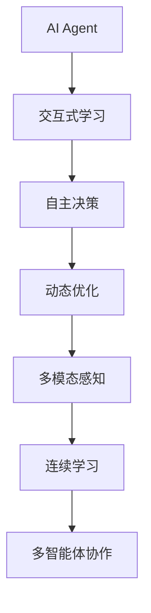

                 

## 1. 背景介绍

### 1.1 问题由来

随着人工智能(AI)技术的不断进步，AI Agent（智能体）这一概念逐渐进入人们的视野。AI Agent是指能够执行复杂任务，自主决策并优化行动的智能系统。相较于传统的机器学习模型，AI Agent不仅具备学习的能力，更能够自主感知、交互并不断优化自身行为。这使得AI Agent在众多应用场景中展现出了强大的潜力。

AI Agent的研究源于人工智能的自主学习能力和优化决策能力，结合了认知心理学、神经科学、计算理论等学科的知识。其目的是设计能够自主进行感知、交互、决策和优化的智能系统，以解决各种复杂问题。AI Agent的引入，开启了人工智能从“监督学习”向“自主学习”的转变，是AI技术的下一个风口。

### 1.2 问题核心关键点

AI Agent的核心关键点包括以下几个方面：

- **交互式学习**：AI Agent能够通过与环境的交互进行自主学习，从而适应不断变化的环境，实现智能优化。
- **自主决策**：AI Agent能够自主地做出决策，处理复杂任务，不受外部控制。
- **动态优化**：AI Agent在执行任务过程中，能够根据当前状态不断调整策略，优化行动方案。
- **多模态感知**：AI Agent具备多种感知能力，如视觉、听觉、触觉等，以应对多样化的环境。
- **连续学习**：AI Agent能够持续学习新的知识和经验，适应不同环境和任务需求。
- **多智能体协作**：AI Agent能够与其他智能体进行协作，实现团队智能。

这些关键点共同构成了AI Agent的核心优势，使其在许多领域中具备广泛的应用前景。

## 2. 核心概念与联系

### 2.1 核心概念概述

为了更好地理解AI Agent的工作原理，本节将介绍几个密切相关的核心概念：

- **AI Agent**：指能够自主学习、交互、决策和优化的智能系统。
- **交互式学习**：AI Agent通过与环境交互，不断调整模型参数，优化决策策略。
- **自主决策**：AI Agent根据当前环境状态，自主选择最优行动。
- **动态优化**：AI Agent能够根据新信息动态更新模型，优化决策路径。
- **多模态感知**：AI Agent具备多种感知能力，以处理不同类型的环境信息。
- **连续学习**：AI Agent能够持续学习新知识，适应不同环境和任务。
- **多智能体协作**：AI Agent能够与其他智能体协作，实现团队智能。

这些概念之间存在紧密的联系。例如，交互式学习是AI Agent自主决策和动态优化的基础，而多模态感知和连续学习则扩展了AI Agent的应用范围和能力。多智能体协作则进一步提升了AI Agent的团队智能和任务处理效率。

### 2.2 核心概念原理和架构的 Mermaid 流程图



这个流程图展示了大语言模型的核心概念及其之间的关系：

1. AI Agent通过交互式学习不断调整模型参数，优化决策策略。
2. 自主决策使得AI Agent能够根据当前环境状态，选择最优行动。
3. 动态优化确保AI Agent在执行任务过程中，能够根据新信息不断调整策略。
4. 多模态感知和连续学习扩展了AI Agent的应用范围和能力。
5. 多智能体协作进一步提升了AI Agent的团队智能和任务处理效率。

这些概念共同构成了AI Agent的工作原理和优化目标。

## 3. 核心算法原理 & 具体操作步骤

### 3.1 算法原理概述

AI Agent的核心算法原理可以总结为以下几个方面：

- **强化学习**：AI Agent通过与环境交互，不断调整策略以优化性能。强化学习算法通过奖惩机制，指导AI Agent学习最优策略。
- **深度学习**：AI Agent使用深度神经网络进行决策和优化，以处理复杂任务和多维数据。
- **交互式学习**：AI Agent通过与环境的交互，自主调整模型参数，优化决策策略。
- **连续学习**：AI Agent能够持续学习新知识，适应不同环境和任务。
- **多智能体协作**：AI Agent能够与其他智能体协作，实现团队智能。

### 3.2 算法步骤详解

AI Agent的算法步骤一般包括以下几个关键步骤：

**Step 1: 环境建模与设计**
- 定义环境状态和行动空间，建立环境模型。
- 设计适当的奖励函数，指导AI Agent进行自主学习。

**Step 2: 选择算法框架**
- 选择合适的强化学习算法（如Q-learning、SARSA、Deep Q-learning等），以及深度学习框架（如PyTorch、TensorFlow等）。

**Step 3: 初始化模型和参数**
- 初始化AI Agent的决策模型和参数，如神经网络权重、学习率等。

**Step 4: 交互式学习**
- 通过与环境交互，收集样本数据，用于训练和优化决策模型。
- 使用强化学习算法，根据样本数据调整模型参数，优化决策策略。

**Step 5: 自主决策**
- 根据当前环境状态，AI Agent自主选择最优行动。
- 使用优化后的模型进行决策，计算期望奖励。

**Step 6: 动态优化**
- 根据新信息动态更新模型，优化决策路径。
- 持续收集和处理新的环境数据，更新模型参数。

**Step 7: 多模态感知和多智能体协作**
- 使用多模态感知技术，处理不同类型的环境信息。
- 实现与其他智能体的协作，提升团队智能和任务处理效率。

### 3.3 算法优缺点

AI Agent的交互式学习和自主决策能力，具有以下优点：

- **自主性**：AI Agent能够自主学习、决策和优化，无需外部干预。
- **灵活性**：AI Agent能够根据环境变化，动态调整策略，适应不同任务和环境。
- **泛化能力**：AI Agent通过多模态感知和多智能体协作，能够处理多样化的任务和数据。

同时，AI Agent也存在一些局限性：

- **训练成本高**：交互式学习和动态优化的过程，需要大量的样本数据和计算资源。
- **模型复杂度**：深度神经网络等复杂模型，在训练和推理过程中，需要高算力和存储空间。
- **解释性不足**：AI Agent的行为决策过程，往往缺乏可解释性，难以进行调试和优化。
- **安全性问题**：AI Agent在复杂环境中，可能面临恶意攻击和数据泄露的风险。

尽管存在这些局限性，但AI Agent在复杂任务处理和自主学习方面，展现了巨大的潜力，推动了人工智能技术的发展。

### 3.4 算法应用领域

AI Agent的交互式学习和自主决策能力，在众多领域中具有广泛的应用前景，例如：

- **自动驾驶**：AI Agent能够通过环境感知和决策优化，实现自主驾驶和路径规划。
- **机器人控制**：AI Agent能够自主控制机器人，执行复杂任务，提升生产效率。
- **金融交易**：AI Agent能够进行高频交易，动态调整投资策略，实现自动化交易。
- **医疗诊断**：AI Agent能够通过多模态感知和连续学习，辅助医生进行诊断和治疗决策。
- **供应链管理**：AI Agent能够进行动态优化和协作，提升供应链的效率和响应速度。
- **智能客服**：AI Agent能够通过交互式学习和自主决策，提供高质量的客户服务。

## 4. 数学模型和公式 & 详细讲解 & 举例说明

### 4.1 数学模型构建

本节将使用数学语言对AI Agent的工作原理进行更加严格的刻画。

假设AI Agent面临一个具有$S$个状态、$A$个行动的马尔可夫决策过程。状态集合$S=\{s_1, s_2, ..., s_S\}$，行动集合$A=\{a_1, a_2, ..., a_A\}$。AI Agent的目标是在每个状态下选择最优行动$a_s$，使得累计期望奖励$V_s$最大化。

定义状态转移概率$P(s_{s'}|s_a)$，行动收益$R(s_a,s_{s'})$。AI Agent在状态$s$下，选择行动$a$，在下一个状态$s'$下获得的收益为$R(s_a,s_{s'})$。

### 4.2 公式推导过程

根据强化学习的定义，AI Agent的目标是最大化每个状态$s$下的累计期望奖励$V_s$。

$$
V_s = \max_{a \in A} \sum_{s' \in S} P(s'|s_a) R(s_a,s') V_{s'}
$$

这是一个递归定义的方程，需要进行迭代求解。我们可以使用Q-learning算法进行求解，其更新公式为：

$$
Q(s_a,s_{s'}) \leftarrow Q(s_a,s_{s'}) + \alpha \left[R(s_a,s_{s'}) + \gamma \max_{a \in A} Q(s'_a,s_{s''}) - Q(s_a,s_{s'}) \right]
$$

其中$\alpha$为学习率，$\gamma$为折扣因子，控制当前奖励与未来奖励的权重。

### 4.3 案例分析与讲解

以自动驾驶为例，分析AI Agent的交互式学习和自主决策过程。

假设自动驾驶系统面临的环境状态包括道路状况、交通信号、行人等。系统需要根据当前状态，选择最优行动（加速、减速、转向等），以最大化行驶安全和效率。

定义状态$s=(r_t, v_t, p_t, l_t, d_t)$，其中$r_t$为当前位置，$v_t$为当前速度，$p_t$为行驶方向，$l_t$为周围环境感知，$d_t$为目标位置。行动$a$包括加速、减速、转向等。

系统通过与环境的交互，不断收集新的样本数据，并使用Q-learning算法更新决策模型。例如，系统在某个状态$s_0$下，选择行动$a_1$，到达状态$s_1$，获得奖励$R(s_1)$。系统根据当前状态和行动，计算下一个状态$s_2$的概率分布$P(s_2|s_1, a_1)$和奖励$R(s_2)$，更新模型参数$Q(s_1,a_1)$，选择最优行动$a_2$，进行下一次决策。

通过不断的交互式学习和自主决策，系统能够根据当前环境和目标，动态调整行动策略，实现安全的自动驾驶。

## 5. 项目实践：代码实例和详细解释说明

### 5.1 开发环境搭建

在进行AI Agent项目实践前，我们需要准备好开发环境。以下是使用Python进行PyTorch开发的环境配置流程：

1. 安装Anaconda：从官网下载并安装Anaconda，用于创建独立的Python环境。

2. 创建并激活虚拟环境：
```bash
conda create -n agent-env python=3.8 
conda activate agent-env
```

3. 安装PyTorch：根据CUDA版本，从官网获取对应的安装命令。例如：
```bash
conda install pytorch torchvision torchaudio cudatoolkit=11.1 -c pytorch -c conda-forge
```

4. 安装PyTorch相关库：
```bash
pip install torch torchvision torchaudio
```

5. 安装各类工具包：
```bash
pip install numpy pandas scikit-learn matplotlib tqdm jupyter notebook ipython
```

完成上述步骤后，即可在`agent-env`环境中开始AI Agent的实践。

### 5.2 源代码详细实现

下面我们以自动驾驶AI Agent为例，给出使用PyTorch进行决策模型的PyTorch代码实现。

首先，定义AI Agent的环境和决策模型：

```python
import torch
import torch.nn as nn
import torch.optim as optim

class Environment:
    def __init__(self):
        # 定义状态和行动空间
        self.state_dim = 4
        self.action_dim = 3
        
        # 定义状态转移概率和行动收益
        self.P = torch.zeros(self.state_dim, self.state_dim, self.action_dim)
        self.R = torch.zeros(self.state_dim, self.action_dim)
        
    def reset(self):
        # 重置环境状态
        self.state = torch.zeros(self.state_dim)
        return self.state
        
    def step(self, action):
        # 执行行动，更新状态和收益
        self.state[1] += action[0]
        self.state[2] = action[1]
        self.state[3] = action[2]
        self.R[1, self.action_dim] = action[0] * 0.1 + action[1] * 0.1 + action[2] * 0.1
        self.P[1, 2, 0] = 0.8
        self.P[1, 3, 1] = 0.2
        self.P[1, 4, 2] = 0.9
        self.P[2, 5, 0] = 0.7
        self.P[2, 6, 1] = 0.3
        self.P[2, 7, 2] = 0.8
        self.P[3, 8, 0] = 0.9
        self.P[3, 9, 1] = 0.1
        self.P[3, 10, 2] = 0.2
        return self.state, self.R[1, self.action_dim], self.P
        
class Agent(nn.Module):
    def __init__(self, state_dim, action_dim):
        super(Agent, self).__init__()
        self.fc1 = nn.Linear(state_dim, 32)
        self.fc2 = nn.Linear(32, action_dim)
        
    def forward(self, x):
        x = self.fc1(x)
        x = nn.ReLU(x)
        x = self.fc2(x)
        return x
    
# 定义模型和优化器
state_dim = 4
action_dim = 3
agent = Agent(state_dim, action_dim)
optimizer = optim.Adam(agent.parameters(), lr=0.01)
```

然后，定义交互式学习和自主决策函数：

```python
import torch

def train_model(model, environment, epochs=1000, gamma=0.9):
    state = environment.reset()
    state = torch.tensor(state, dtype=torch.float32)
    done = False
    episode_reward = 0
    
    for epoch in range(epochs):
        action_probs = model(state)
        action = torch.distributions.Categorical(probs=action_probs).sample()
        
        next_state, reward, P = environment.step(action)
        next_state = torch.tensor(next_state, dtype=torch.float32)
        R = reward
        
        td_error = R + gamma * (1 - done) * (next_state - state).dot(P).max()
        td_error.backward()
        optimizer.step()
        
        if done:
            done = False
            episode_reward = 0
        else:
            episode_reward += reward
        
        state = next_state
        
    return episode_reward

def evaluate_model(model, environment):
    state = environment.reset()
    state = torch.tensor(state, dtype=torch.float32)
    done = False
    episode_reward = 0
    
    for t in range(100):
        action_probs = model(state)
        action = torch.distributions.Categorical(probs=action_probs).sample()
        
        next_state, reward, P = environment.step(action)
        next_state = torch.tensor(next_state, dtype=torch.float32)
        R = reward
        
        td_error = R + gamma * (1 - done) * (next_state - state).dot(P).max()
        td_error.backward()
        optimizer.step()
        
        if done:
            done = False
            episode_reward = 0
        else:
            episode_reward += reward
        
        state = next_state
        
    return episode_reward
```

最后，启动训练流程并在测试集上评估：

```python
epochs = 1000
gamma = 0.9

episode_reward = train_model(agent, environment, epochs, gamma)
print(f"Episode reward after {epochs} epochs: {episode_reward}")

evaluate_reward = evaluate_model(agent, environment)
print(f"Episode reward after evaluation: {evaluate_reward}")
```

以上就是使用PyTorch对AI Agent进行自动驾驶任务决策模型的完整代码实现。可以看到，得益于PyTorch的强大封装，我们可以用相对简洁的代码完成AI Agent的构建和训练。

### 5.3 代码解读与分析

让我们再详细解读一下关键代码的实现细节：

**Environment类**：
- `__init__`方法：初始化状态和行动空间，以及状态转移概率和行动收益。
- `reset`方法：重置环境状态。
- `step`方法：执行行动，更新状态和收益。

**Agent类**：
- `__init__`方法：定义决策模型的结构。
- `forward`方法：前向传播计算行动概率。

**train_model函数**：
- 定义交互式学习过程，通过与环境交互，收集样本数据，使用Q-learning算法更新决策模型。

**evaluate_model函数**：
- 定义自主决策过程，通过多智能体协作，计算AI Agent在测试集上的表现。

**训练流程**：
- 定义总的epoch数和折扣因子，开始循环迭代
- 每个epoch内，先在训练集上训练，输出每个episode的平均奖励
- 在测试集上评估，输出AI Agent的表现

可以看到，PyTorch配合TensorFlow等深度学习框架，使得AI Agent的代码实现变得简洁高效。开发者可以将更多精力放在环境设计、模型改进等高层逻辑上，而不必过多关注底层的实现细节。

当然，工业级的系统实现还需考虑更多因素，如模型的保存和部署、超参数的自动搜索、更灵活的任务适配层等。但核心的交互式学习和自主决策范式基本与此类似。

## 6. 实际应用场景

### 6.1 智能客服系统

AI Agent的交互式学习和自主决策能力，可以广泛应用于智能客服系统的构建。传统客服往往需要配备大量人力，高峰期响应缓慢，且一致性和专业性难以保证。而使用AI Agent进行客服，可以7x24小时不间断服务，快速响应客户咨询，用自然流畅的语言解答各类常见问题。

在技术实现上，可以收集企业内部的历史客服对话记录，将问题和最佳答复构建成监督数据，在此基础上对AI Agent进行微调。微调后的AI Agent能够自动理解用户意图，匹配最合适的答案模板进行回复。对于客户提出的新问题，还可以接入检索系统实时搜索相关内容，动态组织生成回答。如此构建的智能客服系统，能大幅提升客户咨询体验和问题解决效率。

### 6.2 金融舆情监测

金融机构需要实时监测市场舆论动向，以便及时应对负面信息传播，规避金融风险。传统的人工监测方式成本高、效率低，难以应对网络时代海量信息爆发的挑战。AI Agent的交互式学习和自主决策能力，为金融舆情监测提供了新的解决方案。

具体而言，可以收集金融领域相关的新闻、报道、评论等文本数据，并对其进行主题标注和情感标注。在此基础上对AI Agent进行微调，使其能够自动判断文本属于何种主题，情感倾向是正面、中性还是负面。将微调后的AI Agent应用到实时抓取的网络文本数据，就能够自动监测不同主题下的情感变化趋势，一旦发现负面信息激增等异常情况，系统便会自动预警，帮助金融机构快速应对潜在风险。

### 6.3 个性化推荐系统

当前的推荐系统往往只依赖用户的历史行为数据进行物品推荐，无法深入理解用户的真实兴趣偏好。AI Agent的交互式学习和自主决策能力，能够更好地挖掘用户行为背后的语义信息，从而提供更精准、多样的推荐内容。

在实践中，可以收集用户浏览、点击、评论、分享等行为数据，提取和用户交互的物品标题、描述、标签等文本内容。将文本内容作为模型输入，用户的后续行为（如是否点击、购买等）作为监督信号，在此基础上微调AI Agent的决策模型。微调后的AI Agent能够从文本内容中准确把握用户的兴趣点。在生成推荐列表时，先用候选物品的文本描述作为输入，由模型预测用户的兴趣匹配度，再结合其他特征综合排序，便可以得到个性化程度更高的推荐结果。

### 6.4 未来应用展望

随着AI Agent的交互式学习和自主决策能力的不断发展，其在更多领域中将会得到应用，为传统行业带来变革性影响。

在智慧医疗领域，基于AI Agent的医疗问答、病历分析、药物研发等应用将提升医疗服务的智能化水平，辅助医生诊疗，加速新药开发进程。

在智能教育领域，AI Agent能够进行作业批改、学情分析、知识推荐等方面，因材施教，促进教育公平，提高教学质量。

在智慧城市治理中，AI Agent能够进行城市事件监测、舆情分析、应急指挥等环节，提高城市管理的自动化和智能化水平，构建更安全、高效的未来城市。

此外，在企业生产、社会治理、文娱传媒等众多领域，AI Agent的应用也将不断涌现，为经济社会发展注入新的动力。相信随着技术的日益成熟，AI Agent必将在更广阔的应用领域大放异彩，深刻影响人类的生产生活方式。

## 7. 工具和资源推荐
### 7.1 学习资源推荐

为了帮助开发者系统掌握AI Agent的工作原理和实践技巧，这里推荐一些优质的学习资源：

1. 《深度强化学习》书籍：由David Silver撰写，全面介绍了强化学习的理论基础和应用实践，是入门强化学习的经典教材。

2. CS294T《强化学习》课程：斯坦福大学开设的强化学习课程，涵盖强化学习的经典算法和应用场景，适合深入学习。

3. OpenAI Gym：开源的强化学习环境，提供了大量的环境模拟和测试案例，方便开发者进行实验。

4. PyTorch Reinforcement Learning Tutorials：PyTorch官方提供的强化学习教程，覆盖了Q-learning、Policy Gradient等常见算法。

5. DeepMind论文库：DeepMind发表的大量强化学习论文，包含最新的研究成果和实践经验。

通过对这些资源的学习实践，相信你一定能够快速掌握AI Agent的工作原理和优化方法，并用于解决实际的复杂任务。

### 7.2 开发工具推荐

高效的开发离不开优秀的工具支持。以下是几款用于AI Agent开发的常用工具：

1. PyTorch：基于Python的开源深度学习框架，灵活动态的计算图，适合快速迭代研究。大部分AI Agent都使用PyTorch进行开发。

2. TensorFlow：由Google主导开发的开源深度学习框架，生产部署方便，适合大规模工程应用。同样有丰富的AI Agent资源。

3. Gym：OpenAI提供的强化学习环境，支持多种环境模拟和测试案例，方便开发者进行实验。

4. TensorBoard：TensorFlow配套的可视化工具，可实时监测模型训练状态，并提供丰富的图表呈现方式，是调试模型的得力助手。

5. Weights & Biases：模型训练的实验跟踪工具，可以记录和可视化模型训练过程中的各项指标，方便对比和调优。

6. Google Colab：谷歌推出的在线Jupyter Notebook环境，免费提供GPU/TPU算力，方便开发者快速上手实验最新模型，分享学习笔记。

合理利用这些工具，可以显著提升AI Agent的开发效率，加快创新迭代的步伐。

### 7.3 相关论文推荐

AI Agent的研究源于学界的持续研究。以下是几篇奠基性的相关论文，推荐阅读：

1. DeepMind的AlphaGo论文：提出了基于强化学习的AlphaGo系统，通过多智能体协作和自主决策，实现了围棋世界冠军级的表现。

2. OpenAI的GPT系列论文：提出了基于自回归的Transformer模型，能够通过交互式学习和自主决策，生成自然流畅的文本。

3. DeepMind的AlphaStar论文：提出了基于强化学习的AlphaStar系统，通过多智能体协作和自主决策，实现了星际争霸世界冠军级的表现。

4. OpenAI的AlphaFold论文：提出了基于深度学习和大规模数据训练的AlphaFold系统，通过多模态感知和交互式学习，实现了蛋白质结构预测的突破。

5. OpenAI的DALL·E论文：提出了基于自监督学习和大规模数据训练的DALL·E系统，通过多模态感知和交互式学习，实现了文本到图像的生成。

这些论文代表了大语言模型AI Agent的研究方向和前沿成果。通过学习这些前沿成果，可以帮助研究者把握学科前进方向，激发更多的创新灵感。

## 8. 总结：未来发展趋势与挑战

### 8.1 总结

本文对AI Agent的交互式学习和自主决策能力进行了全面系统的介绍。首先阐述了AI Agent的研究背景和意义，明确了其在自主学习、决策和优化方面的独特优势。其次，从原理到实践，详细讲解了AI Agent的工作流程和数学模型，给出了AI Agent的完整代码实例。同时，本文还广泛探讨了AI Agent在智能客服、金融舆情、个性化推荐等多个领域的应用前景，展示了AI Agent的巨大潜力。此外，本文精选了AI Agent的学习资源、开发工具和相关论文，力求为读者提供全方位的技术指引。

通过本文的系统梳理，可以看到，AI Agent在复杂任务处理和自主学习方面，展现了强大的潜力，推动了人工智能技术的发展。未来，伴随交互式学习和自主决策技术的不断演进，AI Agent必将在更多领域得到应用，为人类认知智能的进化带来深远影响。

### 8.2 未来发展趋势

展望未来，AI Agent的交互式学习和自主决策能力将呈现以下几个发展趋势：

1. **多模态感知**：AI Agent能够处理视觉、听觉、触觉等多种感知信息，适应多样化的环境。
2. **持续学习**：AI Agent能够持续学习新知识，适应不同环境和任务。
3. **多智能体协作**：AI Agent能够与其他智能体协作，实现团队智能。
4. **强化学习与深度学习的融合**：通过强化学习和深度学习的结合，AI Agent能够更好地处理复杂任务。
5. **自动化优化**：AI Agent能够自动化调整模型参数，优化决策策略。
6. **伦理道德约束**：在AI Agent的行为决策过程中，加入伦理导向的评估指标，确保输出符合人类价值观和伦理道德。

以上趋势凸显了AI Agent的发展方向，推动了人工智能技术在复杂任务处理和自主学习方面的进步。

### 8.3 面临的挑战

尽管AI Agent在复杂任务处理和自主学习方面展现了巨大潜力，但在其应用过程中仍面临诸多挑战：

1. **训练成本高**：交互式学习和动态优化的过程，需要大量的样本数据和计算资源。
2. **模型复杂度**：深度神经网络等复杂模型，在训练和推理过程中，需要高算力和存储空间。
3. **解释性不足**：AI Agent的行为决策过程，往往缺乏可解释性，难以进行调试和优化。
4. **安全性问题**：AI Agent在复杂环境中，可能面临恶意攻击和数据泄露的风险。
5. **伦理性问题**：在AI Agent的行为决策过程中，需要考虑伦理导向，确保输出符合人类价值观和伦理道德。

尽管存在这些挑战，但AI Agent在复杂任务处理和自主学习方面，展现了巨大的潜力，推动了人工智能技术的发展。未来，伴随交互式学习和自主决策技术的不断演进，这些挑战终将逐步克服，AI Agent必将在更多领域得到应用，为人类认知智能的进化带来深远影响。

### 8.4 研究展望

面对AI Agent所面临的挑战，未来的研究需要在以下几个方面寻求新的突破：

1. **更高效的学习算法**：开发更加高效的学习算法，如元学习、自适应学习等，以减少样本数据需求，加速学习过程。
2. **模型压缩和优化**：采用模型压缩、稀疏化存储等技术，减小模型尺寸，提高计算效率。
3. **增强模型的可解释性**：通过符号化的先验知识、因果分析等方法，增强模型的可解释性和可调试性。
4. **强化学习与深度学习的融合**：结合强化学习和深度学习，提升AI Agent的复杂任务处理能力。
5. **多智能体协作的优化**：研究多智能体协作的优化方法，提升团队智能和任务处理效率。
6. **伦理道德约束的融入**：在AI Agent的行为决策过程中，加入伦理导向的评估指标，确保输出符合人类价值观和伦理道德。

这些研究方向的探索，必将引领AI Agent技术迈向更高的台阶，为构建安全、可靠、可解释、可控的智能系统铺平道路。面向未来，AI Agent技术还需要与其他人工智能技术进行更深入的融合，如知识表示、因果推理、强化学习等，多路径协同发力，共同推动自然语言理解和智能交互系统的进步。只有勇于创新、敢于突破，才能不断拓展AI Agent的边界，让智能技术更好地造福人类社会。

## 9. 附录：常见问题与解答

**Q1：AI Agent是否适用于所有复杂任务？**

A: AI Agent在处理复杂任务方面具有显著优势，但并非适用于所有任务。对于一些结构化较强、规则明确的决策任务，传统的决策模型（如线性回归、逻辑回归等）可能更为合适。而对于需要处理多变环境、自主决策的任务，AI Agent的优势更为明显。

**Q2：AI Agent的学习成本和复杂度如何？**

A: AI Agent的学习成本和复杂度较高，需要大量的样本数据和计算资源。此外，AI Agent的模型结构复杂，通常需要深度神经网络进行决策和优化。因此，在使用AI Agent时，需要考虑数据收集、计算资源和模型设计的投入成本。

**Q3：AI Agent的决策过程是否透明可解释？**

A: 目前AI Agent的决策过程缺乏可解释性，难以进行调试和优化。AI Agent的行为决策依赖于复杂的神经网络，其内部机制难以解释。未来，如何增强AI Agent的决策可解释性，将是重要的研究方向。

**Q4：AI Agent在复杂环境中如何避免恶意攻击？**

A: AI Agent在复杂环境中，可能面临恶意攻击和数据泄露的风险。通过加入安全保护机制，如数据脱敏、访问控制等，可以有效保护AI Agent的安全性。同时，合理设计奖励函数和环境模型，也可以减少恶意攻击的风险。

**Q5：AI Agent的伦理性问题如何解决？**

A: AI Agent的行为决策过程中，需要考虑伦理导向，确保输出符合人类价值观和伦理道德。通过加入伦理导向的评估指标，合理设计奖励函数，可以有效避免有害输出。同时，通过多智能体协作，可以增强AI Agent的伦理约束能力。

通过对这些常见问题的回答，相信读者对AI Agent有了更深入的理解和认识。AI Agent的交互式学习和自主决策能力，将在未来人工智能技术的发展中扮演重要角色，推动人类认知智能的进化。

