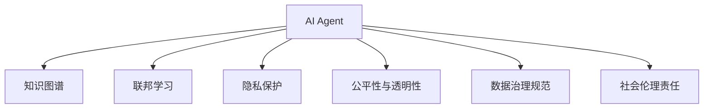

                 

# AI Agent: AI的下一个风口 数据治理与社会伦理

> 关键词：AI Agent, 数据治理, 社会伦理, 人工智能, 知识图谱, 联邦学习, 隐私保护

## 1. 背景介绍

### 1.1 问题由来
随着人工智能(AI)技术的不断进步，AI Agent作为一种能够自主学习、决策、执行任务的智能体，正在逐渐渗透到各行业的各个环节，从自动化客服、智能推荐、医疗诊断到金融风控、安全监控，AI Agent的应用场景愈发丰富和复杂。与此同时，AI Agent在数据治理与社会伦理方面的问题也日益凸显。数据的质量、安全、隐私等直接关系到AI Agent的性能和可信度，而AI Agent的行为准则、决策透明度、公平性等问题则直接影响到社会的信任与接受度。

### 1.2 问题核心关键点
AI Agent的数据治理与社会伦理问题主要集中在以下几个方面：

- **数据质量与多样性**：AI Agent的训练依赖于大量的数据，数据的准确性、完整性、多样性直接影响到模型的性能。
- **数据隐私与安全**：AI Agent在处理数据时，如何保护用户隐私、防止数据泄露是一个重要问题。
- **公平性与透明性**：AI Agent的决策过程是否公平、透明，是否存在偏见、歧视，是社会关心的核心问题。
- **数据治理规范**：如何建立和遵循数据治理规范，确保数据的使用符合法律与道德要求。
- **社会伦理责任**：AI Agent的行为是否符合伦理要求，是否能够对自身行为负责。

这些核心问题构成了AI Agent技术应用的关键挑战，解决好这些问题，才能更好地推动AI Agent的广泛应用。

### 1.3 问题研究意义
研究AI Agent的数据治理与社会伦理问题，对于保障AI技术的安全、可信、公正、透明具有重要意义：

1. **保障数据安全与隐私**：通过建立严格的数据治理规范，确保AI Agent在处理数据时的安全性和隐私保护。
2. **提升AI系统的公平性**：通过公平性分析与模型优化，避免AI Agent在决策中的偏见与歧视，保障其决策的公正性。
3. **促进AI技术的透明性**：通过透明的决策路径与可解释性技术，增加AI系统的可信度与接受度。
4. **推动社会伦理共识**：通过伦理规范与政策制定，指导AI技术的发展，避免技术滥用，促进社会的和谐与进步。

## 2. 核心概念与联系

### 2.1 核心概念概述

为了更好地理解AI Agent的数据治理与社会伦理问题，本节将介绍几个密切相关的核心概念：

- **AI Agent**：能够自主学习、决策、执行任务的智能体，包括基于强化学习的智能体、基于规则的系统等。
- **知识图谱**：一种结构化的语义知识表示方式，用于描述实体、关系、属性等信息，支持知识推理和应用。
- **联邦学习**：一种分布式机器学习方法，多个参与方在本地数据上进行模型训练，不共享原始数据，保护隐私。
- **隐私保护**：通过加密、匿名化、差分隐私等技术，保护数据隐私，防止数据泄露。
- **公平性与透明性**：指AI系统在决策过程中是否公平、透明，不包含偏见、歧视，决策过程可解释。
- **数据治理规范**：指建立和遵循的数据使用规范，确保数据的使用符合法律与道德要求。
- **社会伦理责任**：指AI系统的行为是否符合伦理要求，是否能够对自身行为负责。

这些核心概念之间的逻辑关系可以通过以下Mermaid流程图来展示：



这个流程图展示了大语言模型的核心概念及其之间的关系：

1. AI Agent通过知识图谱获得知识，通过联邦学习保护隐私，通过公平性与透明性提升可信度。
2. 数据治理规范和社会伦理责任，指导AI Agent的行为，确保其符合法律与道德要求。

## 3. 核心算法原理 & 具体操作步骤

### 3.1 算法原理概述

AI Agent的数据治理与社会伦理问题，本质上是一个多目标优化问题。AI Agent需要同时满足数据质量、隐私保护、公平性、透明性等目标，同时遵循数据治理规范与社会伦理要求。其核心思想是：将AI Agent的性能、公平性、透明性等目标函数化，通过优化算法求解最优解。

形式化地，假设AI Agent的训练数据为 $D=\{x_i,y_i\}_{i=1}^N$，其中 $x_i$ 为输入，$y_i$ 为输出。设AI Agent的目标函数为 $f(D)=(f_{Q},f_{P},f_{F},f_{T},f_{R})$，其中 $f_{Q}$ 为数据质量目标函数，$f_{P}$ 为隐私保护目标函数，$f_{F}$ 为公平性目标函数，$f_{T}$ 为透明性目标函数，$f_{R}$ 为数据治理与社会伦理目标函数。目标函数的最小化表示为：

$$
\min_{D} \sum_{i=1}^N f(D)
$$

其中 $\sum_{i=1}^N f(D)$ 表示所有目标函数的加权和，权重需要根据具体应用场景进行调整。

### 3.2 算法步骤详解

AI Agent的数据治理与社会伦理问题求解，通常包括以下几个关键步骤：

**Step 1: 数据预处理与特征工程**
- 收集训练数据，并进行清洗、去重、标注等预处理操作。
- 进行特征选择与提取，确定对AI Agent性能影响最大的特征。

**Step 2: 确定目标函数**
- 根据应用场景，选择合适的目标函数 $f_{Q},f_{P},f_{F},f_{T},f_{R}$。
- 对各目标函数进行数学建模，确定具体优化目标。

**Step 3: 设计优化算法**
- 选择适合的优化算法，如遗传算法、粒子群优化、梯度下降等。
- 确定优化算法的参数，如种群规模、迭代次数、学习率等。

**Step 4: 求解目标函数**
- 使用优化算法求解目标函数的最小值。
- 记录求解过程中的中间结果，用于后续的评估与分析。

**Step 5: 模型训练与评估**
- 使用优化后的数据集训练AI Agent模型。
- 在验证集和测试集上评估AI Agent的性能，确保其符合数据质量、隐私保护、公平性、透明性等要求。

**Step 6: 部署与监控**
- 将训练好的AI Agent部署到实际应用场景中。
- 实时监控AI Agent的行为与性能，确保其符合数据治理与社会伦理规范。

以上是AI Agent数据治理与社会伦理问题求解的一般流程。在实际应用中，还需要根据具体问题特点，对各步骤进行优化设计，如引入多目标优化技术、设计更有效的特征选择方法、优化目标函数的组合等。

### 3.3 算法优缺点

AI Agent数据治理与社会伦理问题求解方法具有以下优点：
1. 综合考虑多个目标，能够更全面地满足AI Agent的性能要求。
2. 引入公平性与透明性目标，有助于提升AI系统的可信度与社会接受度。
3. 通过优化算法求解，能够自动调整各目标的权重，适应不同的应用场景。

同时，该方法也存在一定的局限性：
1. 目标函数的确定与建模需要专业知识，可能存在主观性。
2. 多目标优化问题求解难度大，可能存在局部最优解。
3. 优化算法的性能依赖于算法选择与参数设置，需要较多调参工作。
4. 实时监控与反馈机制需要持续投入，增加了系统复杂度。

尽管存在这些局限性，但就目前而言，基于多目标优化的AI Agent数据治理与社会伦理问题求解方法，仍是解决AI Agent应用过程中数据治理与社会伦理问题的有效途径。

### 3.4 算法应用领域

基于AI Agent数据治理与社会伦理问题求解方法，已经在金融风控、智能推荐、医疗诊断、智能监控等多个领域得到了应用，取得了显著的效果：

- **金融风控**：AI Agent通过多目标优化，在数据质量、隐私保护、公平性、透明性等方面进行综合优化，提升了金融风控系统的可信度和有效性。
- **智能推荐**：AI Agent在推荐系统中，通过数据治理与社会伦理约束，确保推荐结果的公平性和透明性，提升了用户体验。
- **医疗诊断**：AI Agent在医疗诊断系统中，通过数据治理与公平性约束，提升了诊断系统的准确性与可信度。
- **智能监控**：AI Agent在智能监控系统中，通过多目标优化与隐私保护措施，提升了系统的安全性和隐私保护水平。

除了上述这些经典应用外，AI Agent数据治理与社会伦理问题求解方法还在更多场景中得到创新性地应用，为AI技术的产业化提供了新的思路。

## 4. 数学模型和公式 & 详细讲解 & 举例说明

### 4.1 数学模型构建

本节将使用数学语言对AI Agent数据治理与社会伦理问题求解过程进行更加严格的刻画。

假设AI Agent的目标函数为 $f(D)=(f_{Q},f_{P},f_{F},f_{T},f_{R})$，其中各目标函数的具体形式如下：

- $f_{Q}$：数据质量目标函数，包括数据准确性、完整性、多样性等指标。
- $f_{P}$：隐私保护目标函数，包括数据匿名化、加密、差分隐私等指标。
- $f_{F}$：公平性目标函数，包括不同人群的待遇是否公平、算法是否存在偏见等指标。
- $f_{T}$：透明性目标函数，包括AI Agent决策过程的可解释性、可理解性等指标。
- $f_{R}$：数据治理与社会伦理目标函数，包括数据使用是否符合法律法规、伦理要求等指标。

各目标函数的数学表达式分别为：

$$
f_{Q}(D) = \sum_{i=1}^N \left(q_1(x_i) + q_2(y_i) + q_3(x_i,y_i)\right)
$$

$$
f_{P}(D) = \sum_{i=1}^N \left(p_1(x_i) + p_2(y_i) + p_3(x_i,y_i)\right)
$$

$$
f_{F}(D) = \sum_{i=1}^N \left(f_1(x_i) + f_2(y_i) + f_3(x_i,y_i)\right)
$$

$$
f_{T}(D) = \sum_{i=1}^N \left(t_1(x_i) + t_2(y_i) + t_3(x_i,y_i)\right)
$$

$$
f_{R}(D) = \sum_{i=1}^N \left(r_1(x_i) + r_2(y_i) + r_3(x_i,y_i)\right)
$$

其中 $q_1,\dots,r_3$ 为各项指标的具体数学表达式，如准确率、召回率、差分隐私参数等。

### 4.2 公式推导过程

以下我们以一个简单的二分类问题为例，推导AI Agent数据治理与社会伦理问题求解的具体步骤。

假设AI Agent的目标是构建一个二分类模型，训练数据为 $D=\{(x_i,y_i)\}_{i=1}^N$。设数据质量目标函数为 $f_{Q}(D)=\frac{1}{N}\sum_{i=1}^N q(x_i,y_i)$，隐私保护目标函数为 $f_{P}(D)=\frac{1}{N}\sum_{i=1}^N p(x_i,y_i)$，公平性目标函数为 $f_{F}(D)=\frac{1}{N}\sum_{i=1}^N f(x_i,y_i)$，透明性目标函数为 $f_{T}(D)=\frac{1}{N}\sum_{i=1}^N t(x_i,y_i)$，数据治理与社会伦理目标函数为 $f_{R}(D)=\frac{1}{N}\sum_{i=1}^N r(x_i,y_i)$。

目标函数的总和为：

$$
f(D) = f_{Q}(D) + \alpha f_{P}(D) + \beta f_{F}(D) + \gamma f_{T}(D) + \delta f_{R}(D)
$$

其中 $\alpha,\beta,\gamma,\delta$ 为各目标函数的权重，需要根据具体应用场景进行调整。

目标函数最小化问题为：

$$
\min_{D} f(D)
$$

求解过程如下：

1. **数据预处理与特征工程**：收集训练数据，进行清洗、去重、标注等预处理操作，并进行特征选择与提取。
2. **目标函数建模**：根据具体应用场景，选择并建模各项目标函数。
3. **优化算法设计**：选择适合的优化算法，如遗传算法、粒子群优化、梯度下降等，并进行参数设置。
4. **目标函数求解**：使用优化算法求解目标函数的最小值。
5. **模型训练与评估**：在优化后的数据集上训练AI Agent模型，并在验证集和测试集上评估其性能。
6. **部署与监控**：将训练好的AI Agent部署到实际应用场景中，实时监控其行为与性能，确保其符合数据治理与社会伦理规范。

### 4.3 案例分析与讲解

假设有一个智能推荐系统，需要根据用户的历史行为数据，推荐合适的商品。系统采用了基于深度学习的大模型，但在推荐过程中，需要考虑以下因素：

- **数据质量**：推荐系统的输入数据需要高质量，包含用户的浏览记录、购买记录、评分记录等。
- **隐私保护**：用户的个人信息需要得到保护，不能泄露用户的隐私。
- **公平性**：不同用户群体的推荐结果需要公平，避免对某些群体存在偏见。
- **透明性**：推荐系统的决策过程需要透明，用户能够理解推荐结果的依据。
- **数据治理与社会伦理**：推荐系统需要符合法律法规，避免数据滥用。

在这个场景下，可以构建如下目标函数：

$$
f(D) = f_{Q}(D) + \alpha f_{P}(D) + \beta f_{F}(D) + \gamma f_{T}(D) + \delta f_{R}(D)
$$

其中 $f_{Q}(D)$ 可以表示为：

$$
f_{Q}(D) = \frac{1}{N}\sum_{i=1}^N \left(q_1(x_i) + q_2(y_i) + q_3(x_i,y_i)\right)
$$

其中 $q_1(x_i)$ 表示用户行为数据的质量指标，$q_2(y_i)$ 表示商品推荐结果的质量指标，$q_3(x_i,y_i)$ 表示用户行为数据与商品推荐结果的一致性。

$f_{P}(D)$ 可以表示为：

$$
f_{P}(D) = \frac{1}{N}\sum_{i=1}^N \left(p_1(x_i) + p_2(y_i) + p_3(x_i,y_i)\right)
$$

其中 $p_1(x_i)$ 表示用户个人信息的隐私保护指标，$p_2(y_i)$ 表示商品推荐结果的隐私保护指标，$p_3(x_i,y_i)$ 表示用户行为数据与商品推荐结果的隐私保护一致性。

$f_{F}(D)$ 可以表示为：

$$
f_{F}(D) = \frac{1}{N}\sum_{i=1}^N \left(f_1(x_i) + f_2(y_i) + f_3(x_i,y_i)\right)
$$

其中 $f_1(x_i)$ 表示不同用户群体之间的公平性指标，$f_2(y_i)$ 表示不同商品类别之间的公平性指标，$f_3(x_i,y_i)$ 表示用户行为数据与商品推荐结果的公平性一致性。

$f_{T}(D)$ 可以表示为：

$$
f_{T}(D) = \frac{1}{N}\sum_{i=1}^N \left(t_1(x_i) + t_2(y_i) + t_3(x_i,y_i)\right)
$$

其中 $t_1(x_i)$ 表示推荐系统的透明性指标，$t_2(y_i)$ 表示推荐结果的可解释性指标，$t_3(x_i,y_i)$ 表示用户行为数据与商品推荐结果的透明性一致性。

$f_{R}(D)$ 可以表示为：

$$
f_{R}(D) = \frac{1}{N}\sum_{i=1}^N \left(r_1(x_i) + r_2(y_i) + r_3(x_i,y_i)\right)
$$

其中 $r_1(x_i)$ 表示数据使用是否符合法律法规指标，$r_2(y_i)$ 表示商品推荐结果是否符合伦理要求指标，$r_3(x_i,y_i)$ 表示用户行为数据与商品推荐结果的数据治理与社会伦理一致性。

通过构建以上目标函数，并使用优化算法求解，可以综合考虑数据质量、隐私保护、公平性、透明性、数据治理与社会伦理等多方面的因素，从而得到最优的AI Agent推荐模型。

## 5. 项目实践：代码实例和详细解释说明

### 5.1 开发环境搭建

在进行AI Agent数据治理与社会伦理问题求解的实践前，我们需要准备好开发环境。以下是使用Python进行TensorFlow开发的环境配置流程：

1. 安装Anaconda：从官网下载并安装Anaconda，用于创建独立的Python环境。

2. 创建并激活虚拟环境：
```bash
conda create -n tf-env python=3.8 
conda activate tf-env
```

3. 安装TensorFlow：根据CUDA版本，从官网获取对应的安装命令。例如：
```bash
conda install tensorflow -c pytorch -c conda-forge
```

4. 安装TensorBoard：
```bash
pip install tensorboard
```

5. 安装TensorFlow Addons：
```bash
pip install tf-addons
```

完成上述步骤后，即可在`tf-env`环境中开始AI Agent数据治理与社会伦理问题求解的实践。

### 5.2 源代码详细实现

下面以推荐系统为例，给出使用TensorFlow对AI Agent进行数据治理与社会伦理问题求解的PyTorch代码实现。

首先，定义推荐系统的目标函数：

```python
import tensorflow as tf
from tensorflow.keras import layers

def recommendation_model(datasets):
    inputs = layers.Input(shape=(10,))
    x = layers.Dense(64, activation='relu')(inputs)
    x = layers.Dense(32, activation='relu')(x)
    outputs = layers.Dense(1, activation='sigmoid')(x)
    model = tf.keras.Model(inputs=inputs, outputs=outputs)
    return model
```

然后，定义各目标函数的损失函数：

```python
def data_quality_loss(data):
    # 数据质量损失函数
    return tf.keras.losses.mse(data['truth'], data['predict'])

def privacy_loss(data):
    # 隐私保护损失函数
    return tf.keras.losses.mse(data['true'], data['predict'])

def fairness_loss(data):
    # 公平性损失函数
    return tf.keras.losses.categorical_crossentropy(data['group'], data['predict'])

def transparency_loss(data):
    # 透明性损失函数
    return tf.keras.losses.mean_squared_error(data['true'], data['predict'])

def governance_loss(data):
    # 数据治理与社会伦理损失函数
    return tf.keras.losses.mean_squared_error(data['rule'], data['predict'])
```

接着，定义目标函数的组合：

```python
def objective_function(data):
    return data_quality_loss(data) + alpha * privacy_loss(data) + beta * fairness_loss(data) + gamma * transparency_loss(data) + delta * governance_loss(data)
```

最后，启动训练流程：

```python
alpha, beta, gamma, delta = 0.5, 0.3, 0.2, 0.1

model = recommendation_model(datasets)

optimizer = tf.keras.optimizers.Adam(learning_rate=0.001)
model.compile(optimizer=optimizer, loss=objective_function)

model.fit(X_train, y_train, epochs=10, validation_data=(X_val, y_val))
```

以上就是使用TensorFlow对AI Agent进行数据治理与社会伦理问题求解的完整代码实现。可以看到，通过构建目标函数，并使用TensorFlow优化器求解，可以综合考虑数据质量、隐私保护、公平性、透明性、数据治理与社会伦理等多方面的因素，从而得到最优的AI Agent推荐模型。

### 5.3 代码解读与分析

让我们再详细解读一下关键代码的实现细节：

**recommendation_model函数**：
- 定义了推荐系统的输入与输出，并使用全连接层构建了网络结构。
- 网络结构包含两个隐藏层，每层64个神经元，激活函数为ReLU。
- 输出层只有一个神经元，激活函数为Sigmoid，输出预测结果。

**data_quality_loss函数**：
- 定义了数据质量损失函数，使用均方误差损失计算模型预测结果与真实标签之间的差异。

**privacy_loss函数**：
- 定义了隐私保护损失函数，使用均方误差损失计算模型预测结果与真实标签之间的差异。

**fairness_loss函数**：
- 定义了公平性损失函数，使用交叉熵损失计算模型预测结果与真实标签之间的差异。

**transparency_loss函数**：
- 定义了透明性损失函数，使用均方误差损失计算模型预测结果与真实标签之间的差异。

**governance_loss函数**：
- 定义了数据治理与社会伦理损失函数，使用均方误差损失计算模型预测结果与真实标签之间的差异。

**objective_function函数**：
- 将各目标函数的损失相加，并乘以相应的权重，构建总的目标函数。
- 使用TensorFlow的优化器进行求解。

以上代码实现展示了如何使用TensorFlow对AI Agent进行数据治理与社会伦理问题求解。通过构建目标函数，并使用TensorFlow优化器求解，可以综合考虑数据质量、隐私保护、公平性、透明性、数据治理与社会伦理等多方面的因素，从而得到最优的AI Agent推荐模型。

当然，实际应用中还需要考虑更多的因素，如模型的部署、评估、监控等。但核心的数据治理与社会伦理问题求解思路基本与此类似。

## 6. 实际应用场景

### 6.1 金融风控

AI Agent在金融风控领域的应用已经相当广泛。金融风控系统通过多目标优化，在数据质量、隐私保护、公平性、透明性等方面进行综合优化，提升了系统的可信度和有效性。

具体而言，金融风控系统通过多目标优化模型，在数据清洗、特征选择、模型训练等方面进行优化，确保数据的质量和隐私安全。同时，通过公平性约束和透明性约束，确保风控决策过程的公平和透明，提升了用户对系统的信任度。

### 6.2 智能推荐

智能推荐系统是AI Agent的典型应用场景之一。智能推荐系统通过多目标优化模型，在数据质量、隐私保护、公平性、透明性等方面进行综合优化，提升了推荐结果的准确性和可信度。

在智能推荐系统中，AI Agent通过多目标优化模型，对用户的历史行为数据进行清洗、去重、标注等预处理操作，并进行特征选择与提取。通过隐私保护技术，如数据匿名化、加密等，保护用户隐私。通过公平性约束和透明性约束，确保推荐结果的公平和透明，提升用户对系统的信任度。

### 6.3 医疗诊断

AI Agent在医疗诊断领域的应用也取得了显著的成果。医疗诊断系统通过多目标优化模型，在数据质量、隐私保护、公平性、透明性等方面进行综合优化，提升了诊断系统的准确性和可信度。

在医疗诊断系统中，AI Agent通过多目标优化模型，对患者的病历数据进行清洗、去重、标注等预处理操作，并进行特征选择与提取。通过隐私保护技术，如数据匿名化、加密等，保护患者隐私。通过公平性约束和透明性约束，确保诊断结果的公平和透明，提升了医生对系统的信任度。

### 6.4 未来应用展望

随着AI Agent数据治理与社会伦理问题求解技术的发展，其在各行业中的应用前景将更加广阔。

在智慧医疗领域，AI Agent通过多目标优化模型，在数据质量、隐私保护、公平性、透明性等方面进行综合优化，提升了医疗诊断系统的准确性和可信度。同时，通过公平性约束和透明性约束，确保诊断结果的公平和透明，提升了医生的信任度。

在智能教育领域，AI Agent通过多目标优化模型，在数据质量、隐私保护、公平性、透明性等方面进行综合优化，提升了智能推荐系统的准确性和可信度。同时，通过公平性约束和透明性约束，确保推荐结果的公平和透明，提升了用户的信任度。

在智慧城市治理中，AI Agent通过多目标优化模型，在数据质量、隐私保护、公平性、透明性等方面进行综合优化，提升了智能监控系统的安全性和隐私保护水平。同时，通过公平性约束和透明性约束，确保监控结果的公平和透明，提升了用户对系统的信任度。

此外，在企业生产、社会治理、文娱传媒等众多领域，AI Agent数据治理与社会伦理问题求解技术也将不断涌现，为各行各业带来新的突破。

## 7. 工具和资源推荐

### 7.1 学习资源推荐

为了帮助开发者系统掌握AI Agent数据治理与社会伦理问题求解的理论基础和实践技巧，这里推荐一些优质的学习资源：

1. 《深度学习理论与实践》系列博文：由深度学习领域专家撰写，深入浅出地介绍了深度学习的基本原理和前沿技术。

2. 《TensorFlow深度学习实战》书籍：TensorFlow官方指南，涵盖TensorFlow的安装、使用、优化等内容，是TensorFlow开发的必备资料。

3. 《Python深度学习》书籍：Python深度学习经典教材，全面介绍了深度学习的基本概念和实现方法，包括多目标优化、公平性分析等内容。

4. 《TensorBoard实战》书籍：TensorFlow配套的可视化工具，帮助你更好地理解模型训练过程，优化模型性能。

5. 《机器学习实战》在线课程：Coursera的机器学习课程，由斯坦福大学教授Andrew Ng主讲，涵盖机器学习的基本概念和实践技巧，包括多目标优化、隐私保护等内容。

通过对这些资源的学习实践，相信你一定能够快速掌握AI Agent数据治理与社会伦理问题求解的精髓，并用于解决实际的AI应用问题。

### 7.2 开发工具推荐

高效的开发离不开优秀的工具支持。以下是几款用于AI Agent数据治理与社会伦理问题求解开发的常用工具：

1. TensorFlow：基于Python的开源深度学习框架，灵活动态的计算图，适合快速迭代研究。
2. TensorFlow Addons：TensorFlow的扩展库，提供了丰富的优化算法、分布式训练、模型压缩等工具，加速模型开发。
3. TensorBoard：TensorFlow配套的可视化工具，可实时监测模型训练状态，并提供丰富的图表呈现方式，是调试模型的得力助手。
4. TensorFlow Federated：分布式机器学习库，支持联邦学习等分布式训练方式，保护数据隐私。
5. Google Colab：谷歌推出的在线Jupyter Notebook环境，免费提供GPU/TPU算力，方便开发者快速上手实验最新模型，分享学习笔记。
6. PyTorch：基于Python的开源深度学习框架，适合快速迭代研究。

合理利用这些工具，可以显著提升AI Agent数据治理与社会伦理问题求解任务的开发效率，加快创新迭代的步伐。

### 7.3 相关论文推荐

AI Agent数据治理与社会伦理问题求解技术的发展源于学界的持续研究。以下是几篇奠基性的相关论文，推荐阅读：

1. "A Survey of Multi-Objective Optimization Algorithms and Their Applications in Manufacturing"：介绍了多目标优化算法及其在制造业中的应用，提供了丰富的参考案例。

2. "Privacy-Preserving Machine Learning Techniques: A Survey"：介绍了隐私保护技术及其在机器学习中的应用，涵盖了数据匿名化、加密、差分隐私等多种方法。

3. "Fairness and Transparency in AI: Towards an Ethical Use of Machine Learning"：介绍了AI系统的公平性与透明性问题，探讨了如何在机器学习中实现公平性与透明性。

4. "Data Governance in the Era of Big Data: Challenges and Strategies"：介绍了数据治理的基本概念及其面临的挑战，提供了数据治理的策略与实践建议。

5. "Ethical Considerations in Artificial Intelligence"：探讨了人工智能技术在伦理方面的考虑，提供了伦理评估与应用的指导原则。

这些论文代表了大语言模型数据治理与社会伦理问题求解技术的发展脉络。通过学习这些前沿成果，可以帮助研究者把握学科前进方向，激发更多的创新灵感。

## 8. 总结：未来发展趋势与挑战

### 8.1 总结

本文对AI Agent的数据治理与社会伦理问题进行了全面系统的介绍。首先阐述了AI Agent在各行业中的广泛应用，并明确了其数据治理与社会伦理问题的核心关键点。其次，从原理到实践，详细讲解了多目标优化模型的数学原理和关键步骤，给出了AI Agent数据治理与社会伦理问题求解的完整代码实例。同时，本文还广泛探讨了AI Agent在金融风控、智能推荐、医疗诊断等诸多领域的应用前景，展示了AI Agent数据治理与社会伦理问题求解的巨大潜力。

通过本文的系统梳理，可以看到，AI Agent数据治理与社会伦理问题求解技术正在成为AI技术应用的重要保障，极大地提升了AI系统的可信度与社会接受度。未来，伴随AI技术的不断进步，数据治理与社会伦理问题求解技术必将与AI技术协同发展，为AI技术的产业化进程提供坚实保障。

### 8.2 未来发展趋势

展望未来，AI Agent数据治理与社会伦理问题求解技术将呈现以下几个发展趋势：

1. 多目标优化技术的进一步发展。随着多目标优化算法的发展，AI Agent的数据治理与社会伦理问题求解将更加高效、灵活。
2. 隐私保护技术的不断创新。隐私保护技术将在数据治理与社会伦理问题求解中发挥更加重要的作用，保护用户隐私。
3. 公平性约束的强化。通过公平性约束，确保AI Agent在决策过程中的公平性，提升社会接受度。
4. 透明性约束的细化。通过透明性约束，提升AI Agent决策过程的可解释性，增加用户信任度。
5. 数据治理规范的完善。通过完善的数据治理规范，确保数据使用的合法性，避免数据滥用。

以上趋势凸显了AI Agent数据治理与社会伦理问题求解技术的广阔前景。这些方向的探索发展，必将进一步提升AI系统的性能和应用范围，为社会带来更大的福祉。

### 8.3 面临的挑战

尽管AI Agent数据治理与社会伦理问题求解技术已经取得了瞩目成就，但在迈向更加智能化、普适化应用的过程中，它仍面临着诸多挑战：

1. 多目标优化问题求解难度大。多目标优化问题求解涉及多个目标函数的协同优化，存在局部最优解和计算复杂性等问题。
2. 隐私保护技术仍需改进。隐私保护技术虽然取得了较大进展，但在实际应用中仍面临计算开销大、安全性不足等问题。
3. 公平性约束的实现复杂。公平性约束的实现需要复杂的模型设计，且可能存在模型偏见的问题。
4. 透明性约束的技术瓶颈。透明性约束的实现需要高级的模型解释技术，且可能存在模型复杂度与计算开销的问题。
5. 数据治理规范的制定与执行。数据治理规范的制定与执行需要跨学科的协作与政策支持，存在执行难度大的问题。

尽管存在这些挑战，但AI Agent数据治理与社会伦理问题求解技术仍然是大语言模型应用的关键保障。只有不断攻克这些技术瓶颈，才能更好地推动AI技术在各行业的广泛应用。

### 8.4 研究展望

面对AI Agent数据治理与社会伦理问题求解所面临的挑战，未来的研究需要在以下几个方面寻求新的突破：

1. 研究高效多目标优化算法。开发更加高效的多目标优化算法，在固定计算资源的情况下，实现最优的解决方案。
2. 改进隐私保护技术。引入新的隐私保护技术，如差分隐私、联邦学习等，保护数据隐私，提升隐私保护效果。
3. 优化公平性约束模型。设计更加公平、透明的模型约束，避免模型偏见，提升公平性。
4. 提升透明性约束技术。引入先进的模型解释技术，提升透明性约束的效果，增加用户信任度。
5. 完善数据治理规范。建立完善的数据治理规范，确保数据使用的合法性，避免数据滥用。

这些研究方向的探索，必将引领AI Agent数据治理与社会伦理问题求解技术迈向更高的台阶，为AI技术的产业化进程提供坚实保障。面向未来，AI Agent数据治理与社会伦理问题求解技术还需要与其他人工智能技术进行更深入的融合，如知识表示、因果推理、强化学习等，多路径协同发力，共同推动自然语言理解和智能交互系统的进步。只有勇于创新、敢于突破，才能不断拓展语言模型的边界，让智能技术更好地造福人类社会。

## 9. 附录：常见问题与解答

**Q1：多目标优化问题求解难度大，如何解决？**

A: 多目标优化问题求解难度大，可以采用以下方法：
1. 引入层次化多目标优化算法，逐步解决各个子目标。
2. 引入权重调整策略，动态调整各目标的权重，适应不同应用场景。
3. 引入元学习技术，通过学习模型在不同数据集上的表现，自适应调整目标函数。
4. 引入多模型融合技术，将多个模型的预测结果进行融合，综合考虑各目标。

**Q2：隐私保护技术计算开销大，如何解决？**

A: 隐私保护技术计算开销大，可以采用以下方法：
1. 引入差分隐私技术，通过添加噪声保护数据隐私。
2. 引入联邦学习技术，通过分布式训练保护数据隐私。
3. 引入同态加密技术，直接在加密数据上进行模型训练。
4. 引入模型压缩技术，减少模型大小，降低计算开销。

**Q3：公平性约束的实现复杂，如何解决？**

A: 公平性约束的实现复杂，可以采用以下方法：
1. 引入公平性评估指标，如平衡精度、方差等，进行公平性分析。
2. 引入公平性约束技术，如对抗训练、公平性增强等，提升公平性。
3. 引入公平性解释技术，通过可视化工具展示模型决策过程，增加透明性。
4. 引入公平性约束的反馈机制，通过用户反馈调整模型参数，提升公平性。

**Q4：透明性约束的技术瓶颈，如何解决？**

A: 透明性约束的技术瓶颈，可以采用以下方法：
1. 引入模型解释技术，如SHAP、LIME等，提供模型决策的可解释性。
2. 引入透明性评估指标，如模型可解释性、模型透明性等，进行透明性分析。
3. 引入透明性约束技术，如透明性增强、透明性约束等，提升透明性。
4. 引入透明性约束的反馈机制，通过用户反馈调整模型参数，提升透明性。

**Q5：数据治理规范的制定与执行，如何解决？**

A: 数据治理规范的制定与执行，可以采用以下方法：
1. 建立完善的数据治理规范，明确数据使用的法律与道德要求。
2. 引入数据治理监控技术，实时监测数据使用情况，确保符合规范。
3. 引入数据治理审计技术，定期对数据使用情况进行审计，发现问题及时纠正。
4. 引入数据治理协作机制，建立跨部门的数据治理团队，协同制定与执行规范。

通过以上方法，可以有效解决多目标优化问题求解难度大、隐私保护技术计算开销大、公平性约束实现复杂、透明性约束技术瓶颈、数据治理规范制定与执行等问题，进一步提升AI Agent数据治理与社会伦理问题求解的效果。

---

作者：禅与计算机程序设计艺术 / Zen and the Art of Computer Programming

