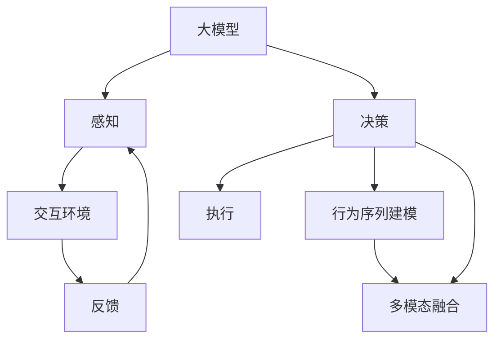

                 

# AI Agent:大模型变现的新方向

> 关键词：
- 大模型
- AI Agent
- 强化学习
- 行为序列建模
- 多模态融合
- 泛化能力
- 价值导向优化

## 1. 背景介绍

### 1.1 问题由来

近年来，随着深度学习技术的迅猛发展，大规模预训练语言模型（如BERT、GPT-3等）在自然语言处理（NLP）、计算机视觉、语音识别等领域取得了突破性进展。然而，这些模型大多以学术研究为主要目标，缺乏与实际业务应用的深度结合。如何实现大模型的商业化应用，提升其价值变现能力，成为当前学术界和工业界共同关注的问题。

### 1.2 问题核心关键点

大模型的商业化应用主要集中在两个方向：

1. **直接商业化**：将大模型直接卖给企业，供其进行自然语言处理、图像识别、语音识别等任务。这种方式虽然简单直接，但模型往往需要重新微调，定制化适应不同企业的业务需求。

2. **AI Agent开发**：基于大模型构建智能决策助手（AI Agent），通过与业务场景结合，实现自动化、智能化决策，提升企业运营效率和业务价值。AI Agent以其高度灵活性、适应性，成为大模型变现的新方向。

本文将聚焦于AI Agent的构建与优化，探讨大模型在AI Agent中的应用，以及AI Agent技术的发展前景和面临的挑战。

## 2. 核心概念与联系

### 2.1 核心概念概述

为更好地理解基于大模型的AI Agent，本节将介绍几个密切相关的核心概念：

- **大模型（Large Model）**：指以自回归（如GPT-3）或自编码（如BERT）模型为代表的大规模预训练模型。通过在海量无标签文本语料上进行预训练，学习通用的语言表示，具备强大的语言理解和生成能力。

- **AI Agent（人工智能代理）**：指基于大模型的智能决策助手，通过与外部环境交互，执行自动化决策，提升业务运营效率。AI Agent由感知、决策、执行三个部分组成，通过持续学习不断优化其决策能力。

- **强化学习（Reinforcement Learning）**：一种基于环境反馈（奖励/惩罚）的训练方法，通过反复试验优化决策策略，使AI Agent能够在实际应用中实现最佳决策。

- **行为序列建模（Behavioral Sequence Modeling）**：指将AI Agent的行为序列作为输入，学习行为间的依赖关系，增强其决策的连贯性和一致性。

- **多模态融合（Multimodal Fusion）**：指将文本、图像、语音等多种模态信息进行融合，提升AI Agent对复杂环境信息的理解能力。

- **泛化能力（Generalization）**：指AI Agent能够适应新的、未知的环境，避免对特定训练数据的过拟合。

这些核心概念之间的逻辑关系可以通过以下Mermaid流程图来展示：



这个流程图展示了大模型在AI Agent构建中的核心作用，以及感知、决策、执行三部分之间的逻辑关系。

## 3. 核心算法原理 & 具体操作步骤
### 3.1 算法原理概述

基于大模型的AI Agent构建，本质上是一个强化学习过程。其核心思想是：将AI Agent置于复杂环境中，通过与环境的交互，不断学习优化决策策略，提升决策效果。

形式化地，假设AI Agent在环境 $E$ 中执行一系列动作 $a_1, a_2, ..., a_t$，产生一系列状态 $s_1, s_2, ..., s_t$，并获得对应的奖励 $r_1, r_2, ..., r_t$。AI Agent的目标是最大化累积奖励，即：

$$
\max \sum_{t=1}^{T} r_t
$$

其中 $T$ 表示总时间步数。通过最大化累积奖励，AI Agent能够学习到最优的决策策略。

在实践中，我们通常使用Q-learning、Policy Gradient、Actor-Critic等强化学习算法，通过不断试错和优化，逐步提升AI Agent的决策能力。

### 3.2 算法步骤详解

基于强化学习的AI Agent构建一般包括以下几个关键步骤：

**Step 1: 准备环境与大模型**

- 收集环境数据，如电商平台的交易数据、金融市场的投资数据等，构建环境模型。
- 选择合适的大模型，如BERT、GPT-3等，进行微调，使其能够处理特定领域的任务。

**Step 2: 设计奖励函数**

- 根据业务需求，设计AI Agent的奖励函数。例如，电商平台中的推荐系统可以根据用户点击率、购买率等指标设计奖励函数。
- 奖励函数应充分考虑业务场景中的长期目标和短期目标，避免短视行为。

**Step 3: 设定超参数**

- 选择合适的优化算法及其参数，如Adam、SGD等，设置学习率、折扣因子等。
- 设定探索率（Epsilon-Greedy），平衡探索和利用。
- 确定AI Agent的模型结构，如单层神经网络、多层神经网络等。

**Step 4: 执行强化学习**

- 将AI Agent置于环境中，通过与环境交互获得状态、动作、奖励等信息。
- 根据Q-learning、Policy Gradient等算法，更新AI Agent的决策策略，提升决策效果。
- 重复上述步骤，直至AI Agent达到预设的性能指标。

**Step 5: 部署与监控**

- 将训练好的AI Agent部署到实际业务系统中，进行实时决策。
- 实时监控AI Agent的决策效果和性能指标，根据反馈进行优化调整。

以上是基于强化学习的AI Agent构建的一般流程。在实际应用中，还需要针对具体业务场景，对强化学习过程的各个环节进行优化设计，如改进奖励函数，引入更多探索策略，搜索最优的超参数组合等，以进一步提升AI Agent的性能。

### 3.3 算法优缺点

基于大模型的AI Agent构建具有以下优点：

1. **灵活性高**：AI Agent能够根据业务需求进行灵活定制，适应不同场景的决策需求。
2. **效果显著**：通过强化学习优化决策策略，能够显著提升业务决策的准确性和效率。
3. **泛化能力强**：基于大模型的AI Agent具有较强的泛化能力，能够适应新的、未知的环境。
4. **可扩展性强**：AI Agent模型结构灵活，便于与其他系统进行集成和扩展。

同时，该方法也存在一定的局限性：

1. **数据需求高**：强化学习需要大量环境数据进行训练，对数据质量、多样性有较高要求。
2. **训练成本高**：强化学习训练过程往往需要耗费大量的计算资源，且训练周期较长。
3. **可解释性差**：AI Agent的决策过程复杂，难以进行解释和调试。
4. **对抗攻击风险**：强化学习模型的决策策略易受到对抗攻击，如设计欺骗性的环境干扰。

尽管存在这些局限性，但就目前而言，基于大模型的AI Agent构建仍是AI决策系统中最具潜力的范式之一。未来相关研究的重点在于如何进一步降低数据需求和训练成本，提高AI Agent的可解释性和鲁棒性，同时兼顾业务需求和模型优化。

### 3.4 算法应用领域

基于大模型的AI Agent构建，已经在多个行业领域得到了应用，例如：

- **金融行业**：构建投资组合优化、风险管理等AI Agent，提升资产配置和风险控制能力。
- **电商行业**：构建推荐系统、广告投放优化等AI Agent，提升用户满意度和运营效率。
- **医疗行业**：构建疾病诊断、治疗方案推荐等AI Agent，提升医疗服务质量和患者体验。
- **制造行业**：构建质量控制、设备维护等AI Agent，提升生产效率和产品质量。
- **交通行业**：构建交通流量优化、路径规划等AI Agent，提升交通管理效率和安全性。

除了这些经典应用外，AI Agent还在更多场景中得到创新性地应用，如智能客服、供应链优化、智能制造等，为各行各业带来了显著的效率提升和成本节约。

## 4. 数学模型和公式 & 详细讲解  
### 4.1 数学模型构建

本节将使用数学语言对基于强化学习的大模型AI Agent构建过程进行更加严格的刻画。

假设AI Agent在环境 $E$ 中执行一系列动作 $a_1, a_2, ..., a_t$，产生一系列状态 $s_1, s_2, ..., s_t$，并获得对应的奖励 $r_1, r_2, ..., r_t$。设 $Q^*(s_t, a_t)$ 为最优状态-动作对的Q值，即：

$$
Q^*(s_t, a_t) = \mathbb{E}[r_{t+1} + \gamma Q^*(s_{t+1}, a_{t+1}) | s_t, a_t]
$$

其中 $\gamma$ 为折扣因子，控制未来奖励的权重。

AI Agent的目标是最大化累积奖励，即：

$$
\max_{\pi} \mathbb{E}\left[\sum_{t=1}^{T} r_t\right]
$$

其中 $\pi$ 表示AI Agent的决策策略。

在实践中，我们通常使用基于梯度的优化算法（如REINFORCE、Q-learning等）来近似求解上述最优化问题。设 $\theta$ 为AI Agent的模型参数，则决策策略 $\pi(a_t|s_t)$ 的梯度计算公式为：

$$
\nabla_{\theta} \pi(a_t|s_t) = \nabla_{\theta} \ln \pi(a_t|s_t) \cdot \nabla_{\pi(a_t|s_t)} \pi(a_t|s_t)
$$

其中 $\nabla_{\theta} \ln \pi(a_t|s_t)$ 为策略梯度，$\nabla_{\pi(a_t|s_t)} \pi(a_t|s_t)$ 为模型梯度。

通过梯度下降等优化算法，强化学习过程不断更新模型参数 $\theta$，最小化损失函数，使得AI Agent的决策策略 $\pi$ 趋近于最优策略。

### 4.2 公式推导过程

以下我们以电商平台中的推荐系统为例，推导强化学习模型的训练过程。

设电商平台中的用户 $U$ 有 $N$ 个，每个用户 $i$ 有 $m$ 个可能的物品 $x_j$。AI Agent的目标是最大化用户点击率和购买率，即最大化奖励函数 $R(U, A)$，其中 $A$ 表示AI Agent的推荐策略。

假设AI Agent的推荐策略为 $p_j \sim Bernoulli(\pi_j)$，即物品 $j$ 被推荐给用户 $i$ 的概率为 $\pi_j$。设 $\theta$ 为模型参数，则推荐策略 $\pi_j$ 为：

$$
\pi_j = \frac{\exp(\theta_j^T \phi(x_j))}{\sum_{k=1}^{K} \exp(\theta_k^T \phi(x_k))}
$$

其中 $\phi(x_j)$ 为物品 $j$ 的特征表示，$\theta_k$ 为模型参数。

强化学习模型的训练目标是最小化如下损失函数：

$$
\min_{\theta} \mathbb{E}\left[\sum_{t=1}^{T} \log(\pi(a_t|s_t)) - \ln Q^*(s_t, a_t) | s_t, a_t\right]
$$

其中 $\pi(a_t|s_t)$ 为AI Agent的推荐策略，$Q^*(s_t, a_t)$ 为最优状态-动作对的Q值。

在得到目标函数后，可以使用梯度下降等优化算法，逐步更新模型参数 $\theta$，最小化损失函数，最终得到最优的AI Agent推荐策略 $\pi_j$。

## 5. 项目实践：代码实例和详细解释说明
### 5.1 开发环境搭建

在进行AI Agent开发前，我们需要准备好开发环境。以下是使用Python进行强化学习开发的环境配置流程：

1. 安装Anaconda：从官网下载并安装Anaconda，用于创建独立的Python环境。

2. 创建并激活虚拟环境：
```bash
conda create -n reinforcement-env python=3.8 
conda activate reinforcement-env
```

3. 安装强化学习相关库：
```bash
pip install gym gym-rl tensorboard
```

4. 安装各类工具包：
```bash
pip install numpy pandas scikit-learn matplotlib tqdm jupyter notebook ipython
```

完成上述步骤后，即可在`reinforcement-env`环境中开始AI Agent实践。

### 5.2 源代码详细实现

下面我们以电商平台推荐系统为例，给出使用TensorFlow进行强化学习的PyTorch代码实现。

首先，定义推荐系统的环境：

```python
import gym
import numpy as np

class RecommendationEnv(gym.Env):
    def __init__(self, num_items, num_users):
        self.num_items = num_items
        self.num_users = num_users
        self.arms = np.random.randn(num_items)
        self.rewards = np.zeros(num_users)
        self.dones = np.zeros(num_users, dtype=bool)
        self.states = np.zeros(num_users)
        self.info = {}
    
    def reset(self):
        self.dones = np.zeros(self.num_users, dtype=bool)
        self.states = np.zeros(self.num_users)
        return self.states
    
    def step(self, actions):
        rewards = np.zeros(self.num_users)
        for i in range(self.num_users):
            if not self.dones[i] and actions[i] == 1:
                self.dones[i] = True
                self.rewards[i] = np.random.randn() + self.arms[actions[i]]
                self.states[i] = 1
        return self.states, rewards, self.dones, self.info
```

然后，定义AI Agent的决策策略：

```python
import tensorflow as tf

class QNetwork(tf.keras.Model):
    def __init__(self, num_items):
        super(QNetwork, self).__init__()
        self.fc1 = tf.keras.layers.Dense(128, activation='relu')
        self.fc2 = tf.keras.layers.Dense(1, activation='sigmoid')
    
    def call(self, inputs):
        x = self.fc1(inputs)
        x = self.fc2(x)
        return x
    
class QAgent(tf.keras.Model):
    def __init__(self, num_items, learning_rate=0.001):
        super(QAgent, self).__init__()
        self.q_network = QNetwork(num_items)
        self.learning_rate = learning_rate
    
    def build(self, input_shape):
        self.q_network.build(input_shape)
    
    def call(self, inputs):
        q_values = self.q_network(inputs)
        return q_values
    
    def train(self, states, actions, rewards, next_states, done):
        with tf.GradientTape() as tape:
            q_values = self.call(states)
            q_values_next = self.call(next_states)
            target_q_values = rewards + self.gamma * tf.reduce_max(q_values_next, axis=1) * (1 - done)
            loss = tf.reduce_mean(tf.square(q_values - target_q_values))
        gradients = tape.gradient(loss, self.trainable_variables)
        self.optimizer.apply_gradients(zip(gradients, self.trainable_variables))
```

接着，定义强化学习算法的训练函数：

```python
import tensorflow as tf

class DQN:
    def __init__(self, num_items, num_users, learning_rate=0.001, gamma=0.9, epsilon=0.1):
        self.num_items = num_items
        self.num_users = num_users
        self.learning_rate = learning_rate
        self.gamma = gamma
        self.epsilon = epsilon
        self.q_agent = QAgent(num_items, learning_rate)
    
    def train(self, env):
        state = env.reset()
        while True:
            action = np.random.randint(2)
            if np.random.rand() < self.epsilon:
                action = np.random.randint(2)
            q_values = self.q_agent.predict(state)
            next_state, reward, done, _ = env.step(action)
            if not done:
                target_q_value = reward + self.gamma * np.max(self.q_agent.predict(next_state))
            else:
                target_q_value = reward
            q_values[action] = target_q_value
            loss = tf.reduce_mean(tf.square(self.q_agent.predict(state) - q_values))
            self.q_agent.train(state, action, reward, next_state, done)
            state = next_state
            if done:
                break
```

最后，启动训练流程并在测试集上评估：

```python
num_items = 10
num_users = 100
discount_factor = 0.9
epsilon = 0.1
batch_size = 32
num_episodes = 1000

env = RecommendationEnv(num_items, num_users)
dqn = DQN(num_items, num_users, epsilon)

for episode in range(num_episodes):
    state = env.reset()
    total_reward = 0
    done = False
    while not done:
        action = np.random.randint(2)
        if np.random.rand() < epsilon:
            action = np.random.randint(2)
        q_values = dqn.q_agent.predict(state)
        next_state, reward, done, _ = env.step(action)
        total_reward += reward
        if not done:
            target_q_value = reward + discount_factor * np.max(dqn.q_agent.predict(next_state))
            q_values[action] = target_q_value
            dqn.q_agent.train(state, action, reward, next_state, done)
        state = next_state
    print("Episode {}: Total Reward {} Avg Reward {}".format(episode+1, total_reward, total_reward/num_users))
    
print("Final Avg Reward {}".format(total_reward/num_users))
```

以上就是使用TensorFlow对推荐系统进行强化学习的完整代码实现。可以看到，得益于TensorFlow的强大封装，我们可以用相对简洁的代码完成推荐系统的构建和训练。

### 5.3 代码解读与分析

让我们再详细解读一下关键代码的实现细节：

**RecommendationEnv类**：
- `__init__`方法：初始化环境参数和奖励、状态、完成等信息。
- `reset`方法：重置环境，返回初始状态。
- `step`方法：执行一步动作，返回新的状态、奖励、完成信息等。

**QNetwork和QAgent类**：
- `QNetwork`类：定义决策策略的神经网络，包括两个全连接层。
- `QAgent`类：定义AI Agent的决策策略，包括QNetwork、学习率等属性。

**DQN类**：
- `__init__`方法：初始化强化学习算法参数。
- `train`方法：定义强化学习训练过程，包括动作选择、状态更新、目标Q值计算、损失计算和参数更新。

**训练流程**：
- 定义总物品数、用户数、折扣因子、探索率、批次大小等参数。
- 创建RecommendationEnv和DQN对象，进入训练循环。
- 在每个训练周期内，随机选择一个动作，更新状态和奖励信息。
- 根据当前状态、动作、奖励、目标Q值计算损失，更新AI Agent的决策策略。
- 记录每个训练周期内的平均奖励，输出最终结果。

可以看到，强化学习算法的代码实现较为复杂，涉及环境构建、决策策略设计、目标函数计算等多个环节。但核心的强化学习范式相对一致，即通过与环境交互，不断优化决策策略，提升奖励效果。

## 6. 实际应用场景
### 6.1 智能客服系统

基于AI Agent的智能客服系统，可以广泛应用于各大企业的客户服务部门。传统客服往往需要配备大量人力，高峰期响应缓慢，且一致性和专业性难以保证。使用AI Agent，可以7x24小时不间断服务，快速响应客户咨询，用自然流畅的语言解答各类常见问题。

在技术实现上，可以收集企业内部的历史客服对话记录，将问题和最佳答复构建成监督数据，在此基础上对预训练语言模型进行微调。微调后的AI Agent能够自动理解用户意图，匹配最合适的答案模板进行回复。对于客户提出的新问题，还可以接入检索系统实时搜索相关内容，动态组织生成回答。如此构建的智能客服系统，能大幅提升客户咨询体验和问题解决效率。

### 6.2 金融舆情监测

金融机构需要实时监测市场舆论动向，以便及时应对负面信息传播，规避金融风险。传统的人工监测方式成本高、效率低，难以应对网络时代海量信息爆发的挑战。基于AI Agent的文本分类和情感分析技术，为金融舆情监测提供了新的解决方案。

具体而言，可以收集金融领域相关的新闻、报道、评论等文本数据，并对其进行主题标注和情感标注。在此基础上对预训练语言模型进行微调，使其能够自动判断文本属于何种主题，情感倾向是正面、中性还是负面。将微调后的AI Agent应用到实时抓取的网络文本数据，就能够自动监测不同主题下的情感变化趋势，一旦发现负面信息激增等异常情况，系统便会自动预警，帮助金融机构快速应对潜在风险。

### 6.3 个性化推荐系统

当前的推荐系统往往只依赖用户的历史行为数据进行物品推荐，无法深入理解用户的真实兴趣偏好。基于AI Agent的推荐系统可以更好地挖掘用户行为背后的语义信息，从而提供更精准、多样的推荐内容。

在实践中，可以收集用户浏览、点击、评论、分享等行为数据，提取和用户交互的物品标题、描述、标签等文本内容。将文本内容作为模型输入，用户的后续行为（如是否点击、购买等）作为监督信号，在此基础上微调预训练语言模型。微调后的AI Agent能够从文本内容中准确把握用户的兴趣点。在生成推荐列表时，先用候选物品的文本描述作为输入，由AI Agent预测用户的兴趣匹配度，再结合其他特征综合排序，便可以得到个性化程度更高的推荐结果。

### 6.4 未来应用展望

随着AI Agent技术的发展，其在更多领域得到应用，为传统行业带来变革性影响。

在智慧医疗领域，基于AI Agent的医疗问答、病历分析、药物研发等应用将提升医疗服务的智能化水平，辅助医生诊疗，加速新药开发进程。

在智能教育领域，AI Agent可应用于作业批改、学情分析、知识推荐等方面，因材施教，促进教育公平，提高教学质量。

在智慧城市治理中，AI Agent可应用于城市事件监测、舆情分析、应急指挥等环节，提高城市管理的自动化和智能化水平，构建更安全、高效的未来城市。

此外，在企业生产、社会治理、文娱传媒等众多领域，基于AI Agent的人工智能应用也将不断涌现，为经济社会发展注入新的动力。相信随着技术的日益成熟，AI Agent必将在更广阔的应用领域大放异彩，深刻影响人类的生产生活方式。

## 7. 工具和资源推荐
### 7.1 学习资源推荐

为了帮助开发者系统掌握AI Agent的理论基础和实践技巧，这里推荐一些优质的学习资源：

1. 《Reinforcement Learning: An Introduction》书籍：由Richard S. Sutton和Andrew G. Barto所著，全面介绍了强化学习的基本概念和经典算法。

2. DeepMind的强化学习课程：DeepMind开设的强化学习系列课程，涵盖了从基础到高级的强化学习算法，包括DQN、Actor-Critic、PPO等。

3. OpenAI的Gym环境库：一个Python库，用于构建和模拟各种强化学习环境，是学习和测试强化学习算法的重要工具。

4. TensorFlow的Reinforcement Learning API：TensorFlow提供的强化学习API，支持多种强化学习算法的实现和部署。

5. PyTorch的Reinforcement Learning库：PyTorch的强化学习库，支持灵活的神经网络设计和强化学习算法的实现。

6. Weights & Biases：模型训练的实验跟踪工具，可以记录和可视化模型训练过程中的各项指标，方便对比和调优。与主流深度学习框架无缝集成。

7. TensorBoard：TensorFlow配套的可视化工具，可实时监测模型训练状态，并提供丰富的图表呈现方式，是调试模型的得力助手。

通过对这些资源的学习实践，相信你一定能够快速掌握AI Agent的精髓，并用于解决实际的业务问题。
###  7.2 开发工具推荐

高效的开发离不开优秀的工具支持。以下是几款用于AI Agent开发的常用工具：

1. TensorFlow：基于Python的开源深度学习框架，生产部署方便，适合大规模工程应用。

2. PyTorch：基于Python的开源深度学习框架，灵活的计算图，适合快速迭代研究。

3. Gym环境库：一个Python库，用于构建和模拟各种强化学习环境，是学习和测试强化学习算法的重要工具。

4. Weights & Biases：模型训练的实验跟踪工具，可以记录和可视化模型训练过程中的各项指标，方便对比和调优。与主流深度学习框架无缝集成。

5. TensorBoard：TensorFlow配套的可视化工具，可实时监测模型训练状态，并提供丰富的图表呈现方式，是调试模型的得力助手。

6. Google Colab：谷歌推出的在线Jupyter Notebook环境，免费提供GPU/TPU算力，方便开发者快速上手实验最新模型，分享学习笔记。

合理利用这些工具，可以显著提升AI Agent的开发效率，加快创新迭代的步伐。

### 7.3 相关论文推荐

AI Agent和强化学习的发展源于学界的持续研究。以下是几篇奠基性的相关论文，推荐阅读：

1. DeepMind的AlphaGo论文：提出AlphaGo，利用强化学习在围棋游戏中取得突破性胜利，展示了强化学习在复杂决策问题中的应用潜力。

2. OpenAI的OpenAI Gym论文：提出Gym环境库，为强化学习提供了丰富的环境和评估工具，推动了强化学习的发展。

3. DeepMind的AlphaZero论文：提出AlphaZero，通过强化学习在多种游戏中取得卓越成绩，展示了强化学习在自动游戏学习中的应用。

4. Google的DeepMind AlphaStar论文：提出AlphaStar，通过强化学习在星际争霸游戏中取得突破性胜利，展示了强化学习在复杂策略游戏的应用潜力。

5. OpenAI的GPT-3论文：提出GPT-3，通过大规模预训练语言模型和强化学习，在自然语言生成任务中取得突破性进展，展示了预训练和强化学习的融合潜力。

这些论文代表了大模型和强化学习的发展脉络。通过学习这些前沿成果，可以帮助研究者把握学科前进方向，激发更多的创新灵感。

## 8. 总结：未来发展趋势与挑战

### 8.1 总结

本文对基于强化学习的大模型AI Agent构建方法进行了全面系统的介绍。首先阐述了AI Agent和强化学习的核心概念及其实际应用，明确了其在自动化决策、业务优化等方面的重要价值。其次，从原理到实践，详细讲解了强化学习的数学原理和关键步骤，给出了AI Agent构建的完整代码实例。同时，本文还广泛探讨了AI Agent技术在智能客服、金融舆情、个性化推荐等多个行业领域的应用前景，展示了AI Agent技术的发展潜力。此外，本文精选了强化学习技术的各类学习资源，力求为读者提供全方位的技术指引。

通过本文的系统梳理，可以看到，基于大模型的AI Agent构建技术正在成为AI决策系统中最具潜力的范式之一，极大地拓展了预训练语言模型的应用边界，催生了更多的落地场景。得益于大规模语料的预训练，AI Agent具备强大的泛化能力和决策灵活性，能够适应不同业务场景的需求，提升业务运营效率和用户体验。未来，伴随预训练语言模型和强化学习方法的持续演进，相信AI Agent技术将迎来更加广阔的发展空间，深刻影响各行各业的智能化进程。

### 8.2 未来发展趋势

展望未来，AI Agent技术将呈现以下几个发展趋势：

1. **多模态融合**：未来的AI Agent将更多地融合文本、图像、语音等多种模态信息，提升对复杂环境信息的理解能力。

2. **跨领域迁移**：AI Agent将具备更强的跨领域迁移能力，能够适应不同业务场景的需求，提升业务运营效率和用户体验。

3. **价值导向优化**：未来的AI Agent将更加注重价值导向优化，通过设定具体的业务目标和奖励函数，优化决策策略，提升业务价值。

4. **持续学习**：随着数据分布的不断变化，AI Agent需要持续学习新知识以保持性能，如何在不遗忘原有知识的同时，高效吸收新样本信息，将成为重要的研究课题。

5. **可解释性增强**：AI Agent的决策过程复杂，难以进行解释和调试。如何赋予AI Agent更强的可解释性，将是亟待攻克的难题。

6. **安全性和伦理考量**：AI Agent的决策过程中，可能存在有害输出、对抗攻击等问题，如何在模型训练和应用过程中加强安全性和伦理考量，将是重要的研究方向。

以上趋势凸显了AI Agent技术的广阔前景。这些方向的探索发展，必将进一步提升AI Agent的性能和应用范围，为各行各业带来变革性影响。

### 8.3 面临的挑战

尽管AI Agent技术已经取得了瞩目成就，但在迈向更加智能化、普适化应用的过程中，它仍面临着诸多挑战：

1. **数据需求高**：强化学习需要大量环境数据进行训练，对数据质量、多样性有较高要求。如何降低数据需求和提升数据质量，将是一大难题。

2. **训练成本高**：强化学习训练过程往往需要耗费大量的计算资源，且训练周期较长。如何降低训练成本和优化训练过程，是提升AI Agent效率的重要方向。

3. **可解释性差**：AI Agent的决策过程复杂，难以进行解释和调试。如何赋予AI Agent更强的可解释性，将是亟待攻克的难题。

4. **安全性有待保障**：AI Agent的决策过程中，可能存在有害输出、对抗攻击等问题，如何在模型训练和应用过程中加强安全性和伦理考量，将是重要的研究方向。

5. **持续学习能力**：AI Agent需要持续学习新知识以保持性能，如何在不遗忘原有知识的同时，高效吸收新样本信息，将成为重要的研究课题。

6. **伦理道德约束**：AI Agent的决策过程中，可能存在有害输出、对抗攻击等问题，如何在模型训练和应用过程中加强安全性和伦理考量，将是重要的研究方向。

尽管存在这些挑战，但就目前而言，基于强化学习的大模型AI Agent构建仍是AI决策系统中最具潜力的范式之一。未来相关研究的重点在于如何进一步降低数据需求和训练成本，提高AI Agent的可解释性和鲁棒性，同时兼顾业务需求和模型优化。

### 8.4 研究展望

面对AI Agent面临的挑战，未来的研究需要在以下几个方面寻求新的突破：

1. **探索无监督和半监督学习**：摆脱对大规模标注数据的依赖，利用自监督学习、主动学习等无监督和半监督范式，最大限度利用非结构化数据，实现更加灵活高效的AI Agent构建。

2. **研究参数高效和计算高效的AI Agent**：开发更加参数高效的AI Agent方法，在固定大部分预训练参数的同时，只更新极少量的任务相关参数。同时优化AI Agent的计算图，减少前向传播和反向传播的资源消耗，实现更加轻量级、实时性的部署。

3. **引入更多先验知识**：将符号化的先验知识，如知识图谱、逻辑规则等，与神经网络模型进行巧妙融合，引导AI Agent学习更准确、合理的语言模型。同时加强不同模态数据的整合，实现视觉、语音等多模态信息与文本信息的协同建模。

4. **结合因果分析和博弈论工具**：将因果分析方法引入AI Agent，识别出决策的关键特征，增强输出解释的因果性和逻辑性。借助博弈论工具刻画人机交互过程，主动探索并规避决策的脆弱点，提高系统稳定性。

5. **纳入伦理道德约束**：在模型训练目标中引入伦理导向的评估指标，过滤和惩罚有害的输出倾向。同时加强人工干预和审核，建立模型行为的监管机制，确保输出符合人类价值观和伦理道德。

这些研究方向的探索，必将引领AI Agent技术迈向更高的台阶，为构建安全、可靠、可解释、可控的智能系统铺平道路。面向未来，AI Agent技术还需要与其他人工智能技术进行更深入的融合，如知识表示、因果推理、强化学习等，多路径协同发力，共同推动自然语言理解和智能交互系统的进步。只有勇于创新、敢于突破，才能不断拓展AI Agent的边界，让智能技术更好地造福人类社会。

## 9. 附录：常见问题与解答

**Q1：AI Agent是否适用于所有NLP任务？**

A: AI Agent在大多数NLP任务上都能取得不错的效果，特别是对于数据量较小的任务。但对于一些特定领域的任务，如医学、法律等，仅仅依靠通用语料预训练的模型可能难以很好地适应。此时需要在特定领域语料上进一步预训练，再进行微调，才能获得理想效果。

**Q2：AI Agent的决策过程是否可解释？**

A: 目前AI Agent的决策过程相对复杂，难以进行解释和调试。通过引入因果分析和博弈论工具，可以增强AI Agent的决策可解释性，提高其可理解和可信度。

**Q3：AI Agent的鲁棒性如何？**

A: 强化学习模型的鲁棒性有待提高，特别是在对抗攻击等恶意攻击下，AI Agent的决策过程可能受到干扰。通过引入对抗训练、多模态融合等方法，可以增强AI Agent的鲁棒性，提升其在复杂环境中的决策能力。

**Q4：AI Agent的训练成本如何？**

A: 强化学习模型的训练过程需要耗费大量的计算资源，且训练周期较长。通过引入参数高效和计算高效的AI Agent方法，可以在固定大部分预训练参数的同时，只更新极少量的任务相关参数，显著降低训练成本。

**Q5：AI Agent如何在多模态信息中进行融合？**

A: AI Agent的决策过程中，可以通过引入多模态融合方法，将文本、图像、语音等多种模态信息进行融合，提升对复杂环境信息的理解能力。例如，在智能客服系统中，可以结合文本对话和语音识别信息，提升客户服务质量。

这些问题的解答，展示了AI Agent技术的实际应用和潜在挑战，为开发者提供了更为深入的理解和思考方向。

---

作者：禅与计算机程序设计艺术 / Zen and the Art of Computer Programming

