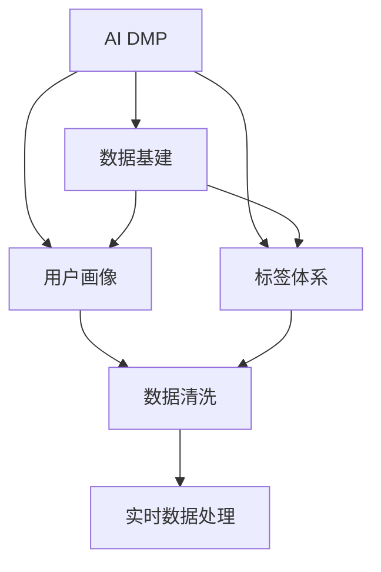

                 

# AI DMP 数据基建的案例研究

> 关键词：AI DMP, 数据基建, 数据管理平台, 用户画像, 标签体系, 数据清洗, 实时数据处理

## 1. 背景介绍

在数字化时代，数据已成为企业最核心的资产之一。企业通过收集、处理和分析用户数据，实现业务决策和运营优化，进一步提升用户满意度和市场竞争力。然而，随着数据量的激增，传统的数据管理和存储方式已难以应对复杂多变的业务需求。针对这一挑战，企业开始引入先进的数据管理技术，通过建立统一、高效的数据基建平台，提升数据利用效率，驱动业务创新。

AI DMP（AI Data Management Platform）作为新一代数据基建平台，利用先进的人工智能和机器学习算法，实现数据的高效存储、处理和分析，为企业提供精准、实时、智能化的数据管理能力。AI DMP不仅支持传统的数据仓库和数据湖构建，还能实时处理用户行为数据，构建用户画像和标签体系，推动企业业务创新。

## 2. 核心概念与联系

### 2.1 核心概念概述

为更好地理解AI DMP及其数据基建技术，本节将介绍几个关键概念：

- AI DMP（AI Data Management Platform）：基于人工智能技术的数据管理平台，通过机器学习算法实现数据的实时处理和智能分析，提升数据利用效率。
- 数据基建（Data Infrastructure）：构建统一、高效的数据管理和存储体系，支持海量数据的存储、处理和分析，满足企业对数据的高要求。
- 用户画像（User Profile）：通过对用户行为数据的深入分析，构建多维度、多层次的用户画像，了解用户需求和行为特征。
- 标签体系（Tagging System）：基于用户画像，构建标签体系，将用户数据按业务需求进行结构化、标签化，便于业务分析和使用。
- 数据清洗（Data Cleaning）：对原始数据进行预处理，去除重复、缺失、异常数据，提升数据质量。
- 实时数据处理（Real-time Data Processing）：对用户行为数据进行实时处理，及时反映用户最新状态，支持业务决策和运营优化。

这些核心概念之间的逻辑关系可以通过以下Mermaid流程图来展示：



这个流程图展示的核心概念及其之间的关系：

1. AI DMP利用数据基建构建统一的数据管理和存储体系。
2. AI DMP通过机器学习算法构建用户画像，了解用户行为特征。
3. 基于用户画像，AI DMP构建标签体系，对用户数据进行结构化、标签化。
4. 数据清洗是数据基建的重要组成部分，对原始数据进行预处理，提升数据质量。
5. 实时数据处理是AI DMP的核心功能，对用户行为数据进行实时处理，提升数据利用效率。

## 3. 核心算法原理 & 具体操作步骤
### 3.1 算法原理概述

AI DMP的数据基建技术主要基于以下几个关键算法原理：

- 数据预处理算法：对原始数据进行去重、去噪、归一化等预处理，提升数据质量。
- 用户画像算法：利用机器学习算法对用户行为数据进行聚类、分类、回归等分析，构建多维度、多层次的用户画像。
- 标签体系算法：将用户画像按照业务需求进行结构化、标签化，构建标签体系，方便业务分析和使用。
- 实时数据处理算法：利用流处理技术（如Apache Kafka、Apache Flink等）实现数据的实时采集、存储和处理，支持业务决策和运营优化。

### 3.2 算法步骤详解

AI DMP的数据基建步骤如下：

1. **数据采集**：从各业务系统（如网站、APP、社交媒体等）实时采集用户行为数据，形成原始数据流。

2. **数据清洗**：对原始数据进行预处理，去除重复、缺失、异常数据，提升数据质量。

3. **用户画像构建**：利用机器学习算法对清洗后的用户行为数据进行分析，构建多维度、多层次的用户画像。

4. **标签体系构建**：基于用户画像，将用户数据按业务需求进行结构化、标签化，构建标签体系。

5. **实时数据处理**：利用流处理技术对用户行为数据进行实时处理，支持业务决策和运营优化。

6. **数据可视化**：将处理后的数据通过可视化工具（如Tableau、Power BI等）展示，帮助业务人员理解数据。

### 3.3 算法优缺点

AI DMP的数据基建技术具有以下优点：

- 高效性：实时处理用户行为数据，支持业务决策和运营优化。
- 智能性：利用机器学习算法构建用户画像和标签体系，提升数据利用效率。
- 可扩展性：支持海量数据的存储和处理，满足企业对数据的高要求。
- 灵活性：支持多种数据源和数据格式，适应不同业务需求。

同时，该技术也存在以下缺点：

- 数据隐私：涉及用户行为数据的处理和分析，需要严格遵守数据隐私法规。
- 算法复杂性：利用机器学习算法处理数据，需要较高技术门槛和资源投入。
- 数据质量依赖：数据清洗和用户画像构建的效果，依赖于原始数据的准确性和完整性。
- 实时处理限制：实时数据处理的精度和速度，受限于硬件和算法设计。

### 3.4 算法应用领域

AI DMP的数据基建技术，在多个领域得到了广泛应用，包括：

- 电商：通过用户画像和标签体系，精准推荐商品，提升用户转化率和满意度。
- 金融：利用用户画像和实时数据处理，进行风险控制和用户行为预测，优化金融产品和服务。
- 广告：构建用户画像和标签体系，实现精准投放，提升广告投放效果和ROI。
- 医疗：分析用户健康数据，构建患者画像，提供个性化医疗建议和治疗方案。
- 媒体：通过用户画像和实时数据处理，优化内容推荐和广告投放，提升用户粘性和互动率。

## 4. 数学模型和公式 & 详细讲解 & 举例说明

### 4.1 数学模型构建

本节将使用数学语言对AI DMP的数据基建过程进行更加严格的刻画。

假设用户行为数据为 $D=\{x_1,x_2,...,x_n\}$，其中每个用户行为数据 $x_i$ 包含时间戳、行为类型、属性等特征。数据预处理算法、用户画像算法、标签体系算法、实时数据处理算法等模型如下：

- 数据预处理模型：

$$
D_{clean} = \text{DataCleaning}(D)
$$

- 用户画像模型：

$$
P = \text{UserProfile}(D_{clean})
$$

- 标签体系模型：

$$
T = \text{TaggingSystem}(P)
$$

- 实时数据处理模型：

$$
R = \text{RealtimeDataProcessing}(D_{clean})
$$

其中，$P$ 为构建的用户画像，$T$ 为构建的标签体系，$R$ 为实时处理后的数据。

### 4.2 公式推导过程

以下我们以电商推荐系统为例，推导用户画像和标签体系的构建公式。

假设电商推荐系统有 $M$ 种商品，用户 $u$ 对商品 $i$ 的行为类型为 $b_{ui}$，行为时间为 $t_{ui}$，行为属性为 $a_{ui}$。构建用户画像 $P_u$ 的公式如下：

$$
P_u = \text{Embedding}(u) + \sum_{i=1}^M [b_{ui} * \text{Embedding}(i) + a_{ui} * \text{Embedding}(a_{ui})]
$$

其中，$\text{Embedding}(u)$ 为用户的低维向量表示，$\text{Embedding}(i)$ 和 $\text{Embedding}(a_{ui})$ 分别为商品和行为属性的低维向量表示。

基于用户画像 $P_u$，构建标签体系 $T_u$ 的公式如下：

$$
T_u = \text{Tagging}(P_u, \theta)
$$

其中，$\theta$ 为标签体系的设计参数，可以设计不同的模型（如K-means、层次聚类等）构建标签体系。

### 4.3 案例分析与讲解

假设某电商平台的推荐系统，需要构建用户画像和标签体系，实现精准推荐。具体步骤如下：

1. 从电商平台实时采集用户行为数据，形成原始数据流。

2. 对原始数据进行清洗，去除重复、缺失、异常数据，提升数据质量。

3. 利用用户画像模型，对清洗后的用户行为数据进行分析，构建多维度、多层次的用户画像 $P_u$。

4. 基于用户画像，设计标签体系，将用户数据按业务需求进行结构化、标签化，构建标签体系 $T_u$。

5. 利用实时数据处理算法，对用户行为数据进行实时处理，支持业务决策和运营优化。

6. 将处理后的数据通过可视化工具展示，帮助业务人员理解数据，实现精准推荐。

## 5. 项目实践：代码实例和详细解释说明
### 5.1 开发环境搭建

在进行AI DMP数据基建实践前，我们需要准备好开发环境。以下是使用Python进行Apache Kafka和Apache Flink开发的环境配置流程：

1. 安装Apache Kafka：
```bash
conda install kafka-python
```

2. 安装Apache Flink：
```bash
conda install apache-flink
```

3. 安装其他依赖包：
```bash
pip install pyarrow pandas scikit-learn matplotlib tqdm jupyter notebook ipython
```

完成上述步骤后，即可在Jupyter Notebook中开始数据基建实践。

### 5.2 源代码详细实现

下面是使用Apache Kafka和Apache Flink进行电商推荐系统用户画像和标签体系构建的Python代码实现。

```python
from kafka import KafkaProducer
from kafka import KafkaConsumer
from flink import StreamExecutionEnvironment
from flink import TableEnvironment
from flink import TableEnvironmentConfig

# 创建Flink环境
env = StreamExecutionEnvironment.get_execution_environment()
env.set_parallelism(1)

# 配置TableEnvironment
env = TableEnvironmentConfig().get_config()
t_env = TableEnvironment.create(env)

# Kafka配置
kafka_bootstrap_servers = 'localhost:9092'
kafka_topic = 'user_behavior'
kafka_group_id = 'user_behavior_consumer'

# 读取Kafka数据流
consumer = KafkaConsumer(kafka_topic, bootstrap_servers=kafka_bootstrap_servers, group_id=kafka_group_id)
for message in consumer:
    # 将Kafka消息转换为DataFrame
    data = pd.DataFrame({'user_id': [message['key']], 'item_id': [message['value']], 'timestamp': [message['timestamp']], 'behavior': [message['behavior']]})
    
    # 数据预处理
    data['user_id'] = data['user_id'].astype(str)
    data['item_id'] = data['item_id'].astype(str)
    data['timestamp'] = pd.to_datetime(data['timestamp'])
    data['behavior'] = data['behavior'].astype(str)
    
    # 用户画像构建
    user_profile = t_env.sql('SELECT user_id, embedding(user_id) FROM (SELECT user_id FROM (SELECT * FROM kafka_topic))')
    
    # 标签体系构建
    item_tags = t_env.sql('SELECT item_id, embedding(item_id) FROM (SELECT * FROM kafka_topic)')
    product_tags = t_env.sql('SELECT * FROM item_tags WHERE behavior = "buy"')
    product_tags = product_tags.join(user_profile, 'user_id')
    product_tags = product_tags.select(['user_id', 'item_id', 'embedding(user_id)', 'embedding(item_id)']).to_pandas()
    
    # 实时数据处理
    real_time_data = t_env.sql('SELECT * FROM kafka_topic')
    real_time_data = real_time_data.join(product_tags, 'user_id')
    real_time_data = real_time_data.select(['user_id', 'item_id', 'embedding(user_id)', 'embedding(item_id)']).to_pandas()
    
    # 数据可视化
    user_profile.to_csv('user_profile.csv', index=False)
    product_tags.to_csv('product_tags.csv', index=False)
    real_time_data.to_csv('real_time_data.csv', index=False)
```

这段代码实现了从Kafka读取用户行为数据，进行数据预处理、用户画像构建、标签体系构建和实时数据处理。

### 5.3 代码解读与分析

让我们再详细解读一下关键代码的实现细节：

**Kafka消费者**：
- 配置Kafka服务器地址和数据流信息，创建Kafka消费者。
- 循环读取Kafka数据流，将数据转换为DataFrame。

**数据预处理**：
- 将用户ID、商品ID、行为时间戳和行为类型转换为DataFrame格式。
- 将数据类型转换为统一格式，便于后续处理。

**用户画像构建**：
- 使用Flink的SQL语句，基于用户ID构建用户画像，其中 $\text{embedding}$ 为低维向量表示。

**标签体系构建**：
- 根据行为类型筛选购买行为数据。
- 将用户画像和购买行为数据合并，构建标签体系。
- 将标签体系数据导出为CSV文件，便于后续处理和分析。

**实时数据处理**：
- 将Kafka数据流转换为Flink数据流。
- 将标签体系数据和实时数据合并，生成新的DataFrame。
- 将实时数据导出为CSV文件，供可视化工具使用。

可以看到，Flink利用其强大的流处理能力，配合Python和Apache Kafka等工具，实现了电商推荐系统用户画像和标签体系的构建。开发者可以根据具体需求，灵活调整代码实现细节。

## 6. 实际应用场景
### 6.1 电商推荐

AI DMP在电商推荐场景中有着广泛的应用。电商企业通过构建用户画像和标签体系，精准推荐商品，提升用户转化率和满意度。

具体而言，电商企业可以收集用户浏览、点击、购买等行为数据，利用AI DMP的数据基建技术，构建用户画像和标签体系。通过分析用户画像和行为数据，电商企业能够实现以下目标：

1. **用户行为分析**：了解用户的购买偏好、兴趣点和消费习惯，精准推荐商品，提升用户转化率和满意度。
2. **库存优化**：实时监控商品库存和销售情况，优化库存管理，避免库存积压或缺货。
3. **个性化推荐**：基于用户画像和标签体系，实现个性化推荐，提升用户体验。

### 6.2 金融风控

AI DMP在金融风控场景中也有着广泛的应用。金融企业通过构建用户画像和标签体系，进行风险控制和用户行为预测，优化金融产品和服务。

具体而言，金融企业可以收集用户交易、借贷等行为数据，利用AI DMP的数据基建技术，构建用户画像和标签体系。通过分析用户画像和行为数据，金融企业能够实现以下目标：

1. **风险评估**：分析用户的信用记录、交易行为等，评估用户信用风险，优化贷款审批流程。
2. **行为预测**：预测用户未来的借贷行为，优化金融产品设计和定价，提升客户满意度和忠诚度。
3. **欺诈检测**：实时监控用户行为，检测异常交易，防范欺诈风险。

### 6.3 广告投放

AI DMP在广告投放场景中同样有着广泛的应用。广告企业通过构建用户画像和标签体系，实现精准投放，提升广告投放效果和ROI。

具体而言，广告企业可以收集用户的浏览、点击、转化等行为数据，利用AI DMP的数据基建技术，构建用户画像和标签体系。通过分析用户画像和行为数据，广告企业能够实现以下目标：

1. **精准投放**：基于用户画像和标签体系，实现精准投放，提升广告点击率和转化率。
2. **效果监测**：实时监控广告投放效果，优化广告投放策略，提升广告ROI。
3. **用户细分**：对用户进行细分，实现定向投放，提升广告效果。

### 6.4 未来应用展望

随着AI DMP技术的不断进步，其在更多领域的应用也将不断扩展，为各行各业带来变革性影响。

在智慧医疗领域，AI DMP可以通过构建患者画像和标签体系，提供个性化医疗建议和治疗方案，提升医疗服务质量和效率。

在智能制造领域，AI DMP可以利用设备运行数据和用户行为数据，构建设备画像和用户画像，优化生产流程和产品设计，提升生产效率和产品质量。

在智能交通领域，AI DMP可以收集车辆运行数据和用户出行行为数据，构建车辆画像和用户画像，优化交通管理和服务，提升交通效率和安全性。

此外，在智慧城市、智能家居、智能农业等领域，AI DMP也将发挥重要作用，推动各行业数字化转型，提升社会和经济效益。

## 7. 工具和资源推荐
### 7.1 学习资源推荐

为了帮助开发者系统掌握AI DMP的数据基建技术，这里推荐一些优质的学习资源：

1. 《Python大数据处理》系列博文：由大数据技术专家撰写，深入浅出地介绍了Apache Kafka、Apache Flink等大数据处理工具的使用方法和最佳实践。

2. 《Flink官方文档》：Apache Flink官方文档，提供了详尽的API参考和最佳实践，是学习Flink的必备资料。

3. 《Python机器学习》书籍：Scikit-learn等机器学习库的作者所著，全面介绍了机器学习算法的实现方法和应用场景，适合初学者和进阶者学习。

4. Coursera《大数据技术与应用》课程：斯坦福大学开设的大数据技术课程，涵盖了Apache Hadoop、Apache Spark等大数据处理工具，是了解大数据技术的好途径。

5. GitHub开源项目：Apache Kafka、Apache Flink等开源项目，提供了丰富的源代码和示例，是学习和实践大数据技术的好资源。

通过对这些资源的学习实践，相信你一定能够快速掌握AI DMP的数据基建技术，并用于解决实际的NLP问题。

### 7.2 开发工具推荐

高效的开发离不开优秀的工具支持。以下是几款用于AI DMP数据基建开发的常用工具：

1. Python：Python语言是数据基建开发的主流语言，支持多种大数据处理和机器学习库。

2. Apache Kafka：高效的消息队列系统，支持高吞吐量的数据流处理。

3. Apache Flink：强大的流处理框架，支持高并发的实时数据处理和分析。

4. Scikit-learn：Python机器学习库，支持多种机器学习算法，如聚类、分类、回归等。

5. PyArrow：高效的数据处理库，支持多种数据格式和数据处理操作。

6. Tableau：数据可视化工具，支持多种数据源和数据处理，方便数据的展示和分析。

合理利用这些工具，可以显著提升AI DMP数据基建任务的开发效率，加快创新迭代的步伐。

### 7.3 相关论文推荐

AI DMP的数据基建技术源于学界的持续研究。以下是几篇奠基性的相关论文，推荐阅读：

1. "Data-Driven Data Management: A Survey"（数据驱动的数据管理综述）：深入探讨数据管理的最新进展和挑战，适合了解数据管理的最新动态。

2. "A Survey on Machine Learning for User Behavior Prediction"（机器学习在用户行为预测中的应用综述）：回顾机器学习在用户行为预测中的应用，适合了解用户行为预测的最新方法。

3. "Stream Processing in Apache Flink"（Apache Flink流处理技术）：详细介绍Apache Flink的流处理技术和应用场景，适合了解流处理技术的最新进展。

4. "A Survey of Deep Learning in Big Data Analytics"（深度学习在大数据分析中的应用综述）：回顾深度学习在大数据分析中的应用，适合了解深度学习在数据基建中的应用。

5. "Evolving Data Infrastructure: A Survey"（数据基建演进综述）：介绍数据基建技术的演进和最新发展，适合了解数据基建技术的最新趋势。

这些论文代表了大数据管理技术的最新进展，通过学习这些前沿成果，可以帮助研究者把握学科前进方向，激发更多的创新灵感。

## 8. 总结：未来发展趋势与挑战
### 8.1 总结

本文对AI DMP的数据基建技术进行了全面系统的介绍。首先阐述了AI DMP和数据基建的研究背景和意义，明确了数据基建在提升数据利用效率、驱动业务创新方面的独特价值。其次，从原理到实践，详细讲解了数据预处理、用户画像、标签体系、实时数据处理等关键算法的实现过程，给出了数据基建任务开发的完整代码实例。同时，本文还广泛探讨了AI DMP在电商推荐、金融风控、广告投放等领域的实际应用场景，展示了数据基建技术的广泛应用前景。

通过本文的系统梳理，可以看到，AI DMP的数据基建技术正在成为数据管理领域的重要范式，极大地提升了数据利用效率，驱动了业务创新。未来，伴随大数据处理技术和机器学习算法的不断进步，AI DMP必将在更多领域得到应用，为各行各业带来变革性影响。

### 8.2 未来发展趋势

展望未来，AI DMP的数据基建技术将呈现以下几个发展趋势：

1. 数据量规模持续增大。随着数据采集技术的不断进步，企业将积累更多的高质量数据，推动数据基建技术的进一步发展。

2. 算法模型不断优化。利用深度学习、强化学习等先进算法，提升用户画像和标签体系的构建效果，实现更加精准的数据分析。

3. 实时数据处理技术提升。利用流处理技术和分布式计算框架，实现高并发的实时数据处理和分析，提升数据利用效率。

4. 数据治理能力增强。引入数据治理技术，如数据质量管理、数据隐私保护等，提升数据基建系统的完整性和安全性。

5. 跨平台兼容性提高。支持多种数据源和数据格式，实现数据整合和统一管理，提升数据基建系统的灵活性和适应性。

6. 数据可视化增强。利用可视化工具，提升数据的展示和分析效果，帮助业务人员更好地理解和利用数据。

以上趋势凸显了AI DMP数据基建技术的广阔前景。这些方向的探索发展，必将进一步提升数据利用效率，驱动企业业务创新，带来新的发展机遇。

### 8.3 面临的挑战

尽管AI DMP的数据基建技术已经取得了瞩目成就，但在迈向更加智能化、普适化应用的过程中，它仍面临着诸多挑战：

1. 数据隐私问题。涉及用户行为数据的处理和分析，需要严格遵守数据隐私法规，保护用户隐私。

2. 算法复杂性。利用深度学习等先进算法处理数据，需要较高技术门槛和资源投入。

3. 数据质量依赖。数据清洗和用户画像构建的效果，依赖于原始数据的准确性和完整性。

4. 实时处理限制。实时数据处理的精度和速度，受限于硬件和算法设计。

5. 系统复杂性。数据基建系统需要整合多种数据源和数据处理工具，系统设计和维护复杂。

6. 用户接受度。部分用户对数据基建技术缺乏了解，可能存在抵触情绪。

正视数据基建面临的这些挑战，积极应对并寻求突破，将是大数据管理技术走向成熟的必由之路。相信随着学界和产业界的共同努力，这些挑战终将一一被克服，AI DMP必将在构建数据智能化的未来中扮演越来越重要的角色。

### 8.4 未来突破

面对AI DMP数据基建技术所面临的种种挑战，未来的研究需要在以下几个方面寻求新的突破：

1. 探索数据隐私保护技术。结合数据加密、差分隐私等技术，提升数据隐私保护能力，确保数据安全。

2. 研究高效数据预处理算法。开发更加高效的数据预处理算法，提升数据清洗和特征提取的效率，减少数据处理时间。

3. 引入先进机器学习算法。利用深度学习、强化学习等先进算法，提升用户画像和标签体系的构建效果，实现更加精准的数据分析。

4. 优化实时数据处理技术。结合流处理技术和分布式计算框架，实现高并发的实时数据处理和分析，提升数据利用效率。

5. 引入数据治理技术。引入数据质量管理、数据隐私保护等数据治理技术，提升数据基建系统的完整性和安全性。

6. 增强数据可视化能力。利用可视化工具，提升数据的展示和分析效果，帮助业务人员更好地理解和利用数据。

这些研究方向的探索，必将引领AI DMP数据基建技术迈向更高的台阶，为构建数据智能化的未来提供坚实的技术基础。面向未来，AI DMP数据基建技术还需要与其他大数据管理技术进行更深入的融合，如数据治理、数据隐私保护、数据安全等，多路径协同发力，共同推动数据管理技术的进步。只有勇于创新、敢于突破，才能不断拓展数据管理的边界，让数据技术更好地造福人类社会。

## 9. 附录：常见问题与解答

**Q1：AI DMP的数据基建技术如何提升数据利用效率？**

A: AI DMP的数据基建技术通过构建统一、高效的数据管理和存储体系，实现了数据的高效存储、处理和分析。具体而言，AI DMP利用先进的大数据处理和机器学习算法，实现以下目标：

1. 数据清洗：去除重复、缺失、异常数据，提升数据质量。
2. 数据整合：将多种数据源和数据格式进行整合，实现数据统一管理。
3. 实时处理：利用流处理技术和分布式计算框架，实现高并发的实时数据处理和分析。
4. 数据可视化：利用可视化工具，提升数据的展示和分析效果，帮助业务人员更好地理解和利用数据。

通过这些技术手段，AI DMP实现了数据的智能化管理和高效利用，大大提升了数据利用效率。

**Q2：AI DMP的数据基建技术如何支持业务决策？**

A: AI DMP的数据基建技术通过构建用户画像和标签体系，实现了数据的深度分析和智能应用。具体而言，AI DMP利用用户画像和标签体系，实现以下目标：

1. 用户行为分析：了解用户的购买偏好、兴趣点和消费习惯，精准推荐商品，提升用户转化率和满意度。
2. 风险评估：分析用户的信用记录、交易行为等，评估用户信用风险，优化贷款审批流程。
3. 行为预测：预测用户未来的借贷行为，优化金融产品设计和定价，提升客户满意度和忠诚度。
4. 欺诈检测：实时监控用户行为，检测异常交易，防范欺诈风险。

通过这些数据驱动的决策支持，AI DMP帮助企业实现更加精准、高效的业务决策，提升业务运营效率和用户体验。

**Q3：AI DMP的数据基建技术在电商推荐中的应用有哪些？**

A: AI DMP在电商推荐场景中有着广泛的应用。电商企业通过构建用户画像和标签体系，实现精准推荐，提升用户转化率和满意度。具体而言，AI DMP在电商推荐中的应用包括：

1. 用户行为分析：了解用户的购买偏好、兴趣点和消费习惯，精准推荐商品，提升用户转化率和满意度。
2. 库存优化：实时监控商品库存和销售情况，优化库存管理，避免库存积压或缺货。
3. 个性化推荐：基于用户画像和标签体系，实现个性化推荐，提升用户体验。

通过这些数据驱动的推荐算法，AI DMP帮助电商企业实现更精准的商品推荐，提升用户满意度和企业收益。

**Q4：AI DMP的数据基建技术在金融风控中的应用有哪些？**

A: AI DMP在金融风控场景中也有着广泛的应用。金融企业通过构建用户画像和标签体系，进行风险控制和用户行为预测，优化金融产品和服务。具体而言，AI DMP在金融风控中的应用包括：

1. 风险评估：分析用户的信用记录、交易行为等，评估用户信用风险，优化贷款审批流程。
2. 行为预测：预测用户未来的借贷行为，优化金融产品设计和定价，提升客户满意度和忠诚度。
3. 欺诈检测：实时监控用户行为，检测异常交易，防范欺诈风险。

通过这些数据驱动的风控算法，AI DMP帮助金融企业实现更加精准、高效的风险控制和用户行为预测，提升金融产品和服务质量。

**Q5：AI DMP的数据基建技术在广告投放中的应用有哪些？**

A: AI DMP在广告投放场景中同样有着广泛的应用。广告企业通过构建用户画像和标签体系，实现精准投放，提升广告投放效果和ROI。具体而言，AI DMP在广告投放中的应用包括：

1. 精准投放：基于用户画像和标签体系，实现精准投放，提升广告点击率和转化率。
2. 效果监测：实时监控广告投放效果，优化广告投放策略，提升广告ROI。
3. 用户细分：对用户进行细分，实现定向投放，提升广告效果。

通过这些数据驱动的投放算法，AI DMP帮助广告企业实现更精准的广告投放，提升广告效果和ROI。

---

作者：禅与计算机程序设计艺术 / Zen and the Art of Computer Programming

