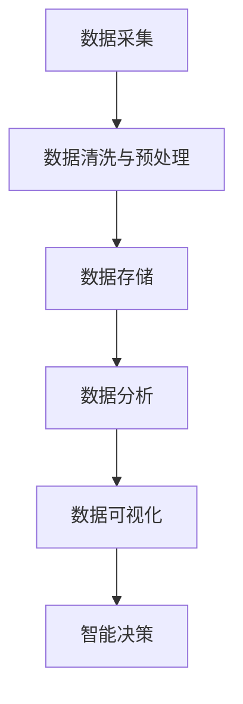

                 

# AI DMP 数据基建：数据分析与洞察

## 1. 背景介绍

### 1.1 问题由来
在数字化时代，数据已成为驱动业务增长和决策的关键要素。随着移动互联网、物联网、社交媒体等数字技术的发展，数据量的爆炸式增长带来了数据价值挖掘的巨大挑战。企业越来越依赖数据驱动，以提升运营效率、优化用户体验、增强竞争力。然而，数据治理、分析与洞察的复杂性不断上升，对技术架构、工具和人才提出了更高的要求。

为解决这一问题，企业纷纷引入AI驱动的数据平台（AI Data Platform，简称DMP），通过自动化和智能化的手段，高效收集、存储、分析和应用数据，实现数据价值的最大化。AI DMP不仅能够自动处理海量数据，还具备强大的洞察能力，能够从数据中挖掘出有价值的业务洞见，为决策提供坚实依据。

### 1.2 问题核心关键点
AI DMP的核心目标是构建一个高度集成、智能化的数据平台，实现数据的自动化处理与智能化分析。其主要功能包括数据收集、存储、处理、分析和应用等环节，通过大数据、机器学习和人工智能等技术，实现数据价值的最大化。

AI DMP的关键点在于：
- **数据整合与治理**：自动收集和整合多源异构数据，确保数据的质量和一致性。
- **智能数据处理**：通过自动化技术处理数据清洗、特征工程、数据增强等，提高数据处理效率。
- **智能分析与洞察**：利用机器学习和深度学习技术，挖掘数据中的模式和关系，生成有用的业务洞见。
- **实时决策支持**：通过数据流水线，实现数据实时处理与分析，支持快速决策。

## 2. 核心概念与联系

### 2.1 核心概念概述

为更好地理解AI DMP的构建与运行，本节将介绍几个密切相关的核心概念：

- **AI DMP（AI Data Platform）**：基于大数据、机器学习和人工智能技术，自动收集、处理、分析和应用数据，实现数据价值最大化的数据平台。
- **ETL（Extract, Transform, Load）**：数据预处理的核心流程，包括数据提取、转换和加载三个步骤。
- **数据湖（Data Lake）**：一个可扩展的数据存储库，支持各种数据格式和数据来源。
- **数据仓库（Data Warehouse）**：对数据进行整理和分析，支持多维数据分析和OLAP（Online Analytical Processing）操作。
- **智能分析与洞察**：利用机器学习和深度学习技术，从数据中挖掘出有价值的业务洞见，支持决策制定。

这些核心概念之间的逻辑关系可以通过以下Mermaid流程图来展示：



这个流程图展示了大规模数据处理的一般流程：

1. 数据采集：从不同数据源自动收集数据。
2. 数据清洗与预处理：通过ETL流程对数据进行清洗、转换和加载。
3. 数据存储：将处理后的数据存储到数据湖或数据仓库中。
4. 数据分析：对存储的数据进行多维分析和挖掘，生成业务洞见。
5. 数据可视化：将分析结果以可视化形式展现，支持决策支持。
6. 智能决策：基于分析结果，自动生成决策方案。

## 3. 核心算法原理 & 具体操作步骤
### 3.1 算法原理概述

AI DMP的核心算法原理主要基于大数据、机器学习和人工智能技术，通过自动化和智能化的手段，实现数据的收集、存储、处理、分析和应用。其核心算法包括但不限于：

- **数据预处理**：包括数据清洗、数据转换和数据增强等步骤。
- **特征工程**：对数据进行特征提取、选择和构建，提升模型性能。
- **机器学习**：利用监督学习、无监督学习和强化学习等技术，对数据进行建模和预测。
- **深度学习**：使用神经网络、卷积神经网络（CNN）、循环神经网络（RNN）等技术，处理复杂非线性关系。

AI DMP通过自动化和智能化的流程，确保数据处理的高效性和准确性，提升数据价值的挖掘能力。

### 3.2 算法步骤详解

AI DMP的构建和运行主要包括以下几个关键步骤：

**Step 1: 数据采集与清洗**
- 定义数据采集策略，自动收集来自不同数据源的数据，如网络日志、社交媒体、传感器等。
- 对采集的数据进行初步清洗，去除噪声和异常值，确保数据质量。

**Step 2: 数据存储与管理**
- 将清洗后的数据存储到数据湖或数据仓库中，采用分布式存储技术，确保高可扩展性。
- 对数据进行分类、分区和元数据管理，便于后续分析和查询。

**Step 3: 数据处理与增强**
- 使用ETL流程对数据进行预处理，包括数据转换、数据增强和特征工程。
- 采用自动化工具，自动生成特征、进行数据转换和增强，提升数据处理效率。

**Step 4: 数据分析与建模**
- 对处理后的数据进行多维分析和挖掘，生成业务洞见。
- 使用机器学习和深度学习技术，对数据进行建模和预测，生成分析结果。

**Step 5: 数据可视化和决策支持**
- 将分析结果以可视化形式展现，支持决策制定。
- 通过数据流水线，实现数据的实时处理与分析，支持快速决策。

### 3.3 算法优缺点

AI DMP具有以下优点：
1. **高效性**：通过自动化和智能化的流程，提高数据处理和分析效率。
2. **灵活性**：支持多种数据源和数据格式，适应不同业务场景。
3. **可扩展性**：采用分布式存储和计算技术，支持大规模数据处理。
4. **易用性**：通过友好的界面和自动化工具，降低使用门槛。

然而，AI DMP也存在一些局限性：
1. **数据质量依赖**：数据质量直接影响分析结果，需要投入大量资源进行数据清洗和预处理。
2. **模型复杂性**：高维数据和多变量关系增加了模型复杂性，需要精心设计算法和模型。
3. **安全性和隐私**：数据收集和存储过程中需要考虑数据安全和隐私问题，防止数据泄露和滥用。
4. **计算资源需求**：大规模数据处理需要高性能计算资源，成本较高。

尽管存在这些局限性，但AI DMP在数据治理和价值挖掘方面已经展现出了巨大的优势，成为现代数据平台的重要工具。

### 3.4 算法应用领域

AI DMP技术已经被广泛应用于以下几个领域：

- **零售行业**：通过分析消费者行为数据，优化商品推荐、库存管理和价格策略，提升销售额和客户满意度。
- **金融行业**：利用客户交易数据和市场信息，进行风险控制、投资分析和客户管理，提升资产回报率。
- **医疗健康**：通过病历数据和健康监测数据，进行疾病预测、治疗方案优化和患者管理，提升医疗质量。
- **能源行业**：分析能源消耗和供应数据，进行能源分配和优化，提高能源利用效率和环保水平。
- **政府公共服务**：利用公民数据和公共服务数据，进行城市管理、公共安全和社会治理，提升公共服务水平。

## 4. 数学模型和公式 & 详细讲解 & 举例说明
### 4.1 数学模型构建

AI DMP的数学模型主要基于机器学习和深度学习技术，通过构建各种模型，从数据中挖掘出有价值的业务洞见。以一个简单的线性回归模型为例：

假设有一个自变量 $X$ 和一个因变量 $Y$，线性回归模型的目标是最小化损失函数 $L$，表示如下：

$$
L(\theta) = \frac{1}{2n} \sum_{i=1}^n (Y_i - \theta_0 - \theta_1X_i)^2
$$

其中 $\theta = (\theta_0, \theta_1)$ 是模型参数，$n$ 是样本数量。

### 4.2 公式推导过程

线性回归模型的参数求解公式如下：

$$
\theta = (\theta_0, \theta_1) = (\frac{1}{n} \sum_{i=1}^n Y_i - \frac{1}{n} \sum_{i=1}^n X_i)
$$

通过对样本数据的计算，可以得到线性回归模型的参数。

### 4.3 案例分析与讲解

以下是一个简单的线性回归案例：

假设有一组房屋价格数据，包括房屋面积 $X$ 和价格 $Y$，目标是建立一个预测模型。通过对数据进行线性回归，可以得到模型参数：

- 房屋面积每增加1平方米，房价将增加1000元。
- 房屋面积的平方每增加1平方米，房价将增加500元。

通过这个模型，可以根据房屋面积预测其价格，提升房地产交易的效率和准确性。

## 5. 项目实践：代码实例和详细解释说明
### 5.1 开发环境搭建

在进行AI DMP项目实践前，我们需要准备好开发环境。以下是使用Python进行PySpark开发的环境配置流程：

1. 安装Anaconda：从官网下载并安装Anaconda，用于创建独立的Python环境。

2. 创建并激活虚拟环境：
```bash
conda create -n pyspark-env python=3.8 
conda activate pyspark-env
```

3. 安装PySpark：从官网获取对应的安装命令。例如：
```bash
conda install pyspark=3.1.2
```

4. 安装必要的依赖包：
```bash
pip install numpy pandas matplotlib scikit-learn
```

完成上述步骤后，即可在`pyspark-env`环境中开始AI DMP项目的开发。

### 5.2 源代码详细实现

以下是一个简单的PySpark代码实例，用于进行线性回归分析：

```python
from pyspark.sql import SparkSession
from pyspark.ml.feature import VectorAssembler, VectorIndexer
from pyspark.ml.classification import LinearRegression
from pyspark.ml import Pipeline
import matplotlib.pyplot as plt

# 创建Spark会话
spark = SparkSession.builder.appName("Linear Regression").getOrCreate()

# 加载数据
df = spark.read.format("csv").option("header", "true").load("data.csv")

# 数据预处理
df = df.dropna()  # 删除缺失值
df = df.select("area", "price")  # 选择相关列

# 特征工程
assembler = VectorAssembler(inputCols=["area"], outputCol="features")
df = assembler.transform(df)

# 数据分割
train, test = df.randomSplit([0.8, 0.2])

# 模型训练
lr = LinearRegression(featuresCol="features", labelCol="price", maxIter=10)
model = lr.fit(train)

# 模型评估
test_model = model.transform(test)
test_model.show()

# 预测效果展示
plt.scatter(df.select("area").first(), df.select("price").first())
plt.plot([0, 1000], [model.prediction(0.5), model.prediction(0.5)])
plt.xlabel("Area")
plt.ylabel("Price")
plt.show()
```

### 5.3 代码解读与分析

让我们再详细解读一下关键代码的实现细节：

**数据加载与预处理**：
- `spark.read.format("csv").option("header", "true").load("data.csv")`：从CSV文件中加载数据，指定表头信息。
- `df = df.dropna()`：删除缺失值。
- `df = df.select("area", "price")`：选择相关列，聚焦于面积和价格。

**特征工程**：
- `assembler = VectorAssembler(inputCols=["area"], outputCol="features")`：构建特征工程器，将面积转换为向量。
- `df = assembler.transform(df)`：应用特征工程器，转换数据格式。

**模型训练与评估**：
- `lr = LinearRegression(featuresCol="features", labelCol="price", maxIter=10)`：定义线性回归模型。
- `model = lr.fit(train)`：训练模型，使用训练集。
- `test_model = model.transform(test)`：对测试集进行预测。

**结果展示**：
- `test_model.show()`：展示测试集预测结果。
- `plt.scatter(df.select("area").first(), df.select("price").first())`：展示数据点。
- `plt.plot([0, 1000], [model.prediction(0.5), model.prediction(0.5)])`：展示预测直线。

## 6. 实际应用场景
### 6.1 零售行业

在零售行业中，AI DMP可以显著提升营销效果和运营效率。通过分析消费者行为数据，可以优化商品推荐、库存管理和价格策略，提升销售额和客户满意度。具体应用场景包括：

- **消费者行为分析**：通过分析用户的浏览、购买和评价数据，了解消费者的需求和偏好，优化商品推荐系统。
- **库存管理**：预测商品需求，优化库存水平，避免断货或积压，提升库存周转率。
- **价格策略**：基于消费者购买数据和市场竞争情况，自动生成动态价格策略，提升销售效果。

### 6.2 金融行业

金融行业对数据驱动决策的需求尤为强烈，AI DMP可以提升风险控制和投资分析能力。具体应用场景包括：

- **风险控制**：利用客户交易数据和市场信息，进行信用评估和风险预测，降低坏账率。
- **投资分析**：分析历史交易数据和市场趋势，生成投资策略和推荐，提升投资回报率。
- **客户管理**：通过客户行为数据，个性化客户服务，提升客户满意度和忠诚度。

### 6.3 医疗健康

在医疗健康领域，AI DMP可以提升疾病预测和治疗方案优化能力。具体应用场景包括：

- **疾病预测**：分析病历数据和健康监测数据，预测疾病的发生概率和趋势。
- **治疗方案优化**：根据患者历史数据和最新医学研究，生成个性化治疗方案，提升治疗效果。
- **患者管理**：通过健康监测数据，实时监控患者健康状况，提升医疗服务质量。

### 6.4 能源行业

能源行业对数据驱动运营的需求尤为强烈，AI DMP可以提升能源管理和优化能力。具体应用场景包括：

- **能源分配**：分析能源消耗数据和供应数据，优化能源分配，提高能源利用效率。
- **能源优化**：通过数据分析，预测能源需求和供应趋势，优化能源使用策略。
- **环保管理**：监测能源消耗和排放数据，提升环保水平和可持续发展能力。

## 7. 工具和资源推荐
### 7.1 学习资源推荐

为了帮助开发者系统掌握AI DMP的理论基础和实践技巧，这里推荐一些优质的学习资源：

1. **《数据科学与机器学习入门》**：深入浅出地介绍数据科学和机器学习的基本概念和常用算法。

2. **《Python数据科学手册》**：涵盖Python数据处理、分析和可视化的全面教程，适合实战练习。

3. **《机器学习实战》**：提供丰富的代码实例，覆盖机器学习和深度学习的应用场景，适合实践学习。

4. **《大数据技术与应用》**：介绍大数据技术和工具的全面教程，适合了解大数据生态系统。

5. **Kaggle平台**：提供海量数据集和竞赛，提升数据处理和分析能力，适合实战练习。

通过对这些资源的学习实践，相信你一定能够快速掌握AI DMP的核心概念和实践技巧，并用于解决实际的业务问题。

### 7.2 开发工具推荐

高效的开发离不开优秀的工具支持。以下是几款用于AI DMP开发的常用工具：

1. **PySpark**：基于Python的Spark框架，支持分布式计算，适合大规模数据处理。
2. **TensorFlow**：由Google主导开发的深度学习框架，支持各种模型和算法。
3. **Scikit-learn**：Python机器学习库，提供丰富的算法和工具，适合快速开发。
4. **Jupyter Notebook**：交互式编程环境，支持代码执行和结果展示。
5. **Tableau**：数据可视化工具，支持多维分析和交互式展示。
6. **Azure Databricks**：云上的Spark平台，提供完整的AI DMP开发和部署环境。

合理利用这些工具，可以显著提升AI DMP开发的效率，加快创新迭代的步伐。

### 7.3 相关论文推荐

AI DMP技术的发展得益于学界的持续研究。以下是几篇奠基性的相关论文，推荐阅读：

1. **《机器学习实战》**：介绍了机器学习和深度学习的基本概念和常用算法，适合入门学习。

2. **《大数据技术与应用》**：介绍大数据技术和工具的全面教程，适合了解大数据生态系统。

3. **《深度学习》**：介绍深度学习的基本原理和应用，适合进一步深造。

4. **《数据科学与机器学习》**：涵盖数据科学和机器学习的全面内容，适合系统学习。

5. **《Python数据科学手册》**：涵盖Python数据处理、分析和可视化的全面教程，适合实战练习。

这些论文代表了大数据、机器学习和人工智能领域的发展脉络，通过学习这些前沿成果，可以帮助研究者把握学科前进方向，激发更多的创新灵感。

## 8. 总结：未来发展趋势与挑战
### 8.1 总结

本文对AI DMP数据基建的构建与运行进行了全面系统的介绍。首先阐述了AI DMP在数据治理和价值挖掘方面的重要性，明确了AI DMP在业务优化和决策支持方面的独特价值。其次，从原理到实践，详细讲解了AI DMP的核心算法和操作步骤，给出了AI DMP项目开发的完整代码实例。同时，本文还广泛探讨了AI DMP在零售、金融、医疗、能源等多个行业领域的应用前景，展示了AI DMP技术的巨大潜力。

通过本文的系统梳理，可以看到，AI DMP不仅能够自动处理海量数据，还能够从数据中挖掘出有价值的业务洞见，支持决策制定。AI DMP在数据治理和价值挖掘方面已经展现出了巨大的优势，成为现代数据平台的重要工具。未来，伴随数据技术和AI技术的持续演进，AI DMP必将在更多领域得到应用，为数据价值最大化和业务智能化提供强有力支持。

### 8.2 未来发展趋势

展望未来，AI DMP技术将呈现以下几个发展趋势：

1. **自动化与智能化程度提升**：AI DMP将进一步自动化和智能化，支持更多的数据源和数据格式，提升数据处理和分析效率。
2. **多模态数据融合**：AI DMP将支持多种数据类型的融合，如图像、视频、语音等，提升数据的多维性和真实性。
3. **实时处理能力增强**：AI DMP将支持实时数据处理，实现数据的即时分析和决策支持。
4. **人工智能与大数据深度融合**：AI DMP将与人工智能技术深度融合，提升数据洞察和决策支持的智能化水平。
5. **大数据治理与隐私保护**：AI DMP将更加注重数据治理和隐私保护，确保数据安全性和合规性。
6. **跨领域应用拓展**：AI DMP将应用于更多垂直行业，提升各行业的运营效率和决策支持能力。

以上趋势凸显了AI DMP技术的广阔前景。这些方向的探索发展，必将进一步提升AI DMP系统的性能和应用范围，为数据价值最大化和业务智能化提供强有力支持。

### 8.3 面临的挑战

尽管AI DMP在数据治理和价值挖掘方面已经展现出了巨大的优势，但在迈向更加智能化、普适化应用的过程中，它仍面临着诸多挑战：

1. **数据质量与治理**：数据质量直接影响分析结果，需要投入大量资源进行数据清洗和预处理。
2. **模型复杂性**：高维数据和多变量关系增加了模型复杂性，需要精心设计算法和模型。
3. **安全性和隐私**：数据收集和存储过程中需要考虑数据安全和隐私问题，防止数据泄露和滥用。
4. **计算资源需求**：大规模数据处理需要高性能计算资源，成本较高。
5. **业务需求与技术实现的平衡**：需要找到合适的平衡点，既满足业务需求，又保证技术实现的可行性和效率。

尽管存在这些挑战，但AI DMP在数据治理和价值挖掘方面已经展现出了巨大的优势，成为现代数据平台的重要工具。未来，伴随数据技术和AI技术的持续演进，AI DMP必将在更多领域得到应用，为数据价值最大化和业务智能化提供强有力支持。

### 8.4 研究展望

面向未来，AI DMP的研究方向主要包括：

1. **自动化与智能化**：提升AI DMP的自动化和智能化程度，支持更多的数据源和数据格式，提升数据处理和分析效率。
2. **多模态数据融合**：支持多种数据类型的融合，如图像、视频、语音等，提升数据的多维性和真实性。
3. **实时处理能力**：支持实时数据处理，实现数据的即时分析和决策支持。
4. **人工智能与大数据深度融合**：与人工智能技术深度融合，提升数据洞察和决策支持的智能化水平。
5. **大数据治理与隐私保护**：注重数据治理和隐私保护，确保数据安全性和合规性。
6. **跨领域应用拓展**：应用于更多垂直行业，提升各行业的运营效率和决策支持能力。

这些研究方向将引领AI DMP技术迈向更高的台阶，为数据价值最大化和业务智能化提供强有力支持。

## 9. 附录：常见问题与解答

**Q1：AI DMP在数据治理和价值挖掘方面有哪些优势？**

A: AI DMP在数据治理和价值挖掘方面具有以下几个优势：
1. **自动化数据处理**：通过自动化流程，提高数据处理效率，降低人工成本。
2. **智能化数据分析**：利用机器学习和深度学习技术，从数据中挖掘出有价值的业务洞见，支持决策制定。
3. **多源异构数据整合**：支持多种数据源和数据格式的整合，确保数据的一致性和完整性。
4. **实时数据处理**：支持实时数据处理，实现数据的即时分析和决策支持。
5. **数据可视化与洞察**：将分析结果以可视化形式展现，支持业务洞见和决策支持。

**Q2：AI DMP在实际应用中需要注意哪些问题？**

A: AI DMP在实际应用中需要注意以下几个问题：
1. **数据质量**：数据质量直接影响分析结果，需要投入大量资源进行数据清洗和预处理。
2. **模型复杂性**：高维数据和多变量关系增加了模型复杂性，需要精心设计算法和模型。
3. **安全性和隐私**：数据收集和存储过程中需要考虑数据安全和隐私问题，防止数据泄露和滥用。
4. **计算资源需求**：大规模数据处理需要高性能计算资源，成本较高。
5. **业务需求与技术实现的平衡**：需要找到合适的平衡点，既满足业务需求，又保证技术实现的可行性和效率。

**Q3：AI DMP如何提升数据处理的效率？**

A: AI DMP通过以下几个方面提升数据处理的效率：
1. **自动化流程**：利用自动化工具，自动完成数据清洗、数据转换和特征工程，提高数据处理效率。
2. **多源数据整合**：支持多种数据源和数据格式的整合，确保数据的一致性和完整性。
3. **分布式计算**：采用分布式计算技术，支持大规模数据处理，提高处理效率。
4. **多任务并行**：支持多任务并行处理，提高数据处理的并行性和效率。
5. **实时数据处理**：支持实时数据处理，实现数据的即时分析和决策支持。

**Q4：AI DMP在数据治理和价值挖掘方面有哪些挑战？**

A: AI DMP在数据治理和价值挖掘方面面临以下几个挑战：
1. **数据质量**：数据质量直接影响分析结果，需要投入大量资源进行数据清洗和预处理。
2. **模型复杂性**：高维数据和多变量关系增加了模型复杂性，需要精心设计算法和模型。
3. **安全性和隐私**：数据收集和存储过程中需要考虑数据安全和隐私问题，防止数据泄露和滥用。
4. **计算资源需求**：大规模数据处理需要高性能计算资源，成本较高。
5. **业务需求与技术实现的平衡**：需要找到合适的平衡点，既满足业务需求，又保证技术实现的可行性和效率。

**Q5：AI DMP在实际应用中有哪些成功案例？**

A: AI DMP在实际应用中已有许多成功案例，以下是几个典型的应用场景：
1. **零售行业**：通过分析消费者行为数据，优化商品推荐、库存管理和价格策略，提升销售额和客户满意度。
2. **金融行业**：利用客户交易数据和市场信息，进行风险控制、投资分析和客户管理，提升资产回报率。
3. **医疗健康**：通过病历数据和健康监测数据，进行疾病预测和治疗方案优化，提升医疗质量。
4. **能源行业**：分析能源消耗和供应数据，优化能源分配和能源使用策略，提高能源利用效率和环保水平。
5. **政府公共服务**：利用公民数据和公共服务数据，进行城市管理、公共安全和社会治理，提升公共服务水平。

这些案例展示了AI DMP在数据治理和价值挖掘方面的强大能力，为各行业带来了显著的业务效益。

---

作者：禅与计算机程序设计艺术 / Zen and the Art of Computer Programming

