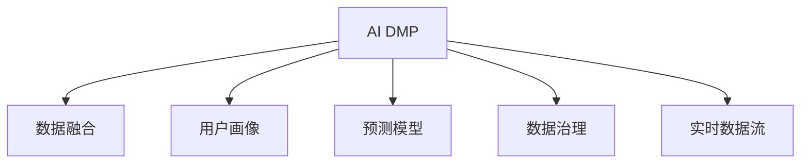

                 

# AI DMP 数据基建：数据模型与算法

## 1. 背景介绍

### 1.1 问题由来

数字营销生态中，用户的全生命周期数据散落在各处，包括电商平台、社交媒体、搜索引擎、智能家居等。传统的数据管理系统无法整合这些不同来源的数据，导致数据分散、冗余和难以管理。AI驱动的数据中台（DMP，Data Management Platform）技术旨在通过数据治理和智能化处理，实现数据的全方位整合、管理和应用。AI DMP 融合了数据治理、数据科学和人工智能技术，成为新一轮数据竞争的核心利器。

### 1.2 问题核心关键点

AI DMP 的核心在于数据模型和算法的构建，通过先进的机器学习算法和数据模型，实现对海量数据的深度分析和智能决策。其中关键包括：

1. 用户画像：利用用户行为数据构建详细的用户画像，识别出不同特征的用户群体。
2. 预测模型：构建高效的预测模型，预测用户的行为和意向，指导个性化推荐、广告投放等。
3. 数据治理：对数据进行分类、标准化、去重、脱敏等治理工作，确保数据质量。
4. 数据融合：实现不同来源数据的无缝融合，消除数据孤岛，形成统一的数据视图。
5. 实时数据流：利用实时数据流处理技术，提升数据处理的效率和实时性。

### 1.3 问题研究意义

构建AI DMP 的数学模型与算法，对于提升数字营销的精准度和效果，实现智能决策和个性化推荐，具有重要意义：

1. 提升广告投放效果。通过精确的用户画像和预测模型，广告主可以更精准地触达目标用户，提高广告转化率和ROI。
2. 优化产品推荐。通过个性化推荐模型，电商平台可以更好地匹配用户需求，提升用户粘性和购买率。
3. 增强用户交互体验。通过智能交互算法，智能家居、客服系统等可以更好地理解和响应用户需求，提升用户体验。
4. 加速数据驱动决策。通过数据分析和预测，企业可以更科学地制定营销策略和产品规划，提高业务决策效率。
5. 促进数据共享与合作。AI DMP 使得不同部门、不同来源的数据可以无缝整合，实现数据共享与协同工作。

## 2. 核心概念与联系

### 2.1 核心概念概述

为更好地理解AI DMP 的数学模型与算法，本节将介绍几个密切相关的核心概念：

- AI DMP：利用人工智能技术实现数据治理和智能决策的数据中台系统。
- 数据融合（Data Fusion）：将不同来源的数据进行集成和融合，消除数据孤岛，形成统一的数据视图。
- 用户画像（User Profile）：通过分析用户行为数据，构建详细的用户特征和行为模型。
- 预测模型（Prediction Model）：利用机器学习算法构建预测用户行为和意向的模型。
- 数据治理（Data Governance）：对数据进行分类、标准化、去重、脱敏等治理工作，确保数据质量。
- 实时数据流（Real-time Data Streaming）：利用流处理技术实现数据的实时处理和分析。

这些核心概念之间的逻辑关系可以通过以下Mermaid流程图来展示：



这个流程图展示了大数据管理平台的各个核心组件及其之间的关系：

1. AI DMP 是数据融合的核心平台，将不同来源的数据进行整合。
2. 用户画像是在数据融合的基础上，对用户进行详细特征和行为建模。
3. 预测模型是在用户画像的基础上，构建预测用户行为和意向的智能算法。
4. 数据治理是对数据进行治理和清洗，确保数据质量。
5. 实时数据流是实现数据的实时处理和分析，提升决策的时效性。

这些核心概念共同构成了AI DMP 的完整体系，使得企业能够高效地管理和应用海量数据，实现智能化决策。

## 3. 核心算法原理 & 具体操作步骤

### 3.1 算法原理概述

AI DMP 的核心算法原理，是通过构建数据模型和预测模型，实现数据的深度分析和智能决策。其中，数据模型用于描述数据的结构和特征，预测模型用于预测用户行为和意向。

数据模型一般包括：

- 聚类模型（Cluster Model）：通过分析用户行为数据，对用户进行聚类分组，识别出不同特征的用户群体。
- 关联规则模型（Association Rule Model）：通过分析用户行为数据，挖掘出不同行为之间的关联规律。
- 序列模型（Sequence Model）：通过分析用户行为序列，预测用户未来的行为和意向。

预测模型一般包括：

- 分类模型（Classification Model）：预测用户的行为类别，如购买、点击等。
- 回归模型（Regression Model）：预测用户的连续数值变量，如消费金额、访问时长等。
- 推荐模型（Recommendation Model）：根据用户的历史行为和兴趣，推荐相关产品或内容。

### 3.2 算法步骤详解

AI DMP 的数据建模与预测模型的构建，通常包括以下几个关键步骤：

**Step 1: 数据预处理**

- 收集各来源的数据，进行清洗和去重。
- 进行数据标准化，确保不同来源的数据格式统一。
- 进行数据脱敏，保护用户隐私。

**Step 2: 数据融合**

- 利用数据融合技术，将不同来源的数据进行集成和合并，消除数据孤岛。
- 利用关联规则和序列模型，挖掘不同数据之间的关联规律。

**Step 3: 用户画像构建**

- 利用聚类算法，对用户进行聚类分组，识别出不同特征的用户群体。
- 利用向量表示法，将用户画像转化为高维向量。
- 利用降维技术，减少用户画像的维度，提升计算效率。

**Step 4: 预测模型训练**

- 利用分类、回归和推荐算法，构建预测用户行为和意向的模型。
- 利用交叉验证和超参数调优，选择最优的预测模型。
- 利用在线学习算法，不断更新和优化预测模型。

**Step 5: 数据治理**

- 对模型输出的预测结果进行分类、标准化、去重、脱敏等治理工作。
- 对模型参数进行监控和调优，确保预测模型的稳定性和准确性。
- 对数据质量进行持续评估和优化，提升数据治理效果。

**Step 6: 实时数据流处理**

- 利用实时数据流处理技术，实现数据的实时采集、处理和分析。
- 利用流处理算法，对实时数据进行高效处理和分析。
- 利用流处理结果，进行实时决策和智能推荐。

### 3.3 算法优缺点

AI DMP 的数据建模与预测模型具有以下优点：

1. 精确性高。通过先进的数据融合和用户画像构建，AI DMP 能够精确地描述用户行为和特征，提高预测模型的准确性。
2. 效率高。通过分布式计算和实时数据流处理，AI DMP 能够实现高效的数据处理和分析，提升实时决策能力。
3. 鲁棒性好。通过数据治理和模型调优，AI DMP 能够有效避免数据噪音和过拟合问题，提升模型的鲁棒性。
4. 可扩展性强。通过模块化设计和组件化构建，AI DMP 能够快速扩展和定制，适应不同业务需求。

同时，该算法也存在一些局限性：

1. 数据依赖性强。AI DMP 的效果依赖于高质量的数据，如果数据质量差，模型效果也会大打折扣。
2. 模型复杂度高。AI DMP 的模型通常较为复杂，需要较高的计算资源和算力支持。
3. 需要专业知识。AI DMP 的构建和优化需要专业知识，需要跨学科的人才团队支持。
4. 隐私问题突出。AI DMP 的数据治理和隐私保护需要严格处理，避免泄露用户隐私。

尽管存在这些局限性，但就目前而言，AI DMP 的数据建模与预测算法仍是数据管理平台的核心技术，广泛应用于数字营销、智能推荐、实时决策等多个领域。

### 3.4 算法应用领域

AI DMP 的数据建模与预测算法，在以下领域已经得到了广泛的应用：

- 广告投放优化：通过用户画像和预测模型，实现广告精准投放，提升广告转化率和ROI。
- 个性化推荐：利用推荐模型，根据用户的历史行为和兴趣，推荐相关产品或内容，提升用户粘性和购买率。
- 智能客服系统：通过智能交互算法，客服系统可以更好地理解和响应用户需求，提升用户体验。
- 电商推荐系统：通过推荐模型，电商平台可以更好地匹配用户需求，提升推荐效果。
- 供应链优化：通过预测模型，对供应链进行优化，提升物流效率和客户满意度。

除了上述这些经典应用外，AI DMP 的数据建模与预测算法也被创新性地应用到更多场景中，如智能广告投放、个性化营销、智能运营等，为数字营销带来全新的突破。

## 4. 数学模型和公式 & 详细讲解 & 举例说明

### 4.1 数学模型构建

本节将使用数学语言对AI DMP 的数据建模与预测模型进行更加严格的刻画。

**数据融合模型**

数据融合模型一般使用基于图论的算法，将不同来源的数据进行集成和合并，消除数据孤岛。常用的算法包括：

- 关联规则算法（如Apriori、FP-Growth）：通过挖掘不同数据之间的关联规律，实现数据融合。
- 序列挖掘算法（如Seq2Seq、RNN）：通过分析用户行为序列，实现数据融合。
- 聚类算法（如K-means、GMM）：通过将不同数据聚类分组，实现数据融合。

**用户画像模型**

用户画像模型一般使用向量表示法，将用户画像转化为高维向量。常用的算法包括：

- 主成分分析（PCA）：通过降维技术，减少用户画像的维度，提升计算效率。
- 奇异值分解（SVD）：通过奇异值分解，将用户画像转化为高维向量。
- 隐含语义模型（LSA）：通过隐含语义分析，提取用户画像的语义特征。

**预测模型**

预测模型一般使用机器学习算法，预测用户行为和意向。常用的算法包括：

- 分类算法（如决策树、随机森林、SVM）：通过分类算法，预测用户的行为类别。
- 回归算法（如线性回归、逻辑回归、神经网络）：通过回归算法，预测用户的连续数值变量。
- 推荐算法（如协同过滤、基于内容的推荐）：通过推荐算法，根据用户的历史行为和兴趣，推荐相关产品或内容。

### 4.2 公式推导过程

以下我们以用户画像构建为例，推导聚类算法的数学公式。

假设用户行为数据为 $D=\{(x_i, y_i)\}_{i=1}^N$，其中 $x_i$ 为行为特征， $y_i$ 为行为标签。

聚类算法的基本思想是，将相似的数据点归为同一类，不同类之间的相似度较低。常用的聚类算法为K-means，其基本公式为：

$$
k-means: \arg\min_{C,\mu} \sum_{i=1}^N\sum_{c=1}^k ||x_i - \mu_c||^2
$$

其中 $C$ 为聚类标签， $\mu_c$ 为第 $c$ 类的聚类中心，$||\cdot||$ 为欧氏距离。

通过求解上述优化问题，可以找到最优的聚类标签和聚类中心，构建详细的用户画像。

### 4.3 案例分析与讲解

**案例一：广告投放优化**

某电商广告投放平台希望通过AI DMP 实现精准投放，需要构建用户画像和预测模型。具体步骤如下：

1. 数据收集：收集用户在电商平台上的行为数据，包括浏览记录、点击记录、购买记录等。
2. 数据融合：通过关联规则和序列模型，将不同来源的数据进行集成和合并，消除数据孤岛。
3. 用户画像构建：利用聚类算法，对用户进行聚类分组，识别出不同特征的用户群体。
4. 预测模型训练：利用分类和回归算法，构建预测用户行为和意向的模型。
5. 数据治理：对模型输出的预测结果进行分类、标准化、去重、脱敏等治理工作。
6. 实时数据流处理：利用实时数据流处理技术，实现广告投放的实时决策和智能推荐。

最终，该平台通过AI DMP 构建的用户画像和预测模型，实现了广告精准投放，提升了广告转化率和ROI。

**案例二：个性化推荐**

某视频平台希望通过AI DMP 实现个性化推荐，需要构建用户画像和推荐模型。具体步骤如下：

1. 数据收集：收集用户在视频平台上的行为数据，包括观看记录、评分记录、搜索记录等。
2. 数据融合：通过关联规则和序列模型，将不同来源的数据进行集成和合并，消除数据孤岛。
3. 用户画像构建：利用聚类算法，对用户进行聚类分组，识别出不同特征的用户群体。
4. 预测模型训练：利用推荐算法，根据用户的历史行为和兴趣，推荐相关视频内容。
5. 数据治理：对模型输出的推荐结果进行分类、标准化、去重、脱敏等治理工作。
6. 实时数据流处理：利用实时数据流处理技术，实现视频的实时推荐和动态调整。

最终，该平台通过AI DMP 构建的用户画像和推荐模型，实现了个性化推荐，提升了用户粘性和观看时长。

## 5. 项目实践：代码实例和详细解释说明

### 5.1 开发环境搭建

在进行AI DMP 的数据建模与预测模型构建时，需要准备好开发环境。以下是使用Python进行PyTorch开发的环境配置流程：

1. 安装Anaconda：从官网下载并安装Anaconda，用于创建独立的Python环境。

2. 创建并激活虚拟环境：
```bash
conda create -n ai-dmp-env python=3.8 
conda activate ai-dmp-env
```

3. 安装PyTorch：根据CUDA版本，从官网获取对应的安装命令。例如：
```bash
conda install pytorch torchvision torchaudio cudatoolkit=11.1 -c pytorch -c conda-forge
```

4. 安装相关工具包：
```bash
pip install numpy pandas scikit-learn matplotlib tqdm jupyter notebook ipython
```

完成上述步骤后，即可在`ai-dmp-env`环境中开始数据建模与预测模型的实践。

### 5.2 源代码详细实现

这里以广告投放优化为例，给出使用PyTorch构建用户画像和预测模型的代码实现。

首先，定义数据预处理函数：

```python
import torch
import pandas as pd
from sklearn.preprocessing import StandardScaler, OneHotEncoder
from sklearn.decomposition import PCA

def preprocess_data(df, scale=True, one_hot=False):
    if scale:
        scaler = StandardScaler()
        df['features'] = scaler.fit_transform(df[['feature1', 'feature2', 'feature3']])
    if one_hot:
        encoder = OneHotEncoder(sparse=False)
        df['features'] = encoder.fit_transform(df[['category1', 'category2', 'category3']])
    return df
```

然后，定义数据融合函数：

```python
def data_fusion(data1, data2):
    combined_data = pd.concat([data1, data2], axis=0, ignore_index=True)
    return combined_data
```

接着，定义用户画像构建函数：

```python
def user_profile(data, n_clusters=5, scale=True, one_hot=False):
    if scale:
        scaler = StandardScaler()
        data['features'] = scaler.fit_transform(data[['feature1', 'feature2', 'feature3']])
    if one_hot:
        encoder = OneHotEncoder(sparse=False)
        data['features'] = encoder.fit_transform(data[['category1', 'category2', 'category3']])
    features = data['features'].tolist()
    kmeans = KMeans(n_clusters=n_clusters).fit(features)
    labels = kmeans.labels_
    return labels
```

最后，定义预测模型训练函数：

```python
from sklearn.linear_model import LogisticRegression

def train_model(data, target, n_classes=2, scale=True, one_hot=False):
    if scale:
        scaler = StandardScaler()
        data['features'] = scaler.fit_transform(data[['feature1', 'feature2', 'feature3']])
    if one_hot:
        encoder = OneHotEncoder(sparse=False)
        data['features'] = encoder.fit_transform(data[['category1', 'category2', 'category3']])
    model = LogisticRegression(solver='lbfgs')
    model.fit(data['features'], target)
    return model
```

完成上述步骤后，即可在`ai-dmp-env`环境中开始构建AI DMP 的聚类和预测模型。

### 5.3 代码解读与分析

让我们再详细解读一下关键代码的实现细节：

**preprocess_data函数**

- `preprocess_data`函数对输入的DataFrame进行预处理，包括特征缩放和特征编码。根据输入的`scale`和`one_hot`参数，选择是否进行特征缩放和特征编码。
- 特征缩放使用`StandardScaler`对数值型特征进行标准化处理，确保不同特征的分布相似。
- 特征编码使用`OneHotEncoder`对分类型特征进行独热编码，确保不同类别特征的一维性。

**data_fusion函数**

- `data_fusion`函数将两个DataFrame进行合并，并重新编号，消除数据孤岛。
- 使用`concat`方法进行DataFrame合并，设置`ignore_index`参数为True，确保合并后的DataFrame从新编号。

**user_profile函数**

- `user_profile`函数根据输入的DataFrame，构建用户画像，并进行聚类分组。
- 对数值型特征进行标准化处理，使用`StandardScaler`。
- 对分类型特征进行独热编码，使用`OneHotEncoder`。
- 使用`KMeans`算法进行聚类分组，设置`n_clusters`参数为指定类别数量。

**train_model函数**

- `train_model`函数根据输入的DataFrame和目标变量，训练预测模型。
- 对数值型特征进行标准化处理，使用`StandardScaler`。
- 对分类型特征进行独热编码，使用`OneHotEncoder`。
- 使用`LogisticRegression`算法进行分类模型训练，设置`solver`参数为`lbfgs`。

可以看到，PyTorch配合Scikit-learn使得数据建模与预测模型的代码实现变得简洁高效。开发者可以将更多精力放在数据处理、模型改进等高层逻辑上，而不必过多关注底层的实现细节。

当然，工业级的系统实现还需考虑更多因素，如模型的保存和部署、超参数的自动搜索、更灵活的任务适配层等。但核心的数据建模与预测模型的构建流程基本与此类似。

## 6. 实际应用场景

### 6.1 智能广告投放

基于AI DMP 的广告投放优化，可以通过用户画像和预测模型，实现广告的精准投放。智能广告系统可以根据用户的行为特征和兴趣标签，预测用户是否会对广告感兴趣，从而进行有针对性的投放。

在技术实现上，可以收集用户在电商平台上的行为数据，包括浏览记录、点击记录、购买记录等。将这些数据输入到预训练好的聚类模型中，构建用户画像。再利用回归模型或分类模型，预测用户对广告的响应概率，优化广告投放策略。最终，智能广告系统可以根据用户画像和预测结果，进行实时投放和动态调整。

### 6.2 个性化推荐系统

AI DMP 的个性化推荐系统，可以通过用户画像和推荐模型，实现个性化推荐。推荐系统可以根据用户的历史行为和兴趣，推荐相关产品或内容。

在技术实现上，可以收集用户在视频平台上的行为数据，包括观看记录、评分记录、搜索记录等。将这些数据输入到预训练好的聚类模型中，构建用户画像。再利用推荐算法，根据用户的历史行为和兴趣，推荐相关视频内容。最终，推荐系统可以根据用户画像和推荐模型，进行实时推荐和动态调整。

### 6.3 智能客服系统

基于AI DMP 的智能客服系统，可以通过用户画像和预测模型，实现智能客服。客服系统可以根据用户的行为特征和兴趣标签，预测用户的问题意图，从而进行有针对性的回复。

在技术实现上，可以收集用户在智能家居设备上的行为数据，包括语音指令、设备使用记录等。将这些数据输入到预训练好的聚类模型中，构建用户画像。再利用分类模型，预测用户的问题意图，生成智能回复。最终，智能客服系统可以根据用户画像和预测结果，进行实时交互和动态调整。

### 6.4 未来应用展望

随着AI DMP 技术的发展，未来AI DMP 的应用场景将更加广泛。以下是几个未来可能的应用领域：

1. 医疗诊断：通过AI DMP 构建医疗病例数据库，结合患者病历、医疗记录等信息，进行智能诊断和治疗推荐。
2. 金融风控：通过AI DMP 构建用户金融行为数据，进行信用评估、风险预测和反欺诈检测。
3. 智能制造：通过AI DMP 构建工厂设备数据，进行生产优化、质量控制和设备维护预测。
4. 教育推荐：通过AI DMP 构建学生学习行为数据，进行个性化课程推荐和智能辅导。
5. 城市管理：通过AI DMP 构建城市交通数据，进行交通流量预测、交通信号优化和智能调度。

总之，AI DMP 技术的应用场景将不断扩展，为各行业带来更多智能化、个性化的服务体验。

## 7. 工具和资源推荐

### 7.1 学习资源推荐

为了帮助开发者系统掌握AI DMP 的数据建模与预测模型，这里推荐一些优质的学习资源：

1. 《Python数据分析基础》系列博文：由数据科学家撰写，深入浅出地介绍了Python数据分析的基本概念和常用库，如NumPy、Pandas、Scikit-learn等。
2. 《深度学习入门：基于Python的理论与实现》书籍：介绍深度学习的基本原理和常用模型，如神经网络、卷积神经网络、循环神经网络等。
3. 《机器学习实战》书籍：结合实际案例，介绍了机器学习的基本算法和应用，如K-means聚类、决策树、回归分析等。
4. Coursera《机器学习》课程：斯坦福大学开设的机器学习课程，系统讲解了机器学习的基本理论和常用算法。
5. Udacity《深度学习专项》课程：涵盖深度学习的各个领域，包括卷积神经网络、循环神经网络、生成对抗网络等。

通过对这些资源的学习实践，相信你一定能够快速掌握AI DMP 的数据建模与预测模型的精髓，并用于解决实际的数字营销问题。

### 7.2 开发工具推荐

高效的开发离不开优秀的工具支持。以下是几款用于AI DMP 数据建模与预测模型开发的常用工具：

1. Python：作为AI DMP 的主要编程语言，Python有丰富的第三方库和工具支持，如Scikit-learn、TensorFlow、PyTorch等。
2. Jupyter Notebook：提供交互式编程环境，便于代码调试和实验。
3. TensorBoard：TensorFlow配套的可视化工具，可以实时监测模型训练状态，并提供丰富的图表呈现方式。
4. Weights & Biases：模型训练的实验跟踪工具，可以记录和可视化模型训练过程中的各项指标。
5. Google Colab：提供免费的GPU算力，便于快速实验和测试。

合理利用这些工具，可以显著提升AI DMP 数据建模与预测模型的开发效率，加快创新迭代的步伐。

### 7.3 相关论文推荐

AI DMP 数据建模与预测技术的发展源于学界的持续研究。以下是几篇奠基性的相关论文，推荐阅读：

1. K-means聚类算法：由James Macqueen提出，是聚类分析的经典算法，广泛应用于数据挖掘、图像处理等领域。
2. 决策树算法：由J. Ross Quinlan提出，是分类和回归的经典算法，具有高效、易解释的特点。
3. 逻辑回归算法：由David W. McFadden提出，是机器学习中的经典算法，广泛应用于金融风控、医疗诊断等领域。
4. 深度学习中的卷积神经网络（CNN）：由Yann LeCun等提出，是图像处理、自然语言处理中的经典算法，具有强大的特征提取能力。
5. 深度学习中的循环神经网络（RNN）：由Sepp Hochreiter等提出，是序列数据处理中的经典算法，具有强大的序列建模能力。

这些论文代表了大数据管理平台数据建模与预测技术的发展脉络。通过学习这些前沿成果，可以帮助研究者把握学科前进方向，激发更多的创新灵感。

## 8. 总结：未来发展趋势与挑战

### 8.1 总结

本文对AI DMP 的数据建模与预测模型进行了全面系统的介绍。首先阐述了AI DMP 的核心概念和应用意义，明确了数据建模与预测模型的构建和优化对提升数字营销精准度和效果的重要性。其次，从原理到实践，详细讲解了数据建模与预测模型的数学公式和算法步骤，给出了数据建模与预测模型的代码实例。同时，本文还广泛探讨了数据建模与预测模型在广告投放、个性化推荐、智能客服等多个领域的应用前景，展示了数据建模与预测模型的大规模应用潜力。

通过本文的系统梳理，可以看到，AI DMP 的数据建模与预测模型正在成为数字营销的核心技术，极大地提升了广告投放、个性化推荐、智能客服等应用的精准度和效果。AI DMP 的数据建模与预测模型，通过深度分析和智能决策，使得数字营销进入了智能化、个性化、实时化的大数据时代。未来，伴随数据建模与预测技术的不断演进，相信AI DMP 将在更多领域大放异彩，为数字营销带来新的突破。

### 8.2 未来发展趋势

展望未来，AI DMP 的数据建模与预测技术将呈现以下几个发展趋势：

1. 算法精度更高。通过深度学习和大数据技术，AI DMP 的预测模型将不断提升，预测准确率将不断提高。
2. 模型更加灵活。通过模块化设计和组件化构建，AI DMP 将更加灵活，能够快速定制和优化。
3. 实时性更强。通过实时数据流处理技术，AI DMP 将实现实时决策和智能推荐，提升业务响应速度。
4. 数据治理更完善。通过数据清洗和治理，AI DMP 将保证数据质量，提升数据建模与预测的效果。
5. 跨领域应用更广泛。通过与物联网、人工智能、大数据等技术的深度融合，AI DMP 将拓展到更多领域，实现智能决策和个性化推荐。

以上趋势凸显了AI DMP 数据建模与预测技术的广阔前景。这些方向的探索发展，必将进一步提升AI DMP 的数据处理能力和智能决策水平，为数字营销带来新的突破。

### 8.3 面临的挑战

尽管AI DMP 的数据建模与预测技术已经取得了瞩目成就，但在迈向更加智能化、普适化应用的过程中，它仍面临着诸多挑战：

1. 数据质量依赖性强。AI DMP 的效果依赖于高质量的数据，如果数据质量差，模型效果也会大打折扣。
2. 模型复杂度高。AI DMP 的模型通常较为复杂，需要较高的计算资源和算力支持。
3. 需要专业知识。AI DMP 的构建和优化需要专业知识，需要跨学科的人才团队支持。
4. 隐私问题突出。AI DMP 的数据治理和隐私保护需要严格处理，避免泄露用户隐私。
5. 资源瓶颈明显。AI DMP 的实时数据流处理和分布式计算，需要高性能设备和算力支持。

尽管存在这些挑战，但就目前而言，AI DMP 的数据建模与预测技术仍是数据管理平台的核心技术，广泛应用于数字营销、智能推荐、实时决策等多个领域。未来，AI DMP 需要不断突破技术瓶颈，提升数据质量，优化算法模型，才能在更广泛的应用场景中发挥更大作用。

### 8.4 研究展望

未来，AI DMP 的数据建模与预测技术需要在以下几个方面寻求新的突破：

1. 探索无监督和半监督数据建模方法。摆脱对大规模标注数据的依赖，利用自监督学习、主动学习等无监督和半监督范式，最大限度利用非结构化数据，实现更加灵活高效的数据建模。
2. 研究高效的数据融合和用户画像构建方法。优化数据融合和用户画像构建算法，提升算法的效率和效果，确保数据的完整性和一致性。
3. 结合因果分析和强化学习范式。通过引入因果推断和强化学习思想，增强预测模型的建立稳定因果关系的能力，学习更加普适、鲁棒的语言表征，从而提升模型泛化性和抗干扰能力。
4. 引入更多先验知识。将符号化的先验知识，如知识图谱、逻辑规则等，与神经网络模型进行巧妙融合，引导数据建模过程学习更准确、合理的语言模型。
5. 结合博弈论工具。将博弈论思想引入数据建模和预测模型中，探索用户和系统之间的博弈关系，实现更加精准和高效的智能决策。

这些研究方向的探索，必将引领AI DMP 的数据建模与预测技术迈向更高的台阶，为数字营销带来新的突破。面向未来，AI DMP 需要与其他人工智能技术进行更深入的融合，如知识表示、因果推理、强化学习等，多路径协同发力，共同推动数字营销技术的发展。

## 9. 附录：常见问题与解答

**Q1：AI DMP 的构建和优化需要哪些专业知识？**

A: AI DMP 的构建和优化需要跨学科的专业知识，包括：

1. 数据科学：需要对数据进行清洗、标准化、去重、脱敏等治理工作，确保数据质量。
2. 机器学习：需要设计并优化预测模型，选择最优的算法和超参数。
3. 编程技能：需要编写高质量的Python代码，进行数据处理、模型训练、部署和维护。
4. 业务理解：需要深入理解业务需求，设计合理的算法和模型，优化决策效果。

开发者可以通过学习相关的专业课程和资源，系统掌握AI DMP 的构建和优化技能。

**Q2：AI DMP 的数据建模与预测模型的局限性有哪些？**

A: AI DMP 的数据建模与预测模型虽然具有强大的数据处理能力和智能决策水平，但也存在一些局限性：

1. 数据依赖性强。AI DMP 的效果依赖于高质量的数据，如果数据质量差，模型效果也会大打折扣。
2. 模型复杂度高。AI DMP 的模型通常较为复杂，需要较高的计算资源和算力支持。
3. 需要专业知识。AI DMP 的构建和优化需要专业知识，需要跨学科的人才团队支持。
4. 隐私问题突出。AI DMP 的数据治理和隐私保护需要严格处理，避免泄露用户隐私。
5. 资源瓶颈明显。AI DMP 的实时数据流处理和分布式计算，需要高性能设备和算力支持。

开发者需要在设计和优化AI DMP 时，充分考虑这些局限性，合理设计算法和模型，优化资源配置。

**Q3：AI DMP 的实时数据流处理有哪些挑战？**

A: AI DMP 的实时数据流处理面临以下挑战：

1. 数据延迟：实时数据流处理需要低延迟，但数据采集、传输、处理等环节可能存在延迟，影响实时性。
2. 数据一致性：实时数据流处理需要保证数据的一致性和完整性，避免数据丢失或重复。
3. 资源消耗：实时数据流处理需要高性能设备和算力支持，避免资源瓶颈。
4. 系统复杂度：实时数据流处理需要复杂的系统设计和优化，避免系统故障和崩溃。

开发者需要在设计和优化实时数据流处理系统时，充分考虑这些挑战，合理选择算法和工具，优化系统架构。

**Q4：AI DMP 的数据建模与预测模型在落地部署时需要注意哪些问题？**

A: AI DMP 的数据建模与预测模型在落地部署时，需要注意以下问题：

1. 模型裁剪：去除不必要的层和参数，减小模型尺寸，加快推理速度。
2. 量化加速：将浮点模型转为定点模型，压缩存储空间，提高计算效率。
3. 服务化封装：将模型封装为标准化服务接口，便于集成调用。
4. 弹性伸缩：根据请求流量动态调整资源配置，平衡服务质量和成本。
5. 监控告警：实时采集系统指标，设置异常告警阈值，确保服务稳定性。
6. 安全防护：采用访问鉴权、数据脱敏等措施，保障数据和模型安全。

开发者需要在设计和部署AI DMP 模型时，充分考虑这些问题，合理选择算法和工具，优化系统架构。

---

作者：禅与计算机程序设计艺术 / Zen and the Art of Computer Programming

