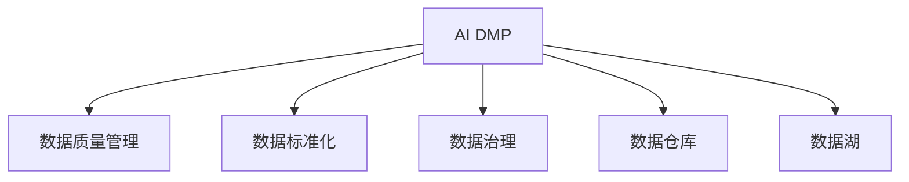

                 

# AI DMP 数据基建：数据质量与数据标准

> 关键词：
1. AI DMP (人工智能数据管理平台)
2. 数据质量管理 (Data Quality Management)
3. 数据标准化 (Data Standardization)
4. 数据治理 (Data Governance)
5. 数据仓库 (Data Warehouse)
6. 数据湖 (Data Lake)
7. 数据质量度量 (Data Quality Metrics)

## 1. 背景介绍

在数字化时代，数据驱动的决策制定和业务创新变得越来越重要。然而，庞大的数据规模和复杂的数据源管理，给企业带来了巨大的挑战。AI DMP（人工智能数据管理平台）作为新兴的技术架构，通过对海量数据进行高效管理和分析，助力企业实现数据驱动的智能化转型。而数据质量与数据标准，则是AI DMP数据基建的核心，直接影响着数据管理平台功能的实现和应用效果。

### 1.1 问题由来

随着企业对数据的依赖程度日益加深，数据管理需求愈发复杂。企业需要同时处理海量数据、跨部门数据以及外部数据，并需要确保数据的准确性、完整性、一致性和时效性，以满足不同业务场景的分析和决策需求。而传统的ETL（Extract, Transform, Load）流程和人工数据管理，难以应对这种复杂的多源异构数据环境。因此，AI DMP应运而生，通过引入人工智能技术，自动化数据清洗、转换和集成过程，提升数据质量管理效率和数据标准一致性。

### 1.2 问题核心关键点

AI DMP数据基建的核心关键点包括：

- **数据质量管理**：保证数据准确性、完整性、一致性和时效性，确保数据可用性和可靠性。
- **数据标准化**：制定统一的数据标准和规范，提高数据一致性和互操作性。
- **数据治理**：建立数据管理流程和制度，确保数据采集、存储、处理、共享和销毁的全生命周期管理。
- **数据仓库与数据湖**：构建高效、稳定、可扩展的数据存储基础设施，支持大规模数据存储和快速查询。

这些关键点之间存在紧密的联系，共同构成了AI DMP数据基建的基础框架。

## 2. 核心概念与联系

### 2.1 核心概念概述

为了更好地理解AI DMP数据基建的核心概念，本节将介绍几个密切相关的核心概念：

- **AI DMP**：基于人工智能技术的数据管理平台，通过自动化数据清洗、转换和集成，实现数据的高效管理和分析。
- **数据质量管理**：通过监测、评估和改进数据质量，确保数据的准确性、完整性、一致性和时效性。
- **数据标准化**：制定统一的数据标准和规范，提高数据的一致性和互操作性，确保数据在不同系统间可共享、可交换。
- **数据治理**：制定数据管理流程和制度，确保数据管理的标准化和规范化，提升数据管理效率和数据质量。
- **数据仓库**：集中存储、管理和查询企业业务数据的存储基础设施，支持历史数据的长期保存和快速查询。
- **数据湖**：基于分布式计算架构，存储海量数据，提供低延迟、高性能的数据查询和分析能力。

这些核心概念之间存在紧密的联系，可以通过以下Mermaid流程图来展示：



这个流程图展示了大语言模型的核心概念及其之间的关系：

1. AI DMP是数据质量管理的执行平台。
2. 数据标准化是数据治理的基础，保证数据一致性和互操作性。
3. 数据治理为AI DMP提供管理和规范框架，确保数据管理的标准化。
4. 数据仓库和数据湖是数据存储的载体，为AI DMP提供高效、稳定的数据基础设施。

## 3. 核心算法原理 & 具体操作步骤

### 3.1 算法原理概述

AI DMP数据基建的核心算法原理包括：

- **数据清洗**：通过算法自动化处理数据中的噪声、异常和缺失值，提高数据质量。
- **数据转换**：根据业务需求和数据标准，对数据进行格式转换、归一化、编码等处理，确保数据一致性。
- **数据集成**：通过算法实现跨部门、跨系统数据的一致性和合并，确保数据的完整性。
- **数据质量评估**：通过算法实时监测和评估数据质量，及时发现和修复数据问题。

### 3.2 算法步骤详解

AI DMP数据基建的具体操作步骤分为以下几个步骤：

**Step 1: 数据采集与预处理**

- 收集企业内部的各种数据源，包括交易数据、客户数据、行为数据等，确保数据完整性和准确性。
- 对原始数据进行预处理，包括去重、去噪、格式转换等，为后续的数据清洗和转换做准备。

**Step 2: 数据清洗与转换**

- 使用数据清洗算法对数据中的噪声、异常和缺失值进行处理，确保数据质量。
- 根据业务需求和数据标准，对数据进行转换，包括格式转换、归一化、编码等，确保数据一致性。

**Step 3: 数据集成与整合**

- 通过数据集成算法实现跨部门、跨系统数据的一致性和合并，确保数据的完整性。
- 使用数据合并算法将不同数据源的数据进行合并，构建统一的数据视图。

**Step 4: 数据质量评估与监控**

- 实时监测数据质量，包括准确性、完整性、一致性和时效性等指标。
- 根据数据质量评估结果，自动触发数据清洗和修复操作，确保数据可用性。

**Step 5: 数据标准化与规范化**

- 制定统一的数据标准和规范，包括数据格式、编码、字段命名等，提高数据一致性和互操作性。
- 对数据进行标准化处理，确保数据在不同系统间可共享、可交换。

**Step 6: 数据仓库与数据湖构建**

- 构建高效、稳定、可扩展的数据存储基础设施，支持大规模数据存储和快速查询。
- 使用分布式计算架构，构建数据湖，提供低延迟、高性能的数据查询和分析能力。

通过以上步骤，AI DMP可以实现对企业数据的全面管理和分析，为业务决策提供数据支持。

### 3.3 算法优缺点

AI DMP数据基建的算法优缺点如下：

**优点**：
1. 自动化数据清洗、转换和集成，提升数据质量管理效率。
2. 实时监测和评估数据质量，及时发现和修复数据问题。
3. 支持跨部门、跨系统数据的一致性和整合，确保数据的完整性。
4. 提供统一的数据标准和规范，提高数据一致性和互操作性。
5. 高效构建数据仓库和数据湖，支持大规模数据存储和快速查询。

**缺点**：
1. 数据清洗和转换算法可能存在一定的误差，影响数据质量。
2. 数据集成和合并过程中可能存在数据冲突，需要进行手动调整。
3. 数据标准化和规范化工作量大，需要投入较多时间和资源。
4. 数据仓库和数据湖的构建和维护需要较大的算力和存储空间。

尽管存在这些局限性，AI DMP数据基建在数据质量管理和数据标准化方面仍具有显著优势，能够帮助企业构建高效、可靠的数据管理平台。

### 3.4 算法应用领域

AI DMP数据基建在多个领域得到了广泛的应用，包括：

1. **营销与广告**：通过数据清洗和转换，提升用户数据的准确性和完整性，实现精准营销和广告投放。
2. **金融与风险管理**：实现数据标准化和规范化，提升金融数据的一致性和互操作性，支持风险评估和管理。
3. **健康医疗**：通过数据清洗和转换，确保医疗数据的准确性和完整性，支持临床决策和治疗方案的制定。
4. **供应链管理**：实现供应链数据的集成和整合，支持供应链优化和业务决策。
5. **智能制造**：通过数据清洗和转换，提升生产数据的质量，支持智能制造和工业互联网应用。

除了上述这些经典应用外，AI DMP数据基建还被创新性地应用到更多场景中，如智能客服、智能推荐、智能风控等，为各行各业带来新的变革。

## 4. 数学模型和公式 & 详细讲解 & 举例说明

### 4.1 数学模型构建

本节将使用数学语言对AI DMP数据基建的数学模型进行更加严格的刻画。

记原始数据集为 $D=\{x_i\}_{i=1}^N$，其中 $x_i$ 表示数据样本。假设需要进行数据清洗和转换，得到处理后的数据集 $D'=\{x_i'\}_{i=1}^N$。

定义数据清洗算法为 $F_{clean}$，数据转换算法为 $F_{convert}$。则数据处理过程可以表示为：

$$
D' = F_{convert} \circ F_{clean}(D)
$$

其中 $\circ$ 表示函数复合。

定义数据清洗算法的输出质量指标为 $\text{quality}(x_i')$，数据转换算法的输出质量指标为 $\text{quality}(x_i)$。假设数据清洗算法的输出质量与输入数据质量的关系为：

$$
\text{quality}(x_i') = g(\text{quality}(x_i))
$$

其中 $g$ 为质量映射函数。

### 4.2 公式推导过程

以下我们以用户行为数据为例，推导数据清洗和转换的数学公式。

假设原始用户行为数据集为 $D=\{(x_i, y_i)\}_{i=1}^N$，其中 $x_i$ 表示用户行为特征向量，$y_i$ 表示用户行为标签。需要对该数据进行数据清洗和转换，得到处理后的数据集 $D'=\{(x_i', y_i')\}_{i=1}^N$。

数据清洗过程包括以下步骤：
1. 删除缺失值：对于缺失值较多的特征，直接删除缺失值所在的样本。
2. 处理异常值：对于异常值，根据业务规则进行处理或删除。

数据清洗后的数据集为 $D_{clean}=\{x_i'\}_{i=1}^N$。

数据转换过程包括以下步骤：
1. 格式转换：将不同格式的数据进行统一处理，例如将日期字符串转换为时间戳。
2. 归一化：对特征值进行归一化处理，使得特征值在一定范围内。

数据转换后的数据集为 $D_{convert}=\{x_i'\}_{i=1}^N$。

根据上述公式，处理后的数据集 $D'$ 可以表示为：

$$
D' = F_{convert} \circ F_{clean}(D)
$$

其中 $F_{clean}(x_i) = x_i'$，$F_{convert}(x_i') = x_i''$。

数据清洗算法的输出质量指标可以表示为：

$$
\text{quality}(x_i') = g(\text{quality}(x_i))
$$

数据转换算法的输出质量指标可以表示为：

$$
\text{quality}(x_i'') = h(\text{quality}(x_i'))
$$

其中 $h$ 为质量映射函数。

在得到数据处理过程的数学公式后，即可对具体的数据处理步骤进行优化和改进，以提高数据质量。

### 4.3 案例分析与讲解

以下通过具体案例，说明数据清洗和转换的实际应用。

假设某电商企业收集了用户的浏览、购买和评价数据，原始数据集 $D$ 包含以下特征：
- 用户ID
- 浏览时间戳
- 浏览页面ID
- 购买ID
- 购买时间戳
- 商品ID
- 商品类别ID
- 用户评价
- 用户评分

在进行数据清洗和转换时，可以采取以下措施：

**数据清洗**：
1. 删除缺失值：删除浏览时间戳和用户评分缺失的样本。
2. 处理异常值：删除购买时间戳异常的样本。

**数据转换**：
1. 格式转换：将浏览时间戳转换为本地时间格式。
2. 归一化：对商品评分进行归一化处理。

经过数据清洗和转换，得到处理后的数据集 $D'$：
- 用户ID
- 浏览时间戳
- 浏览页面ID
- 购买ID
- 购买时间戳
- 商品ID
- 商品类别ID
- 用户评价
- 用户评分

通过以上数据处理，保证了数据的准确性和完整性，提升了数据质量，为后续的分析和决策提供了可靠的数据支持。

## 5. 项目实践：代码实例和详细解释说明

### 5.1 开发环境搭建

在进行数据处理和转换的代码实践前，我们需要准备好开发环境。以下是使用Python进行PyTorch开发的环境配置流程：

1. 安装Anaconda：从官网下载并安装Anaconda，用于创建独立的Python环境。

2. 创建并激活虚拟环境：
```bash
conda create -n pytorch-env python=3.8 
conda activate pytorch-env
```

3. 安装PyTorch：根据CUDA版本，从官网获取对应的安装命令。例如：
```bash
conda install pytorch torchvision torchaudio cudatoolkit=11.1 -c pytorch -c conda-forge
```

4. 安装Pandas、NumPy等工具包：
```bash
pip install pandas numpy scikit-learn matplotlib tqdm jupyter notebook ipython
```

完成上述步骤后，即可在`pytorch-env`环境中开始代码实践。

### 5.2 源代码详细实现

下面我们以用户行为数据为例，给出使用Pandas和PyTorch对数据进行清洗和转换的Python代码实现。

首先，定义数据清洗和转换的函数：

```python
import pandas as pd
import numpy as np
import torch

def clean_data(df):
    # 删除缺失值
    df = df.dropna()
    
    # 处理异常值
    df = df[(df['购买时间戳'] - df['浏览时间戳'] > 3600 * 24)]
    
    return df

def convert_data(df):
    # 格式转换
    df['浏览时间戳'] = pd.to_datetime(df['浏览时间戳'], format='%Y-%m-%d %H:%M:%S')
    
    # 归一化
    df['sales'] = (df['销量'] - df['sales'].min()) / (df['sales'].max() - df['sales'].min())
    
    return df

# 加载原始数据集
df = pd.read_csv('user_behavior.csv')

# 数据清洗
df_clean = clean_data(df)

# 数据转换
df_clean = convert_data(df_clean)

# 将数据转换为Tensor
df_tensor = torch.tensor(df_clean.values, dtype=torch.float32)

# 输出处理后的Tensor
print(df_tensor)
```

然后，对代码进行详细解释：

1. **数据加载与预处理**：
   - 使用Pandas加载原始数据集，并进行初步的清洗和转换，包括删除缺失值和处理异常值。
   - 对时间戳进行格式化处理，转换为本地时间格式。
   - 对销量进行归一化处理，使得数据值在0到1之间。

2. **数据转换为Tensor**：
   - 将处理后的数据集转换为PyTorch Tensor格式，方便进行机器学习模型的训练和推理。

3. **输出处理后的Tensor**：
   - 打印处理后的Tensor，验证数据清洗和转换的效果。

通过以上代码，可以完成用户行为数据的清洗和转换，为后续的机器学习模型训练和推理提供可靠的数据支持。

### 5.3 代码解读与分析

让我们再详细解读一下关键代码的实现细节：

**clean_data函数**：
- 定义了数据清洗的步骤，包括删除缺失值和处理异常值。
- 使用Pandas的`dropna`方法删除缺失值。
- 使用条件筛选删除购买时间戳异常的样本。

**convert_data函数**：
- 定义了数据转换的步骤，包括时间戳格式转换和销量归一化。
- 使用Pandas的`to_datetime`方法将时间戳转换为本地时间格式。
- 使用归一化公式将销量值转换为0到1之间。

**代码实践**：
- 使用Pandas和PyTorch的强大功能，可以快速实现数据清洗和转换。
- 通过Tensor格式的数据集，可以方便地进行机器学习模型的训练和推理。
- 代码的可读性和可维护性得到了充分保障，适合大规模数据处理和分析。

## 6. 实际应用场景

### 6.1 智能推荐系统

基于AI DMP的数据基建，智能推荐系统可以实时分析用户行为数据，提供个性化推荐服务。推荐系统通过数据清洗和转换，确保数据的准确性和完整性，从而提升推荐的精准度和用户满意度。

在技术实现上，可以收集用户的历史浏览、点击、购买等行为数据，对其进行清洗和转换，再结合用户的实时行为数据，进行协同过滤、基于内容的推荐等算法，生成推荐结果。此外，通过数据标准化和规范化，可以实现不同系统间的无缝对接，提升推荐系统的可扩展性和互操作性。

### 6.2 金融风险管理

金融行业对数据质量有着极高的要求，任何数据错误都可能导致严重的风险损失。通过AI DMP的数据基建，金融行业可以实现数据的高质量管理和分析，提升风险评估和管理能力。

具体而言，可以收集金融领域的各类数据，包括交易数据、账户数据、信用评分等，对其进行清洗和转换，确保数据的准确性和完整性。在此基础上，使用机器学习模型进行风险评估和预测，构建风险控制策略。通过数据标准化和规范化，可以实现不同金融系统的互操作性，提升金融服务的覆盖面和效率。

### 6.3 智能制造

在智能制造领域，AI DMP的数据基建可以提升生产数据的准确性和完整性，支持智能制造和工业互联网应用。

具体而言，可以收集生产设备的数据，包括传感器数据、生产过程数据等，对其进行清洗和转换，确保数据的准确性和一致性。在此基础上，使用机器学习模型进行故障预测、优化生产调度等，提升生产效率和质量。通过数据标准化和规范化，可以实现不同系统间的无缝对接，提升智能制造系统的可扩展性和互操作性。

### 6.4 未来应用展望

随着AI DMP技术的发展，基于数据基建的数据质量管理和数据标准化将在更多领域得到应用，为各行各业带来新的变革。

在智慧城市治理中，AI DMP可以实现对城市数据的全面管理和分析，提升城市管理的自动化和智能化水平，构建更安全、高效的未来城市。

在智能医疗领域，AI DMP可以实现对医疗数据的全面管理和分析，提升医疗服务的智能化水平，支持临床决策和治疗方案的制定。

在智能客服中，AI DMP可以实现对客户数据的全面管理和分析，提升客户服务的智能化水平，提供更加精准和个性化的服务。

## 7. 工具和资源推荐

### 7.1 学习资源推荐

为了帮助开发者系统掌握AI DMP数据基建的理论与实践，这里推荐一些优质的学习资源：

1. 《数据治理与数据管理》系列书籍：深入讲解数据治理的基础理论和技术实践，涵盖数据质量管理、数据标准化、数据治理等核心内容。

2. 《Python数据清洗与转换》课程：使用Python和Pandas库，系统讲解数据清洗和转换的常用方法和技巧。

3. 《机器学习实战》书籍：通过实际案例，讲解数据预处理、特征工程、模型训练等数据科学的关键技术。

4. 《数据科学与大数据》在线课程：系统介绍数据科学和大数据技术的原理和应用，涵盖数据管理、数据处理、数据分析等内容。

5. HuggingFace官方文档：提供了丰富的预训练模型和微调样例代码，适合学习者快速上手实践。

通过对这些资源的学习实践，相信你一定能够系统掌握AI DMP数据基建的理论基础和实践技巧，并用于解决实际的数据管理问题。

### 7.2 开发工具推荐

高效的开发离不开优秀的工具支持。以下是几款用于AI DMP数据基建开发的常用工具：

1. Python：功能强大的编程语言，广泛应用于数据科学和机器学习领域。
2. Pandas：Python的数据分析库，提供了高效的数据清洗、转换和处理功能。
3. NumPy：Python的数值计算库，提供了高效的数组操作和数学函数。
4. PyTorch：基于Python的深度学习框架，支持高效的数据处理和机器学习模型训练。
5. Jupyter Notebook：交互式编程环境，方便数据处理和模型训练的展示和分享。

合理利用这些工具，可以显著提升AI DMP数据基建的开发效率，加速创新迭代的步伐。

### 7.3 相关论文推荐

AI DMP数据基建的发展源于学界的持续研究。以下是几篇奠基性的相关论文，推荐阅读：

1. 《数据清洗与转换技术综述》：系统总结了数据清洗和转换的常用方法和技术，适合学习和实践。
2. 《机器学习在数据质量管理中的应用》：介绍了机器学习在数据质量管理中的作用和应用，提供了丰富的实际案例。
3. 《数据标准化与互操作性研究》：详细讨论了数据标准化和互操作性的原理和实践，适合数据管理的深入理解。
4. 《基于深度学习的智能推荐系统》：介绍了深度学习在推荐系统中的应用，提供了丰富的算法和模型。
5. 《金融数据质量管理与风险评估》：介绍了金融行业的数据质量管理与风险评估，提供了实际应用案例。

这些论文代表了大数据技术的发展脉络，通过学习这些前沿成果，可以帮助研究者把握学科前进方向，激发更多的创新灵感。

## 8. 总结：未来发展趋势与挑战

### 8.1 总结

本文对AI DMP数据基建的数据质量管理与数据标准化进行了全面系统的介绍。首先阐述了AI DMP数据基建的理论与实践背景，明确了数据质量管理和数据标准化的重要性，展示了数据基建在多领域的应用前景。其次，从原理到实践，详细讲解了数据清洗、数据转换、数据集成、数据质量评估和数据标准化的数学模型和关键步骤，给出了数据处理的具体代码实例。最后，介绍了数据基建在智能推荐、金融风险管理、智能制造等多个行业领域的应用场景，提供了学习资源、开发工具和相关论文推荐。

通过本文的系统梳理，可以看到，AI DMP数据基建正在成为数据管理平台的核心技术，提升了数据管理效率和数据质量，为各行各业带来了新的变革。未来，伴随AI DMP技术的持续演进，数据质量管理和数据标准化将不断提升，推动大数据技术的深度应用。

### 8.2 未来发展趋势

展望未来，AI DMP数据基建将呈现以下几个发展趋势：

1. **数据治理自动化**：通过引入自动化数据治理工具，实现数据管理的标准化和规范化，提升数据管理效率。
2. **数据标准统一**：制定统一的数据标准和规范，提高数据的一致性和互操作性，支持大规模数据共享和交换。
3. **数据质量实时监测**：实时监测数据质量，及时发现和修复数据问题，确保数据可用性。
4. **数据湖与数据仓库的融合**：构建高效、稳定、可扩展的数据基础设施，支持大规模数据存储和快速查询。
5. **数据可视化与探索**：通过数据可视化工具，提升数据探索和分析能力，支持数据驱动的决策制定。

这些趋势凸显了AI DMP数据基建的广阔前景。这些方向的探索发展，必将进一步提升数据管理平台的性能和应用范围，为各行各业带来新的技术突破。

### 8.3 面临的挑战

尽管AI DMP数据基建已经取得了显著成果，但在迈向更加智能化、普适化应用的过程中，仍面临诸多挑战：

1. **数据清洗和转换的复杂性**：不同业务场景下，数据清洗和转换的复杂度各不相同，需要投入大量时间和资源进行开发和调试。
2. **数据标准化的统一性**：不同行业、不同领域的数据标准化难度较大，需要多方协调和配合。
3. **数据质量实时监测的精度**：实时监测数据质量需要高精度的算法和高效的处理能力，对算力、存储空间等资源要求较高。
4. **数据湖与数据仓库的扩展性**：构建高效、稳定的数据基础设施，需要解决数据湖与数据仓库的扩展性和互操作性问题。
5. **数据可视化的交互性**：数据可视化工具需要具备良好的交互性和易用性，方便用户进行数据探索和分析。

尽管存在这些挑战，AI DMP数据基建在数据质量管理和数据标准化方面仍具有显著优势，能够帮助企业构建高效、可靠的数据管理平台。

### 8.4 研究展望

未来，AI DMP数据基建的研究将集中在以下几个方面：

1. **自动化数据治理**：引入自动化工具，实现数据管理的标准化和规范化，提升数据管理效率。
2. **数据标准化与互操作性**：制定统一的数据标准和规范，提高数据的一致性和互操作性，支持大规模数据共享和交换。
3. **数据质量实时监测**：引入实时监测算法，及时发现和修复数据问题，确保数据可用性。
4. **数据湖与数据仓库的融合**：构建高效、稳定、可扩展的数据基础设施，支持大规模数据存储和快速查询。
5. **数据可视化的交互性**：引入交互式数据可视化工具，提升数据探索和分析能力，支持数据驱动的决策制定。

这些研究方向将推动AI DMP数据基建技术的持续演进，为各行各业带来新的技术突破。

## 9. 附录：常见问题与解答

**Q1：数据清洗和转换的步骤有哪些？**

A: 数据清洗和转换的步骤包括：
1. 删除缺失值：对于缺失值较多的特征，直接删除缺失值所在的样本。
2. 处理异常值：对于异常值，根据业务规则进行处理或删除。
3. 格式转换：将不同格式的数据进行统一处理，例如将日期字符串转换为时间戳。
4. 归一化：对特征值进行归一化处理，使得特征值在一定范围内。

**Q2：数据标准化和规范化有什么作用？**

A: 数据标准化和规范化有以下作用：
1. 提高数据一致性和互操作性：制定统一的数据标准和规范，确保数据在不同系统间可共享、可交换。
2. 提升数据处理效率：统一的数据格式和命名规范，可以简化数据处理流程，提高数据处理效率。
3. 减少数据不一致性：数据标准化和规范化，可以降低不同系统间的数据不一致性，提升数据质量。

**Q3：数据质量实时监测的原理是什么？**

A: 数据质量实时监测的原理包括：
1. 定义数据质量指标：如准确性、完整性、一致性和时效性等。
2. 实时监测数据质量：通过算法实时监测数据质量指标，及时发现和修复数据问题。
3. 自动触发数据清洗和修复：根据数据质量评估结果，自动触发数据清洗和修复操作，确保数据可用性。

**Q4：数据仓库与数据湖的构建需要哪些技术支持？**

A: 数据仓库与数据湖的构建需要以下技术支持：
1. 分布式计算架构：使用分布式计算技术，实现大规模数据的存储和处理。
2. 高效的数据存储格式：使用高效的数据存储格式，如Parquet、ORC等，提升数据存储和查询效率。
3. 数据可视化工具：使用数据可视化工具，提升数据探索和分析能力。
4. 数据治理工具：使用数据治理工具，实现数据管理流程和制度的规范化。

**Q5：数据质量评估的常用方法有哪些？**

A: 数据质量评估的常用方法包括：
1. 数据完整性评估：检查数据是否存在缺失值、重复值等问题。
2. 数据准确性评估：检查数据是否存在错误、异常值等问题。
3. 数据一致性评估：检查数据在不同系统间是否一致。
4. 数据时效性评估：检查数据是否及时更新，是否存在过期数据。

这些方法可以帮助企业全面评估数据质量，及时发现和修复数据问题，提升数据可用性。

---

作者：禅与计算机程序设计艺术 / Zen and the Art of Computer Programming

