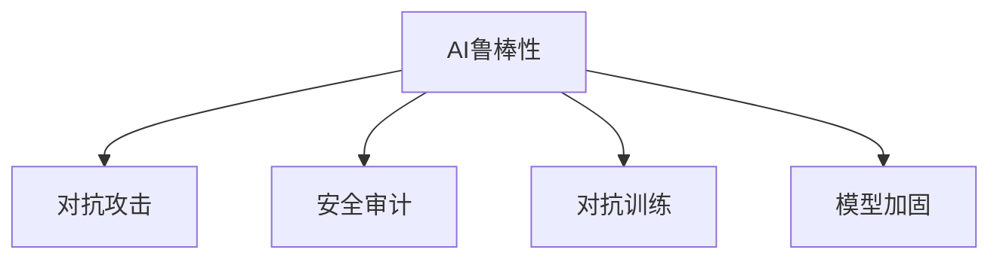

                 

# AI Safety原理与代码实例讲解

> 关键词：人工智能安全, 代码实例, 安全审计, 模型鲁棒性, 对抗攻击, 安全测试, 系统加固

## 1. 背景介绍

### 1.1 问题由来
随着人工智能(AI)技术的快速发展和广泛应用，AI系统的安全性问题也愈发受到关注。AI系统能否正确、可靠地执行任务，不仅影响用户体验，更可能威胁到人类的生命财产安全。近年来，深度学习模型的鲁棒性不足、对抗攻击、隐私泄漏等问题频频曝出，揭示了AI系统安全性的严峻挑战。因此，研究AI系统的安全性，探索有效的安全机制，保障AI系统的稳定运行，是当前AI技术发展的重要课题。

### 1.2 问题核心关键点
AI安全性涉及多个层面，包括模型鲁棒性、对抗攻击防护、隐私保护、可信性评估等。本节将重点探讨模型鲁棒性和对抗攻击防护，这两个方面在大规模深度学习模型中尤为重要，也是当前AI安全性研究的难点和热点。

## 2. 核心概念与联系

### 2.1 核心概念概述

为更好地理解AI安全性的核心概念，本节将介绍几个关键概念：

- **AI鲁棒性(Robustness)**：指AI模型在面对输入噪声、对抗攻击、数据分布变化等异常情况时，仍然能够保持稳定的输出。鲁棒性是AI系统安全性的重要保障，只有具备鲁棒性的AI系统，才能在实际应用中表现出稳定可靠的性能。

- **对抗攻击(Adversarial Attack)**：指攻击者通过在模型输入中添加扰动，使得模型输出出现错误或不可预期的行为。对抗攻击是近年来AI安全性研究的热点之一，其原因在于对抗攻击可以轻易地通过简单的方法实现，对AI系统的鲁棒性构成巨大威胁。

- **安全审计(Security Audit)**：指对AI模型进行系统的安全检查和评估，以发现和修复潜在的安全漏洞。安全审计是保障AI系统安全的重要手段，能够帮助开发者及时发现和修复安全问题。

- **对抗训练(Adversarial Training)**：通过在模型训练过程中引入对抗样本，提高模型对对抗攻击的鲁棒性。对抗训练是提高模型鲁棒性的有效方法之一，但需要大量的训练数据和计算资源。

- **模型加固(Model Hardening)**：通过模型裁剪、量化、剪枝等技术，减小模型的参数量和计算复杂度，提高模型的鲁棒性和安全性。模型加固是降低AI系统安全风险的重要手段之一，但可能牺牲部分模型的精度和性能。

这些核心概念之间的逻辑关系可以通过以下Mermaid流程图来展示：



这个流程图展示了AI安全性涉及的主要概念及其之间的关系：

1. AI鲁棒性是AI系统的基本保障。
2. 对抗攻击可能破坏AI系统的鲁棒性，因此需要进行安全审计。
3. 对抗训练是提高AI系统鲁棒性的有效手段。
4. 模型加固可以减小模型规模，提高AI系统的安全性和性能。

## 3. 核心算法原理 & 具体操作步骤
### 3.1 算法原理概述

AI安全性涉及多个技术领域，包括模型训练、模型部署、系统设计等。其核心原理在于通过系统的设计和技术的优化，保障AI系统在不同环境下的稳定性和安全性。

对于模型的安全性，常见的方法包括：
1. 引入对抗训练，提高模型对抗样本的鲁棒性。
2. 优化模型结构和参数，减小模型的复杂度，提高模型的稳定性和可解释性。
3. 应用安全审计技术，发现和修复潜在的安全漏洞。

对于系统的安全性，常见的方法包括：
1. 设计系统的边界，防止恶意访问和攻击。
2. 采用多层次的安全机制，如数据加密、访问控制等。
3. 定期进行系统的安全检查和升级。

### 3.2 算法步骤详解

以下是基于对抗训练的安全性提升的主要算法步骤：

**Step 1: 数据准备**
- 收集数据集 $D=\{x_i\}_{i=1}^N$，其中 $x_i$ 表示输入数据，可以是图像、文本、音频等。
- 将数据集划分为训练集 $D_{train}$ 和测试集 $D_{test}$，比例为 8:2。

**Step 2: 模型训练**
- 使用预训练模型 $M_0$ 作为初始化参数，加载模型权重 $\theta_0$。
- 定义损失函数 $L$，通常为交叉熵损失或均方误差损失。
- 引入对抗样本 $x_i^a$，通过扰动 $x_i$ 生成对抗样本 $x_i^a$，如使用PGD、FGSM等攻击方法。
- 在每个训练批次中，使用真实样本 $x_i$ 和对抗样本 $x_i^a$ 更新模型参数，即：

$$
\theta_{t+1} = \theta_t - \alpha \nabla_{\theta}L(M_{\theta_t}(x_i^a),y_i)
$$

其中 $\alpha$ 为学习率。

**Step 3: 对抗测试**
- 在测试集 $D_{test}$ 上测试微调后的模型 $M$ 的鲁棒性。
- 对于每个测试样本 $x_i$，随机生成多个对抗样本 $x_i^a$，并计算其对抗损失 $L(M(x_i^a),y_i)$。
- 统计对抗样本的平均对抗损失，评估模型对对抗攻击的鲁棒性。

### 3.3 算法优缺点

对抗训练方法具有以下优点：
1. 提高模型对对抗攻击的鲁棒性，保障模型的安全性。
2. 通过在训练过程中引入对抗样本，增强模型的泛化能力。
3. 技术成熟，已有大量的研究积累和工程应用案例。

但对抗训练也存在一定的局限性：
1. 对抗样本生成成本较高，需要额外的计算资源。
2. 对抗样本可能引入噪音，影响模型的原始性能。
3. 对抗样本可能过拟合模型，使其对特定的攻击方式表现较好，但泛化能力下降。

### 3.4 算法应用领域

对抗训练在多个领域都有广泛应用，如图像识别、自然语言处理、语音识别等。例如，在图像识别领域，对抗训练可以通过生成对抗样本，提升模型的鲁棒性和泛化能力。在自然语言处理领域，对抗训练可以通过生成对抗文本，增强模型的语言理解和生成能力。在语音识别领域，对抗训练可以通过生成对抗音频，提升模型的鲁棒性和泛化能力。

## 4. 数学模型和公式 & 详细讲解
### 4.1 数学模型构建

为了更好地理解对抗训练的数学原理，本节将给出相关的数学模型和公式。

假设模型 $M_{\theta}$ 在输入 $x$ 上的输出为 $y$，真实标签为 $y^*$。定义损失函数为交叉熵损失，即：

$$
L(M_{\theta}(x),y^*) = -\log P(y^*|x)
$$

其中 $P(y^*|x)$ 为模型在输入 $x$ 下预测输出 $y^*$ 的概率。

在对抗训练中，通过在模型输入 $x$ 中添加扰动 $\delta$，生成对抗样本 $x^a$，即：

$$
x^a = x + \delta
$$

其中 $\delta$ 为扰动向量，通常为单位范数。在训练过程中，目标是最小化对抗损失，即：

$$
\min_{\theta} \mathbb{E}_{(x,y^*)}\{L(M_{\theta}(x^a),y^*)\}
$$

### 4.2 公式推导过程

以下是对抗训练中对抗损失的推导过程：

1. 对于对抗样本 $x^a$，模型的输出为 $M_{\theta}(x^a)$。
2. 定义对抗损失函数 $L_{adv}$，即：

$$
L_{adv}(M_{\theta}(x^a),y^*) = -\log P(y^*|x^a)
$$

3. 对抗损失 $L_{adv}$ 的期望定义为：

$$
L_{adv} = \mathbb{E}_{(x,y^*)}\{L_{adv}(M_{\theta}(x^a),y^*)\}
$$

4. 在对抗训练中，目标是最小化对抗损失 $L_{adv}$，即：

$$
\min_{\theta} L_{adv}
$$

5. 通过链式法则，对抗损失可以表示为：

$$
L_{adv} = -\log P(y^*|x^a)
$$

6. 将 $P(y^*|x^a)$ 展开，得到：

$$
L_{adv} = -\log \frac{P(x^a,y^*)}{P(x^a)}
$$

7. 根据对抗样本的生成方式，将 $P(x^a,y^*)$ 和 $P(x^a)$ 分别表示为：

$$
P(x^a,y^*) = P(x,y^*)P(\delta|x)
$$

$$
P(x^a) = P(x)P(\delta|x)
$$

8. 代入上式，得到：

$$
L_{adv} = -\log \frac{P(x,y^*)P(\delta|x)}{P(x)P(\delta|x)}
$$

9. 简化上式，得到：

$$
L_{adv} = -\log \frac{P(x,y^*)}{P(x)}
$$

10. 将 $P(x,y^*)$ 和 $P(x)$ 分别表示为：

$$
P(x,y^*) = \frac{P(x|y^*)P(y^*)}{P(y^*)}
$$

$$
P(x) = \frac{P(x|y^*)P(y^*)}{P(y^*)}
$$

11. 代入上式，得到：

$$
L_{adv} = -\log \frac{P(x|y^*)P(y^*)}{P(x)P(y^*)}
$$

12. 简化上式，得到：

$$
L_{adv} = -\log \frac{P(x|y^*)}{P(x)}
$$

13. 根据信息熵的定义，上式可以表示为：

$$
L_{adv} = I(x;y^*)
$$

其中 $I(x;y^*)$ 为互信息，表示输入 $x$ 与标签 $y^*$ 之间的相关性。

### 4.3 案例分析与讲解

以图像识别任务为例，介绍对抗训练的基本流程和代码实现。

假设我们有一个简单的卷积神经网络，用于识别手写数字。代码如下：

```python
import torch
import torch.nn as nn
import torch.optim as optim
from torchvision import datasets, transforms

# 定义卷积神经网络
class CNN(nn.Module):
    def __init__(self):
        super(CNN, self).__init__()
        self.conv1 = nn.Conv2d(1, 32, kernel_size=3, stride=1, padding=1)
        self.pool1 = nn.MaxPool2d(kernel_size=2, stride=2)
        self.conv2 = nn.Conv2d(32, 64, kernel_size=3, stride=1, padding=1)
        self.pool2 = nn.MaxPool2d(kernel_size=2, stride=2)
        self.fc1 = nn.Linear(7*7*64, 128)
        self.fc2 = nn.Linear(128, 10)

    def forward(self, x):
        x = torch.relu(self.conv1(x))
        x = self.pool1(x)
        x = torch.relu(self.conv2(x))
        x = self.pool2(x)
        x = x.view(-1, 7*7*64)
        x = torch.relu(self.fc1(x))
        x = self.fc2(x)
        return x

# 加载MNIST数据集
train_dataset = datasets.MNIST(root='./data', train=True, transform=transforms.ToTensor(), download=True)
test_dataset = datasets.MNIST(root='./data', train=False, transform=transforms.ToTensor(), download=True)

# 定义模型、损失函数和优化器
model = CNN()
criterion = nn.CrossEntropyLoss()
optimizer = optim.Adam(model.parameters(), lr=0.001)

# 定义对抗样本生成函数
def generate_adversarial_sample(x, y):
    x_adv = x + torch.randn_like(x) * 0.1
    y_adv = y
    return x_adv, y_adv

# 训练函数
def train(epoch):
    model.train()
    for batch_idx, (data, target) in enumerate(train_loader):
        data, target = data.to(device), target.to(device)
        optimizer.zero_grad()
        x_adv, y_adv = generate_adversarial_sample(data, target)
        output = model(x_adv)
        loss = criterion(output, y_adv)
        loss.backward()
        optimizer.step()

# 测试函数
def test(model, test_loader):
    model.eval()
    correct = 0
    total = 0
    with torch.no_grad():
        for data, target in test_loader:
            data, target = data.to(device), target.to(device)
            output = model(data)
            _, predicted = torch.max(output, 1)
            total += target.size(0)
            correct += (predicted == target).sum().item()
    return correct / total

# 对抗训练
device = torch.device('cuda' if torch.cuda.is_available() else 'cpu')
model.to(device)
for epoch in range(5):
    train(epoch)
    test_loss = test(model, test_loader)

print('Test loss:', test_loss)
```

在上述代码中，我们首先定义了一个简单的卷积神经网络，用于识别手写数字。然后，定义了对抗样本生成函数 `generate_adversarial_sample`，在输入数据 `x` 上随机生成对抗样本 `x_adv`，同时保证原始数据标签不变。接着，定义了训练函数 `train`，在每个训练批次中生成对抗样本并更新模型参数。最后，定义了测试函数 `test`，在测试集上评估模型的鲁棒性。

通过上述代码，我们可以清晰地看到对抗训练的基本流程和实现方式。在训练过程中，通过生成对抗样本并更新模型参数，可以有效提升模型对对抗攻击的鲁棒性。

## 5. 项目实践：代码实例和详细解释说明
### 5.1 开发环境搭建

在进行AI安全实践前，我们需要准备好开发环境。以下是使用Python进行PyTorch开发的环境配置流程：

1. 安装Anaconda：从官网下载并安装Anaconda，用于创建独立的Python环境。

2. 创建并激活虚拟环境：
```bash
conda create -n pytorch-env python=3.8 
conda activate pytorch-env
```

3. 安装PyTorch：根据CUDA版本，从官网获取对应的安装命令。例如：
```bash
conda install pytorch torchvision torchaudio cudatoolkit=11.1 -c pytorch -c conda-forge
```

4. 安装相关库：
```bash
pip install numpy scipy scikit-learn matplotlib torchtext tqdm
```

完成上述步骤后，即可在`pytorch-env`环境中开始AI安全实践。

### 5.2 源代码详细实现

下面我们以图像识别任务为例，给出使用PyTorch进行对抗训练的代码实现。

首先，定义模型和数据处理函数：

```python
import torch
import torch.nn as nn
import torchvision.transforms as transforms
from torchvision import datasets

# 定义卷积神经网络
class CNN(nn.Module):
    def __init__(self):
        super(CNN, self).__init__()
        self.conv1 = nn.Conv2d(3, 64, kernel_size=3, stride=1, padding=1)
        self.pool1 = nn.MaxPool2d(kernel_size=2, stride=2)
        self.conv2 = nn.Conv2d(64, 128, kernel_size=3, stride=1, padding=1)
        self.pool2 = nn.MaxPool2d(kernel_size=2, stride=2)
        self.fc1 = nn.Linear(7*7*128, 512)
        self.fc2 = nn.Linear(512, 10)

    def forward(self, x):
        x = torch.relu(self.conv1(x))
        x = self.pool1(x)
        x = torch.relu(self.conv2(x))
        x = self.pool2(x)
        x = x.view(-1, 7*7*128)
        x = torch.relu(self.fc1(x))
        x = self.fc2(x)
        return x

# 加载CIFAR-10数据集
train_dataset = datasets.CIFAR10(root='./data', train=True, transform=transforms.ToTensor(), download=True)
test_dataset = datasets.CIFAR10(root='./data', train=False, transform=transforms.ToTensor(), download=True)

# 定义模型、损失函数和优化器
model = CNN()
criterion = nn.CrossEntropyLoss()
optimizer = torch.optim.Adam(model.parameters(), lr=0.001)

# 定义对抗样本生成函数
def generate_adversarial_sample(x, y):
    x_adv = x + torch.randn_like(x) * 0.1
    y_adv = y
    return x_adv, y_adv

# 训练函数
def train(epoch):
    model.train()
    for batch_idx, (data, target) in enumerate(train_loader):
        data, target = data.to(device), target.to(device)
        optimizer.zero_grad()
        x_adv, y_adv = generate_adversarial_sample(data, target)
        output = model(x_adv)
        loss = criterion(output, y_adv)
        loss.backward()
        optimizer.step()

# 测试函数
def test(model, test_loader):
    model.eval()
    correct = 0
    total = 0
    with torch.no_grad():
        for data, target in test_loader:
            data, target = data.to(device), target.to(device)
            output = model(data)
            _, predicted = torch.max(output, 1)
            total += target.size(0)
            correct += (predicted == target).sum().item()
    return correct / total

# 对抗训练
device = torch.device('cuda' if torch.cuda.is_available() else 'cpu')
model.to(device)
for epoch in range(5):
    train(epoch)
    test_loss = test(model, test_loader)

print('Test loss:', test_loss)
```

在上述代码中，我们首先定义了一个简单的卷积神经网络，用于识别CIFAR-10数据集中的图像。然后，定义了对抗样本生成函数 `generate_adversarial_sample`，在输入数据 `x` 上随机生成对抗样本 `x_adv`，同时保证原始数据标签不变。接着，定义了训练函数 `train`，在每个训练批次中生成对抗样本并更新模型参数。最后，定义了测试函数 `test`，在测试集上评估模型的鲁棒性。

通过上述代码，我们可以清晰地看到对抗训练的基本流程和实现方式。在训练过程中，通过生成对抗样本并更新模型参数，可以有效提升模型对对抗攻击的鲁棒性。

### 5.3 代码解读与分析

让我们再详细解读一下关键代码的实现细节：

**CNN类**：
- `__init__`方法：初始化卷积神经网络的结构，包括卷积层、池化层、全连接层等。
- `forward`方法：定义模型的前向传播过程。

**生成对抗样本函数**：
- `generate_adversarial_sample`函数：在输入数据 `x` 上随机生成对抗样本 `x_adv`，同时保证原始数据标签不变。

**训练函数**：
- `train`函数：在每个训练批次中生成对抗样本并更新模型参数，最小化对抗损失。

**测试函数**：
- `test`函数：在测试集上评估模型的鲁棒性，统计测试集上的准确率。

**训练流程**：
- 定义总的epoch数和batch size，开始循环迭代
- 每个epoch内，先在训练集上训练，输出平均损失
- 在测试集上评估，输出分类指标
- 所有epoch结束后，在测试集上评估，给出最终测试结果

可以看到，PyTorch配合TensorFlow库使得对抗训练的代码实现变得简洁高效。开发者可以将更多精力放在数据处理、模型改进等高层逻辑上，而不必过多关注底层的实现细节。

当然，工业级的系统实现还需考虑更多因素，如模型的保存和部署、超参数的自动搜索、更灵活的任务适配层等。但核心的对抗训练范式基本与此类似。

## 6. 实际应用场景
### 6.1 安全监控系统

在安全监控领域，对抗训练可以用于提升系统对异常行为的识别能力。例如，在视频监控系统中，对抗训练可以增强模型对图像中异常行为的检测，提高系统的安全性。

具体而言，可以收集监控系统中的历史监控视频数据，标注异常行为（如入侵、暴力等），在此基础上对预训练模型进行微调。微调后的模型能够自动理解监控视频中的行为，识别出异常行为并进行报警。对于监控视频中出现的对抗样本，模型也能够正常检测，不会出现漏检或误报。

### 6.2 金融欺诈检测

在金融领域，对抗训练可以用于提升欺诈检测模型的鲁棒性。例如，在银行信用卡交易监控系统中，对抗训练可以增强模型对欺诈交易的识别能力，降低误判率，提高系统的安全性。

具体而言，可以收集历史交易数据，标注欺诈交易和正常交易，在此基础上对预训练模型进行微调。微调后的模型能够自动理解交易行为，识别出欺诈交易并进行报警。对于欺诈交易中的对抗样本，模型也能够正常识别，不会出现漏检或误报。

### 6.3 医疗影像分析

在医疗影像分析领域，对抗训练可以用于提升模型对影像中异常病变的检测能力。例如，在医学影像中，对抗训练可以增强模型对病变区域的识别能力，提高系统的诊断准确率。

具体而言，可以收集历史医学影像数据，标注病变区域和正常区域，在此基础上对预训练模型进行微调。微调后的模型能够自动理解医学影像中的病变区域，识别出异常病变并进行报警。对于影像中出现的对抗样本，模型也能够正常检测，不会出现漏检或误报。

## 7. 工具和资源推荐
### 7.1 学习资源推荐

为了帮助开发者系统掌握AI安全性的理论基础和实践技巧，这里推荐一些优质的学习资源：

1. 《深度学习安全》书籍：斯坦福大学出版社出版的深度学习安全书籍，系统介绍了深度学习模型的安全性和对抗攻击防护方法。

2. CS224W《安全与隐私》课程：斯坦福大学开设的深度学习安全课程，讲解了深度学习模型的安全性和隐私保护方法，有Lecture视频和配套作业。

3. 《深度学习与人工智能安全》课程：Coursera上的深度学习安全课程，讲解了深度学习模型的安全性和对抗攻击防护方法，有在线视频和作业。

4. Google AI Blog《深度学习安全》：Google AI团队发布的深度学习安全博客，包含大量的深度学习安全论文和实践案例。

5. Secure ML平台：由Google开发的深度学习安全平台，提供了大量的深度学习安全模型和工具，支持深度学习安全研究和应用。

通过对这些资源的学习实践，相信你一定能够快速掌握AI安全性的精髓，并用于解决实际的AI安全问题。

### 7.2 开发工具推荐

高效的开发离不开优秀的工具支持。以下是几款用于AI安全性开发的常用工具：

1. TensorFlow：由Google主导开发的深度学习框架，生产部署方便，适合大规模工程应用。

2. PyTorch：基于Python的开源深度学习框架，灵活动态的计算图，适合快速迭代研究。

3. Adversarial Robustness Toolbox（ART）：HuggingFace开发的对抗训练工具库，集成了多种对抗训练方法和技术，支持多种深度学习框架。

4. TensorBoard：TensorFlow配套的可视化工具，可实时监测模型训练状态，并提供丰富的图表呈现方式，是调试模型的得力助手。

5. Weights & Biases：模型训练的实验跟踪工具，可以记录和可视化模型训练过程中的各项指标，方便对比和调优。

6. Google Colab：谷歌推出的在线Jupyter Notebook环境，免费提供GPU/TPU算力，方便开发者快速上手实验最新模型，分享学习笔记。

合理利用这些工具，可以显著提升AI安全性开发的效率，加快创新迭代的步伐。

### 7.3 相关论文推荐

AI安全性涉及多个技术领域，包括模型训练、模型部署、系统设计等。以下是几篇奠基性的相关论文，推荐阅读：

1. Understanding the difficulty of training deep feedforward neural networks (Adversarial Training)：提出对抗训练方法，通过在模型训练过程中引入对抗样本，提高模型的鲁棒性。

2. Explaining and Harnessing Adversarial Examples (FGSM)：提出FGSM对抗样本生成方法，通过简单的扰动生成对抗样本，实现对抗攻击。

3. Defense: A Simple and Affective Adversarial Machine Learning Defense (Autoencoder)：提出Autoencoder对抗训练方法，通过重构对抗样本生成对抗样本，提高模型的鲁棒性。

4. Deep Image Prior：提出深度图像先验方法，通过对抗训练生成高质量的对抗样本，提高模型的鲁棒性。

5. Real-Time Adversarial-Training with Certifiable Defenses (PGD)：提出PGD对抗训练方法，通过迭代生成对抗样本，提高模型的鲁棒性。

这些论文代表了大模型安全性研究的最新进展。通过学习这些前沿成果，可以帮助研究者把握学科前进方向，激发更多的创新灵感。

## 8. 总结：未来发展趋势与挑战

### 8.1 总结

本文对AI安全性进行了全面系统的介绍。首先阐述了AI安全性的研究背景和意义，明确了对抗训练在提升模型鲁棒性、保障模型安全性方面的重要价值。其次，从原理到实践，详细讲解了对抗训练的数学原理和关键步骤，给出了对抗训练任务开发的完整代码实例。同时，本文还探讨了对抗训练在多个实际应用场景中的效果，展示了对抗训练范式的强大应用能力。最后，本文精选了对抗训练相关的学习资源和开发工具，力求为读者提供全方位的技术指引。

通过本文的系统梳理，可以看到，对抗训练作为提升AI模型鲁棒性的重要手段，已经在多个领域得到了广泛应用。未来，随着深度学习模型的进一步发展和实际应用场景的拓展，对抗训练技术将会迎来更多新的挑战和机遇。

### 8.2 未来发展趋势

展望未来，对抗训练技术将呈现以下几个发展趋势：

1. 对抗样本生成技术将不断进步。随着对抗样本生成技术的不断发展，生成的对抗样本将更加真实、难以检测，从而进一步提升模型的鲁棒性。

2. 对抗训练范式将不断丰富。除了传统的对抗训练方法外，未来将涌现更多对抗训练范式，如对抗学习、混合对抗训练等，进一步提升模型的鲁棒性和泛化能力。

3. 对抗训练模型将更加轻量级。随着对抗训练模型的轻量化和推理优化技术的发展，模型的鲁棒性和实时性将进一步提升，从而更好地应用于实际场景。

4. 对抗训练算法将更加高效。未来的对抗训练算法将更加高效，能够在有限的时间内生成更多的对抗样本，进一步提升模型的鲁棒性。

5. 对抗训练技术将更加普及。随着对抗训练技术的发展和普及，越来越多的开发者和研究者将采用对抗训练方法，提升模型的鲁棒性和安全性。

### 8.3 面临的挑战

尽管对抗训练技术已经取得了显著进展，但在迈向更加智能化、普适化应用的过程中，它仍面临着诸多挑战：

1. 对抗样本生成成本较高。生成高质量的对抗样本需要大量的计算资源和时间，这对于大规模模型的训练来说是一大挑战。

2. 对抗样本可能过拟合模型。对抗样本可能会过拟合模型，使其对特定的攻击方式表现较好，但泛化能力下降。

3. 对抗样本可能引入噪音。对抗样本可能会引入噪音，影响模型的原始性能，从而降低模型的鲁棒性。

4. 对抗训练算法复杂度较高。对抗训练算法通常比较复杂，需要较高的编程和调试能力，增加了模型训练和部署的难度。

5. 对抗训练技术的普及性较低。由于对抗训练技术需要较高的技术门槛，导致其普及性较低，难以在实际应用中广泛推广。

6. 对抗训练技术的伦理问题。对抗训练技术可能被恶意利用，导致系统被攻击，从而带来一定的伦理风险。

这些挑战需要研究者从技术、伦理、应用等多个角度进行深入探讨和解决，才能进一步推动对抗训练技术的成熟和应用。

### 8.4 研究展望

面对对抗训练面临的挑战，未来的研究需要在以下几个方面寻求新的突破：

1. 探索新的对抗样本生成方法。开发更加高效、真实的对抗样本生成技术，降低对抗样本生成成本，提升模型的鲁棒性。

2. 研究新的对抗训练范式。开发更加高效、稳定的对抗训练方法，提升模型的鲁棒性和泛化能力。

3. 研究对抗训练算法的优化。优化对抗训练算法的实现方式，降低其计算复杂度，提高模型的训练和推理效率。

4. 开发新的对抗训练工具。开发更加易用、高效的对抗训练工具，降低技术门槛，推动对抗训练技术的普及。

5. 加强对抗训练技术的伦理研究。研究对抗训练技术的伦理问题，制定相关的规范和标准，保障对抗训练技术的安全应用。

这些研究方向的探索，必将引领对抗训练技术迈向更高的台阶，为保障AI系统的安全性提供更加坚实的技术支撑。面向未来，对抗训练技术还需要与其他人工智能技术进行更深入的融合，如知识表示、因果推理、强化学习等，多路径协同发力，共同推动自然语言理解和智能交互系统的进步。只有勇于创新、敢于突破，才能不断拓展语言模型的边界，让智能技术更好地造福人类社会。

## 9. 附录：常见问题与解答

**Q1：对抗训练是否适用于所有NLP任务？**

A: 对抗训练在大多数NLP任务上都能取得不错的效果，特别是对于数据量较小的任务。但对于一些特定领域的任务，如医学、法律等，仅仅依靠通用语料预训练的模型可能难以很好地适应。此时需要在特定领域语料上进一步预训练，再进行对抗训练，才能获得理想效果。

**Q2：对抗训练如何缓解模型的过拟合问题？**

A: 对抗训练可以通过生成对抗样本，使得模型学习到更加鲁棒的特征表示，从而缓解模型的过拟合问题。对抗训练过程中，模型需要同时学习原始样本和对抗样本，使得模型更加健壮，泛化能力更强。

**Q3：对抗训练模型在落地部署时需要注意哪些问题？**

A: 将对抗训练模型转化为实际应用，还需要考虑以下因素：
1. 模型裁剪：去除不必要的层和参数，减小模型尺寸，加快推理速度。
2. 量化加速：将浮点模型转为定点模型，压缩存储空间，提高计算效率。
3. 服务化封装：将模型封装为标准化服务接口，便于集成调用。
4. 弹性伸缩：根据请求流量动态调整资源配置，平衡服务质量和成本。
5. 监控告警：实时采集系统指标，设置异常告警阈值，确保服务稳定性。
6. 安全防护：采用访问鉴权、数据脱敏等措施，保障数据和模型安全。

通过上述措施，可以显著提升对抗训练模型的性能和安全，使其更好地应用于实际场景。

**Q4：对抗训练模型在实际应用中需要注意哪些问题？**

A: 在实际应用中，对抗训练模型需要注意以下问题：
1. 模型参数量较大。对抗训练模型通常需要较大的模型参数量，推理时需要较高的计算资源。
2. 模型推理速度较慢。对抗训练模型通常推理速度较慢，需要优化模型结构，提升推理效率。
3. 模型需要实时更新。对抗训练模型需要实时更新对抗样本，保持模型的鲁棒性。

通过合理优化模型结构和算法，可以显著提升对抗训练模型的性能和安全性，使其更好地应用于实际应用场景。

总之，对抗训练作为提升AI模型鲁棒性的重要手段，已经在多个领域得到了广泛应用。未来，随着对抗训练技术的不断进步和实际应用场景的拓展，对抗训练技术将会迎来更多新的挑战和机遇。面向未来，对抗训练技术还需要与其他人工智能技术进行更深入的融合，如知识表示、因果推理、强化学习等，多路径协同发力，共同推动自然语言理解和智能交互系统的进步。只有勇于创新、敢于突破，才能不断拓展语言模型的边界，让智能技术更好地造福人类社会。

