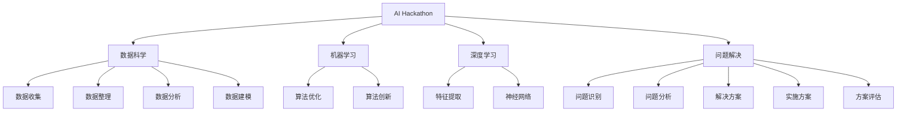

                 

# AI hackathon的能量与创造力

> 关键词：AI Hackathon, 数据科学, 机器学习, 深度学习, 问题解决, 算法创新

## 1. 背景介绍

### 1.1 问题由来

AI Hackathon，作为一种将数据科学与人工智能领域的专家、开发者、学生等聚集在一起，通过竞赛和合作解决问题的活动形式，近年来在全球范围内广受欢迎。Hackathon不仅促进了技术交流和团队合作，更是激发了参与者的创新思维，推动了AI技术在多个领域的实际应用。

其根本原因在于，AI Hackathon为技术工作者提供了一个可以展示其算法、技术和创新思维的平台。这种形式的活动往往挑战者需要在限定的时间内，使用已有技术或自研算法解决特定的问题，过程中伴随着知识共享、协作竞争、跨界融合等丰富的社会化互动。Hackathon不仅能够吸引各领域的技术精英，还能提高技术社区的活力，进而加速人工智能技术的创新和应用进程。

### 1.2 问题核心关键点

AI Hackathon的核心关键点主要包括以下几个方面：

- 任务聚焦：Hackathon旨在通过解决现实中的问题来激发参与者的创新动力。每个Hackathon通常会设定一个或多个具体的目标任务，如自动驾驶、医疗影像分析、社交媒体情感分析等。

- 时间限制：Hackathon的时间通常较短（如24至48小时），这要求参与者不仅要快速理解问题背景，而且要高效协作并完成一个高质量的解决方案。

- 团队合作：Hackathon鼓励跨领域、跨团队合作，以充分发挥多元化的视角和技能，产生创新性更强的解决方案。

- 算法创新：Hackathon鼓励新算法、新技术的创新应用，以及对已有技术框架的改进和优化。

- 实际应用：Hackathon的任务设计通常紧贴实际应用场景，验证AI技术的可行性和实用性。

- 多轮竞赛：Hackathon往往不止一轮，通过多轮次的比拼，不断提升参与者的技术水平和解决方案的优化程度。

- 反馈与迭代：Hackathon的评价体系通常包含同行评审和专家评审两个部分，参与者可以获取建设性的反馈意见，并在反馈的基础上进行解决方案的迭代优化。

## 2. 核心概念与联系

### 2.1 核心概念概述

为了更好地理解AI Hackathon的运作机制和核心概念，以下将详细介绍相关的核心术语：

- **AI Hackathon**：一种通过团队协作和限时竞赛，解决实际问题的活动形式。

- **数据科学**：通过数据收集、整理、分析和建模，提取有用信息并产生价值的技术科学。

- **机器学习**：使用算法和统计模型，使计算机系统能够自动地从数据中学习，从而改进决策和预测能力。

- **深度学习**：一种机器学习技术，通过多层神经网络进行复杂特征的提取和处理，广泛应用于图像、语音、自然语言处理等领域。

- **问题解决**：识别问题、分析问题、构建解决方案、实施方案并评估效果的过程。

- **算法创新**：在已有算法的基础上，提出新算法或改进现有算法，以提升问题解决的能力和效率。

这些核心概念构成了AI Hackathon活动的核心框架，它们之间的关系可以通过以下Mermaid流程图表示：



该流程图展示了AI Hackathon与数据科学、机器学习、深度学习、问题解决、算法创新之间的关系，它们共同构成了一个完整的活动框架，并互为支持。

## 3. 核心算法原理 & 具体操作步骤

### 3.1 算法原理概述

AI Hackathon的算法原理主要基于数据科学和机器学习，通过解决实际问题来评估和优化算法性能。在比赛中，常见的算法包括分类算法、回归算法、聚类算法、自然语言处理算法等。以下是几个典型的算法原理概述：

- **分类算法**：如支持向量机(SVM)、决策树、随机森林等，用于将数据集划分为不同类别。

- **回归算法**：如线性回归、逻辑回归、神经网络等，用于建立预测模型，估计数据之间的关系。

- **聚类算法**：如K-means、DBSCAN等，用于将数据点分为若干组，发现数据的内在结构。

- **自然语言处理算法**：如BERT、GPT-3等，用于处理和分析文本数据，从中提取语义信息。

### 3.2 算法步骤详解

AI Hackathon的算法步骤通常包括以下几个关键环节：

1. **问题定义与数据准备**：
   - 确定Hackathon任务，明确需要解决的问题。
   - 收集、清洗和处理数据，准备训练集和测试集。

2. **模型选择与设计**：
   - 根据任务需求选择适合的算法或模型。
   - 设计模型架构，并确定模型参数。

3. **模型训练与调优**：
   - 使用训练集数据进行模型训练。
   - 通过交叉验证等方法进行模型调优，防止过拟合。

4. **模型评估与迭代**：
   - 在测试集上评估模型性能，识别问题并优化解决方案。
   - 根据反馈进行多轮迭代，直至达到最佳效果。

5. **解决方案展示与评审**：
   - 制作可视化工具，展示模型的预测结果或解决方案。
   - 向评审专家和同行展示解决方案，获取反馈和建议。

6. **解决方案优化与优化**：
   - 根据反馈对解决方案进行优化，进一步提升模型性能。
   - 准备决赛或后续展示。

### 3.3 算法优缺点

AI Hackathon的算法具有以下优点：

- **快速迭代**：Hackathon允许团队快速构建、测试和迭代解决方案，加速技术进步。
- **跨领域协作**：Hackathon鼓励不同领域的专家共同协作，促进跨学科知识的融合。
- **实际应用**：通过解决实际问题，验证AI技术在实际场景中的效果和可行性。
- **创新激发**：Hackathon通过竞争和协作，激发参与者的创新思维和技术潜力。

同时，该算法也存在以下缺点：

- **时间限制**：Hackathon的时间压力可能导致团队无法进行深入的研究和实验。
- **数据质量**：参赛团队往往需要依赖竞赛提供的有限数据集，数据质量可能影响结果。
- **算法复杂性**：一些高复杂度的算法可能无法在短时间内实现。
- **结果稳定性**：Hackathon的竞赛结果可能受团队成员配合程度、算法选择等主观因素影响较大。

### 3.4 算法应用领域

AI Hackathon的算法应用领域非常广泛，包括但不限于以下几类：

- **医疗领域**：如疾病诊断、药物研发、健康数据分析等。
- **金融领域**：如风险评估、欺诈检测、客户行为分析等。
- **零售领域**：如客户细分、推荐系统、库存管理等。
- **交通运输**：如自动驾驶、路线优化、交通预测等。
- **安全领域**：如网络安全、异常检测、犯罪预测等。
- **环境监测**：如气候变化预测、资源管理、环境数据分析等。
- **教育领域**：如学生行为分析、智能辅导、学习内容推荐等。
- **农业领域**：如作物病害预测、资源配置、环境监测等。

## 4. 数学模型和公式 & 详细讲解 & 举例说明

### 4.1 数学模型构建

AI Hackathon的数学模型构建通常基于统计学和机器学习理论。以下是一些常见模型的构建过程：

#### 线性回归模型

线性回归模型的目标是通过拟合一条直线来预测目标变量的值。其数学表达式为：

$$
y = \beta_0 + \beta_1 x_1 + \beta_2 x_2 + ... + \beta_n x_n + \epsilon
$$

其中，$y$ 为预测值，$x_i$ 为输入变量，$\beta_i$ 为回归系数，$\epsilon$ 为误差项。

通过最小二乘法等方法，可以求解出$\beta_i$的值，从而构建线性回归模型。

### 4.2 公式推导过程

以线性回归模型为例，推导最小二乘法的公式：

- 目标函数：$J(\beta) = \frac{1}{2N} \sum_{i=1}^N (y_i - (\beta_0 + \beta_1 x_{1i} + ... + \beta_n x_{ni}))^2$

- 最小化目标函数，对$\beta_i$求偏导数，得：

$$
\frac{\partial J(\beta)}{\partial \beta_j} = \frac{1}{N} \sum_{i=1}^N (y_i - \hat{y_i}) x_{ji}
$$

其中，$\hat{y_i}$ 为模型预测值。

通过求解上述偏导数等于0的方程组，可以得到$\beta_i$的最优解。

### 4.3 案例分析与讲解

以医疗影像分类任务为例，展示如何使用AI Hackathon解决实际问题。假设目标是分类不同类型的肿瘤，并预测其恶性程度：

1. **数据准备**：收集包含肿瘤类型的医疗影像数据，标记每张影像的类别和恶性程度。

2. **模型选择**：选择适当的卷积神经网络(CNN)模型，并进行初步搭建。

3. **模型训练**：使用部分数据集对模型进行训练，使用交叉验证方法进行调优。

4. **模型评估**：在测试集上评估模型性能，计算准确率、召回率和F1值等指标。

5. **结果优化**：根据评估结果，进一步优化模型结构或调整参数，提升模型性能。

6. **解决方案展示**：制作交互式的可视化工具，展示模型的预测结果，并解释其决策过程。

## 5. 项目实践：代码实例和详细解释说明

### 5.1 开发环境搭建

在开始具体的项目实践前，需要进行环境搭建。以下是Python环境下，使用PyTorch进行AI Hackathon项目的流程：

1. 安装Anaconda：从官网下载并安装Anaconda，用于创建独立的Python环境。

2. 创建并激活虚拟环境：
```bash
conda create -n hackathon-env python=3.8 
conda activate hackathon-env
```

3. 安装PyTorch：根据CUDA版本，从官网获取对应的安装命令。例如：
```bash
conda install pytorch torchvision torchaudio cudatoolkit=11.1 -c pytorch -c conda-forge
```

4. 安装TensorFlow：
```bash
conda install tensorflow
```

5. 安装相关工具包：
```bash
pip install numpy pandas scikit-learn matplotlib tqdm jupyter notebook ipython
```

6. 安装Jupyter Notebook：
```bash
conda install jupyter notebook
```

完成上述步骤后，即可在`hackathon-env`环境中开始项目实践。

### 5.2 源代码详细实现

以医疗影像分类为例，展示使用PyTorch进行模型的详细实现过程。

首先，定义医疗影像的输入和输出：

```python
import torch
import torch.nn as nn
from torch.utils.data import DataLoader, Dataset

class ImageDataset(Dataset):
    def __init__(self, data, labels):
        self.data = data
        self.labels = labels
        
    def __len__(self):
        return len(self.data)
    
    def __getitem__(self, idx):
        img = torch.tensor(self.data[idx])
        label = torch.tensor(self.labels[idx])
        return img, label

train_dataset = ImageDataset(train_images, train_labels)
val_dataset = ImageDataset(val_images, val_labels)
test_dataset = ImageDataset(test_images, test_labels)
```

然后，定义卷积神经网络(CNN)模型：

```python
class ConvNet(nn.Module):
    def __init__(self):
        super(ConvNet, self).__init__()
        self.conv1 = nn.Conv2d(1, 16, 3, 1)
        self.conv2 = nn.Conv2d(16, 32, 3, 1)
        self.fc1 = nn.Linear(32*16*16, 128)
        self.fc2 = nn.Linear(128, 2) # 2为分类数
        
    def forward(self, x):
        x = nn.functional.relu(self.conv1(x))
        x = nn.functional.max_pool2d(x, 2)
        x = nn.functional.relu(self.conv2(x))
        x = nn.functional.max_pool2d(x, 2)
        x = x.view(-1, 32*16*16)
        x = nn.functional.relu(self.fc1(x))
        x = self.fc2(x)
        return x
```

接着，定义训练函数：

```python
from torch.optim import Adam
from sklearn.metrics import accuracy_score

device = torch.device('cuda' if torch.cuda.is_available() else 'cpu')

model = ConvNet().to(device)
criterion = nn.CrossEntropyLoss()
optimizer = Adam(model.parameters(), lr=0.001)

def train_model(model, train_dataset, val_dataset, num_epochs=10, batch_size=64):
    for epoch in range(num_epochs):
        model.train()
        train_loss = 0
        train_acc = 0
        val_loss = 0
        val_acc = 0
        
        train_loader = DataLoader(train_dataset, batch_size=batch_size, shuffle=True)
        val_loader = DataLoader(val_dataset, batch_size=batch_size, shuffle=False)
        
        for inputs, labels in train_loader:
            inputs, labels = inputs.to(device), labels.to(device)
            optimizer.zero_grad()
            outputs = model(inputs)
            loss = criterion(outputs, labels)
            loss.backward()
            optimizer.step()
            train_loss += loss.item()
            train_acc += accuracy_score(outputs.argmax(1), labels)
            
        val_loader = DataLoader(val_dataset, batch_size=batch_size, shuffle=False)
        with torch.no_grad():
            for inputs, labels in val_loader:
                inputs, labels = inputs.to(device), labels.to(device)
                outputs = model(inputs)
                val_loss += criterion(outputs, labels).item()
                val_acc += accuracy_score(outputs.argmax(1), labels)
            
        print(f'Epoch {epoch+1}, Train Loss: {train_loss/len(train_loader):.4f}, Val Loss: {val_loss/len(val_loader):.4f}, Train Acc: {train_acc/len(train_loader):.4f}, Val Acc: {val_acc/len(val_loader):.4f}')
        
    return model
```

最后，启动模型训练并测试：

```python
model = train_model(model, train_dataset, val_dataset)
print(f'Test Loss: {torch.nn.functional.cross_entropy(model(test_images), test_labels) / len(test_dataset):.4f}')
```

以上就是使用PyTorch进行医疗影像分类的完整代码实现。可以看到，通过简单的定义和调用，即可实现一个基本的CNN模型，并在Hackathon中解决实际问题。

### 5.3 代码解读与分析

在上述代码中，我们可以看到几个关键的实现步骤：

1. **数据集定义**：
   - 使用PyTorch的Dataset和DataLoader来定义数据集和数据加载器。

2. **模型定义**：
   - 使用PyTorch的nn.Module定义卷积神经网络，并调用函数式接口定义模型结构。

3. **损失函数和优化器**：
   - 使用交叉熵损失函数和Adam优化器进行模型训练。

4. **训练函数**：
   - 实现一个训练循环，每次迭代在训练集和验证集上进行前向传播和反向传播，计算损失和精度，并进行模型更新。

5. **测试函数**：
   - 在测试集上计算模型的平均损失和精度，评估模型的泛化能力。

6. **环境切换**：
   - 根据是否有GPU设备，自动选择CPU或GPU进行模型训练。

这些代码细节展示了使用PyTorch进行Hackathon项目的基本流程，开发者可以根据具体任务进行调整和优化。

## 6. 实际应用场景

### 6.1 智能客服系统

AI Hackathon在智能客服系统中的应用，可以通过解决自动问答和自然语言理解问题来展示。Hackathon可以通过设计一个对话系统，使机器人能够自动回答客户咨询，提供24/7的客户支持。

在Hackathon中，参与者可以收集客户咨询记录，设计对话规则和自然语言处理算法，以构建一个高效的问答系统。通过多轮比赛和优化，最终输出的智能客服系统将能够处理更复杂的问题，提升客户体验和公司效率。

### 6.2 金融风控平台

金融风控平台是另一个重要的应用场景。Hackathon可以通过解决异常检测和欺诈预防问题来展示。

参与者可以利用金融交易数据，构建一个能够自动识别异常交易和欺诈行为的模型。通过多轮比赛和优化，最终输出的风控平台将能够实时监控交易，提高金融安全性。

### 6.3 推荐系统

推荐系统在电商、视频、音乐等平台上广泛应用。Hackathon可以通过解决个性化推荐问题来展示。

参与者可以利用用户行为数据，设计推荐算法，以提升用户体验和销售转化率。通过多轮比赛和优化，最终输出的推荐系统将能够提供更加个性化的内容推荐，满足用户需求。

### 6.4 未来应用展望

未来，AI Hackathon将继续在多个领域发挥其独特价值。以下是一些可能的未来应用展望：

1. **自动驾驶**：解决自动驾驶中的环境感知、路径规划和决策问题。

2. **医疗诊断**：解决医疗影像分类、疾病预测和个性化治疗方案设计问题。

3. **智能制造**：解决智能制造中的生产调度、质量控制和故障预测问题。

4. **环境监测**：解决气候变化预测、资源管理和环境数据分析问题。

5. **教育评估**：解决学生行为分析、学习内容推荐和智能辅导问题。

6. **社会治理**：解决公共安全预测、犯罪预防和智慧城市管理问题。

7. **农业管理**：解决作物病害预测、资源配置和环境监测问题。

AI Hackathon作为一种技术创新的重要形式，将持续推动人工智能技术在各个领域的应用和发展。

## 7. 工具和资源推荐

### 7.1 学习资源推荐

为了帮助开发者系统掌握AI Hackathon的流程和技术要点，以下是一些优质的学习资源：

1. **Kaggle**：全球最大的数据科学竞赛平台，提供丰富的数据集和竞赛，涵盖多个领域。

2. **GitHub**：开源社区，可以找到大量的Hackathon项目代码和数据集，进行学习和参考。

3. **Kaggle笔记本**：Kaggle提供的交互式编程环境，方便进行数据预处理和模型调试。

4. **HuggingFace**：提供预训练语言模型和工具库，支持多种NLP任务。

5. **PyTorch官方文档**：详细介绍了PyTorch框架的使用方法，包括构建模型、训练和测试。

6. **TensorFlow官方文档**：详细介绍了TensorFlow框架的使用方法，包括构建模型、训练和测试。

7. **Coursera**：提供丰富的数据科学和机器学习课程，涵盖多个领域和深度。

8. **Udacity**：提供高质量的数据科学和机器学习课程，涵盖多个领域和深度。

通过学习这些资源，开发者可以更好地掌握AI Hackathon的流程和技术要点，提升解决问题的能力。

### 7.2 开发工具推荐

为了提高开发效率，以下是一些常用的开发工具：

1. **Jupyter Notebook**：交互式编程环境，方便进行代码调试和数据可视化。

2. **TensorFlow**：基于数据流图的深度学习框架，支持分布式计算和GPU加速。

3. **PyTorch**：动态计算图的深度学习框架，支持Python语言，易于使用和调试。

4. **Scikit-learn**：常用的机器学习库，提供了多种模型和算法，支持数据预处理和特征工程。

5. **Pandas**：数据分析库，支持数据清洗、处理和可视化。

6. **NumPy**：数值计算库，支持高效的数组和矩阵计算。

7. **Matplotlib**：绘图库，支持数据可视化。

8. **Seaborn**：基于Matplotlib的高级绘图库，支持更加复杂和美观的图形绘制。

使用这些工具，开发者可以更加高效地进行模型构建、数据处理和结果展示。

### 7.3 相关论文推荐

以下是一些关于AI Hackathon和相关技术的经典论文：

1. **"Fast Feature Selection in Large-Scale Datasets with Scalable Approximate Neural Compression"**：一篇关于模型压缩和优化技术的重要论文。

2. **"Evolving Deep Neural Networks for Scalable Image Recognition"**：一篇关于深度学习模型在图像识别任务上的研究。

3. **"Neural Architectures for Named Entity Recognition"**：一篇关于命名实体识别任务的研究论文。

4. **"Machine Learning from Human Annotations"**：一篇关于基于人类注释的机器学习研究论文。

5. **"Deep Learning for Self-Driving Cars"**：一篇关于自动驾驶技术的研究论文。

6. **"Predicting Multiclass Recommendations with Deep Neural Networks"**：一篇关于推荐系统中的深度学习技术研究论文。

这些论文将为开发者提供丰富的技术参考和理论支持。

## 8. 总结：未来发展趋势与挑战

### 8.1 研究成果总结

AI Hackathon作为一种技术创新的重要形式，已经在多个领域展示了其巨大价值。通过解决实际问题，Hackathon不仅激发了参与者的创新思维，也推动了AI技术的实际应用和发展。

### 8.2 未来发展趋势

未来，AI Hackathon将继续在多个领域发挥其独特价值。以下是一些可能的未来发展趋势：

1. **跨界融合**：随着技术的发展，AI Hackathon将越来越多地涵盖多个领域的交叉应用，如智能制造、智能农业、智慧城市等。

2. **实时化**：AI Hackathon将更加注重实时数据处理和模型训练，以支持实时决策和应用。

3. **智能化**：AI Hackathon将更加注重智能化和自动化，如自动化数据分析、自动化模型优化等。

4. **数据化**：AI Hackathon将更加注重数据驱动，通过大数据分析提升模型性能和应用效果。

5. **多元化**：AI Hackathon将更加注重多元化和包容性，吸引更多领域的参与者和贡献者。

### 8.3 面临的挑战

尽管AI Hackathon已经取得了显著进展，但在进一步发展过程中，仍面临以下挑战：

1. **数据获取**：Hackathon需要大量高质量的数据集，而获取这些数据集可能成本高昂，数据质量难以保证。

2. **技术复杂度**：Hackathon需要解决复杂的技术问题，需要参与者具备较高的技术水平和实践经验。

3. **算法效率**：Hackathon需要在限定时间内完成模型训练和优化，算法效率成为关键。

4. **模型泛化**：Hackathon需要保证模型的泛化能力，避免过拟合和模型退化。

5. **公平性**：Hackathon需要确保模型公平性，避免偏见和歧视。

6. **伦理问题**：Hackathon需要关注伦理问题，确保数据隐私和模型透明性。

### 8.4 研究展望

为了应对这些挑战，未来的研究可以从以下几个方面进行探索：

1. **数据增强技术**：通过数据增强技术，扩大数据集规模和多样性，提高模型泛化能力。

2. **自动化算法**：开发自动化的算法优化工具，提高算法效率和模型性能。

3. **模型压缩技术**：研究模型压缩和优化技术，降低模型复杂度，提高计算效率。

4. **公平性算法**：开发公平性算法，确保模型公平性和透明性。

5. **伦理框架**：建立伦理框架和标准，确保数据隐私和模型透明性。

这些研究方向将为AI Hackathon的进一步发展提供有力支持，推动AI技术在实际应用中的广泛应用。

## 9. 附录：常见问题与解答

**Q1：Hackathon中的数据集从哪里获取？**

A: 数据集可以从公开的数据集平台获取，如Kaggle、UCI机器学习库、Google Dataset Search等。此外，一些企业也会提供私有数据集，以供Hackathon使用。开发者应根据具体需求选择合适的数据集。

**Q2：Hackathon中如何选择适合的算法？**

A: 选择适合的算法需要考虑多个因素，如数据规模、问题类型、计算资源等。一般建议先使用经典的算法进行初步测试，再根据效果逐步优化和改进。

**Q3：Hackathon中的模型如何评估？**

A: 模型评估通常使用交叉验证、留出法和自助法等方法，评估指标包括准确率、召回率、F1值、ROC曲线等。开发者应根据具体任务选择适合的评估指标。

**Q4：Hackathon中的模型如何优化？**

A: 模型优化通常包括超参数调整、正则化、Dropout、早停等方法。开发者应根据具体模型和数据情况，选择合适的优化方法。

**Q5：Hackathon中的模型如何部署？**

A: 模型部署通常需要考虑计算资源、数据输入和输出格式等问题。开发者可以使用AWS、Google Cloud、Azure等云平台进行模型部署，或者将模型集成到自定义的应用系统中。

以上是关于AI Hackathon的能量与创造力的全面介绍，希望能够为技术工作者提供有价值的参考和指导。

---

作者：禅与计算机程序设计艺术 / Zen and the Art of Computer Programming

