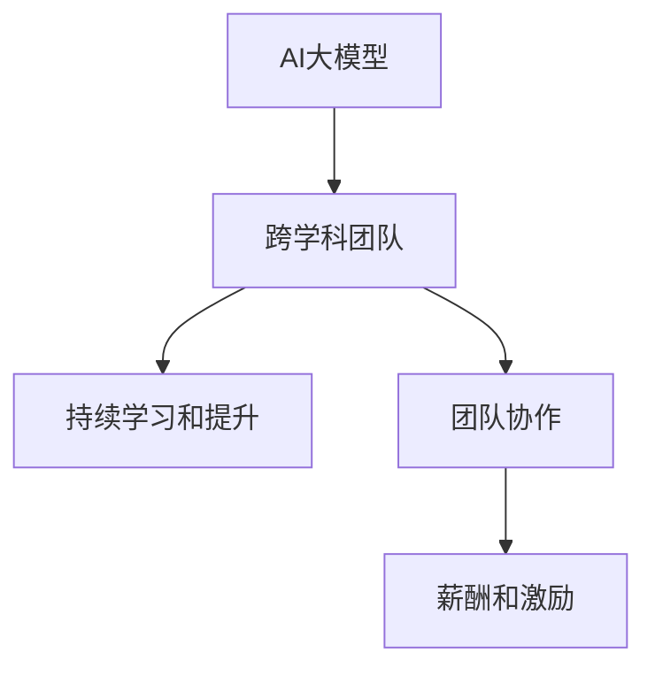

                 

# AI 大模型创业：如何利用人才优势？

在当今的技术爆炸时代，AI大模型的创业机会层出不穷，但仅有技术优势还远远不够。如何利用人才优势，打造一个强大的AI团队，成为创业成功的关键。本文将深入探讨如何通过招募、培养和激励，让优秀的人才成为AI大模型创业路上的中坚力量。

## 1. 背景介绍

### 1.1 问题由来
随着深度学习技术的快速发展，AI大模型在自然语言处理(NLP)、计算机视觉(CV)等领域取得了显著的进展。这些模型基于大规模无标签数据进行预训练，通过微调(Fine-Tuning)适应特定的任务，展现了强大的泛化能力。但是，这些模型的构建和优化需要大量的跨学科人才，包括数据科学家、软件工程师、AI算法专家等。如何招募和培养这些人才，成为创业公司成功的关键。

### 1.2 问题核心关键点
在AI大模型创业中，人才的作用至关重要。以下是一些核心关键点：
- **多样化的人才组合**：AI大模型项目通常涉及多个学科，需要跨学科团队协作。
- **持续学习和提升**：AI大模型的技术和应用领域不断变化，人才需要不断学习。
- **良好的团队协作**：高效的沟通和协作是项目成功的关键。
- **适当的激励和薪酬**：吸引和留住优秀人才，需要合理的薪酬和激励机制。

## 2. 核心概念与联系

### 2.1 核心概念概述

为更好地理解如何利用人才优势，本节将介绍几个密切相关的核心概念：

- **AI大模型**：基于大规模无标签数据进行预训练的语言模型或视觉模型，通过微调适应特定任务。
- **跨学科团队**：由数据科学家、软件工程师、AI算法专家等组成的多元化团队，共同完成AI大模型的构建和优化。
- **持续学习和提升**：通过不断学习新技术、新方法，保持团队的技术领先性。
- **团队协作**：通过高效的沟通和协作，确保项目顺利推进。
- **薪酬和激励**：合理设定薪酬和激励机制，吸引和留住优秀人才。

这些核心概念之间的逻辑关系可以通过以下Mermaid流程图来展示：



这个流程图展示了大模型创业过程中的人才作用：

1. AI大模型的构建和优化依赖跨学科团队。
2. 团队需要不断学习和提升，以保持技术领先性。
3. 高效的团队协作是项目成功的关键。
4. 合理的薪酬和激励能够吸引和留住优秀人才。

## 3. 核心算法原理 & 具体操作步骤
### 3.1 算法原理概述

AI大模型的创业过程中，利用人才优势是一个复杂的系统工程。其核心思想是通过招募、培养和激励，构建一个高效、协作的跨学科团队，使团队成员能够发挥各自的专业优势，共同推动项目的发展。

形式化地，假设我们需要构建一个AI大模型项目，涉及数据科学家、软件工程师、AI算法专家等角色。我们的目标是最小化模型在特定任务上的误差，即找到最优的模型参数 $\theta$：

$$
\theta^* = \mathop{\arg\min}_{\theta} \mathcal{L}(M_{\theta},D)
$$

其中 $M_{\theta}$ 为模型，$D$ 为数据集，$\mathcal{L}$ 为损失函数。

### 3.2 算法步骤详解

AI大模型创业的人才利用过程一般包括以下几个关键步骤：

**Step 1: 招募多样化人才**
- 确定项目所需的关键岗位，包括数据科学家、软件工程师、AI算法专家等。
- 通过招聘网站、行业会议、社交网络等渠道进行招聘。
- 设置明确的角色和职责，吸引有背景的优秀人才。

**Step 2: 构建跨学科团队**
- 将招募到的多样化人才组成跨学科团队，明确团队目标和分工。
- 定期举行跨学科会议，促进团队成员之间的沟通和协作。
- 设立团队领导者，负责项目管理和协调。

**Step 3: 培养和提升技能**
- 提供定期的培训和学习机会，提升团队成员的专业技能。
- 鼓励参加行业会议、交流讲座等活动，扩大视野。
- 支持团队成员参与开源项目和学术研究，提升技术水平。

**Step 4: 激励和保留人才**
- 设定合理的薪酬体系，吸引优秀人才加入。
- 提供股权激励、奖金等长期激励机制，留住核心人才。
- 营造良好的工作氛围，注重员工的工作和生活平衡。

**Step 5: 评估和反馈**
- 定期评估团队成员的绩效，进行绩效考核和晋升。
- 设立反馈机制，听取团队成员的意见和建议，持续改进。

以上步骤展示了如何通过招募、构建、培养和激励，有效利用人才优势。

### 3.3 算法优缺点

利用人才优势在AI大模型创业中具有以下优点：
1. 多样化的团队组合可以带来更多的视角和创新思路。
2. 持续学习和提升可以保持团队的领先性。
3. 高效的团队协作可以提升项目的执行效率。
4. 合理的薪酬和激励可以吸引和留住优秀人才。

但同时也存在一些局限：
1. 人才招募和保留的成本较高，尤其是高水平的专业人才。
2. 跨学科团队需要更多的沟通和协调，增加管理难度。
3. 薪酬和激励机制需要灵活调整，保持竞争力。

尽管如此，通过科学的人才管理和激励机制，可以有效克服这些局限，最大化人才优势。

### 3.4 算法应用领域

基于多样化和高效团队的AI大模型创业方法，可以应用于以下多个领域：

- **NLP领域**：构建和优化语言模型，如GPT-3、BERT等。
- **CV领域**：构建和优化视觉模型，如ResNet、VGG等。
- **医疗领域**：利用AI大模型进行疾病诊断、医疗影像分析等。
- **金融领域**：构建AI大模型进行风险评估、投资预测等。
- **教育领域**：利用AI大模型进行个性化教育、智能辅导等。

## 4. 数学模型和公式 & 详细讲解 & 举例说明（备注：数学公式请使用latex格式，latex嵌入文中独立段落使用 $$，段落内使用 $)
### 4.1 数学模型构建

在AI大模型创业过程中，数学模型和公式可以帮助我们更好地理解和优化项目。

假设我们有一个简单的二分类问题，输入为 $x$，输出为 $y$。我们的目标是最小化预测误差，即：

$$
\mathcal{L}(\theta) = \frac{1}{N}\sum_{i=1}^N \ell(M_{\theta}(x_i),y_i)
$$

其中 $\ell$ 为损失函数，如交叉熵损失。我们的优化目标是最小化经验风险：

$$
\theta^* = \mathop{\arg\min}_{\theta} \mathcal{L}(\theta)
$$

通过梯度下降等优化算法，不断更新模型参数 $\theta$，最小化损失函数 $\mathcal{L}(\theta)$。

### 4.2 公式推导过程

以二分类任务为例，我们的目标函数可以写为：

$$
\mathcal{L}(\theta) = -\frac{1}{N}\sum_{i=1}^N [y_i\log \hat{y_i} + (1-y_i)\log(1-\hat{y_i})]
$$

其中 $\hat{y_i}=M_{\theta}(x_i)$ 为模型在输入 $x_i$ 上的预测概率。利用链式法则，损失函数对参数 $\theta_k$ 的梯度为：

$$
\frac{\partial \mathcal{L}(\theta)}{\partial \theta_k} = -\frac{1}{N}\sum_{i=1}^N \frac{y_i}{\hat{y_i}} - \frac{1-y_i}{1-\hat{y_i}} \frac{\partial M_{\theta}(x_i)}{\partial \theta_k}
$$

利用自动微分技术，可以高效计算梯度，进而更新模型参数。

### 4.3 案例分析与讲解

以ImageNet数据集为例，构建一个ImageNet分类模型。首先，我们需要一个跨学科团队，包括数据科学家、软件工程师和AI算法专家。数据科学家负责处理和清洗数据，软件工程师负责模型的实现和部署，AI算法专家负责模型的优化和调参。

通过上述步骤，我们能够高效地构建和优化AI大模型，提升其在ImageNet分类任务上的性能。

## 5. 项目实践：代码实例和详细解释说明
### 5.1 开发环境搭建

在进行AI大模型创业实践前，我们需要准备好开发环境。以下是使用Python进行PyTorch开发的环境配置流程：

1. 安装Anaconda：从官网下载并安装Anaconda，用于创建独立的Python环境。

2. 创建并激活虚拟环境：
```bash
conda create -n pytorch-env python=3.8 
conda activate pytorch-env
```

3. 安装PyTorch：根据CUDA版本，从官网获取对应的安装命令。例如：
```bash
conda install pytorch torchvision torchaudio cudatoolkit=11.1 -c pytorch -c conda-forge
```

4. 安装Transformers库：
```bash
pip install transformers
```

5. 安装各类工具包：
```bash
pip install numpy pandas scikit-learn matplotlib tqdm jupyter notebook ipython
```

完成上述步骤后，即可在`pytorch-env`环境中开始AI大模型创业的实践。

### 5.2 源代码详细实现

下面我们以ImageNet分类任务为例，给出使用Transformers库构建和微调预训练模型的PyTorch代码实现。

首先，定义模型和数据集：

```python
from transformers import ResNet50, AdamW, get_linear_schedule_with_warmup
from torchvision import datasets, transforms

# 定义模型
model = ResNet50(num_classes=1000)

# 定义优化器
optimizer = AdamW(model.parameters(), lr=1e-3)

# 定义数据集
train_dataset = datasets.ImageNet('train', transform=transforms.Compose([
    transforms.RandomResizedCrop(224),
    transforms.RandomHorizontalFlip(),
    transforms.ToTensor(),
    transforms.Normalize([0.485, 0.456, 0.406], [0.229, 0.224, 0.225])
]))

# 定义数据加载器
train_loader = torch.utils.data.DataLoader(train_dataset, batch_size=32, shuffle=True, num_workers=4)
```

然后，定义训练和评估函数：

```python
from torch.utils.data import DataLoader
from tqdm import tqdm
from sklearn.metrics import classification_report

device = torch.device('cuda') if torch.cuda.is_available() else torch.device('cpu')
model.to(device)

def train_epoch(model, train_loader, optimizer, scheduler):
    model.train()
    epoch_loss = 0
    for batch in tqdm(train_loader, desc='Training'):
        inputs, labels = batch[0].to(device), batch[1].to(device)
        outputs = model(inputs)
        loss = F.cross_entropy(outputs, labels)
        epoch_loss += loss.item()
        optimizer.zero_grad()
        loss.backward()
        scheduler.step()
        optimizer.step()
    return epoch_loss / len(train_loader)

def evaluate(model, val_loader):
    model.eval()
    val_loss = 0
    correct = 0
    with torch.no_grad():
        for batch in tqdm(val_loader, desc='Evaluating'):
            inputs, labels = batch[0].to(device), batch[1].to(device)
            outputs = model(inputs)
            val_loss += F.cross_entropy(outputs, labels).item()
            _, preds = torch.max(outputs, dim=1)
            correct += (preds == labels).sum().item()
    print('Val Loss: {:.4f}, Acc: {:.2f}%'.format(val_loss / len(val_loader), 100 * correct / len(val_loader)))
    
# 定义训练参数
epochs = 10
total_steps = len(train_loader) * epochs
scheduler = get_linear_schedule_with_warmup(optimizer, num_warmup_steps=0, num_training_steps=total_steps)
```

最后，启动训练流程并在验证集上评估：

```python
for epoch in range(epochs):
    loss = train_epoch(model, train_loader, optimizer, scheduler)
    print('Epoch {}: Loss: {:.4f}'.format(epoch+1, loss))
    
    evaluate(model, val_loader)
    
print('Final Acc:', evaluate(model, val_loader))
```

以上就是使用PyTorch构建和微调预训练模型的完整代码实现。可以看到，得益于Transformers库的强大封装，我们可以用相对简洁的代码完成模型的构建和微调。

### 5.3 代码解读与分析

让我们再详细解读一下关键代码的实现细节：

**模型定义**：
- `ResNet50`：定义了一个ResNet50模型，用于ImageNet分类。
- `AdamW`：定义了AdamW优化器，设置学习率为1e-3。

**数据集定义**：
- `ImageNet`：加载ImageNet数据集，并进行数据增强和归一化。
- `DataLoader`：定义数据加载器，以小批量数据进行模型训练。

**训练和评估函数**：
- `train_epoch`：定义训练函数，计算损失并更新模型参数。
- `evaluate`：定义评估函数，计算模型在验证集上的精度和损失。
- `train`：定义训练参数，包括迭代轮数和优化器调度。

**训练流程**：
- `scheduler`：定义学习率调度器，逐渐减小学习率。
- `epochs`：定义总的迭代轮数。
- `total_steps`：计算总的训练步骤。
- `evaluate`：在每个epoch结束后评估模型性能。

可以看到，PyTorch配合Transformers库使得模型的构建和微调变得简洁高效。开发者可以将更多精力放在数据处理、模型改进等高层逻辑上，而不必过多关注底层的实现细节。

当然，工业级的系统实现还需考虑更多因素，如模型的保存和部署、超参数的自动搜索、更灵活的任务适配层等。但核心的微调范式基本与此类似。

## 6. 实际应用场景
### 6.1 智能医疗诊断

基于大模型的AI大模型在医疗领域具有重要应用。在智能医疗诊断中，AI大模型可以用于疾病诊断、医疗影像分析等任务。例如，在X光影像分类任务中，通过微调预训练模型，可以显著提升疾病的诊断准确率。

具体而言，可以收集大量标注好的医疗影像数据，构建标注数据集。然后对预训练模型进行微调，使其在特定任务上表现更好。在实际应用中，模型能够自动判断影像中的疾病类型，提升医生的工作效率和准确率。

### 6.2 智能金融分析

在金融领域，AI大模型可以用于风险评估、投资预测等任务。例如，在股票预测任务中，通过微调预训练模型，可以预测股票价格走势，帮助投资者做出更明智的投资决策。

具体而言，可以收集历史股票数据和相关新闻，构建标注数据集。然后对预训练模型进行微调，使其在股票预测任务上表现更好。在实际应用中，模型能够自动分析市场动向，预测股票价格变化趋势，为投资者提供有价值的投资建议。

### 6.3 智能推荐系统

AI大模型在推荐系统中的应用同样非常广泛。在智能推荐系统中，AI大模型可以用于个性化推荐、广告推荐等任务。例如，在个性化推荐任务中，通过微调预训练模型，可以为每个用户提供个性化的商品推荐。

具体而言，可以收集用户浏览、点击、购买等行为数据，构建用户-商品关联数据集。然后对预训练模型进行微调，使其在推荐任务上表现更好。在实际应用中，模型能够根据用户的历史行为，推荐相关商品，提升用户的购物体验。

### 6.4 未来应用展望

随着AI大模型的不断发展，其在各领域的应用前景将更加广阔。未来，AI大模型将进一步融入医疗、金融、推荐等各个行业，提升相关领域的智能化水平。

在医疗领域，AI大模型将广泛应用于疾病诊断、医疗影像分析、药物研发等任务，为医疗健康带来新突破。

在金融领域，AI大模型将广泛应用于风险评估、投资预测、智能客服等任务，为金融市场带来新机遇。

在推荐系统领域，AI大模型将广泛应用于个性化推荐、广告推荐、内容推荐等任务，为用户带来更好的购物体验。

## 7. 工具和资源推荐
### 7.1 学习资源推荐

为了帮助开发者系统掌握AI大模型的开发方法，这里推荐一些优质的学习资源：

1. 《Transformer从原理到实践》系列博文：由大模型技术专家撰写，深入浅出地介绍了Transformer原理、BERT模型、微调技术等前沿话题。

2. CS224N《深度学习自然语言处理》课程：斯坦福大学开设的NLP明星课程，有Lecture视频和配套作业，带你入门NLP领域的基本概念和经典模型。

3. 《Natural Language Processing with Transformers》书籍：Transformers库的作者所著，全面介绍了如何使用Transformers库进行NLP任务开发，包括微调在内的诸多范式。

4. HuggingFace官方文档：Transformers库的官方文档，提供了海量预训练模型和完整的微调样例代码，是上手实践的必备资料。

5. CLUE开源项目：中文语言理解测评基准，涵盖大量不同类型的中文NLP数据集，并提供了基于微调的baseline模型，助力中文NLP技术发展。

通过对这些资源的学习实践，相信你一定能够快速掌握AI大模型的开发方法，并用于解决实际的NLP问题。
###  7.2 开发工具推荐

高效的开发离不开优秀的工具支持。以下是几款用于AI大模型开发的常用工具：

1. PyTorch：基于Python的开源深度学习框架，灵活动态的计算图，适合快速迭代研究。大部分预训练语言模型都有PyTorch版本的实现。

2. TensorFlow：由Google主导开发的开源深度学习框架，生产部署方便，适合大规模工程应用。同样有丰富的预训练语言模型资源。

3. Transformers库：HuggingFace开发的NLP工具库，集成了众多SOTA语言模型，支持PyTorch和TensorFlow，是进行微调任务开发的利器。

4. Weights & Biases：模型训练的实验跟踪工具，可以记录和可视化模型训练过程中的各项指标，方便对比和调优。与主流深度学习框架无缝集成。

5. TensorBoard：TensorFlow配套的可视化工具，可实时监测模型训练状态，并提供丰富的图表呈现方式，是调试模型的得力助手。

6. Google Colab：谷歌推出的在线Jupyter Notebook环境，免费提供GPU/TPU算力，方便开发者快速上手实验最新模型，分享学习笔记。

合理利用这些工具，可以显著提升AI大模型开发效率，加快创新迭代的步伐。

### 7.3 相关论文推荐

AI大模型和微调技术的发展源于学界的持续研究。以下是几篇奠基性的相关论文，推荐阅读：

1. Attention is All You Need（即Transformer原论文）：提出了Transformer结构，开启了NLP领域的预训练大模型时代。

2. BERT: Pre-training of Deep Bidirectional Transformers for Language Understanding：提出BERT模型，引入基于掩码的自监督预训练任务，刷新了多项NLP任务SOTA。

3. Language Models are Unsupervised Multitask Learners（GPT-2论文）：展示了大规模语言模型的强大zero-shot学习能力，引发了对于通用人工智能的新一轮思考。

4. Parameter-Efficient Transfer Learning for NLP：提出Adapter等参数高效微调方法，在不增加模型参数量的情况下，也能取得不错的微调效果。

5. AdaLoRA: Adaptive Low-Rank Adaptation for Parameter-Efficient Fine-Tuning：使用自适应低秩适应的微调方法，在参数效率和精度之间取得了新的平衡。

这些论文代表了大模型微调技术的发展脉络。通过学习这些前沿成果，可以帮助研究者把握学科前进方向，激发更多的创新灵感。

## 8. 总结：未来发展趋势与挑战
### 8.1 研究成果总结

本文对利用人才优势构建AI大模型进行了全面系统的介绍。首先阐述了AI大模型在各领域的应用前景，明确了人才在AI大模型创业中的重要性。其次，从招募、培养和激励的角度，详细讲解了如何利用人才优势，构建高效、协作的跨学科团队。最后，介绍了AI大模型在医疗、金融、推荐等领域的实际应用场景，展示了AI大模型技术的广阔前景。

通过本文的系统梳理，可以看到，利用人才优势构建AI大模型，是实现AI技术产业化、提升各领域智能化水平的关键。未来，伴随AI大模型的不断发展，人才的作用将更加凸显，科学的人才管理和激励机制也将在AI大模型创业中发挥更大的作用。

### 8.2 未来发展趋势

展望未来，AI大模型在各领域的应用前景将更加广阔，人才的作用也将更加重要。以下是未来AI大模型的一些发展趋势：

1. **跨学科融合**：AI大模型将进一步与机器学习、自然语言处理、计算机视觉等不同领域融合，形成更加全面的智能化解决方案。

2. **自监督学习**：利用自监督学习任务，预训练模型能够学习到更多的语言知识，提升模型泛化能力。

3. **知识增强**：引入外部知识库、规则库等专家知识，引导模型学习更准确、合理的语言模型。

4. **多模态融合**：AI大模型将进一步融合视觉、语音、文本等多模态信息，提升模型的感知能力和理解能力。

5. **少样本学习**：利用少样本学习技术，模型能够在少量数据下快速适应新任务，提升模型的鲁棒性和泛化性。

6. **实时性优化**：通过模型压缩、量化加速等技术，优化模型结构，提升推理速度和效率。

7. **可解释性**：引入因果分析和博弈论工具，增强模型的可解释性和可审计性，确保输出的安全性和可靠性。

这些趋势展示了AI大模型在未来发展的广阔前景，也为人才的培养和利用提供了新的方向。

### 8.3 面临的挑战

尽管AI大模型在各领域的应用前景广阔，但在实际应用中也面临着诸多挑战：

1. **数据隐私和安全**：AI大模型的应用需要大量数据，如何保护数据隐私和安全是一个重要问题。

2. **模型鲁棒性**：模型在面对数据噪声和对抗攻击时，鲁棒性不足，需要进一步提升。

3. **模型可解释性**：AI大模型通常被视为"黑盒"系统，难以解释其内部工作机制和决策逻辑。

4. **跨领域迁移**：AI大模型在特定领域的迁移能力有限，需要进一步提升。

5. **计算资源**：AI大模型的训练和推理需要大量计算资源，如何高效利用是一个重要问题。

6. **伦理道德**：AI大模型可能学习到有偏见、有害的信息，需要建立伦理导向的评估指标。

这些挑战需要各界共同努力，才能确保AI大模型技术健康发展。

### 8.4 研究展望

面对AI大模型所面临的挑战，未来的研究需要在以下几个方面寻求新的突破：

1. **数据隐私保护**：采用差分隐私等技术，保护数据隐私和安全。

2. **模型鲁棒性提升**：利用对抗训练、自监督学习等方法，提高模型的鲁棒性。

3. **模型可解释性**：引入因果分析、博弈论工具，增强模型的可解释性。

4. **跨领域迁移**：开发更加通用的预训练模型和微调方法，提升模型的跨领域迁移能力。

5. **计算资源优化**：利用模型压缩、量化加速等技术，优化模型的计算资源利用效率。

6. **伦理道德约束**：在模型训练目标中引入伦理导向的评估指标，确保模型的安全性和可靠性。

这些研究方向将推动AI大模型技术走向成熟，为各领域智能化应用提供坚实基础。总之，AI大模型创业需要不断优化人才管理和激励机制，合理利用多样化人才，提升AI大模型的性能和应用范围。只有通过科学的人才管理，才能真正实现AI大模型的产业化，带来广泛的社会和经济效益。

## 9. 附录：常见问题与解答

**Q1：AI大模型创业需要哪些关键技能？**

A: AI大模型创业需要跨学科的综合技能，包括数据科学、软件工程、AI算法等。具体技能包括：

- **数据科学**：数据预处理、特征工程、数据分析等。
- **软件工程**：模型部署、代码编写、测试优化等。
- **AI算法**：模型设计、微调优化、调参技巧等。

**Q2：如何选择合适的模型架构？**

A: 选择合适的模型架构需要考虑任务的特点和数据量。对于大规模数据集，可以选择预训练模型如BERT、GPT等，进行微调适应特定任务。对于小规模数据集，可以使用更轻量级的模型如MobileNet、ShuffleNet等，避免过拟合。

**Q3：如何处理数据隐私和安全问题？**

A: 处理数据隐私和安全问题需要采用差分隐私、数据脱敏等技术，确保数据在传输和存储过程中的安全。同时需要建立严格的数据访问权限和审计机制，防止数据泄露。

**Q4：如何进行模型训练和优化？**

A: 模型训练和优化需要考虑学习率、批次大小、优化器等参数。可以通过超参数搜索、模型压缩、量化加速等技术提升模型的训练效率和性能。同时需要引入对抗训练、自监督学习等技术提升模型的鲁棒性和泛化能力。

**Q5：如何建立良好的团队文化？**

A: 建立良好的团队文化需要注重团队成员的沟通和协作，定期举行团队会议，分享经验和成果。需要营造良好的工作氛围，注重员工的工作和生活平衡，建立公平的激励和评价机制，确保团队成员的积极性和创造力。

这些问题的解答，可以帮助读者更好地理解AI大模型创业的实践和挑战，为创业成功提供指导。

---

作者：禅与计算机程序设计艺术 / Zen and the Art of Computer Programming

