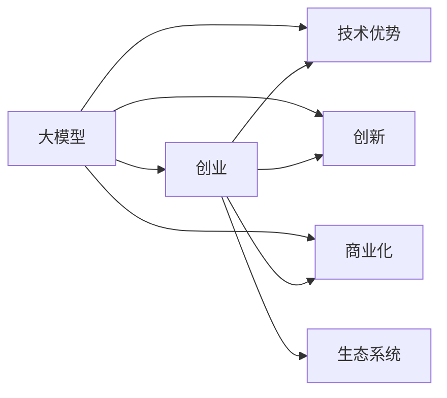
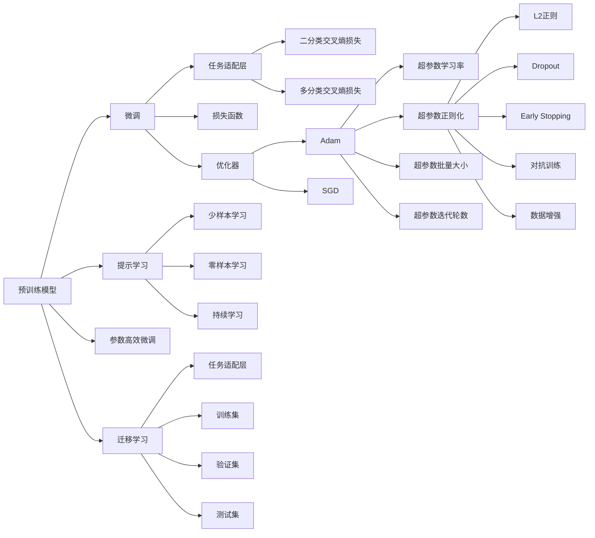

                 

## 1. 背景介绍

### 1.1 问题由来
近年来，随着人工智能(AI)技术的飞速发展，大模型(AI Large Model)在各个领域中展现出了巨大的潜力。从自然语言处理(NLP)到计算机视觉(CV)，从自动驾驶到机器人学，大模型的应用遍地开花。然而，尽管大模型在技术层面取得了突破性进展，但要真正将它们商业化、产业化，仍面临诸多挑战。

### 1.2 问题核心关键点
大模型创业的核心在于如何利用大模型的技术优势，通过创新的商业模式和应用场景，实现技术的市场化和商业价值最大化。关键问题包括：

- 如何降低大模型应用的门槛，让更多中小企业和创业公司能够快速接入？
- 如何在有限的资源下，实现大模型的高效部署和应用？
- 如何构建可持续发展的商业生态，吸引多方利益相关者共同参与？
- 如何保证大模型的安全性和可靠性，避免潜在的伦理和法律风险？

### 1.3 问题研究意义
探索大模型创业的成功路径，不仅有助于大模型技术的推广和应用，还能为其他AI技术的商业化提供有益的借鉴。具体意义如下：

- 加速AI技术落地：大模型的广泛应用可以加速AI技术的产业化进程，促进AI与各行各业的深度融合。
- 驱动新商业模式：大模型创业为企业提供了新一轮的商业机会，推动数据价值、算法价值与市场价值的有效结合。
- 促进产业链完善：大模型创业不仅需要技术创新，还需要生态系统的协同发展，构建完整的技术和业务生态。
- 提升企业竞争力：大模型创业有助于企业构建核心技术壁垒，形成差异化的市场竞争优势。

## 2. 核心概念与联系

### 2.1 核心概念概述

大模型创业涉及多个关键概念，主要包括：

- **大模型（Large Model）**：指在特定领域经过大量数据训练的大型神经网络模型，如BERT、GPT-3等，具备高精度的预测能力。
- **创业（Entrepreneurship）**：指利用创新的商业模式和技术手段，将大模型的应用转化为商业价值的过程。
- **技术优势（Technological Advantage）**：指大模型在数据处理、计算能力、泛化能力等方面的技术优势。
- **创新（Innovation）**：指对大模型应用场景、商业模式、市场策略等的创新探索。
- **商业化（Commercialization）**：指将大模型的技术优势转化为实际产品和服务，实现商业价值的过程。
- **生态系统（Ecosystem）**：指围绕大模型应用的各方利益相关者，包括技术提供方、应用开发者、终端用户、监管机构等。

这些概念相互联系，构成了一个动态发展的AI创业生态。以下是一个概括性的Mermaid流程图，展示这些概念之间的相互关系：



该流程图展示了大模型的技术优势、创新、商业化与生态系统的相互作用关系。

### 2.2 核心概念原理和架构的 Mermaid 流程图



该流程图示意了大模型微调的基本架构和主要技术环节，包括预训练、微调、迁移学习、参数高效微调、提示学习等。

## 3. 核心算法原理 & 具体操作步骤

### 3.1 算法原理概述

大模型创业的核心算法原理包括大模型的预训练、微调、迁移学习、参数高效微调、提示学习等。这些技术通过合理设计算法和优化策略，最大化地发挥大模型的技术优势，降低应用门槛，提升应用效果。

### 3.2 算法步骤详解

大模型创业的技术步骤主要包括以下几个方面：

#### 预训练步骤：
1. 收集大规模无标注数据，如维基百科、新闻等。
2. 使用深度神经网络架构，如Transformer、BERT等，进行预训练。
3. 通过自监督学习任务，如语言建模、掩码预测等，学习通用的语言表示。

#### 微调步骤：
1. 收集少量标注数据，根据目标任务设计任务适配层。
2. 使用大模型作为初始化参数，通过有监督学习优化模型。
3. 设定合适的学习率、正则化等超参数，防止过拟合。
4. 对模型进行前向传播和反向传播，更新参数。
5. 周期性在验证集上评估模型性能，优化模型参数。

#### 迁移学习步骤：
1. 将大模型应用于目标任务，作为初始化参数。
2. 使用少量标注数据进行微调，学习任务特定知识。
3. 保留预训练部分层，只微调顶层，减少需优化参数。
4. 在数据增强、对抗训练等技术支持下，提升模型泛化能力。

#### 参数高效微调步骤：
1. 只更新任务相关的参数，如文本分类器的顶层，保留预训练权重不变。
2. 使用适配器(Adapters)、提示学习(Prompt Tuning)等方法，减少需微调参数量。
3. 保持模型预训练权重不变，只微调顶层，减少参数更新次数。

#### 提示学习步骤：
1. 设计符合任务要求的提示模板(Prompt Templates)。
2. 将提示模板输入大模型，生成预测结果。
3. 根据任务需求，调整输出格式和内容。
4. 在少样本和零样本场景下，通过提示模板提高模型效果。

### 3.3 算法优缺点

大模型创业的算法具有以下优点：

- **技术优势明显**：大模型在处理大规模数据、复杂任务、泛化能力方面具有明显优势。
- **灵活性高**：通过微调、迁移学习等技术，大模型能够快速适应不同任务和场景。
- **应用广泛**：大模型广泛应用于NLP、CV、推荐系统等多个领域，具有广泛的应用前景。

同时，也存在一些缺点：

- **数据依赖性强**：大模型的应用需要大量的标注数据，数据获取成本高。
- **资源消耗大**：大模型的训练和推理需要高性能硬件，资源消耗大。
- **知识整合困难**：大模型难以与先验知识进行有效整合，应用场景受限。
- **安全性和可靠性问题**：大模型在训练和应用过程中可能存在偏见和有害信息，需要加强监管。

### 3.4 算法应用领域

大模型创业的算法广泛应用于以下几个领域：

- **自然语言处理(NLP)**：包括文本分类、命名实体识别、机器翻译等任务。
- **计算机视觉(CV)**：如图像分类、目标检测、图像生成等任务。
- **推荐系统**：如商品推荐、用户画像生成等任务。
- **医疗健康**：如疾病诊断、治疗方案推荐等任务。
- **金融服务**：如信用评分、风险评估等任务。
- **智能制造**：如工业质量检测、设备维护预测等任务。

## 4. 数学模型和公式 & 详细讲解 & 举例说明

### 4.1 数学模型构建

大模型创业的核心数学模型包括预训练模型、微调模型、迁移学习模型等。这里以BERT预训练模型为例，构建大模型的数学模型。

### 4.2 公式推导过程

BERT的预训练模型通过自监督任务进行训练。其核心公式包括：

$$
\min_{\theta} \frac{1}{N} \sum_{i=1}^N \ell(M_{\theta}(x_i),y_i)
$$

其中，$M_{\theta}$ 表示BERT模型，$x_i$ 表示输入文本，$y_i$ 表示标签。

微调模型的损失函数为：

$$
\mathcal{L}(\theta) = \frac{1}{N} \sum_{i=1}^N \ell(M_{\theta}(x_i),y_i)
$$

其中，$\ell$ 为任务特定的损失函数，如二分类交叉熵损失、多分类交叉熵损失等。

### 4.3 案例分析与讲解

以BERT预训练模型为例，其训练过程包括：

1. 收集大规模无标注文本数据，如维基百科、新闻等。
2. 使用BERT架构，通过掩码预测等自监督任务，进行预训练。
3. 使用少量标注数据，设计任务适配层，进行微调。
4. 在验证集上评估模型性能，优化超参数。
5. 在测试集上评估模型效果，输出预测结果。

## 5. 项目实践：代码实例和详细解释说明

### 5.1 开发环境搭建

开发大模型创业项目，需要搭建适合的开发环境。以下是Python环境配置步骤：

1. 安装Anaconda：从官网下载并安装Anaconda，用于创建独立的Python环境。
2. 创建并激活虚拟环境：
```bash
conda create -n pytorch-env python=3.8 
conda activate pytorch-env
```

3. 安装PyTorch：根据CUDA版本，从官网获取对应的安装命令。例如：
```bash
conda install pytorch torchvision torchaudio cudatoolkit=11.1 -c pytorch -c conda-forge
```

4. 安装相关库：
```bash
pip install transformers torchtext torchtext-nlp sentencepiece tensorboard
```

5. 设置数据集路径：
```bash
export TRAIN_DIR=/path/to/data/train
export TEST_DIR=/path/to/data/test
```

完成上述步骤后，即可在`pytorch-env`环境中开始开发。

### 5.2 源代码详细实现

以BERT预训练模型的微调为例，代码实现如下：

```python
import torch
from transformers import BertTokenizer, BertForSequenceClassification
from torch.utils.data import DataLoader, Dataset

class BERTDataset(Dataset):
    def __init__(self, texts, labels, tokenizer):
        self.tokenizer = tokenizer
        self.texts = texts
        self.labels = labels
        
    def __len__(self):
        return len(self.texts)
    
    def __getitem__(self, idx):
        text = self.texts[idx]
        label = self.labels[idx]
        
        encoding = self.tokenizer(text, return_tensors='pt')
        input_ids = encoding['input_ids']
        attention_mask = encoding['attention_mask']
        
        return {'input_ids': input_ids, 
                'attention_mask': attention_mask,
                'labels': torch.tensor(label, dtype=torch.long)}
    
train_dataset = BERTDataset(train_texts, train_labels, tokenizer)
dev_dataset = BERTDataset(dev_texts, dev_labels, tokenizer)
test_dataset = BERTDataset(test_texts, test_labels, tokenizer)

model = BertForSequenceClassification.from_pretrained('bert-base-uncased', num_labels=num_labels)

optimizer = AdamW(model.parameters(), lr=2e-5)
criterion = torch.nn.CrossEntropyLoss()

device = torch.device('cuda') if torch.cuda.is_available() else torch.device('cpu')
model.to(device)

for epoch in range(num_epochs):
    model.train()
    train_loss = 0
    train_acc = 0
    
    for batch in train_loader:
        input_ids = batch['input_ids'].to(device)
        attention_mask = batch['attention_mask'].to(device)
        labels = batch['labels'].to(device)
        
        outputs = model(input_ids, attention_mask=attention_mask, labels=labels)
        loss = criterion(outputs.logits, labels)
        train_loss += loss.item()
        
        logits = outputs.logits.argmax(dim=1)
        train_acc += (logits == labels).float().mean().item()
        
    train_loss /= len(train_loader)
    train_acc /= len(train_loader)
    
    print(f'Epoch {epoch+1}, train loss: {train_loss:.4f}, train acc: {train_acc:.4f}')
    
    model.eval()
    dev_loss = 0
    dev_acc = 0
    
    with torch.no_grad():
        for batch in dev_loader:
            input_ids = batch['input_ids'].to(device)
            attention_mask = batch['attention_mask'].to(device)
            labels = batch['labels'].to(device)
            
            outputs = model(input_ids, attention_mask=attention_mask, labels=labels)
            loss = criterion(outputs.logits, labels)
            dev_loss += loss.item()
            
            logits = outputs.logits.argmax(dim=1)
            dev_acc += (logits == labels).float().mean().item()
        
        dev_loss /= len(dev_loader)
        dev_acc /= len(dev_loader)
        
    print(f'Epoch {epoch+1}, dev loss: {dev_loss:.4f}, dev acc: {dev_acc:.4f}')
    
test_loss = 0
test_acc = 0
    
with torch.no_grad():
    for batch in test_loader:
        input_ids = batch['input_ids'].to(device)
        attention_mask = batch['attention_mask'].to(device)
        labels = batch['labels'].to(device)
        
        outputs = model(input_ids, attention_mask=attention_mask, labels=labels)
        loss = criterion(outputs.logits, labels)
        test_loss += loss.item()
        
        logits = outputs.logits.argmax(dim=1)
        test_acc += (logits == labels).float().mean().item()
    
    test_loss /= len(test_loader)
    test_acc /= len(test_loader)
    
print(f'Test loss: {test_loss:.4f}, test acc: {test_acc:.4f}')
```

### 5.3 代码解读与分析

- **BERTDataset类**：自定义数据集类，用于处理文本和标签。
- **模型加载和优化器设置**：使用BertForSequenceClassification加载预训练模型，设置AdamW优化器和交叉熵损失函数。
- **数据加载**：使用PyTorch的DataLoader加载训练、验证、测试集。
- **训练循环**：在每个epoch中，对模型进行前向传播和反向传播，计算损失和准确率。
- **评估和测试**：在验证集和测试集上评估模型性能，输出最终的损失和准确率。

## 6. 实际应用场景

### 6.1 智能客服系统

智能客服系统是大模型创业的重要应用场景。传统的客服系统依赖人工处理，成本高、效率低。而使用微调后的BERT模型，可以实现自动理解客户意图，匹配最佳答案，提升客户体验。

### 6.2 金融舆情监测

金融市场舆情监测是大模型创业的另一重要应用。收集金融相关新闻、评论等数据，进行情感分析和主题标注，利用BERT模型进行舆情分析，及时发现市场动态，防范金融风险。

### 6.3 个性化推荐系统

个性化推荐系统是大模型创业的重要应用。通过收集用户行为数据，利用BERT模型进行推荐排序，提升推荐效果，满足用户个性化需求。

### 6.4 未来应用展望

未来，大模型创业将在更多领域得到应用，如智慧医疗、智能教育、智慧城市等，为各行各业带来变革性影响。

## 7. 工具和资源推荐

### 7.1 学习资源推荐

为了帮助开发者系统掌握大模型创业的技术基础和实践技巧，这里推荐一些优质的学习资源：

- 《深度学习入门》：全面介绍深度学习的基本概念和算法原理。
- 《NLP实战：序列模型》：介绍NLP领域中的序列模型，包括RNN、LSTM、Transformer等。
- 《Python深度学习》：深入浅出地介绍深度学习在Python中的实现。
- HuggingFace官方文档：提供丰富的预训练模型和微调样例，是学习的宝贵资源。
- CS229《机器学习》课程：斯坦福大学开设的机器学习经典课程，系统讲解机器学习原理和应用。

### 7.2 开发工具推荐

大模型创业离不开高效的开发工具支持。以下是几款常用工具：

- PyTorch：灵活的深度学习框架，适合快速迭代研究。
- TensorFlow：高性能深度学习框架，生产部署方便。
- Transformers库：提供丰富的预训练模型和微调方法，方便开发。
- TensorBoard：可视化工具，实时监测模型训练状态。
- Weights & Biases：实验跟踪工具，记录模型训练过程，便于对比和调优。

### 7.3 相关论文推荐

大模型创业技术的发展源于学界的持续研究。以下是几篇奠基性的相关论文，推荐阅读：

- 《Transformer：Attention is All You Need》：提出Transformer结构，开启大模型时代。
- 《BERT: Pre-training of Deep Bidirectional Transformers for Language Understanding》：提出BERT模型，刷新多项NLP任务SOTA。
- 《LoRA: Low-Rank Adaptation of Pretrained Models》：提出LoRA方法，实现参数高效微调。
- 《Prompt Engineering》：介绍提示工程方法，提升模型效果。

## 8. 总结：未来发展趋势与挑战

### 8.1 研究成果总结

本文对大模型创业的核心算法原理和操作步骤进行了详细讲解，并结合实际应用场景进行了深入分析。

- **核心算法**：包括预训练、微调、迁移学习、参数高效微调、提示学习等，通过合理设计算法和优化策略，最大化地发挥大模型的技术优势。
- **具体操作步骤**：涵盖数据准备、模型加载、优化器设置、训练循环、评估测试等步骤，系统化的代码实现，方便开发者理解和应用。
- **实际应用**：展示了智能客服、金融舆情、个性化推荐等多个领域的应用案例，展示了大模型创业的广阔前景。

### 8.2 未来发展趋势

未来大模型创业将继续蓬勃发展，呈现以下趋势：

- **技术创新加速**：大模型的参数规模和应用场景将不断扩展，技术创新将持续推动产业发展。
- **生态系统完善**：随着大模型的广泛应用，将形成完整的生态系统，包括技术提供方、应用开发者、终端用户等。
- **商业化加速**：大模型的商业化应用将加速落地，带来更多的商业机会和经济价值。
- **政策法规完善**：政府和监管机构将逐步完善相关政策法规，保障大模型的安全和合规性。
- **伦理道德重视**：随着大模型应用的深入，伦理道德问题将受到更多关注，需加强模型监管和用户保护。

### 8.3 面临的挑战

尽管大模型创业具有广阔的前景，但面临诸多挑战：

- **数据隐私和安全**：大模型训练和应用过程中，涉及大量敏感数据，需加强隐私保护和数据安全。
- **模型公平性和透明性**：大模型可能存在偏见，需加强公平性检测和透明性建设。
- **计算资源消耗**：大模型的训练和推理需要高性能硬件，计算资源消耗大，需优化资源使用。
- **算法复杂性**：大模型的算法复杂度高，需提升算法的易用性和可解释性。
- **市场竞争激烈**：大模型创业市场竞争激烈，需提升产品和服务的差异化竞争力。

### 8.4 研究展望

未来大模型创业需要在技术创新、生态建设、市场推广、政策法规等方面不断突破。具体展望如下：

- **技术创新**：继续探索参数高效微调、零样本学习、多模态融合等前沿技术。
- **生态建设**：构建完整的生态系统，吸引多方利益相关者共同参与，形成良性循环。
- **市场推广**：提升大模型应用的易用性和可扩展性，降低应用门槛。
- **政策法规**：制定合理的数据隐私和安全政策，建立健全的伦理道德框架。
- **企业发展**：加强企业内部管理和团队建设，提升企业的持续创新能力和市场竞争力。

通过系统研究和持续创新，大模型创业将迈向更广阔的市场应用，为人工智能技术的发展和产业化带来新的动力。

## 9. 附录：常见问题与解答

**Q1：大模型创业的商业模式有哪些？**

A: 大模型创业的商业模式包括SaaS、PaaS、API等。SaaS模式提供全流程服务，PaaS模式提供平台和工具，API模式提供算力接口。企业可以根据自身需求选择适合的商业模式。

**Q2：如何选择合适的预训练模型？**

A: 选择合适的预训练模型需考虑以下因素：
- 任务的复杂度：任务复杂度越高，需选择参数量较大的模型。
- 数据规模：数据规模越大，需选择计算能力更强的硬件。
- 应用场景：应用场景不同，需选择适合的模型结构和优化策略。
- 性能要求：性能要求越高，需选择精度更高的模型。

**Q3：大模型创业的技术难点有哪些？**

A: 大模型创业的技术难点包括：
- 数据隐私和安全：数据隐私保护和安全性是大模型应用的关键问题。
- 算法复杂性：大模型算法的复杂度高，需提升算法的易用性和可解释性。
- 资源消耗：大模型训练和推理需要高性能硬件，需优化资源使用。
- 模型公平性：大模型可能存在偏见，需加强公平性检测和透明性建设。

**Q4：如何保证大模型的公平性和透明性？**

A: 保证大模型的公平性和透明性需从数据、算法、部署等多个环节入手：
- 数据公平性：收集和标注公平性数据，进行公平性检测。
- 算法透明性：提升算法的可解释性，提供透明的模型参数和决策过程。
- 部署监督：在模型部署和应用过程中，进行实时监控和审计，确保公平性和透明性。

通过系统研究和持续创新，大模型创业将迈向更广阔的市场应用，为人工智能技术的发展和产业化带来新的动力。

---

作者：禅与计算机程序设计艺术 / Zen and the Art of Computer Programming

