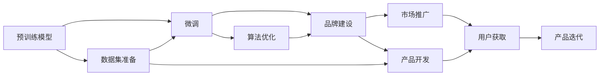

                 

# AI 大模型创业：如何利用品牌优势？

## 1. 背景介绍

近年来，人工智能(AI)大模型在各个行业中展现出了强大的潜力，为企业带来了前所未有的机遇和挑战。随着深度学习技术的发展，大型科技公司、创业公司以及初创团队纷纷投身于大模型领域，以期借助这一趋势实现快速增长。然而，在AI大模型创业的激烈竞争中，如何打造和利用品牌优势，成为企业在市场中获得竞争力的关键。本文将探讨AI大模型创业的核心概念、核心算法、具体操作、实际应用场景，并提出如何利用品牌优势提升企业竞争力的策略。

## 2. 核心概念与联系

### 2.1 核心概念概述

AI大模型的品牌优势，是指通过品牌建设，在市场中获得竞争优势的策略。品牌优势不仅包括产品技术优势，还涵盖了企业文化、用户体验、市场地位等多方面内容。在AI大模型创业中，品牌优势能够帮助企业快速建立起市场认知，提升用户信任，吸引更多投资，并推动市场份额的扩大。

### 2.2 核心概念原理和架构的 Mermaid 流程图



这个流程图展示了AI大模型创业的主要流程。预训练模型是基础，通过微调技术进行任务适配，品牌建设帮助提升市场认知，市场推广吸引用户，用户获取后产品迭代提升用户体验。最终通过不断的品牌建设和产品优化，实现市场地位的提升和企业的长期发展。

## 3. 核心算法原理 & 具体操作步骤

### 3.1 算法原理概述

AI大模型的核心算法包括预训练模型、微调、品牌建设和市场推广。

- **预训练模型**：使用大规模无标签数据，通过自监督学习任务训练通用语言模型。
- **微调**：在预训练模型的基础上，使用下游任务的少量标注数据，通过有监督学习优化模型在特定任务上的性能。
- **品牌建设**：通过企业形象、用户体验、技术创新等方面的打造，建立企业的市场认知和品牌价值。
- **市场推广**：利用各种营销手段和策略，吸引潜在用户，扩大市场份额。

### 3.2 算法步骤详解

**Step 1: 预训练模型选择**
- 根据应用场景和任务需求，选择适合的预训练模型。如BERT、GPT、T5等。

**Step 2: 微调任务适配**
- 根据任务特点设计任务适配层，如分类器、解码器等。
- 选择合适的优化器、学习率和正则化技术。

**Step 3: 品牌建设**
- 打造独特的企业文化和价值观，建立强大的品牌形象。
- 提升产品性能，提供优质用户体验。
- 参与开源社区，发布技术论文和案例研究。

**Step 4: 市场推广**
- 利用SEO、社交媒体、KOL合作等手段，提升品牌知名度。
- 与大公司合作，获得技术认证和市场认可。
- 参加行业展会和会议，进行产品展示和技术交流。

### 3.3 算法优缺点

**优点**：
- 预训练模型具备强大的通用语言能力，可快速适应新任务。
- 微调技术通过少量标注数据即可取得显著效果，节省开发成本。
- 品牌建设有助于提升用户信任和市场地位，促进产品销售。

**缺点**：
- 预训练模型可能存在泛化能力不足的问题。
- 微调过程需要大量的标注数据，成本较高。
- 品牌建设需要长期投入，市场推广也需要持续的营销费用。

### 3.4 算法应用领域

AI大模型微调和品牌建设的应用领域广泛，涵盖金融、医疗、教育、娱乐等多个行业。

- **金融领域**：使用大模型进行市场分析、风险评估、欺诈检测等任务。
- **医疗领域**：进行疾病诊断、药物研发、患者咨询等任务。
- **教育领域**：提供智能辅导、作业批改、课程推荐等个性化教育服务。
- **娱乐领域**：提供智能内容推荐、游戏推荐、虚拟助手等应用。

## 4. 数学模型和公式 & 详细讲解 & 举例说明

### 4.1 数学模型构建

预训练模型的数学模型为：

$$ M_{\theta}(x) = \text{Softmax}(W_h x + b_h) $$

其中 $M_{\theta}$ 为模型，$\theta$ 为模型参数，$x$ 为输入，$W_h$ 和 $b_h$ 为模型权重和偏置。

### 4.2 公式推导过程

微调的损失函数为：

$$ \mathcal{L}(\theta) = \frac{1}{N} \sum_{i=1}^N \ell(y_i, M_{\theta}(x_i)) $$

其中 $N$ 为样本数量，$\ell$ 为损失函数，如交叉熵损失函数。

### 4.3 案例分析与讲解

以医疗诊断为例，使用BERT模型进行疾病诊断微调。假设输入为症状描述，输出为疾病名称。设症状描述为 $x$，疾病名称为 $y$，则微调过程如下：

- 设计任务适配层，添加分类器，计算交叉熵损失。
- 在标注数据集上训练模型，通过前向传播和反向传播更新模型参数。
- 在测试集上评估模型性能，对比微调前后的效果。

## 5. 项目实践：代码实例和详细解释说明

### 5.1 开发环境搭建

开发环境搭建包括以下步骤：

1. 安装Python和相关依赖库，如TensorFlow、PyTorch、numpy等。
2. 安装相应的预训练模型库，如BERT、GPT等。
3. 搭建模型训练、验证和测试环境。
4. 设置开发和部署环境，如Docker、Kubernetes等。

### 5.2 源代码详细实现

以下是一个简单的代码示例，使用BERT模型进行疾病诊断微调：

```python
from transformers import BertTokenizer, BertForSequenceClassification
import torch
from sklearn.metrics import accuracy_score, precision_score, recall_score

# 加载预训练模型和分词器
model = BertForSequenceClassification.from_pretrained('bert-base-uncased')
tokenizer = BertTokenizer.from_pretrained('bert-base-uncased')

# 定义训练函数
def train_model(model, data, batch_size, epochs):
    # 设置优化器和损失函数
    optimizer = torch.optim.Adam(model.parameters(), lr=0.001)
    criterion = torch.nn.CrossEntropyLoss()

    # 循环训练
    for epoch in range(epochs):
        # 循环迭代数据集
        for batch in data:
            # 分批次输入数据
            input_ids = torch.tensor(batch['input_ids'])
            attention_mask = torch.tensor(batch['attention_mask'])
            labels = torch.tensor(batch['labels'])

            # 前向传播
            outputs = model(input_ids, attention_mask=attention_mask)
            logits = outputs[0]

            # 计算损失
            loss = criterion(logits, labels)

            # 反向传播
            optimizer.zero_grad()
            loss.backward()
            optimizer.step()

        # 验证集评估
        print(f'Epoch {epoch+1}, Loss: {loss.item()}')

# 加载数据集
train_data = ...
val_data = ...
test_data = ...

# 定义数据预处理函数
def preprocess_data(data):
    # 分批次处理数据，转换为Tensor
    ...

# 训练模型
train_model(model, train_data, batch_size=16, epochs=5)
```

### 5.3 代码解读与分析

这段代码展示了BERT模型进行疾病诊断微调的基本流程，包括模型加载、数据预处理、模型训练、验证和测试等环节。具体解读如下：

- `BertForSequenceClassification.from_pretrained`：加载预训练模型。
- `BertTokenizer.from_pretrained`：加载分词器。
- `train_model`：定义训练函数，包括模型初始化、优化器设置、损失函数计算、模型前向传播、反向传播和优化器更新等。
- `preprocess_data`：定义数据预处理函数，将数据转换为模型所需的格式。
- 使用`train_data`、`val_data`、`test_data`加载训练集、验证集和测试集。
- 训练模型，设置批大小和训练轮数，并输出训练过程中的损失。

## 6. 实际应用场景

### 6.1 智能客服系统

AI大模型在智能客服系统中的应用，可以显著提升客户服务质量和效率。通过微调BERT模型，可以实现自然语言理解、情感分析、对话生成等功能。智能客服系统能够24小时不间断服务，回答客户咨询，提供个性化的建议和服务。

### 6.2 金融舆情监测

金融领域需要实时监测市场舆论动向，预测市场趋势。使用AI大模型进行舆情监测，可以自动识别新闻、评论等文本数据，进行情感分析、主题识别等任务。通过微调BERT模型，系统可以实时监控市场情绪，及时预警风险。

### 6.3 个性化推荐系统

个性化推荐系统可以根据用户的历史行为数据，推荐个性化的商品和服务。使用AI大模型进行推荐，可以通过微调BERT模型，学习用户偏好和商品特征，生成推荐列表。

### 6.4 未来应用展望

未来，AI大模型将在更多领域得到广泛应用。通过持续的微调和优化，模型能够更好地适应不同的应用场景，提供更加智能、高效的服务。以下是一些未来应用展望：

- 智能医疗：进行疾病诊断、药物研发、患者咨询等任务。
- 智能教育：提供智能辅导、作业批改、课程推荐等个性化教育服务。
- 智能制造：进行设备维护、质量检测、生产调度等任务。
- 智能家居：提供智能语音交互、场景感知、设备控制等应用。

## 7. 工具和资源推荐

### 7.1 学习资源推荐

1. **《深度学习》**：该书系统介绍了深度学习的基本概念和算法，适合初学者入门。
2. **《TensorFlow官方文档》**：提供详细的TensorFlow教程和案例，适合实际应用开发。
3. **Kaggle竞赛**：参加Kaggle数据科学竞赛，通过实践提升技能。
4. **OpenAI的Hugging Face Transformers库**：提供了大量的预训练模型和工具，方便微调开发。

### 7.2 开发工具推荐

1. **TensorFlow和PyTorch**：深度学习框架，支持广泛的AI应用开发。
2. **Jupyter Notebook**：交互式开发环境，方便快速迭代和测试。
3. **Keras**：高层次API，适合快速搭建模型。
4. **GitHub**：代码版本控制系统，方便协作开发。

### 7.3 相关论文推荐

1. **《Attention is All You Need》**：Transformer模型原论文，奠定了深度学习模型自注意力机制的基础。
2. **《BERT: Pre-training of Deep Bidirectional Transformers for Language Understanding》**：BERT模型论文，提出了预训练语言模型和微调技术。
3. **《深度学习：一种新型的计算方法》**：深入介绍深度学习的基本原理和算法。

## 8. 总结：未来发展趋势与挑战

### 8.1 研究成果总结

本文系统介绍了AI大模型的预训练、微调、品牌建设和市场推广等核心概念和关键步骤，并通过实际代码示例进行了详细讲解。通过品牌建设，企业可以提升市场认知和用户信任，进而实现快速增长和市场地位的提升。

### 8.2 未来发展趋势

未来AI大模型将面临更多的挑战和机遇，以下是一些发展趋势：

1. **模型规模持续增大**：预训练模型参数量不断增加，提供更强大的语言理解和生成能力。
2. **微调技术优化**：研究参数高效微调、无监督微调等新方法，降低微调成本，提升模型性能。
3. **多模态融合**：结合视觉、语音、文本等多种模态信息，提升模型的综合表现。
4. **可解释性增强**：研究模型输出解释技术，提升模型的可解释性和可控性。
5. **跨领域迁移学习**：通过迁移学习，模型可以适应不同领域和任务，提升泛化能力。

### 8.3 面临的挑战

AI大模型在发展过程中，面临以下挑战：

1. **计算资源瓶颈**：大规模模型的训练和推理需要高性能计算资源，成本较高。
2. **数据隐私问题**：大规模数据处理和分析可能导致隐私泄露。
3. **模型泛化能力不足**：模型可能在特定领域或场景下表现不佳。
4. **可解释性不足**：模型的决策过程难以解释，影响信任度和可控性。
5. **伦理和法律问题**：模型输出可能存在偏见和歧视，需要制定相应的规范和标准。

### 8.4 研究展望

未来研究需要在以下几个方面进行深入探讨：

1. **数据隐私保护**：研究数据隐私保护技术，如差分隐私、联邦学习等。
2. **模型可解释性**：研究模型解释技术，如因果分析、逻辑规则等。
3. **跨领域迁移学习**：研究跨领域迁移学习方法，提升模型泛化能力。
4. **计算效率优化**：研究模型压缩、优化算法等，提高模型的训练和推理效率。
5. **跨模态融合**：研究多模态信息融合技术，提升模型的综合表现。

## 9. 附录：常见问题与解答

**Q1：AI大模型微调需要多少标注数据？**

A: AI大模型微调所需的标注数据量，取决于具体任务和数据分布。通常建议收集至少5-10倍于任务类别的标注数据，以确保模型能够充分学习任务的特征。

**Q2：如何选择合适的预训练模型？**

A: 选择合适的预训练模型，需要考虑任务需求、数据量大小、模型性能等因素。可以根据任务类型选择不同类型的预训练模型，如BERT用于文本分类，GPT用于生成任务，T5用于问答等。

**Q3：如何提升AI大模型的泛化能力？**

A: 提升AI大模型的泛化能力，可以通过以下方法：
- 收集更多的数据，增加数据多样性。
- 采用数据增强技术，如回译、对抗训练等。
- 使用迁移学习，从其他领域迁移知识。
- 进行多任务学习，提升模型的鲁棒性。

**Q4：如何提升AI大模型的可解释性？**

A: 提升AI大模型的可解释性，可以通过以下方法：
- 研究模型的决策路径，理解模型的推理过程。
- 使用可视化工具，展示模型输出的特征图。
- 引入专家知识，解释模型的输出结果。

**Q5：AI大模型如何适应新任务？**

A: AI大模型可以通过微调适应新任务，具体步骤如下：
- 收集新任务的数据集。
- 设计任务适配层，如分类器、解码器等。
- 使用微调技术，在标注数据上进行训练，更新模型参数。
- 在新任务上进行测试，评估模型效果。

