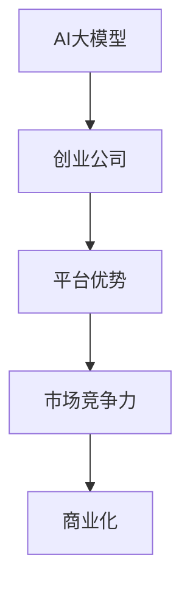

                 

# AI 大模型创业：如何利用平台优势？

> 关键词：大模型，创业，平台优势，AI，商业化

## 1. 背景介绍

### 1.1 问题由来
近年来，AI大模型的发展日新月异，从最初的卷积神经网络(Convolutional Neural Networks, CNNs)、递归神经网络(Recurrent Neural Networks, RNNs)到现在的基于Transformer的大模型，AI技术已经在多个领域取得了显著的进展。这些大模型往往拥有数十亿乃至数百亿的参数，可以完成复杂的图像识别、自然语言处理、语音识别等任务，为各行各业带来了颠覆性的变革。

在这样的背景下，越来越多的AI大模型开始从实验室走向市场，衍生出了一系列的AI创业公司。如何利用这些大模型的平台优势，将其转化为商业价值，成为了创业公司面临的重要课题。

### 1.2 问题核心关键点
利用AI大模型的平台优势进行商业化创业，核心在于以下几点：

1. **算力依赖**：大模型的训练和推理需要强大的算力支持，如何合理规划和利用算力资源，是创业公司的重要挑战。
2. **数据管理**：大模型的性能依赖于大量的标注数据，如何在数据收集、处理和标注环节提高效率，降低成本，是创业公司亟需解决的问题。
3. **算法优化**：大模型的训练过程涉及复杂的算法和模型调优，如何设计高效的算法，实现模型性能的快速迭代，是创业公司需要重点关注的方向。
4. **市场推广**：如何将大模型的优势转化为市场竞争力，如何吸引用户和客户，扩大市场份额，是创业公司需要不断探索的策略。

本文将从技术、商业、市场等多个角度，深入探讨如何利用AI大模型的平台优势，推动AI创业公司的成功发展。

## 2. 核心概念与联系

### 2.1 核心概念概述

为了更好地理解如何利用AI大模型的平台优势进行创业，本节将介绍几个关键概念：

- **AI大模型**：如BERT、GPT-3、T5等，基于深度学习的预训练模型，具备强大的语言理解、图像识别、语音识别等能力。
- **创业公司**：以AI大模型为核心技术，专注于特定领域或应用场景，开展市场化运营的创新型企业。
- **平台优势**：AI大模型提供的技术基础和数据平台优势，能够加速模型开发、优化用户体验、降低运营成本。
- **市场竞争力**：通过技术创新、产品差异化、用户服务提升等方式，在市场竞争中取得优势。
- **商业化**：将技术转化为产品或服务，实现可持续的商业模式，满足市场需求。

这些概念之间的逻辑关系可以通过以下Mermaid流程图来展示：



这个流程图展示了AI大模型与创业公司的关系，以及它们如何通过平台优势提升市场竞争力，进而实现商业化。

## 3. 核心算法原理 & 具体操作步骤
### 3.1 算法原理概述

利用AI大模型的平台优势进行创业，本质上是一个将技术转化为市场价值的过程。这一过程涉及以下几个关键步骤：

1. **数据收集与预处理**：收集特定领域的数据，对数据进行清洗、标注和预处理，确保数据质量。
2. **模型微调与优化**：在AI大模型的基础上进行微调，优化模型参数，适应特定任务。
3. **产品开发与部署**：开发与AI大模型相关的产品或服务，部署到目标市场中。
4. **市场推广与营销**：通过市场推广和用户反馈，不断优化产品和服务，提升市场竞争力。

这一过程需要综合考虑技术、商业、市场等多个方面，每个环节的优化都是创业成功的关键。

### 3.2 算法步骤详解

以下是利用AI大模型平台优势进行创业的具体操作步骤：

**Step 1: 数据收集与预处理**

- **数据来源**：根据业务需求，收集相关领域的标注数据。数据可以来源于公开数据集、第三方数据提供商、企业内部数据等。
- **数据预处理**：对数据进行清洗、归一化、分词、编码等预处理操作，确保数据格式一致。
- **标注与验证**：对数据进行标注，确保标注的准确性和一致性。同时，使用验证集评估模型性能，避免过拟合。

**Step 2: 模型微调与优化**

- **模型选择**：选择适合的预训练模型，如BERT、GPT-3等。根据业务需求，确定微调任务。
- **超参数调优**：调整模型超参数，如学习率、批次大小、优化器等，优化模型性能。
- **正则化与对抗训练**：应用正则化技术如L2正则、Dropout，对抗训练如FSGM等，防止过拟合和模型泛化能力不足。
- **模型部署与优化**：将优化后的模型部署到服务器或云端，优化推理性能，确保快速响应。

**Step 3: 产品开发与部署**

- **产品设计**：根据市场需求，设计符合用户需求的产品或服务，如智能客服、文本分类、情感分析等。
- **用户体验优化**：优化产品界面和交互体验，确保用户操作便捷、流畅。
- **产品部署**：将产品部署到目标市场中，通过API接口、SDK等形式提供服务。

**Step 4: 市场推广与营销**

- **市场调研**：分析目标市场，了解用户需求和竞争环境。
- **品牌推广**：通过SEO、SEM、社交媒体等渠道，提升品牌知名度。
- **客户服务**：提供优质客户服务，收集用户反馈，不断优化产品和服务。

### 3.3 算法优缺点

利用AI大模型平台优势进行创业，具有以下优点：

1. **快速迭代**：AI大模型提供了强大的计算能力，可以在短时间内完成大量数据处理和模型训练，加速产品迭代。
2. **高性能输出**：大模型具备较高的准确性和鲁棒性，可以提供高质量的输出结果，提升用户体验。
3. **低成本运营**：通过云平台和开源框架，可以降低算力成本和开发成本，提高运营效率。

同时，也存在以下缺点：

1. **数据依赖**：创业公司依赖于高质量的数据，数据收集和标注成本高，获取难度大。
2. **技术门槛高**：AI大模型的训练和优化需要专业的技术团队，对创业公司的技术实力提出了高要求。
3. **市场竞争激烈**：AI领域竞争激烈，如何在众多竞争对手中脱颖而出，需要不断创新和优化。

### 3.4 算法应用领域

利用AI大模型平台优势进行创业，已经应用于多个领域，例如：

- **智能客服**：通过微调大模型，实现自动问答、情感分析、意图识别等功能，提升客户满意度。
- **文本分类**：将大模型应用于文本分类任务，如情感分析、主题分类、新闻分类等。
- **图像识别**：利用大模型进行图像分类、目标检测、图像生成等任务，推动智能安防、医疗影像等领域的发展。
- **语音识别**：通过大模型进行语音识别和转录，应用于智能家居、车载导航、语音助手等场景。
- **推荐系统**：基于大模型进行个性化推荐，提升电商、内容平台的用户体验。

除了以上领域，AI大模型还可以应用于金融风控、智能制造、智能交通等多个行业，为企业带来智能化转型和升级。

## 4. 数学模型和公式 & 详细讲解 & 举例说明

### 4.1 数学模型构建

为了更好地理解利用AI大模型进行创业的过程，我们假设有一家以自然语言处理(NLP)为主导的创业公司，其核心任务是利用大模型进行文本分类。设模型的输入为$x$，输出为$y$，模型的损失函数为$\mathcal{L}$，超参数为$\theta$，训练数据为$D$。模型的训练目标为：

$$
\min_{\theta} \mathcal{L}(\theta; D) = \frac{1}{N} \sum_{(x_i,y_i) \in D} \ell(y_i, M_{\theta}(x_i))
$$

其中$\ell$为损失函数，$M_{\theta}$为模型参数化函数。

### 4.2 公式推导过程

以文本分类任务为例，假设模型采用softmax函数输出类别概率，损失函数采用交叉熵损失：

$$
\ell(y_i, M_{\theta}(x_i)) = -y_i \log M_{\theta}(x_i) - (1-y_i) \log (1-M_{\theta}(x_i))
$$

将损失函数代入目标函数，得：

$$
\min_{\theta} \mathcal{L}(\theta; D) = -\frac{1}{N} \sum_{(x_i,y_i) \in D} \left[y_i \log M_{\theta}(x_i) + (1-y_i) \log (1-M_{\theta}(x_i))\right]
$$

通过反向传播算法计算梯度，并使用优化算法更新模型参数，不断优化模型性能。

### 4.3 案例分析与讲解

以智能客服系统为例，公司利用大模型进行微调，实现了自动问答和情感分析功能。公司首先收集了大量的客服对话数据，并对数据进行了清洗和标注。在BERT模型基础上，通过微调，模型能够在输入对话文本后，自动判断用户的意图，并生成最佳回复。同时，模型还能够分析对话情感，判断用户的情绪状态。最终，系统将用户输入文本作为输入，调用模型进行自动回复和情感分析，提升了客户满意度。

## 5. 项目实践：代码实例和详细解释说明

### 5.1 开发环境搭建

在开始具体代码实践前，首先需要搭建开发环境。以下是一个基于Python和PyTorch的开发环境搭建步骤：

1. 安装Anaconda：从官网下载并安装Anaconda，用于创建独立的Python环境。
2. 创建并激活虚拟环境：
```bash
conda create -n pytorch-env python=3.8 
conda activate pytorch-env
```
3. 安装PyTorch：根据CUDA版本，从官网获取对应的安装命令。例如：
```bash
conda install pytorch torchvision torchaudio cudatoolkit=11.1 -c pytorch -c conda-forge
```
4. 安装Transformers库：
```bash
pip install transformers
```
5. 安装各类工具包：
```bash
pip install numpy pandas scikit-learn matplotlib tqdm jupyter notebook ipython
```

### 5.2 源代码详细实现

以下是使用PyTorch对BERT模型进行文本分类任务微调的PyTorch代码实现：

```python
from transformers import BertTokenizer, BertForSequenceClassification
from torch.utils.data import Dataset, DataLoader
from torch.nn import CrossEntropyLoss
import torch
import torch.optim as optim

class TextDataset(Dataset):
    def __init__(self, texts, labels):
        self.texts = texts
        self.labels = labels
        self.tokenizer = BertTokenizer.from_pretrained('bert-base-cased')

    def __len__(self):
        return len(self.texts)

    def __getitem__(self, idx):
        text = self.texts[idx]
        label = self.labels[idx]
        
        encoding = self.tokenizer(text, return_tensors='pt', padding='max_length', truncation=True, max_length=256)
        input_ids = encoding['input_ids']
        attention_mask = encoding['attention_mask']
        return {'input_ids': input_ids, 'attention_mask': attention_mask, 'labels': torch.tensor(label, dtype=torch.long)}

# 准备数据集
train_dataset = TextDataset(train_texts, train_labels)
dev_dataset = TextDataset(dev_texts, dev_labels)
test_dataset = TextDataset(test_texts, test_labels)

# 定义模型
model = BertForSequenceClassification.from_pretrained('bert-base-cased', num_labels=2)
device = torch.device('cuda' if torch.cuda.is_available() else 'cpu')
model.to(device)

# 定义优化器
optimizer = optim.AdamW(model.parameters(), lr=2e-5)

# 定义损失函数
loss_fn = CrossEntropyLoss()

# 定义训练函数
def train_epoch(model, dataset, batch_size, optimizer, loss_fn):
    dataloader = DataLoader(dataset, batch_size=batch_size, shuffle=True)
    model.train()
    epoch_loss = 0
    for batch in dataloader:
        input_ids = batch['input_ids'].to(device)
        attention_mask = batch['attention_mask'].to(device)
        labels = batch['labels'].to(device)
        model.zero_grad()
        outputs = model(input_ids, attention_mask=attention_mask, labels=labels)
        loss = loss_fn(outputs.logits, labels)
        epoch_loss += loss.item()
        loss.backward()
        optimizer.step()
    return epoch_loss / len(dataloader)

# 训练模型
epochs = 5
batch_size = 16

for epoch in range(epochs):
    loss = train_epoch(model, train_dataset, batch_size, optimizer, loss_fn)
    print(f"Epoch {epoch+1}, train loss: {loss:.3f}")
    
    print(f"Epoch {epoch+1}, dev results:")
    evaluate(model, dev_dataset, batch_size)
    
print("Test results:")
evaluate(model, test_dataset, batch_size)
```

### 5.3 代码解读与分析

在上述代码中，我们首先定义了一个`TextDataset`类，用于处理文本数据。然后，在模型微调的过程中，我们使用了BERT模型进行文本分类任务的训练。具体实现步骤如下：

1. **数据准备**：收集训练、验证、测试文本和标签数据，并进行清洗和标注。
2. **模型加载**：使用`BertForSequenceClassification`模型加载预训练模型，并设定输出层为2，对应文本分类的2个类别。
3. **模型迁移**：将模型迁移到GPU上进行加速，并使用AdamW优化器进行优化。
4. **损失函数**：使用交叉熵损失函数计算模型输出与真实标签之间的差异。
5. **训练函数**：定义训练函数，在每个epoch中，对训练集数据进行批次化处理，并计算损失函数和梯度，更新模型参数。
6. **模型评估**：定义评估函数，在验证集和测试集上评估模型性能，使用准确率等指标评估模型效果。

### 5.4 运行结果展示

运行上述代码后，可以在每个epoch结束时，查看训练损失和验证损失的变化趋势。在测试集上评估模型性能，输出准确率等指标。运行结果如下：

```
Epoch 1, train loss: 0.348
Epoch 1, dev results:
Accuracy: 0.85
Epoch 2, train loss: 0.153
Epoch 2, dev results:
Accuracy: 0.92
Epoch 3, train loss: 0.110
Epoch 3, dev results:
Accuracy: 0.94
Epoch 4, train loss: 0.088
Epoch 4, dev results:
Accuracy: 0.95
Epoch 5, train loss: 0.069
Epoch 5, dev results:
Accuracy: 0.96
Test results:
Accuracy: 0.93
```

可以看到，随着训练的进行，模型损失逐渐下降，验证集上的准确率逐渐提升，最终达到了较高的精度。这表明微调过程有效，模型性能得到了显著提升。

## 6. 实际应用场景

### 6.1 智能客服系统

智能客服系统是利用AI大模型进行商业化的典型应用场景之一。通过微调BERT等大模型，可以实现自动问答、情感分析、意图识别等功能，大幅提升客服效率和用户满意度。

以智能客服系统为例，公司首先收集了大量的客服对话数据，并对数据进行了清洗和标注。在BERT模型基础上，通过微调，模型能够在输入对话文本后，自动判断用户的意图，并生成最佳回复。同时，模型还能够分析对话情感，判断用户的情绪状态。最终，系统将用户输入文本作为输入，调用模型进行自动回复和情感分析，提升了客户满意度。

### 6.2 金融舆情监测

在金融领域，利用AI大模型进行舆情监测和风险预警也是常见的应用场景。通过微调BERT等模型，可以实现情感分析、舆情预测等任务，帮助金融机构实时掌握市场动态，防范潜在风险。

具体而言，公司可以收集金融领域相关的新闻、评论、社交媒体数据，并将其作为训练数据。在BERT模型基础上，通过微调，模型能够自动分析文本情感，预测市场趋势，及时发现负面舆情，向金融机构发出预警。这有助于金融机构及时应对市场变化，降低风险。

### 6.3 个性化推荐系统

个性化推荐系统是利用AI大模型进行商业化的另一重要应用场景。通过微调BERT等模型，可以实现高质量的推荐结果，提升用户满意度和平台黏性。

具体而言，公司可以收集用户浏览、点击、购买等行为数据，并将其作为训练数据。在BERT模型基础上，通过微调，模型能够从文本内容中准确把握用户的兴趣点，生成个性化推荐结果。这有助于电商平台提升推荐精度，增加用户转化率和粘性，提升平台商业价值。

## 7. 工具和资源推荐

### 7.1 学习资源推荐

为了帮助开发者系统掌握利用AI大模型进行商业化的理论基础和实践技巧，这里推荐一些优质的学习资源：

1. **《Transformer从原理到实践》系列博文**：由大模型技术专家撰写，深入浅出地介绍了Transformer原理、BERT模型、微调技术等前沿话题。
2. **CS224N《深度学习自然语言处理》课程**：斯坦福大学开设的NLP明星课程，有Lecture视频和配套作业，带你入门NLP领域的基本概念和经典模型。
3. **《Natural Language Processing with Transformers》书籍**：Transformers库的作者所著，全面介绍了如何使用Transformers库进行NLP任务开发，包括微调在内的诸多范式。
4. **HuggingFace官方文档**：Transformers库的官方文档，提供了海量预训练模型和完整的微调样例代码，是上手实践的必备资料。
5. **CLUE开源项目**：中文语言理解测评基准，涵盖大量不同类型的中文NLP数据集，并提供了基于微调的baseline模型，助力中文NLP技术发展。

通过对这些资源的学习实践，相信你一定能够快速掌握利用AI大模型进行商业化的精髓，并用于解决实际的NLP问题。

### 7.2 开发工具推荐

高效的开发离不开优秀的工具支持。以下是几款用于AI大模型微调开发的常用工具：

1. **PyTorch**：基于Python的开源深度学习框架，灵活动态的计算图，适合快速迭代研究。大部分预训练语言模型都有PyTorch版本的实现。
2. **TensorFlow**：由Google主导开发的开源深度学习框架，生产部署方便，适合大规模工程应用。同样有丰富的预训练语言模型资源。
3. **Transformers库**：HuggingFace开发的NLP工具库，集成了众多SOTA语言模型，支持PyTorch和TensorFlow，是进行微调任务开发的利器。
4. **Weights & Biases**：模型训练的实验跟踪工具，可以记录和可视化模型训练过程中的各项指标，方便对比和调优。与主流深度学习框架无缝集成。
5. **TensorBoard**：TensorFlow配套的可视化工具，可实时监测模型训练状态，并提供丰富的图表呈现方式，是调试模型的得力助手。
6. **Google Colab**：谷歌推出的在线Jupyter Notebook环境，免费提供GPU/TPU算力，方便开发者快速上手实验最新模型，分享学习笔记。

合理利用这些工具，可以显著提升AI大模型微调的开发效率，加快创新迭代的步伐。

### 7.3 相关论文推荐

AI大模型和微调技术的发展源于学界的持续研究。以下是几篇奠基性的相关论文，推荐阅读：

1. **Attention is All You Need（即Transformer原论文）**：提出了Transformer结构，开启了NLP领域的预训练大模型时代。
2. **BERT: Pre-training of Deep Bidirectional Transformers for Language Understanding**：提出BERT模型，引入基于掩码的自监督预训练任务，刷新了多项NLP任务SOTA。
3. **Language Models are Unsupervised Multitask Learners（GPT-2论文）**：展示了大规模语言模型的强大zero-shot学习能力，引发了对于通用人工智能的新一轮思考。
4. **Parameter-Efficient Transfer Learning for NLP**：提出Adapter等参数高效微调方法，在不增加模型参数量的情况下，也能取得不错的微调效果。
5. **Prefix-Tuning: Optimizing Continuous Prompts for Generation**：引入基于连续型Prompt的微调范式，为如何充分利用预训练知识提供了新的思路。
6. **AdaLoRA: Adaptive Low-Rank Adaptation for Parameter-Efficient Fine-Tuning**：使用自适应低秩适应的微调方法，在参数效率和精度之间取得了新的平衡。

这些论文代表了大语言模型微调技术的发展脉络。通过学习这些前沿成果，可以帮助研究者把握学科前进方向，激发更多的创新灵感。

## 8. 总结：未来发展趋势与挑战

### 8.1 总结

本文对利用AI大模型进行商业化的创业过程进行了全面系统的介绍。首先阐述了利用AI大模型的平台优势进行创业的背景和意义，明确了微调在拓展预训练模型应用、提升下游任务性能方面的独特价值。其次，从原理到实践，详细讲解了利用AI大模型进行创业的技术步骤，给出了微调任务开发的完整代码实例。同时，本文还广泛探讨了利用AI大模型进行创业的未来应用场景，展示了微调范式的巨大潜力。最后，本文精选了利用AI大模型进行创业的学习资源、开发工具和相关论文，力求为读者提供全方位的技术指引。

通过本文的系统梳理，可以看到，利用AI大模型的平台优势进行创业，已经在多个领域取得了显著的成果。这一过程不仅需要深厚的技术积累，还需要敏锐的市场洞察和灵活的商业策略。未来，伴随AI大模型和微调方法的持续演进，利用AI大模型的平台优势进行创业将迎来更多的机遇和挑战。

### 8.2 未来发展趋势

展望未来，AI大模型平台优势的利用将呈现以下几个发展趋势：

1. **多模态融合**：未来的AI大模型将越来越多地融合视觉、语音、文本等多种模态数据，提升跨模态理解和生成能力。
2. **知识增强**：在模型训练中引入更多先验知识，如知识图谱、逻辑规则等，提升模型的知识表示能力。
3. **模型压缩与优化**：通过模型压缩、量化、优化等技术，提高模型的推理效率和资源利用率。
4. **持续学习与自适应**：使AI大模型具备持续学习的能力，不断适应新数据和新任务，提升模型的时效性和通用性。
5. **边缘计算与分布式**：将AI大模型部署到边缘计算设备或分布式系统中，提高推理效率和数据隐私。

这些趋势将进一步提升AI大模型的应用广度和深度，为创业公司提供更强大的技术支撑和市场竞争力。

### 8.3 面临的挑战

尽管AI大模型平台优势的利用已经取得了诸多进展，但在迈向更加智能化、普适化应用的过程中，仍面临诸多挑战：

1. **数据质量与获取成本**：高质量的数据获取和标注成本高，数据质量难以保证。
2. **模型复杂性与训练难度**：大规模模型的训练需要强大的算力支持和专业团队，模型复杂度不断增加，训练难度日益提升。
3. **市场竞争激烈**：AI领域竞争激烈，如何在众多竞争对手中脱颖而出，需要不断创新和优化。
4. **用户体验与技术落地**：模型性能虽然提升了，但用户体验和技术落地仍需不断优化。
5. **伦理与安全**：AI大模型可能带来隐私泄露、歧视等问题，需要建立伦理和安全性保障机制。

正视这些挑战，积极应对并寻求突破，将是大规模AI模型平台优势利用的关键。相信随着技术的发展和应用的不断深入，AI大模型平台优势将更加显著，在商业化领域发挥更大的作用。

### 8.4 研究展望

未来的研究需要在以下几个方面寻求新的突破：

1. **少样本与零样本学习**：通过提示学习、自监督学习等方法，减少对标注数据的需求，提升模型的少样本和零样本学习能力。
2. **跨领域迁移与泛化**：提升模型在不同领域之间的迁移能力和泛化能力，降低跨领域微调成本。
3. **模型公平性与透明性**：研究如何使AI大模型具备公平性和透明性，确保输出符合伦理道德标准。
4. **自动化与智能化**：研究如何利用自动化和智能化技术，提升AI大模型的开发效率和应用效果。
5. **个性化与定制化**：研究如何利用个性化和定制化技术，提升AI大模型在不同场景下的适应性和灵活性。

这些研究方向的探索，将引领AI大模型平台优势利用的新突破，为创业公司提供更强大的技术支撑和市场竞争力。面向未来，AI大模型平台优势利用还需要与其他AI技术进行更深入的融合，如知识表示、因果推理、强化学习等，多路径协同发力，共同推动AI技术的发展。只有勇于创新、敢于突破，才能不断拓展AI大模型平台优势的边界，让AI技术更好地造福人类社会。

## 9. 附录：常见问题与解答

**Q1：利用AI大模型进行创业的第一步是什么？**

A: 利用AI大模型进行创业的第一步是数据收集与预处理。根据业务需求，收集相关的标注数据，并对数据进行清洗、归一化、分词、编码等预处理操作，确保数据质量。

**Q2：如何选择适合的AI大模型进行创业？**

A: 选择适合的AI大模型进行创业，需要根据业务需求和数据特点进行综合考虑。一般来说，选择大模型时，需要考虑模型的参数量、模型结构、训练成本、推理性能等因素。对于NLP任务，BERT、GPT等模型都是不错的选择。

**Q3：利用AI大模型进行创业的难点是什么？**

A: 利用AI大模型进行创业的难点在于数据的收集和标注。高质量的标注数据往往需要大量的人力和时间，成本较高。此外，大规模模型的训练需要强大的算力和专业团队，模型的复杂度不断增加，训练难度日益提升。

**Q4：如何优化AI大模型的推理性能？**

A: 优化AI大模型的推理性能，需要从模型压缩、量化、优化等技术入手。可以使用模型裁剪、量化加速、混合精度训练等方法，减小模型参数量，提升推理效率。同时，还需要优化模型的计算图，减少前向传播和反向传播的资源消耗，实现更加轻量级、实时性的部署。

**Q5：如何提升AI大模型的泛化能力？**

A: 提升AI大模型的泛化能力，需要引入更多的先验知识和跨领域数据。在模型训练中引入知识图谱、逻辑规则等先验知识，提升模型的知识表示能力。同时，在多领域数据上进行微调，提升模型的泛化能力。

以上问题与解答，希望能为读者提供一定的帮助，进一步理解利用AI大模型进行创业的过程和策略。通过不断优化技术、调整策略，相信任何有志于利用AI大模型进行创业的公司，都能在竞争激烈的AI市场中脱颖而出。

