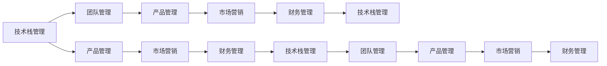

                 

## 1. 背景介绍

### 1.1 问题由来

近年来，人工智能（AI）技术迅速崛起，尤其在深度学习和大模型的推动下，取得了令人瞩目的成果。这些技术在图像识别、自然语言处理、语音识别等多个领域展示了其强大的能力，吸引了大量投资和人才的关注。大模型的应用场景包括但不限于：智能推荐系统、自动驾驶、智能客服、金融风控等。然而，尽管技术能力强大，但要真正将大模型落地应用并实现商业化，管理优势是不可或缺的一环。本文将从管理角度出发，探讨如何利用管理优势，推动AI大模型的创业成功。

### 1.2 问题核心关键点

对于AI大模型的创业公司而言，要想成功，必须解决以下几个核心问题：

- **数据和算法**：如何获取高质量数据，优化算法模型以适应特定场景。
- **技术团队**：如何组建和培养一支高效的技术团队，保持技术领先。
- **产品化和市场**：如何将技术产品化，并推向市场，实现商业化落地。
- **运营管理**：如何保障产品稳定运行，管理用户需求，优化用户体验。
- **资本和投资**：如何筹集和有效使用资金，保障公司健康发展。

本文将深入探讨这些核心问题，从管理角度出发，提供可行的解决方案。

## 2. 核心概念与联系

### 2.1 核心概念概述

为更好地理解AI大模型创业的管理优势，本节将介绍几个关键管理概念：

- **技术栈管理**：对公司所使用的技术栈进行统一管理和优化，确保技术架构的稳定性和可扩展性。
- **团队管理**：通过合理分配团队成员的任务和角色，提高团队效率和协作性。
- **产品管理**：从需求收集、产品设计、开发部署到运营维护的全过程管理。
- **市场营销**：通过市场调研、品牌建设、用户获取、销售转化等手段，推动产品推广和销售。
- **财务管理**：对公司的财务状况进行监控和管理，确保资金运作的高效和安全。

这些管理概念相互联系，共同构成AI大模型创业的管理体系，其核心目标是通过高效管理和合理分配资源，实现公司的持续健康发展。

### 2.2 核心概念原理和架构的 Mermaid 流程图



这个流程图展示了管理概念之间的相互关系和作用机制。通过技术栈管理保障技术体系的稳定性和可扩展性，通过团队管理提升团队协作效率，通过产品管理确保产品设计、开发和运营的高效性，通过市场营销推动产品推广和销售，通过财务管理保障资金运作的安全性和高效性。

## 3. 核心算法原理 & 具体操作步骤

### 3.1 算法原理概述

在AI大模型的创业过程中，技术和管理是相辅相成的两个方面。技术提供产品能力，管理则保障产品稳定、高效地运转。以下是一些常用的管理算法和具体操作步骤：

- **敏捷开发（Agile Development）**：采用迭代开发和持续集成的方法，快速响应市场变化和技术进步，保持产品竞争力和创新性。
- **需求优先级管理（Prioritization Management）**：通过科学的需求评估方法，确定产品的优先级，合理分配资源，确保关键功能的快速交付。
- **用户反馈循环（Feedback Loop）**：建立用户反馈机制，收集用户意见和需求，快速迭代优化产品，提升用户体验和满意度。
- **风险管理（Risk Management）**：识别和评估项目中的风险，制定应对策略，确保项目按时交付，规避潜在问题。
- **技术债务管理（Technical Debt Management）**：合理处理技术债务，避免长期累积的技术问题和系统瓶颈，保障系统稳定性。

### 3.2 算法步骤详解

以下是一些常用的管理算法操作步骤：

1. **需求分析**：通过调研、访谈等方式，收集用户需求，明确产品功能目标。
2. **需求分解**：将用户需求分解成可执行的任务，分配给不同团队成员。
3. **需求优先级排序**：根据业务价值、开发难度、用户体验等因素，确定需求优先级。
4. **敏捷开发**：采用迭代和持续集成的方式，快速迭代产品，发布测试版，收集用户反馈。
5. **用户反馈分析**：对用户反馈进行分类和分析，确定问题原因和解决方案。
6. **版本控制**：建立代码版本控制机制，记录每次迭代和修改，确保版本管理有序。
7. **项目监控**：实时监控项目进展和风险，及时调整策略，确保项目按计划推进。
8. **技术债务管理**：定期评估技术债务，制定修复计划，避免技术债务累积。

### 3.3 算法优缺点

AI大模型创业中的管理算法有以下优点：

- **快速响应**：敏捷开发和持续集成可以快速响应市场和技术变化，保持产品竞争力。
- **高效资源分配**：需求优先级管理和用户反馈循环可以帮助合理分配资源，确保关键功能按时交付。
- **系统稳定性**：风险管理和技术债务管理可以保障系统稳定运行，避免潜在问题。

同时，这些管理算法也存在一些缺点：

- **管理复杂度**：管理算法涉及多个方面，管理复杂度较高，需要综合协调。
- **执行难度**：执行过程中需要跨团队协作，可能面临沟通和执行难度。
- **成本投入**：敏捷开发和持续集成等方法需要较高的技术和管理成本。

## 4. 数学模型和公式 & 详细讲解 & 举例说明

### 4.1 数学模型构建

在AI大模型创业中，管理算法的模型构建通常包括：

- **需求矩阵**：将需求按优先级排序，建立需求矩阵，计算每个需求的价值和成本。
- **风险评估模型**：建立风险评估模型，评估每个需求的风险程度和应对策略。
- **技术债务模型**：建立技术债务模型，计算技术债务的影响和修复成本。

### 4.2 公式推导过程

以下是一些常用公式的推导过程：

- **需求价值函数**：
  $$
  V_i = \text{用户满意度} \times \text{业务价值} \times \text{使用频率}
  $$
  其中，$V_i$ 为第 $i$ 个需求的价值。

- **需求成本函数**：
  $$
  C_i = \text{开发难度} \times \text{资源需求} \times \text{时间成本}
  $$
  其中，$C_i$ 为第 $i$ 个需求的成本。

- **需求优先级计算**：
  $$
  P_i = \frac{V_i}{C_i}
  $$
  其中，$P_i$ 为第 $i$ 个需求的优先级。

### 4.3 案例分析与讲解

以下是一个需求优先级管理的案例分析：

- **需求A**：用户请求增加某功能模块，用户满意度为85%，业务价值为10%，开发难度为3，资源需求为2人月，时间成本为3个月。
  
  根据公式，计算需求A的价值和成本：
  $$
  V_A = 85\% \times 10\% \times 100\% = 8.5
  $$
  $$
  C_A = 3 \times 2 \times 3 = 18
  $$
  计算需求A的优先级：
  $$
  P_A = \frac{V_A}{C_A} = \frac{8.5}{18} \approx 0.47
  $$
  需求A的优先级较高，应优先考虑其开发。

## 5. 项目实践：代码实例和详细解释说明

### 5.1 开发环境搭建

在进行AI大模型的项目实践中，首先需要搭建好开发环境。以下是一些常用的开发环境搭建步骤：

1. **安装开发工具**：安装Python、Jupyter Notebook、Git等常用开发工具。
2. **配置开发环境**：配置Python虚拟环境，安装必要的库和依赖。
3. **版本控制**：使用Git进行代码版本控制，建立分支管理机制。
4. **持续集成**：配置CI/CD工具，如Jenkins、Travis CI等，自动构建和测试代码。

### 5.2 源代码详细实现

以下是一些常用的源代码实现示例：

```python
# 需求矩阵
requirements = {
    'A': {'value': 8.5, 'cost': 18},
    'B': {'value': 7.0, 'cost': 15},
    'C': {'value': 9.0, 'cost': 20},
    ...
}

# 需求优先级排序
priorities = {}
for requirement in requirements:
    priorities[requirement] = requirements[requirement]['value'] / requirements[requirement]['cost']
    
# 选择优先级最高的需求
top_priority = max(priorities, key=priorities.get)
```

### 5.3 代码解读与分析

在上述代码中，我们首先定义了一个需求矩阵，包含每个需求的价值和成本。然后，根据公式计算每个需求的优先级，最终选择优先级最高的需求进行开发。

## 6. 实际应用场景

### 6.1 智能推荐系统

在智能推荐系统中，管理算法可以显著提升推荐效果和用户体验。通过需求优先级管理，可以确保推荐系统快速响应用户需求，提升推荐准确性和多样性。

### 6.2 智能客服系统

智能客服系统需要实时响应用户的咨询和问题，管理算法可以帮助识别和分配客服任务，优化客服流程，提升用户满意度。

### 6.3 智能风控系统

在金融风控系统中，管理算法可以实时监控交易风险，识别异常行为，及时预警和应对潜在风险，保障资金安全。

### 6.4 未来应用展望

未来，管理算法将在更多AI大模型的应用场景中发挥重要作用。通过科学的管理和高效的管理工具，AI大模型的创业公司将能更好地应对市场变化和技术挑战，实现快速响应和持续健康发展。

## 7. 工具和资源推荐

### 7.1 学习资源推荐

为了帮助AI大模型的创业者系统掌握管理优势，以下是一些优质的学习资源：

1. **《敏捷开发实践》**：介绍敏捷开发的理念和方法，帮助团队快速响应市场变化。
2. **《精益创业》**：讲述如何通过精益创业方法，快速验证产品需求和商业模式。
3. **《需求管理：如何最大化产品价值》**：详细介绍需求管理的方法和工具，帮助优化需求优先级。
4. **《技术债务管理：避免技术问题的积累》**：介绍如何有效管理技术债务，保持系统稳定性。
5. **《项目管理：理论与实践》**：提供全面的项目管理知识和案例，帮助制定和执行项目管理计划。

通过这些资源的学习和实践，相信创业者能更好地掌握管理优势，推动AI大模型的成功创业。

### 7.2 开发工具推荐

以下是一些常用的开发工具，帮助提升AI大模型项目的管理效率：

1. **Git**：版本控制系统，支持代码版本管理和分支管理。
2. **Jenkins**：持续集成工具，支持自动化构建、测试和部署。
3. **JIRA**：项目管理工具，支持需求管理、任务分配和进度跟踪。
4. **Confluence**：知识管理工具，支持文档共享和协作。
5. **Slack**：即时通讯工具，支持团队沟通和协作。

合理利用这些工具，可以显著提升AI大模型项目的管理效率，保障项目的顺利推进。

### 7.3 相关论文推荐

以下是几篇关于AI大模型管理的经典论文，推荐阅读：

1. **《敏捷软件开发：原则、模式和实践》**：介绍敏捷开发的理念和方法，帮助提升团队效率和响应速度。
2. **《精益创业：建立和领导革命》**：讲述如何通过精益创业方法，快速验证和迭代产品。
3. **《需求优先级管理：基于价值与成本的决策》**：详细介绍需求优先级管理的算法和模型。
4. **《技术债务管理：识别和消除技术问题的策略》**：介绍如何有效管理技术债务，避免系统问题积累。
5. **《项目管理：理论与实践》**：提供全面的项目管理知识和案例，帮助制定和执行项目管理计划。

这些论文代表了大模型管理的研究前沿，通过学习这些前沿成果，可以帮助创业者更好地把握管理优势，推动AI大模型的成功创业。

## 8. 总结：未来发展趋势与挑战

### 8.1 研究成果总结

本文从管理角度出发，探讨了AI大模型的创业成功之道。通过科学的管理算法和工具，创业者可以有效应对市场和技术变化，提升产品竞争力和用户体验，实现快速响应和持续健康发展。

### 8.2 未来发展趋势

未来，AI大模型的管理将呈现以下几个发展趋势：

1. **数据驱动管理**：通过数据分析和挖掘，优化管理决策，提升管理效率和效果。
2. **自动化管理**：利用AI和大数据技术，实现自动化管理，减少人工干预和错误。
3. **协同管理**：通过跨团队协作和沟通，实现信息共享和协同工作，提升管理效率。
4. **可视化管理**：利用数据可视化工具，实时监控和管理系统状态，提升管理可视化和透明性。
5. **可持续管理**：通过可持续发展管理，实现资源的有效利用和环境的保护，保障公司的长期发展。

这些趋势展示了AI大模型管理的前景和方向，为未来管理提供了新的思路和方法。

### 8.3 面临的挑战

尽管管理算法和工具在AI大模型创业中发挥了重要作用，但仍面临诸多挑战：

1. **管理复杂度**：AI大模型涉及多学科和多技术栈，管理复杂度较高。
2. **资源限制**：小型创业公司可能面临资源有限的问题，管理难度较大。
3. **团队协作**：跨团队协作和管理需要高效沟通和协同机制，存在一定挑战。
4. **市场变化**：市场需求和技术变化快速，需要快速响应和调整。
5. **风险管理**：管理过程中存在潜在风险，需要科学评估和应对。

这些挑战需要创业者在管理过程中不断优化和改进，确保公司的健康发展。

### 8.4 研究展望

未来，AI大模型的管理需要结合更多前沿技术，如AI和大数据，进一步提升管理效率和效果。同时，通过科学的方法和工具，更好地应对市场和技术变化，推动AI大模型的成功创业和健康发展。

## 9. 附录：常见问题与解答

**Q1: 大模型管理与小模型管理有何不同？**

A: 大模型管理相较于小模型管理更为复杂，涉及技术栈管理、团队协作、产品部署等多个方面。同时，大模型管理需要更高效的数据驱动和自动化工具，以应对数据量和复杂度的挑战。

**Q2: 如何衡量管理算法的有效性？**

A: 管理算法的有效性可以通过多个指标衡量，如项目按时交付率、需求优先级准确度、用户满意度、系统稳定性等。通过定量和定性分析，可以评估管理算法的实际效果。

**Q3: 如何选择管理算法？**

A: 管理算法的选择需要综合考虑公司规模、产品特点、市场需求和技术栈等因素。小型创业公司应选择简单实用的管理算法，大公司则需要更复杂的管理工具和算法。

通过本文的深入探讨，希望能为AI大模型的创业者提供有价值的指导，帮助他们更好地应对管理挑战，推动AI大模型的成功创业和健康发展。

---

作者：禅与计算机程序设计艺术 / Zen and the Art of Computer Programming

