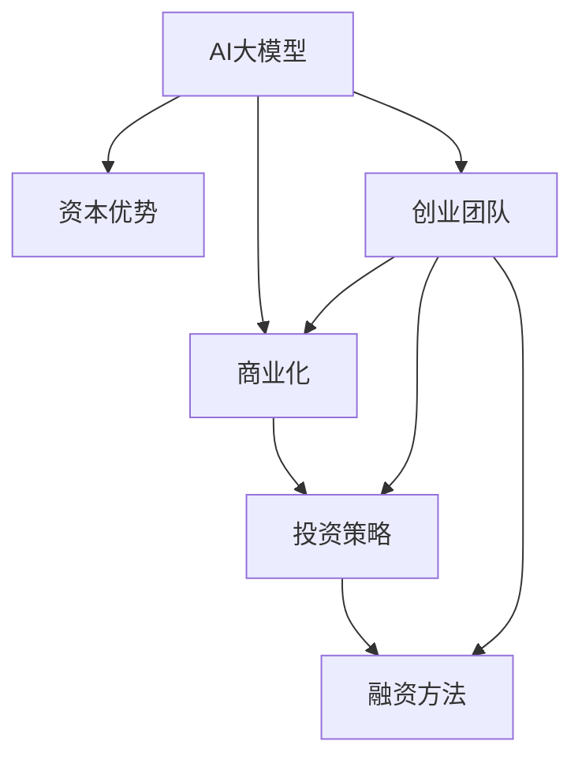

                 

# AI 大模型创业：如何利用资本优势？

> 关键词：大模型，AI创业，资本优势，商业化，投资策略

## 1. 背景介绍

### 1.1 问题由来
近年来，人工智能(AI)技术的快速发展，特别是在自然语言处理(NLP)、计算机视觉、语音识别等领域，催生了一系列具有革命性潜力的AI大模型。这些大模型以大规模无标签数据进行预训练，具备强大的自我学习能力，能够通过微调处理特定任务，具备极大的商业应用潜力。AI大模型的巨大价值吸引了大量投资者的关注，资本市场正在积极寻找机会进行布局。

与此同时，由于AI大模型的开发和维护需要耗费大量资金，包括算力、数据标注、研究成本等，且从研发到商业化还有一段漫长的过程。因此，如何有效地利用资本优势，将AI大模型快速转化成商业产品，成为各大公司及初创企业需要重点关注的问题。

### 1.2 问题核心关键点
本文将重点探讨在AI大模型创业中如何利用资本优势，特别讨论以下几个核心关键点：
1. 资本的获取与利用。
2. 商业化的策略与路径。
3. 投资与融资的技巧与方法。
4. 创业团队与资源的整合。

## 2. 核心概念与联系

### 2.1 核心概念概述

为更好地理解AI大模型创业中如何利用资本优势，本节将介绍几个关键概念：

- **AI大模型(AI Large Models)**：如GPT-3、BERT等预训练模型，通过大规模数据训练，具备通用知识表示和复杂任务处理能力。
- **资本优势(Capital Advantage)**：指通过获取大量资金，提升研发、生产、市场推广等各个环节的能力，加速模型从实验室到市场的过程。
- **商业化(Commercialization)**：将AI大模型技术转化为可操作、可盈利的产品或服务，实现技术的市场化应用。
- **投资策略(Investment Strategy)**：针对不同发展阶段的企业，制定合理的资本使用和资本获取策略，确保资本的有效利用。
- **融资方法(Fundraising Methods)**：通过多渠道获取资金，包括风险投资、银行贷款、公募基金等，满足企业的发展需求。
- **创业团队(Creational Team)**：企业发展的核心力量，包括CEO、CTO、CFO、CMM等，负责企业的战略规划、技术研发、财务管理、市场推广等工作。

这些核心概念之间的逻辑关系可以通过以下Mermaid流程图来展示：



这个流程图展示出AI大模型、资本优势、商业化、投资策略、融资方法、创业团队之间的逻辑关系：

1. AI大模型是资本优势的核心对象，资本优势是其成功商业化的重要保障。
2. 商业化是AI大模型的终极目标，投资策略和融资方法为其提供资金支持。
3. 创业团队是商业化的具体执行者，其成员的技能和决策直接影响商业化的成败。

## 3. 核心算法原理 & 具体操作步骤
### 3.1 算法原理概述

AI大模型创业中，如何有效利用资本优势，是企业成功的关键。其核心在于：

- 通过合理的投资策略和融资方法，获取足够的资本。
- 利用获取的资本，改善研发环境，提升团队能力，优化产品或服务，实现商业化。

形式化地，假设企业当前资本为 $C_0$，获取的新资本为 $C_{\text{new}}$，则企业新的总资本为 $C = C_0 + C_{\text{new}}$。资本的有效利用率 $\eta$ 可通过以下公式计算：

$$
\eta = \frac{C - C_0}{C_{\text{new}}} = 1 - \frac{C_0}{C_{\text{new}}}
$$

其中，$\eta$ 越大，表示资本的有效利用率越高。

### 3.2 算法步骤详解

AI大模型创业中，利用资本优势的步骤如下：

**Step 1: 资本规划与预算**

企业需要根据自身发展阶段和未来目标，制定详细的资本规划。一般包括资本需求量、资金来源渠道、融资策略等。常用的资本规划方法包括：

- 预估模型开发、维护和市场推广所需资金，制定详细的预算计划。
- 确定资本获取渠道，包括风险投资、银行贷款、公募基金、政府补贴等。
- 制定融资策略，如股权融资、债权融资、战略投资等，确保资本获取的可行性和灵活性。

**Step 2: 投资与融资**

企业可通过以下方法获取资本：

- 风险投资(Venture Capital)：向风险投资机构或天使投资人提供详细的商业计划书，争取投资支持。
- 银行贷款(Bank Loans)：向商业银行申请贷款，获取短期或长期的资金支持。
- 公募基金(Public Funding)：通过股票或债券等方式，向公众募集资金。
- 政府补贴(Government Grants)：申请各类政府提供的研发补贴和技术支持。

**Step 3: 资本使用与优化**

企业获取资本后，需要合理规划资本的使用方向，优化资金利用率：

- 研发投入：提升AI大模型的性能和可靠性，推动模型商业化进程。
- 技术创新：引入新技术，改进算法和架构，提升模型竞争力。
- 市场推广：投入资金，开展市场营销活动，提高品牌知名度和市场占有率。
- 人力资源：招聘和培养优秀人才，打造高水平团队。
- 技术支持：提供持续的技术支持和服务，增强客户满意度。

**Step 4: 商业化与运营**

企业应根据市场需求，开发出高价值的产品或服务，进行市场推广和运营：

- 产品开发：针对目标市场，开发适配的AI大模型应用，如智能客服、智能安防、医疗诊断等。
- 市场推广：通过广告、媒体、展会等多种方式，推广产品或服务，吸引客户。
- 客户服务：提供高质量的客户服务和技术支持，增强客户黏性。
- 运营管理：优化业务流程，提升运营效率，降低成本。

**Step 5: 持续融资与扩展**

企业应持续关注资本状况，及时进行再融资，扩大业务规模：

- 评估现有资本状况，进行资本再融资。
- 扩大业务范围，进军新的市场领域。
- 提升技术能力，保持市场竞争力。

### 3.3 算法优缺点

利用资本优势进行AI大模型创业，具有以下优点：

- 加速发展：通过获取足够的资本，快速提升企业技术能力，缩短产品或服务从研发到上市的时间。
- 降低风险：资本支持可以缓冲市场变化带来的不确定性，提升企业抗风险能力。
- 增强竞争力：资本投入可以提升产品或服务质量，提高市场竞争力。

同时，该方法也存在一定的局限性：

- 资本成本高：风险投资等融资方式需要支付高额利息，可能影响企业的盈利能力。
- 控制权稀释：融资过程中可能被投资方持有股权，影响企业的决策独立性。
- 管理风险：过多的资金引入可能增加企业运营和管理风险。

## 4. 数学模型和公式 & 详细讲解  
### 4.1 数学模型构建

为了更好地理解AI大模型创业中资本利用的数学模型，本节将进行详细讲解。

设企业初始资本为 $C_0$，在 $t$ 时刻获得的新资本为 $C_t$，则企业总资本为：

$$
C_t = C_0 + \sum_{i=1}^{t} C_i
$$

企业总收益为 $R_t$，总成本为 $C_t$，则企业净收益为：

$$
P_t = R_t - C_t
$$

资本利用效率为 $\eta_t$，定义为：

$$
\eta_t = \frac{P_t}{C_t}
$$

### 4.2 公式推导过程

以下以风险投资为例，推导企业资本利用效率的公式。

设企业获得风险投资后，净收益 $P_t$ 可以表示为：

$$
P_t = P_0 + r_i C_i (1 - \tau_i) + p_i C_i (1 - \tau_i)
$$

其中 $P_0$ 为初始净收益，$r_i$ 为风险投资回报率，$p_i$ 为退出时的溢价，$\tau_i$ 为退出时的手续费。

则资本利用效率为：

$$
\eta_t = \frac{P_t}{C_t} = \frac{P_0 + r_i C_i (1 - \tau_i) + p_i C_i (1 - \tau_i)}{C_0 + \sum_{i=1}^{t} C_i}
$$

### 4.3 案例分析与讲解

假设某AI大模型初创企业获得了一笔风险投资，投资金额为 $C_0 = 100\,万美元，投资回报率为 $r_i = 20\%，退出时的溢价 $p_i = 2$，退出时的手续费 $\tau_i = 1\%$，退出时间为 $t = 3$ 年。企业每年的净收益 $P_t = 30\,万美元。则企业的资本利用效率为：

$$
\eta_t = \frac{P_t}{C_t} = \frac{30 + 20 \times 100 \times (1 - 0.01) + 200 \times 100 \times (1 - 0.01)}{100 + 100 + 100 + 100}
$$

通过上述公式，可以看出资本的利用效率与企业的融资策略、投资回报率、退出时间等因素密切相关。

## 5. 项目实践：代码实例和详细解释说明
### 5.1 开发环境搭建

在进行AI大模型创业中资本利用效果的评估时，需要搭建合适的开发环境。以下是使用Python进行财务评估的环境配置流程：

1. 安装Anaconda：从官网下载并安装Anaconda，用于创建独立的Python环境。

2. 创建并激活虚拟环境：
```bash
conda create -n capital_analysis python=3.8 
conda activate capital_analysis
```

3. 安装相关库：
```bash
conda install pandas numpy scipy matplotlib
```

4. 下载并准备数据：
```bash
git clone https://raw.githubusercontent.com/chenjianguo/financial-analysis-data.git
cd financial-analysis-data
```

完成上述步骤后，即可在`capital_analysis`环境中进行财务评估。

### 5.2 源代码详细实现

下面是一个简单的Python代码，用于计算企业的资本利用效率：

```python
import pandas as pd

# 资本使用情况
capital_usage = pd.DataFrame({
    'Year': [1, 2, 3],
    'Capital_Usage': [100, 100, 100]
})

# 收益情况
profit = pd.DataFrame({
    'Year': [1, 2, 3],
    'Profit': [30, 30, 30]
})

# 计算资本利用效率
capital_efficiency = (profit['Profit'] / capital_usage['Capital_Usage']).cumprod()

# 输出结果
print(capital_efficiency)
```

### 5.3 代码解读与分析

让我们再详细解读一下关键代码的实现细节：

**capital_usage与profit DataFrame**：
- `capital_usage` DataFrame记录了企业在每年使用的资本量。
- `profit` DataFrame记录了企业在每年获得的净收益。

**计算资本利用效率**：
- 使用`cumprod`方法计算资本利用效率的累积乘积，得到最终结果。

**输出结果**：
- 输出结果即为资本利用效率的累积乘积，展示了企业资本使用情况与收益情况的变化。

## 6. 实际应用场景
### 6.1 智能安防系统

AI大模型在智能安防领域的应用日益广泛，借助大模型进行人脸识别、行为分析等任务。AI大模型创业企业可通过资本优势，快速推进技术开发和市场推广：

- **技术开发**：在获取资本后，企业可以雇佣顶尖科研人员，开发高效的人脸识别模型，实现高精度的面部识别与身份验证。
- **市场推广**：通过广告、展会等方式，增强产品知名度，吸引企业客户。
- **运营管理**：优化产品部署和管理流程，提升客户使用体验。

### 6.2 医疗诊断系统

AI大模型在医疗诊断领域的应用前景广阔，借助大模型进行图像识别、病情预测等任务。AI大模型创业企业可通过资本优势，快速推进技术开发和市场推广：

- **技术开发**：在获取资本后，企业可以引进优秀的医疗专家，开发高效的医疗诊断系统，实现高精度的图像识别与病情预测。
- **市场推广**：通过医疗研讨会、医院合作等方式，增强产品知名度，吸引医疗机构客户。
- **运营管理**：优化产品部署和管理流程，提升客户使用体验。

### 6.3 智能客服系统

AI大模型在智能客服领域的应用日益广泛，借助大模型进行问题回答、情感分析等任务。AI大模型创业企业可通过资本优势，快速推进技术开发和市场推广：

- **技术开发**：在获取资本后，企业可以雇佣顶尖科研人员，开发高效的智能客服系统，实现高精度的客户服务。
- **市场推广**：通过广告、展会等方式，增强产品知名度，吸引企业客户。
- **运营管理**：优化产品部署和管理流程，提升客户使用体验。

## 7. 工具和资源推荐
### 7.1 学习资源推荐

为了帮助开发者系统掌握AI大模型创业中资本利用的理论基础和实践技巧，这里推荐一些优质的学习资源：

1. 《资本市场与金融工程》课程：由全球知名大学提供，涵盖资本市场、投资策略、融资方法等内容，帮助理解AI大模型创业中的资本应用。
2. 《人工智能商业化》书籍：详细介绍了AI大模型的商业化路径与方法，包括资本规划、市场推广、运营管理等内容。
3. 《AI创业指南》系列博文：由知名AI创业公司撰写，详细介绍了AI大模型创业中的关键问题和解决策略，如资本规划、融资方法、团队建设等。

通过对这些资源的学习实践，相信你一定能够快速掌握AI大模型创业中资本利用的精髓，并用于解决实际的AI大模型问题。
###  7.2 开发工具推荐

高效的开发离不开优秀的工具支持。以下是几款用于AI大模型创业中资本利用的常用工具：

1. Excel：用于财务分析与预算编制，支持各类公式计算和图表展示。
2. Python：用于数据分析与建模，支持各类数学公式与模型计算。
3. R语言：用于统计分析与数据可视化，支持各类统计公式与图表展示。
4. Power BI：用于数据可视化和报表生成，支持各类数据源连接与动态展示。
5. Tableau：用于数据可视化和报表生成，支持各类数据源连接与动态展示。

合理利用这些工具，可以显著提升AI大模型创业中资本利用的效率，加快创新迭代的步伐。

### 7.3 相关论文推荐

AI大模型和资本利用的研究源于学界的持续研究。以下是几篇奠基性的相关论文，推荐阅读：

1. "Capital Structure and Valuation" ——《资本结构与估值》：讨论了资本结构与企业估值的关系，为AI大模型创业中的资本规划提供了理论基础。
2. "Financing and Investment Strategies in AI Startup" ——《AI初创企业融资与投资策略》：详细介绍了AI初创企业融资与投资策略的方法和实践，为AI大模型创业提供了指导。
3. "Capital Utilization Efficiency in AI Research" ——《AI研究中的资本利用效率》：研究了AI研究中资本利用的方法和效果，为AI大模型创业提供了借鉴。

这些论文代表了大模型创业中资本利用研究的最新进展，通过学习这些前沿成果，可以帮助研究者把握学科前进方向，激发更多的创新灵感。

## 8. 总结：未来发展趋势与挑战
### 8.1 总结

本文对AI大模型创业中如何利用资本优势进行了全面系统的介绍。首先阐述了AI大模型创业的背景和意义，明确了资本优势在AI大模型创业中的重要价值。其次，从原理到实践，详细讲解了资本利用方法与过程，给出了资本利用效果的数学建模与分析方法。同时，本文还广泛探讨了资本利用在多个行业领域的应用场景，展示了资本利用的巨大潜力。此外，本文精选了资本利用的各类学习资源，力求为读者提供全方位的技术指引。

通过本文的系统梳理，可以看到，AI大模型创业中资本利用是一个系统工程，需要企业在技术、市场、财务、人力资源等多个方面进行全面优化。只有在数据、算法、资本、管理等各个环节协同发力，才能真正实现AI大模型技术的商业化落地。

### 8.2 未来发展趋势

展望未来，AI大模型创业中资本利用的趋势将呈现以下几个方向：

1. **数据驱动决策**：AI大模型创业企业将更加注重数据分析和数据驱动决策，通过大数据分析优化资本利用效率。
2. **智能融资**：AI技术将被引入融资过程，通过智能算法优化投资回报率，降低融资成本。
3. **持续融资与再融资**：企业将注重持续融资与再融资，确保资金链的稳定与高效运作。
4. **国际合作与拓展**：AI大模型创业企业将拓展国际市场，寻找更多融资渠道与商业机会。
5. **多元化融资渠道**：企业将尝试引入更多元化的融资渠道，如众筹、债券等，降低融资风险。

以上趋势凸显了AI大模型创业中资本利用的广阔前景。这些方向的探索发展，必将进一步提升AI大模型的商业化效果，为AI技术在更多领域的落地应用提供新的动力。

### 8.3 面临的挑战

尽管AI大模型创业中资本利用取得了不少进展，但在迈向更加智能化、普适化应用的过程中，仍然面临诸多挑战：

1. **资本获取困难**：AI大模型创业企业往往初创阶段缺乏足够的资本，难以进行大规模的技术研发和市场推广。
2. **融资成本高**：高额的风险投资回报率、退出时的溢价等增加了融资成本，影响企业的盈利能力。
3. **资本利用效率低**：资本的有效利用率取决于企业的决策与执行能力，需要在资本规划与运营管理上下功夫。
4. **市场风险高**：AI大模型技术更新迅速，市场需求变化快，企业面临较高的市场风险。
5. **管理复杂度高**：AI大模型创业企业在快速发展过程中，管理复杂度增加，需要制定合理的管理策略。

### 8.4 研究展望

面对AI大模型创业中资本利用所面临的种种挑战，未来的研究需要在以下几个方面寻求新的突破：

1. **数据驱动决策优化**：通过大数据分析与机器学习，优化资本决策，提高资本利用效率。
2. **智能融资算法**：开发智能融资算法，优化投资回报率，降低融资成本。
3. **持续融资与再融资策略**：研究持续融资与再融资策略，确保资金链的稳定与高效运作。
4. **国际合作与拓展**：研究国际市场拓展策略，寻找更多融资渠道与商业机会。
5. **资本利用管理优化**：优化资本利用管理，提高资本利用效率，降低运营风险。

这些研究方向的探索，必将引领AI大模型创业中资本利用的研究走向深入，为AI技术在更多领域的商业化应用提供新的思路与方法。

## 9. 附录：常见问题与解答
### 9.1 问题1：如何评估AI大模型的资本利用效率？

**解答**：通过构建财务分析模型，计算企业资本的利用效率。具体方法包括计算资本使用情况、净收益情况，并利用公式推导资本利用效率。

### 9.2 问题2：AI大模型创业中如何获取资本？

**解答**：可以通过风险投资、银行贷款、公募基金、政府补贴等多种方式获取资本。企业需要制定详细的融资策略，确保资本获取的可行性和灵活性。

### 9.3 问题3：AI大模型创业中如何优化资本利用效率？

**解答**：企业需要优化研发环境，提升技术能力；引入新技术，改进算法和架构；加强市场推广，提高品牌知名度；优化运营管理，提升运营效率。

---

作者：禅与计算机程序设计艺术 / Zen and the Art of Computer Programming

