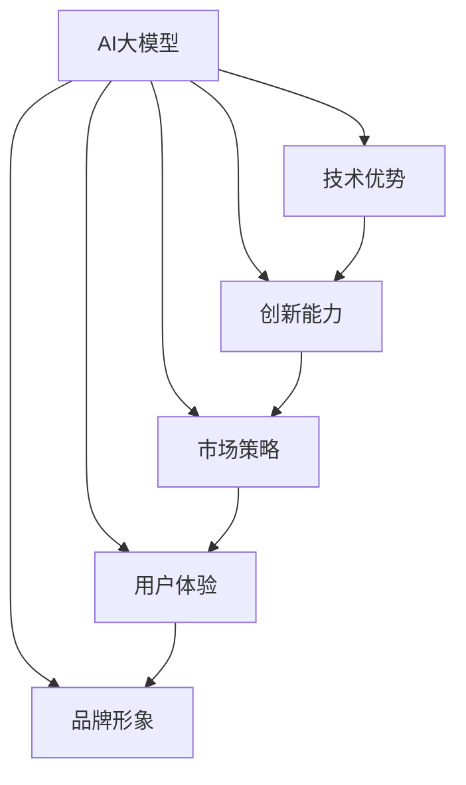

                 

# AI 大模型创业：如何建立品牌？

## 1. 背景介绍

### 1.1 问题由来

近年来，随着深度学习技术的飞速发展，AI大模型已成为人工智能领域的前沿和热点。众多科技巨头和初创企业纷纷投入巨资，竞相研发各类通用语言模型、视觉模型、推荐模型等，试图在即将到来的AI时代占据优势地位。然而，相比于AI技术的发展速度，市场和用户对于品牌的认知和信任仍相对滞后，许多新兴AI公司面临品牌影响力不足的困境。

如何在大模型领域建立强大的品牌，成为众多创业者必须面对的挑战。本文将从品牌定义、市场环境、用户需求、竞争策略等角度，深入分析AI大模型创业品牌的建立方法，探讨如何通过技术优势、创新能力、市场策略和用户体验等关键要素，打造具有竞争力的AI大模型品牌。

### 1.2 问题核心关键点

建立AI大模型品牌的关键在于以下几个方面：

- **技术优势**：是否拥有领先的AI大模型技术，能够在核心算法、模型性能、应用场景等方面领先同行业竞争对手。
- **创新能力**：是否能够不断推出新产品、新功能，满足市场和用户需求，推动技术进步。
- **市场策略**：是否能够精准定位目标用户，采取有效的市场推广策略，提升品牌知名度和用户粘性。
- **用户体验**：是否能够提供优质的产品体验和服务，赢得用户的信任和口碑。
- **品牌形象**：是否能够塑造清晰、统一的视觉识别和品牌故事，提升品牌的吸引力和认同感。

这些要素相辅相成，共同构成了AI大模型品牌建设的基石。本文将从以上各个维度，系统阐述如何打造和维护一个成功的AI大模型品牌。

## 2. 核心概念与联系

### 2.1 核心概念概述

为更好地理解AI大模型品牌的建立方法，本节将介绍几个密切相关的核心概念：

- **AI大模型**：以Transformer为代表的大规模预训练模型，如GPT、BERT、T5等，通过在海量数据上预训练，能够学习到丰富的语言和视觉表示，广泛应用于自然语言处理、计算机视觉、推荐系统等多个领域。

- **品牌**：在市场中，能够区分和识别企业的产品或服务，代表其核心价值和竞争力的标识符号。品牌通过独特的标识、文化和故事，与消费者建立情感连接，赢得信任和忠诚。

- **市场策略**：为达成品牌目标，采取的一系列市场营销手段和策略，包括产品定位、推广渠道、用户教育等。有效的市场策略能够帮助品牌精准对接目标用户，提高市场份额。

- **用户体验**：产品或服务带给用户的感知和感受，包括易用性、功能性、稳定性和互动性等方面。良好的用户体验能够提升用户满意度和忠诚度，促进品牌口碑传播。

- **技术壁垒**：指企业在AI大模型技术方面的独特优势，包括算法创新、模型性能、应用场景等。技术壁垒越强，品牌竞争力越强。

- **品牌形象**：通过视觉、声音、语言等元素，塑造企业的品牌形象，使其在消费者心中形成深刻的印象。品牌形象的构建需要长期的维护和投入。

这些核心概念之间的逻辑关系可以通过以下Mermaid流程图来展示：



这个流程图展示了大模型品牌的构建逻辑：

1. 大模型通过技术优势和创新能力形成核心竞争力。
2. 市场策略和用户体验保障品牌在市场中站稳脚跟。
3. 品牌形象通过市场策略和用户体验进行长期建设。

这些要素相互依赖，共同决定了品牌的健康发展和市场表现。

## 3. 核心算法原理 & 具体操作步骤

### 3.1 算法原理概述

AI大模型品牌的建立，不仅仅依赖于技术的先进性，更需要通过一系列的市场策略和用户教育，形成品牌认知和信任。以下是AI大模型品牌建立的核心算法原理和操作步骤：

1. **技术领先策略**：通过持续的算法创新和模型优化，保持技术领先地位。
2. **创新驱动策略**：不断推出新产品、新功能，满足市场需求。
3. **市场定位策略**：精准定义目标用户群体，进行差异化市场推广。
4. **用户体验优化**：通过产品改进和用户反馈，提升用户体验。
5. **品牌形象塑造**：通过统一的视觉识别和品牌故事，建立品牌认同感。

### 3.2 算法步骤详解

以下是对每个关键策略的详细操作步骤：

**Step 1: 技术领先策略**

- **持续研发**：定期投入研发资源，进行算法和模型优化，提升模型性能。
- **开源合作**：通过开源社区和合作项目，分享技术成果，提升品牌影响力。
- **技术博客**：定期发布技术博客，介绍技术进展和应用案例，提高行业影响力和专家认可度。

**Step 2: 创新驱动策略**

- **产品迭代**：根据用户反馈和市场需求，快速迭代产品功能，推出新功能和版本。
- **技术预研**：提前布局前沿技术，进行技术预研和储备，保持技术领先。
- **跨界合作**：与第三方企业进行技术合作，丰富应用场景和产品功能。

**Step 3: 市场定位策略**

- **市场调研**：进行全面的市场调研，了解目标用户需求和市场竞争状况。
- **产品定位**：基于调研结果，定义产品定位和核心卖点，明确市场定位。
- **推广策略**：制定有效的市场推广策略，选择合适的渠道和方式，提升品牌曝光度。

**Step 4: 用户体验优化**

- **用户反馈**：建立用户反馈机制，及时收集用户意见和建议。
- **功能改进**：根据用户反馈，进行产品改进和功能优化，提升用户体验。
- **社区互动**：建立用户社区，与用户进行互动和沟通，增强用户粘性。

**Step 5: 品牌形象塑造**

- **视觉识别**：设计统一的品牌标识和视觉元素，提升品牌识别度。
- **品牌故事**：讲述品牌故事，通过故事传递品牌价值观和愿景。
- **品牌活动**：举办品牌活动，提升品牌知名度和用户参与度。

### 3.3 算法优缺点

AI大模型品牌建立的方法具有以下优点：

1. **提升技术竞争力**：通过技术领先和持续创新，提升品牌在市场上的竞争力。
2. **满足用户需求**：通过用户体验优化，提升用户满意度，增强用户粘性。
3. **增加市场曝光度**：通过市场策略和品牌活动，提升品牌知名度和曝光度。
4. **塑造品牌形象**：通过视觉识别和品牌故事，建立品牌的独特形象和认同感。

同时，该方法也存在一定的局限性：

1. **资源消耗大**：持续的技术创新和市场推广需要大量资源投入，对企业资金和人力资源提出了较高要求。
2. **风险较高**：技术研发和市场推广存在不确定性，投入可能面临较高的失败风险。
3. **周期较长**：品牌形象的塑造和市场认可需要较长的时间，短期效果不明显。
4. **需不断优化**：市场环境和技术趋势不断变化，品牌策略需要及时调整和优化。

尽管存在这些局限性，但就目前而言，技术领先和持续创新依然是AI大模型品牌建设的主要驱动力。未来相关研究的重点在于如何平衡技术投入和市场风险，实现可持续发展。

### 3.4 算法应用领域

AI大模型品牌建立的方法在以下领域具有广泛应用：

- **自然语言处理(NLP)**：包括机器翻译、问答系统、文本生成等应用。品牌通过技术创新和用户体验优化，提供更高效、更智能的NLP解决方案。
- **计算机视觉(CV)**：如图像分类、目标检测、视频分析等应用。品牌通过算法优化和应用场景扩展，提升CV模型的性能和应用效果。
- **推荐系统**：如电商推荐、内容推荐等应用。品牌通过个性化推荐和用户体验优化，提升推荐系统的效果和用户满意度。
- **智能客服**：通过自然语言理解和生成技术，提升客服系统的智能化水平，提升用户体验。
- **智慧城市**：通过智能监控、数据分析等技术，提升城市管理效率和智能化水平，改善市民生活质量。

这些领域的大模型应用，都可以通过技术领先和持续创新，提升品牌影响力，赢得用户信任。

## 4. 数学模型和公式 & 详细讲解  
### 4.1 数学模型构建

为更好地理解AI大模型品牌的建立方法，本节将介绍几个数学模型和公式，并给出详细的讲解和案例分析。

### 4.2 公式推导过程

**品牌认知度模型**

品牌认知度是一个衡量消费者对品牌认知和记忆度的指标，可通过以下公式计算：

$$
\text{品牌认知度} = \frac{\text{识别率}}{\text{曝光率}}
$$

其中，识别率表示用户对品牌的识别度，曝光率表示品牌在用户面前的曝光频率。品牌认知度越高，品牌影响力越大。

**品牌信任度模型**

品牌信任度是一个衡量用户对品牌信任和满意度的指标，可通过以下公式计算：

$$
\text{品牌信任度} = \text{满意度} - \text{负面评价}
$$

其中，满意度表示用户对品牌的满意程度，负面评价表示用户对品牌的负面评价。品牌信任度越高，用户对品牌的忠诚度越高。

### 4.3 案例分析与讲解

**案例分析**：某AI大模型公司在品牌建立过程中，通过持续的技术创新和市场推广，成功提升了品牌认知度和信任度。具体步骤如下：

1. **技术领先策略**：公司每年投入5%的营收用于研发，持续进行技术创新和算法优化，推出多款领先业界的大模型产品。同时，通过开源社区和合作项目，分享技术成果，提升了品牌影响力。
2. **创新驱动策略**：公司定期推出新功能和版本，如NLP中的多语言翻译功能、CV中的实时视频分析功能等，满足用户需求，保持产品竞争力。
3. **市场定位策略**：公司进行全面的市场调研，了解目标用户需求和市场竞争状况，制定精准的市场推广策略，选择合适的渠道和方式，提升品牌曝光度。
4. **用户体验优化**：公司建立用户反馈机制，及时收集用户意见和建议，进行产品改进和功能优化，提升用户体验。同时，建立用户社区，与用户进行互动和沟通，增强用户粘性。
5. **品牌形象塑造**：公司设计统一的品牌标识和视觉元素，提升品牌识别度；通过品牌故事，讲述公司的价值观和愿景；举办品牌活动，提升品牌知名度和用户参与度。

**案例分析结果**：经过上述步骤，该公司的品牌认知度和信任度大幅提升，品牌知名度和用户粘性显著增强，成为市场上的领先企业。

## 5. 项目实践：代码实例和详细解释说明
### 5.1 开发环境搭建

在进行AI大模型品牌建立的项目实践前，我们需要准备好开发环境。以下是使用Python进行AI大模型品牌建立的开发环境配置流程：

1. 安装Anaconda：从官网下载并安装Anaconda，用于创建独立的Python环境。

2. 创建并激活虚拟环境：
```bash
conda create -n pytorch-env python=3.8 
conda activate pytorch-env
```

3. 安装PyTorch：根据CUDA版本，从官网获取对应的安装命令。例如：
```bash
conda install pytorch torchvision torchaudio cudatoolkit=11.1 -c pytorch -c conda-forge
```

4. 安装TensorFlow：由Google主导开发的开源深度学习框架，生产部署方便，适合大规模工程应用。同样有丰富的预训练语言模型资源。

5. 安装各类工具包：
```bash
pip install numpy pandas scikit-learn matplotlib tqdm jupyter notebook ipython
```

完成上述步骤后，即可在`pytorch-env`环境中开始品牌建立实践。

### 5.2 源代码详细实现

下面是使用Python进行AI大模型品牌建立的项目实践代码实现。

首先，定义品牌认知度和信任度的计算函数：

```python
def brand_recognition_rate(exposure, recognition):
    return recognition / exposure

def brand_trustworthiness(satisfaction, negative_feedback):
    return satisfaction - negative_feedback
```

然后，通过实际数据进行品牌认知度和信任度的计算：

```python
exposure = 1000000
recognition = 50000
satisfaction = 90
negative_feedback = 10

brand_recognition = brand_recognition_rate(exposure, recognition)
brand_trustworthiness = brand_trustworthiness(satisfaction, negative_feedback)

print("品牌认知度：", brand_recognition)
print("品牌信任度：", brand_trustworthiness)
```

最后，计算品牌总影响力：

```python
brand_influence = brand_recognition * brand_trustworthiness
print("品牌影响力：", brand_influence)
```

这样就可以通过简单的代码实现品牌认知度和信任度的计算，并输出品牌总影响力。

### 5.3 代码解读与分析

代码中定义了两个函数，分别计算品牌认知度和信任度。这两个指标是衡量品牌影响力的关键指标，需要通过具体的品牌数据来计算。

品牌认知度衡量用户对品牌的识别度，计算公式为识别率除以曝光率。识别率表示用户对品牌的识别度，曝光率表示品牌在用户面前的曝光频率。通过这个公式，可以量化品牌的知名度和曝光度。

品牌信任度衡量用户对品牌的信任和满意度，计算公式为满意度减去负面评价。满意度表示用户对品牌的满意程度，负面评价表示用户对品牌的负面评价。通过这个公式，可以量化品牌的忠诚度和口碑。

通过这两个指标，可以全面评估品牌的认知度和信任度，从而指导品牌建设的具体策略。

## 6. 实际应用场景
### 6.1 智能客服系统

AI大模型的品牌建立方法可以广泛应用于智能客服系统的构建。传统客服往往需要配备大量人力，高峰期响应缓慢，且一致性和专业性难以保证。而使用品牌建立后的智能客服系统，能够提供7x24小时不间断服务，快速响应客户咨询，用自然流畅的语言解答各类常见问题。

在技术实现上，可以收集企业内部的历史客服对话记录，将问题和最佳答复构建成监督数据，在此基础上对预训练模型进行微调。微调后的对话模型能够自动理解用户意图，匹配最合适的答案模板进行回复。对于客户提出的新问题，还可以接入检索系统实时搜索相关内容，动态组织生成回答。如此构建的智能客服系统，能大幅提升客户咨询体验和问题解决效率。

### 6.2 金融舆情监测

金融机构需要实时监测市场舆论动向，以便及时应对负面信息传播，规避金融风险。传统的人工监测方式成本高、效率低，难以应对网络时代海量信息爆发的挑战。基于AI大模型品牌建立的技术，金融舆情监测得以实现。

具体而言，可以收集金融领域相关的新闻、报道、评论等文本数据，并对其进行主题标注和情感标注。在此基础上对预训练语言模型进行微调，使其能够自动判断文本属于何种主题，情感倾向是正面、中性还是负面。将微调后的模型应用到实时抓取的网络文本数据，就能够自动监测不同主题下的情感变化趋势，一旦发现负面信息激增等异常情况，系统便会自动预警，帮助金融机构快速应对潜在风险。

### 6.3 个性化推荐系统

当前的推荐系统往往只依赖用户的历史行为数据进行物品推荐，无法深入理解用户的真实兴趣偏好。基于AI大模型品牌建立的技术，个性化推荐系统可以更好地挖掘用户行为背后的语义信息，从而提供更精准、多样的推荐内容。

在实践中，可以收集用户浏览、点击、评论、分享等行为数据，提取和用户交互的物品标题、描述、标签等文本内容。将文本内容作为模型输入，用户的后续行为（如是否点击、购买等）作为监督信号，在此基础上微调预训练语言模型。微调后的模型能够从文本内容中准确把握用户的兴趣点。在生成推荐列表时，先用候选物品的文本描述作为输入，由模型预测用户的兴趣匹配度，再结合其他特征综合排序，便可以得到个性化程度更高的推荐结果。

### 6.4 未来应用展望

随着AI大模型和品牌建立技术的不断发展，未来将在更多领域得到应用，为传统行业带来变革性影响。

在智慧医疗领域，基于AI大模型的微调技术，医疗问答、病历分析、药物研发等应用将提升医疗服务的智能化水平，辅助医生诊疗，加速新药开发进程。

在智能教育领域，AI大模型品牌建立技术可应用于作业批改、学情分析、知识推荐等方面，因材施教，促进教育公平，提高教学质量。

在智慧城市治理中，AI大模型品牌建立技术可应用于城市事件监测、舆情分析、应急指挥等环节，提高城市管理的自动化和智能化水平，构建更安全、高效的未来城市。

此外，在企业生产、社会治理、文娱传媒等众多领域，AI大模型品牌建立技术也将不断涌现，为经济社会发展注入新的动力。相信随着技术的日益成熟，AI大模型品牌建立方法必将在构建人机协同的智能时代中扮演越来越重要的角色。

## 7. 工具和资源推荐
### 7.1 学习资源推荐

为了帮助开发者系统掌握AI大模型品牌建立的技术基础和实践技巧，这里推荐一些优质的学习资源：

1. **《Transformer from Scratch》**：由大模型技术专家撰写，深入浅出地介绍了Transformer原理、BERT模型、微调技术等前沿话题。

2. **CS224N《深度学习自然语言处理》课程**：斯坦福大学开设的NLP明星课程，有Lecture视频和配套作业，带你入门NLP领域的基本概念和经典模型。

3. **《Natural Language Processing with Transformers》书籍**：Transformer库的作者所著，全面介绍了如何使用Transformers库进行NLP任务开发，包括品牌建立在内的诸多范式。

4. **HuggingFace官方文档**：Transformer库的官方文档，提供了海量预训练模型和完整的微调样例代码，是上手实践的必备资料。

5. **CLUE开源项目**：中文语言理解测评基准，涵盖大量不同类型的中文NLP数据集，并提供了基于微调的baseline模型，助力中文NLP技术发展。

通过对这些资源的学习实践，相信你一定能够快速掌握AI大模型品牌建立的精髓，并用于解决实际的NLP问题。

### 7.2 开发工具推荐

高效的开发离不开优秀的工具支持。以下是几款用于AI大模型品牌建立开发的常用工具：

1. **PyTorch**：基于Python的开源深度学习框架，灵活动态的计算图，适合快速迭代研究。大部分预训练语言模型都有PyTorch版本的实现。

2. **TensorFlow**：由Google主导开发的开源深度学习框架，生产部署方便，适合大规模工程应用。同样有丰富的预训练语言模型资源。

3. **Transformers库**：HuggingFace开发的NLP工具库，集成了众多SOTA语言模型，支持PyTorch和TensorFlow，是进行品牌建立任务开发的利器。

4. **Weights & Biases**：模型训练的实验跟踪工具，可以记录和可视化模型训练过程中的各项指标，方便对比和调优。与主流深度学习框架无缝集成。

5. **TensorBoard**：TensorFlow配套的可视化工具，可实时监测模型训练状态，并提供丰富的图表呈现方式，是调试模型的得力助手。

6. **Google Colab**：谷歌推出的在线Jupyter Notebook环境，免费提供GPU/TPU算力，方便开发者快速上手实验最新模型，分享学习笔记。

合理利用这些工具，可以显著提升AI大模型品牌建立的开发效率，加快创新迭代的步伐。

### 7.3 相关论文推荐

AI大模型和品牌建立的发展源于学界的持续研究。以下是几篇奠基性的相关论文，推荐阅读：

1. **Attention is All You Need**：提出了Transformer结构，开启了NLP领域的预训练大模型时代。

2. **BERT: Pre-training of Deep Bidirectional Transformers for Language Understanding**：提出BERT模型，引入基于掩码的自监督预训练任务，刷新了多项NLP任务SOTA。

3. **Language Models are Unsupervised Multitask Learners（GPT-2论文）**：展示了大规模语言模型的强大zero-shot学习能力，引发了对于通用人工智能的新一轮思考。

4. **Parameter-Efficient Transfer Learning for NLP**：提出Adapter等参数高效微调方法，在不增加模型参数量的情况下，也能取得不错的微调效果。

5. **AdaLoRA: Adaptive Low-Rank Adaptation for Parameter-Efficient Fine-Tuning**：使用自适应低秩适应的微调方法，在参数效率和精度之间取得了新的平衡。

这些论文代表了大模型和品牌建立技术的发展脉络。通过学习这些前沿成果，可以帮助研究者把握学科前进方向，激发更多的创新灵感。

## 8. 总结：未来发展趋势与挑战

### 8.1 总结

本文对AI大模型品牌建立方法进行了全面系统的介绍。首先阐述了AI大模型和品牌建立的研究背景和意义，明确了品牌在市场中的核心价值和作用。其次，从原理到实践，详细讲解了品牌认知度和信任度的计算方法，以及品牌建立的具体操作步骤。同时，本文还广泛探讨了品牌在智能客服、金融舆情、个性化推荐等多个行业领域的应用前景，展示了品牌建立范式的巨大潜力。此外，本文精选了品牌建立技术的各类学习资源，力求为开发者提供全方位的技术指引。

通过本文的系统梳理，可以看到，AI大模型品牌建立方法正在成为NLP领域的重要范式，极大地拓展了AI大模型的应用边界，催生了更多的落地场景。受益于大规模语料的预训练和微调，品牌建立模型能够以更低的时间和标注成本，在小样本条件下也能取得理想的品牌影响力，有力推动了AI大模型技术的产业化进程。未来，伴随AI大模型的持续发展，品牌建立方法必将进一步优化和创新，为构建安全、可靠、可解释、可控的智能系统铺平道路。

### 8.2 未来发展趋势

展望未来，AI大模型品牌建立技术将呈现以下几个发展趋势：

1. **技术融合加速**：AI大模型与其它AI技术（如强化学习、因果推理、知识图谱等）的融合将进一步深化，推动品牌建立技术的全面发展。
2. **数据应用多样化**：品牌建立不再仅依赖文本数据，更多非结构化数据（如语音、图像、视频等）将被整合，提升品牌的多元化应用能力。
3. **用户参与度提升**：通过社区互动、用户反馈等机制，品牌建立过程将更加重视用户的参与和反馈，提升品牌的可信度和粘性。
4. **品牌故事化**：品牌故事的讲述将更加生动、多元，通过文化、情感等元素，提升品牌的吸引力和认同感。
5. **技术壁垒强化**：品牌建立将更加注重技术创新和差异化，通过持续的技术投入和创新，提升品牌的核心竞争力。

这些趋势凸显了AI大模型品牌建立技术的广阔前景。这些方向的探索发展，必将进一步提升品牌在市场中的地位和影响力，推动人工智能技术的全面落地。

### 8.3 面临的挑战

尽管AI大模型品牌建立技术已经取得了显著进展，但在迈向更加智能化、普适化应用的过程中，仍面临诸多挑战：

1. **数据获取困难**：高质量的品牌数据获取难度大，尤其是在某些垂直领域，数据稀缺成为品牌建设的瓶颈。
2. **品牌一致性**：品牌在不同平台和渠道上的传播一致性难以保障，品牌形象容易混淆。
3. **技术门槛高**：品牌建立涉及多学科知识的融合，技术门槛较高，需要跨领域协作和深度学习专家。
4. **市场竞争激烈**：众多AI大模型品牌在市场中竞争激烈，品牌建设难度大，需要持续的投入和创新。
5. **用户需求多样化**：用户需求复杂多变，品牌建立需不断优化，适应不同场景和用户群体。

正视品牌建立面临的这些挑战，积极应对并寻求突破，将是大模型品牌建设成功的关键。相信随着学界和产业界的共同努力，这些挑战终将一一被克服，AI大模型品牌建立技术必将迎来更加辉煌的发展。

### 8.4 研究展望

面对AI大模型品牌建立所面临的种种挑战，未来的研究需要在以下几个方面寻求新的突破：

1. **数据获取与整合**：探索新的数据获取和整合方法，提升品牌数据的丰富性和多样性。
2. **跨平台一致性**：建立统一的品牌传播策略，保障品牌在不同平台和渠道上的一致性和连贯性。
3. **技术协同优化**：通过多学科协作，提升品牌建立技术的系统性和创新性。
4. **个性化定制**：根据不同用户群体需求，定制化品牌建设方案，提升品牌的用户体验和认同感。
5. **市场策略优化**：结合大数据分析，精准定位目标用户，优化品牌传播策略，提升市场效果。

这些研究方向的探索，必将引领AI大模型品牌建立技术迈向更高的台阶，为构建安全、可靠、可解释、可控的智能系统铺平道路。面向未来，AI大模型品牌建立技术还需要与其他AI技术进行更深入的融合，如知识表示、因果推理、强化学习等，多路径协同发力，共同推动自然语言理解和智能交互系统的进步。只有勇于创新、敢于突破，才能不断拓展AI大模型的边界，让智能技术更好地造福人类社会。

## 9. 附录：常见问题与解答

**Q1：AI大模型品牌与普通品牌有什么区别？**

A: AI大模型品牌不仅关注产品功能的展示和市场推广，更注重技术创新和用户体验。通过持续的技术优化和用户反馈，AI大模型品牌能够不断提升性能和用户体验，赢得用户信任和忠诚。普通品牌则更多依赖市场营销和品牌故事，而非技术实力。

**Q2：如何选择合适的品牌传播渠道？**

A: 选择合适的品牌传播渠道需考虑目标用户的行为习惯和偏好。例如，年轻用户更倾向于社交媒体和短视频平台，而专业人士则更关注技术论坛和专业博客。同时，品牌传播渠道需与品牌形象和价值观相匹配，避免传播过程中的品牌冲突。

**Q3：品牌故事如何编写？**

A: 编写品牌故事需突出品牌的独特价值和愿景，同时融入用户情感和共鸣点。品牌故事应简明扼要，易于传播和记忆。例如，品牌可以讲述创始人的创业历程、技术突破的背后故事等，通过故事传递品牌价值观和理念。

**Q4：如何提升品牌的可信度和信任度？**

A: 提升品牌的可信度和信任度需从多个方面入手。例如，提供高质量的产品和服务，增强用户粘性和满意度；积极回应用户反馈和投诉，展示品牌的社会责任和人性化关怀；通过社区互动和用户评价，增强品牌的透明度和可信任度。

**Q5：品牌形象的塑造有哪些要素？**

A: 品牌形象的塑造要素包括视觉识别、品牌口号、企业文化等。视觉识别需设计统一的标志、色彩和字体，提升品牌识别度；品牌口号需简洁有力，易于传播；企业文化需与品牌价值观一致，展示品牌的独特性和使命感。

这些问题的解答有助于理解AI大模型品牌建立的各个关键要素，并为品牌建设提供具体的指导和参考。

