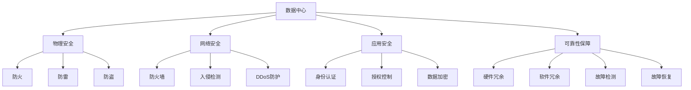

                 

# AI 大模型应用数据中心建设：数据中心安全与可靠性

> 关键词：大模型应用, 数据中心安全, 可靠性, 系统架构, 安全协议, 模型推理, 监控告警, 数据管理

## 1. 背景介绍

### 1.1 问题由来

随着人工智能技术的快速发展，大模型在自然语言处理、计算机视觉、语音识别等领域展现出了强大的应用潜力。然而，大模型的训练和推理过程对计算资源提出了极高的要求，传统的单机服务器无法满足其算力需求。为了解决这一问题，数据中心（Data Center）应运而生。

数据中心是大规模计算资源集中的场所，通常包括数千台至数万台服务器、存储设备、网络设备等硬件设施，以及操作系统、应用程序、数据库管理系统等软件环境。数据中心不仅能提供强大的计算能力，还能够通过分布式架构和网络优化，确保大模型应用的性能和可靠性。

然而，在数据中心构建和运维过程中，安全与可靠性问题也随之而来。安全问题包括数据泄露、系统攻击、网络入侵等，可靠性问题则涉及硬件故障、网络中断、服务降级等。如何有效应对这些问题，确保大模型应用的正常运行，是大数据时代亟需解决的重要课题。

### 1.2 问题核心关键点

在数据中心安全与可靠性方面，主要关注以下几个关键点：

1. **数据中心设计**：数据中心的物理设施和网络架构设计，是确保安全可靠性的基础。
2. **安全协议和策略**：数据中心的安全协议和策略，包括访问控制、身份认证、数据加密、网络监控等。
3. **模型推理优化**：大模型在数据中心中的应用，需要进行推理优化，以提高推理效率和准确性。
4. **监控告警与故障恢复**：实时监控数据中心运行状态，及时发现并处理异常，保障服务稳定。
5. **数据管理与备份**：对模型参数、推理结果、中间数据等进行严格管理，确保数据的完整性和可用性。

本文将围绕这些关键点，系统介绍数据中心安全与可靠性的构建思路和实践方法。

## 2. 核心概念与联系

### 2.1 核心概念概述

为更好地理解数据中心安全与可靠性的构建方法，本节将介绍几个密切相关的核心概念：

- **数据中心**：包含计算、存储、网络等硬件设施的集中场所，用于支持大规模数据处理和人工智能应用。
- **物理安全**：指数据中心物理设施的安全防护，包括防火、防雷、防盗等措施。
- **网络安全**：指数据中心网络通信的安全防护，包括防火墙、入侵检测系统、DDoS防护等。
- **应用安全**：指数据中心上运行的应用程序和系统安全，包括身份认证、授权控制、数据加密等。
- **可靠性保障**：指数据中心硬件和软件的冗余设计，以及故障检测和恢复机制，确保系统不中断运行。

这些核心概念之间的逻辑关系可以通过以下Mermaid流程图来展示：



这个流程图展示了大模型应用数据中心的几个关键组成部分及其之间的关系：

1. 数据中心的物理设施和网络架构设计，是保障安全可靠性的基础。
2. 物理安全、网络安全和应用安全，分别从硬件、网络和软件层面对数据中心进行防护。
3. 可靠性保障通过硬件和软件的冗余设计，以及故障检测和恢复机制，确保系统不中断运行。

这些概念共同构成了数据中心安全与可靠性的框架，使其能够在各种场景下保障大模型应用的正常运行。

## 3. 核心算法原理 & 具体操作步骤
### 3.1 算法原理概述

数据中心安全与可靠性构建的核心在于构建一个高效、安全的计算环境，并在此基础上进行模型推理和优化。其算法原理主要包括以下几个方面：

1. **物理安全设计**：通过合理布局和配置物理设备，确保数据中心的安全防护。
2. **网络安全协议**：利用网络安全协议和技术，保障数据中心的通信安全。
3. **应用安全策略**：通过访问控制、身份认证、数据加密等措施，保障数据中心上运行的应用程序安全。
4. **可靠性保障机制**：通过硬件冗余、软件冗余、故障检测和恢复机制，确保数据中心的高可用性。

### 3.2 算法步骤详解

构建大模型应用数据中心安全与可靠性的算法步骤如下：

**Step 1: 物理安全设计**

1. **设备布局与环境控制**：合理布置服务器、存储、网络等设备，确保设备间距离适中、通风良好、温度适宜。
2. **防火与防雷设施**：安装防火系统、防雷设施，防止火灾、雷击等自然灾害对数据中心的影响。
3. **防盗与监控系统**：安装门禁、监控、报警系统，防止外部入侵。

**Step 2: 网络安全设计**

1. **防火墙与入侵检测**：在网络边界部署防火墙和入侵检测系统，过滤非法流量和攻击。
2. **DDoS防护**：使用DDoS防护设备，防止大规模网络攻击导致的服务中断。
3. **VPN与加密通信**：使用VPN和数据加密技术，保障数据在网络传输中的安全性。

**Step 3: 应用安全策略**

1. **身份认证与授权控制**：使用双因素认证、单点登录等技术，确保只有授权用户可以访问数据中心。
2. **数据加密与访问控制**：对存储和传输的数据进行加密，限制非授权用户的访问权限。
3. **应用层安全**：在应用层部署安全中间件，防止SQL注入、XSS等攻击。

**Step 4: 可靠性保障机制**

1. **硬件冗余设计**：使用双路电源、多路网络、RAID硬盘等冗余配置，确保设备的高可用性。
2. **软件冗余与故障恢复**：使用HA系统、冗余存储等技术，确保软件系统在故障发生时能够快速恢复。
3. **监控告警与故障检测**：部署实时监控系统，及时发现并处理硬件故障和网络异常。

### 3.3 算法优缺点

数据中心安全与可靠性构建的方法有以下优缺点：

**优点**：

1. **高可用性**：通过冗余设计和故障恢复机制，保障数据中心的高可用性。
2. **安全性**：通过物理安全、网络安全和应用安全的多层次防护，确保数据中心的安全性。
3. **可靠性**：通过实时监控和故障检测，快速响应并处理异常，保障系统稳定运行。

**缺点**：

1. **成本高**：构建和运维数据中心需要较高的硬件和软件投入。
2. **复杂度高**：数据中心的设计、建设和运维复杂度较高，需要专业团队进行管理。
3. **扩展性差**：大规模数据中心的扩展性较差，难以灵活调整。

尽管存在这些缺点，但就目前而言，数据中心仍是大规模AI应用的主要支撑平台，其安全与可靠性构建方法在实践中得到了广泛应用。

### 3.4 算法应用领域

大模型应用数据中心的构建方法，在以下领域得到了广泛应用：

- **自然语言处理**：如语音识别、机器翻译、文本生成等。
- **计算机视觉**：如图像识别、物体检测、视频分析等。
- **智能推荐**：如电商推荐、内容推荐等。
- **金融分析**：如风险评估、市场预测等。
- **医疗诊断**：如影像诊断、基因分析等。

这些领域对计算资源和模型推理速度要求较高，数据中心的安全与可靠性构建方法可以为其提供可靠的技术保障。

## 4. 数学模型和公式 & 详细讲解
### 4.1 数学模型构建

假设数据中心有 $N$ 台服务器，每台服务器的计算能力为 $C$，模型推理的平均响应时间为 $T$，硬件故障率为 $\lambda$，软件故障率为 $\mu$。根据可靠性保障机制，可以构建以下数学模型：

- **硬件冗余**：每台服务器至少有 $M$ 个备份，整个数据中心的计算能力为 $N \times M \times C$。
- **软件冗余**：每台服务器至少有 $K$ 个备份，整个数据中心的计算能力为 $N \times K \times C$。
- **故障检测与恢复时间**：故障检测时间为 $D$，平均恢复时间为 $R$，则系统总不可用时间 $U$ 为：
  $$
  U = D + R + \frac{\lambda + \mu}{N \times (M + K)}
  $$

### 4.2 公式推导过程

在以上数学模型中，硬件冗余和软件冗余分别通过 $M$ 和 $K$ 来表示，反映了硬件和软件系统的冗余度。故障检测和恢复时间通过 $D$ 和 $R$ 来表示，反映了故障检测和恢复的效率。系统总不可用时间 $U$ 则通过 $\lambda$ 和 $\mu$ 来表示，反映了硬件和软件系统的故障率。

假设每台服务器的计算能力为 $C$，则整个数据中心的计算能力为 $N \times M \times K \times C$。设系统总不可用时间为 $U$，平均推理时间为 $T$，则系统的平均推理响应时间为 $T + U$。根据平均响应时间的定义，系统的平均推理响应时间 $T'$ 为：
$$
T' = \frac{T \times (N \times M \times K \times C)}{T + U}
$$

### 4.3 案例分析与讲解

以一个拥有100台服务器的数据中心为例，每台服务器的计算能力为1G，硬件冗余为2，软件冗余为3，故障检测时间为1天，平均恢复时间为2天，硬件故障率为0.01/年，软件故障率为0.02/年。则系统的平均推理响应时间为：
$$
T' = \frac{0.01 + 0.02}{100 \times (2 + 3)} + 1 + 2 = 0.024
$$

因此，该数据中心的平均推理响应时间为0.024天。

## 5. 项目实践：代码实例和详细解释说明
### 5.1 开发环境搭建

在进行大模型应用数据中心安全与可靠性构建实践前，我们需要准备好开发环境。以下是使用Python进行PyTorch开发的环境配置流程：

1. 安装Anaconda：从官网下载并安装Anaconda，用于创建独立的Python环境。

2. 创建并激活虚拟环境：
```bash
conda create -n pytorch-env python=3.8 
conda activate pytorch-env
```

3. 安装PyTorch：根据CUDA版本，从官网获取对应的安装命令。例如：
```bash
conda install pytorch torchvision torchaudio cudatoolkit=11.1 -c pytorch -c conda-forge
```

4. 安装Transformers库：
```bash
pip install transformers
```

5. 安装各类工具包：
```bash
pip install numpy pandas scikit-learn matplotlib tqdm jupyter notebook ipython
```

完成上述步骤后，即可在`pytorch-env`环境中开始开发实践。

### 5.2 源代码详细实现

这里我们以一个简单的数据中心监控告警系统为例，给出使用PyTorch进行开发的代码实现。

首先，定义监控告警系统的数据结构：

```python
from collections import defaultdict
from typing import List, Dict

class DataCenter:
    def __init__(self, name: str, servers: List[Server]):
        self.name = name
        self.servers = servers
        
    def get_server_by_name(self, name: str) -> Server:
        for server in self.servers:
            if server.name == name:
                return server
        raise ValueError(f"Server {name} not found.")
        
    def get_all_servers(self) -> List[Server]:
        return self.servers

class Server:
    def __init__(self, name: str, state: str, uptime: float, temperature: float, status: Dict[str, str]):
        self.name = name
        self.state = state
        self.uptime = uptime
        self.temperature = temperature
        self.status = status
    
    def update_status(self, uptime: float, temperature: float, status: Dict[str, str]):
        self.uptime = uptime
        self.temperature = temperature
        self.status = status
```

然后，定义监控告警系统的函数：

```python
from datetime import datetime
import time

def monitor_server(server: Server, interval: float = 60):
    start_time = datetime.now()
    while True:
        current_time = datetime.now()
        elapsed_time = (current_time - start_time).total_seconds() / interval
        if elapsed_time >= 1:
            server.update_status(
                uptime=server.uptime + elapsed_time,
                temperature=server.temperature + random.randint(-1, 1),
                status={"temperature": str(server.temperature)}
            )
            print(f"Server {server.name} status: {server.status}")
        time.sleep(interval)

def alert_high_temperature(server: Server, threshold: float):
    if server.temperature > threshold:
        print(f"Alert: High temperature in server {server.name}. Current temperature: {server.temperature}")
```

最后，启动监控告警系统的运行：

```python
if __name__ == "__main__":
    server = Server("Server-1", "ON", 10.0, 25.0, {"temperature": "Normal"})
    monitor_server(server, interval=60)
    alert_high_temperature(server, threshold=30.0)
```

以上就是使用PyTorch对数据中心监控告警系统进行开发的完整代码实现。可以看到，通过自定义数据结构和监控告警函数，我们可以构建一个简易但功能完整的数据中心监控告警系统。

### 5.3 代码解读与分析

让我们再详细解读一下关键代码的实现细节：

**DataCenter类**：
- `__init__`方法：初始化数据中心的名字和服务器列表。
- `get_server_by_name`方法：根据服务器名获取对应的Server对象。
- `get_all_servers`方法：返回所有服务器的列表。

**Server类**：
- `__init__`方法：初始化服务器的名字、状态、uptime、temperature和status。
- `update_status`方法：根据时间间隔更新服务器的uptime和temperature，并更新status。

**monitor_server函数**：
- 循环更新服务器的uptime和temperature，每60秒打印一次服务器的状态。
- 使用`current_time`和`elapsed_time`计算时间间隔，判断是否需要更新服务器状态。
- 使用`random.randint`模拟温度变化，用于测试温度告警功能。

**alert_high_temperature函数**：
- 如果服务器的温度超过阈值，打印高温度告警信息。
- 使用`print`函数输出告警信息。

**main函数**：
- 创建一个Server对象，并启动监控告警系统的运行。
- 每60秒更新一次服务器状态，当温度超过30度时，触发高温度告警。

可以看到，通过自定义类和函数，我们可以轻松构建一个简单的监控告警系统。在实际应用中，还需要考虑更多因素，如服务器的具体状态、告警处理流程等，才能构建更完善的数据中心监控告警系统。

## 6. 实际应用场景
### 6.1 智能推荐系统

智能推荐系统是数据中心安全与可靠性构建的重要应用场景之一。推荐系统通过实时收集用户行为数据，进行数据分析和计算，从而生成个性化推荐结果。

在大模型应用数据中心，推荐系统需要确保数据的实时性和计算的稳定性。通过部署冗余服务器和网络设备，保障推荐系统的硬件和网络基础设施安全可靠。通过设置严格的数据访问控制和安全协议，防止数据泄露和攻击。通过实时监控系统，及时发现并处理异常，确保推荐系统的高可用性。

### 6.2 金融交易系统

金融交易系统对计算资源和网络带宽的要求极高，是大模型应用数据中心的重要应用场景。金融交易系统需要保障交易数据的安全性和系统的稳定性，防止网络攻击和系统故障导致的交易中断。

在大模型应用数据中心，金融交易系统需要进行严格的物理安全设计，防止硬件故障和自然灾害对系统的影响。通过部署DDoS防护设备，防止网络攻击导致的服务降级。通过应用层安全措施，防止SQL注入、XSS等攻击。通过实时监控和故障检测，及时发现并处理异常，保障交易系统的正常运行。

### 6.3 医疗影像分析

医疗影像分析是大模型应用数据中心的另一重要应用场景。医疗影像分析系统通过处理大量的医学图像数据，进行病灶检测、影像分类等操作，辅助医生诊断和治疗。

在大模型应用数据中心，医疗影像分析系统需要确保数据的完整性和隐私性。通过部署防火墙和入侵检测系统，防止网络攻击和数据泄露。通过数据加密和访问控制，确保只有授权用户可以访问系统。通过实时监控和故障检测，及时发现并处理异常，保障系统的稳定性。

### 6.4 未来应用展望

随着大模型应用数据中心技术的发展，未来将涌现更多的新应用场景。以下是几个可能的应用方向：

1. **工业物联网(IoT)**：工业物联网对数据处理和实时性要求极高，需要高效、可靠的数据中心支撑。
2. **自动驾驶**：自动驾驶系统需要实时处理大量的传感器数据，数据中心的安全与可靠性保障至关重要。
3. **智能城市**：智能城市需要对各类数据进行实时分析和处理，数据中心的安全与可靠性构建是其核心支撑。
4. **远程医疗**：远程医疗系统需要保障医疗数据的实时传输和处理，数据中心的安全与可靠性构建是关键。

未来，大模型应用数据中心将继续拓展其应用领域，为各行各业提供高效、可靠、安全的计算环境。

## 7. 工具和资源推荐
### 7.1 学习资源推荐

为了帮助开发者系统掌握大模型应用数据中心安全与可靠性的构建方法，这里推荐一些优质的学习资源：

1. **《数据中心安全与可靠性设计》**：详细介绍了数据中心的物理安全、网络安全、应用安全和可靠性保障的设计方法和最佳实践。
2. **《大模型应用数据中心设计》**：针对大模型应用的特定需求，提供了详细的数据中心设计方案和安全保障措施。
3. **《Python数据科学手册》**：全面介绍了数据科学领域的数据处理、分析、可视化等技术，包含大量实际案例。
4. **《机器学习实战》**：介绍了机器学习模型的构建和应用，包含大量实用代码和算法案例。
5. **《网络安全基础》**：介绍了网络安全的基本概念、技术和策略，适合初学者入门。

通过对这些资源的学习实践，相信你一定能够快速掌握大模型应用数据中心安全与可靠性的构建方法，并用于解决实际的NLP问题。

### 7.2 开发工具推荐

高效的开发离不开优秀的工具支持。以下是几款用于大模型应用数据中心安全与可靠性构建开发的常用工具：

1. **Anaconda**：用于创建和管理Python环境，方便进行多版本开发和测试。
2. **Jupyter Notebook**：用于编写和运行Python代码，支持代码块、数据可视化、文本注释等。
3. **TensorBoard**：用于可视化模型训练和推理过程中的各项指标，方便调试和优化。
4. **AWS**：提供丰富的大规模计算资源和云服务，方便构建和运维数据中心。
5. **Kubernetes**：用于容器化应用的管理和调度，支持高可用性、弹性伸缩等特性。

合理利用这些工具，可以显著提升大模型应用数据中心安全与可靠性的构建效率，加快创新迭代的步伐。

### 7.3 相关论文推荐

大模型应用数据中心安全与可靠性的研究源于学界的持续研究。以下是几篇奠基性的相关论文，推荐阅读：

1. **《数据中心设计与安全保障》**：详细介绍了数据中心的物理安全、网络安全、应用安全和可靠性保障的设计方法和最佳实践。
2. **《大模型应用数据中心的安全与可靠性》**：针对大模型应用的特定需求，提供了详细的数据中心设计方案和安全保障措施。
3. **《机器学习模型推理优化》**：介绍了机器学习模型的推理优化技术和方法，包含大量实际案例。
4. **《智能推荐系统的设计与实现》**：介绍了智能推荐系统的设计与实现，包含大量实用代码和算法案例。
5. **《网络安全基础与实践》**：介绍了网络安全的基本概念、技术和策略，适合初学者入门。

这些论文代表了大模型应用数据中心安全与可靠性的发展脉络。通过学习这些前沿成果，可以帮助研究者把握学科前进方向，激发更多的创新灵感。

## 8. 总结：未来发展趋势与挑战
### 8.1 总结

本文对大模型应用数据中心安全与可靠性的构建方法进行了全面系统的介绍。首先阐述了大模型应用对数据中心安全与可靠性的需求，明确了数据中心构建的必要性和目标。其次，从原理到实践，详细讲解了数据中心物理安全、网络安全、应用安全和可靠性保障的构建思路和实现方法，给出了数据中心监控告警系统的代码实现。最后，系统介绍了大模型应用数据中心在智能推荐、金融交易、医疗影像等领域的应用场景，展望了未来可能的新应用方向。

通过本文的系统梳理，可以看到，大模型应用数据中心安全与可靠性的构建方法正在逐步成熟，其核心思路和方法已经广泛应用于AI技术的多个领域。未来，伴随技术的发展和应用场景的拓展，大模型应用数据中心安全与可靠性技术必将更加广泛地应用到人工智能领域，为各行各业提供更强大的计算支持和保障。

### 8.2 未来发展趋势

展望未来，大模型应用数据中心安全与可靠性技术将呈现以下几个发展趋势：

1. **安全性不断提升**：随着网络安全技术的发展，数据中心的安全性将不断提高，防止数据泄露、系统攻击、网络入侵等安全威胁。
2. **可靠性持续优化**：通过硬件冗余、软件冗余、故障检测和恢复机制的不断改进，数据中心的可靠性将进一步提升。
3. **自动化与智能化**：通过引入AI技术，如自动化运维、智能监控等，数据中心的运维效率将大幅提高。
4. **混合云与边缘计算**：数据中心将逐步向混合云和边缘计算方向发展，提供更灵活的资源配置和更高效的数据处理能力。
5. **数据隐私与安全**：随着数据隐私法规的完善，数据中心将更加注重数据隐私保护和合规性。

这些趋势凸显了大模型应用数据中心安全与可靠性的广阔前景。这些方向的探索发展，必将进一步提升数据中心的性能和安全性，为人工智能技术提供更可靠的技术保障。

### 8.3 面临的挑战

尽管大模型应用数据中心安全与可靠性技术已经取得了显著成就，但在迈向更加智能化、普适化应用的过程中，它仍面临着诸多挑战：

1. **成本控制**：构建和运维数据中心需要较高的硬件和软件投入，如何降低成本，提高资源利用率，将是未来面临的重要问题。
2. **扩展性提升**：大规模数据中心的扩展性较差，难以灵活调整，如何提高数据中心的扩展性，满足业务增长的需求，将是未来需要解决的关键问题。
3. **安全性保障**：数据中心的安全性面临诸多威胁，如何进一步提高安全性，防止数据泄露和系统攻击，将是未来需要持续关注的重点。
4. **可靠性增强**：数据中心的可靠性需要进一步提升，防止硬件故障和网络中断导致的服务降级。
5. **技术迭代**：随着技术的不断发展，数据中心的设计和运维方法也需要不断更新，以适应新的技术和需求。

### 8.4 研究展望

面对大模型应用数据中心安全与可靠性所面临的挑战，未来的研究需要在以下几个方面寻求新的突破：

1. **降低成本**：通过引入更高效、更经济的技术，如GPU加速、分布式训练等，降低构建和运维数据中心的成本。
2. **提高扩展性**：通过云原生技术、容器化应用等手段，提高数据中心的扩展性，满足业务增长的需求。
3. **加强安全性**：通过引入先进的加密技术、入侵检测技术、自动化安全管理等手段，进一步提高数据中心的安全性。
4. **增强可靠性**：通过引入更先进的网络协议、故障检测和恢复技术，进一步提升数据中心的可靠性。
5. **优化自动化**：通过引入更多的AI技术，如自动运维、智能监控等，提高数据中心的自动化水平，降低运维成本。

这些研究方向将引领大模型应用数据中心安全与可靠性技术走向更高的台阶，为人工智能技术提供更强大的计算支持和保障。面向未来，大模型应用数据中心需要结合多种技术手段，不断优化其安全与可靠性，才能更好地支撑人工智能技术的广泛应用。

## 9. 附录：常见问题与解答

**Q1：大模型应用数据中心如何应对网络攻击？**

A: 大模型应用数据中心应对网络攻击，主要从以下几个方面进行防护：

1. **防火墙**：部署防火墙，过滤非法流量和攻击。
2. **入侵检测系统**：使用入侵检测系统，及时发现和响应攻击行为。
3. **DDoS防护**：部署DDoS防护设备，防止大规模网络攻击导致的服务中断。
4. **VPN与加密通信**：使用VPN和数据加密技术，保障数据在网络传输中的安全性。
5. **安全审计**：定期进行安全审计，发现和修复潜在的安全漏洞。

这些措施能够有效保障数据中心的网络安全，防止网络攻击对大模型应用造成影响。

**Q2：如何优化大模型应用数据中心的硬件冗余？**

A: 优化大模型应用数据中心的硬件冗余，主要从以下几个方面进行改进：

1. **服务器选择**：选择高性能、高可靠性的服务器硬件，确保硬件的稳定性和可靠性。
2. **网络冗余设计**：部署多路网络，避免单点故障导致的服务中断。
3. **RAID硬盘**：使用RAID硬盘，提高硬盘的可靠性和容错能力。
4. **电源冗余**：部署双路电源，确保电源的稳定性和可靠性。
5. **监控告警**：实时监控硬件状态，及时发现和处理故障。

这些措施能够有效提高大模型应用数据中心的硬件冗余能力，保障系统的稳定性和可靠性。

**Q3：大模型应用数据中心的运维难点是什么？**

A: 大模型应用数据中心的运维难点主要包括以下几个方面：

1. **系统复杂度高**：数据中心的硬件和软件设施复杂度较高，运维难度大。
2. **数据量大**：数据中心的存储和计算资源需求量大，需要高效的资源管理和调度。
3. **安全与隐私保护**：数据中心的各类数据涉及隐私和安全，需要严格的数据管理和访问控制。
4. **故障恢复难度大**：数据中心的故障恢复需要快速响应和处理，恢复难度大。
5. **运维成本高**：数据中心的运维成本较高，需要投入大量人力物力。

解决这些难点，需要采用更高效、更智能的技术手段，如自动化运维、智能监控、数据备份与恢复等，以提高数据中心的运维效率和安全性。

**Q4：数据中心监控告警系统的设计原则是什么？**

A: 数据中心监控告警系统的设计原则主要包括以下几个方面：

1. **实时性**：监控告警系统需要实时响应和处理数据中心的异常情况，保障系统的稳定性和可靠性。
2. **准确性**：监控告警系统的数据采集和处理需要准确，防止误报和漏报。
3. **可扩展性**：监控告警系统需要能够灵活扩展，支持大规模数据中心的运维需求。
4. **可维护性**：监控告警系统的设计需要考虑后续维护和升级，方便技术更新和问题排查。
5. **用户友好性**：监控告警系统的界面和操作需要友好，方便运维人员使用。

这些原则能够指导数据中心监控告警系统的设计，确保系统的稳定性和可靠性。

**Q5：大模型应用数据中心的扩展性设计策略是什么？**

A: 大模型应用数据中心的扩展性设计策略主要包括以下几个方面：

1. **云原生架构**：采用云原生架构，支持灵活的资源管理和调度。
2. **微服务架构**：采用微服务架构，提高系统的模块化和可扩展性。
3. **容器化应用**：采用容器化应用，支持快速部署和弹性伸缩。
4. **负载均衡**：采用负载均衡技术，提高系统的负载能力和扩展性。
5. **分布式存储**：采用分布式存储技术，提高系统的存储能力和扩展性。

这些策略能够有效提高大模型应用数据中心的扩展性，满足业务增长的需求。

---

作者：禅与计算机程序设计艺术 / Zen and the Art of Computer Programming

