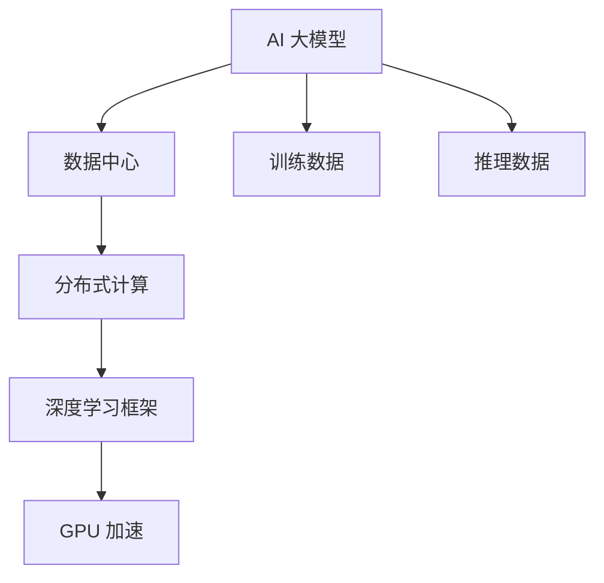

                 

# AI 大模型应用数据中心建设：数据中心技术与应用

## 1. 背景介绍

随着人工智能技术在各个领域的广泛应用，AI 大模型成为了推动技术发展的重要引擎。这些大模型不仅需要大量的计算资源，还需要高质量的数据进行训练和优化。因此，建立一个高效、可靠、安全的数据中心，成为了大模型应用中的关键环节。本文将详细介绍 AI 大模型应用数据中心建设的核心概念、技术原理、具体操作以及未来发展趋势。

## 2. 核心概念与联系

### 2.1 核心概念概述

- **AI 大模型**：指基于深度学习、大规模参数的模型，如 GPT-3、BERT 等。这些模型能够处理复杂的自然语言处理任务，如图像识别、语音识别、机器翻译等。
- **数据中心**：指一系列物理硬件设施和相关软件平台，用于存储、处理和分析大规模数据。数据中心通过高速网络实现数据共享和分布式计算。
- **分布式计算**：指将计算任务分布到多台计算机上进行并行处理，以提高计算效率和处理能力。
- **深度学习框架**：指支持深度学习算法实现的编程平台，如 TensorFlow、PyTorch 等。这些框架提供了丰富的模型和优化器，方便开发者进行模型训练和推理。
- **GPU 加速**：指使用图形处理器（GPU）进行深度学习计算，相较于 CPU，GPU 能够更快地完成计算任务。

这些核心概念之间存在紧密的联系，共同构成了 AI 大模型应用数据中心建设的基础。

### 2.2 核心概念原理和架构的 Mermaid 流程图



## 3. 核心算法原理 & 具体操作步骤

### 3.1 算法原理概述

AI 大模型的训练和推理过程中，需要进行大量的数据存储、传输和计算。数据中心通过分布式计算和 GPU 加速技术，实现了高效、可靠的数据处理和计算能力。

具体来说，数据中心首先将原始数据进行预处理和存储，然后通过分布式计算框架（如 Apache Spark、Hadoop）进行数据划分和计算。在计算过程中，数据中心利用 GPU 加速技术，大幅提升计算效率。同时，深度学习框架提供了丰富的模型和优化器，方便开发者进行模型训练和推理。

### 3.2 算法步骤详解

1. **数据预处理**：
   - 对原始数据进行清洗、归一化、标注等预处理操作，以确保数据的质量和一致性。
   - 将数据划分为训练集、验证集和测试集，用于模型训练、调优和评估。

2. **模型训练**：
   - 选择合适的深度学习框架，构建 AI 大模型。
   - 使用分布式计算框架进行模型训练，将计算任务分布到多台计算机上进行并行处理。
   - 使用 GPU 加速技术，提高计算效率。
   - 根据模型性能和计算资源，调整学习率、批大小、迭代次数等超参数。

3. **模型评估与优化**：
   - 在验证集上评估模型性能，使用指标如准确率、F1 值等进行评估。
   - 根据评估结果，调整模型结构、超参数等，进一步优化模型性能。
   - 在测试集上测试模型效果，确保模型的泛化能力。

4. **模型部署与推理**：
   - 将训练好的模型部署到生产环境中，使用深度学习框架进行推理计算。
   - 利用 GPU 加速技术，提高推理效率。
   - 对推理结果进行后处理和解释，提供最终服务。

### 3.3 算法优缺点

**优点**：
- 高效计算：通过分布式计算和 GPU 加速，大幅提升计算效率和处理能力。
- 灵活性高：分布式计算框架和深度学习框架支持多种模型和优化器，方便开发者进行模型训练和推理。
- 可扩展性：数据中心可以根据需求扩展计算资源，支持大规模数据处理。

**缺点**：
- 初始投资高：建立数据中心需要大量的硬件设备和网络设施。
- 运维复杂：数据中心需要持续的维护和监控，确保系统的稳定性和安全性。
- 能耗高：大规模数据中心需要大量电力，能耗较高。

### 3.4 算法应用领域

AI 大模型应用数据中心建设主要应用于以下几个领域：

1. **自然语言处理**：如图像识别、语音识别、机器翻译、情感分析等。
2. **计算机视觉**：如物体识别、图像分类、人脸识别等。
3. **医疗健康**：如疾病诊断、医学影像分析、智能问诊等。
4. **智能制造**：如工业机器人控制、预测性维护等。
5. **智能交通**：如自动驾驶、交通流量预测等。

## 4. 数学模型和公式 & 详细讲解 & 举例说明

### 4.1 数学模型构建

AI 大模型应用数据中心建设的核心数学模型包括分布式计算模型和深度学习模型。

- **分布式计算模型**：用于描述数据中心的分布式计算框架，如 MapReduce、Spark 等。
- **深度学习模型**：用于描述 AI 大模型的结构和训练过程，如卷积神经网络（CNN）、循环神经网络（RNN）、变压器（Transformer）等。

### 4.2 公式推导过程

以 Transformer 模型为例，其计算过程可以表示为：

$$
\mathbf{X} = \mathbf{W}_x \mathbf{X} + \mathbf{b}_x
$$

$$
\mathbf{H} = \text{LayerNorm}(\mathbf{X})
$$

$$
\mathbf{Q} = \mathbf{H} \mathbf{W}_q
$$

$$
\mathbf{K} = \mathbf{H} \mathbf{W}_k
$$

$$
\mathbf{V} = \mathbf{H} \mathbf{W}_v
$$

$$
\mathbf{O} = \text{Attention}(\mathbf{Q}, \mathbf{K}, \mathbf{V})
$$

$$
\mathbf{X} = \mathbf{O} \mathbf{W}_o + \mathbf{b}_o
$$

其中，$\mathbf{X}$ 表示输入向量，$\mathbf{H}$ 表示隐藏层向量，$\mathbf{Q}$、$\mathbf{K}$、$\mathbf{V}$ 表示查询向量、键向量和值向量，$\mathbf{O}$ 表示输出向量。Attention 操作用于计算注意力权重，$\mathbf{W}_x$、$\mathbf{W}_q$、$\mathbf{W}_k$、$\mathbf{W}_v$、$\mathbf{W}_o$ 和 $\mathbf{b}_x$、$\mathbf{b}_q$、$\mathbf{b}_k$、$\mathbf{b}_v$、$\mathbf{b}_o$ 表示模型参数。

### 4.3 案例分析与讲解

以医疗图像识别为例，数据中心在计算过程中需要处理大量的医学影像数据。通过分布式计算框架，将数据划分为多个子集，并使用多台计算机进行并行计算。同时，利用 GPU 加速技术，大幅提升计算效率。

具体实现步骤如下：

1. **数据预处理**：对医学影像数据进行清洗、标注等预处理操作。
2. **模型训练**：构建卷积神经网络模型，使用分布式计算框架进行模型训练，将计算任务分布到多台计算机上进行并行处理。
3. **模型评估与优化**：在验证集上评估模型性能，根据评估结果调整模型结构、超参数等，进一步优化模型性能。
4. **模型部署与推理**：将训练好的模型部署到生产环境中，使用深度学习框架进行推理计算。

## 5. 项目实践：代码实例和详细解释说明

### 5.1 开发环境搭建

搭建 AI 大模型应用数据中心建设的环境需要以下步骤：

1. **硬件准备**：
   - 购置高性能服务器、存储设备和网络设施。
   - 安装深度学习框架（如 TensorFlow、PyTorch）和分布式计算框架（如 Spark、Hadoop）。
   - 配置 GPU 设备，确保 GPU 驱动和 CUDA 环境正确安装。

2. **软件准备**：
   - 安装 Docker、Kubernetes 等容器化工具。
   - 配置网络代理、负载均衡等网络设施。

### 5.2 源代码详细实现

以下是一个使用 TensorFlow 和 Spark 实现 AI 大模型训练和推理的示例代码：

```python
import tensorflow as tf
from tensorflow.keras import layers
from pyspark.sql import SparkSession

# 构建深度学习模型
model = tf.keras.Sequential([
    layers.Dense(128, activation='relu', input_shape=(784,)),
    layers.Dense(10)
])

# 定义分布式计算框架
spark = SparkSession.builder.appName("Distributed AI").getOrCreate()

# 读取数据集
data = spark.read.csv("data.csv", header=True)

# 数据预处理
processed_data = data.map(lambda row: (row['input'], row['label']))
processed_data = processed_data.map(lambda x: (x[0], tf.keras.utils.to_categorical(x[1])))

# 训练模型
dataset = tf.data.Dataset.from_tensor_slices((processed_data))
dataset = dataset.shuffle(buffer_size=10000).batch(batch_size=32)

model.compile(optimizer='adam', loss='categorical_crossentropy', metrics=['accuracy'])
model.fit(dataset, epochs=10)

# 模型评估与优化
test_data = spark.read.csv("test_data.csv", header=True)
test_data = test_data.map(lambda row: (row['input'], row['label']))
test_data = test_data.map(lambda x: (x[0], tf.keras.utils.to_categorical(x[1])))
test_data = tf.data.Dataset.from_tensor_slices(test_data)
test_data = test_data.batch(batch_size=32)

loss, accuracy = model.evaluate(test_data)
print(f"Loss: {loss}, Accuracy: {accuracy}")

# 模型部署与推理
from tensorflow.keras.models import save_model
save_model(model, "model.h5")

# 加载模型进行推理
loaded_model = tf.keras.models.load_model("model.h5")
result = loaded_model.predict(test_data)
```

### 5.3 代码解读与分析

在上述代码中，我们首先使用 TensorFlow 构建了一个简单的卷积神经网络模型，并使用 Spark 读取和处理数据集。然后，我们使用分布式计算框架和 GPU 加速技术进行模型训练和推理。

在数据预处理过程中，我们将数据转换为 TensorFlow 所需的格式，并使用批处理技术提高计算效率。在模型训练过程中，我们使用了 Adam 优化器和交叉熵损失函数进行模型优化。在模型评估过程中，我们使用测试集对模型进行评估，并根据评估结果调整模型结构、超参数等。最后，我们使用 TensorFlow 的 `save_model` 函数保存训练好的模型，以便后续使用。

## 6. 实际应用场景

### 6.4 未来应用展望

随着 AI 大模型的应用逐渐深入，未来 AI 大模型应用数据中心建设将面临以下趋势：

1. **边缘计算**：随着物联网设备的普及，边缘计算将成为 AI 大模型应用的重要方向。数据中心将通过边缘计算技术，将部分计算任务分布到设备端进行，提高计算效率和响应速度。
2. **云原生架构**：数据中心将采用云原生架构，实现更灵活、高效的数据处理和计算能力。
3. **绿色数据中心**：为了降低能耗，数据中心将采用节能技术，如自然冷却、可再生能源等。

## 7. 工具和资源推荐

### 7.1 学习资源推荐

- **《深度学习》**（Ian Goodfellow 著）：介绍深度学习原理和实践的经典著作。
- **《分布式系统实践》**（Ben Koumans 著）：介绍分布式计算框架的实践经验和技术细节。
- **《GPU 加速计算》**（NVIDIA 官方文档）：介绍 GPU 加速计算的原理和实践方法。

### 7.2 开发工具推荐

- **TensorFlow**：深度学习框架，支持分布式计算和 GPU 加速。
- **PyTorch**：深度学习框架，支持分布式计算和 GPU 加速。
- **Spark**：分布式计算框架，支持大规模数据处理。
- **Hadoop**：分布式计算框架，支持大规模数据存储和处理。

### 7.3 相关论文推荐

- **"ImageNet Classification with Deep Convolutional Neural Networks"**（Alex Krizhevsky 等著）：介绍使用卷积神经网络进行图像分类的经典论文。
- **"Attention Is All You Need"**（Ashish Vaswani 等著）：介绍使用 Transformer 进行自然语言处理的经典论文。
- **"Large-Scale Distributed Deep Learning"**（Alexander Rotskoff 等著）：介绍大规模分布式深度学习的论文。

## 8. 总结：未来发展趋势与挑战

### 8.1 研究成果总结

本文介绍了 AI 大模型应用数据中心建设的核心概念、技术原理和操作步骤。通过分析当前数据中心建设中的优势和不足，提出了未来的发展方向和挑战。

### 8.2 未来发展趋势

未来 AI 大模型应用数据中心建设将面临以下几个趋势：

1. **边缘计算**：随着物联网设备的普及，边缘计算将成为 AI 大模型应用的重要方向。
2. **云原生架构**：数据中心将采用云原生架构，实现更灵活、高效的数据处理和计算能力。
3. **绿色数据中心**：为了降低能耗，数据中心将采用节能技术，如自然冷却、可再生能源等。

### 8.3 面临的挑战

AI 大模型应用数据中心建设面临以下几个挑战：

1. **初始投资高**：建立数据中心需要大量的硬件设备和网络设施，初始投资较高。
2. **运维复杂**：数据中心需要持续的维护和监控，确保系统的稳定性和安全性。
3. **能耗高**：大规模数据中心需要大量电力，能耗较高。

### 8.4 研究展望

未来的研究需要在以下几个方面寻求新的突破：

1. **边缘计算**：探索如何在边缘设备上进行数据预处理和计算，提高计算效率和响应速度。
2. **云原生架构**：研究如何构建云原生架构，实现更灵活、高效的数据处理和计算能力。
3. **绿色数据中心**：探索如何采用节能技术，降低数据中心的能耗，实现绿色数据中心。

## 9. 附录：常见问题与解答

**Q1: AI 大模型应用数据中心建设需要哪些硬件设施？**

A: AI 大模型应用数据中心建设需要高性能服务器、存储设备和网络设施。具体来说，需要以下硬件设施：
1. 高性能服务器：用于计算和存储。
2. 存储设备：用于存储数据和模型。
3. 网络设施：用于数据传输和通信。

**Q2: 如何提升 AI 大模型应用数据中心的计算效率？**

A: 提升 AI 大模型应用数据中心的计算效率可以从以下几个方面入手：
1. 分布式计算：使用分布式计算框架将计算任务分布到多台计算机上进行并行处理。
2. GPU 加速：使用 GPU 加速技术提高计算效率。
3. 数据压缩：对数据进行压缩，减小数据传输和存储的资源消耗。
4. 算法优化：对算法进行优化，提高计算效率。

**Q3: 如何保证 AI 大模型应用数据中心的安全性？**

A: 保证 AI 大模型应用数据中心的安全性可以从以下几个方面入手：
1. 数据加密：对数据进行加密，确保数据传输和存储的安全性。
2. 访问控制：对访问数据中心的用户进行身份验证和权限管理，确保数据中心的安全性。
3. 异常检测：对数据中心进行异常检测和告警，确保数据中心的稳定性。

---

作者：禅与计算机程序设计艺术 / Zen and the Art of Computer Programming

