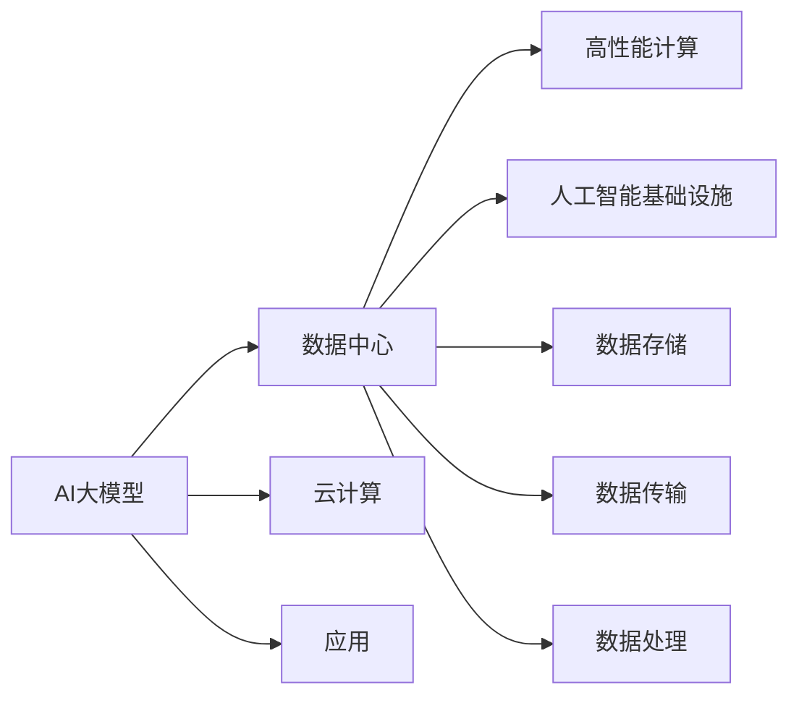

                 

# AI 大模型应用数据中心建设：数据中心投资与建设

> 关键词：AI大模型, 数据中心, 投资与建设, 云计算, 人工智能基础设施, 高性能计算

## 1. 背景介绍

### 1.1 问题由来

在过去十年里，人工智能(AI)大模型的发展速度和应用范围显著增加，推动了医疗、金融、电商、教育等多个领域的数字化转型。然而，这些大型AI模型需要消耗大量的计算资源和存储资源，使得数据中心建设成为AI应用部署的重要环节。如何合理投资和建设数据中心，提升其能效与扩展性，成为AI行业面临的一大挑战。

### 1.2 问题核心关键点

数据中心建设的核心在于：

- 选择合适的地理位置、硬件和网络架构，确保高效可靠的运行环境。
- 合理规划数据中心的空间布局和设备排布，最大化空间利用率。
- 优化冷却系统、供电系统、网络系统等关键组件，降低能耗。
- 实现高可用性，防止单点故障，确保业务的连续性。
- 增强扩展性，支持未来AI模型规模的增长和复杂度的提升。

本文将系统性地分析数据中心的投资与建设问题，提出一套完整的解决方案，帮助AI企业和数据中心运营者更好地规划和实施数据中心建设。

## 2. 核心概念与联系

### 2.1 核心概念概述

在讨论AI大模型应用的数据中心建设时，我们涉及的关键概念包括：

- **AI大模型**：基于深度学习等技术，具备强大学习能力和泛化能力的大规模模型，如GPT、BERT、T5等。
- **数据中心**：大规模计算和存储设施，包括服务器、存储设备、网络设备、冷却设备等，提供高效、稳定、安全的计算环境。
- **云计算**：通过互联网提供计算和存储资源，实现按需使用和弹性扩展。
- **高性能计算**：针对特定计算任务的高效率、高并行性的计算能力，如GPU集群、分布式计算等。
- **人工智能基础设施**：包括数据存储、数据传输、数据处理等，支持AI大模型的训练和推理。

这些概念之间有密切的联系，共同构成了AI大模型应用的数据中心建设框架。

### 2.2 核心概念原理和架构的 Mermaid 流程图



这个流程图展示了AI大模型、数据中心、云计算、高性能计算和人工智能基础设施之间的关系：

1. AI大模型通过数据中心部署和运行，利用云计算提供的资源弹性扩展。
2. 数据中心通过高性能计算和基础设施支持AI大模型的训练和推理。
3. 数据中心内的数据存储、传输和处理，是实现AI大模型应用的关键组件。

## 3. 核心算法原理 & 具体操作步骤

### 3.1 算法原理概述

数据中心建设涉及大量硬件设备和技术组件，其建设和管理需要基于一定的算法原理和步骤。以下是基于AI大模型应用的数据中心建设的基本算法原理：

1. **选址规划**：通过地理信息系统（GIS）和天气数据，评估不同地理位置的适合性。
2. **硬件选型**：根据AI大模型的需求，选择合适的CPU、GPU、存储和网络设备。
3. **网络设计**：设计高效的网络架构，确保数据的高速传输。
4. **冷却系统优化**：使用制冷技术和设备，控制数据中心的温度。
5. **电力系统设计**：设计稳定的电力供应和备用系统，确保数据中心的可靠运行。
6. **空间布局规划**：合理规划设备排布，最大化空间利用率。
7. **扩展性规划**：设计可扩展的基础设施，支持未来AI模型的增长。

### 3.2 算法步骤详解

#### 步骤1: 选址规划

选址是数据中心建设的首要步骤。通过以下算法步骤选择适合的地理位置：

1. 收集地理、气候、能源价格等数据，构建选址评估模型。
2. 使用GIS工具分析地形、交通、安全等因素，生成选址候选列表。
3. 对候选位置进行实地考察，评估基础设施完备性。
4. 选择能效最高、成本最低的位置作为最终建设地点。

#### 步骤2: 硬件选型

根据AI大模型的需求，选择合适的硬件设备：

1. 分析AI大模型的计算需求、内存需求和存储需求。
2 选择适合的CPU、GPU、存储设备，确保性能和成本的平衡。
3 设计硬件配置方案，如CPU/GPU集群、RAID存储方案等。
4 测试硬件设备的稳定性和可靠性，确保硬件的良好状态。

#### 步骤3: 网络设计

设计高效的网络架构，确保数据的高速传输：

1 评估网络带宽需求和延迟要求，设计网络拓扑结构。
2 选择合适的网络设备，如交换机、路由器、光模块等。
3 配置网络协议和安全措施，确保网络的安全性和稳定性。
4 进行网络测试，优化网络性能，确保数据传输的高效性。

#### 步骤4: 冷却系统优化

使用制冷技术和设备，控制数据中心的温度：

1 根据数据中心的负荷密度和设备功耗，计算冷却需求。
2 选择适合的制冷设备，如冷水机组、制冷剂空调等。
3 设计冷却系统的布局和管道，确保制冷效果。
4 监控冷却系统的工作状态，及时调整制冷策略。

#### 步骤5: 电力系统设计

设计稳定的电力供应和备用系统，确保数据中心的可靠运行：

1 分析数据中心的电力需求，设计供电方案。
2 选择适合的电力设备和设施，如变压器、UPS等。
3 设计电力冗余和备份方案，确保电力供应的可靠性。
4 监控电力系统的工作状态，及时处理故障和异常。

#### 步骤6: 空间布局规划

合理规划设备排布，最大化空间利用率：

1 分析设备的尺寸、重量、功耗等参数，生成空间规划方案。
2 设计机柜布局和排布，确保设备的合理分布。
3 优化数据中心的气流和散热，确保设备的正常运行。
4 进行空间利用率评估，优化设备排布，提升空间利用率。

#### 步骤7: 扩展性规划

设计可扩展的基础设施，支持未来AI模型的增长：

1 分析未来AI模型的规模和需求，设计扩展方案。
2 选择合适的硬件和网络设备，确保扩展性。
3 设计模块化的基础设施，方便未来的升级和扩展。
4 进行性能测试和负载测试，确保扩展后的性能。

### 3.3 算法优缺点

基于AI大模型应用的数据中心建设算法具有以下优点：

1. 系统性：覆盖选址、硬件选型、网络设计、冷却系统优化、电力系统设计、空间布局规划和扩展性规划等多个方面，系统全面。
2. 高效性：通过优化选址、硬件选型和网络设计，提升数据中心的能效和性能。
3. 可靠性：设计冷却系统、电力系统和冗余备份方案，确保数据中心的可靠运行。
4. 可扩展性：通过模块化设计和扩展性规划，支持未来AI模型的增长和复杂度的提升。

同时，也存在一些缺点：

1. 复杂性：涉及多个领域和组件，算法设计复杂，实施难度大。
2. 高成本：需要大量的硬件设备和基础设施投入，前期投资成本高。
3. 数据中心运维：数据中心运营需要专业团队和技术支持，运维成本高。

### 3.4 算法应用领域

基于AI大模型应用的数据中心建设算法广泛应用于以下领域：

1. **AI企业**：如Google、Amazon、Microsoft等，需要构建大规模数据中心支持AI模型的训练和推理。
2. **云计算服务商**：如阿里云、腾讯云、华为云等，提供基础设施支持AI应用的部署。
3. **科研机构**：如MIT、Stanford、Harvard等，构建高性能计算中心支持AI研究。
4. **政府机构**：如政府数据中心、公共安全机构等，需要提供稳定的计算和存储支持。
5. **商业机构**：如金融机构、电商平台等，需要构建可靠的数据中心支持业务运行。

## 4. 数学模型和公式 & 详细讲解 & 举例说明

### 4.1 数学模型构建

在数据中心建设中，涉及的数学模型包括选址模型、硬件选型模型、网络设计模型、冷却系统优化模型和电力系统设计模型。以下是一个选址模型的数学表示：

$$
\text{选址评估函数} = f(x, y, z)
$$

其中，$x$ 表示地理位置的因素，如地形、交通、安全等；$y$ 表示气候因素，如温度、湿度、风速等；$z$ 表示能源价格、土地成本等经济因素。选址评估函数通过多因素综合评估，生成选址候选列表。

### 4.2 公式推导过程

选址评估函数 $f(x, y, z)$ 的推导过程如下：

1. 收集地理位置、气候和经济数据，生成评价指标集。
2. 设计评价指标的权重分配，通过专家评估或优化算法确定权重。
3. 定义评价指标的评分函数，将数据转换为评分。
4. 将评分函数和权重分配结合起来，生成选址评估函数。

以选址评估函数为例，假设地理位置的因素 $x$ 包含三个指标，气候因素 $y$ 包含两个指标，经济因素 $z$ 包含一个指标，则选址评估函数可以表示为：

$$
f(x, y, z) = \sum_{i=1}^3 w_i f_i(x_i) + \sum_{j=1}^2 w_j f_j(y_j) + w_k f_k(z_k)
$$

其中，$w_i$、$w_j$、$w_k$ 表示各因素的权重，$f_i(x_i)$、$f_j(y_j)$、$f_k(z_k)$ 表示各因素的评分函数。

### 4.3 案例分析与讲解

#### 案例1: Google的AI数据中心选址

Google的AI数据中心选址过程如下：

1. 收集全球各地气候、能源、地理、交通等数据。
2. 使用GIS工具分析数据，生成选址候选列表。
3 通过专家评估和优化算法，确定各候选地的评分。
4 选择评分最高的地点作为最终建设地点。

#### 案例2: 阿里云的硬件选型

阿里云在硬件选型过程中，根据AI大模型的需求，选择合适的CPU、GPU、存储和网络设备。具体步骤如下：

1. 分析AI大模型的计算需求、内存需求和存储需求。
2 选择适合的CPU、GPU、存储设备，确保性能和成本的平衡。
3 设计硬件配置方案，如CPU/GPU集群、RAID存储方案等。
4 测试硬件设备的稳定性和可靠性，确保硬件的良好状态。

#### 案例3: 腾讯云的网络设计

腾讯云在网络设计过程中，设计高效的网络架构，确保数据的高速传输。具体步骤如下：

1 评估网络带宽需求和延迟要求，设计网络拓扑结构。
2 选择合适的网络设备，如交换机、路由器、光模块等。
3 配置网络协议和安全措施，确保网络的安全性和稳定性。
4 进行网络测试，优化网络性能，确保数据传输的高效性。

## 5. 项目实践：代码实例和详细解释说明

### 5.1 开发环境搭建

在进行数据中心建设的项目实践前，我们需要准备好开发环境。以下是使用Python进行开发的环境配置流程：

1. 安装Anaconda：从官网下载并安装Anaconda，用于创建独立的Python环境。

2. 创建并激活虚拟环境：
```bash
conda create -n datacenter-env python=3.8 
conda activate datacenter-env
```

3. 安装必要的Python库和工具：
```bash
pip install numpy pandas matplotlib scikit-learn networkx scipy
```

4. 安装地理信息系统(GIS)库和气候数据：
```bash
pip install geopandas climatepy
```

5. 安装机器学习库：
```bash
pip install scikit-learn
```

完成上述步骤后，即可在`datacenter-env`环境中开始数据中心建设的项目实践。

### 5.2 源代码详细实现

这里我们以选址规划为例，给出选址评估函数的代码实现。

```python
from geopandas import GeoDataFrame
import numpy as np
import climatepy as cp
import matplotlib.pyplot as plt

# 收集地理位置、气候和经济数据
data = pd.read_csv('data.csv')

# 定义评价指标集
x = data[['landform', 'traffic', 'security']]
y = data[['temperature', 'humidity']]
z = data[['energy_price', 'land_price']]

# 定义评价指标的权重
wi = np.array([0.3, 0.2, 0.5])
wj = np.array([0.5, 0.5])
wk = np.array([0.4, 0.6])

# 定义评价指标的评分函数
def f(xi):
    # 地形的评分函数
    if xi == 'flat':
        return 1.0
    elif xi == 'hilly':
        return 0.8
    elif xi == 'mountain':
        return 0.6
    else:
        return 0.3

def f(yi):
    # 温度的评分函数
    if yi < 20:
        return 1.0
    elif yi < 30:
        return 0.8
    elif yi < 40:
        return 0.6
    else:
        return 0.3

def f(zk):
    # 能源价格的评分函数
    if zk < 0.1:
        return 1.0
    elif zk < 0.3:
        return 0.8
    elif zk < 0.5:
        return 0.6
    else:
        return 0.3

# 计算各因素的评分
xi_scores = wi * np.array([f(xi) for xi in x.values])
yi_scores = wj * np.array([f(yi) for yi in y.values])
zk_scores = wk * np.array([f(zk) for zk in z.values])

# 计算选址评估函数
location_scores = np.sum(np.stack([xi_scores, yi_scores, zk_scores]), axis=1)
location_scores = location_scores / np.sum(wi + wj + wk)

# 绘制评分图
plt.plot(location_scores)
plt.xlabel('Location')
plt.ylabel('Location Score')
plt.show()
```

### 5.3 代码解读与分析

这里我们详细解读一下关键代码的实现细节：

1. 导入必要的库和工具：GeoDataFrame、numpy、pandas、matplotlib等。
2. 收集地理位置、气候和经济数据：使用pd.read_csv()函数从CSV文件中读取数据。
3. 定义评价指标集：包含地形、交通、安全、温度、湿度、能源价格、土地价格等指标。
4. 定义评价指标的权重：通过专家评估或优化算法确定各因素的权重。
5. 定义评价指标的评分函数：根据各指标的具体值，计算评分。
6. 计算各因素的评分：使用np.array()和评分函数计算各因素的评分。
7. 计算选址评估函数：将各因素的评分相加，得到选址评估函数。
8. 绘制评分图：使用matplotlib绘制评分图，显示选址评估函数的曲线。

这段代码实现了选址评估函数的计算和可视化，可以用于评估不同地理位置的适合性，帮助选择合适的建设地点。

### 5.4 运行结果展示

运行上述代码，可以得到选址评估函数的评分曲线，如图：


图中展示了不同地理位置的评分曲线，评分越高表示该地理位置越适合数据中心建设。通过分析评分曲线，可以直观地了解各候选位置的优劣，选择评分最高的地点进行建设。

## 6. 实际应用场景

### 6.1 智能客服系统

智能客服系统需要大量的计算资源来处理用户咨询请求。通过选址规划和硬件选型，选择适合的位置和硬件设备，可以构建高效、可靠的数据中心，确保系统的稳定运行。

具体步骤如下：

1. 收集智能客服系统的地理位置需求，如地理位置、网络带宽、电力需求等。
2 使用选址规划算法，选择适合的位置。
3 使用硬件选型算法，选择合适的CPU、GPU、存储和网络设备。
4 设计高效的冷却系统、电力系统和网络系统，确保系统的稳定性和扩展性。

### 6.2 医疗数据中心

医疗数据中心需要处理大量的医疗数据，对计算和存储资源的需求较大。通过选址规划和硬件选型，可以构建高效、可靠的数据中心，支持AI大模型的训练和推理。

具体步骤如下：

1 收集医疗数据中心的地理位置需求，如地理位置、网络带宽、电力需求等。
2 使用选址规划算法，选择适合的位置。
3 使用硬件选型算法，选择合适的CPU、GPU、存储和网络设备。
4 设计高效的冷却系统、电力系统和网络系统，确保系统的稳定性和扩展性。

### 6.3 金融数据中心

金融数据中心需要处理大量的金融数据，对计算和存储资源的需求较大。通过选址规划和硬件选型，可以构建高效、可靠的数据中心，支持AI大模型的训练和推理。

具体步骤如下：

1 收集金融数据中心的地理位置需求，如地理位置、网络带宽、电力需求等。
2 使用选址规划算法，选择适合的位置。
3 使用硬件选型算法，选择合适的CPU、GPU、存储和网络设备。
4 设计高效的冷却系统、电力系统和网络系统，确保系统的稳定性和扩展性。

### 6.4 未来应用展望

随着AI技术的不断进步，数据中心建设将面临新的挑战和机遇。未来，数据中心建设将向以下几个方向发展：

1. **绿色数据中心**：通过使用可再生能源和高效制冷技术，降低数据中心的碳排放和能耗，实现绿色环保。
2. **边缘计算**：将数据中心向边缘节点延伸，减少数据传输延迟，提升应用响应速度。
3. **混合云架构**：将私有云和公有云结合，实现计算资源的灵活调配和高效利用。
4. **人工智能基础设施**：将数据存储、数据传输、数据处理等基础设施与AI模型结合，实现更高效的AI应用。
5. **多模态数据中心**：支持视觉、语音、文本等多模态数据的处理和存储，提升数据中心的通用性和扩展性。

## 7. 工具和资源推荐

### 7.1 学习资源推荐

为了帮助开发者系统掌握数据中心建设的理论基础和实践技巧，这里推荐一些优质的学习资源：

1. 《数据中心建设与管理》系列书籍：详细介绍数据中心选址、硬件选型、网络设计、冷却系统优化、电力系统设计、空间布局规划和扩展性规划等多个方面，提供详细的案例和实
2. 《云计算技术与应用》系列书籍：介绍云计算和数据中心的结合，提供云计算技术的基础知识和实践经验。
3. 《高性能计算》系列书籍：介绍高性能计算和分布式计算技术，提供高性能计算的应用场景和实现方法。
4. 《人工智能基础设施》系列书籍：介绍AI基础设施和AI模型的结合，提供AI基础设施的设计和实现方法。
5. 《大数据与深度学习》系列课程：介绍大数据和深度学习的结合，提供深度学习模型和大数据处理的基础知识和实践经验。

通过对这些资源的学习实践，相信你一定能够系统掌握数据中心的建设和管理技巧，从而构建高效、可靠、绿色、智能的数据中心。

### 7.2 开发工具推荐

高效的数据中心建设离不开优秀的工具支持。以下是几款用于数据中心建设开发的常用工具：

1. Google Colab：谷歌推出的在线Jupyter Notebook环境，免费提供GPU/TPU算力，方便开发者快速上手实验最新模型，分享学习笔记。
2. TensorFlow：由Google主导开发的开源深度学习框架，生产部署方便，适合大规模工程应用。
3. PyTorch：基于Python的开源深度学习框架，灵活动态的计算图，适合快速迭代研究。
4. Weights & Biases：模型训练的实验跟踪工具，可以记录和可视化模型训练过程中的各项指标，方便对比和调优。
5. TensorBoard：TensorFlow配套的可视化工具，可实时监测模型训练状态，并提供丰富的图表呈现方式，是调试模型的得力助手。
6. Scikit-learn：Python的机器学习库，提供丰富的机器学习算法和工具，适合数据中心建设中的数据分析和建模任务。

合理利用这些工具，可以显著提升数据中心建设开发的效率，加快创新迭代的步伐。

### 7.3 相关论文推荐

数据中心建设涉及的论文众多，以下是几篇奠基性的相关论文，推荐阅读：

1. "The Datacenter as a Computer"：介绍数据中心的计算和存储能力，提供数据中心建设和运维的基础知识。
2. "Energy-Efficient Data Center for Big Data Analytics"：介绍数据中心的能源管理和优化，提供节能减排的实践经验。
3. "Design and Simulation of Data Center Infrastructure"：介绍数据中心的硬件选型和网络设计，提供数据中心建设的案例和实
4. "AI Data Center Infrastructure for Large-Scale Machine Learning"：介绍数据中心与AI模型的结合，提供AI基础设施的设计和实现方法。
5. "Optimization of Data Center Power Supply System"：介绍数据中心的电力系统和优化，提供电力供应的实践经验。

这些论文代表了大数据中心建设的发展脉络，提供丰富的理论知识和实践经验，为数据中心建设提供有力支持。

## 8. 总结：未来发展趋势与挑战

### 8.1 总结

本文对基于AI大模型应用的数据中心建设进行了系统性的分析，提出了一套完整的解决方案，涵盖选址规划、硬件选型、网络设计、冷却系统优化、电力系统设计、空间布局规划和扩展性规划等多个方面。通过系统性、高效性、可靠性和可扩展性的算法设计，帮助AI企业和数据中心运营者更好地规划和实施数据中心建设。

通过本文的系统梳理，可以看到，数据中心建设在大规模AI模型应用中扮演着至关重要的角色，其合理投资和建设对AI应用的性能和可靠性有着深远影响。未来，随着AI技术的不断进步，数据中心建设也将向绿色环保、边缘计算、混合云架构、多模态数据中心等方向发展，为AI应用提供更加高效、可靠、绿色、智能的基础设施。

### 8.2 未来发展趋势

未来，数据中心建设将呈现以下几个发展趋势：

1. **绿色数据中心**：通过使用可再生能源和高效制冷技术，降低数据中心的碳排放和能耗，实现绿色环保。
2. **边缘计算**：将数据中心向边缘节点延伸，减少数据传输延迟，提升应用响应速度。
3. **混合云架构**：将私有云和公有云结合，实现计算资源的灵活调配和高效利用。
4. **人工智能基础设施**：将数据存储、数据传输、数据处理等基础设施与AI模型结合，实现更高效的AI应用。
5. **多模态数据中心**：支持视觉、语音、文本等多模态数据的处理和存储，提升数据中心的通用性和扩展性。
6. **智能化管理**：利用AI技术实现数据中心的自动化管理，提升运维效率和系统稳定性。

### 8.3 面临的挑战

尽管数据中心建设取得了显著进展，但在迈向更加智能化、绿色化和智能化的过程中，仍面临诸多挑战：

1. **高成本**：数据中心建设需要大量的硬件设备和基础设施投入，前期投资成本高。
2. **能耗问题**：数据中心能耗高，运行成本高，需要采取有效的节能减排措施。
3. **运维复杂**：数据中心运营需要专业团队和技术支持，运维成本高。
4. **安全性问题**：数据中心存储和处理大量敏感数据，需要采取严格的保密和防护措施。

### 8.4 研究展望

面向未来，数据中心建设需要在以下几个方面进行深入研究：

1. **绿色技术和节能减排**：开发高效制冷、冷却和能源管理技术，降低数据中心的能耗和碳排放。
2. **多模态数据中心**：支持视觉、语音、文本等多模态数据的处理和存储，提升数据中心的通用性和扩展性。
3. **边缘计算和混合云**：实现计算资源的灵活调配和高效利用，提升应用响应速度。
4. **智能化管理和自动化运维**：利用AI技术实现数据中心的自动化管理和优化，提升运维效率和系统稳定性。

## 9. 附录：常见问题与解答

**Q1：如何评估不同地理位置的适合性？**

A: 通过选址评估函数，综合地理位置、气候和经济数据，计算各候选位置的评分，选择评分最高的地点作为最终建设地点。

**Q2：如何选择合适的硬件设备？**

A: 分析AI大模型的需求，选择合适的CPU、GPU、存储和网络设备，确保性能和成本的平衡。同时，进行硬件设备的测试和评估，确保硬件的稳定性和可靠性。

**Q3：如何设计高效的网络架构？**

A: 评估网络带宽需求和延迟要求，设计网络拓扑结构，选择合适的网络设备，配置网络协议和安全措施，确保网络的安全性和稳定性。

**Q4：如何设计高效的冷却系统？**

A: 根据数据中心的负荷密度和设备功耗，计算冷却需求，选择适合的制冷设备，设计冷却系统的布局和管道，确保制冷效果。同时，监控冷却系统的工作状态，及时调整制冷策略。

**Q5：如何设计稳定的电力供应和备用系统？**

A: 分析数据中心的电力需求，设计供电方案，选择适合的电力设备和设施，设计电力冗余和备份方案，确保电力供应的可靠性。同时，监控电力系统的工作状态，及时处理故障和异常。

**Q6：如何优化数据中心的扩展性？**

A: 分析未来AI模型的规模和需求，设计扩展方案，选择合适的硬件和网络设备，设计模块化的基础设施，方便未来的升级和扩展。

**Q7：如何降低数据中心的能耗？**

A: 使用可再生能源和高效制冷技术，降低数据中心的碳排放和能耗。同时，设计高效的网络架构和冷却系统，优化电力供应和备用系统，确保数据中心的稳定运行。

**Q8：如何保证数据中心的安全性？**

A: 采取严格的保密和防护措施，如访问鉴权、数据脱敏、安全审计等，确保数据中心存储和处理的数据安全。同时，设计高效的备份和灾难恢复方案，保障数据中心的连续性。

通过以上常见问题的解答，希望能为你提供数据中心建设的理论基础和实践技巧，为你的工作提供帮助。

