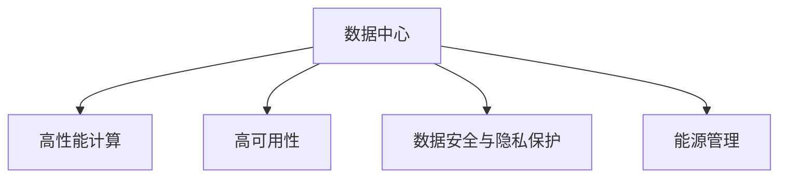

                 

# AI 大模型应用数据中心建设：数据中心标准与规范

在人工智能(AI)领域，大模型（Large Models）因其强大的表征能力和泛化能力，正在逐渐成为推动AI技术进步的重要驱动力。这些模型通常基于大规模无标签数据进行预训练，能够在各种下游任务中表现出色，如自然语言处理（NLP）、计算机视觉（CV）、推荐系统等。然而，要充分利用大模型的潜力，并实现其商业化应用，构建高效、可靠的数据中心是必不可少的。本文将详细探讨数据中心的建设标准与规范，旨在帮助开发者和运营者构建高性能、高可靠性的AI大模型应用环境。

## 1. 背景介绍

### 1.1 问题由来
随着AI大模型的兴起，数据中心在AI应用中的重要性日益凸显。数据中心不仅是计算资源和存储资源的提供者，更是模型训练、推理和应用的平台。一个高效、可靠的数据中心能够显著提升模型的训练速度、降低延迟，保障模型的服务质量。然而，由于AI大模型需要处理的数据规模庞大，其对数据中心的硬件配置、软件架构和运营管理等方面提出了更高要求。

### 1.2 问题核心关键点
数据中心的建设标准与规范涉及硬件配置、网络架构、存储方案、安全防护、能源管理等多个方面。一个标准的AI数据中心应能够：
- 提供高性能计算资源，支持大模型的训练和推理。
- 具备高可靠性和可用性，保障模型服务稳定。
- 提供数据安全和隐私保护，确保模型和数据的安全。
- 实现能源高效利用，降低运营成本。

这些问题核心关键点直接影响了AI大模型的应用效率和效果，也是本文将重点探讨的内容。

## 2. 核心概念与联系

### 2.1 核心概念概述

为更好地理解AI大模型应用数据中心的标准与规范，本节将介绍几个密切相关的核心概念：

- **数据中心**：提供计算、存储和网络资源，用于模型训练、推理和应用的环境。
- **高性能计算**：通过优化硬件配置和软件架构，提升数据中心的计算能力，支持AI大模型的训练和推理。
- **高可用性**：保证数据中心的高可靠性和服务可用性，提供高效率的模型应用支持。
- **数据安全与隐私保护**：采用先进的技术手段，保障AI大模型及其数据的安全和隐私。
- **能源管理**：通过合理规划和优化能源使用，降低数据中心的运营成本。

这些核心概念之间的逻辑关系可以通过以下Mermaid流程图来展示：



这个流程图展示了大模型应用数据中心的各个核心概念及其之间的关系：

1. 数据中心是高性能计算、高可用性、数据安全与隐私保护和能源管理的基础。
2. 高性能计算支持AI大模型的训练和推理。
3. 高可用性保障数据中心的服务稳定。
4. 数据安全与隐私保护确保模型和数据的安全。
5. 能源管理降低数据中心的运营成本。

这些概念共同构成了AI大模型应用数据中心的建设框架，确保了模型训练和推理的效率、安全和成本效益。

## 3. 核心算法原理 & 具体操作步骤
### 3.1 算法原理概述

AI大模型应用数据中心的建设，本质上是一个多学科交叉的复杂系统工程。其核心原理是通过优化硬件配置、网络架构和软件架构，提升数据中心的计算能力、可靠性、安全性和能源效率。具体来说，数据中心的建设应遵循以下几个关键原则：

- **模块化设计**：将数据中心分为多个功能模块，如计算模块、存储模块、网络模块和安全模块，以实现系统的灵活扩展和高效管理。
- **高可用性设计**：通过冗余设计和故障转移机制，保障数据中心的硬件和软件系统的高可用性。
- **数据安全设计**：采用多层次的安全防护措施，包括物理安全、网络安全、数据安全和应用安全，确保AI大模型及其数据的安全。
- **能源高效设计**：通过节能技术和能效管理策略，优化数据中心的能源使用，降低运营成本。

### 3.2 算法步骤详解

构建AI大模型应用数据中心，一般包括以下几个关键步骤：

**Step 1: 需求分析**
- 明确AI大模型的应用场景和需求，如模型大小、训练和推理的要求。
- 评估现有硬件资源和软件架构，确定性能瓶颈。
- 制定数据中心的整体规划和设计目标。

**Step 2: 硬件配置**
- 根据需求，选择合适的计算、存储和网络硬件设备，如高性能GPU、大容量内存、高速网络交换机等。
- 设计合理的硬件布局，优化资源利用率。
- 考虑未来扩展，预留足够的扩展空间。

**Step 3: 网络架构设计**
- 设计高效的网络架构，支持大模型的高带宽数据传输和高效通信。
- 采用冗余和负载均衡技术，保障网络的高可用性。
- 实现细粒度的网络隔离和安全防护。

**Step 4: 软件架构设计**
- 选择合适的分布式计算框架和模型训练框架，如TensorFlow、PyTorch等。
- 设计可扩展的分布式系统架构，支持大规模模型训练。
- 实现模型的优化和加速，提升训练和推理效率。

**Step 5: 安全与隐私保护设计**
- 采用多层次的安全防护措施，包括物理安全、网络安全、数据安全和应用安全。
- 设计严格的访问控制和审计机制，保障数据和模型的安全。
- 实现数据隐私保护，如数据加密、差分隐私等技术。

**Step 6: 能源管理**
- 设计高效的能源管理系统，监控和优化能源使用。
- 采用节能技术和能效管理策略，降低运营成本。
- 考虑绿色数据中心建设，减少碳排放。

通过以上步骤，可以构建一个满足AI大模型应用需求的、高性能、高可靠性和能源高效的数据中心。

### 3.3 算法优缺点

AI大模型应用数据中心的建设，具有以下优点：
1. 提升AI大模型的训练和推理效率，支持大规模模型的应用。
2. 保障AI大模型及其数据的安全和隐私，满足合规要求。
3. 实现能源的高效利用，降低运营成本。

同时，该方法也存在一定的局限性：
1. 初始投资成本较高，硬件和软件的配置复杂。
2. 设计和实施周期较长，需要专业团队协作。
3. 维护和运营成本较高，需要持续的技术支持和资源投入。

尽管存在这些局限性，但就目前而言，构建高性能、高可靠性的AI大模型应用数据中心仍是AI技术落地的重要基础。未来相关研究将集中在如何进一步优化硬件配置、软件架构和运营管理，以实现更高的性能和更低的成本。

### 3.4 算法应用领域

AI大模型应用数据中心的建设标准与规范，在AI领域已经得到了广泛的应用，覆盖了几乎所有常见的AI任务，例如：

- 自然语言处理（NLP）：如文本分类、情感分析、机器翻译等。数据中心提供高性能计算和存储资源，支持大规模NLP模型的训练和推理。
- 计算机视觉（CV）：如图像识别、目标检测、图像生成等。数据中心提供高性能GPU和高速网络，支持大规模CV模型的训练和推理。
- 推荐系统：如电商推荐、内容推荐等。数据中心提供高性能计算和分布式存储，支持大规模推荐模型的训练和推理。
- 智能医疗：如病历分析、医学影像诊断等。数据中心提供高可用性和数据隐私保护，确保医疗数据的安全和隐私。

除了上述这些经典任务外，AI大模型应用数据中心还被创新性地应用到更多场景中，如智慧城市、智能交通、智能制造等，为各行各业带来全新的变革。随着AI技术的不断发展，数据中心的建设标准与规范将不断演进，为AI技术提供更加高效、可靠的应用平台。

## 4. 数学模型和公式 & 详细讲解  
### 4.1 数学模型构建

本节将使用数学语言对AI大模型应用数据中心的建设标准与规范进行更加严格的刻画。

记数据中心的计算资源为 $C$，存储资源为 $S$，网络带宽为 $B$，能源消耗为 $E$。设模型训练和推理的负载为 $L$，其中 $L = L_{train} + L_{inference}$，$L_{train}$ 和 $L_{inference}$ 分别表示训练和推理的负载。

定义数据中心的性能指标 $P$ 为：

$$
P = \frac{L}{C + S + B}
$$

性能指标 $P$ 越接近于 1，说明数据中心的资源利用率越高，性能越好。

### 4.2 公式推导过程

数据中心的资源利用率最大化，需要满足以下条件：

1. 计算资源 $C$ 和存储资源 $S$ 的配置应能够支持模型的训练和推理。
2. 网络带宽 $B$ 应满足数据传输的需求。
3. 能源消耗 $E$ 应最小化。

具体而言，可以通过以下步骤推导出优化资源配置的公式：

1. 计算资源 $C$ 和存储资源 $S$ 的配置应满足模型训练和推理的负载要求。设 $C_{train} = \alpha L_{train}$，$S_{train} = \beta L_{train}$，其中 $\alpha$ 和 $\beta$ 分别为训练和推理对计算资源和存储资源的需求系数。
2. 网络带宽 $B$ 应满足数据传输的需求。设 $B_{train} = \gamma L_{train}$，$B_{inference} = \delta L_{inference}$，其中 $\gamma$ 和 $\delta$ 分别为训练和推理对网络带宽的需求系数。
3. 能源消耗 $E$ 应最小化。设 $E = f(C, S, B)$，其中 $f$ 为能源消耗函数，与 $C$、$S$ 和 $B$ 相关。

综合以上条件，得到数据中心的优化资源配置公式：

$$
\begin{aligned}
&\min_{C, S, B} f(C, S, B) \\
&\text{subject to} \quad \alpha L_{train} \leq C \leq C_{max}, \quad \beta L_{train} \leq S \leq S_{max}, \\
&\qquad \gamma L_{train} \leq B \leq B_{max}, \quad \delta L_{inference} \leq B \leq B_{max}, \\
&\quad P \geq P_{min}
\end{aligned}
$$

其中 $C_{max}$、$S_{max}$ 和 $B_{max}$ 分别为计算资源、存储资源和网络带宽的极限值；$P_{min}$ 为数据中心性能指标的最低要求。

### 4.3 案例分析与讲解

以下以一个简单的案例，展示如何根据AI大模型应用的需求，构建高性能数据中心。

假设某公司需要构建一个支持大规模机器学习模型训练和推理的数据中心，模型大小为 $L_{train} = 10GB, L_{inference} = 2GB$，计算资源需求系数 $\alpha = 1.5, \beta = 2.0$，网络带宽需求系数 $\gamma = 1.2, \delta = 0.8$，性能指标 $P_{min} = 0.9$。根据上述优化资源配置公式，进行以下计算：

1. 计算资源配置：$C_{train} = 1.5L_{train} = 15GB$，$C_{max} = 50GB$，因此 $C = 15GB$。
2. 存储资源配置：$S_{train} = 2.0L_{train} = 20GB$，$S_{max} = 100GB$，因此 $S = 20GB$。
3. 网络带宽配置：$B_{train} = 1.2L_{train} = 12GB/s$，$B_{max} = 50GB/s$，因此 $B = 12GB/s$。
4. 性能指标：$P = \frac{L}{C + S + B} = \frac{12GB}{15GB + 20GB + 12GB} \approx 0.93$，满足性能指标 $P_{min}$。

根据以上计算，构建数据中心时应配置计算资源 $C = 15GB$，存储资源 $S = 20GB$，网络带宽 $B = 12GB/s$，性能指标约为 $P = 0.93$。

## 5. 项目实践：代码实例和详细解释说明
### 5.1 开发环境搭建

在进行数据中心建设实践前，我们需要准备好开发环境。以下是使用Python进行高性能计算系统开发的环境配置流程：

1. 安装Anaconda：从官网下载并安装Anaconda，用于创建独立的Python环境。

2. 创建并激活虚拟环境：
```bash
conda create -n highperf-env python=3.8 
conda activate highperf-env
```

3. 安装高性能计算相关的库：
```bash
conda install numpy scipy pandas scikit-learn matplotlib tqdm jupyter notebook ipython
```

4. 安装分布式计算和资源管理库：
```bash
conda install dask horovod
```

5. 安装能源管理系统相关的库：
```bash
conda install pyserial
```

完成上述步骤后，即可在`highperf-env`环境中开始数据中心建设的实践。

### 5.2 源代码详细实现

下面我们以一个简单的分布式计算系统为例，给出使用Python实现高性能计算系统的代码实现。

首先，定义数据中心的计算资源配置：

```python
import os
import psutil

def get_system_resources():
    cpu_count = psutil.cpu_count()
    mem_total = psutil.virtual_memory().total
    mem_available = psutil.virtual_memory().available
    disk_usage = psutil.disk_usage('/').percent
    return cpu_count, mem_total, mem_available, disk_usage

cpu_count, mem_total, mem_available, disk_usage = get_system_resources()
print(f"CPU Count: {cpu_count}, Memory Total: {mem_total}, Memory Available: {mem_available}, Disk Usage: {disk_usage}%")
```

然后，设计分布式计算任务：

```python
from horovod.tf.keras import all_gather
import tensorflow as tf

model = tf.keras.Sequential([
    tf.keras.layers.Dense(64, activation='relu'),
    tf.keras.layers.Dense(10, activation='softmax')
])

# 定义训练函数
@tf.function
def train_step(x, y):
    with tf.GradientTape() as tape:
        logits = model(x, training=True)
        loss = tf.losses.sparse_categorical_crossentropy(y, logits)
    grads = tape.gradient(loss, model.trainable_variables)
    optimizer.apply_gradients(zip(grads, model.trainable_variables))
    return loss

# 定义训练循环
def train_loop(batch_size, epochs):
    for epoch in range(epochs):
        for i, (x, y) in enumerate(train_dataset):
            loss = train_step(x, y)
            print(f"Epoch {epoch+1}, Batch {i+1}, Loss: {loss.numpy()}")

# 定义多机训练函数
def distribute_train(batch_size, epochs):
    all_gather_model = all_gather(model)
    train_loop(batch_size, epochs)

# 多机环境配置
os.environ['HOROVOD_NPROCS'] = str(os.cpu_count())
os.environ['HOROVOD_RANK'] = str(os.getpid() % os.cpu_count())
os.environ['HOROVOD_LOCAL_RANK'] = str(os.getpid())

# 多机训练
distribute_train(batch_size=32, epochs=10)
```

接着，设计能源管理系统：

```python
import pyserial

def get_energy_usage():
    with open('/proc/stat', 'r') as f:
        stats = f.read().split()
    cpu_energy = float(stats[14]) / 100
    return cpu_energy

def optimize_energy_usage():
    while True:
        energy_usage = get_energy_usage()
        if energy_usage > 90:
            print("Energy usage too high, reducing resources.")
            # 动态调整资源配置，如降低CPU频率、减少计算任务等
        elif energy_usage < 80:
            print("Energy usage too low, increasing resources.")
            # 动态调整资源配置，如增加CPU频率、增加计算任务等

# 能源管理线程
energy_monitor = threading.Thread(target=optimize_energy_usage)
energy_monitor.start()
```

完成上述步骤后，即可在`highperf-env`环境中开始分布式计算和能源管理的实践。

### 5.3 代码解读与分析

让我们再详细解读一下关键代码的实现细节：

**get_system_resources函数**：
- 使用psutil库获取系统的CPU数量、内存总量和可用量、磁盘使用情况等关键信息，返回一个包含这些信息的元组。

**train_step函数**：
- 使用TensorFlow和Horovod库定义模型训练函数，使用梯度下降算法更新模型参数。

**train_loop函数**：
- 定义一个简单的训练循环，按批次迭代训练数据，并在每个批次上调用训练函数。

**distribute_train函数**：
- 定义多机训练函数，通过Horovod库实现模型的分布式训练。

**能源管理系统代码**：
- 定义一个持续监控系统能源使用情况的函数，根据能源使用情况动态调整资源配置。

这些代码展示了如何使用Python构建高性能计算系统和能源管理系统，通过分布式计算和能源管理，可以显著提升数据中心的计算能力和能源效率。

## 6. 实际应用场景
### 6.1 智能医疗系统

基于AI大模型应用数据中心，智能医疗系统可以实现更加高效、准确的病历分析和医学影像诊断。通过构建高性能计算和存储系统，大模型可以在实时获取的病人数据上进行训练和推理，提供快速、准确的诊断建议。同时，数据中心的高可用性和数据安全保护，确保了病人数据和诊断结果的安全。

### 6.2 智能交通系统

智能交通系统需要处理大量的交通数据，进行实时分析和预测。通过构建高性能计算和分布式存储系统，大模型可以在实时获取的交通数据上进行训练和推理，提供交通流量预测、事故预警等智能服务。数据中心的高可用性和数据隐私保护，确保了交通数据的可靠性和安全性。

### 6.3 智能制造系统

智能制造系统需要处理大量的生产数据，进行实时分析和优化。通过构建高性能计算和分布式存储系统，大模型可以在实时获取的生产数据上进行训练和推理，提供生产过程优化、设备维护预测等智能服务。数据中心的高可用性和数据隐私保护，确保了生产数据的可靠性和安全性。

### 6.4 未来应用展望

随着AI大模型应用数据中心的不断演进，其应用场景将不断拓展，为各行各业带来更深层次的变革。未来，AI大模型应用数据中心将：

1. 提供更加高效、可靠的计算和存储资源，支持更大规模、更复杂模型的应用。
2. 实现更高的性能和更低的成本，满足各行业的AI应用需求。
3. 提供更好的数据安全和隐私保护，确保数据和模型的安全。
4. 实现更加智能化、自动化的运营管理，提高系统的可靠性和可用性。

总之，AI大模型应用数据中心将成为AI技术落地应用的重要基础，未来将会有更多行业受益于其带来的高效、可靠和智能化的计算服务。

## 7. 工具和资源推荐
### 7.1 学习资源推荐

为了帮助开发者系统掌握AI大模型应用数据中心的建设标准与规范，这里推荐一些优质的学习资源：

1. **高性能计算系列博文**：由高性能计算专家撰写，深入浅出地介绍了高性能计算原理、并行编程技巧、资源管理技术等前沿话题。

2. **分布式计算与并行编程课程**：由Coursera、edX等在线教育平台提供，涵盖分布式计算、并行编程、资源管理等内容，适合初学者和进阶者。

3. **能源管理系统手册**：详细介绍了各种能源管理技术和策略，帮助构建高效的能源管理系统。

4. **AI数据中心架构设计手册**：提供了构建AI数据中心的全流程指导，包括需求分析、硬件配置、软件架构、能源管理等各个环节。

5. **智能医疗系统案例研究**：介绍智能医疗系统的构建过程，包括数据中心建设、大模型应用等技术细节。

通过对这些资源的学习实践，相信你一定能够快速掌握AI大模型应用数据中心的建设技巧，并应用于实际项目中。

### 7.2 开发工具推荐

高效的开发离不开优秀的工具支持。以下是几款用于AI大模型应用数据中心开发的常用工具：

1. **Anaconda**：用于创建和管理Python环境，方便模块化开发。

2. **Horovod**：用于分布式深度学习训练，支持TensorFlow、PyTorch等框架，简化了分布式训练的实现。

3. **Dask**：用于分布式计算，支持Python的NumPy、Pandas等库，适合大规模数据处理。

4. **HDFS**：用于分布式存储，支持大规模数据存储和访问，是Hadoop生态系统的重要组件。

5. **TensorBoard**：用于分布式系统的监控和可视化，提供丰富的图表展示系统状态和性能。

6. **GreenCloud**：用于数据中心能源管理，实现能效优化和节能控制。

合理利用这些工具，可以显著提升AI大模型应用数据中心的开发效率，加快创新迭代的步伐。

### 7.3 相关论文推荐

AI大模型应用数据中心的建设标准与规范，在大数据和人工智能领域已经得到了广泛的研究。以下是几篇奠基性的相关论文，推荐阅读：

1. **High-Performance Computing for Machine Learning**：介绍高性能计算在机器学习中的应用，提供了丰富的硬件和软件设计思路。

2. **Distributed Training for Deep Learning**：探讨分布式深度学习训练的实现方法和技术，提供了分布式系统的设计原则和优化策略。

3. **Energy-Efficient Data Centers**：详细介绍了数据中心的能源管理技术和策略，帮助实现高效能源利用。

4. **Cloud Computing for AI**：探讨云计算在AI中的应用，提供了云计算和大数据融合的设计思路。

5. **AI Data Center Architectures**：提供了构建AI数据中心的全流程指导，涵盖需求分析、硬件配置、软件架构、能源管理等各个环节。

这些论文代表了大规模AI数据中心建设的研究方向，通过学习这些前沿成果，可以帮助研究者把握学科前进方向，激发更多的创新灵感。

## 8. 总结：未来发展趋势与挑战
### 8.1 总结

本文对AI大模型应用数据中心的建设标准与规范进行了全面系统的介绍。首先阐述了AI大模型应用数据中心的重要性，明确了数据中心在AI技术落地的基础性作用。其次，从原理到实践，详细讲解了数据中心的标准与规范，包括高性能计算、高可用性、数据安全与隐私保护、能源管理等多个方面，给出了数据中心建设的完整代码实例。同时，本文还广泛探讨了数据中心在医疗、交通、制造等众多领域的应用前景，展示了数据中心的广阔应用空间。

通过本文的系统梳理，可以看到，AI大模型应用数据中心的建设标准与规范是大模型应用落地的重要基础。这些标准和规范的制定和实施，能够显著提升模型的训练和推理效率，保障模型及其数据的安全和隐私，实现能源的高效利用。未来，随着数据中心技术的不断演进，AI大模型应用数据中心将进一步优化，为AI技术的广泛应用提供坚实的基础。

### 8.2 未来发展趋势

展望未来，AI大模型应用数据中心的建设将呈现以下几个发展趋势：

1. **边缘计算与云协同**：未来数据中心将更注重边缘计算和云协同，实现计算和存储资源的灵活分布和高效利用。

2. **异构计算融合**：未来数据中心将采用多种计算硬件（如GPU、FPGA、ASIC等）融合的异构计算模式，提升系统的性能和效率。

3. **智能运维与管理**：未来数据中心将实现更加智能化、自动化的运维和管理，通过机器学习和自动化技术提升系统的可靠性和可用性。

4. **绿色数据中心**：未来数据中心将更注重绿色环保和能源高效利用，实现低碳排放和可持续发展。

5. **跨领域应用融合**：未来数据中心将更注重跨领域应用的融合，如医疗、交通、制造等，为更多行业带来变革。

这些趋势将推动数据中心向更高效、更智能、更环保的方向发展，为AI技术的广泛应用提供更坚实的技术基础。

### 8.3 面临的挑战

尽管AI大模型应用数据中心的建设取得了一定进展，但在迈向更加智能化、普适化应用的过程中，仍面临诸多挑战：

1. **初始投资成本高**：建设高性能数据中心需要大量的硬件和软件投入，成本较高。

2. **资源利用率有限**：数据中心的资源利用率仍存在瓶颈，需要进一步优化。

3. **系统复杂度高**：数据中心系统的设计和实现复杂度较高，需要跨学科的专业知识。

4. **能效管理困难**：数据中心的能效管理仍存在挑战，需要更先进的能源管理技术和策略。

5. **数据隐私和安全问题**：数据中心的隐私和安全问题依然严峻，需要更强的技术保障。

尽管存在这些挑战，但随着技术不断发展和创新，这些问题终将得到逐步解决，AI大模型应用数据中心将迎来更广阔的应用前景。

### 8.4 研究展望

未来的研究需要在以下几个方面寻求新的突破：

1. **高效硬件和软件设计**：研发更高效、更智能的硬件和软件设计，实现更高效的资源利用和更智能的运维管理。

2. **智能能效管理**：引入人工智能技术，实现更加智能的能效管理和节能控制。

3. **跨领域应用融合**：实现不同领域应用的深度融合，如医疗、交通、制造等，为更多行业带来变革。

4. **数据隐私保护**：研发更强的数据隐私保护技术，确保数据和模型的安全。

5. **自动化和智能化运维**：引入自动化和智能化技术，提升数据中心的运维效率和系统可靠性。

这些研究方向的探索，将引领AI大模型应用数据中心技术迈向更高的台阶，为AI技术的广泛应用提供更坚实的技术基础。

## 9. 附录：常见问题与解答

**Q1：什么是高性能计算系统？**

A: 高性能计算系统是指能够高效处理大规模计算任务的系统，通常包括高性能计算硬件、分布式计算框架和高效算法。其目标是提高计算速度和降低计算成本。

**Q2：如何优化数据中心的能效管理？**

A: 优化数据中心的能效管理，可以采用以下方法：
1. 采用高效制冷系统，如水冷、液冷等，降低设备温度，提高能效比。
2. 优化硬件配置，如选择合适的服务器和网络设备，提升资源利用率。
3. 采用能源管理系统，实时监控和优化能源使用，减少能源浪费。
4. 引入节能技术和能效管理策略，如动态电压调节、资源调度等。

**Q3：什么是高可用性设计？**

A: 高可用性设计是指通过冗余和故障转移机制，保障系统的高可靠性。常见的措施包括：
1. 使用冗余硬件和软件，如双机热备、负载均衡等。
2. 设计合理的故障转移策略，如自动切换、故障恢复等。
3. 定期进行系统备份和数据冗余，保障数据的安全性和可靠性。

**Q4：什么是分布式计算系统？**

A: 分布式计算系统是指通过网络将多台计算机连接起来，实现数据和计算任务的分布式处理。常见的分布式计算框架包括Hadoop、Spark、Horovod等。分布式计算系统可以处理大规模数据，提升计算效率。

**Q5：什么是智能运维与管理？**

A: 智能运维与管理是指通过自动化和智能化技术，实现系统的自动化监控、故障诊断和恢复。常见的智能运维工具包括Zabbix、Grafana、Ansible等。智能运维与管理可以提升系统的可靠性和可用性。

通过回答这些问题，可以帮助你更好地理解AI大模型应用数据中心的建设标准与规范，并在实际应用中做出明智的决策。

---

作者：禅与计算机程序设计艺术 / Zen and the Art of Computer Programming

