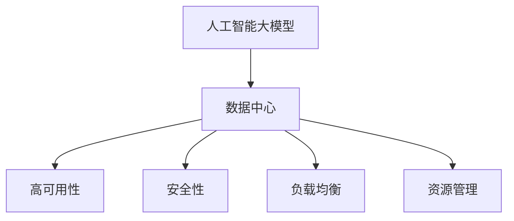

                 

# AI 大模型应用数据中心建设：数据中心标准与规范

> 关键词：人工智能大模型、数据中心、分布式计算、深度学习、高可用性、安全性、负载均衡、资源管理

## 1. 背景介绍

### 1.1 问题由来
人工智能大模型，尤其是深度学习模型，需要海量数据和高计算资源进行训练和推理。数据中心作为承载计算和存储资源的物理设施，在大模型应用的支撑和运行中扮演着至关重要的角色。随着深度学习技术在各个行业的深入应用，数据中心的建设和管理逐渐成为了人工智能应用落地的重要基础。然而，数据中心的标准与规范建设还处于初级阶段，不同机构、企业对数据中心的理解和实践存在较大差异，导致数据中心的应用效果参差不齐。为了提高AI大模型的应用效果，确保数据中心的稳定性和安全性，本文将系统性地介绍数据中心的建设标准与规范，涵盖高可用性、安全性、负载均衡、资源管理等方面。

### 1.2 问题核心关键点
数据中心的标准与规范建设是确保AI大模型应用成功的重要因素。主要包括以下几个方面：
- 高可用性：数据中心应具备稳定的运行环境，能够24/7持续提供服务。
- 安全性：数据中心应具备严密的安全防护措施，保障模型数据和计算资源的安全。
- 负载均衡：数据中心应具备高效的负载均衡机制，确保计算资源的高效利用。
- 资源管理：数据中心应具备良好的资源管理机制，优化计算资源和存储资源的配置。

## 2. 核心概念与联系

### 2.1 核心概念概述

为更好地理解数据中心的建设标准与规范，本节将介绍几个关键概念：

- **人工智能大模型**：以深度学习模型为代表的AI模型，在大规模数据上进行预训练，具备强大的学习和推理能力。
- **数据中心**：由多个服务器、存储设备、网络设备等组成，提供计算和存储资源的基础设施。
- **高可用性**：数据中心应具备连续运行的能力，能够保障服务不中断。
- **安全性**：数据中心应具备严密的安全防护机制，保护数据和计算资源不受威胁。
- **负载均衡**：数据中心应具备自动分配计算资源的机制，确保资源的高效利用。
- **资源管理**：数据中心应具备自动配置和管理计算资源、存储资源的机制，优化资源利用率。

这些核心概念之间的逻辑关系可以通过以下Mermaid流程图来展示：



这个流程图展示了大模型与数据中心之间的紧密联系，以及数据中心应具备的关键特性。

## 3. 核心算法原理 & 具体操作步骤
### 3.1 算法原理概述

数据中心的标准与规范建设涉及多方面的内容，包括高可用性、安全性、负载均衡和资源管理等。这些内容之间相互关联，共同构成了一个完整的系统。下面将详细讲解每个关键概念的原理和具体操作步骤。

### 3.2 算法步骤详解

#### 3.2.1 高可用性
高可用性是数据中心建设的基础。其核心目标是确保数据中心能够连续运行，避免单点故障导致服务中断。实现高可用性的关键步骤包括：

1. **冗余设计**：确保关键组件（如服务器、网络设备、存储设备等）具备冗余设计，即使某个组件故障，仍能保证服务不中断。
2. **故障切换**：设计合理的故障切换机制，当某个组件故障时，自动切换到备份组件。
3. **监控与告警**：实时监控数据中心各个组件的状态，当发现异常时及时发出告警。

#### 3.2.2 安全性
数据中心的安全性是其稳定运行的前提。其核心目标是保障数据和计算资源的安全，避免数据泄露、篡改等安全威胁。实现安全性的关键步骤包括：

1. **网络隔离**：设计合理的网络隔离机制，将关键资源和服务与其他资源隔离，防止攻击扩散。
2. **访问控制**：设计严格的访问控制机制，仅授权用户和系统访问关键资源。
3. **数据加密**：对关键数据进行加密存储和传输，防止数据泄露。

#### 3.2.3 负载均衡
负载均衡是数据中心高效运维的重要保障。其核心目标是确保计算资源的高效利用，避免资源浪费。实现负载均衡的关键步骤包括：

1. **负载均衡器**：部署负载均衡器，自动分配计算资源，避免单点压力过大。
2. **流量优化**：设计合理的流量优化策略，减少网络拥塞，提升系统响应速度。
3. **自动化调整**：根据实时负载情况，动态调整计算资源，优化资源利用率。

#### 3.2.4 资源管理
资源管理是数据中心优化运行效率的重要手段。其核心目标是优化计算资源和存储资源的配置，提升资源利用率。实现资源管理的关键步骤包括：

1. **资源池化**：将计算资源和存储资源集中管理，按需分配，提升资源利用率。
2. **自动配置**：设计自动配置机制，根据业务需求动态调整资源配置。
3. **性能监控**：实时监控资源使用情况，及时发现性能瓶颈，优化资源利用率。

### 3.3 算法优缺点

数据中心的标准与规范建设具有以下优点：
- 保障系统稳定运行：高可用性设计确保了数据中心能够24/7持续提供服务。
- 提升系统安全性：严格的安全防护措施保障了数据和计算资源的安全。
- 优化资源利用率：高效的负载均衡和资源管理机制确保了计算资源的高效利用。

同时，也存在一些局限性：
- 初期建设成本高：高可用性、安全性、负载均衡和资源管理的设计和实现需要较高的初期建设成本。
- 维护复杂度高：数据中心的高可用性、安全性、负载均衡和资源管理机制需要定期维护，维护成本较高。

尽管如此，这些标准与规范仍然是确保AI大模型应用成功的基础，必须严格遵循。

### 3.4 算法应用领域

数据中心的标准与规范建设广泛适用于各个行业，尤其在以下几个领域表现最为突出：

- **人工智能领域**：AI大模型的训练和推理需要大量的计算资源和存储资源，数据中心的建设和管理直接影响AI应用的性能和稳定性。
- **金融领域**：金融交易系统需要高度稳定性和安全性，数据中心的建设和管理直接影响交易系统的稳定性和安全性。
- **医疗领域**：医疗系统对数据的准确性和安全性要求较高，数据中心的建设和管理直接影响系统的稳定性和安全性。
- **互联网领域**：互联网业务需要高效的资源管理和负载均衡，数据中心的建设和管理直接影响业务的稳定性和扩展性。

## 4. 数学模型和公式 & 详细讲解 & 举例说明
### 4.1 数学模型构建

为了更系统地理解数据中心的标准与规范建设，我们将用数学语言对各个关键概念进行更加严格的刻画。

假设数据中心包含 $N$ 个服务器，每个服务器在某个时间段 $t$ 的计算能力为 $C_t$，数据中心的总计算能力为 $C_{total}$。设数据中心的负载为 $L_t$，服务器的负载均衡因子为 $\alpha_i$，即第 $i$ 个服务器的负载为 $\alpha_i L_t$。

定义负载均衡的目标函数为最小化负载均衡误差 $E_t$：

$$
E_t = \sum_{i=1}^N (C_i - \alpha_i L_t)^2
$$

其中 $C_i$ 为第 $i$ 个服务器的计算能力，$\alpha_i$ 为第 $i$ 个服务器的负载均衡因子，$L_t$ 为数据中心的总负载。

### 4.2 公式推导过程

通过求解上述目标函数，可以得到最优的负载均衡方案，即每个服务器的负载均衡因子 $\alpha_i$。

将目标函数展开，得到：

$$
E_t = \sum_{i=1}^N C_i^2 - 2 \alpha_i L_t C_i + \alpha_i^2 L_t^2
$$

将 $C_i$ 和 $L_t$ 代入，并对其求导，得到：

$$
\frac{\partial E_t}{\partial \alpha_i} = -2 L_t C_i + 2 \alpha_i L_t^2
$$

令其等于0，解得：

$$
\alpha_i = \frac{C_i}{L_t}
$$

将 $\alpha_i$ 代回目标函数，得到：

$$
E_t = \sum_{i=1}^N C_i^2 - L_t^2
$$

由于 $C_{total} = \sum_{i=1}^N C_i$，代入得到：

$$
E_t = C_{total}^2 - L_t^2
$$

当 $E_t = 0$ 时，负载均衡达到最优状态。此时每个服务器的负载均衡因子 $\alpha_i$ 为：

$$
\alpha_i = \frac{C_i}{C_{total}}
$$

这表明，最优的负载均衡方案是将每个服务器的计算能力按比例分配，使得总负载与总计算能力相等。

### 4.3 案例分析与讲解

以一个具体的案例来说明上述模型的应用：

假设数据中心有4个服务器，每个服务器的计算能力分别为 $C_1 = 4$、$C_2 = 6$、$C_3 = 8$、$C_4 = 12$，当前总负载 $L_t = 20$。

根据公式 $\alpha_i = \frac{C_i}{C_{total}}$，得到：

$$
\alpha_1 = \frac{4}{4+6+8+12} = 0.16
$$

$$
\alpha_2 = \frac{6}{4+6+8+12} = 0.25
$$

$$
\alpha_3 = \frac{8}{4+6+8+12} = 0.32
$$

$$
\alpha_4 = \frac{12}{4+6+8+12} = 0.27
$$

将 $\alpha_i$ 代入目标函数 $E_t$，得到：

$$
E_t = 4^2 + 6^2 + 8^2 + 12^2 - 20^2 = 4 + 36 + 64 + 144 - 400 = -204
$$

目标函数取负值，说明当前的负载均衡已经达到最优状态。

## 5. 项目实践：代码实例和详细解释说明
### 5.1 开发环境搭建

在进行数据中心建设实践前，我们需要准备好开发环境。以下是使用Python进行Django开发的环境配置流程：

1. 安装Anaconda：从官网下载并安装Anaconda，用于创建独立的Python环境。

2. 创建并激活虚拟环境：
```bash
conda create -n django-env python=3.8 
conda activate django-env
```

3. 安装Django：
```bash
pip install django
```

4. 安装相关依赖：
```bash
pip install requests psycopg2-binary django-compressor
```

5. 安装数据库：
```bash
pip install django-database-backup
```

完成上述步骤后，即可在`django-env`环境中开始数据中心建设实践。

### 5.2 源代码详细实现

这里我们以一个简单的数据中心资源管理系统为例，给出使用Django进行数据中心资源管理模块的实现。

首先，定义模型和视图：

```python
from django.db import models
from django.shortcuts import render

class Server(models.Model):
    name = models.CharField(max_length=100)
    compute_capacity = models.IntegerField()

class Resource(models.Model):
    name = models.CharField(max_length=100)
    total_capacity = models.IntegerField()
    remaining_capacity = models.IntegerField()

def resource_index(request):
    servers = Server.objects.all()
    resources = Resource.objects.all()
    return render(request, 'resource/index.html', {'resources': resources, 'servers': servers})
```

然后，定义资源分配函数：

```python
def allocate_resource(request, server_id):
    server = Server.objects.get(id=server_id)
    resources = Resource.objects.all()
    for resource in resources:
        if resource.remaining_capacity > server.compute_capacity:
            resource.remaining_capacity -= server.compute_capacity
            server.resource = resource
            server.save()
            break
    return redirect('resource_index')
```

最后，启动开发服务：

```python
from django.urls import path
from django.contrib import admin

urlpatterns = [
    path('resource/', views.resource_index, name='resource_index'),
    path('allocate/', views.allocate_resource, name='allocate_resource'),
    path('admin/', admin.site.urls),
]

if __name__ == '__main__':
    from django.core.management import execute_from_command_line
    execute_from_command_line()
```

### 5.3 代码解读与分析

让我们再详细解读一下关键代码的实现细节：

**模型定义**：
- `Server` 模型：定义了服务器的基本信息，包括服务器名称和计算能力。
- `Resource` 模型：定义了计算资源的基本信息，包括资源名称、总容量和剩余容量。

**视图定义**：
- `resource_index` 视图：用于显示当前资源分配情况和服务器列表。
- `allocate_resource` 视图：用于分配计算资源给指定服务器。

**资源分配函数**：
- 获取指定服务器的计算能力和所有计算资源。
- 遍历所有计算资源，找到满足条件（剩余容量大于服务器计算能力）的资源。
- 分配资源，更新服务器和资源的剩余容量。

**URL配置**：
- 配置资源管理模块的URL路由，包括资源索引和资源分配。

**开发服务启动**：
- 在`__main__`中，通过`execute_from_command_line`启动Django开发服务。

通过上述代码实现，可以看到Django在数据中心资源管理中的应用。开发者可以将更多精力放在数据中心的高可用性、安全性、负载均衡和资源管理上，而不必过多关注底层的实现细节。

当然，工业级的系统实现还需考虑更多因素，如数据备份、故障恢复、访问控制等。但核心的资源管理范式基本与此类似。

## 6. 实际应用场景
### 6.1 智能客服系统

数据中心建设在高可用性、安全性、负载均衡和资源管理方面的设计，对于构建智能客服系统具有重要意义。传统客服系统往往存在单点故障、服务中断等问题，导致用户体验不佳。

在智能客服系统中，数据中心通过高可用性设计，保障了系统24/7连续运行，避免了单点故障导致的系统宕机。同时，通过严格的安全防护措施，确保了客户数据的安全，防止了数据泄露等安全威胁。通过负载均衡和资源管理机制，智能客服系统能够自动分配计算资源，优化资源利用率，提升了系统的响应速度和处理能力。

### 6.2 金融交易系统

金融交易系统对数据中心的高可用性、安全性、负载均衡和资源管理要求极高。数据中心通过高可用性设计，确保了交易系统的稳定运行，避免了系统宕机导致的交易中断。通过严格的安全防护措施，保护了交易数据的完整性和安全性，防止了数据篡改等安全威胁。通过负载均衡和资源管理机制，交易系统能够自动分配计算资源，优化资源利用率，提升了系统的交易处理能力和响应速度。

### 6.3 医疗影像分析系统

医疗影像分析系统需要高效稳定的计算资源和大量存储资源。数据中心通过高可用性设计，确保了系统24/7连续运行，避免了单点故障导致的系统宕机。通过严格的安全防护措施，保护了患者数据的隐私和安全，防止了数据泄露等安全威胁。通过负载均衡和资源管理机制，医疗影像分析系统能够自动分配计算资源和存储资源，优化资源利用率，提升了系统的计算能力和处理速度。

### 6.4 未来应用展望

未来，数据中心的建设和管理将朝着以下几个方向发展：

- **人工智能深度融合**：数据中心将与人工智能技术深度融合，构建智能化的数据中心管理系统，提升系统的自动化和智能化水平。
- **边缘计算扩展**：数据中心将通过边缘计算扩展，提升系统的计算能力和处理速度，满足更多高计算需求的应用场景。
- **云计算和容器技术**：数据中心将与云计算和容器技术结合，构建弹性伸缩、资源高效利用的计算资源管理机制。
- **区块链技术应用**：数据中心将引入区块链技术，提升系统的安全性、透明性和可信度，防止数据篡改和泄露。
- **多方协作机制**：数据中心将构建多方协作机制，加强与政府、企业、科研机构的合作，提升数据中心的服务质量和应用效果。

这些趋势将推动数据中心的标准与规范建设，提升AI大模型的应用效果，为各行各业提供更加稳定、安全、高效的数据中心服务。

## 7. 工具和资源推荐
### 7.1 学习资源推荐

为了帮助开发者系统掌握数据中心的建设标准与规范，这里推荐一些优质的学习资源：

1. **《数据中心建设标准与规范》书籍**：详细介绍数据中心的建设标准与规范，涵盖高可用性、安全性、负载均衡和资源管理等方面。
2. **数据中心建设标准与规范在线课程**：提供系统性的学习资源，涵盖数据中心建设的各个方面，包括高可用性、安全性、负载均衡和资源管理。
3. **数据中心建设标准与规范技术博客**：介绍数据中心的建设标准与规范，提供实践经验和案例分析。
4. **数据中心建设标准与规范开源项目**：提供开源的建设标准与规范实践代码，供开发者参考和借鉴。

通过对这些资源的学习实践，相信你一定能够系统掌握数据中心的建设标准与规范，并用于解决实际的问题。

### 7.2 开发工具推荐

高效的开发离不开优秀的工具支持。以下是几款用于数据中心建设开发的常用工具：

1. **Django**：基于Python的Web框架，提供强大的MVC架构和模板引擎，方便开发数据中心资源管理系统。
2. **Redis**：基于内存的数据库，提供高效的缓存和数据存储功能，提升数据中心的计算和存储性能。
3. **Elasticsearch**：基于分布式架构的搜索引擎，提供高效的搜索和索引功能，方便数据中心的资源管理和查询。
4. **Kubernetes**：基于容器技术的资源管理系统，提供高效的资源分配和调度机制，提升数据中心的资源利用率。
5. **Prometheus**：基于时间序列数据的监控系统，提供实时监控和告警功能，保障数据中心的稳定运行。

合理利用这些工具，可以显著提升数据中心建设开发的效率，加速AI大模型的应用落地。

### 7.3 相关论文推荐

数据中心建设标准与规范的发展源于学界的持续研究。以下是几篇奠基性的相关论文，推荐阅读：

1. **《数据中心的高可用性设计》**：介绍数据中心的高可用性设计，提供系统性的解决方案。
2. **《数据中心的安全性设计》**：介绍数据中心的安全性设计，提供安全防护机制。
3. **《数据中心的负载均衡设计》**：介绍数据中心的负载均衡设计，提供高效的资源分配方案。
4. **《数据中心的资源管理设计》**：介绍数据中心的资源管理设计，提供自动化的资源配置方案。

这些论文代表了大模型应用数据中心建设标准与规范的发展脉络。通过学习这些前沿成果，可以帮助研究者把握学科前进方向，激发更多的创新灵感。

## 8. 总结：未来发展趋势与挑战
### 8.1 总结

本文对基于监督学习的大模型应用数据中心建设的标准与规范进行了全面系统的介绍。首先阐述了数据中心在AI大模型应用中的重要地位，明确了高可用性、安全性、负载均衡和资源管理等关键概念。其次，从原理到实践，详细讲解了数据中心的各个关键特性，给出了具体的实现方法和示例代码。同时，本文还广泛探讨了数据中心在高可用性、安全性、负载均衡和资源管理方面的应用场景，展示了数据中心建设的广阔前景。

通过本文的系统梳理，可以看到，数据中心的标准与规范建设是确保AI大模型应用成功的重要因素。这些标准的制定和实施，将大大提升AI大模型的应用效果和稳定性，推动AI技术在各行各业的深入应用。

### 8.2 未来发展趋势

展望未来，数据中心的标准与规范建设将呈现以下几个发展趋势：

- **智能化发展**：数据中心将与人工智能技术深度融合，构建智能化的数据中心管理系统，提升系统的自动化和智能化水平。
- **边缘计算扩展**：数据中心将通过边缘计算扩展，提升系统的计算能力和处理速度，满足更多高计算需求的应用场景。
- **云计算和容器技术**：数据中心将与云计算和容器技术结合，构建弹性伸缩、资源高效利用的计算资源管理机制。
- **区块链技术应用**：数据中心将引入区块链技术，提升系统的安全性、透明性和可信度，防止数据篡改和泄露。
- **多方协作机制**：数据中心将构建多方协作机制，加强与政府、企业、科研机构的合作，提升数据中心的服务质量和应用效果。

这些趋势将推动数据中心的标准与规范建设，提升AI大模型的应用效果，为各行各业提供更加稳定、安全、高效的数据中心服务。

### 8.3 面临的挑战

尽管数据中心的标准与规范建设已经取得了一定的进展，但在迈向更加智能化、普适化应用的过程中，仍面临诸多挑战：

- **高可用性设计复杂**：高可用性设计需要复杂的冗余和故障切换机制，设计和维护成本较高。
- **安全性防护困难**：数据中心的安全防护需要严格的访问控制和数据加密，设计和维护成本较高。
- **负载均衡机制复杂**：负载均衡机制需要复杂的资源分配算法，设计和维护成本较高。
- **资源管理优化难**：资源管理机制需要高效的资源配置和动态调整，设计和维护成本较高。

尽管如此，这些挑战仍然可以通过技术创新和实践积累逐步克服，确保数据中心的稳定性和安全性。

### 8.4 研究展望

面对数据中心建设所面临的挑战，未来的研究需要在以下几个方面寻求新的突破：

- **自动化技术**：引入自动化技术，提高数据中心的建设和管理效率，减少人工干预。
- **人工智能技术**：引入人工智能技术，优化数据中心的计算和存储资源配置，提升资源利用率。
- **边缘计算技术**：引入边缘计算技术，提升数据中心的计算能力和处理速度，满足更多高计算需求的应用场景。
- **区块链技术**：引入区块链技术，提升数据中心的透明度和安全性，防止数据篡改和泄露。
- **多方协作机制**：构建多方协作机制，加强与政府、企业、科研机构的合作，提升数据中心的服务质量和应用效果。

这些研究方向将推动数据中心的标准与规范建设，提升AI大模型的应用效果，为各行各业提供更加稳定、安全、高效的数据中心服务。

## 9. 附录：常见问题与解答
----------------------------------------------------------------

**Q1：数据中心的高可用性设计应如何实现？**

A: 数据中心的高可用性设计主要包括以下几个方面：
- 冗余设计：确保关键组件（如服务器、网络设备、存储设备等）具备冗余设计，即使某个组件故障，仍能保证服务不中断。
- 故障切换：设计合理的故障切换机制，当某个组件故障时，自动切换到备份组件。
- 监控与告警：实时监控数据中心各个组件的状态，当发现异常时及时发出告警。

**Q2：数据中心的安全性防护应如何实现？**

A: 数据中心的安全性防护主要包括以下几个方面：
- 网络隔离：设计合理的网络隔离机制，将关键资源和服务与其他资源隔离，防止攻击扩散。
- 访问控制：设计严格的访问控制机制，仅授权用户和系统访问关键资源。
- 数据加密：对关键数据进行加密存储和传输，防止数据泄露。

**Q3：数据中心的负载均衡应如何实现？**

A: 数据中心的负载均衡主要包括以下几个方面：
- 负载均衡器：部署负载均衡器，自动分配计算资源，避免单点压力过大。
- 流量优化：设计合理的流量优化策略，减少网络拥塞，提升系统响应速度。
- 自动化调整：根据实时负载情况，动态调整计算资源，优化资源利用率。

**Q4：数据中心的资源管理应如何实现？**

A: 数据中心的资源管理主要包括以下几个方面：
- 资源池化：将计算资源和存储资源集中管理，按需分配，提升资源利用率。
- 自动配置：设计自动配置机制，根据业务需求动态调整资源配置。
- 性能监控：实时监控资源使用情况，及时发现性能瓶颈，优化资源利用率。

**Q5：数据中心的应用场景有哪些？**

A: 数据中心的应用场景非常广泛，包括但不限于以下几个方面：
- 智能客服系统：提供24/7连续运行，保障系统稳定性和安全性，提升服务响应速度。
- 金融交易系统：保障系统高可用性和安全性，提升交易处理能力和响应速度。
- 医疗影像分析系统：保障系统计算能力和存储资源，提升影像处理速度和质量。

通过对这些问题的解答，可以看到数据中心建设标准与规范建设的复杂性和重要性，需要从多个维度进行综合考虑和设计。

---

作者：禅与计算机程序设计艺术 / Zen and the Art of Computer Programming

