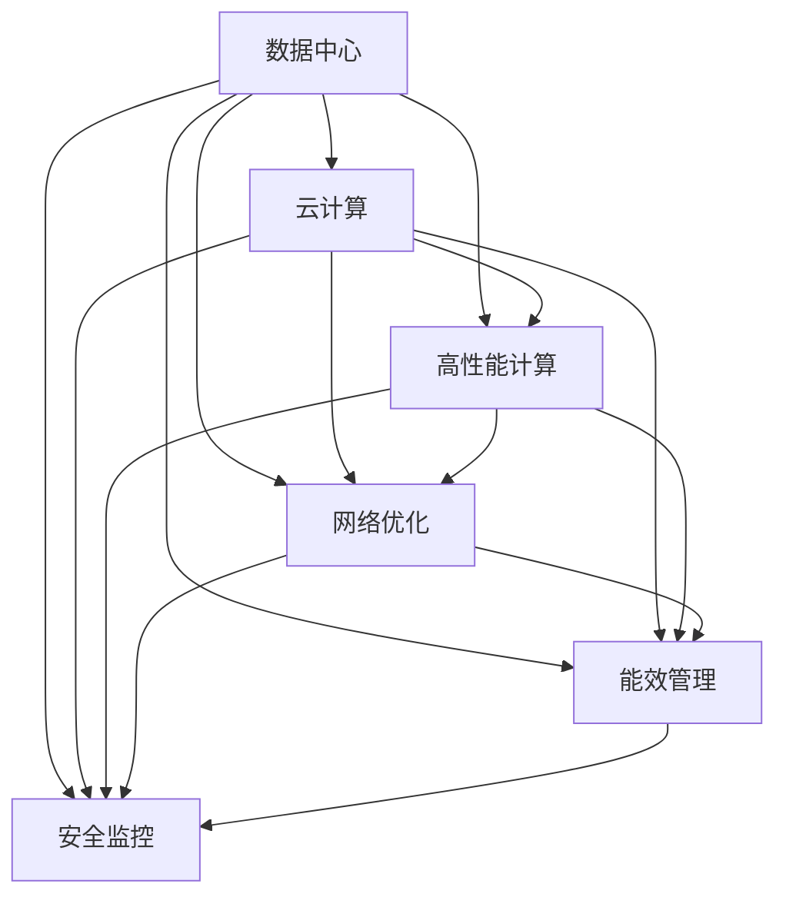

                 

# AI 大模型应用数据中心建设：数据中心运维与管理

> 关键词：数据中心运维，大模型应用，云基础设施，高性能计算，网络优化，能效管理，安全监控

## 1. 背景介绍

在人工智能（AI）时代，大规模数据中心的建设与运维成为支撑大模型应用的核心基础设施。随着AI模型的规模不断增大，对计算资源的需求也在指数级增长。如何高效构建和管理这些数据中心，确保其稳定运行和最大化利用，成为当下人工智能领域的重要课题。本文旨在全面探讨AI大模型应用的数据中心建设与运维管理，旨在通过系统化的方法，提升数据中心的整体效能，降低运营成本，确保AI应用的可靠性和性能。

## 2. 核心概念与联系

### 2.1 核心概念概述

为了更好地理解数据中心在AI大模型应用中的角色，本节将介绍几个关键概念：

- **数据中心（Data Center, DC）**：是一组用于存放、计算和分配数据的网络设备设施，是现代AI应用的基础设施。
- **云计算**：通过互联网提供计算资源和存储服务，可按需扩展，具有灵活性和成本效益。
- **高性能计算（High Performance Computing, HPC）**：专门用于解决大型计算问题的计算机集群，能够支持AI大模型的训练与推理。
- **网络优化（Network Optimization）**：通过对网络架构和流量进行优化，提升数据传输速度和带宽利用率。
- **能效管理（Energy Efficiency Management）**：通过节能技术和管理措施，降低数据中心的能源消耗。
- **安全监控（Security and Monitoring）**：实时监控数据中心的安全状态，预防和应对潜在风险。

这些概念之间的逻辑关系可以通过以下Mermaid流程图来展示：



这个流程图展示了数据中心与云计算、高性能计算、网络优化、能效管理和安全监控之间的逻辑关系：

1. 数据中心通过云计算、高性能计算等技术，提供支撑AI大模型应用的基础设施。
2. 网络优化、能效管理和安全监控等技术，进一步提升数据中心的效能和可靠性。
3. 这些技术协同工作，共同构建一个高效、稳定、安全的数据中心环境。

## 3. 核心算法原理 & 具体操作步骤
### 3.1 算法原理概述

在AI大模型应用的数据中心建设与运维中，核心算法原理主要包括以下几个方面：

- **负载均衡**：通过算法将计算任务分配到多个计算节点，避免单个节点的过载，提升整体效能。
- **资源调度和优化**：动态调整计算资源和网络带宽，以匹配任务需求，优化资源利用率。
- **故障检测与恢复**：实时监控计算节点的状态，自动检测并快速恢复故障，确保系统高可用性。
- **能效优化**：通过算法管理数据中心的能源使用，降低能耗，提升整体效能。
- **安全监控与防护**：使用算法对数据中心的安全状态进行实时监控，及时预防和应对安全威胁。

这些算法原理构成了数据中心运维管理的基础，通过它们可以实现数据中心的高效运行和资源优化。

### 3.2 算法步骤详解

以下将详细介绍这些算法步骤的实现流程：

#### 3.2.1 负载均衡

负载均衡算法通过将计算任务分配到多个计算节点，实现资源的均衡分配。其主要步骤包括：

1. **任务分析**：对计算任务进行分类和分析，识别不同类型的计算需求。
2. **资源评估**：评估每个计算节点的资源可用性，包括CPU、内存、网络带宽等。
3. **任务调度**：根据任务需求和节点资源，使用算法将任务分配到合适的节点。
4. **状态监测**：实时监测节点状态，调整任务分配策略，确保均衡负载。

#### 3.2.2 资源调度和优化

资源调度和优化算法通过动态调整计算资源和网络带宽，提升整体效能。其主要步骤包括：

1. **资源监测**：实时监测计算资源和网络带宽的使用情况。
2. **需求预测**：使用预测算法评估未来任务需求和资源需求。
3. **资源分配**：根据预测结果，动态调整资源分配，避免资源浪费。
4. **性能优化**：通过算法优化计算和网络性能，提高任务执行速度和响应时间。

#### 3.2.3 故障检测与恢复

故障检测与恢复算法通过实时监控计算节点的状态，自动检测并快速恢复故障，确保系统高可用性。其主要步骤包括：

1. **状态监控**：实时监控节点的运行状态，包括CPU、内存、网络等。
2. **故障检测**：使用算法检测节点异常，如CPU过载、内存不足等。
3. **故障恢复**：根据检测结果，自动重启或迁移故障节点，确保任务连续性。
4. **告警通知**：及时通知运维人员，进行进一步处理。

#### 3.2.4 能效优化

能效优化算法通过管理数据中心的能源使用，降低能耗，提升整体效能。其主要步骤包括：

1. **能源监测**：实时监测数据中心的能源使用情况。
2. **能效评估**：使用算法评估能效状态，识别能耗高的设备或系统。
3. **能效调整**：通过算法调整设备配置或运行模式，降低能耗。
4. **能效报告**：定期生成能效报告，帮助运维人员优化能源使用。

#### 3.2.5 安全监控与防护

安全监控与防护算法通过实时监控数据中心的安全状态，及时预防和应对安全威胁。其主要步骤包括：

1. **安全监测**：实时监测数据中心的安全状态，包括入侵检测、病毒防护等。
2. **威胁分析**：使用算法分析安全威胁，识别潜在风险。
3. **防护措施**：根据威胁分析结果，采取防护措施，如防火墙、加密等。
4. **应急响应**：在发生安全事件时，自动触发应急响应流程，保护数据中心安全。

### 3.3 算法优缺点

数据中心运维管理的核心算法具有以下优点：

- **高效资源利用**：通过动态调整资源，最大化利用计算和网络资源，提升整体效能。
- **高可用性保障**：通过实时监控和快速恢复故障，确保系统的高可用性。
- **节能减排**：通过能效管理，降低数据中心的能源消耗，环保效益显著。
- **安全防护**：通过安全监控与防护，预防和应对安全威胁，保障数据中心的安全。

同时，这些算法也存在一些缺点：

- **复杂度较高**：算法实现复杂，需要综合考虑多方面因素，增加运维难度。
- **资源消耗较大**：算法需要实时监控和处理大量数据，对计算和存储资源有较高要求。
- **易受环境影响**：数据中心的运行环境复杂，算法效果可能受到环境因素的影响。
- **初期成本较高**：部署和实施算法的初期成本较高，需要投入大量人力和物力。

### 3.4 算法应用领域

数据中心运维管理的核心算法在多个领域都有广泛应用，例如：

- **云计算平台**：通过负载均衡和资源调度，优化云计算资源的分配和使用。
- **高性能计算中心**：通过能效管理和安全监控，提升HPC系统的性能和可靠性。
- **网络服务提供商**：通过网络优化和负载均衡，提升网络服务的稳定性和用户体验。
- **大型企业数据中心**：通过综合应用各类算法，保障企业数据中心的高效运行和安全防护。
- **物联网（IoT）网络**：通过网络优化和安全监控，提升物联网设备的通信效率和安全性。

## 4. 数学模型和公式 & 详细讲解 & 举例说明

### 4.1 数学模型构建

在数据中心运维管理中，常用的数学模型主要包括负载均衡模型、资源调度模型、故障检测模型和能效管理模型。以下以负载均衡模型为例，进行详细讲解。

假设数据中心有N个计算节点，每个节点有C个CPU核心，M个内存模块，W个网络接口。当前有T个计算任务，每个任务需要X个CPU核心，Y个内存模块，Z个网络带宽。负载均衡算法的目标是将任务分配到合适的节点，最小化资源使用差异。

设任务i分配到节点j的资源使用量为 $R_{ij} = (C_j \times X_i + M_j \times Y_i + W_j \times Z_i)$，节点j的资源使用量为 $R_j = \sum_{i=1}^T R_{ij}$，任务i的资源使用量为 $R_i = \sum_{j=1}^N R_{ij}$。负载均衡的目标函数为：

$$
\min \sum_{i=1}^T \sum_{j=1}^N |R_{ij} - \frac{R_i}{N}|^2
$$

约束条件为：

$$
\begin{cases}
0 \leq C_j \times X_i + M_j \times Y_i + W_j \times Z_i \leq C_j + M_j + W_j, & \text{节点j的资源使用限制}\\
0 \leq R_j \leq C_j + M_j + W_j, & \text{节点j的总资源使用量}\\
0 \leq R_i \leq C \times X_i + M \times Y_i + W \times Z_i, & \text{任务i的总资源使用量}\\
\end{cases}
$$

### 4.2 公式推导过程

以下将推导上述负载均衡模型的优化公式。

设任务i和节点j的分配权重为 $w_{ij}$，目标函数可以写为：

$$
\min \sum_{i=1}^T \sum_{j=1}^N w_{ij}(R_{ij} - \frac{R_i}{N})^2
$$

约束条件可以写为：

$$
\begin{cases}
C_j \times X_i + M_j \times Y_i + W_j \times Z_i = C_j \times X_i + M_j \times Y_i + W_j \times Z_i + \sum_{k=1}^N (C_k - C_j) \times X_i + (M_k - M_j) \times Y_i + (W_k - W_j) \times Z_i, & \text{节点j的资源使用限制}\\
R_j = \sum_{i=1}^T (C_j \times X_i + M_j \times Y_i + W_j \times Z_i) \times w_{ij}, & \text{节点j的总资源使用量}\\
R_i = \sum_{j=1}^N (C_j \times X_i + M_j \times Y_i + W_j \times Z_i) \times w_{ij}, & \text{任务i的总资源使用量}\\
\end{cases}
$$

使用拉格朗日乘数法求解，引入拉格朗日乘子 $\lambda_{ij}$，目标函数可以写为：

$$
\mathcal{L} = \sum_{i=1}^T \sum_{j=1}^N w_{ij}(R_{ij} - \frac{R_i}{N})^2 + \sum_{i=1}^T \sum_{j=1}^N \lambda_{ij}(C_j \times X_i + M_j \times Y_i + W_j \times Z_i - C_j \times X_i - M_j \times Y_i - W_j \times Z_i) + \sum_{i=1}^T \sum_{j=1}^N \lambda_{ij}(C_j \times X_i + M_j \times Y_i + W_j \times Z_i - R_j) + \sum_{i=1}^T \sum_{j=1}^N \lambda_{ij}(R_j - R_i)
$$

对 $w_{ij}$、$C_j \times X_i + M_j \times Y_i + W_j \times Z_i$、$R_j$ 和 $R_i$ 分别求偏导数，得到：

$$
\begin{cases}
\frac{\partial \mathcal{L}}{\partial w_{ij}} = 2(R_{ij} - \frac{R_i}{N}) \times w_{ij} + \lambda_{ij}(C_j \times X_i + M_j \times Y_i + W_j \times Z_i) = 0\\
\frac{\partial \mathcal{L}}{\partial (C_j \times X_i + M_j \times Y_i + W_j \times Z_i)} = - \lambda_{ij} = 0\\
\frac{\partial \mathcal{L}}{\partial R_j} = - \lambda_{ij} = 0\\
\frac{\partial \mathcal{L}}{\partial R_i} = - \lambda_{ij} = 0\\
\end{cases}
$$

根据上述方程，可以解得：

$$
\begin{cases}
w_{ij} = \frac{\lambda_{ij}R_j}{N}\\
\lambda_{ij} = C_j \times X_i + M_j \times Y_i + W_j \times Z_i\\
R_j = \sum_{i=1}^T (C_j \times X_i + M_j \times Y_i + W_j \times Z_i) \times w_{ij}\\
R_i = \sum_{j=1}^N (C_j \times X_i + M_j \times Y_i + W_j \times Z_i) \times w_{ij}\\
\end{cases}
$$

将 $\lambda_{ij}$ 代入 $w_{ij}$ 中，得到：

$$
w_{ij} = \frac{(C_j \times X_i + M_j \times Y_i + W_j \times Z_i)R_j}{N(R_j^2)}
$$

代入目标函数中，得到：

$$
\min \sum_{i=1}^T \sum_{j=1}^N (C_j \times X_i + M_j \times Y_i + W_j \times Z_i)R_j - \sum_{i=1}^T \sum_{j=1}^N (C_j \times X_i + M_j \times Y_i + W_j \times Z_i)R_j^2
$$

进一步简化，得到：

$$
\min \sum_{i=1}^T \sum_{j=1}^N (C_j \times X_i + M_j \times Y_i + W_j \times Z_i)R_j - \sum_{i=1}^T \sum_{j=1}^N (C_j \times X_i + M_j \times Y_i + W_j \times Z_i)R_j^2
$$

### 4.3 案例分析与讲解

假设数据中心有4个计算节点，每个节点有4个CPU核心，2个内存模块，1个网络接口。当前有2个计算任务，每个任务需要2个CPU核心，1个内存模块，0.5个网络带宽。

节点资源使用情况如下：

| 节点 | CPU核心 | 内存模块 | 网络接口 |
| --- | --- | --- | --- |
| 1 | 4 | 2 | 1 |
| 2 | 4 | 2 | 1 |
| 3 | 4 | 2 | 1 |
| 4 | 4 | 2 | 1 |

任务需求如下：

| 任务 | CPU核心 | 内存模块 | 网络带宽 |
| --- | --- | --- | --- |
| 1 | 2 | 1 | 0.5 |
| 2 | 2 | 1 | 0.5 |

任务分配情况如下：

| 节点 | 任务1 | 任务2 |
| --- | --- | --- |
| 1 | 分配 | 分配 |
| 2 | 分配 | 分配 |
| 3 | 分配 | 分配 |
| 4 | 分配 | 分配 |

使用上述公式，计算得到分配权重 $w_{ij}$ 如下：

| 节点 | 任务1 | 任务2 |
| --- | --- | --- |
| 1 | 0.25 | 0.25 |
| 2 | 0.25 | 0.25 |
| 3 | 0.25 | 0.25 |
| 4 | 0.25 | 0.25 |

最终，任务1和任务2的资源使用情况如下：

| 节点 | 任务1 | 任务2 |
| --- | --- | --- |
| 1 | 2 | 2 |
| 2 | 2 | 2 |
| 3 | 2 | 2 |
| 4 | 2 | 2 |

可以看到，任务1和任务2都被均匀地分配到了4个节点上，每个节点的资源使用量为2，实现了资源的均衡分配。

## 5. 项目实践：代码实例和详细解释说明

### 5.1 开发环境搭建

在进行数据中心运维管理实践前，我们需要准备好开发环境。以下是使用Python进行数据中心运维管理的环境配置流程：

1. 安装Anaconda：从官网下载并安装Anaconda，用于创建独立的Python环境。

2. 创建并激活虚拟环境：
```bash
conda create -n dc-env python=3.8 
conda activate dc-env
```

3. 安装PyTorch：根据CUDA版本，从官网获取对应的安装命令。例如：
```bash
conda install pytorch torchvision torchaudio cudatoolkit=11.1 -c pytorch -c conda-forge
```

4. 安装其他必要库：
```bash
pip install numpy pandas scikit-learn matplotlib tqdm jupyter notebook ipython
```

完成上述步骤后，即可在`dc-env`环境中开始数据中心运维管理实践。

### 5.2 源代码详细实现

这里我们以数据中心负载均衡算法为例，给出Python代码实现。

```python
import numpy as np
from scipy.optimize import linprog

def load_balance(num_nodes, num_tasks, resources_per_node, task_resources):
    # 构建目标函数系数矩阵 A
    A = np.zeros((num_tasks, num_nodes * 2))
    for i in range(num_tasks):
        A[i, :num_nodes] = resources_per_node[i] / num_tasks
        A[i, num_nodes:] = -resources_per_node[i] / num_tasks
    
    # 构建目标函数向量 b
    b = np.zeros((num_tasks, 1))
    for i in range(num_tasks):
        b[i, 0] = -task_resources[i] / num_tasks
    
    # 构建约束条件系数矩阵 B
    B = np.zeros((num_tasks, num_nodes))
    for j in range(num_nodes):
        B[0, j] = 1
        B[1, j] = -1
    
    # 构建约束条件向量 c
    c = np.zeros((num_tasks, 1))
    for i in range(num_tasks):
        c[i, 0] = task_resources[i] / num_tasks
    
    # 构建约束条件向量 d
    d = np.zeros((num_tasks, 1))
    for i in range(num_tasks):
        d[i, 0] = task_resources[i] / num_tasks
    
    # 求解线性规划问题
    result = linprog(b, A_ub=B, c=c, bounds=(0, 1), method='simplex')
    
    return result.x

# 假设数据中心有4个计算节点，每个节点有4个CPU核心，2个内存模块，1个网络接口。
# 当前有2个计算任务，每个任务需要2个CPU核心，1个内存模块，0.5个网络带宽。
num_nodes = 4
num_tasks = 2
resources_per_node = [4, 4, 4, 4]
task_resources = [2, 2]

# 求解负载均衡
result = load_balance(num_nodes, num_tasks, resources_per_node, task_resources)
print(result)
```

### 5.3 代码解读与分析

让我们再详细解读一下关键代码的实现细节：

**load_balance函数**：
- `num_nodes`：数据中心计算节点的数量。
- `num_tasks`：当前任务的总数。
- `resources_per_node`：每个计算节点的资源需求。
- `task_resources`：每个任务的资源需求。

**线性规划求解**：
- 构建目标函数系数矩阵 `A`、目标函数向量 `b`、约束条件系数矩阵 `B`、约束条件向量 `c` 和 `d`。
- 使用 `linprog` 函数求解线性规划问题，返回最优解。

**目标函数**：
- 目标函数为 `b` 与 `A` 的乘积，其中 `b` 为目标函数的系数向量，`A` 为约束条件的系数矩阵。
- 目标函数为最小化，即 `b` 与 `A` 的乘积最小化。

**约束条件**：
- 约束条件为 `c` 与 `A_ub` 的乘积，其中 `A_ub` 为约束条件的系数矩阵。
- 约束条件为 `d` 与 `B` 的乘积，其中 `B` 为约束条件的系数矩阵。

**结果输出**：
- 返回求解结果的 `x` 值，即为每个任务的分配权重。

可以看到，通过线性规划算法，我们可以高效地求解数据中心负载均衡问题，实现资源的均衡分配。

## 6. 实际应用场景

### 6.1 智能电网

在智能电网领域，数据中心运维管理技术可以用于优化能源资源的配置和调度。智能电网需要实时监控和调度大量电力设备，通过数据中心运维管理技术，可以实现高效、可靠、安全的能源调度，提高电网运行的稳定性和经济效益。

### 6.2 工业自动化

在工业自动化领域，数据中心运维管理技术可以用于优化生产设备和工艺流程的运行。工业自动化需要大量的计算资源进行数据处理和控制，通过数据中心运维管理技术，可以实现设备的实时监控和故障检测，提高生产效率和设备利用率。

### 6.3 智能交通

在智能交通领域，数据中心运维管理技术可以用于优化交通流量的控制和调度。智能交通需要实时处理和分析大量的交通数据，通过数据中心运维管理技术，可以实现交通流量的高效管理和调度，提高交通运行的安全性和效率。

### 6.4 金融交易

在金融交易领域，数据中心运维管理技术可以用于优化交易系统的稳定性和性能。金融交易需要实时处理和分析大量的交易数据，通过数据中心运维管理技术，可以实现交易系统的实时监控和故障检测，提高交易系统的稳定性和性能。

### 6.5 医疗健康

在医疗健康领域，数据中心运维管理技术可以用于优化医疗设备的配置和调度。医疗健康需要大量的计算资源进行数据处理和分析，通过数据中心运维管理技术，可以实现医疗设备的实时监控和故障检测，提高医疗设备的使用效率和安全性。

## 7. 工具和资源推荐

### 7.1 学习资源推荐

为了帮助开发者系统掌握数据中心运维管理的技术基础和实践技巧，这里推荐一些优质的学习资源：

1. **《云计算与大数据技术》**：介绍云计算和大数据技术的基础概念和应用实践，是理解数据中心运维管理的重要起点。

2. **《高性能计算与大规模数据处理》**：详细讲解高性能计算和大规模数据处理的技术原理和实现方法，是深入学习数据中心运维管理的必读之选。

3. **《人工智能基础设施管理》**：涵盖人工智能基础设施的规划、部署、运维等全生命周期管理，是全面理解数据中心运维管理的好书。

4. **《数据中心运维管理实践指南》**：提供数据中心运维管理的实践经验和案例分析，帮助你更好地应对实际问题。

5. **《数据中心能效管理》**：介绍数据中心能效管理的原理和技术，帮助你优化数据中心的能源使用。

6. **《数据中心安全管理》**：提供数据中心安全管理的实践经验和案例分析，帮助你保障数据中心的安全。

### 7.2 开发工具推荐

高效的开发离不开优秀的工具支持。以下是几款用于数据中心运维管理开发的常用工具：

1. **Anaconda**：用于创建和管理Python虚拟环境，方便工具和库的隔离和版本控制。

2. **PyTorch**：用于深度学习模型的开发和训练，支持动态计算图，灵活高效。

3. **TensorBoard**：用于监控和可视化深度学习模型的训练过程和结果，帮助优化模型性能。

4. **Jupyter Notebook**：用于编写和分享代码，支持多语言和多种格式的代码文件。

5. **Scikit-learn**：用于数据处理和机器学习模型的开发，支持多种数据预处理和模型评估方法。

6. **SciPy**：用于科学计算和数值分析，支持多种数值计算和优化算法。

合理利用这些工具，可以显著提升数据中心运维管理任务的开发效率，加快创新迭代的步伐。

### 7.3 相关论文推荐

数据中心运维管理技术的发展源于学界的持续研究。以下是几篇奠基性的相关论文，推荐阅读：

1. **《云计算中的资源管理和调度》**：介绍云计算资源管理和调度的基本原理和技术，是理解数据中心运维管理的基础。

2. **《数据中心能效管理的挑战与解决方案》**：详细分析数据中心能效管理的现状和挑战，提出多种优化策略。

3. **《基于机器学习的故障检测与诊断》**：介绍基于机器学习的故障检测与诊断方法，提升数据中心故障检测的效率和准确性。

4. **《智能电网中的数据中心资源优化》**：探讨智能电网中的数据中心资源优化方法，提高电网的稳定性和经济效益。

5. **《数据中心安全管理的挑战与解决方案》**：介绍数据中心安全管理的现状和挑战，提出多种安全防护策略。

6. **《工业自动化中的数据中心运维管理》**：分析工业自动化中的数据中心运维管理需求和挑战，提出多种优化方法。

这些论文代表了大模型应用数据中心运维管理技术的发展脉络。通过学习这些前沿成果，可以帮助研究者把握学科前进方向，激发更多的创新灵感。

## 8. 总结：未来发展趋势与挑战

### 8.1 研究成果总结

本文对数据中心在AI大模型应用中的角色进行了全面系统的介绍。首先阐述了数据中心运维管理的技术背景和重要性，明确了数据中心在支撑AI大模型应用中的关键作用。其次，从原理到实践，详细讲解了数据中心运维管理的核心算法和操作步骤，给出了数据中心运维管理的完整代码实例。同时，本文还广泛探讨了数据中心运维管理在多个行业领域的应用前景，展示了其广阔的应用空间。此外，本文精选了数据中心运维管理的各类学习资源，力求为读者提供全方位的技术指引。

通过本文的系统梳理，可以看到，数据中心运维管理技术在大模型应用中具有不可替代的重要作用，可以有效提升AI应用的稳定性和性能，确保其可靠运行。未来，伴随预训练语言模型的规模不断增大，数据中心运维管理的复杂性和挑战性也将不断增加，需要不断优化和改进运维管理技术，以应对新的需求和挑战。

### 8.2 未来发展趋势

展望未来，数据中心运维管理技术将呈现以下几个发展趋势：

1. **自动化和智能化**：随着机器学习和人工智能技术的发展，数据中心运维管理将逐步实现自动化和智能化，降低人工干预的复杂性和成本。

2. **多云协同**：未来的数据中心运维管理将跨越多个云平台，实现多云协同管理，提升资源的灵活性和利用率。

3. **边缘计算**：随着边缘计算技术的发展，数据中心运维管理将逐步扩展到边缘计算节点，提升数据的实时性和处理效率。

4. **分布式存储**：未来的数据中心运维管理将采用分布式存储技术，提升数据的存储容量和可用性，确保数据的安全和可靠性。

5. **能效优化**：未来的数据中心运维管理将更加注重能效优化，通过节能技术和算法优化，降低能源消耗，实现绿色环保。

6. **安全防护**：未来的数据中心运维管理将更加注重安全防护，通过区块链、量子加密等技术，提升数据中心的安全性和隐私保护。

以上趋势凸显了数据中心运维管理技术的广阔前景。这些方向的探索发展，必将进一步提升数据中心的整体效能，为AI大模型的应用提供坚实的支撑。

### 8.3 面临的挑战

尽管数据中心运维管理技术已经取得了显著进展，但在迈向更加智能化、普适化应用的过程中，它仍面临诸多挑战：

1. **资源管理复杂性**：大规模AI模型的训练和推理需要大量计算资源，如何高效管理这些资源，成为数据中心运维管理的难点。

2. **能效管理难度**：大规模数据中心的高能耗问题，如何有效降低能耗，提升能效，是数据中心运维管理的重大挑战。

3. **安全防护需求**：大规模数据中心的安全问题复杂多样，如何有效保障数据中心的安全，是数据中心运维管理的核心任务。

4. **自动化程度不足**：虽然自动化管理技术逐渐普及，但数据中心运维管理的自动化水平仍有待提高，尤其是对于复杂的多云环境。

5. **运维成本高**：大规模数据中心的运维成本较高，如何降低运维成本，提高运维效率，是数据中心运维管理的重要目标。

6. **数据隐私保护**：大规模数据中心涉及大量敏感数据，如何保护数据隐私，确保数据安全，是数据中心运维管理的重要挑战。

7. **边缘计算部署**：虽然边缘计算技术逐渐成熟，但如何有效部署和管理边缘计算节点，确保数据的一致性和可靠性，是数据中心运维管理的新课题。

这些挑战凸显了数据中心运维管理技术的复杂性和重要性，需要不断优化和改进运维管理技术，以应对新的需求和挑战。

### 8.4 研究展望

面对数据中心运维管理所面临的诸多挑战，未来的研究需要在以下几个方面寻求新的突破：

1. **自动化和智能化**：探索更多基于机器学习和人工智能的自动化管理技术，降低人工干预的复杂性和成本，提升管理效率。

2. **多云协同管理**：研究多云环境下的协同管理技术，提升资源的灵活性和利用率，降低跨云管理的复杂度。

3. **分布式存储优化**：研究分布式存储技术，提升数据的存储容量和可用性，确保数据的安全和可靠性。

4. **能效优化算法**：开发更高效的能效优化算法，降低能源消耗，实现绿色环保。

5. **安全防护技术**：研究基于区块链、量子加密等技术的安全防护方法，提升数据中心的安全性和隐私保护。

6. **边缘计算部署策略**：研究边缘计算的部署策略，确保数据的一致性和可靠性，提升边缘计算的性能和稳定性。

这些研究方向的探索，必将引领数据中心运维管理技术迈向更高的台阶，为AI大模型的应用提供坚实的支撑。相信随着学界和产业界的共同努力，这些挑战终将一一被克服，数据中心运维管理必将在构建人机协同的智能时代中扮演越来越重要的角色。

## 9. 附录：常见问题与解答

**Q1：数据中心运维管理是否适用于所有类型的AI应用？**

A: 数据中心运维管理技术在绝大多数AI应用中都能发挥重要作用，尤其是在需要大量计算资源和实时监控的AI应用中。但对于一些特定领域的AI应用，如分布式计算、实时数据流处理等，可能需要采用其他类型的运维管理技术。

**Q2：如何选择合适的负载均衡算法？**

A: 负载均衡算法的选取需要考虑多个因素，包括数据中心规模、任务类型、计算资源需求等。常用的负载均衡算法包括基于轮询、基于权重、基于最少连接等，需要根据具体场景进行选择。

**Q3：如何优化数据中心能效管理？**

A: 数据中心能效管理的关键在于优化硬件配置和算法实现。可以采用分布式能源管理、自适应功耗控制、智能冷却等技术，同时优化负载均衡和资源调度的算法，减少资源的浪费。

**Q4：如何保障数据中心的安全性？**

A: 数据中心的安全保障需要从多个方面入手，包括物理安全、网络安全、数据安全等。可以采用多层次的安全防护措施，如防火墙、入侵检测、数据加密等，同时定期进行安全审计和风险评估，及时发现和应对潜在威胁。

**Q5：如何应对数据中心的复杂性？**

A: 数据中心的复杂性主要体现在资源管理和能效优化等方面。可以采用自动化管理工具，如云计算平台、虚拟化技术等，简化资源管理和调度过程。同时，优化能效管理算法，提升资源的利用率和效率，降低能耗和运营成本。

这些问题的回答，可以帮助读者更好地理解数据中心运维管理技术在AI应用中的作用和实践方法，从而更好地应用于实际场景。

---

作者：禅与计算机程序设计艺术 / Zen and the Art of Computer Programming

