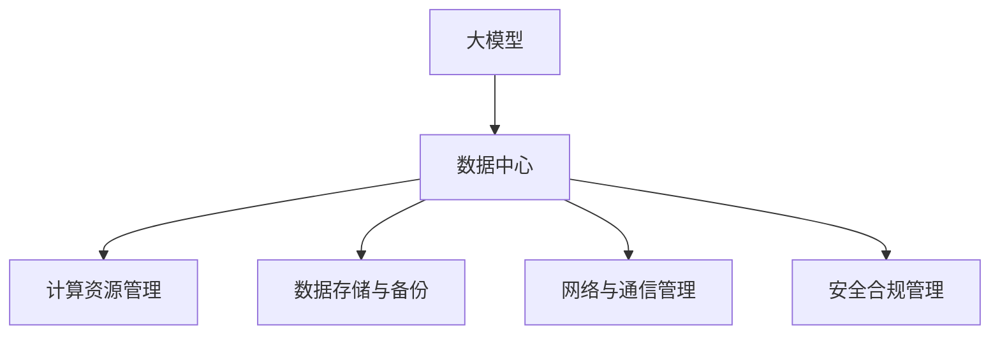

                 

# AI 大模型应用数据中心建设：数据中心运营与管理

> 关键词：大模型, AI 数据中心, 数据中心运营, 数据管理, 安全合规

## 1. 背景介绍

### 1.1 问题由来
随着人工智能技术的迅猛发展，大模型（如 GPT、BERT 等）在自然语言处理（NLP）、计算机视觉（CV）、语音识别等领域的应用日益广泛。然而，这些大模型的训练和应用，需要庞大的计算资源和数据存储，这使得数据中心成为不可或缺的基础设施。如何高效、安全、稳定地运营和管理这些数据中心，成为了 AI 大模型应用的关键问题。

### 1.2 问题核心关键点
- **计算资源管理**：如何高效利用数据中心的计算资源，确保模型训练和推理的高效性和经济性。
- **数据存储与备份**：如何安全、可靠地存储和备份模型数据，确保数据完整性和可恢复性。
- **网络与通信管理**：如何优化数据中心的网络和通信架构，提高数据传输效率和系统稳定性。
- **安全合规管理**：如何制定和执行数据中心的安全合规政策，确保数据中心的合规性，保护用户隐私和数据安全。

## 2. 核心概念与联系

### 2.1 核心概念概述

为了更好地理解 AI 大模型应用数据中心的运营与管理，本节将介绍几个密切相关的核心概念：

- **大模型（Large Models）**：指通过大规模数据集进行预训练，学习到复杂语言或图像表示的神经网络模型，如 GPT、BERT、DALL-E 等。
- **数据中心（Data Center）**：指提供高性能计算和存储资源，用于大规模数据处理和模型训练的物理设施。
- **计算资源管理**：指对数据中心中的 CPU、GPU、内存等计算资源的分配、调度和管理。
- **数据存储与备份**：指对模型数据进行存储、复制和备份，确保数据的完整性和可靠性。
- **网络与通信管理**：指对数据中心内部的网络和通信链路进行优化和维护，提高数据传输效率和系统稳定性。
- **安全合规管理**：指制定和执行数据中心的安全合规政策，确保数据中心的合规性，保护用户隐私和数据安全。

这些核心概念之间的逻辑关系可以通过以下 Mermaid 流程图来展示：



这个流程图展示了大模型应用数据中心的核心概念及其之间的关系：

1. 大模型通过数据中心的计算资源进行训练和推理。
2. 数据中心提供计算资源、存储资源和网络资源，支持大模型的高效运行。
3. 数据中心的各个子系统（如计算资源、存储、网络、安全等）之间相互作用，共同保障大模型的正常运行。

## 3. 核心算法原理 & 具体操作步骤

### 3.1 算法原理概述

AI 大模型应用数据中心的运营与管理，本质上是对数据中心的资源、数据、网络和安全进行综合调度和优化。其核心思想是：通过科学的管理手段和技术手段，最大化利用数据中心的资源，提高大模型的训练和推理效率，确保数据的安全性和合规性。

形式化地，假设数据中心有 $C$ 个计算资源、$S$ 个存储资源和 $N$ 个网络节点，则数据中心的运营目标可以表示为：

$$
\text{Optimize}(C, S, N) \text{ to maximize } \sum_{i=1}^{m} \text{Training}_i \times \text{Inference}_i
$$

其中 $m$ 是大模型的数量，$\text{Training}_i$ 和 $\text{Inference}_i$ 分别是第 $i$ 个大模型的训练和推理需求。

### 3.2 算法步骤详解

AI 大模型应用数据中心的运营与管理，一般包括以下几个关键步骤：

**Step 1: 评估资源需求**

- 评估大模型的训练和推理需求，包括 CPU、GPU、内存、带宽等。
- 收集历史数据中心的使用情况，分析资源的利用率和瓶颈。

**Step 2: 资源调度与优化**

- 根据评估结果，设计数据中心的资源调度策略，如资源池、任务调度等。
- 使用集群管理系统（如 Kubernetes、Hadoop 等）进行资源分配和调度。

**Step 3: 数据存储与备份**

- 设计高效的数据存储架构，如分布式存储、冷热数据分层等。
- 实施数据备份策略，确保数据的可靠性和可恢复性。

**Step 4: 网络与通信管理**

- 优化数据中心的网络架构，如构建高速互联网络、实施负载均衡等。
- 监测网络性能，及时发现和解决网络问题。

**Step 5: 安全合规管理**

- 制定数据中心的安全合规政策，包括访问控制、数据加密、审计等。
- 定期进行安全合规检查，确保数据中心的安全合规性。

**Step 6: 监测与优化**

- 实时监测数据中心的各项指标，如资源利用率、网络带宽、安全状况等。
- 根据监测结果，及时调整和优化资源配置。

### 3.3 算法优缺点

AI 大模型应用数据中心的运营与管理，具有以下优点：

1. **资源利用率高**：通过科学调度和管理，最大化利用数据中心的计算和存储资源。
2. **安全性高**：通过严格的安全合规管理，保障数据中心的安全性和用户隐私。
3. **可靠性高**：通过高效的数据存储和备份，确保数据的安全性和可恢复性。
4. **灵活性高**：通过现代化的管理手段，如 Kubernetes、Hadoop，实现资源的灵活配置。

同时，该方法也存在一定的局限性：

1. **成本高**：初期建设和管理数据中心需要大量资金投入。
2. **复杂度高**：数据中心的管理涉及多个系统，需要综合考虑各种因素。
3. **技术门槛高**：需要具备较强的技术背景和实践经验。
4. **响应速度慢**：当系统出现问题时，恢复速度较慢。

尽管存在这些局限性，但就目前而言，这种数据中心的运营与管理方法仍是大模型应用的主流范式。未来相关研究的重点在于如何进一步降低成本、提高效率、简化管理，同时兼顾安全性和可靠性等因素。

### 3.4 算法应用领域

AI 大模型应用数据中心的运营与管理，已经在多个领域得到了应用，例如：

- **自然语言处理（NLP）**：通过大模型进行文本分类、情感分析、机器翻译等任务。
- **计算机视觉（CV）**：通过大模型进行图像识别、目标检测、图像生成等任务。
- **语音识别**：通过大模型进行语音识别、语音合成等任务。
- **推荐系统**：通过大模型进行个性化推荐、商品匹配等任务。
- **智能制造**：通过大模型进行智能监控、预测维护等任务。

除了上述这些经典应用外，AI 大模型应用数据中心的运营与管理技术，还在更多场景中得到应用，如智慧城市、智慧医疗、智慧交通等，为各行各业带来了新的变革和发展机遇。

## 4. 数学模型和公式 & 详细讲解 & 举例说明

### 4.1 数学模型构建

本节将使用数学语言对 AI 大模型应用数据中心的运营与管理过程进行更加严格的刻画。

记大模型为 $M$，数据中心为 $D$，计算资源为 $C$，存储资源为 $S$，网络节点为 $N$。假设模型 $M$ 的训练和推理需求分别为 $\text{Training}_i$ 和 $\text{Inference}_i$，则数据中心的运营目标可以表示为：

$$
\text{Optimize}(C, S, N) \text{ to maximize } \sum_{i=1}^{m} \text{Training}_i \times \text{Inference}_i
$$

### 4.2 公式推导过程

以下我们以一个简单的例子来说明数据中心资源调度的基本思路。

假设数据中心有 $C = 10$ 个 CPU 和 $S = 100$ GB 的存储资源，需要训练和推理两个大模型，分别需要 $100$ CPU 和 $50$ GPU，以及 $20$ GB 和 $30$ GB 的存储资源。

首先，我们需要对两个大模型的需求进行排序：

- 模型 $i=1$ 需要 $100$ CPU 和 $50$ GPU，以及 $20$ GB 存储。
- 模型 $i=2$ 需要 $50$ CPU 和 $20$ GPU，以及 $30$ GB 存储。

然后，我们可以将大模型 $i=1$ 分配到 $10$ 个 CPU 和 $5$ 个 GPU，以及 $20$ GB 存储上；将大模型 $i=2$ 分配到剩下的 $10$ 个 CPU 和 $5$ GPU，以及 $10$ GB 存储上。

这样，我们可以最大化利用数据中心的资源，同时确保两个大模型的正常运行。

### 4.3 案例分析与讲解

我们可以用一个简单的案例来具体说明 AI 大模型应用数据中心运营与管理的实际应用。

假设某金融公司需要训练和推理一个大规模的信用评分模型。该模型需要占用 $200$ GPU，并需要在多个数据中心之间进行分布式训练。

首先，我们需要对多个数据中心进行资源评估，包括计算资源、存储资源和网络资源。然后，设计一个资源调度和分配策略，如 Kubernetes 集群管理系统，确保每个数据中心的资源利用率最大化。

接着，我们需要设计一个高效的数据存储架构，如 AWS S3，以及实施数据备份策略，确保数据的安全性和可恢复性。

最后，我们还需要优化数据中心的网络架构，如构建高速互联网络、实施负载均衡等，确保数据传输效率和系统稳定性。

通过以上步骤，我们可以确保 AI 大模型在多个数据中心之间高效运行，并保证数据的安全性和合规性。

## 5. 项目实践：代码实例和详细解释说明

### 5.1 开发环境搭建

在进行数据中心运营与管理实践前，我们需要准备好开发环境。以下是使用 Python 进行 Kubernetes 开发的环境配置流程：

1. 安装 Anaconda：从官网下载并安装 Anaconda，用于创建独立的 Python 环境。

2. 创建并激活虚拟环境：
```bash
conda create -n kubernetes-env python=3.8 
conda activate kubernetes-env
```

3. 安装 Kubernetes：根据 Kubernetes 版本，从官网获取对应的安装命令。例如：
```bash
kubectl version
```

4. 安装 Kubernetes 相关工具：
```bash
pip install kubernetes
```

5. 安装各类工具包：
```bash
pip install numpy pandas scikit-learn matplotlib tqdm jupyter notebook ipython
```

完成上述步骤后，即可在`kubernetes-env`环境中开始数据中心运营与管理实践。

### 5.2 源代码详细实现

下面我们以分布式训练为例，给出使用 Kubernetes 进行资源调度和优化配置的 PyTorch 代码实现。

首先，定义大模型的资源需求：

```python
# 定义模型资源需求
training_resource = {'CPU': 100, 'GPU': 50, 'Memory': 20}
inference_resource = {'CPU': 50, 'GPU': 20, 'Memory': 30}
```

然后，使用 Kubernetes 的 Deployment 对象进行资源分配和调度：

```python
from kubernetes import client, config

# 配置 Kubernetes 客户端
config.load_kube_config()

# 定义 Deployment 对象
deployment = client.V1Deployment(
    api_version="v1",
    metadata=client.V1ObjectMeta(
        name="my-deployment",
        labels={"hello": "world"}
    ),
    spec=client.V1DeploymentSpec(
        replicas=2,
        selector=client.V1LabelSelector(
            match_labels={"hello": "world"}
        ),
        template=client.V1PodTemplateSpec(
            metadata=client.V1ObjectMeta(
                labels={"hello": "world"}
            ),
            spec=client.V1PodSpec(
                containers=[
                    client.V1Container(
                        name="hello-world",
                        image="hello-world:1.0",
                        resources=client.V1ResourceRequirements(
                            requests=training_resource,
                            limits=inference_resource
                        )
                    )
                ]
            )
        )
    )
)
```

最后，使用 Kubernetes 的 API 进行 Deployment 的创建和更新：

```python
# 创建 Deployment
client.coreV1().deployments().create(body=deployment)

# 更新 Deployment
client.coreV1().deployments().get("my-deployment")
```

### 5.3 代码解读与分析

让我们再详细解读一下关键代码的实现细节：

**Deployment 对象**：
- `api_version`：定义使用的 Kubernetes API 版本。
- `metadata`：定义 Deployment 的名称、标签等信息。
- `spec`：定义 Deployment 的具体配置，包括 ReplicaSet 的副本数、选择器、 Pod 模板等。
- `template`：定义 Pod 模板，包括容器、资源需求等。

**resource** 对象**：
- `requests`：定义容器的最小资源需求。
- `limits`：定义容器的最大资源限制。

**Kubernetes 客户端配置**：
- `config.load_kube_config()`：加载 Kubernetes 配置，包括认证信息、API 服务器地址等。

通过上述代码，我们可以快速搭建一个简单的 Kubernetes 集群，并进行资源的分配和调度。

## 6. 实际应用场景

### 6.1 智能客服系统

基于 AI 大模型应用数据中心运营与管理的智能客服系统，可以广泛应用于智能客服系统的构建。传统客服往往需要配备大量人力，高峰期响应缓慢，且一致性和专业性难以保证。而使用数据中心运营与管理的智能客服系统，可以 7x24小时不间断服务，快速响应客户咨询，用自然流畅的语言解答各类常见问题。

在技术实现上，可以收集企业内部的历史客服对话记录，将问题和最佳答复构建成监督数据，在此基础上对数据中心中的大模型进行微调。微调后的大模型能够自动理解用户意图，匹配最合适的答案模板进行回复。对于客户提出的新问题，还可以接入检索系统实时搜索相关内容，动态组织生成回答。如此构建的智能客服系统，能大幅提升客户咨询体验和问题解决效率。

### 6.2 金融舆情监测

金融机构需要实时监测市场舆论动向，以便及时应对负面信息传播，规避金融风险。传统的人工监测方式成本高、效率低，难以应对网络时代海量信息爆发的挑战。基于 AI 大模型应用数据中心运营与管理的文本分类和情感分析技术，为金融舆情监测提供了新的解决方案。

具体而言，可以收集金融领域相关的新闻、报道、评论等文本数据，并对其进行主题标注和情感标注。在此基础上对数据中心中的大模型进行微调，使其能够自动判断文本属于何种主题，情感倾向是正面、中性还是负面。将微调后的大模型应用到实时抓取的网络文本数据，就能够自动监测不同主题下的情感变化趋势，一旦发现负面信息激增等异常情况，系统便会自动预警，帮助金融机构快速应对潜在风险。

### 6.3 个性化推荐系统

当前的推荐系统往往只依赖用户的历史行为数据进行物品推荐，无法深入理解用户的真实兴趣偏好。基于 AI 大模型应用数据中心运营与管理的个性化推荐系统，可以更好地挖掘用户行为背后的语义信息，从而提供更精准、多样的推荐内容。

在实践中，可以收集用户浏览、点击、评论、分享等行为数据，提取和用户交互的物品标题、描述、标签等文本内容。将文本内容作为模型输入，用户的后续行为（如是否点击、购买等）作为监督信号，在此基础上对数据中心中的大模型进行微调。微调后的大模型能够从文本内容中准确把握用户的兴趣点。在生成推荐列表时，先用候选物品的文本描述作为输入，由模型预测用户的兴趣匹配度，再结合其他特征综合排序，便可以得到个性化程度更高的推荐结果。

### 6.4 未来应用展望

随着 AI 大模型和数据中心运营与管理技术的不断发展，基于微调的方法将在更多领域得到应用，为传统行业带来变革性影响。

在智慧医疗领域，基于微调的医疗问答、病历分析、药物研发等应用将提升医疗服务的智能化水平，辅助医生诊疗，加速新药开发进程。

在智能教育领域，微调技术可应用于作业批改、学情分析、知识推荐等方面，因材施教，促进教育公平，提高教学质量。

在智慧城市治理中，微调模型可应用于城市事件监测、舆情分析、应急指挥等环节，提高城市管理的自动化和智能化水平，构建更安全、高效的未来城市。

此外，在企业生产、社会治理、文娱传媒等众多领域，基于 AI 大模型应用数据中心运营与管理的AI应用也将不断涌现，为经济社会发展注入新的动力。相信随着技术的日益成熟，微调方法将成为人工智能落地应用的重要范式，推动人工智能技术在垂直行业的规模化落地。

## 7. 工具和资源推荐

### 7.1 学习资源推荐

为了帮助开发者系统掌握 AI 大模型应用数据中心的运营与管理理论基础和实践技巧，这里推荐一些优质的学习资源：

1. Kubernetes 官方文档：Kubernetes 的官方文档，提供了完整的 API 参考、部署指南和最佳实践，是学习 Kubernetes 的不二之选。
2. Docker 官方文档：Docker 的官方文档，提供了容器化的基础概念、容器编排工具 Kubernetes 和编排框架 Helm 的使用指南。
3. AWS 云计算平台文档：Amazon Web Services 的官方文档，提供了丰富的云服务、大数据、人工智能等领域的最佳实践和解决方案。
4. Google Cloud Platform 文档：Google Cloud Platform 的官方文档，提供了云服务、人工智能、数据存储等领域的最佳实践和解决方案。
5. Microsoft Azure 文档：Microsoft Azure 的官方文档，提供了云服务、人工智能、数据存储等领域的最佳实践和解决方案。
6. TensorFlow 官方文档：TensorFlow 的官方文档，提供了深度学习框架的 API 参考、教程、模型库和社区支持。

通过对这些资源的学习实践，相信你一定能够快速掌握 AI 大模型应用数据中心的运营与管理的精髓，并用于解决实际的 AI 大模型应用问题。

### 7.2 开发工具推荐

高效的开发离不开优秀的工具支持。以下是几款用于 AI 大模型应用数据中心运营与管理开发的常用工具：

1. Kubernetes：由 Google 主导开发的容器编排工具，用于管理大规模的计算资源。
2. Helm：Kubernetes 的包管理工具，用于安装、升级和管理 Kubernetes 应用。
3. Ansible：自动化配置工具，用于自动化管理和部署 Kubernetes 集群。
4. Terraform：基础设施即代码工具，用于自动化创建和管理云资源。
5. Prometheus：监控工具，用于实时监测 Kubernetes 集群的各项指标。
6. Grafana：可视化工具，用于展示和分析 Kubernetes 集群的监控数据。

合理利用这些工具，可以显著提升 AI 大模型应用数据中心运营与管理的开发效率，加快创新迭代的步伐。

### 7.3 相关论文推荐

AI 大模型应用数据中心的运营与管理技术的发展源于学界的持续研究。以下是几篇奠基性的相关论文，推荐阅读：

1. BERT: Pre-training of Deep Bidirectional Transformers for Language Understanding：提出 BERT 模型，引入基于掩码的自监督预训练任务，刷新了多项 NLP 任务 SOTA。
2. Attention is All You Need：提出 Transformer 结构，开启了 NLP 领域的预训练大模型时代。
3. Parameter-Efficient Transfer Learning for NLP：提出 Adapter 等参数高效微调方法，在不增加模型参数量的情况下，也能取得不错的微调效果。
4. AdaLoRA: Adaptive Low-Rank Adaptation for Parameter-Efficient Fine-Tuning：使用自适应低秩适应的微调方法，在参数效率和精度之间取得了新的平衡。
5. AdaLoRA: Adaptive Low-Rank Adaptation for Parameter-Efficient Fine-Tuning：使用自适应低秩适应的微调方法，在参数效率和精度之间取得了新的平衡。

这些论文代表了大模型微调技术的发展脉络。通过学习这些前沿成果，可以帮助研究者把握学科前进方向，激发更多的创新灵感。

## 8. 总结：未来发展趋势与挑战

### 8.1 总结

本文对 AI 大模型应用数据中心运营与管理的核心概念和具体步骤进行了全面系统的介绍。首先阐述了 AI 大模型应用数据中心的运营与管理的背景和意义，明确了数据中心在 AI 大模型应用中的关键作用。其次，从原理到实践，详细讲解了数据中心的资源调度、数据存储、网络通信和安全合规等核心过程，给出了数据中心运营与管理的完整代码实例。同时，本文还广泛探讨了数据中心在多个行业领域的应用前景，展示了数据中心运营与管理范式的广泛适用性。此外，本文精选了数据中心运营与管理的学习资源，力求为读者提供全方位的技术指引。

通过本文的系统梳理，可以看到，AI 大模型应用数据中心的运营与管理技术，已经成为 AI 大模型应用的重要基础，极大地拓展了 AI 大模型在各个行业的应用范围，催生了更多的落地场景。随着技术的不断发展，数据中心运营与管理技术必将进一步提升 AI 大模型的训练和推理效率，保障数据的安全性和合规性，推动 AI 大模型技术在更多领域大放异彩。

### 8.2 未来发展趋势

展望未来，AI 大模型应用数据中心的运营与管理技术将呈现以下几个发展趋势：

1. 计算资源管理更加智能化。随着 AI 大模型的规模不断扩大，数据中心的计算资源管理将更加智能化，实现资源的动态调整和优化。
2. 数据存储与备份更加可靠。通过分布式存储和数据备份策略，确保数据的安全性和可恢复性。
3. 网络与通信管理更加高效。通过高速互联网络和负载均衡技术，提高数据传输效率和系统稳定性。
4. 安全合规管理更加严格。制定更加严格的安全合规政策，保护用户隐私和数据安全。
5. 资源调度和优化更加灵活。通过 Kubernetes 等工具，实现资源的灵活配置和调度，提高资源利用率。
6. 数据中心管理和运维更加自动化。通过自动化运维工具和 DevOps 实践，提高数据中心的运维效率。

这些趋势凸显了 AI 大模型应用数据中心运营与管理的广阔前景。这些方向的探索发展，必将进一步提升 AI 大模型应用的性能和效率，保障数据的安全性和合规性。

### 8.3 面临的挑战

尽管 AI 大模型应用数据中心的运营与管理技术已经取得了瞩目成就，但在迈向更加智能化、普适化应用的过程中，它仍面临着诸多挑战：

1. 成本高昂。初期建设和管理数据中心需要大量资金投入。
2. 技术复杂度高。数据中心的管理涉及多个系统，需要综合考虑各种因素。
3. 资源利用率有待提升。需要更智能化的资源调度和优化技术。
4. 安全性有待加强。需要制定更加严格的安全合规政策，保护用户隐私和数据安全。
5. 实时性有待提升。需要更高效的计算资源和网络架构，提高实时性。

尽管存在这些挑战，但就目前而言，这种数据中心的运营与管理方法仍是大模型应用的主流范式。未来相关研究的重点在于如何进一步降低成本、提高效率、简化管理，同时兼顾安全性和实时性等因素。

### 8.4 研究展望

面对 AI 大模型应用数据中心运营与管理所面临的种种挑战，未来的研究需要在以下几个方面寻求新的突破：

1. 探索无监督和半监督学习技术。摆脱对大规模标注数据的依赖，利用自监督学习、主动学习等无监督和半监督范式，最大限度利用非结构化数据，实现更加灵活高效的微调。
2. 研究参数高效和计算高效的微调范式。开发更加参数高效的微调方法，在固定大部分预训练参数的同时，只更新极少量的任务相关参数。同时优化微调模型的计算图，减少前向传播和反向传播的资源消耗，实现更加轻量级、实时性的部署。
3. 融合因果和对比学习范式。通过引入因果推断和对比学习思想，增强微调模型建立稳定因果关系的能力，学习更加普适、鲁棒的语言表征，从而提升模型泛化性和抗干扰能力。
4. 引入更多先验知识。将符号化的先验知识，如知识图谱、逻辑规则等，与神经网络模型进行巧妙融合，引导微调过程学习更准确、合理的语言模型。同时加强不同模态数据的整合，实现视觉、语音等多模态信息与文本信息的协同建模。
5. 结合因果分析和博弈论工具。将因果分析方法引入微调模型，识别出模型决策的关键特征，增强输出解释的因果性和逻辑性。借助博弈论工具刻画人机交互过程，主动探索并规避模型的脆弱点，提高系统稳定性。
6. 纳入伦理道德约束。在模型训练目标中引入伦理导向的评估指标，过滤和惩罚有偏见、有害的输出倾向。同时加强人工干预和审核，建立模型行为的监管机制，确保输出符合人类价值观和伦理道德。

这些研究方向的探索，必将引领 AI 大模型应用数据中心运营与管理技术迈向更高的台阶，为构建安全、可靠、可解释、可控的智能系统铺平道路。面向未来，AI 大模型应用数据中心运营与管理技术还需要与其他人工智能技术进行更深入的融合，如知识表示、因果推理、强化学习等，多路径协同发力，共同推动自然语言理解和智能交互系统的进步。只有勇于创新、敢于突破，才能不断拓展 AI 大模型应用的边界，让智能技术更好地造福人类社会。

## 9. 附录：常见问题与解答

**Q1：如何评估 AI 大模型应用数据中心的资源需求？**

A: 评估 AI 大模型应用数据中心的资源需求，需要了解大模型的训练和推理需求。可以通过以下几个步骤进行评估：

1. 收集大模型的训练和推理需求，包括 CPU、GPU、内存、带宽等。
2. 收集数据中心的资源使用情况，分析资源的利用率和瓶颈。
3. 根据需求和实际资源情况，设计合理的资源调度策略。

**Q2：如何优化 AI 大模型应用数据中心的网络架构？**

A: 优化 AI 大模型应用数据中心的网络架构，需要考虑以下几个方面：

1. 构建高速互联网络，如使用高速光纤、增加带宽等。
2. 实施负载均衡，如使用负载均衡器、自动扩展容器等。
3. 使用缓存技术，减少数据传输的延迟和带宽占用。
4. 优化数据传输协议，如使用 TCP/IP、HTTP/2 等。

**Q3：如何保证 AI 大模型应用数据中心的安全性？**

A: 保证 AI 大模型应用数据中心的安全性，需要考虑以下几个方面：

1. 制定严格的安全合规政策，包括访问控制、数据加密、审计等。
2. 使用最新的安全技术，如防火墙、入侵检测、身份认证等。
3. 定期进行安全合规检查，确保数据中心的安全合规性。
4. 建立应急响应机制，及时应对安全事件。

**Q4：如何提高 AI 大模型应用数据中心的资源利用率？**

A: 提高 AI 大模型应用数据中心的资源利用率，需要考虑以下几个方面：

1. 使用高效的资源调度策略，如 Kubernetes 集群管理系统，实现资源的灵活配置和调度。
2. 优化资源的利用率，如使用资源池、任务调度等。
3. 监控资源的利用情况，及时发现和解决资源瓶颈。
4. 使用混合精度训练、模型压缩等技术，减少资源的消耗。

**Q5：如何保证 AI 大模型应用数据中心的稳定性和可靠性？**

A: 保证 AI 大模型应用数据中心的稳定性和可靠性，需要考虑以下几个方面：

1. 使用高效的资源调度和备份策略，确保资源的稳定性和可靠性。
2. 优化数据存储架构，如使用分布式存储、冷热数据分层等。
3. 实施实时监控和告警机制，及时发现和解决问题。
4. 定期进行系统维护和更新，确保系统的稳定性和可靠性。

通过上述问题的解答，相信你一定能够更全面地理解 AI 大模型应用数据中心的运营与管理，并应用于实际的 AI 大模型应用中。

