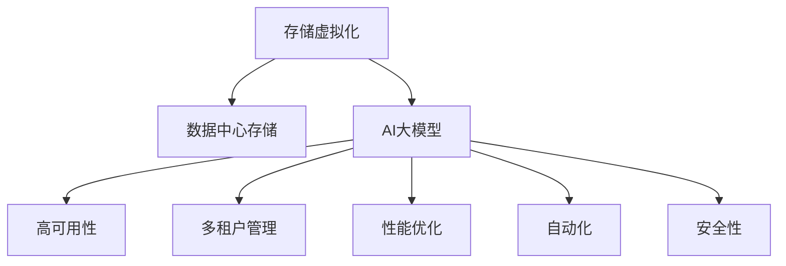

                 

# AI 大模型应用数据中心的存储虚拟化

> 关键词：
- AI大模型
- 数据中心存储
- 虚拟化
- 性能优化
- 高可用性
- 多租户管理
- 自动化
- 安全保障

## 1. 背景介绍

### 1.1 问题由来
随着人工智能（AI）技术的迅猛发展，大模型（如GPT-3、BERT等）在处理大规模文本、图像和视频数据方面展现出卓越的能力。然而，这些模型的训练和应用对计算资源的需求极为庞大，特别是在数据中心存储方面。数据中心的存储系统需要支持高吞吐量、低延迟、高可靠性和高性能的要求，以确保AI大模型的训练和推理任务能够高效执行。

### 1.2 问题核心关键点
数据中心存储虚拟化技术能够有效解决大模型对存储资源的高需求问题，通过资源复用和按需分配，显著提高存储系统的利用率，降低运营成本。然而，虚拟化技术在AI大模型应用场景中的应用还面临着诸多挑战，如性能瓶颈、高可用性保障、多租户管理、自动化和安全性等问题。

### 1.3 问题研究意义
研究AI大模型应用数据中心的存储虚拟化技术，对于提升AI模型的训练和推理效率，降低存储成本，以及支持企业级应用的灵活性和安全性具有重要意义。通过虚拟化技术，可以构建一个高效、灵活、可靠、安全的存储基础设施，为AI大模型的应用提供坚实保障。

## 2. 核心概念与联系

### 2.1 核心概念概述

为了更好地理解存储虚拟化技术在AI大模型中的应用，本节将介绍几个关键概念：

- 存储虚拟化(Storage Virtualization)：通过软件层面的抽象和映射，将多个物理存储设备呈现为一个统一的虚拟存储资源池，供上层应用按需使用。存储虚拟化可以显著提高存储资源的使用效率，支持弹性扩展和动态管理。

- 数据中心存储(Data Center Storage)：包括各种类型的存储设备，如HDD、SSD、NVMe等，以及相关的存储网络（如FC、NAS、SAN等），用于承载AI大模型的数据和模型参数。

- AI大模型(AI Large Model)：指通过大规模预训练和微调获得的高性能、大容量模型，如GPT-3、BERT等，能够处理自然语言、图像、视频等多模态数据。

- 高可用性(High Availability)：指存储系统能够在故障发生时，快速恢复数据访问，保障AI大模型的持续运行。

- 多租户管理(Multi-Tenant Management)：指在共享存储资源池中，多个租户能够按需申请和释放存储资源，同时保证数据隔离和安全。

- 性能优化(Performance Optimization)：指通过硬件、软件和架构优化，提高存储系统的读写性能，满足AI大模型的训练和推理需求。

- 自动化(Automation)：指通过程序自动化、管理自动化等手段，减少人工干预，提高存储系统的管理和维护效率。

- 安全性(Security)：指存储系统能够保障数据的安全性，防止数据泄露、篡改和未授权访问。

这些核心概念之间的逻辑关系可以通过以下Mermaid流程图来展示：



这个流程图展示了一些关键概念及其之间的关系：

1. 存储虚拟化技术将数据中心存储进行抽象和映射，为AI大模型的应用提供虚拟存储资源。
2. AI大模型通过虚拟化存储系统进行数据和模型的存储。
3. 虚拟化存储系统支持高可用性、多租户管理、性能优化、自动化和安全性等特性。

这些概念共同构成了存储虚拟化在AI大模型应用中的技术框架，使得AI模型能够在高效、灵活、安全的环境中运行。

## 3. 核心算法原理 & 具体操作步骤
### 3.1 算法原理概述

AI大模型应用数据中心存储虚拟化的核心原理，是将物理存储资源通过软件层面的虚拟化技术映射为一个统一的存储资源池，并在此基础上进行资源管理和优化，以满足AI大模型的训练和推理需求。

虚拟化存储系统通过虚拟存储控制器（VSC）实现对底层物理存储设备的统一管理和调度，包括数据卷创建、快照管理、数据复制、负载均衡等功能。VSC通常采用分布式架构，以支持大规模数据中心环境下的高性能和高可用性。

### 3.2 算法步骤详解

基于存储虚拟化技术的AI大模型应用数据中心存储虚拟化，一般包括以下几个关键步骤：

**Step 1: 数据中心存储资源规划**
- 评估数据中心的存储需求，确定所需的物理存储设备类型和数量。
- 规划虚拟存储资源池的划分方式，定义数据卷大小、性能要求等参数。

**Step 2: 部署虚拟存储控制器**
- 安装和配置虚拟存储控制器（VSC）软件，确保其支持多节点、高可用性等特性。
- 初始化虚拟存储资源池，将物理存储设备映射到虚拟存储卷。

**Step 3: 配置AI大模型应用**
- 选择合适的AI大模型进行训练和推理任务。
- 配置模型所需的数据存储路径和参数，确保数据能够顺利存取。
- 设置虚拟存储卷的性能和隔离策略，保障模型训练和推理的性能。

**Step 4: 数据管理和优化**
- 使用快照、复制等技术，备份和管理AI大模型的数据。
- 根据模型训练和推理的性能需求，动态调整存储资源，实现负载均衡。
- 定期进行性能监控和调优，确保系统始终处于最优状态。

**Step 5: 安全性和高可用性保障**
- 配置数据加密、访问控制等安全措施，防止数据泄露和未授权访问。
- 实现存储系统的故障切换和冗余，保障AI大模型的持续运行。

以上是基于存储虚拟化技术的AI大模型应用数据中心存储虚拟化的基本流程。在实际应用中，还需要根据具体场景，对各个环节进行优化和调整。

### 3.3 算法优缺点

基于存储虚拟化技术的AI大模型应用数据中心存储虚拟化方法具有以下优点：

1. 高效资源利用：通过虚拟化技术，将物理存储资源统一管理和复用，提高了存储资源的使用效率。
2. 弹性扩展能力：虚拟存储卷可以根据需求动态调整大小，支持AI大模型的弹性扩展。
3. 高性能支持：通过缓存、负载均衡等技术，显著提高存储系统的读写性能，满足AI大模型的高性能要求。
4. 高可用性保障：通过数据备份、故障切换等措施，保障AI大模型在故障情况下的数据安全。

同时，该方法也存在一些局限性：

1. 软件复杂性：虚拟存储控制器的部署和管理需要较高的技术门槛，存在一定的复杂性。
2. 性能瓶颈：虚拟化层引入了额外的开销，可能会对存储系统的性能造成一定影响。
3. 多租户隔离：虚拟存储卷的隔离和安全性管理需要严格的策略和配置，存在一定的复杂度。
4. 初始投资成本：部署虚拟存储控制器和软硬件设备需要一定的初始投资成本。

尽管存在这些局限性，但就目前而言，基于存储虚拟化技术的AI大模型应用方法仍是一种高效、灵活的存储解决方案，具有广泛的应用前景。

### 3.4 算法应用领域

基于存储虚拟化技术的AI大模型应用数据中心存储虚拟化方法，在多个领域得到了广泛应用：

- 数据中心：通过虚拟化技术，显著提升数据中心的存储资源利用率，支持大规模AI模型的训练和推理。
- 云服务：云平台通过虚拟化技术，为租户提供弹性、高效、安全的存储服务，支持多样化的AI模型应用。
- 边缘计算：通过边缘存储虚拟化，减少数据中心到终端设备的传输延迟，提升AI模型的实时性。
- 大数据：在大型数据集的处理和分析中，通过虚拟化技术，实现高效的数据管理和存储。

除了上述这些典型应用外，基于虚拟化技术的存储系统也在不断扩展其应用场景，如物联网、智慧城市、智能交通等，为各行业提供高效、灵活、安全的存储基础设施。

## 4. 数学模型和公式 & 详细讲解 & 举例说明

### 4.1 数学模型构建

为了更好地描述存储虚拟化在AI大模型应用中的技术细节，本节将使用数学语言对虚拟化存储系统的核心参数进行刻画。

假设数据中心拥有 $n$ 个物理存储设备，每个设备容量为 $C$，存储控制器能够将物理设备映射到 $m$ 个虚拟存储卷，每个卷的容量为 $V$，性能为 $P$。虚拟化存储系统由虚拟存储控制器（VSC）管理，负责分配和管理存储资源，支持AI大模型的数据存储和访问。

### 4.2 公式推导过程

假设虚拟化存储系统的总负载为 $L$，每个存储卷的利用率为 $U$，数据访问的读写速度为 $S$。根据负载均衡和性能优化原理，虚拟存储控制器需要根据负载和性能需求，动态调整存储资源，以最大化系统性能和资源利用率。

以一个简单的虚拟化模型为例，假设系统采用均匀分配策略，每个虚拟卷的负载为 $L/V$，性能为 $P$。根据数据访问的读写速度 $S$，可以建立虚拟存储系统的性能模型如下：

$$
P = f(L, V)
$$

其中 $f$ 为性能函数，表示负载和性能之间的映射关系。假设每个虚拟卷的利用率为 $U$，则系统的总体利用率 $\eta$ 可以表示为：

$$
\eta = \frac{L}{n \times C} \times \frac{U}{V}
$$

系统的总体性能 $E$ 可以表示为：

$$
E = n \times C \times P
$$

根据以上模型，虚拟存储控制器可以根据系统负载和性能需求，动态调整虚拟卷的大小和性能，以最大化系统性能和资源利用率。

### 4.3 案例分析与讲解

以Google的Cloud Storage为例，其虚拟化存储系统通过分布式对象存储技术，实现了高可用性、高扩展性和高性能。Cloud Storage使用分布式哈希表进行数据分布和负载均衡，通过数据冗余和故障切换机制，保障数据的高可用性和持久性。同时，Cloud Storage支持多租户管理，通过访问控制和审计机制，保障数据的安全性和隐私性。

在AI大模型应用场景中，Cloud Storage通过虚拟化存储技术，为AI模型提供了高效的存储服务。例如，通过多节点分布式存储，支持大规模模型参数的存储和访问。通过缓存和负载均衡技术，提升模型的读写性能。通过数据备份和复制，保障模型数据的完整性和可用性。

## 5. 项目实践：代码实例和详细解释说明
### 5.1 开发环境搭建

在进行虚拟化存储系统开发前，需要先准备好开发环境。以下是使用Python进行Django开发的环境配置流程：

1. 安装Anaconda：从官网下载并安装Anaconda，用于创建独立的Python环境。

2. 创建并激活虚拟环境：
```bash
conda create -n django-env python=3.8 
conda activate django-env
```

3. 安装Django：
```bash
pip install django
```

4. 安装相关的第三方库：
```bash
pip install numpy pandas scikit-learn torch matplotlib IPython
```

5. 安装Django Rest Framework：
```bash
pip install djangorestframework
```

6. 安装Django Debug Toolbar：
```bash
pip install django-debug-toolbar
```

完成上述步骤后，即可在`django-env`环境中开始虚拟化存储系统的开发。

### 5.2 源代码详细实现

下面我们以Django框架为开发平台，基于虚拟化存储控制器（VSC）的实现为例，给出虚拟化存储系统的代码实现。

首先，定义虚拟存储卷的模型：

```python
from django.db import models

class StorageVolume(models.Model):
    name = models.CharField(max_length=255)
    capacity = models.IntegerField()
    performance = models.FloatField()
```

然后，定义虚拟存储控制器的模型：

```python
from django.db import models

class VirtualStorageController(models.Model):
    name = models.CharField(max_length=255)
    volumes = models.ManyToManyField(StorageVolume)
```

接着，定义虚拟存储卷的创建和删除接口：

```python
from django.http import JsonResponse
from django.views.decorators.csrf import csrf_exempt

@csrf_exempt
def create_volume(request):
    data = request.POST
    volume_name = data.get('name')
    capacity = data.get('capacity')
    performance = data.get('performance')
    volume = StorageVolume.objects.create(name=volume_name, capacity=capacity, performance=performance)
    return JsonResponse({'success': True, 'volume_id': volume.id})

@csrf_exempt
def delete_volume(request, volume_id):
    volume = StorageVolume.objects.get(id=volume_id)
    volume.delete()
    return JsonResponse({'success': True})
```

然后，定义虚拟存储卷的性能调整接口：

```python
@csrf_exempt
def adjust_volume_performance(request, volume_id, new_performance):
    volume = StorageVolume.objects.get(id=volume_id)
    volume.performance = new_performance
    volume.save()
    return JsonResponse({'success': True})
```

最后，定义虚拟存储卷的性能监控接口：

```python
from django.views.decorators.csrf import csrf_exempt
from django.http import JsonResponse
from django.views.decorators.cache import cache_page

@csrf_exempt
@cache_page(60)
def get_volume_performance(request, volume_id):
    volume = StorageVolume.objects.get(id=volume_id)
    performance = volume.performance
    return JsonResponse({'performance': performance})
```

这些代码定义了虚拟存储卷的基本操作，包括创建、删除和性能调整等。开发者可以根据具体需求，进一步扩展和优化虚拟存储控制器的功能。

### 5.3 代码解读与分析

让我们再详细解读一下关键代码的实现细节：

**StorageVolume模型**：
- 定义了虚拟存储卷的基本属性，包括卷名、容量和性能。

**VirtualStorageController模型**：
- 定义了虚拟存储控制器的基本属性，包括控制器名和管理的虚拟存储卷列表。

**create_volume函数**：
- 通过POST请求获取卷名、容量和性能参数，创建新的虚拟存储卷，并返回卷的ID。

**delete_volume函数**：
- 通过GET请求获取卷ID，删除指定的虚拟存储卷，并返回成功的响应。

**adjust_volume_performance函数**：
- 通过POST请求获取卷ID和新的性能值，更新指定虚拟存储卷的性能，并返回成功的响应。

**get_volume_performance函数**：
- 通过GET请求获取卷ID，返回指定虚拟存储卷的性能值，并缓存60秒，以减少重复查询。

这些函数实现了虚拟存储卷的基本管理功能，帮助开发人员方便地创建、管理和监控虚拟存储卷。开发者可以根据实际需求，进一步扩展和优化这些接口，以满足AI大模型应用的多样化需求。

## 6. 实际应用场景
### 6.1 数据中心

在数据中心存储虚拟化中，虚拟化存储系统能够支持大规模AI模型的训练和推理任务。例如，在Google Cloud中，通过虚拟化技术，多个AI模型可以共享同一套存储资源，大大提高了存储资源的利用率。同时，虚拟化存储系统通过分布式存储和数据备份机制，保障了存储系统的高可用性和数据安全。

### 6.2 云服务

云平台通过虚拟化技术，为AI大模型的应用提供灵活、高效、安全的存储服务。例如，AWS的Elastic Block Store（EBS）支持多租户管理和灵活的存储卷大小和性能配置，满足不同租户的需求。同时，EBS通过数据复制和故障切换机制，保障数据的高可用性和持久性。

### 6.3 边缘计算

在边缘计算场景中，虚拟化存储系统通过分布式存储和数据缓存，减少数据中心到终端设备的传输延迟，提升AI模型的实时性和响应速度。例如，边缘计算平台通过虚拟化技术，为移动设备、物联网设备等终端设备提供高效的存储服务，支持本地计算和数据存储。

### 6.4 大数据

在大型数据集的处理和分析中，虚拟化存储系统通过分布式存储和数据备份，支持高效的数据管理和存储。例如，Apache Hadoop的HDFS通过虚拟化技术，支持大规模数据的分布式存储和管理，确保数据的完整性和可靠性。

## 7. 工具和资源推荐
### 7.1 学习资源推荐

为了帮助开发者系统掌握虚拟化技术在AI大模型中的应用，这里推荐一些优质的学习资源：

1. 《存储虚拟化技术》书籍：全面介绍了虚拟化技术的基本原理和实际应用案例，适合深度学习工程师和系统架构师。

2. 《Python Django Web开发》教程：通过Django框架学习虚拟存储系统的前端和后端开发，适合Web开发工程师和系统管理员。

3. 《AI大模型应用》课程：系统讲解AI大模型的训练、推理和优化技术，涵盖虚拟化存储系统的内容，适合数据科学家和系统工程师。

4. 《Cloud Storage》文档：Google Cloud Storage官方文档，详细介绍了虚拟化存储系统的部署和管理，适合云计算工程师和系统管理员。

5. 《虚拟化技术白皮书》：云计算和虚拟化技术领域的权威报告，介绍了虚拟化技术的最新发展趋势和应用案例，适合IT管理人员和系统架构师。

通过对这些资源的学习实践，相信你一定能够快速掌握虚拟化技术在AI大模型应用中的精髓，并用于解决实际问题。

### 7.2 开发工具推荐

高效的开发离不开优秀的工具支持。以下是几款用于虚拟化存储系统开发的常用工具：

1. Django：Python Web开发框架，简单易用，支持RESTful接口设计，适合虚拟存储系统的开发。

2. Ansible：自动化管理工具，支持分布式系统部署和配置，适合虚拟化存储系统的自动化管理。

3. Kubernetes：容器编排平台，支持大规模分布式存储系统的部署和管理，适合云平台和边缘计算场景。

4. Terraform：基础设施即代码（IaC）工具，支持虚拟化存储系统的自动化部署和管理，适合云计算和数据中心场景。

5. Nagios：监控和告警工具，支持虚拟化存储系统的性能监控和故障告警，适合数据中心和云平台。

合理利用这些工具，可以显著提升虚拟化存储系统的开发效率，加快创新迭代的步伐。

### 7.3 相关论文推荐

虚拟化技术在AI大模型应用中的研究，源于学界的持续研究。以下是几篇奠基性的相关论文，推荐阅读：

1. 《虚拟化存储技术的发展与应用》：介绍了虚拟化技术的基本原理和实际应用案例，适合IT管理人员和系统架构师。

2. 《基于云存储的虚拟化技术研究》：介绍了云存储平台中的虚拟化技术，适合云计算工程师和系统管理员。

3. 《边缘计算中的虚拟化技术》：介绍了边缘计算场景中的虚拟化技术，适合边缘计算工程师和系统架构师。

4. 《AI大模型在虚拟化存储中的应用》：介绍了AI大模型在虚拟化存储系统中的应用，适合数据科学家和系统工程师。

这些论文代表了大模型应用虚拟化技术的发展脉络。通过学习这些前沿成果，可以帮助研究者把握学科前进方向，激发更多的创新灵感。

## 8. 总结：未来发展趋势与挑战
### 8.1 总结

本文对基于存储虚拟化技术的AI大模型应用进行了全面系统的介绍。首先阐述了虚拟化技术在AI大模型应用中的背景和意义，明确了虚拟化技术在提升存储资源利用率、支持弹性扩展、保障高可用性和性能优化方面的独特价值。其次，从原理到实践，详细讲解了虚拟化技术的基本流程和关键操作，给出了虚拟化存储系统的完整代码实现。同时，本文还广泛探讨了虚拟化技术在数据中心、云服务、边缘计算、大数据等不同场景中的应用，展示了虚拟化技术的广泛应用前景。

通过本文的系统梳理，可以看到，虚拟化技术在大模型应用中的核心地位，能够为AI大模型的训练和推理提供高效、灵活、安全的存储基础设施。未来，伴随虚拟化技术的持续演进，大模型应用将更加高效、可靠、安全和便捷。

### 8.2 未来发展趋势

展望未来，虚拟化技术在AI大模型应用中将呈现以下几个发展趋势：

1. 弹性扩展和自适应管理：通过智能调度算法，根据负载和性能需求，动态调整存储资源，实现自适应管理和弹性扩展。

2. 混合云和多云部署：虚拟化存储系统能够跨云平台和数据中心无缝部署，支持混合云和多云环境下的应用。

3. 分布式存储和边缘计算：通过分布式存储和边缘计算技术，提升数据中心到终端设备的传输速度，支持低延迟、高可靠性的应用。

4. 多租户管理和多用户并发：虚拟化存储系统能够支持多租户和多用户并发，通过资源隔离和权限管理，保障数据安全。

5. 自动化和智能化：通过自动化和智能化技术，减少人工干预，提高虚拟化存储系统的管理和维护效率。

6. 安全性和隐私保护：虚拟化存储系统能够提供端到端的加密和访问控制，保障数据的安全性和隐私性。

以上趋势凸显了虚拟化技术在AI大模型应用中的广阔前景。这些方向的探索发展，将进一步提升AI模型的训练和推理效率，支持更多样化的应用场景。

### 8.3 面临的挑战

尽管虚拟化技术在AI大模型应用中已经取得了一定的进展，但在迈向更加智能化、普适化应用的过程中，它仍面临着诸多挑战：

1. 性能瓶颈：虚拟化层引入了额外的开销，可能会对存储系统的性能造成一定影响。如何优化虚拟化层，提高存储系统的读写性能，是一个重要的研究方向。

2. 高可用性保障：虚拟化存储系统需要通过数据备份、故障切换等措施，保障AI大模型的持续运行。如何在保证高可用性的同时，提高系统的稳定性和可靠性，还需要更多的技术积累。

3. 多租户隔离：虚拟存储卷的隔离和安全性管理需要严格的策略和配置，存在一定的复杂度。如何通过虚拟化技术，实现高效、灵活的多租户管理，是一个重要的研究课题。

4. 自动化和智能化：虚拟化存储系统的自动化和智能化管理，需要更加智能的调度算法和决策机制，以支持更大规模和更复杂的应用场景。

5. 安全性和隐私保护：虚拟化存储系统需要保障数据的安全性和隐私性，防止数据泄露和未授权访问。如何通过加密和访问控制等技术，实现端到端的数据安全，是一个重要的研究方向。

6. 初始投资成本：部署虚拟化存储控制器和软硬件设备需要一定的初始投资成本。如何降低初始投资成本，提高系统的性价比，也是一个重要的研究方向。

正视虚拟化技术面临的这些挑战，积极应对并寻求突破，将使虚拟化技术在大模型应用中更加成熟和可靠。相信随着学界和产业界的共同努力，这些挑战终将一一被克服，虚拟化技术必将在构建高效、灵活、可靠、安全的存储基础设施中扮演越来越重要的角色。

### 8.4 研究展望

面对虚拟化技术在大模型应用中所面临的挑战，未来的研究需要在以下几个方面寻求新的突破：

1. 探索更高效的虚拟化算法：通过优化虚拟化算法，减少虚拟化层对存储系统性能的影响，提高系统的读写速度和效率。

2. 研究自动化和智能化调度技术：通过智能化调度算法，实现虚拟存储卷的自动分配和管理，减少人工干预，提高系统的管理效率。

3. 融合分布式存储和边缘计算：通过分布式存储和边缘计算技术，支持边缘计算和物联网等场景下的高效存储服务。

4. 引入多租户管理和多用户并发支持：通过多租户管理和多用户并发支持，实现虚拟化存储系统的高效管理和使用。

5. 结合安全性和隐私保护技术：通过端到端加密和访问控制技术，保障虚拟化存储系统的高安全性和高隐私性。

6. 优化初始投资成本：通过软硬件协同优化，减少初始投资成本，提高虚拟化存储系统的性价比。

这些研究方向和探索，必将引领虚拟化技术在大模型应用中的新突破，为AI模型的训练和推理提供更加高效、灵活、安全、可靠和智能的存储基础设施。面向未来，虚拟化技术在大模型应用中的研究将不断深化和扩展，推动AI技术在各个行业的应用和发展。

## 9. 附录：常见问题与解答

**Q1：虚拟化存储系统如何实现高可用性？**

A: 虚拟化存储系统通过数据冗余和故障切换机制，实现高可用性。例如，Google Cloud Storage通过数据备份和冗余存储，保障数据的高可用性和持久性。AWS EBS通过快照和数据复制，支持跨 Availability Zone 的故障切换。

**Q2：虚拟化存储系统如何保障数据安全？**

A: 虚拟化存储系统通过端到端的加密和访问控制机制，保障数据的安全性。例如，Google Cloud Storage通过数据加密和访问控制列表（ACL），保护数据不被未授权访问。AWS EBS通过透明数据加密和ACL，实现数据安全。

**Q3：虚拟化存储系统如何提高性能？**

A: 虚拟化存储系统通过缓存、负载均衡等技术，提高系统的读写性能。例如，Google Cloud Storage通过分布式缓存和负载均衡技术，提升数据的读写速度。AWS EBS通过缓存和负载均衡技术，优化系统的性能。

**Q4：虚拟化存储系统如何实现多租户管理？**

A: 虚拟化存储系统通过资源隔离和权限管理机制，实现多租户管理。例如，Google Cloud Storage通过VPC和ACL，实现租户数据的隔离和权限控制。AWS EBS通过子网和ACL，实现租户数据的隔离和权限控制。

**Q5：虚拟化存储系统如何实现自动化管理？**

A: 虚拟化存储系统通过自动化工具和智能化算法，实现自动化管理。例如，Google Cloud Storage通过自动化工具和智能化算法，实现资源的自动化管理。AWS EBS通过自动化工具和智能化算法，实现资源的自动化管理。

通过对这些问题的解答，相信你一定能够更好地理解虚拟化技术在大模型应用中的核心原理和应用场景，并用于解决实际问题。

---

作者：禅与计算机程序设计艺术 / Zen and the Art of Computer Programming

