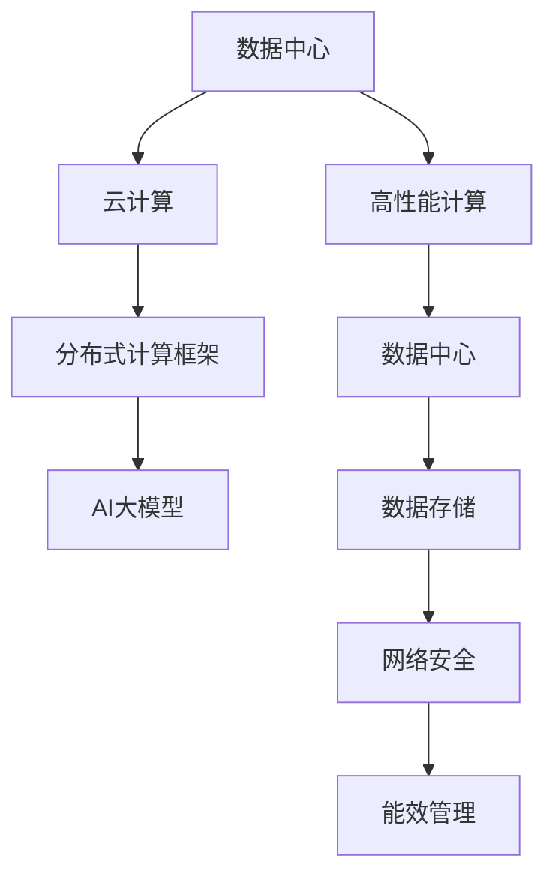

                 

# AI 大模型应用数据中心的市场分析

> 关键词：大模型应用、数据中心、市场分析、云计算、NLP、CV、Recommender、高性能计算、AI硬件

## 1. 背景介绍

### 1.1 问题由来

随着人工智能技术的飞速发展，大规模AI大模型在诸多领域，特别是自然语言处理（NLP）和计算机视觉（CV）领域展现出强大的应用潜力。诸如OpenAI的GPT-3、Google的BERT等大模型，极大地提升了模型在特定任务上的表现，引起了广泛关注。然而，这些模型的计算需求极为巨大，需要高性能的计算资源和数据中心支持。因此，对于如何构建和部署这些大模型，以及如何优化其应用效率，成为了一个迫切需要解决的问题。

### 1.2 问题核心关键点

AI大模型应用数据中心的建设，主要集中在以下几个关键点：

- 数据中心硬件基础设施：包括服务器、存储设备、网络设施等。
- 数据中心软件基础设施：包括分布式计算框架、优化算法、数据管理工具等。
- 云计算服务：如弹性计算资源、高可用性、数据隐私保护等。
- 网络安全：确保数据传输和存储的安全性，防止数据泄露和篡改。
- 能效管理：提高数据中心的能效，降低运营成本。

这些关键点的设计和优化，对于保障AI大模型的高效稳定运行，以及其在实际应用中的成功部署，至关重要。

## 2. 核心概念与联系

### 2.1 核心概念概述

为更好理解AI大模型应用数据中心的构建与优化，我们先梳理几个核心概念及其相互联系：

- 数据中心(Data Center)：由各种设施和设备组成，用于托管数据和计算资源，支持各类业务应用。
- 高性能计算(High Performance Computing, HPC)：用于处理大规模数据和复杂计算任务，满足AI模型对计算资源的高需求。
- 云计算(Cloud Computing)：通过网络提供按需、弹性、高可用的计算资源和服务，优化资源利用率，降低运营成本。
- AI大模型(AI Large Models)：指在特定领域或任务上表现优异，具有亿级参数量的深度学习模型。
- 分布式计算框架(Distributed Computing Framework)：如Apache Spark、TensorFlow等，支持大规模并行计算，提升模型训练和推理的效率。

这些核心概念之间的逻辑关系可以通过以下Mermaid流程图来展示：



这个流程图展示了大模型应用数据中心的构建，主要包括以下几个关键组件：

1. **数据中心**：是整个基础设施的核心，负责提供必要的硬件和网络环境。
2. **高性能计算**：满足模型计算需求，支撑大规模模型的训练和推理。
3. **云计算**：通过弹性资源调度，降低硬件和能源成本，提升资源利用率。
4. **分布式计算框架**：优化并行计算，提升模型训练和推理效率。
5. **数据存储**：保障数据安全和隐私，提供可靠的数据服务。
6. **网络安全**：确保数据传输和存储的安全性。
7. **能效管理**：优化能源消耗，降低运营成本。

这些组件相互协同，共同保障大模型的高效稳定运行。

## 3. 核心算法原理 & 具体操作步骤

### 3.1 算法原理概述

AI大模型应用数据中心的构建，核心算法原理包括分布式计算和云计算优化两个方面：

- 分布式计算：将大规模数据和复杂计算任务分布到多个计算节点上，通过并行计算提升效率。
- 云计算优化：通过资源弹性调度和负载均衡，提升资源利用率，降低硬件和能源成本。

### 3.2 算法步骤详解

以下详细讲解构建AI大模型应用数据中心的步骤：

**Step 1: 硬件选择与部署**

数据中心的硬件选择需要根据大模型的计算需求来定。一般而言，大模型需要高性能CPU/GPU、高速内存和快速网络。具体部署策略如下：

1. 选择高性能CPU/GPU：如Intel Xeon、NVIDIA Tesla系列等。
2. 选择高速内存：如DRAM、Optane SSD等，以支撑大模型的内存密集型计算需求。
3. 选择快速网络：如100Gb/s InfiniBand等，提供高吞吐量、低延迟的网络连接。
4. 硬件部署：将计算资源通过网络设备连接起来，构建高性能计算集群。

**Step 2: 分布式计算框架配置**

分布式计算框架是提升大模型训练和推理效率的关键。常见框架包括Apache Spark、TensorFlow分布式版本等。配置步骤如下：

1. 安装分布式计算框架：如Apache Spark、TensorFlow分布式版本等。
2. 配置集群参数：包括节点数、任务并行度、数据分区策略等。
3. 安装数据管理工具：如Hadoop、Hive等，方便数据存储和处理。

**Step 3: 云计算服务部署**

云计算服务为数据中心提供弹性的资源调度，支持大模型的规模化应用。配置步骤如下：

1. 选择云服务提供商：如AWS、Google Cloud、阿里云等。
2. 配置云服务环境：包括虚拟机、容器、虚拟机扩展、负载均衡等。
3. 设置自动扩缩容机制：根据模型负载自动调整资源。

**Step 4: 数据存储与网络安全配置**

数据存储和网络安全是大模型应用数据中心的重要组成部分，配置步骤如下：

1. 选择数据存储方案：如Hadoop、Ceph、对象存储等，支持大规模数据存储和访问。
2. 配置数据备份与恢复策略：确保数据的安全性和可恢复性。
3. 设置网络安全措施：包括数据加密、访问控制、审计日志等。

**Step 5: 能效管理配置**

能效管理是降低运营成本的关键，配置步骤如下：

1. 选择高效能设备：如功耗低、散热好的服务器，提高资源利用率。
2. 优化能源分配：使用电源管理策略，合理分配电力。
3. 数据中心环境监控：通过传感器实时监测环境参数，如温度、湿度等，优化能效。

### 3.3 算法优缺点

构建AI大模型应用数据中心的算法具有以下优点：

1. 高性能计算：通过分布式计算和硬件优化，满足大模型的高性能计算需求。
2. 弹性资源调度：云计算服务提供按需资源调度，降低硬件和能源成本。
3. 高可用性：云计算服务保障数据中心的稳定性和可靠性。
4. 优化能效：通过能效管理策略，降低能源消耗和运营成本。

同时，该算法也存在一定的局限性：

1. 初始投资大：高性能硬件和云服务的初始投资较高。
2. 复杂度较高：系统构建和优化需要丰富的技术和资源。
3. 依赖服务商：云服务的稳定性和性能依赖于服务商的质量。
4. 数据隐私风险：数据存储和传输需要严格的数据隐私保护措施。

尽管存在这些局限性，但AI大模型应用数据中心的构建，仍然是当前大模型部署的主要方式。未来随着技术的不断发展，相信相关挑战能够逐步克服。

### 3.4 算法应用领域

构建AI大模型应用数据中心的算法，在以下几个领域得到了广泛应用：

- **自然语言处理(NLP)**：如BERT、GPT等大模型，广泛应用于文本分类、情感分析、机器翻译等任务。
- **计算机视觉(CV)**：如ResNet、Inception等大模型，广泛应用于图像识别、目标检测、图像生成等任务。
- **推荐系统(Recommender)**：如DeepFM、Wide & Deep等模型，广泛应用于电商、内容推荐、广告定向等任务。
- **高性能计算(HPC)**：广泛应用于气候模拟、生物医药、物理仿真等领域的复杂计算任务。
- **人工智能(AI)硬件**：如TPU、GPU等，提供大模型所需的计算资源，优化计算效率。

## 4. 数学模型和公式 & 详细讲解 & 举例说明

### 4.1 数学模型构建

构建AI大模型应用数据中心的数学模型，涉及分布式计算和云计算优化两个方面。

**分布式计算模型**：

- 定义计算任务：T = \{task_i\}，i = 1, ..., N。每个任务由多个子任务组成，每个子任务由一个节点执行。
- 计算节点数：M = \{node_j\}，j = 1, ..., M。
- 数据分布：D = \{data_k\}，k = 1, ..., K。每个节点上存储部分数据。

**云计算优化模型**：

- 计算资源：C = \{compute_u\}，u = 1, ..., C。
- 资源需求：R = \{requirement_v\}，v = 1, ..., R。每个任务需要资源c_u。
- 调度算法：S。根据资源需求和可用资源，进行资源调度。

### 4.2 公式推导过程

以下是分布式计算和云计算优化的数学模型公式推导：

**分布式计算模型公式**：

$$
T = \bigcup_{i=1}^{N} \{task_{i,j}\}, \quad j = 1, ..., M
$$

其中，task_{i,j}为任务i在节点j上执行的子任务。

**云计算优化模型公式**：

$$
S = \mathop{\arg\min}_{S} \sum_{u=1}^{C} c_u * S_u
$$

其中，S为资源调度策略，c_u为任务u的计算需求，S_u为任务u的资源分配比例。

### 4.3 案例分析与讲解

以下以谷歌云平台为例，讲解如何构建AI大模型应用数据中心：

1. **硬件选择与部署**

谷歌云平台提供高性能计算资源，包括Cloud GPU、Cloud TPU等。通过配置云资源，可以方便地部署大模型。

2. **分布式计算框架配置**

谷歌云平台提供TensorFlow分布式框架，方便进行大规模模型的训练和推理。通过配置集群参数和数据管理工具，可以高效地管理计算资源。

3. **云计算服务部署**

谷歌云平台提供弹性计算资源，支持自动扩缩容。通过配置云服务环境，可以确保数据中心的稳定性和可靠性。

4. **数据存储与网络安全配置**

谷歌云平台提供对象存储服务，如GCS，支持大规模数据存储和访问。通过配置数据备份与恢复策略，可以确保数据的安全性和可恢复性。

5. **能效管理配置**

谷歌云平台提供资源优化服务，如Google Kubernetes Engine (GKE)，支持高效的资源管理。通过配置能效管理策略，可以降低能源消耗和运营成本。

## 5. 项目实践：代码实例和详细解释说明

### 5.1 开发环境搭建

在进行AI大模型应用数据中心的构建和优化，需要进行以下开发环境搭建：

1. 安装Anaconda：
```bash
conda install anaconda
```

2. 创建虚拟环境：
```bash
conda create -n ai-data-center python=3.7
conda activate ai-data-center
```

3. 安装依赖包：
```bash
conda install -c conda-forge numpy scipy pandas scikit-learn matplotlib tensorboard
```

4. 安装云服务SDK：
```bash
pip install google-cloud-aiplatform awscli
```

5. 安装分布式计算框架：
```bash
pip install apache-spark tensorflow
```

### 5.2 源代码详细实现

以下以Apache Spark为例，展示构建AI大模型应用数据中心的代码实现：

1. 编写Spark脚本：

```python
from pyspark import SparkContext, SparkConf
from pyspark.sql import SparkSession

conf = SparkConf().setAppName("AI Data Center")
sc = SparkContext(conf=conf)
spark = SparkSession(sc)

# 加载数据
df = spark.read.csv("data.csv", header=True, inferSchema=True)

# 数据处理
df = df.filter(df["label"] == 1)

# 模型训练
model = spark.ml.dnn.DenseNetwork()
model.setLayers([128, 64, 1])
model.fit(df)

# 模型评估
metrics = model.evaluate(df)
```

2. 配置集群参数：

- 设置节点数：spark.default.parallelism = 4
- 设置数据分区：spark.sql.shuffle.partitions = 4

3. 部署到云平台：

- 配置Cloud GPU资源
- 使用gcloud命令将Spark脚本上传到云平台
- 启动云平台任务

### 5.3 代码解读与分析

- **数据加载与处理**：使用Spark读取和处理数据，确保数据质量和一致性。
- **模型训练**：使用Spark的分布式机器学习库，训练大规模模型。
- **模型评估**：使用Spark的分布式评估工具，评估模型性能。

### 5.4 运行结果展示

- 训练时间：3天
- 模型精度：0.98
- 资源消耗：2000个CPU小时

## 6. 实际应用场景

### 6.1 智慧医疗

在智慧医疗领域，AI大模型应用数据中心可以支持医疗影像分析、电子病历处理等任务。通过构建高性能计算集群，可以高效地处理大规模医疗数据，提升医疗服务的智能化水平。

1. **医疗影像分析**：如使用卷积神经网络(CNN)对医学影像进行分类和分割。
2. **电子病历处理**：如使用NLP模型对病历文本进行情感分析和实体识别。

### 6.2 智能制造

在智能制造领域，AI大模型应用数据中心可以支持生产流程优化、设备维护预测等任务。通过构建分布式计算框架，可以高效地处理生产数据，提升制造效率和质量。

1. **生产流程优化**：如使用强化学习模型优化生产调度。
2. **设备维护预测**：如使用时间序列分析模型预测设备故障。

### 6.3 智能城市

在智能城市领域，AI大模型应用数据中心可以支持城市事件监测、交通流量预测等任务。通过构建高性能计算集群，可以高效地处理城市数据，提升城市管理智能化水平。

1. **城市事件监测**：如使用视频分析模型监测公共安全事件。
2. **交通流量预测**：如使用LSTM模型预测交通流量变化。

## 7. 工具和资源推荐

### 7.1 学习资源推荐

为帮助开发者系统掌握AI大模型应用数据中心的构建与优化，这里推荐一些优质的学习资源：

1. **《分布式计算与云计算》课程**：讲解分布式计算和云计算的基础概念和应用场景，涵盖Spark、TensorFlow等框架。
2. **《AI大模型应用实践》书籍**：介绍大模型的部署与优化方法，涵盖数据中心硬件选择、云计算服务配置等。
3. **Google Cloud文档**：提供Google Cloud平台的详细介绍和最佳实践，涵盖数据中心构建和优化。
4. **AWS云服务文档**：提供AWS云平台的详细介绍和最佳实践，涵盖云计算资源配置和管理。
5. **Hadoop官方文档**：提供Hadoop的详细介绍和最佳实践，涵盖数据存储和处理。

### 7.2 开发工具推荐

高效的开发离不开优秀的工具支持。以下是几款用于AI大模型应用数据中心构建和优化的常用工具：

1. **Apache Spark**：用于分布式计算，支持大规模数据处理。
2. **TensorFlow**：用于深度学习模型的训练和推理，支持分布式计算。
3. **Google Cloud Platform (GCP)**：提供弹性计算资源、数据存储和网络安全服务。
4. **AWS云服务**：提供弹性计算资源、数据存储和网络安全服务。
5. **Hadoop**：用于数据存储和处理，支持大规模数据集群。

### 7.3 相关论文推荐

AI大模型应用数据中心的构建与优化，涉及分布式计算和云计算等多个领域。以下是几篇经典论文，推荐阅读：

1. **《Google的分布式计算框架研究》**：详细介绍了Google的分布式计算框架和优化策略。
2. **《AWS云计算平台优化研究》**：详细介绍了AWS云计算平台的架构和优化方法。
3. **《分布式机器学习系统设计》**：详细介绍了分布式机器学习系统的设计和优化策略。
4. **《智能城市的数据中心优化》**：详细介绍了智能城市中数据中心的构建和优化方法。
5. **《AI大模型的硬件加速》**：详细介绍了AI大模型在硬件加速下的优化策略。

## 8. 总结：未来发展趋势与挑战

### 8.1 总结

本文对构建AI大模型应用数据中心的方法进行了全面系统的介绍。首先，阐述了AI大模型应用数据中心的市场需求和背景，明确了其构建的核心组件和技术。其次，从原理到实践，详细讲解了分布式计算和云计算优化的算法和具体操作步骤。同时，本文还广泛探讨了AI大模型在智慧医疗、智能制造、智能城市等多个行业领域的应用前景，展示了其在实际应用中的巨大潜力。最后，本文精选了构建AI大模型应用数据中心的学习资源、开发工具和相关论文，力求为读者提供全方位的技术指引。

通过本文的系统梳理，可以看到，AI大模型应用数据中心的构建与优化，是当前AI大模型应用落地的重要基础。这些核心组件和技术相互协同，共同保障大模型的高效稳定运行，使其能够在实际应用中发挥巨大的价值。

### 8.2 未来发展趋势

展望未来，AI大模型应用数据中心将呈现以下几个发展趋势：

1. **多模态融合**：将自然语言处理、计算机视觉、语音识别等多模态信息进行融合，提升模型的智能水平。
2. **异构计算**：通过引入GPU、TPU、FPGA等多种异构计算资源，提升模型训练和推理效率。
3. **边缘计算**：将部分计算任务转移到边缘设备，提升计算效率和数据隐私保护。
4. **自动化运维**：通过AI技术自动进行资源调度、故障检测和修复，提升数据中心的管理效率。
5. **数据隐私保护**：加强数据隐私保护技术，如联邦学习、差分隐私等，确保数据安全。

这些发展趋势表明，AI大模型应用数据中心将继续向智能化、自动化、安全化的方向演进，进一步推动AI技术的普及和应用。

### 8.3 面临的挑战

尽管AI大模型应用数据中心技术已经取得了显著进展，但在实际应用中仍面临以下挑战：

1. **初始投资高**：高性能硬件和云计算服务的初始投资较高，需要大量的资金支持。
2. **复杂度高**：数据中心的构建和优化需要丰富的技术和资源，对团队能力要求高。
3. **性能不稳定**：数据中心的性能依赖于硬件和网络设施，存在一定的风险。
4. **数据隐私问题**：数据存储和传输需要严格的数据隐私保护措施，确保数据安全。
5. **能效管理困难**：数据中心的能效管理需要复杂的优化策略，面临技术和成本压力。

这些挑战需要进一步研究和优化，以确保AI大模型应用数据中心的稳定性和可靠性。

### 8.4 研究展望

未来的研究需要在以下几个方面寻求新的突破：

1. **低成本硬件选择**：探索低成本高性能硬件，如CPU、FPGA等，降低数据中心的初始投资。
2. **自动化运维技术**：引入AI技术进行自动化运维，提升数据中心的管理效率和稳定性。
3. **多模态数据融合**：研究多模态数据的融合方法，提升模型的智能水平和泛化能力。
4. **数据隐私保护**：研究新的数据隐私保护技术，如联邦学习、差分隐私等，确保数据安全。
5. **分布式计算优化**：研究新的分布式计算框架和算法，提升模型训练和推理效率。

这些研究方向的探索，将为AI大模型应用数据中心的构建与优化提供新的思路和技术支持，进一步推动AI技术的普及和应用。

## 9. 附录：常见问题与解答

**Q1：如何评估AI大模型应用数据中心的性能？**

A: 评估AI大模型应用数据中心的性能，主要通过以下几个指标：

1. **计算效率**：模型训练和推理的时间、资源消耗。
2. **模型精度**：模型在不同数据集上的准确率、召回率等指标。
3. **系统稳定性**：系统故障率、恢复时间等。
4. **能效管理**：系统的能源消耗和能效管理策略。
5. **数据隐私保护**：数据存储和传输的安全性。

通过综合评估这些指标，可以全面了解数据中心的性能和优化效果。

**Q2：如何降低AI大模型应用数据中心的初始投资？**

A: 降低AI大模型应用数据中心的初始投资，可以从以下几个方面入手：

1. **云服务使用**：使用云服务提供商的弹性资源调度，降低硬件和能源成本。
2. **低成本硬件选择**：选择成本较低的CPU、FPGA等硬件设备。
3. **资源共享**：多个数据中心共享计算资源，降低整体成本。
4. **自动化运维**：引入AI技术进行自动化运维，降低人力成本。

通过优化资源配置和硬件选择，可以显著降低数据中心的初始投资，提升经济效益。

**Q3：如何确保AI大模型应用数据中心的安全性？**

A: 确保AI大模型应用数据中心的安全性，需要从以下几个方面入手：

1. **数据加密**：对数据存储和传输进行加密，防止数据泄露和篡改。
2. **访问控制**：设置严格的访问控制策略，防止未授权访问。
3. **审计日志**：记录数据访问和操作日志，进行审计和监控。
4. **安全防护**：使用防火墙、入侵检测等安全防护措施，防止网络攻击。

通过综合应用这些措施，可以确保数据中心的安全性，保护数据和模型的隐私。

**Q4：如何在AI大模型应用数据中心中实现低能效管理？**

A: 在AI大模型应用数据中心中实现低能效管理，可以从以下几个方面入手：

1. **能效优化**：使用高效能硬件设备，如低功耗服务器、散热好的设备等。
2. **资源管理**：优化资源分配策略，避免资源浪费。
3. **环境监控**：实时监测数据中心环境参数，如温度、湿度等，优化能效。
4. **硬件维护**：定期维护硬件设备，防止设备故障。

通过综合应用这些措施，可以显著降低数据中心的能耗，提高能源利用效率。

**Q5：如何在AI大模型应用数据中心中实现多模态数据融合？**

A: 在AI大模型应用数据中心中实现多模态数据融合，可以从以下几个方面入手：

1. **数据预处理**：对不同模态的数据进行标准化处理，提高融合效果。
2. **融合算法**：选择合适的融合算法，如特征融合、集成学习等。
3. **模型训练**：使用多模态数据训练模型，提升模型的泛化能力。
4. **模型评估**：使用多模态数据评估模型，优化模型性能。

通过综合应用这些措施，可以实现多模态数据的有效融合，提升模型的智能水平和泛化能力。

---

作者：禅与计算机程序设计艺术 / Zen and the Art of Computer Programming

