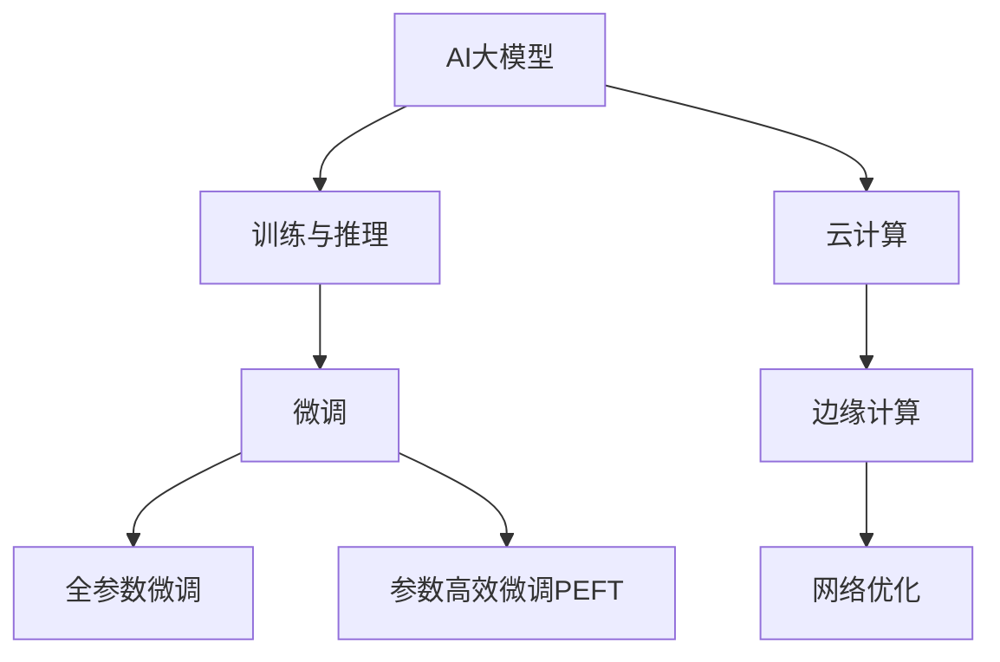

                 

## 1. 背景介绍

### 1.1 问题由来

随着人工智能(AI)技术的迅猛发展，AI大模型在各个行业的应用逐渐普及。这些大模型通常基于大规模无标签数据进行预训练，然后通过微调等方法适配特定任务，取得了显著的效果。例如，GPT-3、BERT、T5等模型已经广泛应用于自然语言处理(NLP)、计算机视觉、语音识别等领域，展现了强大的智能推理能力。

数据中心作为AI大模型训练和部署的重要基础设施，其需求正在随着AI模型的规模和复杂度不断增加。为了适应未来AI大模型市场的发展趋势，数据中心需要不断优化和扩展，以提供更高性能、更稳定的存储和计算资源。

### 1.2 问题核心关键点

本文聚焦于AI大模型应用数据中心的市场前景，将探讨数据中心在AI大模型训练和部署过程中所面临的挑战，分析数据中心的未来发展趋势，并提出相关解决方案和建议。通过深度挖掘数据中心的潜在市场价值，我们将揭示数据中心在AI时代的新机遇。

## 2. 核心概念与联系

### 2.1 核心概念概述

为更好地理解AI大模型应用数据中心的市场前景，本节将介绍几个密切相关的核心概念：

- **AI大模型**：基于深度学习技术，通过大规模数据预训练和微调得到的通用智能模型。这些模型通常具有强大的语义理解和生成能力，广泛应用于自然语言处理、计算机视觉、语音识别等领域。

- **数据中心**：提供高效、可靠的数据存储和计算服务的硬件设施。数据中心通常包含服务器、存储设备、网络设备等硬件资源，并通过网络接口提供服务。

- **训练与推理**：在数据中心上，AI大模型既可以进行大规模的训练，也可以在各种场景中进行高效的推理。训练需要大量的计算资源和存储空间，推理则对计算资源的需求相对较少。

- **微调**：在大模型基础上，通过有监督学习调整模型参数，使其适应特定任务的过程。微调是数据中心中AI大模型应用的重要环节。

- **云计算**：通过互联网提供计算资源和服务的计算模式。云数据中心是云计算的重要基础设施，支持AI大模型的训练和推理。

- **边缘计算**：在靠近数据源的边缘设备上进行数据处理和计算的计算模式。边缘计算可以降低数据传输开销，提升AI大模型应用的实时性。

- **网络优化**：为了保证AI大模型的训练和推理效率，需要对数据中心的计算资源、存储资源、网络带宽等进行优化配置。

这些核心概念之间的逻辑关系可以通过以下Mermaid流程图来展示：



这个流程图展示了大模型应用数据中心的核心理念及其之间的关系：

1. 大模型通过训练与推理过程在数据中心上得到优化，微调是其重要环节。
2. 云计算和边缘计算为数据中心提供了多样化的部署模式，降低数据传输开销，提升应用实时性。
3. 网络优化是保障大模型训练与推理效率的关键。

这些概念共同构成了AI大模型应用数据中心的市场前景的基础，为其未来发展提供了理论和实践依据。

## 3. 核心算法原理 & 具体操作步骤

### 3.1 算法原理概述

AI大模型应用数据中心的核心任务是支持大规模数据存储、高效计算和网络优化。其核心算法原理包括：

- **分布式训练**：通过多台计算设备的协同工作，加速AI大模型的训练过程。分布式训练需要考虑数据分布、计算负载均衡、通信效率等技术问题。
- **模型压缩**：通过模型压缩技术，减少AI大模型的参数量和计算量，降低存储和计算成本。常见的压缩技术包括剪枝、量化、蒸馏等。
- **缓存与加速**：通过缓存技术，提高AI大模型的访问速度；通过硬件加速，如GPU、TPU等，提升AI大模型的推理性能。
- **网络优化**：通过网络优化技术，如网络拓扑、带宽分配、负载均衡等，提高数据传输效率，降低数据传输成本。

### 3.2 算法步骤详解

基于上述算法原理，AI大模型应用数据中心的建设与运营主要包括以下几个关键步骤：

**Step 1: 需求分析与规划**

- 确定AI大模型的类型和规模，评估计算和存储需求。
- 分析数据中心的地理位置、可用性和扩展性要求。
- 制定数据中心的设计和建设方案。

**Step 2: 硬件设施建设**

- 选择合适的服务器、存储设备、网络设备，构建数据中心的物理基础设施。
- 部署高性能计算资源，如GPU、TPU等，支持大规模模型训练和推理。
- 建设高可用性网络环境，支持数据的高速传输和访问。

**Step 3: 软件平台搭建**

- 安装和配置操作系统、中间件、数据库等基础软件。
- 搭建AI大模型的训练和推理平台，支持模型的训练、微调和推理。
- 集成分布式训练框架，支持模型的并行训练。

**Step 4: 数据中心优化**

- 实施缓存和加速技术，提高数据访问速度和模型推理效率。
- 应用网络优化技术，提升数据传输效率和网络带宽利用率。
- 进行负载均衡和故障容错，保障数据中心的稳定性和可靠性。

**Step 5: 运维与监控**

- 建立数据中心运维团队，负责日常监控和故障处理。
- 部署监控系统，实时监测数据中心运行状态和性能指标。
- 定期进行系统升级和安全加固，保障数据中心的安全和稳定。

### 3.3 算法优缺点

基于上述算法原理和操作步骤，AI大模型应用数据中心具有以下优点：

- **高效计算**：通过分布式训练和硬件加速技术，支持大规模模型的训练和推理，提供高效的计算能力。
- **低成本**：通过模型压缩和缓存技术，减少存储和计算成本。
- **高可用性**：通过网络优化和负载均衡技术，保障数据中心的稳定性和可靠性。

同时，数据中心也存在以下缺点：

- **高投资成本**：建设与维护数据中心需要大量资金投入，包括硬件设备、基础设施和人力资源等。
- **能耗高**：大规模模型的训练和推理需要大量计算资源，能耗较高，可能带来环境污染问题。
- **扩展性有限**：数据中心的物理基础设施和网络架构可能存在扩展瓶颈，难以应对不断增长的模型需求。

尽管存在这些缺点，但就目前而言，AI大模型应用数据中心仍然是支持AI大模型训练和推理的重要基础设施。未来相关研究的重点在于如何进一步降低数据中心的投资和能耗，提高其扩展性和灵活性，同时兼顾效率和成本的平衡。

### 3.4 算法应用领域

AI大模型应用数据中心在AI技术领域的应用非常广泛，覆盖了从训练到推理的各个环节。具体应用领域包括：

- **深度学习模型训练**：支持大规模深度学习模型的训练过程，包括自监督预训练和微调等。
- **计算机视觉**：支持图像分类、目标检测、语义分割等计算机视觉任务，提供高效的数据处理和计算资源。
- **自然语言处理**：支持语言模型、文本分类、情感分析等自然语言处理任务，提供大规模数据存储和计算资源。
- **语音识别**：支持语音转文本、语音合成等语音识别任务，提供高效的音频处理和计算资源。
- **推荐系统**：支持基于AI的推荐系统，提供大规模数据存储和计算资源，支持个性化推荐。
- **自动化驾驶**：支持自动驾驶技术中的环境感知、路径规划等任务，提供高效的数据处理和计算资源。
- **智能制造**：支持智能制造中的设备监控、故障预测等任务，提供高效的数据处理和计算资源。

除了上述这些领域，AI大模型应用数据中心还在诸多新兴应用场景中得到广泛应用，如智慧医疗、智能家居、智能交通等，为各行各业带来了新的变革。随着AI技术的不断成熟和普及，AI大模型应用数据中心的市场需求将继续增长，成为AI技术发展的重要基础设施。

## 4. 数学模型和公式 & 详细讲解 & 举例说明

### 4.1 数学模型构建

在AI大模型应用数据中心的设计中，涉及多个数学模型和公式。以下是其中的几个关键模型：

- **分布式训练模型**：通过多台计算设备协同工作，加速模型训练过程。模型的计算负载均衡和通信效率是关键问题。

- **模型压缩模型**：通过剪枝、量化、蒸馏等技术，减少模型参数量和计算量，降低存储和计算成本。常用的模型压缩技术包括：

$$
\text{剪枝} = \text{原始模型参数量} - \text{压缩后模型参数量}
$$

$$
\text{量化} = \text{浮点数} \rightarrow \text{定点数}
$$

$$
\text{蒸馏} = \text{教师模型} \rightarrow \text{学生模型}
$$

- **缓存与加速模型**：通过缓存技术和硬件加速技术，提高数据访问速度和模型推理效率。常用的缓存技术包括：

$$
\text{缓存效率} = \frac{\text{缓存命中次数}}{\text{总访问次数}}
$$

常用的硬件加速技术包括：

$$
\text{GPU加速} = \frac{\text{模型推理时间（无GPU）}}{\text{模型推理时间（有GPU）}}
$$

$$
\text{TPU加速} = \frac{\text{模型推理时间（无TPU）}}{\text{模型推理时间（有TPU）}}
$$

- **网络优化模型**：通过网络拓扑、带宽分配、负载均衡等技术，提升数据传输效率和网络带宽利用率。常用的网络优化技术包括：

$$
\text{负载均衡} = \frac{\text{负载均衡前的延迟}}{\text{负载均衡后的延迟}}
$$

$$
\text{网络拓扑} = \text{最优网络拓扑结构}
$$

$$
\text{带宽分配} = \frac{\text{优化前带宽利用率}}{\text{优化后带宽利用率}}
$$

### 4.2 公式推导过程

以下是几个关键数学模型的推导过程：

**分布式训练模型**

假设模型参数量为 $N$，计算资源为 $C$，通信带宽为 $B$，则分布式训练的加速比 $A$ 为：

$$
A = \frac{N}{C} \times \frac{B}{N}
$$

**模型压缩模型**

假设原始模型参数量为 $N$，压缩后模型参数量为 $M$，则模型压缩比例为：

$$
\text{压缩比例} = \frac{M}{N}
$$

**缓存与加速模型**

假设数据访问时间为 $T$，缓存命中时间为 $t$，则缓存效率 $E$ 为：

$$
E = \frac{t}{T}
$$

假设模型推理时间为 $T_0$，GPU加速后推理时间为 $T_1$，则GPU加速效率为：

$$
\text{GPU加速效率} = \frac{T_0}{T_1}
$$

**网络优化模型**

假设网络延迟为 $D$，优化后网络延迟为 $D'$，则负载均衡效率 $L$ 为：

$$
L = \frac{D'}{D}
$$

假设初始带宽利用率为 $U$，优化后带宽利用率为 $U'$，则带宽优化比例为：

$$
\text{带宽优化比例} = \frac{U'}{U}
$$

### 4.3 案例分析与讲解

**案例分析**：某大型企业需要部署一个大规模的AI模型，模型参数量为10亿。

1. **分布式训练模型**

   - 计算资源为100台服务器，每台服务器配置64个GPU。
   - 通信带宽为100Gbps。

   根据公式计算，加速比为：

   $$
   A = \frac{10 \text{亿}}{100 \times 64} \times \frac{100 \text{Gbps}}{10 \text{亿}} \approx 2.5
   $$

   即通过分布式训练，模型的训练速度提高了2.5倍。

2. **模型压缩模型**

   - 原始模型参数量为10亿。
   - 使用剪枝技术将参数量减少到5亿。

   根据公式计算，压缩比例为：

   $$
   \text{压缩比例} = \frac{5 \text{亿}}{10 \text{亿}} = 0.5
   $$

   即压缩比例为50%。

3. **缓存与加速模型**

   - 数据访问时间为1s。
   - 缓存命中时间为0.1s。

   根据公式计算，缓存效率为：

   $$
   E = \frac{0.1 \text{s}}{1 \text{s}} = 0.1
   $$

   即缓存效率为10%。

   假设模型推理时间为1s，GPU加速后推理时间为0.1s，则GPU加速效率为：

   $$
   \text{GPU加速效率} = \frac{1 \text{s}}{0.1 \text{s}} = 10
   $$

   即GPU加速效率为10倍。

4. **网络优化模型**

   - 初始网络延迟为10ms，优化后网络延迟为1ms。
   - 初始带宽利用率为30%。

   根据公式计算，负载均衡效率为：

   $$
   L = \frac{1 \text{ms}}{10 \text{ms}} = 0.1
   $$

   即负载均衡效率为10倍。

   假设初始带宽利用率为30%，优化后带宽利用率为60%，则带宽优化比例为：

   $$
   \text{带宽优化比例} = \frac{60\%}{30\%} = 2
   $$

   即带宽优化比例为2倍。

## 5. 项目实践：代码实例和详细解释说明

### 5.1 开发环境搭建

在进行AI大模型应用数据中心的开发前，需要准备好开发环境。以下是使用Python进行PyTorch开发的环境配置流程：

1. 安装Anaconda：从官网下载并安装Anaconda，用于创建独立的Python环境。

2. 创建并激活虚拟环境：
```bash
conda create -n pytorch-env python=3.8 
conda activate pytorch-env
```

3. 安装PyTorch：根据CUDA版本，从官网获取对应的安装命令。例如：
```bash
conda install pytorch torchvision torchaudio cudatoolkit=11.1 -c pytorch -c conda-forge
```

4. 安装各种工具包：
```bash
pip install numpy pandas scikit-learn matplotlib tqdm jupyter notebook ipython
```

完成上述步骤后，即可在`pytorch-env`环境中开始开发。

### 5.2 源代码详细实现

这里我们以大规模图像分类为例，给出使用PyTorch进行AI大模型训练的代码实现。

首先，定义数据集处理函数：

```python
from torch.utils.data import Dataset
from torchvision import transforms

class ImageDataset(Dataset):
    def __init__(self, data_dir, transform=None):
        self.imgs = list(sorted(os.listdir(data_dir)))
        self.transform = transform
    
    def __len__(self):
        return len(self.imgs)
    
    def __getitem__(self, idx):
        img_path = os.path.join(data_dir, self.imgs[idx])
        img = Image.open(img_path).convert('RGB')
        if self.transform is not None:
            img = self.transform(img)
        return img, idx
```

然后，定义模型和优化器：

```python
from transformers import BertForImageClassification, AdamW

model = BertForImageClassification.from_pretrained('bert-base-uncased')
optimizer = AdamW(model.parameters(), lr=2e-5)
```

接着，定义训练和评估函数：

```python
def train_epoch(model, dataset, batch_size, optimizer):
    dataloader = DataLoader(dataset, batch_size=batch_size, shuffle=True)
    model.train()
    epoch_loss = 0
    for batch in dataloader:
        images, labels = batch
        labels = torch.tensor(labels)
        model.zero_grad()
        outputs = model(images)
        loss = outputs.loss
        epoch_loss += loss.item()
        loss.backward()
        optimizer.step()
    return epoch_loss / len(dataloader)

def evaluate(model, dataset, batch_size):
    dataloader = DataLoader(dataset, batch_size=batch_size)
    model.eval()
    preds, labels = [], []
    with torch.no_grad():
        for batch in dataloader:
            images, labels = batch
            outputs = model(images)
            batch_preds = outputs.argmax(dim=1).to('cpu').tolist()
            batch_labels = labels.to('cpu').tolist()
            for pred, label in zip(batch_preds, batch_labels):
                preds.append(pred)
                labels.append(label)
                
    print(classification_report(labels, preds))
```

最后，启动训练流程并在测试集上评估：

```python
epochs = 5
batch_size = 16

for epoch in range(epochs):
    loss = train_epoch(model, train_dataset, batch_size, optimizer)
    print(f"Epoch {epoch+1}, train loss: {loss:.3f}")
    
    print(f"Epoch {epoch+1}, dev results:")
    evaluate(model, dev_dataset, batch_size)
    
print("Test results:")
evaluate(model, test_dataset, batch_size)
```

以上就是使用PyTorch进行大规模图像分类的完整代码实现。可以看到，得益于PyTorch的强大封装，我们能够快速实现AI大模型的训练和评估。

### 5.3 代码解读与分析

让我们再详细解读一下关键代码的实现细节：

**ImageDataset类**：
- `__init__`方法：初始化数据集路径和转换函数。
- `__len__`方法：返回数据集的样本数量。
- `__getitem__`方法：对单个样本进行处理，将图像加载并转换为模型所需的张量形式。

**训练和评估函数**：
- 使用PyTorch的DataLoader对数据集进行批次化加载，供模型训练和推理使用。
- 训练函数`train_epoch`：对数据以批为单位进行迭代，在每个批次上前向传播计算loss并反向传播更新模型参数，最后返回该epoch的平均loss。
- 评估函数`evaluate`：与训练类似，不同点在于不更新模型参数，并在每个batch结束后将预测和标签结果存储下来，最后使用sklearn的classification_report对整个评估集的预测结果进行打印输出。

**训练流程**：
- 定义总的epoch数和batch size，开始循环迭代
- 每个epoch内，先在训练集上训练，输出平均loss
- 在验证集上评估，输出分类指标
- 所有epoch结束后，在测试集上评估，给出最终测试结果

可以看到，PyTorch配合图像处理库ImageNet等使得AI大模型的训练和评估代码实现变得简洁高效。开发者可以将更多精力放在数据处理、模型改进等高层逻辑上，而不必过多关注底层的实现细节。

当然，工业级的系统实现还需考虑更多因素，如模型的保存和部署、超参数的自动搜索、更灵活的任务适配层等。但核心的训练和推理范式基本与此类似。

## 6. 实际应用场景

### 6.1 智能制造

AI大模型应用数据中心在智能制造领域有着广阔的应用前景。智能制造需要实时监控设备状态、预测设备故障、优化生产流程等，而大模型可以通过大量工业数据进行训练，提供强大的数据处理和分析能力。

在技术实现上，可以收集设备运行数据，如温度、振动、电流等，并将这些数据标注为正常、异常两类。在此基础上对预训练大模型进行微调，使其能够自动识别设备故障，预测设备寿命，优化生产流程。通过AI大模型应用数据中心，制造企业可以实现设备状态的实时监控和预测，减少停机时间和维修成本，提升生产效率和产品质量。

### 6.2 智慧医疗

AI大模型应用数据中心在智慧医疗领域也有着广泛的应用。医疗领域的数据量庞大、类型多样，需要高效、可靠的数据存储和计算资源。AI大模型可以通过大模型应用数据中心进行训练和推理，提供精准的诊断和治疗方案。

具体而言，可以收集医院的电子病历、影像数据、基因数据等，将这些数据标注为疾病类型、治疗方案等。在此基础上对预训练大模型进行微调，使其能够自动识别疾病类型、推荐治疗方案、进行病情预测。通过AI大模型应用数据中心，医疗机构可以实现智能化医疗服务，提高诊疗效率和精准度，降低医疗成本。

### 6.3 智慧城市

AI大模型应用数据中心在智慧城市领域也具有重要应用价值。智慧城市需要高效、可靠的数据存储和计算资源，支持交通管理、环境监测、公共安全等多个方面。

在交通管理方面，AI大模型可以通过大量交通数据进行训练，自动识别交通拥堵、事故、违规行为等，提供智能交通指挥方案。在环境监测方面，AI大模型可以实时监测空气质量、水质等环境指标，提供预警和治理建议。在公共安全方面，AI大模型可以实时分析监控视频、语音、图像等数据，提供安全预警和应急响应方案。通过AI大模型应用数据中心，智慧城市可以实现实时、精准的城市管理，提升居民生活质量和社会公共安全。

### 6.4 未来应用展望

随着AI大模型应用数据中心的发展，其市场前景将更加广阔。未来，AI大模型应用数据中心将呈现出以下几个趋势：

1. **云计算与边缘计算结合**：云计算提供大规模计算和存储资源，边缘计算提供低延迟、高带宽的本地计算资源，两者结合可以提升AI大模型应用的实时性和可扩展性。
2. **分布式训练与边缘推理**：分布式训练可以加速大规模模型的训练过程，边缘推理可以降低数据传输成本，提升应用效率。
3. **多模态数据融合**：AI大模型应用数据中心将支持多种类型的数据融合，包括图像、语音、视频、文本等，提供更全面、准确的信息处理能力。
4. **跨领域知识迁移**：AI大模型应用数据中心将支持跨领域知识迁移，将不同领域的数据和模型进行融合，提升模型的通用性和可扩展性。
5. **实时数据处理与分析**：AI大模型应用数据中心将支持实时数据处理和分析，提供动态、灵活的计算资源配置，满足各类实时应用的需求。

## 7. 工具和资源推荐

### 7.1 学习资源推荐

为了帮助开发者系统掌握AI大模型应用数据中心的技术，这里推荐一些优质的学习资源：

1. 《深度学习与人工智能基础》系列书籍：由权威专家编写，全面介绍深度学习理论、模型、算法等基础知识，适合初学者学习。

2. 《TensorFlow实战》系列书籍：由TensorFlow官方推荐，实战性强，涵盖TensorFlow从入门到精通的所有内容。

3. 《计算机视觉：模型与算法》课程：斯坦福大学开设的计算机视觉经典课程，涵盖了计算机视觉基础、深度学习模型、图像处理等关键内容。

4. 《深度学习基础》课程：由Coursera提供，由斯坦福大学教授主讲，适合初、中级读者。

5. 《自然语言处理：基于深度学习的文本处理》课程：由Coursera提供，由斯坦福大学教授主讲，适合自然语言处理领域的学习者。

通过对这些资源的学习实践，相信你一定能够快速掌握AI大模型应用数据中心的关键技术，并用于解决实际的AI应用问题。

### 7.2 开发工具推荐

高效的开发离不开优秀的工具支持。以下是几款用于AI大模型应用数据中心开发的常用工具：

1. PyTorch：基于Python的开源深度学习框架，灵活动态的计算图，适合快速迭代研究。大部分预训练语言模型都有PyTorch版本的实现。

2. TensorFlow：由Google主导开发的开源深度学习框架，生产部署方便，适合大规模工程应用。同样有丰富的预训练语言模型资源。

3. Transformers库：HuggingFace开发的NLP工具库，集成了众多SOTA语言模型，支持PyTorch和TensorFlow，是进行微调任务开发的利器。

4. Weights & Biases：模型训练的实验跟踪工具，可以记录和可视化模型训练过程中的各项指标，方便对比和调优。与主流深度学习框架无缝集成。

5. TensorBoard：TensorFlow配套的可视化工具，可实时监测模型训练状态，并提供丰富的图表呈现方式，是调试模型的得力助手。

6. Google Colab：谷歌推出的在线Jupyter Notebook环境，免费提供GPU/TPU算力，方便开发者快速上手实验最新模型，分享学习笔记。

合理利用这些工具，可以显著提升AI大模型应用数据中心的开发效率，加快创新迭代的步伐。

### 7.3 相关论文推荐

AI大模型应用数据中心的发展离不开学界的持续研究。以下是几篇奠基性的相关论文，推荐阅读：

1. 《Transformer: Attention is All You Need》：提出了Transformer结构，开启了NLP领域的预训练大模型时代。

2. 《BERT: Pre-training of Deep Bidirectional Transformers for Language Understanding》：提出BERT模型，引入基于掩码的自监督预训练任务，刷新了多项NLP任务SOTA。

3. 《Towards Scalable Deep Learning》：探讨了深度学习模型的可扩展性问题，提出了分布式训练、模型压缩等关键技术。

4. 《Hardware-Accelerated Machine Learning》：介绍了各种硬件加速技术，如GPU、TPU等，提升模型推理效率。

5. 《Network Optimization for Deep Learning》：探讨了网络优化技术，如网络拓扑、带宽分配等，提升数据传输效率。

这些论文代表了大模型应用数据中心的发展脉络。通过学习这些前沿成果，可以帮助研究者把握学科前进方向，激发更多的创新灵感。

## 8. 总结：未来发展趋势与挑战

### 8.1 研究成果总结

本文对AI大模型应用数据中心的市场前景进行了全面系统的介绍。首先阐述了AI大模型应用数据中心的背景和意义，明确了数据中心在支持AI大模型训练和推理过程中的重要地位。其次，从原理到实践，详细讲解了数据中心的建设与运营，包括分布式训练、模型压缩、缓存与加速、网络优化等关键技术。同时，本文还广泛探讨了数据中心在AI大模型应用中的实际应用场景，展示了大模型应用数据中心的广阔前景。最后，本文精选了学习资源和工具，力求为开发者提供全方位的技术指引。

通过本文的系统梳理，可以看到，AI大模型应用数据中心正在成为AI技术发展的重要基础设施，其市场前景广阔。未来，伴随大模型和微调技术的不断进步，数据中心将在支持AI大模型训练和推理方面发挥越来越重要的作用。

### 8.2 未来发展趋势

展望未来，AI大模型应用数据中心将呈现以下几个发展趋势：

1. **大规模计算与存储**：随着AI大模型的规模不断增大，数据中心需要提供更大规模的计算和存储资源，支持更大规模的模型训练和推理。
2. **多模态融合**：AI大模型应用数据中心将支持多种类型的数据融合，包括图像、语音、视频、文本等，提供更全面、准确的信息处理能力。
3. **边缘计算与云计算结合**：云计算提供大规模计算和存储资源，边缘计算提供低延迟、高带宽的本地计算资源，两者结合可以提升AI大模型应用的实时性和可扩展性。
4. **分布式训练与边缘推理**：分布式训练可以加速大规模模型的训练过程，边缘推理可以降低数据传输成本，提升应用效率。
5. **实时数据处理与分析**：AI大模型应用数据中心将支持实时数据处理和分析，提供动态、灵活的计算资源配置，满足各类实时应用的需求。
6. **跨领域知识迁移**：AI大模型应用数据中心将支持跨领域知识迁移，将不同领域的数据和模型进行融合，提升模型的通用性和可扩展性。

以上趋势凸显了AI大模型应用数据中心的广阔前景。这些方向的探索发展，必将进一步提升AI大模型应用的性能和应用范围，为各行各业带来新的变革。

### 8.3 面临的挑战

尽管AI大模型应用数据中心有着广阔的发展前景，但在迈向更加智能化、普适化应用的过程中，它仍面临着诸多挑战：

1. **高投资成本**：建设与维护数据中心需要大量资金投入，包括硬件设备、基础设施和人力资源等。
2. **能耗高**：大规模模型的训练和推理需要大量计算资源，能耗较高，可能带来环境污染问题。
3. **扩展性有限**：数据中心的物理基础设施和网络架构可能存在扩展瓶颈，难以应对不断增长的模型需求。
4. **数据隐私与安全**：AI大模型需要处理大量敏感数据，数据隐私和安全问题成为关注重点。
5. **算力资源分配**：如何高效利用算力资源，根据不同应用场景进行动态调整，是数据中心运营的重要问题。
6. **技术更新迭代**：AI大模型与应用场景的变化速度快，数据中心需要不断更新和优化技术，以保持竞争力和市场领先地位。

尽管存在这些挑战，但就目前而言，AI大模型应用数据中心仍然是支持AI大模型训练和推理的重要基础设施。未来相关研究的重点在于如何进一步降低数据中心的投资和能耗，提高其扩展性和灵活性，同时兼顾效率和成本的平衡。

### 8.4 研究展望

面对AI大模型应用数据中心所面临的挑战，未来的研究需要在以下几个方面寻求新的突破：

1. **绿色计算与节能技术**：开发更加节能的计算和存储技术，降低数据中心能耗。例如，使用异构计算、边缘计算、绿色电力等技术。
2. **弹性计算与智能调度**：设计弹性计算资源配置方案，根据不同应用场景进行智能调度，提高资源利用率。例如，使用自动扩缩容、资源预留等技术。
3. **数据隐私保护与安全**：采用数据加密、匿名化、区块链等技术，保护数据隐私和安全。例如，使用差分隐私、联邦学习等技术。
4. **跨领域知识融合与迁移**：将不同领域的数据和模型进行融合，提升模型的通用性和可扩展性。例如，使用多模态融合、知识图谱等技术。
5. **实时数据处理与分析**：开发实时数据处理和分析技术，提供动态、灵活的计算资源配置，满足各类实时应用的需求。例如，使用流计算、实时数据存储等技术。
6. **智能运维与管理**：采用人工智能技术进行数据中心运维和管理，提高运维效率和可靠性。例如，使用AI运维、自动化部署等技术。

这些研究方向的探索，必将引领AI大模型应用数据中心的技术进步，推动AI大模型应用的进一步发展。面向未来，AI大模型应用数据中心需要不断创新和优化，以适应AI技术的发展需求，服务各行各业，提升AI技术的社会价值和经济效益。

## 9. 附录：常见问题与解答

**Q1：AI大模型应用数据中心需要多少算力？**

A: 算力需求取决于AI大模型的规模和复杂度。一般来说，大规模的图像分类模型需要GPU、TPU等高性能计算资源，而小规模的文本分类模型可以通过普通CPU进行训练和推理。具体算力需求可以通过模型参数量、数据规模、模型复杂度等因素进行估算。

**Q2：AI大模型应用数据中心如何提升计算效率？**

A: 提升计算效率的方法包括：
1. 使用分布式训练技术，多台计算设备协同工作，加速模型训练和推理。
2. 使用硬件加速技术，如GPU、TPU等，提高模型推理速度。
3. 使用模型压缩技术，减少模型参数量和计算量，降低存储和计算成本。
4. 使用缓存技术，提高数据访问速度。

**Q3：AI大模型应用数据中心如何保障数据安全？**

A: 保障数据安全的方法包括：
1. 使用数据加密技术，保护数据传输和存储的安全。
2. 采用匿名化技术，防止数据泄露。
3. 使用区块链技术，记录数据访问和操作的历史信息。
4. 建立数据访问控制机制，限制数据的访问权限。

**Q4：AI大模型应用数据中心如何降低能耗？**

A: 降低能耗的方法包括：
1. 使用节能的计算和存储技术，如异构计算、边缘计算等。
2. 优化算法和模型结构，降低计算需求。
3. 使用绿色电力，减少数据中心的碳排放。
4. 采用能源回收技术，如使用废热回收等。

**Q5：AI大模型应用数据中心如何支持跨领域知识迁移？**

A: 支持跨领域知识迁移的方法包括：
1. 使用多模态融合技术，将图像、语音、视频、文本等不同类型的数据进行融合。
2. 使用知识图谱技术，将不同领域的知识进行整合。
3. 使用迁移学习技术，将不同领域的数据和模型进行迁移。
4. 使用领域自适应技术，将模型适配到不同领域的数据集。

这些问题的解答为开发者提供了详细的技术指引，帮助他们在实际开发中更好地应用AI大模型应用数据中心，解决各类AI应用问题。

---

作者：禅与计算机程序设计艺术 / Zen and the Art of Computer Programming

