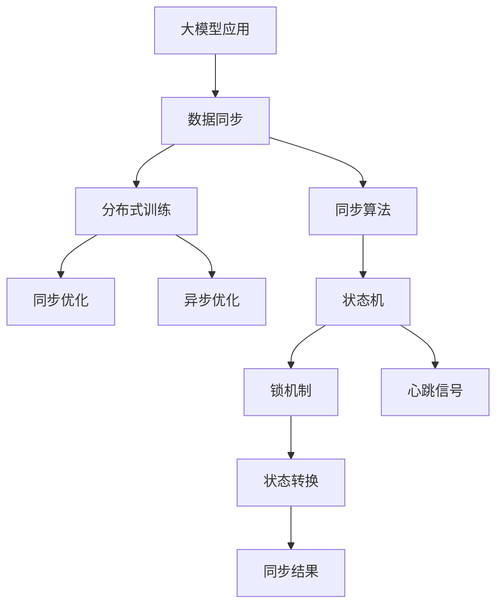

                 

## 1. 背景介绍

### 1.1 问题由来
在大模型应用过程中，数据同步是至关重要的一环。数据同步涉及模型参数和模型状态在不同节点（如本地端、云端的计算节点、服务节点）间的传输，直接影响到模型的训练和推理性能。数据同步的延迟、丢包、冲突等都会造成模型的不稳定性，甚至影响系统的可用性和可靠性。

### 1.2 问题核心关键点
数据同步问题在实际应用中非常常见，特别是在分布式训练和推理任务中。例如，在构建多服务器架构的大模型应用中，训练任务分布在不同的计算节点上，需要高效的同步机制保证各个节点之间数据的一致性。而实际的数据同步过程可能受到带宽、时延、网络拓扑等因素的影响，必须考虑到数据同步的效率和可靠性问题。

### 1.3 问题研究意义
高效的数据同步方案可以显著提升大模型应用的性能，包括训练速度、模型精度和系统稳定性。同时，数据同步也是分布式系统设计的关键，可以影响整个系统的可扩展性和容错性。

## 2. 核心概念与联系

### 2.1 核心概念概述
- **大模型应用（Large Model Applications）**：指在分布式计算环境中，利用大规模的深度学习模型进行训练或推理的过程。这种应用往往需要大量的计算资源和存储空间，对数据同步的需求尤为突出。
- **数据同步（Data Synchronization）**：指在不同计算节点之间，确保模型参数和状态保持一致的过程。数据同步通常涉及到状态机、锁机制、心跳信号等核心技术。
- **分布式训练（Distributed Training）**：指多台计算节点协同进行模型的训练过程。分布式训练可以有效提升训练速度和模型精度。
- **同步算法（Synchronization Algorithm）**：指用于不同节点之间数据同步的具体算法，常见的包括同步优化算法和异步优化算法。
- **异步训练（Asynchronous Training）**：指不同计算节点独立进行模型训练，通过特定的机制在一定频率下进行参数同步。
- **状态机（State Machine）**：用于描述数据同步过程中的状态转换和逻辑流程。

这些核心概念之间的逻辑关系可以通过以下Mermaid流程图来展示：



这个流程图展示了大模型应用中，数据同步的核心概念及其之间的关系：

1. 大模型应用通过分布式训练来提升性能。
2. 数据同步是分布式训练中不可或缺的一部分。
3. 同步算法确保数据的一致性，常见的有同步优化和异步优化。
4. 状态机描述同步流程，涉及锁机制和心跳信号等技术。

## 3. 核心算法原理 & 具体操作步骤

### 3.1 算法原理概述
在大模型应用中，数据同步的原理通常基于以下几类方法：

- **同步优化算法**：在每个训练步骤结束时，计算节点间进行全量的参数同步。这种方法可以确保数据的完全一致性，但需要较大的带宽和时延。
- **异步优化算法**：每个计算节点独立训练模型，定期（如每个epoch的末尾）进行参数同步。异步算法可以充分利用计算资源，但需要处理同步过程中的冲突和数据丢失问题。
- **状态机**：描述数据同步的状态转换，包括节点间的通信和同步操作。

### 3.2 算法步骤详解
以同步优化算法为例，数据同步步骤一般包括以下几个关键步骤：

1. **状态检查**：计算节点检查当前参数状态，确定需要同步的数据。
2. **发送请求**：计算节点向其他节点发送请求，要求同步参数。
3. **接收和更新**：接收其他节点发送的参数更新，并更新本地参数。
4. **状态更新**：更新本地状态，继续下一轮训练。

### 3.3 算法优缺点
同步优化算法的优点是数据完全一致，但缺点是带宽和时延较高，适用于数据传输不受限的环境。异步优化算法则灵活性较高，可以充分利用计算资源，但需要处理同步冲突和数据丢失问题，适用于数据传输受限的环境。

### 3.4 算法应用领域
数据同步算法广泛应用于分布式训练、模型推理、实时数据处理等领域。例如，在分布式训练中，同步优化算法确保模型参数的一致性；在实时数据处理中，异步优化算法可以显著提升数据处理速度。

## 4. 数学模型和公式 & 详细讲解

### 4.1 数学模型构建
假设系统中有N个计算节点，每个节点的参数向量为 $\theta_i$，当前同步周期为第 $t$ 步。同步优化的数学模型可以表示为：

$$
\begin{aligned}
&\min_{\theta_i} \sum_{i=1}^{N} \|\theta_i - \theta^*\|^2 \\
&\text{subject to} \quad \theta_i^t = \theta_i^{t-1} - \eta \nabla L(\theta_i^t) \\
&\quad \theta_i^t = \theta_i^{sync} \quad \forall i \in [1,N]
\end{aligned}
$$

其中，$\theta^*$ 为最优参数向量，$\eta$ 为学习率，$L$ 为损失函数，$\theta_i^{t-1}$ 为上一轮的参数状态，$\theta_i^{sync}$ 为同步后的参数状态。

### 4.2 公式推导过程
对于每个计算节点 $i$，其同步步骤可以表示为：

1. **接收同步请求**：计算节点 $i$ 接收同步请求后，获取同步参数 $\theta_{sync}$。
2. **更新本地参数**：计算节点 $i$ 根据同步参数 $\theta_{sync}$ 更新本地参数 $\theta_i$。
3. **发送同步确认**：计算节点 $i$ 发送同步确认信号给其他节点，表示当前参数状态已经更新。

上述步骤可以表示为：

$$
\theta_i^t = \theta_i^{sync} \quad \forall i \in [1,N]
$$

### 4.3 案例分析与讲解
以分布式训练中的同步优化算法为例，假设训练模型为深度学习模型，每个计算节点的训练样本分别为 $(x_i, y_i)$，损失函数为交叉熵损失。假设共有N个节点，每个节点独立训练一个子集，然后同步参数。

假设在第 $t$ 步，节点 $i$ 的参数状态为 $\theta_i^t$，其优化更新为：

$$
\theta_i^t = \theta_i^{t-1} - \eta \nabla L(\theta_i^t(x_i,y_i))
$$

同步优化算法的基本流程为：

1. **参数接收**：计算节点 $i$ 向其他节点发送同步请求，获取同步参数 $\theta_{sync}$。
2. **参数更新**：计算节点 $i$ 将同步参数 $\theta_{sync}$ 代入损失函数计算梯度，更新本地参数 $\theta_i$。
3. **参数广播**：计算节点 $i$ 将本地参数 $\theta_i$ 广播给其他节点。
4. **同步确认**：计算节点 $i$ 接收其他节点的同步确认信号，确保所有节点参数状态一致。

## 5. 项目实践：代码实例和详细解释说明

### 5.1 开发环境搭建
进行数据同步实践前，需要准备好开发环境。以下是使用Python进行PyTorch开发的环境配置流程：

1. 安装Anaconda：从官网下载并安装Anaconda，用于创建独立的Python环境。

2. 创建并激活虚拟环境：
```bash
conda create -n pytorch-env python=3.8 
conda activate pytorch-env
```

3. 安装PyTorch：根据CUDA版本，从官网获取对应的安装命令。例如：
```bash
conda install pytorch torchvision torchaudio cudatoolkit=11.1 -c pytorch -c conda-forge
```

4. 安装Transformers库：
```bash
pip install transformers
```

5. 安装各类工具包：
```bash
pip install numpy pandas scikit-learn matplotlib tqdm jupyter notebook ipython
```

完成上述步骤后，即可在`pytorch-env`环境中开始数据同步实践。

### 5.2 源代码详细实现

以下是一个基于PyTorch实现的数据同步算法示例，用于在分布式训练中同步参数：

```python
from torch import nn, optim
import torch.distributed as dist
import torch.multiprocessing as mp

class SyncModel(nn.Module):
    def __init__(self):
        super(SyncModel, self).__init__()
        self.fc = nn.Linear(10, 10)

    def forward(self, x):
        return self.fc(x)

def train_fn(model, optimizer, train_loader, device):
    model.train()
    for data, target in train_loader:
        data, target = data.to(device), target.to(device)
        optimizer.zero_grad()
        output = model(data)
        loss = nn.CrossEntropyLoss()(output, target)
        loss.backward()
        optimizer.step()

def sync_fn(model):
    dist.barrier()
    with torch.no_grad():
        dist.all_reduce(model.fc.weight)
        dist.all_reduce(model.fc.bias)

if __name__ == "__main__":
    dist.init_process_group(backend="gloo", world_size=2, init_method="tcp://127.0.0.1:60000")
    model = SyncModel().to(dist.get_rank())
    optimizer = optim.SGD(model.parameters(), lr=0.01)

    train_loader = ...
    mp.Process(target=train_fn, args=(model, optimizer, train_loader, dist.get_rank())).start()
    mp.Process(target=sync_fn, args=(model)).start()

    mp.Process(target=train_fn, args=(model, optimizer, train_loader, dist.get_rank())).start()
    mp.Process(target=sync_fn, args=(model)).start()
```

### 5.3 代码解读与分析

**SyncModel类**：
- `__init__`方法：初始化模型，这里我们使用了线性层作为示例。
- `forward`方法：前向传播计算模型输出。

**train_fn函数**：
- 在每个计算节点上，进行模型的训练。

**sync_fn函数**：
- 在每个计算节点上，进行模型参数的全量同步。

**if __name__ == "__main__":** 部分：
- 初始化分布式环境，并启动多个进程，每个进程负责独立的训练和同步操作。

可以看到，在PyTorch中，通过使用`torch.distributed`模块，我们可以很方便地实现数据同步。这使得在分布式环境下进行大模型应用的数据同步变得简单高效。

## 6. 实际应用场景

### 6.1 分布式训练
在分布式训练中，数据同步是保证模型参数一致性的关键。例如，在大规模图像识别任务中，每个计算节点处理不同的数据样本，并通过数据同步更新模型参数，最终训练出一个全局最优模型。

### 6.2 实时数据处理
在实时数据处理中，数据同步是保证系统稳定性的基础。例如，在股票交易系统中，每个计算节点需要实时处理交易数据，并通过同步算法保证模型参数的一致性，避免因数据丢失或冲突导致的错误。

### 6.3 分布式推理
在分布式推理中，数据同步可以显著提升推理效率。例如，在自动驾驶系统中，多个推理计算节点同时处理传感器数据，并通过同步算法获取全局最优结果，提高推理响应速度。

## 7. 工具和资源推荐

### 7.1 学习资源推荐
为了帮助开发者系统掌握数据同步的理论基础和实践技巧，这里推荐一些优质的学习资源：

1. PyTorch官方文档：提供了详细的同步优化和异步优化算法实现，是学习数据同步的重要参考。
2. Dask官方文档：提供了分布式数据处理的实现，包括同步和异步数据同步的详细说明。
3. TensorFlow官方文档：提供了分布式训练和同步优化算法的实现，适合了解最新的同步技术。
4. Apache Spark官方文档：提供了大数据分布式处理中的数据同步机制，适合大规模数据处理场景。

通过对这些资源的学习实践，相信你一定能够快速掌握数据同步的精髓，并用于解决实际的分布式系统问题。

### 7.2 开发工具推荐
高效的开发离不开优秀的工具支持。以下是几款用于数据同步开发的常用工具：

1. PyTorch：基于Python的开源深度学习框架，灵活动态的计算图，适合分布式训练。
2. TensorFlow：由Google主导开发的开源深度学习框架，生产部署方便，适合大规模工程应用。
3. Dask：Python的分布式计算库，支持数据并行处理，适合大规模数据处理。
4. Ray：开源分布式计算框架，支持分布式训练和推理，适合需要高效同步的场景。

合理利用这些工具，可以显著提升数据同步任务的开发效率，加快创新迭代的步伐。

### 7.3 相关论文推荐
数据同步技术的发展源于学界的持续研究。以下是几篇奠基性的相关论文，推荐阅读：

1. Gradient Synchronization in Distributed Deep Learning Systems（Sutskever等，2013年）：提出了参数同步的基本原理和同步算法的实现。
2. Asynchronous Stochastic Gradient Descent as Distributed Adaptive Optimization（Reddi等，2016年）：讨论了异步优化算法的收敛性和优化效果。
3. Scaling Distributed Deep Learning with Cooperative Gradient Synchronization（Lin等，2017年）：提出了一种基于梯度下降的同步算法，能够提升分布式训练的效率。
4. Distributed SGD: Asynchronous, Parallel and Multitask (ASPEC)（Kasmi等，2019年）：提出了一种高效的异步分布式训练算法，能够在低延迟和高带宽的环境下提升训练速度。

这些论文代表了大模型数据同步技术的发展脉络。通过学习这些前沿成果，可以帮助研究者把握学科前进方向，激发更多的创新灵感。

## 8. 总结：未来发展趋势与挑战

### 8.1 总结
本文对大模型应用中的数据同步问题进行了全面系统的介绍。首先阐述了大模型应用和数据同步的背景和意义，明确了数据同步在分布式训练和推理中的重要性和挑战。其次，从原理到实践，详细讲解了同步优化的数学原理和关键步骤，给出了数据同步任务开发的完整代码实例。同时，本文还广泛探讨了数据同步方法在分布式系统中的多个应用场景，展示了数据同步技术的广泛适用性。此外，本文精选了数据同步技术的各类学习资源，力求为读者提供全方位的技术指引。

通过本文的系统梳理，可以看到，数据同步技术在大模型应用中发挥着不可或缺的作用，直接影响到系统的性能、稳定性和可扩展性。在未来的大模型应用中，数据同步技术还需不断优化和完善，以适应分布式系统的多样化需求。

### 8.2 未来发展趋势
展望未来，数据同步技术将呈现以下几个发展趋势：

1. **异步优化的普及**：异步优化算法因其高效性，将成为主流。未来的大规模分布式训练和推理将更多采用异步优化，提升系统的并发度和响应速度。
2. **分布式训练框架的创新**：各大框架（如TensorFlow、PyTorch、Dask等）将持续更新数据同步算法，提升分布式训练和推理的效率和效果。
3. **硬件和网络技术的提升**：分布式计算硬件和网络基础设施的改进将显著提升数据同步的效率和可靠性。
4. **数据同步和分布式系统的一体化**：未来的大模型应用将更多集成到分布式系统中，数据同步成为系统设计的一部分，需要与系统架构、算法实现等环节深度结合。
5. **边缘计算和本地同步**：在边缘计算场景下，数据同步将更加关注本地处理和低延迟的需求，提升分布式系统的实时性和可靠性。

这些趋势凸显了数据同步技术在分布式系统中的重要性和广阔前景。数据同步技术的不断发展，必将进一步推动大模型应用在实际场景中的应用和落地。

### 8.3 面临的挑战
尽管数据同步技术已经取得了不少进展，但在迈向更加智能化、普适化应用的过程中，仍面临诸多挑战：

1. **带宽和时延问题**：分布式系统中的数据同步依赖于高速网络，但在实际环境中，带宽和时延往往受限。如何在带宽和时延受限的条件下，优化数据同步效率，是未来的重要研究方向。
2. **同步冲突和数据丢失**：异步优化的过程中，可能会发生同步冲突和数据丢失。如何在不增加同步冲突和数据丢失的情况下，提升系统性能，是一大难题。
3. **分布式系统的设计和管理**：分布式系统设计和管理复杂，涉及计算节点、存储节点、网络拓扑等多个环节。如何在设计和管理层面提升系统的可靠性和可扩展性，是重要的研究课题。
4. **数据同步的安全性**：数据同步过程中，存在数据泄露和篡改的风险。如何在保护数据隐私和安全的前提下，实现高效的数据同步，是一大挑战。
5. **跨数据中心同步**：在跨数据中心的分布式系统中，数据同步涉及更多的网络延迟和通信复杂性。如何在不同数据中心之间实现高效的数据同步，是未来的一大挑战。

正视数据同步面临的这些挑战，积极应对并寻求突破，将是数据同步技术向成熟迈进的关键。

### 8.4 研究展望
面对数据同步面临的诸多挑战，未来的研究需要在以下几个方面寻求新的突破：

1. **新算法和协议的设计**：设计更高效、更可靠的数据同步算法和协议，提升分布式系统的性能和可靠性。
2. **硬件和网络的优化**：提升计算节点的性能和网络带宽，优化数据同步算法，提升系统性能。
3. **跨数据中心的同步**：研究跨数据中心的数据同步机制，解决不同数据中心间的数据同步问题。
4. **数据同步的安全性和隐私保护**：研究如何在数据同步过程中保护数据隐私和安全，防止数据泄露和篡改。
5. **分布式训练的自动化管理**：研究如何自动化管理分布式训练过程，优化数据同步和参数更新，提升系统效率。

这些研究方向的探索，必将引领数据同步技术迈向更高的台阶，为构建安全、可靠、高效的大模型应用系统提供技术保障。总之，数据同步是分布式系统中的重要组成部分，需要不断优化和改进，以适应大模型应用的复杂需求。

## 9. 附录：常见问题与解答

**Q1：数据同步过程中，如何选择同步频率？**

A: 数据同步频率的选择取决于应用场景和系统需求。一般来说，同步频率越高，数据一致性越好，但带宽和时延开销也越大。在实际应用中，可以根据系统性能要求，选择适当的同步频率。例如，可以在每个epoch结束时同步一次，或者根据任务复杂度和数据规模，选择更灵活的同步策略。

**Q2：数据同步过程中，如何处理同步冲突？**

A: 同步冲突是异步优化中的常见问题。一般来说，可以通过以下方法处理同步冲突：
1. **乐观同步**：允许计算节点自由更新本地参数，只有当多个节点更新同一个参数时，才进行同步操作。这种方法可以降低同步开销，但需要注意同步冲突处理。
2. **悲观同步**：在每次同步操作前，锁定参数，等待所有节点更新完成后再进行同步。这种方法可以避免同步冲突，但会增加同步开销。
3. **向量同步**：将参数分为多个向量，每个向量单独进行同步，避免冲突。这种方法适用于大规模参数空间。

**Q3：数据同步过程中，如何保证数据的完整性？**

A: 数据同步过程中，数据的完整性可以通过以下方法保证：
1. **校验和机制**：在每次同步操作前，计算数据校验和，只有当校验和一致时，才进行同步操作。
2. **版本控制**：为每个数据版本设置版本号，只有当版本一致时，才进行同步操作。
3. **数据备份**：对重要数据进行备份，防止同步过程中数据丢失。

**Q4：数据同步过程中，如何处理数据延迟？**

A: 数据延迟是数据同步中的常见问题。一般来说，可以通过以下方法处理数据延迟：
1. **异步操作**：使用异步操作，允许计算节点独立进行数据同步，减少同步等待时间。
2. **延迟补偿**：对延迟较大的数据节点进行延迟补偿，优先同步数据延迟较小的节点。
3. **数据缓存**：对数据进行缓存，减少同步频次，提高同步效率。

**Q5：数据同步过程中，如何优化带宽使用？**

A: 带宽优化是数据同步中的重要研究方向。一般来说，可以通过以下方法优化带宽使用：
1. **数据压缩**：对数据进行压缩，减少数据传输量。
2. **数据分块**：将数据分块传输，减少单次传输数据量。
3. **数据分片**：将数据分片传输，利用多路径网络提升传输效率。

这些方法可以帮助我们在数据同步过程中，优化带宽使用，提高系统性能和稳定性。总之，数据同步是大模型应用中的重要环节，需要不断优化和改进，以适应分布式系统的多样化需求。

---

作者：禅与计算机程序设计艺术 / Zen and the Art of Computer Programming

