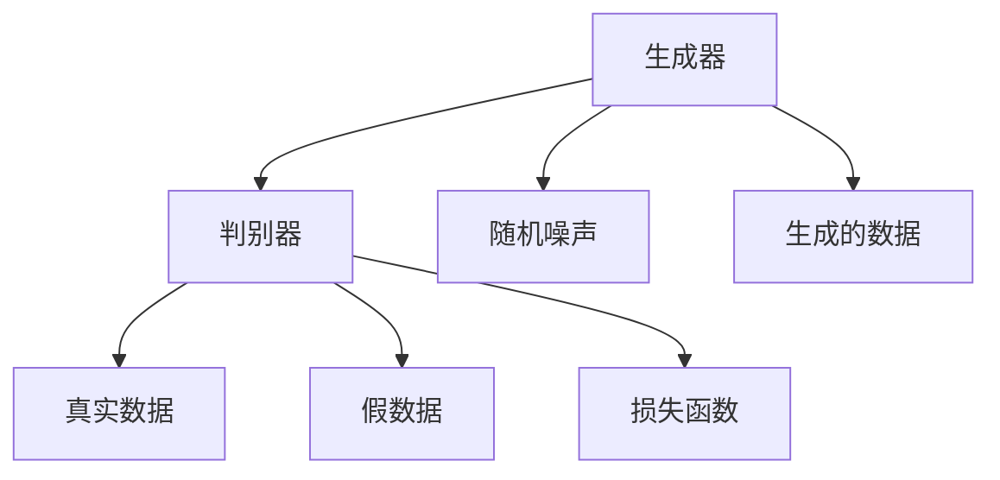

                 

## 1. 背景介绍

生成对抗网络（GAN，Generative Adversarial Networks）是一种强大的深度学习模型，于2014年由Ian Goodfellow等人提出。GAN将生成模型和判别模型视为相互博弈的两方，通过对它们进行交替训练，可以实现高质量的图像生成、视频生成、音频生成等。Ian Goodfellow因此被誉为“生成对抗网络之父”。

Ian Goodfellow出生于1979年，是一位出生于加拿大的计算机科学家。他在蒙特利尔的麦吉尔大学（McGill University）获得博士学位，并曾在微软研究院（Microsoft Research）工作。他的研究涵盖机器学习、计算机视觉和深度学习等多个领域。

GAN的提出，不仅极大地推动了人工智能的发展，也开辟了机器学习研究的新方向。GAN的创新之处在于，它将对抗性策略引入生成模型，通过两个神经网络的相互博弈，达到了在生成器和判别器之间找到一个纳什均衡点的目标。GAN的发明不仅在学术界引起了广泛关注，也在工业界引发了大量的应用和创新。

## 2. 核心概念与联系

### 2.1 核心概念概述

GAN由两个神经网络组成：生成器（Generator）和判别器（Discriminator）。生成器负责生成假数据，使其与真实数据无法区分；判别器则负责区分真实数据和假数据。两者通过对抗性训练进行交替优化，最终达到一个平衡状态。

- 生成器（Generator）：接受随机噪声作为输入，输出假数据。
- 判别器（Discriminator）：接受数据作为输入，输出判别结果。
- 损失函数（Loss Function）：用于衡量生成器和判别器之间博弈的平衡性。

### 2.2 核心概念联系

GAN的核心概念通过以下Mermaid流程图进行连接：



通过这张图，我们可以看到生成器和判别器的输入和输出，以及它们之间的博弈过程和损失函数的计算。

### 2.3 核心概念原理

GAN的基本原理如下：

1. 生成器从随机噪声中生成假数据。
2. 判别器接收真实数据和假数据，输出判别结果。
3. 生成器和判别器分别通过损失函数计算其误差。
4. 生成器和判别器交替优化，生成器试图欺骗判别器，判别器试图识别假数据。
5. 通过不断交替优化，生成器和判别器最终达到一个平衡状态，生成器可以生成逼真的假数据。

## 3. 核心算法原理 & 具体操作步骤

### 3.1 算法原理概述

GAN的算法原理可简述为：生成器与判别器的交替优化，使生成器生成的假数据足以欺骗判别器，同时判别器能够区分真实数据和假数据。

### 3.2 算法步骤详解

1. 生成器接收随机噪声作为输入，生成假数据。
2. 判别器接收真实数据和假数据作为输入，输出判别结果。
3. 计算生成器和判别器的损失函数，分别更新其参数。
4. 交替进行步骤1和步骤2，不断优化生成器和判别器的参数。
5. 最终，生成器能够生成逼真的假数据，判别器能够准确区分真实数据和假数据。

### 3.3 算法优缺点

GAN的优势在于：
- 能够生成高质量的图像、视频、音频等，逼真度接近真实数据。
- 可以实现高效的图像风格转换、图像修复等任务。
- 可以应用于数据增强、数据生成等场景。

GAN的缺点在于：
- 训练过程不稳定，存在模式崩溃（Mode Collapse）等问题。
- 生成结果具有不可解释性，难以进行精确控制。
- 对初始噪声和超参数的敏感性较高。

### 3.4 算法应用领域

GAN在以下领域有广泛的应用：
- 图像生成：生成逼真图像，如人脸生成、风景生成等。
- 图像修复：修复损坏图像，如去噪、去模糊等。
- 图像风格转换：将一种风格的图像转换成另一种风格，如将素描转换为彩色图像。
- 视频生成：生成逼真视频，如将静态图像生成动态视频。
- 音频生成：生成逼真音频，如将文本转换为语音。

## 4. 数学模型和公式 & 详细讲解

### 4.1 数学模型构建

GAN的数学模型由生成器和判别器两部分组成：

1. 生成器：$G(z)$，将随机噪声$z$映射为假数据$x$。
2. 判别器：$D(x)$，判断输入数据$x$为真实数据还是假数据。

### 4.2 公式推导过程

GAN的损失函数由两个部分组成：生成器的损失函数$L_G$和判别器的损失函数$L_D$。

1. 生成器的损失函数$L_G$：
$$
L_G = -\mathbb{E}_{z}[\log D(G(z))]
$$
2. 判别器的损失函数$L_D$：
$$
L_D = -\mathbb{E}_x[\log D(x)] + \mathbb{E}_z[\log (1 - D(G(z)))]
$$

### 4.3 案例分析与讲解

以图像生成为例，假设生成器$G(z)$接收随机噪声$z$，输出图像$x$，判别器$D(x)$判断$x$为真实图像还是假图像。则生成器的损失函数为：
$$
L_G = -\frac{1}{N}\sum_{i=1}^N \log D(G(z_i))
$$
其中$z_i$为第$i$个随机噪声。

判别器的损失函数为：
$$
L_D = \frac{1}{N}\sum_{i=1}^N \log D(x_i) + \frac{1}{N}\sum_{i=1}^N \log (1 - D(G(z_i)))
$$
其中$x_i$为第$i$个真实图像。

通过不断优化生成器和判别器的损失函数，GAN可以生成逼真的假图像。

## 5. 项目实践：代码实例和详细解释说明

### 5.1 开发环境搭建

要搭建GAN的开发环境，首先需要安装Python和TensorFlow或PyTorch等深度学习框架。

```bash
pip install tensorflow
```

### 5.2 源代码详细实现

以下是一个使用TensorFlow实现GAN的代码示例：

```python
import tensorflow as tf

# 定义生成器
def generator(z):
    # 生成器接受随机噪声作为输入
    # ...
    return x

# 定义判别器
def discriminator(x):
    # 判别器接受图像作为输入
    # ...
    return real_prob

# 定义损失函数
def loss_function():
    # 生成器的损失函数
    # ...
    # 判别器的损失函数
    # ...
    return L_G, L_D

# 定义优化器
def optimizer():
    # ...
    return opt_G, opt_D
```

### 5.3 代码解读与分析

生成器和判别器的实现主要依赖于神经网络层，包括卷积层、池化层、全连接层等。损失函数则通过TensorFlow的`tf.losses`模块实现。优化器一般使用Adam优化器。

### 5.4 运行结果展示

运行代码，训练GAN模型，可以得到生成器的输出和判别器的评估结果。通过不断调整超参数和模型结构，可以生成逼真的假图像。

## 6. 实际应用场景

### 6.1 图像生成

GAN在图像生成领域有广泛的应用，如生成逼真人脸、风景、动漫等。

### 6.2 图像修复

GAN可以用于图像修复，如去除图像中的噪声、恢复损坏的图像等。

### 6.3 图像风格转换

GAN可以将一张图像转换为另一种风格，如将素描转换为彩色图像、将卡通转换为真实图像等。

### 6.4 未来应用展望

GAN的未来应用前景广阔，除了图像生成、图像修复、图像风格转换外，还可以应用于视频生成、音频生成、文本生成等领域。GAN的创新之处在于其强大的生成能力，未来有望在更多场景下带来变革性的影响。

## 7. 工具和资源推荐

### 7.1 学习资源推荐

为了学习GAN的原理和实现，推荐以下学习资源：

1. 《Generative Adversarial Networks: Training Generative Adversarial Nets》：GAN的原始论文，介绍了GAN的基本原理和算法流程。
2. 《Deep Learning》（Ian Goodfellow、Yoshua Bengio和Aaron Courville合著）：深度学习的经典教材，详细介绍了GAN的应用和实现。
3. 《Hands-On Machine Learning with Scikit-Learn, Keras, and TensorFlow》：介绍了GAN的实现和应用，适合动手实践。

### 7.2 开发工具推荐

为了实现GAN，推荐使用以下开发工具：

1. TensorFlow：广泛使用的深度学习框架，提供了丰富的神经网络层和优化器。
2. PyTorch：灵活性高的深度学习框架，适合快速迭代实验。
3. Keras：简单易用的深度学习框架，适合初学者入门。

### 7.3 相关论文推荐

为了深入了解GAN的原理和应用，推荐以下相关论文：

1. 《Image-to-Image Translation with Conditional Adversarial Networks》：提出了条件GAN，扩展了GAN的应用场景。
2. 《Adversarial Machine Learning at Scale》：介绍了GAN在对抗性机器学习中的作用和应用。
3. 《An Analysis of Generative Adversarial Networks》：分析了GAN的优点和缺点，探讨了改进方向。

## 8. 总结：未来发展趋势与挑战

### 8.1 研究成果总结

GAN的发明推动了深度学习的发展，开辟了生成模型的新方向。其核心思想是通过对抗性训练实现高质量的数据生成，取得了显著的成果。

### 8.2 未来发展趋势

1. 增强稳定性：提高GAN训练的稳定性，避免模式崩溃等问题。
2. 提升生成质量：提高生成模型的逼真度和多样性。
3. 优化训练算法：改进GAN的训练算法，加快收敛速度。
4. 扩展应用领域：将GAN应用于更多领域，如音频生成、视频生成、文本生成等。

### 8.3 面临的挑战

1. 训练不稳定：GAN训练过程不稳定，存在模式崩溃等问题。
2. 生成质量不高：生成的假数据质量和多样性还有待提高。
3. 计算成本高：GAN的计算成本较高，需要大量的GPU资源。
4. 应用场景受限：GAN在某些应用场景下效果不佳，难以满足实际需求。

### 8.4 研究展望

未来，GAN将面临更多挑战，需要进一步的研究和改进。通过算法优化和应用创新，GAN有望在更多领域带来革命性的变化。

## 9. 附录：常见问题与解答

### Q1: 什么是生成对抗网络（GAN）？

A: 生成对抗网络（GAN）是一种深度学习模型，由生成器和判别器两部分组成。生成器从随机噪声中生成假数据，判别器判断数据是否为真实数据。通过对抗性训练，两者相互博弈，最终生成器能够生成高质量的假数据。

### Q2: GAN的应用场景有哪些？

A: GAN的应用场景包括图像生成、图像修复、图像风格转换、视频生成、音频生成等。GAN的强大生成能力使其在多种领域中都有广泛的应用。

### Q3: GAN的训练过程不稳定，如何解决？

A: GAN训练过程不稳定是常见的挑战，可以通过以下方法解决：
1. 增加噪声多样性：使用多种噪声分布作为输入，提高生成器的多样性。
2. 优化优化器：使用更稳定的优化器，如AdamW。
3. 增加训练数据：增加训练数据，提高模型的鲁棒性。

### Q4: GAN的生成质量如何提升？

A: 提高GAN的生成质量可以从以下方面入手：
1. 增加训练数据：增加训练数据，提高模型的鲁棒性。
2. 改进生成器结构：使用更复杂的生成器结构，如ResNet、U-Net等。
3. 优化损失函数：改进损失函数，使其更好地反映生成数据的逼真度。

### Q5: GAN的计算成本高，如何解决？

A: GAN的计算成本较高，可以通过以下方法解决：
1. 使用更高效的神经网络结构：使用更轻量级的神经网络结构，减少计算量。
2. 使用分布式训练：使用分布式训练，加快训练速度。
3. 使用GPU加速：使用GPU加速训练过程，提高计算效率。

---

作者：禅与计算机程序设计艺术 / Zen and the Art of Computer Programming

