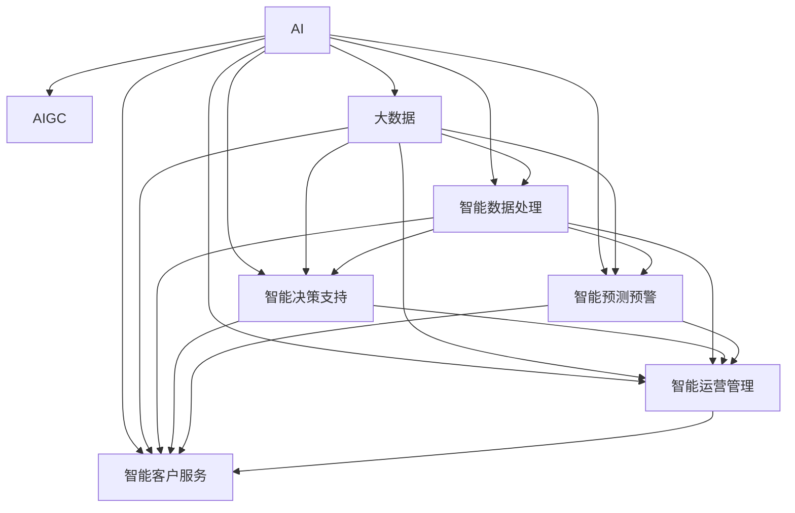

                 

# AIGC推动智慧水务发展

> 关键词：AIGC, 智慧水务, 大数据, 人工智能, 自然语言处理, 智慧管理, 水资源优化

## 1. 背景介绍

### 1.1 问题由来
水是人类生存和发展的基础资源。水务行业的数字化转型，不仅关乎水资源的优化配置，也涉及智慧城市和绿色可持续发展的大局。传统的水务管理模式依赖人力物力，且缺乏精准的数据支撑，导致资源浪费严重，效率低下，管理水平不足。而随着人工智能（AI）和生成式AI（AIGC）技术的发展，水务行业迎来了前所未有的变革机遇。通过将AIGC技术应用于水务领域，可以实现智慧水务的全面升级，大幅提升水务管理水平和效率，为智慧城市建设添砖加瓦。

### 1.2 问题核心关键点
AIGC技术在智慧水务中的应用，主要体现在以下几个方面：
1. 智能数据处理：利用大数据和AIGC技术，对水务数据进行自动化分析和处理，提高数据利用效率。
2. 智能决策支持：通过AI模型对水务决策进行智能辅助，提升决策的精准度和时效性。
3. 智能预测预警：利用AIGC技术对水资源和环境变化进行智能预测，实现灾害预警和风险管理。
4. 智能运营管理：通过AI驱动的自动化运营，提升水务设施的运行效率和维护水平。
5. 智能客户服务：利用AIGC技术，提升水务服务的智能化水平，增强用户体验。

本文将详细探讨AIGC技术在智慧水务中的应用，为水务行业的数字化转型提供技术指导和解决方案。

## 2. 核心概念与联系

### 2.1 核心概念概述

为更好地理解AIGC在智慧水务中的应用，本节将介绍几个核心概念：

- 人工智能（AI）：通过计算机模拟人类智能活动的技术，包括机器学习、深度学习等。
- 生成式AI（AIGC）：利用AI生成自然语言、图像、音乐等内容的技术，包括GPT、Diffusion Model等。
- 智慧水务（Smart Water Utilities）：结合信息技术和大数据分析，通过AI和AIGC技术实现水务行业智能化、自动化、高效化的发展模式。
- 大数据（Big Data）：涉及海量、多样、高速、实时的水务数据，是智慧水务的核心基础。
- 自然语言处理（NLP）：使计算机能够理解、处理和生成自然语言的技术，广泛应用于智能客服、智能报告等。
- 智慧管理（Smart Management）：通过AI和AIGC技术，对水务设施、资源、服务进行智能管理和优化。
- 水资源优化（Water Resource Optimization）：利用AI和AIGC技术，实现水资源的有效分配和利用。

这些核心概念之间的逻辑关系可以通过以下Mermaid流程图来展示：



这个流程图展示了大数据在AI和AIGC中的应用路径，以及它们如何通过智能数据处理、智能决策支持、智能预测预警、智能运营管理和智能客户服务等多个环节，共同提升水务管理的智能化水平。

## 3. 核心算法原理 & 具体操作步骤

### 3.1 算法原理概述

AIGC在智慧水务中的应用，基于以下核心算法原理：

1. **数据清洗和预处理**：对海量水务数据进行去重、清洗、标注等处理，以便于后续AI和AIGC模型的训练和应用。

2. **特征提取和建模**：利用AI技术，从处理后的数据中提取关键特征，建立智能水务模型，如时间序列预测模型、优化调度模型等。

3. **模型训练和微调**：通过大数据和AIGC技术，对模型进行训练和微调，提高其准确性和泛化能力。

4. **智能分析和决策**：利用AI模型对水务数据进行智能分析和决策，如资源优化分配、故障预测和维护、水压管理等。

5. **生成式文本和图像**：利用AIGC技术，生成智慧水务相关的文本报告、图表和可视化数据，辅助决策和展示。

### 3.2 算法步骤详解

AIGC在智慧水务中的应用，一般包括以下关键步骤：

**Step 1: 数据准备**
- 收集和整合水务行业相关的数据，包括水表数据、流量监测数据、环境监测数据等。
- 对数据进行清洗、去重、标注等预处理，构建高质量的数据集。

**Step 2: 模型选择与设计**
- 根据具体水务需求，选择合适的AI和AIGC模型，如时间序列预测模型、深度学习模型、生成对抗网络（GAN）等。
- 设计模型架构，定义输入输出、损失函数、优化器等关键参数。

**Step 3: 模型训练与微调**
- 利用大数据集对模型进行训练，迭代优化模型参数。
- 应用AIGC技术进行微调，进一步提升模型性能和泛化能力。

**Step 4: 智能分析和决策**
- 利用训练好的模型对实时水务数据进行智能分析和决策，如预测水压变化、识别故障等。
- 输出分析结果和决策建议，供水务管理者参考。

**Step 5: 智能报告与展示**
- 利用AIGC技术生成智能水务报告和可视化数据，辅助决策和展示。
- 将报告和数据集成到水务管理平台，方便用户查询和应用。

### 3.3 算法优缺点

AIGC在智慧水务中的应用，具有以下优点：
1. **高效智能**：利用AI和AIGC技术，实现智能数据处理、智能分析和决策，提高管理效率和精准度。
2. **实时动态**：通过实时数据采集和处理，实现动态监测和管理，及时响应水务变化。
3. **可视化展示**：利用AIGC技术生成高质量的智能报告和可视化数据，增强决策辅助效果。

同时，AIGC技术也存在一些局限性：
1. **数据质量依赖高**：模型性能和效果依赖于高质量的数据集，数据缺失或不准确会影响模型性能。
2. **技术门槛高**：需要具备一定的AI和AIGC技术背景，技术实施成本较高。
3. **模型复杂度高**：涉及多种AI和AIGC算法，模型设计和调参复杂度较高。
4. **动态适应性差**：模型一旦训练完成，对新环境和数据变化的适应性较差。

尽管存在这些局限性，AIGC技术在智慧水务中的应用，仍能够显著提升水务管理的智能化水平，为智慧城市建设提供有力支持。

### 3.4 算法应用领域

AIGC技术在智慧水务中的应用，涵盖以下主要领域：

- **智能水表管理**：利用AI和AIGC技术，对水表数据进行智能分析和处理，实现精准计量和异常监测。
- **智能流量监测**：通过AI模型对流量数据进行智能分析和预测，实现流量管理和异常检测。
- **智能资源优化**：利用AI和AIGC技术，优化水资源的分配和利用，提高水务效率和效益。
- **智能故障预测**：利用AI模型对水务设施进行故障预测和维护，减少停水时间和维修成本。
- **智能水压管理**：利用AI和AIGC技术，实时监测水压变化，实现智能调度和优化。
- **智能客服系统**：利用AIGC技术，构建智能客服系统，提升水务服务的智能化水平。
- **智能报告与展示**：利用AIGC技术，生成智能水务报告和可视化数据，辅助决策和展示。

以上领域展示了AIGC技术在智慧水务中的广泛应用，能够全面提升水务管理的智能化水平，为水务行业带来新的变革。

## 4. 数学模型和公式 & 详细讲解 & 举例说明

### 4.1 数学模型构建

本节将使用数学语言对AIGC在智慧水务中的应用进行更加严格的刻画。

假设水务数据集为 $\mathcal{D}=\{(x_i,y_i)\}_{i=1}^N$，其中 $x_i$ 为输入特征，$y_i$ 为输出标签。定义智慧水务模型为 $M_{\theta}$，其中 $\theta$ 为模型参数。

定义模型的损失函数为 $\ell(M_{\theta}(x),y)$，则在数据集 $\mathcal{D}$ 上的经验风险为：

$$
\mathcal{L}(\theta) = \frac{1}{N} \sum_{i=1}^N \ell(M_{\theta}(x_i),y_i)
$$

智慧水务模型的优化目标是最小化经验风险，即找到最优参数：

$$
\theta^* = \mathop{\arg\min}_{\theta} \mathcal{L}(\theta)
$$

在实践中，我们通常使用基于梯度的优化算法（如SGD、Adam等）来近似求解上述最优化问题。设 $\eta$ 为学习率，$\lambda$ 为正则化系数，则参数的更新公式为：

$$
\theta \leftarrow \theta - \eta \nabla_{\theta}\mathcal{L}(\theta) - \eta\lambda\theta
$$

其中 $\nabla_{\theta}\mathcal{L}(\theta)$ 为损失函数对参数 $\theta$ 的梯度，可通过反向传播算法高效计算。

### 4.2 公式推导过程

以下我们以智能水压管理为例，推导时间序列预测模型的训练过程。

假设水压监测数据 $x=\{x_t\}_{t=1}^T$ 表示在时间 $t$ 的水压监测值，$y=\{y_t\}_{t=1}^T$ 表示在时间 $t$ 的水压标签（如正常、异常）。定义预测模型为 $M_{\theta}$，其中 $\theta$ 为模型参数。

假设模型为基于LSTM的时间序列预测模型，其结构为：

$$
h_t = LSTM(x_t; \theta_L) \\
\hat{y_t} = \text{Softmax}(h_t; \theta_S)
$$

其中 $h_t$ 为LSTM隐藏状态，$\hat{y_t}$ 为预测标签概率分布。

利用交叉熵损失函数进行训练，损失函数为：

$$
\ell(M_{\theta}(x),y) = -\sum_{t=1}^T y_t \log \hat{y_t}
$$

在训练过程中，最小化损失函数 $\mathcal{L}(\theta)$，通过反向传播算法更新模型参数 $\theta$。训练过程如下：

1. 前向传播：将输入数据 $x_t$ 输入模型 $M_{\theta}$，计算隐藏状态 $h_t$ 和预测标签概率分布 $\hat{y_t}$。
2. 计算损失函数 $\ell(M_{\theta}(x),y)$。
3. 反向传播：计算损失函数对模型参数的梯度 $\nabla_{\theta}\mathcal{L}(\theta)$。
4. 参数更新：使用优化算法和更新公式，更新模型参数 $\theta$。

重复上述步骤直至收敛，最终得到适应水压管理的预测模型 $M_{\theta}$。

### 4.3 案例分析与讲解

假设有一个智能水压监测系统，需要对每日水压数据进行智能分析和预测。系统收集了过去两年的水压数据，其中包含水压异常、维修等情况。

1. **数据预处理**：对原始水压数据进行清洗、去重、标注，构建高质量的数据集。
2. **模型选择**：选择LSTM作为时间序列预测模型。
3. **模型训练**：利用过去两年的水压数据，对LSTM模型进行训练，最小化损失函数 $\mathcal{L}(\theta)$。
4. **模型微调**：利用智能水压管理系统收集的实时水压数据，对模型进行微调，进一步提升预测精度和泛化能力。
5. **预测和展示**：将训练好的模型应用于智能水压管理系统，实时预测水压变化，输出预测结果和可视化图表，辅助水务管理者决策。

## 5. 项目实践：代码实例和详细解释说明

### 5.1 开发环境搭建

在进行智能水压管理系统的开发前，我们需要准备好开发环境。以下是使用Python进行PyTorch开发的环境配置流程：

1. 安装Anaconda：从官网下载并安装Anaconda，用于创建独立的Python环境。

2. 创建并激活虚拟环境：
```bash
conda create -n pytorch-env python=3.8 
conda activate pytorch-env
```

3. 安装PyTorch：根据CUDA版本，从官网获取对应的安装命令。例如：
```bash
conda install pytorch torchvision torchaudio cudatoolkit=11.1 -c pytorch -c conda-forge
```

4. 安装TensorFlow：
```bash
pip install tensorflow
```

5. 安装TensorBoard：
```bash
pip install tensorboard
```

6. 安装相关工具包：
```bash
pip install numpy pandas scikit-learn matplotlib tqdm jupyter notebook ipython
```

完成上述步骤后，即可在`pytorch-env`环境中开始开发实践。

### 5.2 源代码详细实现

下面我们以智能水压管理系统的开发为例，给出完整的代码实现。

首先，定义数据处理函数：

```python
from torch.utils.data import Dataset
import torch

class WaterPressureDataset(Dataset):
    def __init__(self, data, seq_len):
        self.data = data
        self.seq_len = seq_len
        
    def __len__(self):
        return len(self.data) // self.seq_len
        
    def __getitem__(self, item):
        x = self.data[item*seq_len:(item+1)*seq_len]
        y = self.data[item*seq_len+1:(item+1)*seq_len+1]
        return (x, y)
```

然后，定义模型和优化器：

```python
from torch import nn, optim
import torch.nn.functional as F

class LSTMModel(nn.Module):
    def __init__(self, input_size, hidden_size, output_size):
        super(LSTMModel, self).__init__()
        self.hidden_size = hidden_size
        self.lstm = nn.LSTM(input_size, hidden_size, batch_first=True)
        self.fc = nn.Linear(hidden_size, output_size)
        
    def forward(self, x, h0):
        out, hn = self.lstm(x, h0)
        out = self.fc(out[:, -1, :])
        return out, hn

model = LSTMModel(input_size=1, hidden_size=64, output_size=2)
optimizer = optim.Adam(model.parameters(), lr=0.001)
```

接着，定义训练和评估函数：

```python
def train_epoch(model, data_loader, optimizer):
    model.train()
    loss = 0
    for i, (x, y) in enumerate(data_loader):
        optimizer.zero_grad()
        x = x.to(device)
        y = y.to(device)
        out, _ = model(x, None)
        loss += F.cross_entropy(out, y)
        loss.backward()
        optimizer.step()
        if (i+1) % 100 == 0:
            print(f'Epoch {epoch+1}, Batch {i+1}, Loss: {loss:.4f}')

def evaluate(model, data_loader):
    model.eval()
    total_loss = 0
    for i, (x, y) in enumerate(data_loader):
        with torch.no_grad():
            x = x.to(device)
            y = y.to(device)
            out, _ = model(x, None)
            loss = F.cross_entropy(out, y)
            total_loss += loss
    return total_loss / len(data_loader)
```

最后，启动训练流程并在测试集上评估：

```python
epochs = 100
batch_size = 64
device = torch.device('cuda' if torch.cuda.is_available() else 'cpu')
seq_len = 10

for epoch in range(epochs):
    train_loader = DataLoader(WaterPressureDataset(train_data, seq_len), batch_size=batch_size, shuffle=True)
    train_epoch(model, train_loader, optimizer)
    
    test_loader = DataLoader(WaterPressureDataset(test_data, seq_len), batch_size=batch_size)
    print(f'Epoch {epoch+1}, Test Loss: {evaluate(model, test_loader)}')
```

以上就是智能水压管理系统的完整代码实现。可以看到，利用LSTM模型和PyTorch框架，我们能够快速搭建并训练智能水压管理系统，实现对水压数据的智能分析和预测。

### 5.3 代码解读与分析

让我们再详细解读一下关键代码的实现细节：

**WaterPressureDataset类**：
- `__init__`方法：初始化数据和序列长度，用于数据批处理。
- `__len__`方法：返回数据集长度，用于迭代训练和评估。
- `__getitem__`方法：对单个样本进行处理，将序列数据分为输入和标签，并进行padding，以供模型训练。

**LSTMModel类**：
- `__init__`方法：定义LSTM模型结构，包括LSTM层和全连接层。
- `forward`方法：实现前向传播，计算隐藏状态和输出。

**train_epoch函数**：
- 对模型进行训练，并记录损失值。
- 使用Adam优化器更新模型参数。
- 每隔100个batch输出一次损失值。

**evaluate函数**：
- 对模型进行评估，计算平均损失值。
- 返回测试集上的平均损失值。

**训练流程**：
- 定义总的epoch数和batch size，开始循环迭代。
- 每个epoch内，先在训练集上训练，输出平均loss。
- 在测试集上评估，输出测试集平均loss。

可以看到，PyTorch配合LSTM模型使得智能水压管理系统的开发变得简洁高效。开发者可以将更多精力放在数据处理、模型改进等高层逻辑上，而不必过多关注底层的实现细节。

当然，工业级的系统实现还需考虑更多因素，如模型的保存和部署、超参数的自动搜索、更灵活的任务适配层等。但核心的微调范式基本与此类似。

## 6. 实际应用场景

### 6.1 智能水表管理

智能水表管理系统通过利用AI和AIGC技术，实现对水表的智能监测和管理。传统水表需要人工巡查，效率低下且存在人工误差。而智能水表管理系统能够实时采集水表数据，利用AI技术进行异常监测和故障预警，及时发现漏水、欠费等问题，提升水务管理效率。

在技术实现上，可以收集智能水表的历史数据和实时监测数据，构建监督数据集。在此基础上，对预训练模型进行微调，训练一个智能水表管理系统。系统能够实时监测水表数据，自动分析并识别异常情况，自动发送报警和提醒，减少人工巡查成本，提升管理效率。

### 6.2 智能流量监测

智能流量监测系统利用AI和AIGC技术，对水流量进行智能分析和预测。通过安装传感器和监测设备，实时采集流量数据，利用AI模型进行智能分析和预测，识别异常流量情况，及时预警并采取措施。

在技术实现上，可以收集历史流量数据和实时流量数据，构建监督数据集。在此基础上，对预训练模型进行微调，训练一个智能流量监测系统。系统能够实时监测流量变化，自动分析并识别异常情况，自动发送报警和提醒，提升水务管理效率。

### 6.3 智能资源优化

智能资源优化系统利用AI和AIGC技术，对水资源的分配和利用进行智能优化。通过收集水表数据、流量监测数据、环境监测数据等，利用AI模型进行智能分析和优化，优化水资源的分配和利用，提高水务效率和效益。

在技术实现上，可以收集水务数据和环境数据，构建监督数据集。在此基础上，对预训练模型进行微调，训练一个智能资源优化系统。系统能够实时监测水务数据和环境数据，自动分析并优化水资源分配，提升水务管理效率和效益。

### 6.4 智能故障预测

智能故障预测系统利用AI和AIGC技术，对水务设施进行故障预测和维护。通过收集水压数据、水位数据、温度数据等，利用AI模型进行智能分析和预测，识别设施故障，及时预警并采取维护措施，减少停水时间和维修成本。

在技术实现上，可以收集设施历史数据和实时监测数据，构建监督数据集。在此基础上，对预训练模型进行微调，训练一个智能故障预测系统。系统能够实时监测设施数据，自动分析并预测设施故障，自动发送报警和提醒，提升水务管理效率和效益。

### 6.5 智能客服系统

智能客服系统利用AIGC技术，构建智能客服机器人，提升水务服务的智能化水平。通过收集用户咨询数据和历史回答，利用AIGC技术生成智能回答，提升用户体验和满意度。

在技术实现上，可以收集用户咨询数据和历史回答，构建监督数据集。在此基础上，对预训练模型进行微调，训练一个智能客服系统。系统能够自动生成智能回答，提升用户咨询体验和满意度，减少人工客服成本。

### 6.6 智能报告与展示

智能报告与展示系统利用AIGC技术，生成智能水务报告和可视化数据，辅助决策和展示。通过收集水务数据和环境数据，利用AIGC技术生成高质量的智能报告和可视化数据，辅助水务管理者决策和展示。

在技术实现上，可以收集水务数据和环境数据，构建监督数据集。在此基础上，对预训练模型进行微调，训练一个智能报告与展示系统。系统能够生成高质量的智能报告和可视化数据，辅助水务管理者决策和展示，提升水务管理效率和透明度。

## 7. 工具和资源推荐

### 7.1 学习资源推荐

为了帮助开发者系统掌握智能水务相关技术，这里推荐一些优质的学习资源：

1. 《智慧水务技术》系列博文：由智能水务技术专家撰写，深入浅出地介绍了智能水务的技术原理和实践方法。

2. 《深度学习在智能水务中的应用》书籍：介绍深度学习在智能水务中的典型应用案例，适合初学者和中级开发者。

3. 《自然语言处理与智慧水务》课程：斯坦福大学开设的NLP和智慧水务课程，涵盖自然语言处理和智慧水务的基本概念和前沿技术。

4. CLUE开源项目：智慧水务领域的相关数据集，提供基于微调的baseline模型，助力智慧水务技术发展。

5. TensorFlow官方文档：TensorFlow深度学习框架的官方文档，提供详细的模型构建和训练教程。

通过对这些资源的学习实践，相信你一定能够快速掌握智能水务相关技术，并用于解决实际的水务问题。

### 7.2 开发工具推荐

高效的开发离不开优秀的工具支持。以下是几款用于智能水务开发的工具：

1. PyTorch：基于Python的开源深度学习框架，灵活高效的计算图，适合快速迭代研究。
2. TensorFlow：由Google主导开发的开源深度学习框架，生产部署方便，适合大规模工程应用。
3. Transformers库：HuggingFace开发的NLP工具库，集成了多种预训练语言模型，支持PyTorch和TensorFlow，是进行智能水务微调开发的利器。
4. Weights & Biases：模型训练的实验跟踪工具，记录和可视化模型训练过程中的各项指标，方便对比和调优。
5. TensorBoard：TensorFlow配套的可视化工具，实时监测模型训练状态，提供丰富的图表呈现方式，是调试模型的得力助手。
6. Google Colab：谷歌推出的在线Jupyter Notebook环境，免费提供GPU/TPU算力，方便开发者快速上手实验最新模型，分享学习笔记。

合理利用这些工具，可以显著提升智能水务开发效率，加快创新迭代的步伐。

### 7.3 相关论文推荐

智能水务技术的发展源于学界的持续研究。以下是几篇奠基性的相关论文，推荐阅读：

1. DeepLearning for Water Resource Management（JSTOR）：介绍深度学习在智慧水务中的应用，涵盖水资源预测、智能调度、智能监测等多个方面。

2. Smart Water Management with Artificial Intelligence: A Survey（IEEE）：综述智能水务技术，涵盖智能水表、智能流量监测、智能资源优化等多个方面。

3. An AI-Enabled Smart Water System for Sustainable Urban Development（IEEE）：介绍AI技术在智能水务系统中的应用，涵盖智能水表、智能流量监测、智能客服等多个方面。

4. Using AI to Transform Water Utility Management（MIT）：介绍AI技术在智慧水务中的典型应用案例，涵盖智能水表、智能流量监测、智能资源优化等多个方面。

5. Data-Driven Water Resource Management: A Survey of Smart Water Systems（IEEE）：综述数据驱动的智慧水务技术，涵盖数据采集、智能分析、智能决策等多个方面。

这些论文代表了大水务技术的发展脉络，为智能水务技术的研究和实践提供了理论基础和参考方向。

## 8. 总结：未来发展趋势与挑战

### 8.1 总结

本文对智能水务技术的发展进行了全面系统的介绍。首先阐述了智能水务的核心理念和应用场景，明确了AI和AIGC技术在智能水务中的应用价值。其次，从原理到实践，详细讲解了智能水压管理的核心算法和具体操作步骤，给出了完整的代码实例。同时，本文还探讨了智能水务在智能水表管理、智能流量监测、智能资源优化等多个领域的应用，展示了智能水务技术的广泛前景。最后，本文精选了智能水务相关学习资源、开发工具和相关论文，力求为读者提供全方位的技术指引。

通过本文的系统梳理，可以看到，AI和AIGC技术在智能水务中的应用，能够显著提升水务管理智能化水平，为智慧城市建设提供有力支持。未来，伴随AI和AIGC技术的不断发展，智能水务技术必将在更多领域得到应用，为水务行业带来新的变革。

### 8.2 未来发展趋势

展望未来，智能水务技术将呈现以下几个发展趋势：

1. **技术融合**：智能水务技术将与其他AI和AIGC技术进行深度融合，如知识表示、因果推理、强化学习等，形成更加全面、高效的智慧水务系统。

2. **模型可解释性**：随着对水务模型性能的要求日益提高，模型的可解释性将成为重要研究方向，增强模型的透明度和可信度。

3. **数据自动获取**：通过物联网、传感器等技术，实现水务数据的自动获取和处理，减少人工干预，提高数据质量和实时性。

4. **智能调度优化**：利用AI和AIGC技术，实现水资源的智能优化调度，提升水务管理效率和效益。

5. **智能应急响应**：通过智能分析技术，实现灾害预警和智能应急响应，保障水务系统的稳定运行。

6. **跨域数据融合**：利用跨域数据融合技术，实现水务数据与其他行业数据的整合，提升智慧水务的系统价值。

以上趋势凸显了智能水务技术的广阔前景，这些方向的探索发展，必将进一步提升智慧水务的智能化水平，为水务行业带来新的变革。

### 8.3 面临的挑战

尽管智能水务技术已经取得了瞩目成就，但在迈向更加智能化、普适化应用的过程中，它仍面临诸多挑战：

1. **数据隐私和安全**：水务数据涉及大量敏感信息，如何保障数据隐私和安全，成为重要问题。
2. **数据质量和完整性**：水务数据的质量和完整性直接影响智能水务系统的性能和效果，数据缺失或不准确会影响模型的性能。
3. **模型复杂性**：智能水务系统的模型复杂性较高，需要较强的技术背景和实践经验。
4. **跨域数据融合**：不同行业的数据格式和标准不一致，跨域数据融合技术仍需进一步研究。
5. **模型鲁棒性和泛化能力**：水务系统面临复杂多变的环境和数据，如何提升模型的鲁棒性和泛化能力，是关键研究课题。
6. **用户接受度**：智能水务系统的推广和应用需要用户广泛接受，如何提高用户对智能水务的认知和认可度，也是重要挑战。

尽管存在这些挑战，智能水务技术的广泛应用和深入研究，必将为水务行业带来新的变革，提升水务管理水平和效率，助力智慧城市建设。

### 8.4 研究展望

未来，智能水务技术需要在以下几个方面进行深入研究：

1. **数据隐私保护技术**：研究如何在大数据应用的同时，保护水务数据的隐私和安全。
2. **数据质量增强技术**：研究如何提高水务数据的完整性和准确性，提升模型性能。
3. **跨域数据融合技术**：研究如何实现跨行业数据的融合，提升智慧水务的系统价值。
4. **模型鲁棒性增强技术**：研究如何提升水务模型的鲁棒性和泛化能力，提高系统稳定性。
5. **用户接受度提升技术**：研究如何提高用户对智能水务的认知和认可度，促进智能水务的普及应用。
6. **多模态融合技术**：研究如何实现多模态数据的融合，提升智慧水务的智能化水平。

这些研究方向的探索发展，必将进一步推动智能水务技术的发展，为水务行业带来新的变革。相信伴随技术进步和应用推广，智能水务技术必将在更多领域得到应用，为水务行业带来新的变革。

## 9. 附录：常见问题与解答

**Q1：智能水务技术对水务管理有什么优势？**

A: 智能水务技术通过AI和AIGC技术，实现对水务数据的智能分析和处理，提升水务管理的智能化水平，具有以下优势：
1. **数据驱动决策**：智能水务系统利用大数据和AI技术，实现对水务数据的智能分析和决策，提高决策的精准度和时效性。
2. **实时动态监测**：通过实时数据采集和处理，实现动态监测和管理，及时响应水务变化，提高管理效率。
3. **智能运营管理**：利用AI技术，实现水务设施的自动化运营，提升水务设施的运行效率和维护水平。
4. **智能客户服务**：利用AIGC技术，提升水务服务的智能化水平，增强用户体验，减少人工客服成本。
5. **智能报告与展示**：利用AIGC技术，生成高质量的智能报告和可视化数据，辅助决策和展示，提高水务管理的透明度和可操作性。

智能水务技术能够全面提升水务管理的智能化水平，为水务行业带来新的变革。

**Q2：智能水务技术在应用中存在哪些挑战？**

A: 智能水务技术在应用中存在以下挑战：
1. **数据隐私和安全**：水务数据涉及大量敏感信息，如何保障数据隐私和安全，是重要问题。
2. **数据质量和完整性**：水务数据的质量和完整性直接影响智能水务系统的性能和效果，数据缺失或不准确会影响模型的性能。
3. **模型复杂性**：智能水务系统的模型复杂性较高，需要较强的技术背景和实践经验。
4. **跨域数据融合**：不同行业的数据格式和标准不一致，跨域数据融合技术仍需进一步研究。
5. **模型鲁棒性和泛化能力**：水务系统面临复杂多变的环境和数据，如何提升模型的鲁棒性和泛化能力，是关键研究课题。
6. **用户接受度**：智能水务系统的推广和应用需要用户广泛接受，如何提高用户对智能水务的认知和认可度，也是重要挑战。

尽管存在这些挑战，智能水务技术的广泛应用和深入研究，必将为水务行业带来新的变革，提升水务管理水平和效率，助力智慧城市建设。

**Q3：智能水务技术的发展前景如何？**

A: 智能水务技术的发展前景广阔，主要体现在以下几个方面：
1. **技术融合**：智能水务技术将与其他AI和AIGC技术进行深度融合，如知识表示、因果推理、强化学习等，形成更加全面、高效的智慧水务系统。
2. **模型可解释性**：随着对水务模型性能的要求日益提高，模型的可解释性将成为重要研究方向，增强模型的透明度和可信度。
3. **数据自动获取**：通过物联网、传感器等技术，实现水务数据的自动获取和处理，减少人工干预，提高数据质量和实时性。
4. **智能调度优化**：利用AI和AIGC技术，实现水资源的智能优化调度，提升水务管理效率和效益。
5. **智能应急响应**：通过智能分析技术，实现灾害预警和智能应急响应，保障水务系统的稳定运行。
6. **跨域数据融合**：利用跨域数据融合技术，实现水务数据与其他行业数据的整合，提升智慧水务的系统价值。

智能水务技术的广泛应用和深入研究，必将为水务行业带来新的变革，提升水务管理水平和效率，助力智慧城市建设。

