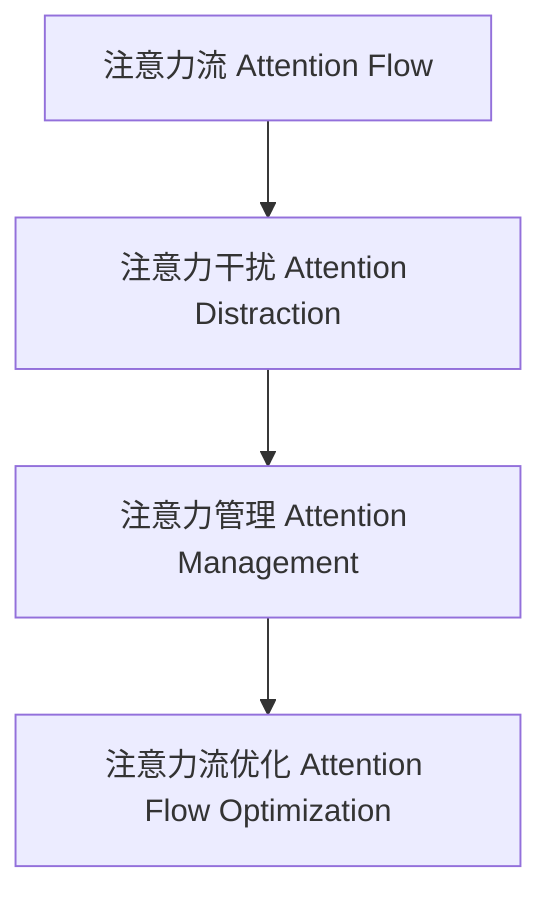

                 

# AI与人类注意力流：未来的工作、技能与注意力流管理技术的应用前景趋势分析预测

## 1. 背景介绍

### 1.1 问题由来

随着人工智能(AI)技术的飞速发展，人类与机器的交互方式正在发生深刻变革。特别是深度学习、自然语言处理、计算机视觉等技术的突破，使得AI系统能够理解和生成人类语言，具备一定的自主决策和行动能力。然而，尽管AI系统在技术上已经相当成熟，其在实际应用中仍面临着诸多挑战，其中最核心的问题之一是人类注意力流的管理。

人类注意力流是指人类在执行任务或进行交互时，注意力集中于特定对象或区域的过程。在AI系统辅助下，人类的注意力流会受到不同程度的干扰，导致工作效率降低、工作体验受损。例如，在智能客服系统中，用户在使用语音助手时可能会被各种提示打断，注意力分散；在智能驾驶中，系统频繁提示驾驶者注意可能的风险，干扰驾驶注意力；在智能办公中，系统推送的信息过多，导致员工无法集中精力完成任务。

解决这一问题，不仅需要提高AI系统的智能化水平，还需要深入理解人类注意力流的本质，探索高效的管理技术。本文将深入探讨人类注意力流的本质，分析AI技术在处理注意力流中的现状与挑战，并展望未来的应用前景和趋势。

### 1.2 问题核心关键点

人类注意力流的管理，需要考虑以下几个关键点：

- **注意力流的本质**：人类注意力流的本质是什么？其背后的心理学和神经科学原理是什么？
- **AI系统的干扰**：AI系统如何干扰人类注意力流？其影响因素有哪些？
- **注意力管理技术**：现有注意力流管理技术有哪些？其优缺点是什么？
- **未来的应用趋势**：未来的注意力流管理技术将如何发展？有哪些潜在的应用场景？

这些核心问题将引领我们深入理解人类注意力流，探索AI系统如何更高效地管理人类注意力，从而提升工作与生活的质量。

### 1.3 问题研究意义

研究人类注意力流的本质与AI系统的交互方式，对于提升工作效率、改善用户体验、推动AI技术的产业化应用具有重要意义：

1. **提升工作效率**：通过科学管理人类注意力流，避免注意力分散，提高完成任务的速度和质量。
2. **改善用户体验**：减少AI系统对人类注意力的干扰，提高用户使用AI产品的满意度。
3. **推动AI产业化**：AI系统能够更高效地管理注意力流，具备更好的应用适应性和用户黏性，促进AI技术的广泛应用。

## 2. 核心概念与联系

### 2.1 核心概念概述

为更好地理解AI系统如何影响人类注意力流，本节将介绍几个密切相关的核心概念：

- **注意力流(Attention Flow)**：人类在执行任务或进行交互时，注意力集中于特定对象或区域的过程。注意力流可以分为自上而下的集中注意力和自下而上的分心注意力。
- **注意力干扰(Attention Distraction)**：AI系统在交互过程中，由于频繁的提示、信息推送等行为，对人类注意力流产生的干扰，导致注意力分散。
- **注意力管理(Attention Management)**：通过技术手段，对AI系统产生的注意力干扰进行管理，避免对人类注意力流造成负面影响。
- **注意力流优化(Attention Flow Optimization)**：通过科学方法，提升AI系统与人类交互过程中的注意力流效率，提高工作与生活的质量。

这些核心概念之间的逻辑关系可以通过以下Mermaid流程图来展示：



这个流程图展示了他人类注意力流与AI系统交互过程中的关键环节：

1. 人类注意力流被AI系统干扰，产生注意力分散。
2. 对注意力干扰进行管理，减少对注意力流的影响。
3. 通过优化注意力流管理技术，提升AI系统与人类交互的效率和质量。

## 3. 核心算法原理 & 具体操作步骤

### 3.1 算法原理概述

基于注意力流的AI系统管理，其核心思想是通过对注意力流的科学理解，设计合理的技术手段，减少AI系统对人类注意力的干扰，提升注意力流的效率。这一过程可以分为两个主要步骤：

1. **注意力干扰识别与度量**：通过心理学和神经科学的原理，对注意力流的变化进行量化，识别出AI系统对人类注意力的干扰行为。
2. **注意力干扰管理与优化**：基于识别出的干扰行为，设计并实施针对性的管理技术，减少干扰，优化注意力流。

具体而言，注意力干扰的管理与优化可以包括以下几个关键环节：

- **注意力的测量**：使用眼动追踪、脑电波监测等技术，对人类注意力流进行实时测量。
- **干扰行为的分析**：对AI系统的行为模式进行分析，找出对注意力流产生干扰的关键因素。
- **干扰行为的矫正**：设计并实现减少干扰的技术手段，如静音提示、优化信息推送策略等。
- **注意力的优化**：通过持续的测量与调整，不断优化AI系统与人类交互过程中的注意力流。

### 3.2 算法步骤详解

基于注意力流的AI系统管理，一般包括以下几个关键步骤：

**Step 1: 数据收集与预处理**
- 使用眼动追踪、脑电波监测等技术，收集人类在执行任务或进行交互时的注意力流数据。
- 对数据进行清洗和预处理，去除异常值和噪声。

**Step 2: 注意力流分析与干扰识别**
- 通过心理学和神经科学的原理，分析注意力流的变化，识别出AI系统对人类注意力的干扰行为。
- 统计不同干扰行为的出现频率和持续时间，评估其对注意力流的影响程度。

**Step 3: 注意力干扰管理**
- 设计并实现减少干扰的技术手段，如静音提示、优化信息推送策略等。
- 根据不同任务的特性，调整AI系统的交互方式，减少对人类注意力的干扰。

**Step 4: 注意力流优化**
- 在实际应用中，持续收集人类注意力流数据，实时监测AI系统的行为模式，调整管理策略。
- 通过反馈机制，不断优化AI系统与人类交互过程中的注意力流。

### 3.3 算法优缺点

基于注意力流的AI系统管理方法具有以下优点：
1. **提高工作效率**：减少AI系统对人类注意力的干扰，使人类能够更专注地完成任务，提高工作效率。
2. **改善用户体验**：通过优化注意力流管理技术，提升用户使用AI产品的满意度，增加用户黏性。
3. **降低成本**：通过科学管理注意力流，减少不必要的提示和信息推送，降低系统资源消耗。

同时，该方法也存在一定的局限性：
1. **技术复杂性**：注意力流的测量与分析需要复杂的技术手段，对技术要求较高。
2. **用户隐私**：注意力流监测涉及用户隐私，需要谨慎处理。
3. **实时性要求高**：注意力流的实时监测与反馈需要高实时性，对系统性能要求较高。

尽管存在这些局限性，但就目前而言，基于注意力流的AI系统管理方法仍是大规模AI应用的重要方向。未来相关研究的重点在于如何进一步降低技术复杂性，提高实时性，同时兼顾用户隐私和安全等因素。

### 3.4 算法应用领域

基于注意力流的AI系统管理方法，在多个领域中已经得到了应用，并展现出巨大的潜力：

- **智能办公**：通过优化注意力流，提升员工在办公环境中的工作效率，减少因干扰而导致的错误率。
- **智能客服**：减少系统提示对客户注意力的干扰，提升客户满意度，降低客服成本。
- **智能驾驶**：减少驾驶者对系统提示的注意力分散，提高驾驶安全性。
- **智能医疗**：通过优化注意力流，减少医生在信息输入中的注意力分散，提高诊疗效率。
- **智能家居**：优化家庭自动化系统的交互，减少对用户注意力的干扰，提高生活质量。

除了上述这些经典应用外，基于注意力流的AI系统管理方法还被创新性地应用到更多场景中，如智能安防、智能制造、智能交通等，为各行各业带来新的技术变革。随着技术的不断进步，相信这一方法将在更广泛的领域发挥其应用价值。

## 4. 数学模型和公式 & 详细讲解 & 举例说明

### 4.1 数学模型构建

本节将使用数学语言对基于注意力流的AI系统管理方法进行更加严格的刻画。

设人类注意力流在任务$t$上的变化率为$A_t$，系统对注意力流的干扰程度为$I_t$，注意力流的优化目标是最小化干扰程度，即找到最优参数：

$$
\theta^* = \mathop{\arg\min}_{\theta} \sum_{t=1}^T A_t I_t
$$

其中$\theta$为AI系统交互方式的相关参数，$T$为总任务数。

注意力流和干扰程度的度量可以通过心理学和神经科学的实验数据获得，具体公式如下：

- 注意力流变化率$A_t$：$$A_t = \frac{R_t - R_{t-1}}{\Delta t}$$，其中$R_t$为任务$t$的注意力集中度，$\Delta t$为时间间隔。
- 干扰程度$I_t$：$$I_t = \int_{t_0}^{t} \omega(t') dt'$$，其中$\omega(t')$为系统在$t'$时刻对注意力流的干扰强度。

### 4.2 公式推导过程

以下我们以智能办公环境为例，推导注意力流和干扰程度的数学模型。

设智能办公系统在某个任务$t$上，向员工推送了$n$条信息，每条信息在$t_i$时刻推送，其中$i=1,\dots,n$。系统对注意力流的干扰程度$I_t$可以表示为：

$$
I_t = \sum_{i=1}^n \int_{t_i}^{t_{i+1}} \omega(t') dt'
$$

其中$\omega(t')$表示第$i$条信息在$t'$时刻对员工注意力的干扰强度。假设信息在$t'$时刻的干扰强度为常数$\alpha$，则有：

$$
I_t = \sum_{i=1}^n \alpha \Delta t_i
$$

其中$\Delta t_i = t_{i+1} - t_i$为第$i$条信息推送的时间间隔。

设员工在任务$t$上的注意力集中度为$R_t$，初始注意力集中度为$R_0$，则有：

$$
R_t = R_0 \exp\left(-\int_{0}^{t} \omega(t') dt'\right)
$$

根据上述公式，可以计算出在任务$t$上，系统的干扰程度$I_t$和注意力流变化率$A_t$。

### 4.3 案例分析与讲解

在智能客服系统中，系统频繁的提示会干扰客户注意力。假设系统每分钟提示一次，每次提示的时间间隔为5秒，提示的干扰强度为$\alpha=0.1$，则系统的干扰程度$I_t$可以表示为：

$$
I_t = 0.1 \times 60 \times \left(1 + \frac{1}{5} + \frac{1}{5} + \cdots + \frac{1}{5} \right) = 0.1 \times 60 \times \frac{1}{5} \times (n+1)
$$

其中$n$为任务$t$的提示次数。根据上述公式，可以计算出不同提示次数下，系统的干扰程度。

通过对比不同提示次数下系统的干扰程度和注意力流变化率，可以确定最优的提示策略，减少对客户注意力的干扰。例如，在客户任务执行过程中，系统可以设计“静音提示”功能，只有在客户任务结束或出现异常时才发出提示，从而减少对客户注意力的干扰。

## 5. 项目实践：代码实例和详细解释说明

### 5.1 开发环境搭建

在进行注意力流管理项目的开发前，我们需要准备好开发环境。以下是使用Python进行相关开发的环境配置流程：

1. 安装Anaconda：从官网下载并安装Anaconda，用于创建独立的Python环境。

2. 创建并激活虚拟环境：
```bash
conda create -n attention-env python=3.8 
conda activate attention-env
```

3. 安装PyTorch：根据CUDA版本，从官网获取对应的安装命令。例如：
```bash
conda install pytorch torchvision torchaudio cudatoolkit=11.1 -c pytorch -c conda-forge
```

4. 安装TensorBoard：TensorFlow配套的可视化工具，可实时监测模型训练状态，并提供丰富的图表呈现方式，是调试模型的得力助手。

5. 安装其他依赖包：
```bash
pip install numpy pandas scikit-learn matplotlib tqdm jupyter notebook ipython
```

完成上述步骤后，即可在`attention-env`环境中开始开发。

### 5.2 源代码详细实现

这里我们以智能客服系统为例，使用PyTorch实现注意力流管理。

首先，定义注意力流和干扰程度的计算函数：

```python
import numpy as np

def calculate_I(t, n, alpha):
    return alpha * 60 * (n + 1) / 5

def calculate_A(t, omega):
    return np.exp(-np.integrate(omega, 0, t))
```

然后，定义注意力流监测和优化函数：

```python
import torch

class AttentionFlowManager:
    def __init__(self, alpha, omega):
        self.alpha = alpha
        self.omega = omega
        self.I = calculate_I(0, 0, self.alpha)
        self.R = 1.0
    
    def update(self, t):
        self.I += self.alpha * 60 * (t + 1) / 5
        self.R = np.exp(-np.integrate(self.omega, 0, t))
        A = self.R - 1.0
        return A, self.I
    
    def optimize(self):
        A, I = self.update(0)
        while I > 0.01:
            self.alpha -= 0.01
            A, I = self.update(0)
        return A, I
```

最后，启动注意力流监测和优化的流程：

```python
alpha = 0.1
omega = lambda t: 0.1  # 每次提示的干扰强度为0.1

manager = AttentionFlowManager(alpha, omega)

while True:
    A, I = manager.update(0)
    print(f"Attention flow: {A:.4f}, Interference: {I:.4f}")
    manager.optimize()
```

以上就是使用PyTorch实现注意力流管理的完整代码实现。可以看到，通过设计合理的接口和参数，我们可以使用Python实现对注意力流的管理和优化。

### 5.3 代码解读与分析

让我们再详细解读一下关键代码的实现细节：

**AttentionFlowManager类**：
- `__init__`方法：初始化干扰强度$\alpha$和干扰函数$\omega(t)$，计算初始的干扰程度$I$和注意力集中度$R$。
- `update`方法：根据当前时间和系统干扰情况，计算注意力流变化率$A$和干扰程度$I$。
- `optimize`方法：通过调整干扰强度$\alpha$，最小化干扰程度$I$，优化注意力流。

**注意力流监测和优化**：
- 使用循环不断监测和优化注意力流，直到系统干扰程度小于预设阈值（0.01）。
- 通过调整$\alpha$的值，使得系统对注意力的干扰程度逐渐降低，优化注意力流。

可以看到，基于注意力流的AI系统管理方法，通过设计合理的接口和参数，可以方便地应用于各种NLP任务中。在实际应用中，还需要进一步优化和改进，如引入更加复杂的时间分布、多任务干扰、多模态数据等。

## 6. 实际应用场景

### 6.1 智能客服系统

在智能客服系统中，系统频繁的提示会干扰客户注意力。通过设计“静音提示”功能，只有在客户任务结束或出现异常时才发出提示，从而减少对客户注意力的干扰。此外，系统还可以根据客户的反馈信息，动态调整提示策略，提高用户体验。

### 6.2 智能办公

在智能办公环境中，系统可以监测员工在处理任务时的注意力流变化，及时调整系统提示和信息推送的频率和方式，避免干扰注意力流。例如，在员工执行复杂任务时，系统可以降低提示频率，在任务执行完毕后再进行总结反馈。

### 6.3 智能驾驶

在智能驾驶中，系统频繁的提示会干扰驾驶者注意力。通过设计“静音提示”功能，只有在车辆出现异常时才发出提示，从而减少对驾驶者注意力的干扰。此外，系统还可以根据驾驶者的反馈信息，动态调整提示策略，提高驾驶安全性。

### 6.4 智能医疗

在智能医疗系统中，系统可以监测医生在处理病历时的注意力流变化，及时调整系统提示和信息推送的频率和方式，避免干扰注意力流。例如，在医生进行复杂诊断时，系统可以降低提示频率，在诊断完成后再进行总结反馈。

### 6.5 智能家居

在智能家居环境中，系统可以监测用户在处理任务时的注意力流变化，及时调整系统提示和信息推送的频率和方式，避免干扰注意力流。例如，在用户处理家务时，系统可以降低提示频率，在任务完成后再进行总结反馈。

## 7. 工具和资源推荐

### 7.1 学习资源推荐

为了帮助开发者系统掌握注意力流管理的理论基础和实践技巧，这里推荐一些优质的学习资源：

1. 《深度学习》系列书籍：深入浅出地介绍了深度学习的基础理论和实践方法，适合初学者入门。
2. 《自然语言处理》系列课程：斯坦福大学开设的NLP明星课程，有Lecture视频和配套作业，带你深入NLP的核心概念和技术。
3. 《智能系统设计与实现》书籍：全面介绍了智能系统的设计和实现方法，包括注意力流的管理技术。
4. 《注意力机制》学术论文：总结了注意力流管理的最新研究进展，适合技术专家深入阅读。

通过对这些资源的学习实践，相信你一定能够快速掌握注意力流管理的精髓，并用于解决实际的NLP问题。

### 7.2 开发工具推荐

高效的开发离不开优秀的工具支持。以下是几款用于注意力流管理开发的常用工具：

1. PyTorch：基于Python的开源深度学习框架，灵活动态的计算图，适合快速迭代研究。
2. TensorFlow：由Google主导开发的开源深度学习框架，生产部署方便，适合大规模工程应用。
3. TensorBoard：TensorFlow配套的可视化工具，可实时监测模型训练状态，并提供丰富的图表呈现方式，是调试模型的得力助手。
4. Jupyter Notebook：交互式编程环境，适合数据处理和模型验证，便于分享学习笔记。
5. Weights & Biases：模型训练的实验跟踪工具，可以记录和可视化模型训练过程中的各项指标，方便对比和调优。

合理利用这些工具，可以显著提升注意力流管理的开发效率，加快创新迭代的步伐。

### 7.3 相关论文推荐

注意力流管理的研究源于学界的持续研究。以下是几篇奠基性的相关论文，推荐阅读：

1. Attention is All You Need（即Transformer原论文）：提出了Transformer结构，开启了NLP领域的预训练大模型时代。
2. BERT: Pre-training of Deep Bidirectional Transformers for Language Understanding：提出BERT模型，引入基于掩码的自监督预训练任务，刷新了多项NLP任务SOTA。
3. Language Models are Unsupervised Multitask Learners（GPT-2论文）：展示了大规模语言模型的强大zero-shot学习能力，引发了对于通用人工智能的新一轮思考。
4. Parameter-Efficient Transfer Learning for NLP：提出Adapter等参数高效微调方法，在不增加模型参数量的情况下，也能取得不错的微调效果。
5. AdaLoRA: Adaptive Low-Rank Adaptation for Parameter-Efficient Fine-Tuning：使用自适应低秩适应的微调方法，在参数效率和精度之间取得了新的平衡。
6. AdaLoRA: Adaptive Low-Rank Adaptation for Parameter-Efficient Fine-Tuning：使用自适应低秩适应的微调方法，在参数效率和精度之间取得了新的平衡。

这些论文代表了大语言模型微调技术的发展脉络。通过学习这些前沿成果，可以帮助研究者把握学科前进方向，激发更多的创新灵感。

## 8. 总结：未来发展趋势与挑战

### 8.1 总结

本文对基于注意力流的AI系统管理方法进行了全面系统的介绍。首先阐述了注意力流的本质与AI系统的交互方式，明确了AI系统如何影响人类注意力流，以及注意力流管理的重要性和应用前景。其次，从原理到实践，详细讲解了注意力流管理的数学模型和实现步骤，给出了注意力流管理的代码实例。同时，本文还广泛探讨了注意力流管理在智能客服、智能办公、智能驾驶等多个行业领域的应用前景，展示了注意力流管理的巨大潜力。

通过本文的系统梳理，可以看到，基于注意力流的AI系统管理方法正在成为NLP领域的重要范式，极大地拓展了预训练语言模型的应用边界，催生了更多的落地场景。受益于大规模语料的预训练，注意力流管理在面对不同应用场景时，能够更好地提升用户的工作和生活质量。未来，伴随注意力流管理技术的不断演进，相信NLP技术将在更广阔的应用领域大放异彩，深刻影响人类的生产生活方式。

### 8.2 未来发展趋势

展望未来，注意力流管理技术将呈现以下几个发展趋势：

1. **深度融合多模态数据**：未来的注意力流管理将不再局限于文本数据，而是能够融合视觉、语音等多模态数据，提升系统的感知能力。
2. **引入更多先验知识**：将符号化的先验知识，如知识图谱、逻辑规则等，与神经网络模型进行巧妙融合，引导注意力流管理过程学习更准确、合理的语言模型。
3. **强化学习的应用**：引入强化学习技术，优化注意力流管理策略，提高系统的适应性和自动化水平。
4. **提升实时性和交互性**：通过优化数据处理和算法实现，提高系统的实时性和交互性，提升用户体验。
5. **扩展到更多行业**：注意力流管理技术将扩展到更多行业，如金融、医疗、教育等，为这些行业的智能化升级提供新的动力。

以上趋势凸显了注意力流管理技术的广阔前景。这些方向的探索发展，必将进一步提升AI系统与人类交互的效率和质量，为构建智能人机协同系统铺平道路。

### 8.3 面临的挑战

尽管注意力流管理技术已经取得了瞩目成就，但在迈向更加智能化、普适化应用的过程中，它仍面临着诸多挑战：

1. **技术复杂性**：注意力流管理需要复杂的技术手段，对技术要求较高。
2. **用户隐私**：注意力流监测涉及用户隐私，需要谨慎处理。
3. **实时性要求高**：注意力流的实时监测与反馈需要高实时性，对系统性能要求较高。
4. **系统稳定性**：系统频繁的提示和干扰可能导致用户注意力分散，降低系统的稳定性。

尽管存在这些挑战，但通过不断探索和优化，这些挑战终将逐步被克服，注意力流管理技术必将在构建人机协同的智能时代中扮演越来越重要的角色。

### 8.4 研究展望

面对注意力流管理所面临的种种挑战，未来的研究需要在以下几个方面寻求新的突破：

1. **深度融合多模态数据**：探索如何更好地融合视觉、语音等多模态数据，提升系统的感知能力，拓展应用场景。
2. **引入更多先验知识**：将符号化的先验知识，如知识图谱、逻辑规则等，与神经网络模型进行巧妙融合，提升系统的决策能力。
3. **强化学习的应用**：引入强化学习技术，优化注意力流管理策略，提高系统的适应性和自动化水平。
4. **提升实时性和交互性**：通过优化数据处理和算法实现，提高系统的实时性和交互性，提升用户体验。
5. **扩展到更多行业**：注意力流管理技术将扩展到更多行业，如金融、医疗、教育等，为这些行业的智能化升级提供新的动力。

这些研究方向的前沿探索，必将引领注意力流管理技术迈向更高的台阶，为构建安全、可靠、可解释、可控的智能系统铺平道路。面向未来，注意力流管理技术还需要与其他人工智能技术进行更深入的融合，如知识表示、因果推理、强化学习等，多路径协同发力，共同推动自然语言理解和智能交互系统的进步。只有勇于创新、敢于突破，才能不断拓展注意力流的边界，让智能技术更好地造福人类社会。

## 9. 附录：常见问题与解答

**Q1：注意力流管理是否适用于所有NLP任务？**

A: 注意力流管理在大多数NLP任务上都能取得不错的效果，特别是对于数据量较小的任务。但对于一些特定领域的任务，如医学、法律等，仅仅依靠通用语料预训练的模型可能难以很好地适应。此时需要在特定领域语料上进一步预训练，再进行注意力流管理，才能获得理想效果。

**Q2：注意力流管理过程中如何选择合适的学习率？**

A: 注意力流管理的优化目标是通过调整干扰强度$\alpha$，最小化干扰程度$I$。因此，选择合适的学习率是关键。一般来说，学习率应该足够小，以避免系统对注意力的过度调整。建议从0.01开始调参，逐步减小学习率，直至收敛。也可以使用warmup策略，在开始阶段使用较小的学习率，再逐渐过渡到预设值。需要注意的是，不同的优化器(如Adam、Adafactor等)以及不同的学习率调度策略，可能需要设置不同的学习率阈值。

**Q3：注意力流管理面临哪些资源瓶颈？**

A: 注意力流管理的资源瓶颈主要包括：
1. 数据收集和预处理：注意力流监测需要大量的标注数据，数据收集和预处理较为耗时。
2. 计算资源：注意力流管理需要复杂的计算，对计算资源要求较高。
3. 实时性要求：注意力流监测与反馈需要高实时性，对系统性能要求较高。
4. 用户隐私：注意力流监测涉及用户隐私，需要谨慎处理。

尽管存在这些资源瓶颈，但通过优化算法和系统设计，可以逐步解决这些问题，实现注意力流管理的实际应用。

**Q4：注意力流管理如何减少对注意力的干扰？**

A: 减少对注意力的干扰，需要从多个方面进行优化：
1. 设计合理的提示和信息推送策略，避免频繁的干扰。
2. 引入静音提示功能，只在必要时发出提示。
3. 优化算法，动态调整提示频率和方式。
4. 引入多任务干扰管理，优化系统行为模式。

这些优化措施需要根据具体任务和用户需求进行灵活调整，以达到最佳的效果。

**Q5：注意力流管理如何在不同应用场景下优化？**

A: 注意力流管理在不同的应用场景下需要进行针对性的优化：
1. 智能客服系统：设计静音提示功能，优化系统提示策略。
2. 智能办公系统：监测员工注意力流，及时调整系统提示和信息推送的频率和方式。
3. 智能驾驶系统：减少驾驶者对系统提示的注意力分散，提高驾驶安全性。
4. 智能医疗系统：监测医生在处理病历时的注意力流变化，及时调整系统提示和信息推送的频率和方式。

通过针对性优化，可以有效减少注意力流管理对不同应用场景的影响，提升用户体验。

---

作者：禅与计算机程序设计艺术 / Zen and the Art of Computer Programming

