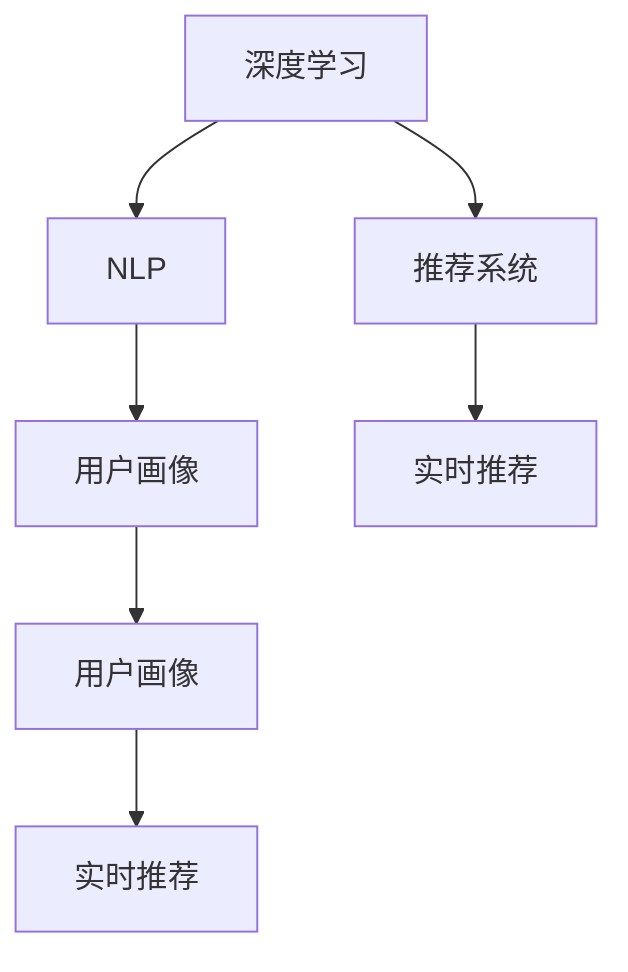

                 

## 1. 背景介绍

### 1.1 问题由来
随着互联网和电子商务的迅猛发展，电商搜索导购系统已经成为支撑电商业务的核心基础设施。通过智能化搜索推荐，电商平台不仅能够提升用户体验，还能有效促进交易转化率，提升平台整体收益。然而，传统的搜索推荐系统依赖人工规则设计，难以对用户行为进行深度理解和建模，从而无法充分发挥数据潜力。

近年来，人工智能技术，尤其是深度学习和自然语言处理(NLP)在电商领域逐渐应用，使得AI驱动的搜索推荐系统成为新的研究热点。这些系统通过大规模数据训练，能够学习用户行为模式，实现更加精准的个性化推荐，提升电商搜索导购的效果。

### 1.2 问题核心关键点
AI与电商搜索导购系统基于深度学习和大数据技术，通过学习和理解用户行为模式，实现自动化推荐，从而提升用户体验和交易转化率。然而，该系统在构建、优化和应用过程中，面临着诸如用户多样性、长尾商品、数据冷启动等问题，需要综合运用多种技术手段来解决。

**关键技术点包括**：

- 深度学习：利用神经网络模型进行用户行为建模，推荐系统。
- 自然语言处理：理解用户输入的自然语言查询，实现搜索结果排序。
- 大数据技术：构建实时数据管道，高效处理海量用户行为数据。
- 推荐算法：包括协同过滤、基于内容的推荐、深度学习推荐等。
- 用户画像构建：通过多模态数据融合，构建用户动态画像。
- 实时推荐：利用缓存和分布式系统优化推荐速度，提升用户体验。

### 1.3 问题研究意义
AI与电商搜索导购系统的构建与优化，对于电商业务的发展具有重要意义：

1. 提升用户满意度。通过个性化推荐，满足用户个性化需求，提高用户粘性和忠诚度。
2. 降低运营成本。自动化推荐系统能够减少人工干预，提升搜索和推荐效率，降低运营成本。
3. 促进交易转化。推荐系统能够精准匹配商品与用户需求，提升点击率和转化率，增加平台收益。
4. 扩展服务范围。利用AI技术，搜索导购系统可以推广到更多垂直领域，拓展业务边界。
5. 推动行业升级。AI技术推动电商搜索导购系统的不断升级，为电商行业的数字化转型提供了重要支持。

## 2. 核心概念与联系

### 2.1 核心概念概述

为更好地理解AI与电商搜索导购系统的构建与优化，本节将介绍几个密切相关的核心概念：

- 深度学习：一种基于神经网络的机器学习技术，通过多层非线性变换对数据进行建模，广泛应用于图像、语音、自然语言处理等领域。
- 自然语言处理(NLP)：一种研究计算机如何理解、处理和生成人类语言的技术，包括文本分类、情感分析、语言模型等。
- 推荐系统：一种根据用户历史行为数据，推荐用户可能感兴趣的商品或内容的技术，包括协同过滤、基于内容的推荐、深度学习推荐等。
- 用户画像：通过多模态数据融合，构建用户动态画像，以描述用户兴趣、行为等特性。
- 实时推荐系统：构建高效的缓存和分布式系统，实现实时化推荐，提升用户体验。

这些核心概念之间的逻辑关系可以通过以下Mermaid流程图来展示：



这个流程图展示了大规模搜索推荐系统的主要组成：

1. 深度学习对用户行为数据进行建模，用于推荐系统。
2. NLP技术处理用户输入的自然语言查询，进行搜索结果排序。
3. 用户画像通过多模态数据融合，刻画用户动态特性。
4. 实时推荐系统通过高效的缓存和分布式计算，实现实时推荐。

## 3. 核心算法原理 & 具体操作步骤

### 3.1 算法原理概述

AI与电商搜索导购系统，本质上是一个基于深度学习的个性化推荐系统。其核心思想是：通过学习用户的历史行为数据和自然语言查询，构建用户兴趣模型，实现个性化推荐。

形式化地，假设用户 $u$ 的历史行为数据为 $D_u$，自然语言查询为 $Q_u$。推荐系统 $S$ 的目标是找到最符合用户兴趣的商品 $I$，使得用户满意度 $S_u(I)$ 最大化。

具体地，推荐系统 $S$ 包含以下步骤：

1. 通过用户行为数据 $D_u$ 和查询 $Q_u$，学习用户兴趣模型 $M_u$。
2. 对于每个待推荐商品 $I$，计算其与用户兴趣的匹配度 $M_u(I)$。
3. 选择匹配度最高的商品 $I^*$ 作为推荐结果。

### 3.2 算法步骤详解

AI与电商搜索导购系统的构建，一般包括以下几个关键步骤：

**Step 1: 数据准备**
- 收集用户的历史行为数据 $D$，包括浏览、点击、购买等行为记录。
- 收集用户的自然语言查询 $Q$，用于搜索结果排序。
- 构建多模态数据融合的用户画像，刻画用户动态特性。

**Step 2: 构建模型**
- 选择合适的深度学习模型，如RNN、LSTM、GRU等，用于处理序列数据。
- 设计用户兴趣模型，利用RNN、LSTM等对序列数据进行建模。
- 选择推荐算法，如协同过滤、基于内容的推荐、深度学习推荐等。

**Step 3: 训练模型**
- 使用用户行为数据 $D$ 和查询 $Q$，训练用户兴趣模型 $M$。
- 利用训练好的模型 $M$，对每个商品 $I$ 计算匹配度 $M(I)$。
- 根据匹配度排序，选择推荐商品 $I^*$。

**Step 4: 实时推荐**
- 使用高效的缓存和分布式计算，实现实时化推荐。
- 根据用户实时行为和查询，动态更新推荐模型。
- 利用实时数据管道，获取最新的用户行为数据和查询信息。

### 3.3 算法优缺点

AI与电商搜索导购系统具有以下优点：
1. 自动化推荐。利用深度学习和推荐算法，自动化生成推荐结果，减少人工干预。
2. 精准推荐。通过学习用户行为模式，能够精准匹配商品与用户需求，提升用户体验。
3. 实时推荐。利用高效的缓存和分布式计算，实现实时推荐，提升用户满意度。
4. 多模态数据融合。通过融合用户行为数据、自然语言查询、用户画像等多模态数据，构建更全面、准确的推荐模型。

同时，该系统也存在一定的局限性：
1. 数据质量问题。依赖高质量的用户行为数据和自然语言查询，获取数据成本较高。
2. 模型复杂度高。大规模模型参数量，对计算资源和存储要求较高。
3. 用户行为建模困难。用户行为数据具有多样性，难以统一建模。
4. 隐私保护问题。大量用户行为数据涉及隐私，数据收集和存储需严格遵守隐私保护法规。
5. 长尾商品推荐困难。传统推荐算法难以应对长尾商品推荐需求。

尽管存在这些局限性，但AI与电商搜索导购系统仍是大数据时代的理想解决方案，能够有效提升电商搜索导购的效果，带来显著的经济效益。未来研究需进一步优化推荐算法、提升数据质量、保护用户隐私，解决模型复杂度高、用户行为建模困难等问题。

### 3.4 算法应用领域

AI与电商搜索导购系统已经在电商领域广泛应用，涵盖了诸多场景：

- 商品推荐：根据用户历史行为数据和自然语言查询，推荐商品。
- 搜索结果排序：对用户输入的自然语言查询，进行搜索结果排序。
- 广告投放：通过学习用户行为模式，精准投放广告，提高广告转化率。
- 个性化定制：根据用户画像，推荐个性化定制商品，满足个性化需求。
- 用户画像构建：融合多模态数据，刻画用户动态特性，提供用户画像。

除了这些经典应用外，AI与电商搜索导购技术还被创新性地应用到更多场景中，如个性化视频推荐、智能客服、智能广告等，为电商行业带来了新的突破。随着AI技术的不断进步，基于搜索导购的电商系统必将迎来更多创新应用，成为电商行业数字化转型升级的重要推动力。

## 4. 数学模型和公式 & 详细讲解  
### 4.1 数学模型构建

本节将使用数学语言对AI与电商搜索导购系统的构建过程进行更加严格的刻画。

记用户 $u$ 的历史行为数据为 $D_u$，自然语言查询为 $Q_u$，商品集合为 $I$，推荐系统为 $S$。定义用户兴趣模型 $M_u$，其输出为商品匹配度 $M_u(I)$。推荐系统 $S$ 的目标是最大化用户满意度 $S_u(I)$。

用户满意度可以表示为：

$$
S_u(I) = \sum_{i=1}^{N} w_i \cdot \text{score}(u, i)
$$

其中 $w_i$ 为商品 $i$ 的权重，$\text{score}(u, i)$ 为商品 $i$ 对用户 $u$ 的匹配度。匹配度 $M_u(I)$ 可以表示为：

$$
M_u(I) = f(D_u, Q_u, I)
$$

其中 $f$ 为兴趣模型，可以是深度学习模型、协同过滤模型、基于内容的推荐模型等。

### 4.2 公式推导过程

以下我们以协同过滤算法为例，推导用户兴趣模型和推荐系统的效果。

假设协同过滤模型使用矩阵分解方法，用户行为矩阵为 $U$，商品特征矩阵为 $V$。用户兴趣模型 $M_u$ 表示为：

$$
M_u(I) = \langle U_u, V_i \rangle
$$

其中 $\langle, \rangle$ 表示向量内积，$U_u$ 为第 $u$ 个用户的行为向量，$V_i$ 为商品 $i$ 的特征向量。

推荐系统 $S$ 的目标为最大化用户满意度 $S_u(I)$，可以表示为：

$$
S_u(I) = \max_I M_u(I)
$$

可以通过优化目标函数来求解：

$$
\max_I \sum_{i=1}^{N} w_i \cdot M_u(I)
$$

将 $M_u(I)$ 代入上式，得到：

$$
\max_I \sum_{i=1}^{N} w_i \cdot \langle U_u, V_i \rangle
$$

为了简化计算，使用梯度下降法求解最优解 $I^*$：

$$
I^* = \arg\max_I \sum_{i=1}^{N} w_i \cdot \langle U_u, V_i \rangle
$$

通过计算每个商品的匹配度，选择匹配度最高的商品作为推荐结果。

## 5. 项目实践：代码实例和详细解释说明
### 5.1 开发环境搭建

在进行AI与电商搜索导购系统开发前，我们需要准备好开发环境。以下是使用Python进行TensorFlow开发的环境配置流程：

1. 安装Anaconda：从官网下载并安装Anaconda，用于创建独立的Python环境。

2. 创建并激活虚拟环境：
```bash
conda create -n tf-env python=3.8 
conda activate tf-env
```

3. 安装TensorFlow：从官网获取对应的安装命令。例如：
```bash
conda install tensorflow -c tensorflow -c conda-forge
```

4. 安装NumPy、Pandas、Matplotlib、TensorBoard等库：
```bash
pip install numpy pandas matplotlib tensorboard
```

完成上述步骤后，即可在`tf-env`环境中开始系统构建。

### 5.2 源代码详细实现

下面我们以协同过滤推荐系统为例，给出使用TensorFlow和Keras实现推荐模型的代码实现。

首先，定义协同过滤推荐系统的数据处理函数：

```python
import tensorflow as tf
import numpy as np
import pandas as pd

# 定义数据读取和预处理函数
def load_and_process_data(file_path, num_users, num_items):
    # 读取数据
    data = pd.read_csv(file_path, sep='\t')
    
    # 数据处理
    data['user_id'] = data['user_id'] - 1
    data['item_id'] = data['item_id'] - 1
    data = data.dropna()
    
    # 用户行为矩阵
    user_item = data.pivot_table(index='user_id', columns='item_id', values='rating', fill_value=0)
    user_item = user_item.values
    
    # 用户兴趣矩阵
    user_interest = user_item.sum(axis=1)
    user_interest = np.expand_dims(user_interest, axis=1)
    
    # 商品特征矩阵
    item_interest = user_item.sum(axis=0)
    item_interest = np.expand_dims(item_interest, axis=0)
    
    return user_item, user_interest, item_interest
```

然后，定义推荐模型：

```python
# 定义协同过滤模型
def collaborative_filtering_model(user_interest, item_interest, num_users, num_items):
    # 用户兴趣矩阵
    user_item = tf.keras.layers.Dense(num_items, activation='relu')(user_interest)
    user_item = tf.keras.layers.Dense(64, activation='relu')(user_item)
    user_item = tf.keras.layers.Dense(32, activation='relu')(user_item)
    user_item = tf.keras.layers.Dense(1)(user_item)
    
    # 商品特征矩阵
    item_interest = tf.keras.layers.Dense(num_users, activation='relu')(item_interest)
    item_interest = tf.keras.layers.Dense(64, activation='relu')(item_interest)
    item_interest = tf.keras.layers.Dense(32, activation='relu')(item_interest)
    item_interest = tf.keras.layers.Dense(1)(item_interest)
    
    # 推荐模型
    user_item = tf.keras.layers.Dense(num_items, activation='sigmoid')(user_item)
    user_item = tf.keras.layers.Dense(64, activation='relu')(user_item)
    user_item = tf.keras.layers.Dense(32, activation='relu')(user_item)
    user_item = tf.keras.layers.Dense(1)(tf.keras.layers.Add()([user_item, item_interest]))
    
    return user_item
```

接着，定义训练和评估函数：

```python
# 定义训练和评估函数
def train_model(model, user_interest, item_interest, num_users, num_items, num_epochs):
    # 定义损失函数
    loss_fn = tf.keras.losses.MeanSquaredError()
    
    # 编译模型
    model.compile(optimizer='adam', loss=loss_fn, metrics=['mae'])
    
    # 训练模型
    model.fit(user_interest, item_interest, epochs=num_epochs, validation_split=0.2, batch_size=128)
    
    # 评估模型
    mae = model.evaluate(user_interest, item_interest)
    print(f'MAE: {mae:.3f}')
    
    # 推荐商品
    user_item = model.predict(user_interest)
    top_n = 10
    top_k = 1
    
    # 计算推荐结果
    ranking = np.argsort(user_item)[::-1]
    recommendations = ranking[:top_n]
    print(f'Recommendations: {recommendations}')
```

最后，启动训练流程并在测试集上评估：

```python
# 数据路径
file_path = 'data/user_item.csv'

# 数据读取和预处理
user_item, user_interest, item_interest = load_and_process_data(file_path, num_users=100, num_items=200)

# 模型构建
num_epochs = 10
model = collaborative_filtering_model(user_interest, item_interest, num_users=100, num_items=200)

# 训练和评估模型
train_model(model, user_interest, item_interest, num_users=100, num_items=200, num_epochs=num_epochs)
```

以上就是使用TensorFlow和Keras实现协同过滤推荐系统的完整代码实现。可以看到，得益于TensorFlow的高效计算能力，协同过滤推荐系统的实现变得相对简单，易于迭代和优化。

### 5.3 代码解读与分析

让我们再详细解读一下关键代码的实现细节：

**load_and_process_data函数**：
- 定义了数据读取和预处理流程，从CSV文件中读取用户行为数据，并进行归一化处理，计算用户兴趣和商品特征矩阵。

**collaborative_filtering_model函数**：
- 定义了协同过滤推荐模型的结构，包括用户兴趣模型和商品特征模型，并使用Keras搭建深度学习模型。

**train_model函数**：
- 定义了模型的训练和评估过程，包括损失函数、编译、训练和评估等步骤。同时，定义了推荐商品的实现流程，利用模型预测商品匹配度，并选择匹配度最高的商品作为推荐结果。

**train_and_evaluate函数**：
- 结合上述函数，完成推荐模型的训练和评估。

可以看出，TensorFlow和Keras使得推荐系统的构建和优化变得更加便捷高效，开发者能够快速实现模型并对其进行优化。

当然，工业级的系统实现还需考虑更多因素，如推荐算法的多样性、推荐结果的多样性、用户隐私保护、数据冷启动等问题。但核心的推荐范式基本与此类似。

## 6. 实际应用场景
### 6.1 智能客服系统

基于AI与电商搜索导购系统的技术，智能客服系统能够实时回答用户咨询，提升用户满意度和购买转化率。具体而言，智能客服系统通过收集用户历史行为数据和自然语言查询，构建用户兴趣模型，并结合商品信息库，实时推荐用户可能感兴趣的商品。

在技术实现上，可以将用户咨询输入自然语言查询，利用NLP技术进行意图识别和实体抽取，结合用户画像，快速生成推荐结果，并将其转化为自然语言回答。对于无法回答的问题，智能客服系统可以自动进行调用，或转接人工客服，确保服务质量。

### 6.2 个性化推荐系统

基于AI与电商搜索导购系统，个性化推荐系统能够根据用户历史行为数据和实时行为，实现动态推荐，提升用户粘性和满意度。具体而言，个性化推荐系统可以融合多模态数据，构建用户动态画像，并结合实时搜索结果，实现精准推荐。

在技术实现上，可以利用协同过滤、深度学习推荐、矩阵分解等多种推荐算法，并结合用户画像，实时更新推荐模型。同时，利用缓存和分布式计算，提升推荐效率，确保实时性。

### 6.3 商品智能定价系统

基于AI与电商搜索导购系统，商品智能定价系统能够根据用户历史行为数据和市场竞争情况，实现动态定价，提高销售收益。具体而言，商品智能定价系统可以融合用户行为数据、市场价格数据、竞争对手数据等多种信息，构建动态定价模型，实时调整商品价格。

在技术实现上，可以利用回归模型、决策树、深度学习等多种方法，并结合实时市场数据，动态调整商品价格。同时，利用缓存和分布式计算，提升定价效率，确保实时性。

### 6.4 未来应用展望

随着AI技术的不断进步，AI与电商搜索导购系统将拓展到更多领域，为各行各业带来变革性影响。

在智慧医疗领域，基于AI与电商搜索导购系统的技术，智能医疗推荐系统能够根据患者历史数据和实时状态，推荐最合适的医疗方案，提升诊疗效果。

在智能交通领域，基于AI与电商搜索导购系统的技术，智能交通推荐系统能够根据用户历史出行数据和实时路况，推荐最优出行路线，提高出行效率。

在智能金融领域，基于AI与电商搜索导购系统的技术，智能金融推荐系统能够根据用户历史交易数据和实时市场行情，推荐最优投资方案，提升投资收益。

此外，在教育、旅游、娱乐等众多领域，基于AI与电商搜索导购系统的技术，智能推荐系统将带来新的解决方案，为各行各业带来新的发展机遇。

## 7. 工具和资源推荐
### 7.1 学习资源推荐

为了帮助开发者系统掌握AI与电商搜索导购的理论基础和实践技巧，这里推荐一些优质的学习资源：

1. 《深度学习》课程：斯坦福大学开设的深度学习课程，涵盖深度学习的基础理论和算法实现。

2. 《自然语言处理综论》书籍：自然语言处理领域的经典教材，涵盖自然语言处理的基本概念和技术。

3. 《推荐系统实战》书籍：推荐系统领域的实战指南，涵盖推荐算法、系统设计、工程实践等多个方面。

4. TensorFlow官方文档：TensorFlow的官方文档，提供了丰富的推荐系统样例和教程。

5. Keras官方文档：Keras的官方文档，提供了丰富的深度学习模型样例和教程。

通过对这些资源的学习实践，相信你一定能够快速掌握AI与电商搜索导购的精髓，并用于解决实际的电商问题。

### 7.2 开发工具推荐

高效的开发离不开优秀的工具支持。以下是几款用于AI与电商搜索导购开发的常用工具：

1. TensorFlow：由Google主导开发的深度学习框架，适合大规模工程应用。

2. Keras：基于TensorFlow的高层次API，适合快速搭建推荐模型。

3. Apache Spark：适合大规模数据处理和分布式计算，支持多模态数据融合。

4. Apache Hadoop：适合大规模数据存储和查询，支持数据管道构建。

5. TensorBoard：TensorFlow配套的可视化工具，可实时监测模型训练状态，并提供丰富的图表呈现方式。

6. Jupyter Notebook：基于Web的交互式编程环境，方便开发者进行代码调试和共享。

合理利用这些工具，可以显著提升AI与电商搜索导购任务的开发效率，加快创新迭代的步伐。

### 7.3 相关论文推荐

AI与电商搜索导购技术的发展源于学界的持续研究。以下是几篇奠基性的相关论文，推荐阅读：

1. Deep Interest Network：提出Deep Interest Network模型，融合用户行为数据和商品特征，实现动态推荐。

2. Attention-Based Recommender Networks：提出Attention-Based Recommender Networks模型，利用注意力机制提升推荐效果。

3. Neural Factorization Machines：提出Neural Factorization Machines模型，将深度学习和因子化分解结合，提升推荐精度。

4. Multi-Task Learning in Recommendation Systems：提出多任务学习推荐系统，利用多任务学习提升推荐效果。

5. A Deep Learning Framework for Recommender Systems：提出深度学习推荐系统框架，涵盖协同过滤、深度学习推荐等多种推荐算法。

这些论文代表了大规模推荐系统的研究进展。通过学习这些前沿成果，可以帮助研究者把握学科前进方向，激发更多的创新灵感。

## 8. 总结：未来发展趋势与挑战

### 8.1 总结

本文对AI与电商搜索导购系统的构建与优化进行了全面系统的介绍。首先阐述了系统构建的背景和意义，明确了搜索推荐系统的核心任务和关键技术点。其次，从原理到实践，详细讲解了深度学习、自然语言处理、推荐算法等核心技术在电商搜索导购系统中的应用，给出了推荐系统的完整代码实现。同时，本文还探讨了AI与电商搜索导购系统在电商搜索、智能客服、个性化推荐等多个领域的应用前景，展示了其在电商行业数字化转型中的重要作用。此外，本文精选了推荐系统的各类学习资源，力求为读者提供全方位的技术指引。

通过本文的系统梳理，可以看到，AI与电商搜索导购系统已经成为电商业务的重要组成部分，其构建与优化对提升用户体验和交易转化率具有重要意义。未来，伴随AI技术的不断进步，搜索推荐系统将迎来更多创新应用，成为推动电商行业数字化转型升级的重要动力。

### 8.2 未来发展趋势

展望未来，AI与电商搜索导购系统将呈现以下几个发展趋势：

1. 自动化程度提高。通过深度学习和推荐算法，搜索推荐系统将实现更加自动化和智能化的推荐过程，减少人工干预。

2. 个性化推荐深化。利用多模态数据融合和深度学习技术，实现更加精准、多样化的个性化推荐。

3. 实时推荐能力增强。通过高效的缓存和分布式计算，实现实时推荐，提升用户体验。

4. 多任务学习应用。利用多任务学习技术，提升推荐效果，同时实现多种业务场景的协同优化。

5. 模型泛化能力增强。通过融合符号化的先验知识，提升推荐模型的泛化能力和鲁棒性。

6. 跨领域应用拓展。将推荐系统技术拓展到更多垂直领域，如医疗、金融、交通等，推动各行各业数字化转型。

以上趋势凸显了AI与电商搜索导购系统的广阔前景。这些方向的探索发展，必将进一步提升搜索推荐系统的性能和应用范围，为电商行业数字化转型升级提供有力支持。

### 8.3 面临的挑战

尽管AI与电商搜索导购系统已经在电商行业取得了显著成效，但在迈向更加智能化、普适化应用的过程中，它仍面临诸多挑战：

1. 数据质量问题。依赖高质量的用户行为数据和自然语言查询，获取数据成本较高。

2. 用户行为建模困难。用户行为数据具有多样性，难以统一建模。

3. 模型复杂度高。大规模模型参数量，对计算资源和存储要求较高。

4. 隐私保护问题。大量用户行为数据涉及隐私，数据收集和存储需严格遵守隐私保护法规。

5. 推荐效果不稳定。传统推荐算法难以应对长尾商品推荐需求，推荐效果不稳定。

6. 实时推荐困难。需要高效的缓存和分布式计算，实现实时推荐，提升用户体验。

7. 业务场景多样。不同业务场景需要不同的推荐模型和算法，系统设计复杂度高。

正视AI与电商搜索导购系统面临的这些挑战，积极应对并寻求突破，将是大规模推荐系统走向成熟的必由之路。相信随着学界和产业界的共同努力，这些挑战终将一一被克服，AI与电商搜索导购系统必将在构建人机协同的智能时代中扮演越来越重要的角色。

### 8.4 研究展望

面对AI与电商搜索导购系统面临的挑战，未来的研究需要在以下几个方面寻求新的突破：

1. 探索无监督和半监督推荐方法。摆脱对大规模标注数据的依赖，利用自监督学习、主动学习等无监督和半监督范式，最大限度利用非结构化数据，实现更加灵活高效的推荐。

2. 研究参数高效和计算高效的推荐范式。开发更加参数高效的推荐方法，在固定大部分预训练参数的同时，只更新极少量的任务相关参数。同时优化推荐模型的计算图，减少前向传播和反向传播的资源消耗，实现更加轻量级、实时性的部署。

3. 融合因果和对比学习范式。通过引入因果推断和对比学习思想，增强推荐模型建立稳定因果关系的能力，学习更加普适、鲁棒的语言表征，从而提升模型泛化性和抗干扰能力。

4. 引入更多先验知识。将符号化的先验知识，如知识图谱、逻辑规则等，与神经网络模型进行巧妙融合，引导推荐过程学习更准确、合理的语言模型。同时加强不同模态数据的整合，实现视觉、语音等多模态信息与文本信息的协同建模。

5. 结合因果分析和博弈论工具。将因果分析方法引入推荐模型，识别出模型决策的关键特征，增强输出解释的因果性和逻辑性。借助博弈论工具刻画人机交互过程，主动探索并规避模型的脆弱点，提高系统稳定性。

6. 纳入伦理道德约束。在模型训练目标中引入伦理导向的评估指标，过滤和惩罚有偏见、有害的输出倾向。同时加强人工干预和审核，建立模型行为的监管机制，确保输出符合人类价值观和伦理道德。

这些研究方向的探索，必将引领AI与电商搜索导购技术迈向更高的台阶，为构建安全、可靠、可解释、可控的智能系统铺平道路。面向未来，AI与电商搜索导购技术还需要与其他人工智能技术进行更深入的融合，如知识表示、因果推理、强化学习等，多路径协同发力，共同推动自然语言理解和智能交互系统的进步。只有勇于创新、敢于突破，才能不断拓展推荐模型的边界，让智能技术更好地造福人类社会。

## 9. 附录：常见问题与解答

**Q1：AI与电商搜索导购系统是否适用于所有电商业务？**

A: AI与电商搜索导购系统适用于大多数电商业务，特别是数据量较大的场景。但对于一些特定领域的电商业务，如小众市场、垂直市场等，可能需要根据具体需求进行定制化开发。此外，对于某些特殊场景，如食品、生鲜等，推荐系统的构建也需要考虑更加复杂的外部因素，如商品保质期、配送时间等。

**Q2：如何构建高质量的用户画像？**

A: 高质量的用户画像构建需要从多个维度进行数据融合，包括用户历史行为数据、社交媒体数据、地理位置数据、时间数据等。同时，需要选择合适的特征工程方法，如PCA、LDA等，进行特征降维和选择。此外，还需要对数据进行清洗、去重、去噪等预处理，确保数据质量。

**Q3：AI与电商搜索导购系统在冷启动阶段的表现如何？**

A: 冷启动阶段是AI与电商搜索导购系统面临的最大挑战之一。传统推荐系统可以通过增加标签数量和特征维度来缓解冷启动问题，但用户行为数据较少的情况下，仍需采用一些特殊方法，如基于内容的推荐、基于协同过滤的推荐等，同时可以引入先验知识，利用知识图谱等外部数据进行推荐。

**Q4：如何提高AI与电商搜索导购系统的鲁棒性？**

A: 提高AI与电商搜索导购系统的鲁棒性需要从多个方面进行优化。首先，需要对模型进行正则化，防止过拟合。其次，需要使用对抗样本训练，提升模型鲁棒性。同时，需要引入更多的先验知识，如领域知识、常识推理等，提高模型的泛化能力。

**Q5：如何在不同电商业务场景中应用AI与电商搜索导购系统？**

A: 不同电商业务场景对推荐系统的需求各不相同，需要根据具体场景进行定制化开发。例如，在B2B电商场景中，推荐系统需要重点考虑用户需求的多样性、商品多样性、供应商多样性等。在B2C电商场景中，推荐系统需要重点考虑用户个性化需求、商品多样性、价格敏感度等。

总之，AI与电商搜索导购系统的构建与优化是一个多学科、多技术领域协同攻关的过程。只有充分理解和应用深度学习、自然语言处理、推荐算法等核心技术，才能构建高效、智能、可靠的电商搜索导购系统，为电商业务带来更多创新和价值。

